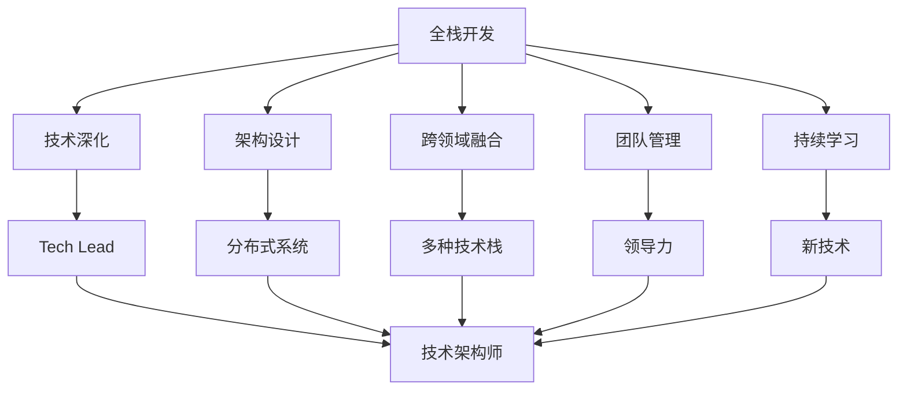

                 

# 从全栈开发到技术架构师的进阶

> 关键词：全栈开发,技术架构师,编程技巧,软件工程,系统设计,云计算,DevOps

## 1. 背景介绍

### 1.1 问题由来
在当今快速变化的软件开发环境中，技术栈的多样化和复杂性不断增加。作为一名全栈开发者，既要精通前端和后端的开发技能，又要具备良好的软件工程能力。但随着职业发展，技术需求的进一步提高，许多全栈开发者在技术层面上遇到瓶颈，难以进一步提升。此时，他们需要转向更高层次的技术角色——技术架构师(Technical Architect)。

技术架构师是软件项目中负责设计系统架构、选择技术和工具、指导团队开发的关键角色。他们通常具有深厚的技术底蕴和广泛的知识面，能够理解复杂系统的设计和实现，提出可行的技术方案，并解决实际开发中的各种难题。本文将系统地介绍从全栈开发到技术架构师进阶的关键要素和方法。

### 1.2 问题核心关键点
从全栈开发到技术架构师的进阶，涉及的不仅是技术能力的提升，更是思维模式、管理能力和软技能的全方位转型。具体核心关键点包括：
- **技术深化**：在特定技术栈内具备专家级的深度和广度知识。
- **架构设计**：理解系统架构的原理和设计原则，能够设计可扩展、高性能的分布式系统。
- **跨领域融合**：能够理解和应用不同领域的知识，如数据库、缓存、消息队列等。
- **团队管理**：具备领导能力，能指导和协调团队成员的工作。
- **持续学习**：保持对新技术的敏感和快速学习的能力。

本文将围绕这些核心关键点，深入探讨从全栈开发到技术架构师所需的技能和策略。

## 2. 核心概念与联系

### 2.1 核心概念概述

为了更好地理解进阶过程，需要掌握几个核心概念：

- **全栈开发(Full-Stack Development)**：指具备前端和后端开发能力的开发者，能够在应用的全生命周期内独立完成开发任务。
- **技术架构师(Technical Architect)**：负责系统架构的设计和优化，指导团队进行高效开发的软件架构师。
- **系统架构(System Architecture)**：指软件系统的整体设计，包括组件、模块、接口、数据流等。
- **软件设计模式(Software Design Patterns)**：解决常见软件设计问题的重用设计方案。
- **DevOps**：通过集成软件开发和运维流程，提升软件交付效率和质量。

这些概念之间的逻辑关系可以通过以下Mermaid流程图来展示：



这个流程图展示了从全栈开发到技术架构师所需的核心技能和转型路径。

## 3. 核心算法原理 & 具体操作步骤

### 3.1 算法原理概述

从全栈开发到技术架构师的进阶，本质上是知识和经验的积累与质的飞跃。主要涉及以下几个关键步骤：

1. **技术深化**：在特定技术栈内达到专家级水平。
2. **架构设计**：理解系统架构的原理，能够设计可扩展的分布式系统。
3. **跨领域融合**：掌握多种技术栈，理解不同领域的技术和工具。
4. **团队管理**：提升领导力和沟通协调能力，指导团队高效工作。
5. **持续学习**：保持对新技术的敏感和快速学习的能力。

### 3.2 算法步骤详解

以下是每个步骤的详细步骤：

#### 3.2.1 技术深化
- **学习深度**：选择一两个技术栈进行深入学习，掌握其核心原理和高级特性。
- **实战经验**：参与复杂项目，解决实际问题，积累实战经验。
- **开源贡献**：参与开源项目，贡献代码或文档，提升技术影响力。

#### 3.2.2 架构设计
- **学习架构设计**：阅读架构设计的经典书籍和文章，理解架构设计的基本原则。
- **实践设计**：参与或主导小规模架构设计项目，锻炼设计能力。
- **持续改进**：根据项目反馈，不断优化架构设计。

#### 3.2.3 跨领域融合
- **多技术栈学习**：了解和掌握多种技术栈，包括前端、后端、数据库、缓存等。
- **集成应用**：在实际项目中集成多种技术栈，实现功能模块的协同工作。
- **解决方案**：设计跨领域的解决方案，提升技术整合能力。

#### 3.2.4 团队管理
- **领导力提升**：参加管理培训，提升领导力和沟通能力。
- **团队协作**：组织团队建设活动，增强团队凝聚力。
- **任务协调**：通过Scrum、Kanban等敏捷方法，协调团队工作。

#### 3.2.5 持续学习
- **跟踪最新技术**：定期阅读技术博客和论文，关注最新技术动态。
- **在线课程**：参加在线课程，不断提升技术能力。
- **社区参与**：参加技术社区，与同行交流学习。

### 3.3 算法优缺点

技术深化、架构设计、跨领域融合、团队管理和持续学习各有优缺点：

- **技术深化**：
  - 优点：成为某个技术栈的专家，解决复杂问题。
  - 缺点：可能导致知识面窄，难以应对复杂的多技术栈场景。
  
- **架构设计**：
  - 优点：理解架构设计的原理，设计高效的系统。
  - 缺点：可能缺乏实际项目经验，难以落地实现。
  
- **跨领域融合**：
  - 优点：掌握多种技术栈，集成多样化功能。
  - 缺点：学习成本高，需要大量时间和精力。
  
- **团队管理**：
  - 优点：提升领导力和协作能力，高效管理团队。
  - 缺点：需要不断学习管理技巧，可能初期效果不明显。
  
- **持续学习**：
  - 优点：保持技术敏感度，随时掌握新技术。
  - 缺点：需要持续投入时间和精力，可能难以保持平衡。

### 3.4 算法应用领域

这些技能和算法在多个领域有广泛的应用：

- **软件开发**：设计高效的软件架构，解决复杂问题。
- **云计算**：设计云原生架构，优化云平台性能。
- **大数据**：设计大数据架构，处理大规模数据。
- **移动开发**：设计移动应用架构，提升用户体验。
- **物联网**：设计IoT架构，实现设备间协同。

## 4. 数学模型和公式 & 详细讲解 & 举例说明

### 4.1 数学模型构建

为了更好地理解进阶过程，可以通过数学模型来描述技术深化和架构设计的关键要素。

记技术栈深度为 $d$，架构设计能力为 $a$，跨领域融合能力为 $c$，团队管理能力为 $m$，持续学习能力为 $l$。设 $x$ 为全栈开发者在上述能力上的初始值，$y$ 为技术架构师在这些能力上的目标值。则进阶过程可以建模为：

$$
y = f(x, d, a, c, m, l)
$$

其中 $f$ 为转换函数，反映了能力提升的路径和方式。

### 4.2 公式推导过程

为了推导 $f$ 的具体形式，我们假设：

- **技术深化**：深度为 $d$ 的能力提升为 $k_1 \times d$，$k_1$ 为技术深化系数。
- **架构设计**：设计能力提升为 $k_2 \times a$，$k_2$ 为设计提升系数。
- **跨领域融合**：融合能力提升为 $k_3 \times c$，$k_3$ 为融合提升系数。
- **团队管理**：管理能力提升为 $k_4 \times m$，$k_4$ 为管理提升系数。
- **持续学习**：学习能力提升为 $k_5 \times l$，$k_5$ 为学习提升系数。

将这些提升因素代入 $f$ 函数，得到：

$$
f(x, d, a, c, m, l) = k_1 \times d \times k_2 \times a \times k_3 \times c \times k_4 \times m \times k_5 \times l
$$

### 4.3 案例分析与讲解

以一个具体案例来展示进阶过程：

1. **初始状态**：假设全栈开发者 $x$ 在技术深化、架构设计、跨领域融合、团队管理和持续学习上的初始值分别为 $x_1, x_2, x_3, x_4, x_5$。
2. **技术深化**：选择前端技术栈进行深化，$k_1 = 1.5$，$x_1$ 提升至 $1.5 \times x_1$。
3. **架构设计**：阅读经典书籍，参加设计培训，$k_2 = 1.2$，$x_2$ 提升至 $1.2 \times x_2$。
4. **跨领域融合**：学习大数据技术，集成数据库和缓存，$k_3 = 1.1$，$x_3$ 提升至 $1.1 \times x_3$。
5. **团队管理**：参加管理培训，提升领导力，$k_4 = 1.3$，$x_4$ 提升至 $1.3 \times x_4$。
6. **持续学习**：定期阅读技术博客，参加在线课程，$k_5 = 1.4$，$x_5$ 提升至 $1.4 \times x_5$。

将这些提升值代入 $f$ 函数，得到技术架构师 $y$ 的值：

$$
y = 1.5 \times 1.2 \times 1.1 \times 1.3 \times 1.4 \times x_1 \times x_2 \times x_3 \times x_4 \times x_5
$$

通过这个公式，可以清晰地看到各个能力对进阶过程的贡献和影响。

## 5. 项目实践：代码实例和详细解释说明

### 5.1 开发环境搭建

在进行技术深化和架构设计的过程中，需要一个良好的开发环境。以下是Python开发环境的配置步骤：

1. **安装Python**：从官网下载并安装Python，建议选择3.x版本。
2. **安装pip**：在Python安装目录中运行 `pip install --upgrade pip` 安装pip包管理器。
3. **安装Virtualenv**：运行 `pip install virtualenv` 安装虚拟环境工具。
4. **创建虚拟环境**：运行 `virtualenv venv` 创建虚拟环境，`venv` 为环境名称。
5. **激活虚拟环境**：运行 `source venv/bin/activate` 激活虚拟环境。

### 5.2 源代码详细实现

以下是一个简单的Web应用项目，演示技术深化和架构设计的过程：

```python
# main.py
from flask import Flask, request

app = Flask(__name__)

@app.route('/')
def index():
    return 'Hello, World!'

if __name__ == '__main__':
    app.run(debug=True)
```

该应用使用Flask框架，是一个典型的Web应用项目。下面是对应的Dockerfile和部署流程：

```dockerfile
FROM python:3.8-slim

WORKDIR /app

COPY . .

RUN pip install -r requirements.txt

EXPOSE 5000

CMD ["python", "main.py"]
```

```bash
# 构建Docker镜像
docker build -t mywebapp .
# 运行Docker容器
docker run -p 5000:5000 mywebapp
```

### 5.3 代码解读与分析

以上代码和配置文件展示了从Flask应用开发到Docker容器部署的全过程。每个步骤都有详细的解释：

- **Flask应用开发**：使用Flask框架快速搭建Web应用，实现基本的路由和请求处理。
- **虚拟环境和依赖管理**：使用Virtualenv创建和管理Python环境，使用pip安装依赖。
- **Docker化部署**：使用Dockerfile定义应用环境和启动命令，通过Docker运行应用。

## 6. 实际应用场景

### 6.1 软件开发

在软件开发领域，技术架构师负责设计系统架构，指导团队开发高效的应用。以下是一个典型的Web应用架构设计案例：

1. **前端架构**：使用React或Vue等框架，实现用户界面。
2. **后端架构**：使用Django或Flask等框架，处理业务逻辑。
3. **数据库架构**：使用MySQL或PostgreSQL等数据库，存储和管理数据。
4. **缓存架构**：使用Redis或Memcached等缓存系统，提升系统性能。
5. **消息队列架构**：使用RabbitMQ或Kafka等消息队列，实现异步通信。

### 6.2 云计算

在云计算领域，技术架构师设计云原生架构，优化云平台性能。以下是一个典型的云原生架构设计案例：

1. **云平台选择**：选择AWS、Google Cloud或阿里云等云平台。
2. **容器化部署**：使用Docker容器化应用，部署在Kubernetes集群中。
3. **服务网格**：使用Istio等服务网格，实现服务发现、负载均衡、流量控制等功能。
4. **日志和监控**：使用ELK Stack或Prometheus等日志和监控系统，实时监控应用性能。
5. **DevOps工具链**：使用Jenkins或GitLab CI等工具链，实现自动化构建和部署。

### 6.3 大数据

在大数据领域，技术架构师设计大数据架构，处理大规模数据。以下是一个典型的大数据架构设计案例：

1. **数据湖架构**：使用Hadoop或Spark等大数据框架，构建数据湖。
2. **数据管道**：使用Apache Kafka或Flume等数据管道，实时采集和传输数据。
3. **数据存储**：使用Hive或HBase等数据存储系统，存储和管理大数据。
4. **数据处理**：使用Spark SQL或Flink等数据处理框架，进行大数据计算。
5. **数据可视化**：使用Tableau或Power BI等数据可视化工具，展示数据结果。

### 6.4 未来应用展望

未来，技术架构师在更多领域有广泛的应用前景：

- **物联网**：设计IoT架构，实现设备间协同。
- **人工智能**：设计AI架构，实现模型训练和推理。
- **区块链**：设计区块链架构，实现去中心化应用。
- **边缘计算**：设计边缘计算架构，优化边缘设备性能。

技术架构师将伴随技术进步不断拓展应用场景，推动软件行业持续创新。

## 7. 工具和资源推荐

### 7.1 学习资源推荐

为了帮助开发者系统掌握技术架构师所需的技能，以下是一些优质的学习资源：

1. **《系统架构师手册》**：全面介绍系统架构设计的经典书籍，涵盖架构设计的原则、技术和工具。
2. **《设计模式：可复用面向对象软件的基础》**：介绍常见设计模式的经典书籍，解决常见软件设计问题。
3. **《云计算技术基础》**：介绍云计算技术和架构的在线课程，涵盖云计算基础和实践。
4. **《Kubernetes实战》**：介绍Kubernetes容器编排技术的在线课程，涵盖Kubernetes部署和管理。
5. **《大数据技术实战》**：介绍大数据技术和架构的在线课程，涵盖Hadoop、Spark等大数据框架。

通过这些资源的学习实践，相信你一定能够快速掌握技术架构师所需的技能，并用于解决实际的系统设计和开发问题。

### 7.2 开发工具推荐

高效的开发离不开优秀的工具支持。以下是几款用于技术架构师开发常用的工具：

1. **JIRA**：项目管理和缺陷跟踪工具，帮助团队高效协作。
2. **Confluence**：文档协作工具，帮助团队共享知识。
3. **Ansible**：自动化运维工具，帮助快速部署和管理应用。
4. **Prometheus**：监控工具，实时监控应用性能。
5. **Grafana**：可视化工具，展示监控数据。
6. **Kubernetes**：容器编排工具，实现应用的自动化部署和扩展。

合理利用这些工具，可以显著提升技术架构师的工作效率，加快技术深化和架构设计的步伐。

### 7.3 相关论文推荐

技术架构师的研究和实践涉及多个前沿技术领域，以下是几篇奠基性的相关论文，推荐阅读：

1. **《分布式系统：原理与实践》**：介绍分布式系统设计和实现的经典书籍，涵盖网络协议、一致性等核心原理。
2. **《云计算：概念与技术》**：介绍云计算技术和架构的学术文章，涵盖云平台和云服务的设计和实现。
3. **《大数据：技术基础与架构》**：介绍大数据技术和架构的学术文章，涵盖大数据框架和应用的设计和实现。
4. **《微服务架构》**：介绍微服务架构设计的学术文章，涵盖微服务架构的设计和实现。
5. **《DevOps实践指南》**：介绍DevOps实践的学术文章，涵盖CI/CD、容器化等DevOps技术和工具。

这些论文代表了大数据和微服务架构设计的发展脉络，通过学习这些前沿成果，可以帮助研究者把握学科前进方向，激发更多的创新灵感。

## 8. 总结：未来发展趋势与挑战

### 8.1 总结

本文对从全栈开发到技术架构师进阶的关键要素和方法进行了全面系统的介绍。首先阐述了技术深化、架构设计、跨领域融合、团队管理和持续学习的核心关键点，明确了从全栈开发者到技术架构师所需的技能和策略。其次，通过数学模型和公式，详细讲解了进阶过程的计算和优化方法。最后，结合实际应用场景，展示了技术架构师在软件开发、云计算、大数据等多个领域的广泛应用。

通过本文的系统梳理，可以看到，从全栈开发到技术架构师进阶需要全面的技术储备和不断的实践积累。只有不断学习、实践和创新，才能成为一名卓越的技术架构师，引领团队实现高效、可靠的软件系统。

### 8.2 未来发展趋势

展望未来，技术架构师在技术深化、架构设计、跨领域融合、团队管理和持续学习等方面将呈现以下几个发展趋势：

1. **技术深化**：技术栈将更加多样化，从单一技术栈向多技术栈演进。
2. **架构设计**：分布式架构将更加普及，微服务、云原生等架构设计将成为主流。
3. **跨领域融合**：跨领域技术融合将更加紧密，数据、AI、区块链等技术将深度结合。
4. **团队管理**：团队协作将更加高效，DevOps、敏捷开发等方法将广泛应用。
5. **持续学习**：学习速度将更快，新技术将更加普及，知识更新将更加频繁。

这些趋势凸显了技术架构师职业发展的广阔前景，必将为软件行业带来更多创新和变革。

### 8.3 面临的挑战

尽管技术架构师在技术深化和架构设计方面具备优势，但在迈向更高层次的过程中，仍面临诸多挑战：

1. **技术更新快**：新技术层出不穷，需要不断学习。
2. **项目复杂**：大型项目复杂度高，需要综合多方资源。
3. **沟通协调**：团队成员多样，需要良好的沟通协调能力。
4. **性能优化**：系统性能要求高，需要不断优化。
5. **安全保障**：系统安全性要求高，需要不断提升。

只有积极应对并克服这些挑战，技术架构师才能在职业道路上不断成长，实现更高的技术水平和职业发展。

### 8.4 研究展望

未来，技术架构师的研究方向将更加注重以下几个方面：

1. **跨领域融合技术**：研究如何将不同领域的技术进行深度融合，提升整体系统能力。
2. **智能化架构设计**：研究如何将AI、大数据等技术应用于系统架构设计，提升系统智能性。
3. **持续学习与自动化**：研究如何实现自动化的持续学习，提升学习效率和效果。
4. **区块链与去中心化**：研究如何将区块链技术应用于系统架构设计，实现去中心化应用。
5. **边缘计算与IoT**：研究如何将边缘计算和IoT技术应用于系统架构设计，优化边缘设备性能。

这些研究方向将推动技术架构师职业不断创新，推动软件行业持续进步。

## 9. 附录：常见问题与解答

**Q1：从全栈开发到技术架构师进阶需要多长时间？**

A: 没有固定的答案，因人而异。一般需要几年时间，具体取决于个人学习能力和实践经验。

**Q2：技术架构师需要具备哪些软技能？**

A: 技术架构师需要具备良好的沟通能力、团队协作能力和领导力，能够协调团队工作，推动项目顺利进行。

**Q3：技术架构师如何选择合适的技术栈？**

A: 根据项目需求和团队特点选择合适的技术栈，考虑性能、可扩展性、稳定性等因素。

**Q4：技术架构师如何进行持续学习？**

A: 定期阅读技术博客和论文，参加在线课程和培训，参加技术社区，与同行交流学习。

**Q5：技术架构师如何提高团队协作效率？**

A: 引入敏捷开发方法，如Scrum、Kanban等，加强团队沟通和协作。

---

作者：禅与计算机程序设计艺术 / Zen and the Art of Computer Programming

