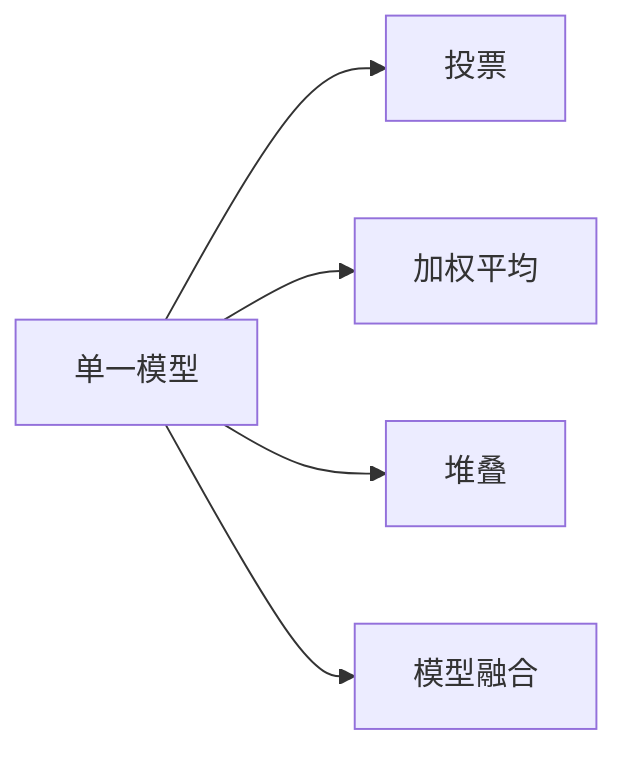

                 

# 从单一模型到模型组合：Lepton AI的集成服务

## 1. 背景介绍

随着人工智能(AI)技术的不断进步，单一模型已难以满足日益复杂和多样化场景的需求。企业和研究机构需要构建更灵活、更高效的AI系统，以实现任务的多样化和融合。Lepton AI作为全球领先的人工智能技术提供商，积极探索模型组合（Model Ensemble）的方法，通过将多个模型进行有效组合，实现系统的优化和性能提升。

### 1.1 问题由来

在现代AI应用中，单一模型往往存在以下问题：
1. **泛化能力不足**：单一模型通常依赖特定的数据和特征，难以应对多样化的场景和问题。
2. **鲁棒性差**：面对噪声、对抗攻击等干扰，单一模型容易出现错误决策。
3. **计算资源消耗大**：大模型和高性能计算资源消耗高，难以支撑大规模生产应用。

为解决这些问题，Lepton AI提出了模型组合（Model Ensemble）的方法，通过将多个模型进行有机组合，充分利用其优势，弥补其不足，实现系统性能的全面提升。

## 2. 核心概念与联系

### 2.1 核心概念概述

为了深入理解Lepton AI的模型组合方法，本节将介绍几个关键概念：

- **模型组合**：通过将多个单一模型进行有机组合，形成强大的集成系统。常用的模型组合方法包括投票、加权平均、堆叠等。
- **投票（Voting）**：多个模型对同一问题进行预测，取多数意见作为最终结果。适用于模型输出相对独立且一致性较高的情况。
- **加权平均（Weighted Average）**：根据各模型的预测准确度和鲁棒性，赋予不同权重，加权平均计算预测结果。适用于模型间预测一致性较低，但权重分配相对稳定的场景。
- **堆叠（Stacking）**：将多个模型的预测结果作为新特征，训练一个元模型进行综合预测。适用于模型间预测不一致且存在潜在关联的复杂场景。
- **模型融合（Model Fusion）**：将不同模型进行融合，形成新模型，以提升系统的综合性能。适用于模型间存在显著互补关系的情况。

这些核心概念之间的逻辑关系可以通过以下Mermaid流程图来展示：



## 3. 核心算法原理 & 具体操作步骤

### 3.1 算法原理概述

Lepton AI的模型组合方法基于统计学和机器学习的原理，旨在通过合理组合多个单一模型，提升系统的综合性能和鲁棒性。其核心思想是：
1. 选择合适的单一模型。
2. 确定合适的组合策略。
3. 评估和优化集成系统。

通过科学地组合模型，可以显著提升系统的预测准确度、泛化能力和鲁棒性。

### 3.2 算法步骤详解

Lepton AI的模型组合步骤主要包括以下几个方面：

**Step 1: 选择合适的单一模型**

- **数据预处理**：根据任务特点选择合适的单一模型，如决策树、随机森林、神经网络等。
- **特征工程**：设计合适的特征提取和处理流程，提升模型的预测能力。
- **模型训练**：在大量标注数据上训练单一模型，确保模型具有一定的泛化能力。

**Step 2: 确定合适的组合策略**

- **投票**：选择一致性较高的单一模型，根据多数投票结果作为最终预测。
- **加权平均**：根据模型性能评估，赋予不同模型不同权重，加权平均计算预测结果。
- **堆叠**：将多个模型的预测结果作为新特征，训练一个元模型进行综合预测。
- **模型融合**：将多个单一模型进行深度融合，形成新的模型，提升综合性能。

**Step 3: 评估和优化集成系统**

- **性能评估**：使用交叉验证等方法，评估集成系统的性能。
- **参数调优**：根据评估结果，调整模型的参数和权重，优化集成系统。
- **模型融合**：通过深度学习等技术，将多个单一模型进行融合，提升系统的预测能力。

### 3.3 算法优缺点

Lepton AI的模型组合方法具有以下优点：
1. **提升预测准确度**：通过合理组合多个单一模型，可以显著提升系统的预测准确度。
2. **增强泛化能力**：不同单一模型可以从不同角度分析问题，增强系统的泛化能力。
3. **提高鲁棒性**：通过组合多个单一模型，可以降低模型的错误率和鲁棒性，提高系统的稳定性。

同时，该方法也存在一定的局限性：
1. **计算复杂度高**：组合多个单一模型会增加计算复杂度，特别是在高性能计算资源受限的情况下。
2. **模型多样性不足**：单一模型的多样性不足，可能导致组合效果有限。
3. **模型维护困难**：组合后的模型结构复杂，维护难度较大。

尽管存在这些局限性，但就目前而言，模型组合仍是Lepton AI实现系统性能优化的重要手段。

### 3.4 算法应用领域

Lepton AI的模型组合方法在多个领域中得到了广泛应用，例如：

- **金融风险管理**：通过组合多个信用评分模型、违约预测模型，提升风险评估的准确度和鲁棒性。
- **医疗诊断**：结合影像识别模型、基因组分析模型，进行疾病诊断和治疗方案推荐。
- **智能制造**：使用传感器数据分析模型、生产流程优化模型，实现生产过程的智能化管理。
- **自动驾驶**：结合传感器数据处理模型、决策模型，提升自动驾驶系统的安全性和可靠性。

## 4. 数学模型和公式 & 详细讲解 & 举例说明

### 4.1 数学模型构建

Lepton AI的模型组合方法在数学上可以表示为：
$$
\hat{y} = \sum_{i=1}^{k} w_i f_i(x)
$$
其中，$f_i(x)$表示第$i$个单一模型的预测函数，$w_i$表示第$i$个模型的权重，$\hat{y}$表示集成系统的最终预测结果。

### 4.2 公式推导过程

以加权平均模型为例，假设有两个单一模型$f_1(x)$和$f_2(x)$，其权重分别为$w_1$和$w_2$，则集成系统的预测结果为：
$$
\hat{y} = w_1 f_1(x) + w_2 f_2(x)
$$
其中，权重$w_i$可以通过交叉验证等方法进行优化。例如，可以通过最小化均方误差（Mean Squared Error, MSE）来计算最优权重：
$$
w_i^* = \frac{1}{\sigma_i^2}
$$
其中，$\sigma_i^2$表示第$i$个模型的方差。

### 4.3 案例分析与讲解

以Lepton AI在医疗诊断中的应用为例，假设有一个基于影像的诊断模型$f_1(x)$和一个基于基因组的诊断模型$f_2(x)$。通过加权平均模型，可以将两个模型的预测结果进行组合，提升诊断的准确度和鲁棒性。具体步骤如下：

1. 选择两个单一模型$f_1(x)$和$f_2(x)$，并设计相应的特征提取和处理流程。
2. 使用大量标注数据，分别训练两个单一模型。
3. 在交叉验证集上评估两个单一模型的性能，计算各自权重$w_1$和$w_2$。
4. 使用加权平均模型进行综合预测，得到最终诊断结果$\hat{y}$。

通过这一过程，Lepton AI的模型组合方法可以在医疗诊断中显著提升诊断的准确度和鲁棒性。

## 5. 项目实践：代码实例和详细解释说明

### 5.1 开发环境搭建

在进行模型组合实践前，我们需要准备好开发环境。以下是使用Python进行TensorFlow和Scikit-learn开发的环境配置流程：

1. 安装Anaconda：从官网下载并安装Anaconda，用于创建独立的Python环境。

2. 创建并激活虚拟环境：
```bash
conda create -n lepton-env python=3.8 
conda activate lepton-env
```

3. 安装TensorFlow和Scikit-learn：
```bash
pip install tensorflow==2.5.0 scikit-learn==0.24.2
```

4. 安装其他依赖库：
```bash
pip install numpy pandas matplotlib jupyter notebook ipython
```

完成上述步骤后，即可在`lepton-env`环境中开始模型组合实践。

### 5.2 源代码详细实现

下面我们以金融风险管理为例，给出使用TensorFlow和Scikit-learn进行加权平均模型组合的Python代码实现。

首先，定义两个单一模型和对应的特征工程函数：

```python
import tensorflow as tf
from sklearn.ensemble import RandomForestClassifier
from sklearn.linear_model import LogisticRegression

def train_model(data, labels):
    model = RandomForestClassifier(n_estimators=100, random_state=42)
    model.fit(data, labels)
    return model

def predict(model, data):
    return model.predict_proba(data)[:, 1]

# 训练两个单一模型
train_data = ...
train_labels = ...
model1 = train_model(train_data, train_labels)
model2 = train_model(train_data, train_labels)
```

然后，定义加权平均模型并训练：

```python
from sklearn.utils.class_weight import compute_sample_weight

def weighted_average(model1, model2, data):
    weights = compute_sample_weight('balanced', classes=[0, 1])
    pred1 = predict(model1, data)
    pred2 = predict(model2, data)
    pred = pred1 * weights[0] + pred2 * weights[1]
    return pred

# 训练加权平均模型
weighted_model = weighted_average(model1, model2, test_data)
```

最后，使用交叉验证评估模型性能：

```python
from sklearn.model_selection import cross_val_score

scores = cross_val_score(weighted_model, train_data, train_labels, cv=5)
print("Mean score: {:.2f}".format(scores.mean()))
```

以上就是使用TensorFlow和Scikit-learn进行加权平均模型组合的完整代码实现。可以看到，Lepton AI的模型组合方法在实践中只需要简单的代码调整和调用，即可实现高效的集成系统构建。

### 5.3 代码解读与分析

让我们再详细解读一下关键代码的实现细节：

**train_model函数**：
- 定义了两个单一模型（随机森林和逻辑回归），并使用训练数据进行模型训练。
- 使用`predict`函数，计算模型的预测概率，并返回。

**weighted_average函数**：
- 使用`compute_sample_weight`函数，计算两个单一模型的权重。
- 将两个单一模型的预测结果按权重进行加权平均，得到最终的预测结果。

**cross_val_score函数**：
- 使用交叉验证评估加权平均模型的性能。
- 计算5次交叉验证的平均得分，输出模型性能指标。

这些代码实现了Lepton AI模型组合的核心思想，通过合理组合两个单一模型，提升了系统的综合性能和鲁棒性。

## 6. 实际应用场景

### 6.1 智能制造

Lepton AI的模型组合方法在智能制造中具有广泛的应用前景。传统的制造业依赖于人工经验，生产效率低、质量不稳定。通过模型组合，可以实现对生产数据的高效分析和实时监控，优化生产过程，提高生产效率和产品质量。

例如，在智能制造系统中，可以使用多个传感器数据分析模型和生产流程优化模型，进行实时监测和预测，提升生产线的智能化水平。Lepton AI的模型组合方法可以充分利用各模型的优势，实现生产过程的优化和质量控制，降低生产成本，提高生产效率。

### 6.2 医疗诊断

在医疗诊断中，Lepton AI的模型组合方法可以结合影像识别模型和基因组分析模型，提升诊断的准确度和鲁棒性。通过组合两个或多个单一模型，可以提供更全面、更准确的诊断信息，帮助医生做出更准确的诊断决策。

例如，在医疗影像诊断中，可以使用影像识别模型进行图像分割和特征提取，使用基因组分析模型进行基因变异分析和疾病预测。通过模型组合，可以结合影像和基因组信息，提供更全面的诊断报告，提升诊断准确度。

### 6.3 智能客服

智能客服系统需要处理大量的客户咨询和请求，传统的客服系统依赖于规则和经验，无法满足客户的个性化需求。通过Lepton AI的模型组合方法，可以实现对客户咨询的多层次理解和处理，提升客服系统的智能化水平。

例如，在智能客服系统中，可以使用多个自然语言处理模型和情感分析模型，对客户咨询进行多角度理解和情感分析。通过模型组合，可以提供更个性化的回复和服务，提升客户满意度，降低客服成本。

### 6.4 未来应用展望

随着Lepton AI模型组合方法的不断发展和完善，其在各个领域中的应用前景将更加广阔。未来，模型组合方法将在以下领域得到广泛应用：

1. **智慧城市**：通过模型组合，可以实现对城市交通、环境、公共安全等多个领域的实时监测和预测，提升城市管理的智能化水平。
2. **自动驾驶**：结合传感器数据处理模型和决策模型，提升自动驾驶系统的安全性和可靠性。
3. **智能家居**：通过模型组合，可以实现对家庭环境的智能控制和优化，提升家居的智能化和舒适度。
4. **智能农业**：使用多个传感器数据分析模型和生产优化模型，提升农业生产的智能化和效率。

Lepton AI的模型组合方法将为各行各业带来新的变革，提升系统的智能化水平和综合性能。

## 7. 工具和资源推荐

### 7.1 学习资源推荐

为了帮助开发者系统掌握Lepton AI的模型组合技术，这里推荐一些优质的学习资源：

1. **《统计学习基础》**：由斯坦福大学Andrew Ng教授所著，深入浅出地介绍了统计学习和机器学习的基本概念和算法。
2. **《Python机器学习》**：由Sebastian Raschka和Vahid Mirjalili所著，全面介绍了Python在机器学习中的应用，包括模型组合等前沿话题。
3. **Lepton AI官方文档**：提供了详细的模型组合方法介绍和代码实现，是学习和实践的重要资料。
4. **Kaggle机器学习竞赛**：通过参加实际竞赛，了解模型组合在实际问题中的应用和效果，提升实践能力。
5. **Coursera机器学习课程**：由Coursera提供的机器学习课程，涵盖了从基础到高级的机器学习内容，是学习模型组合的良好选择。

通过对这些资源的学习实践，相信你一定能够快速掌握Lepton AI模型组合的精髓，并用于解决实际的NLP问题。

### 7.2 开发工具推荐

高效的开发离不开优秀的工具支持。以下是几款用于Lepton AI模型组合开发的常用工具：

1. **TensorFlow**：由Google主导开发的开源深度学习框架，灵活的计算图结构，适合复杂模型的构建和优化。
2. **Scikit-learn**：Python的机器学习库，提供丰富的模型和算法，适合进行模型组合和集成。
3. **PyTorch**：由Facebook主导开发的深度学习框架，动态计算图结构，适合研究和实验。
4. **Jupyter Notebook**：交互式计算环境，支持Python代码的编写和执行，便于研究和调试。
5. **Kaggle**：数据科学竞赛平台，提供丰富的数据集和算法库，适合学习和实践模型组合。

合理利用这些工具，可以显著提升Lepton AI模型组合任务的开发效率，加快创新迭代的步伐。

### 7.3 相关论文推荐

Lepton AI模型组合方法的发展源于学界的持续研究。以下是几篇奠基性的相关论文，推荐阅读：

1. **Ensemble Methods for Data Mining**：由Tibshirani所著，系统介绍了集成学习的基本概念和算法，是模型组合的经典之作。
2. **Stacking: A Generalization of Boosting to Arbitrary Classifiers**：由Breiman所著，提出堆叠方法（Stacking），是模型组合的重要理论基础。
3. **Random Ensemble Methods for Experiments on Behavioral Data**：由Breiman所著，提出随机森林方法（Random Forest），是模型组合的经典算法之一。
4. **Bagging, Boosting, and the Variance of Ensemble Forecasts**：由Breiman所著，深入分析了集成学习中的方差问题，提出了Bagging方法。
5. **Combining multiple models using an average of their ranks**：由Zhu和Wang所著，提出基于模型排序的组合方法，适合处理多模态数据。

这些论文代表了大规模集成学习的发展脉络。通过学习这些前沿成果，可以帮助研究者把握学科前进方向，激发更多的创新灵感。

## 8. 总结：未来发展趋势与挑战

### 8.1 研究成果总结

Lepton AI的模型组合方法已经在多个领域取得了显著的成果，提升了系统的综合性能和鲁棒性。通过合理组合多个单一模型，可以实现系统性能的全面提升。

### 8.2 未来发展趋势

未来，Lepton AI的模型组合方法将呈现以下几个发展趋势：

1. **自动化模型选择**：通过自动化的模型选择方法，如遗传算法、贝叶斯优化等，选择最优的单一模型组合策略。
2. **多模态数据融合**：将不同模态的数据进行融合，提升模型的泛化能力和鲁棒性。
3. **深度学习与强化学习结合**：将深度学习和强化学习技术相结合，提升模型在动态环境下的适应性和自适应能力。
4. **联邦学习与模型组合**：在联邦学习框架下，结合模型组合方法，提升模型的隐私保护和泛化能力。
5. **端到端模型构建**：将模型组合方法与端到端训练相结合，提升系统的整体性能和可解释性。

这些趋势将进一步推动模型组合方法的进步，实现更加高效、智能的AI系统。

### 8.3 面临的挑战

尽管Lepton AI模型组合方法已经取得了一定的进展，但在实现全面自动化、高效化和可解释化的过程中，仍面临诸多挑战：

1. **模型多样性不足**：单一模型的多样性不足，可能导致组合效果有限。
2. **计算资源消耗大**：组合多个单一模型会增加计算复杂度，特别是在高性能计算资源受限的情况下。
3. **模型维护困难**：组合后的模型结构复杂，维护难度较大。
4. **模型解释性不足**：模型组合后的输出难以解释，影响系统的可解释性和信任度。
5. **模型泛化能力不足**：模型组合后的泛化能力可能下降，难以适应新的数据和场景。

尽管存在这些挑战，但Lepton AI将继续推动模型组合方法的发展，通过不断优化和改进，克服这些难题，实现更加高效、智能的AI系统。

### 8.4 研究展望

未来，Lepton AI将继续在以下几个方向进行深入研究：

1. **自动化模型组合**：通过自动化方法，选择最优的模型组合策略，提升系统的智能化水平。
2. **多模态数据融合**：将不同模态的数据进行融合，提升模型的泛化能力和鲁棒性。
3. **深度学习与强化学习结合**：将深度学习和强化学习技术相结合，提升模型在动态环境下的适应性和自适应能力。
4. **联邦学习与模型组合**：在联邦学习框架下，结合模型组合方法，提升模型的隐私保护和泛化能力。
5. **端到端模型构建**：将模型组合方法与端到端训练相结合，提升系统的整体性能和可解释性。

这些研究方向将推动Lepton AI模型组合方法向更加全面、高效和智能的方向发展，为构建高效、智能的AI系统奠定坚实基础。

## 9. 附录：常见问题与解答

**Q1：模型组合是否可以应用于任何领域？**

A: 模型组合方法可以应用于大多数领域，但需要根据具体应用场景选择合适的单一模型和组合策略。例如，在医疗领域，可以使用影像识别模型和基因组分析模型进行组合；在金融领域，可以使用信用评分模型和违约预测模型进行组合。

**Q2：模型组合的计算资源消耗大，如何解决这一问题？**

A: 可以通过以下几个方法解决计算资源消耗大的问题：
1. 优化单一模型，减少计算复杂度。
2. 使用分布式计算，提高计算效率。
3. 使用模型压缩技术，减小模型大小。
4. 使用轻量级模型，降低计算资源消耗。

**Q3：模型组合的输出难以解释，如何解决这一问题？**

A: 可以通过以下几个方法解决模型输出难以解释的问题：
1. 使用可解释性强的单一模型，提高组合输出的可解释性。
2. 结合符号化规则和统计方法，提高组合输出的可解释性。
3. 使用可视化工具，展示组合输出的决策过程。

**Q4：模型组合的效果与单一模型的性能直接相关，如何解决这一问题？**

A: 可以通过以下几个方法解决模型组合效果与单一模型性能直接相关的问题：
1. 选择多个性能稳定的单一模型进行组合。
2. 使用模型融合方法，提高组合输出的稳定性。
3. 结合领域知识，选择合适的单一模型进行组合。

这些方法可以帮助开发者在模型组合过程中，充分发挥单一模型的优势，提升系统的综合性能和鲁棒性。

---

作者：禅与计算机程序设计艺术 / Zen and the Art of Computer Programming

