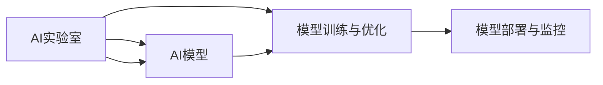

                 

# 从实验室到生产环境：Lepton AI的AI落地之路

## 1. 背景介绍

### 1.1 问题由来
近年来，随着人工智能（AI）技术的飞速发展，越来越多的AI实验室成果走向生产环境，为各行各业带来了巨大的价值。然而，将AI技术从实验室到生产环境的过程中，面临着诸多挑战。诸如数据获取、模型训练、部署、监控等环节都需要精心设计和管理，稍有不慎，就可能产生不可预料的错误。因此，本文将介绍Lepton AI在AI技术落地过程中的经验和方法，旨在帮助更多企业更好地将AI技术落地到实际应用中。

## 2. 核心概念与联系

### 2.1 核心概念概述

在Lepton AI的AI落地实践中，我们引入了以下核心概念，并分析了它们之间的联系。

- **AI实验室**：AI实验室是AI技术研发和实验的主要场所，通常由数据科学家、软件工程师和研究人员组成，通过科学实验，探索新技术和方法，解决实际问题。

- **AI模型**：AI模型是在AI实验室中训练的算法模型，如神经网络、决策树、集成模型等，用于对数据进行预测、分类、聚类等任务。

- **数据集**：数据集是AI模型训练的基础，包括标注数据、非标注数据和数据增强技术等。

- **模型训练与优化**：模型训练与优化是通过科学的方法和算法，对AI模型进行训练和调优的过程，以提高模型的预测精度和泛化能力。

- **模型部署与监控**：模型部署与监控是将训练好的AI模型部署到实际应用环境中，并对其运行状态进行监控和管理的过程。

这些概念之间的关系如图2所示，它们共同构成了AI技术从实验室到生产环境的完整生命周期。



## 3. 核心算法原理 & 具体操作步骤

### 3.1 算法原理概述

AI模型从实验室到生产环境的落地过程，可以概括为模型训练、模型优化、模型部署和模型监控四个主要步骤。

- **模型训练**：在AI实验室中，通过对数据集进行训练，学习数据之间的规律，生成模型。
- **模型优化**：对模型进行调优，包括超参数调优、正则化等，以提高模型性能。
- **模型部署**：将训练好的模型部署到实际应用环境中，并集成到应用系统中。
- **模型监控**：对模型运行状态进行监控，及时发现和解决问题，保障模型稳定运行。

### 3.2 算法步骤详解

以下将详细介绍AI模型从实验室到生产环境的落地步骤。

**步骤1：准备数据集**

在AI实验室中，首先需要准备训练所需的数据集。数据集包括标注数据、非标注数据和数据增强技术等。

**步骤2：模型训练**

在准备好数据集后，可以在AI实验室中使用不同的模型和算法进行训练。Lepton AI通常会采用以下步骤：

1. **数据预处理**：对数据进行清洗、归一化、特征工程等预处理操作。
2. **选择模型**：选择合适的模型架构和超参数。
3. **模型训练**：使用训练数据对模型进行训练，并使用验证数据进行验证和调优。

**步骤3：模型优化**

在模型训练过程中，可能存在模型过拟合、欠拟合等问题。为了解决这些问题，Lepton AI通常会采用以下方法：

1. **超参数调优**：通过网格搜索、随机搜索、贝叶斯优化等方法，寻找最优超参数。
2. **正则化**：通过L1、L2正则化、Dropout等方法，防止模型过拟合。
3. **集成学习**：通过模型集成技术，提高模型的泛化能力和鲁棒性。

**步骤4：模型部署**

模型训练和优化完成后，需要将其部署到实际应用环境中。Lepton AI通常会采用以下方法：

1. **选择合适的部署平台**：如AWS、Google Cloud、Kubernetes等。
2. **模型封装**：将模型封装为标准化的服务接口，便于调用。
3. **模型推理优化**：优化模型推理过程，提升推理速度和准确性。

**步骤5：模型监控**

模型部署后，需要对其进行持续监控和维护。Lepton AI通常会采用以下方法：

1. **性能监控**：监控模型的预测精度、响应时间等性能指标。
2. **异常检测**：使用异常检测算法，及时发现模型的异常情况。
3. **模型更新**：根据数据变化和新需求，更新模型并重新部署。

### 3.3 算法优缺点

**优点**

1. **可扩展性**：AI模型可以无缝集成到现有应用系统中，提高系统的自动化和智能化水平。
2. **灵活性**：根据实际需求，可以灵活选择不同的模型和算法，满足不同的业务场景。
3. **可复用性**：训练好的模型可以复用到其他类似任务中，提高开发效率。

**缺点**

1. **数据依赖**：模型的性能依赖于数据质量，数据获取和处理成本较高。
2. **计算资源消耗大**：大模型训练和推理过程需要大量的计算资源，可能带来成本压力。
3. **模型维护复杂**：模型部署后，需要持续监控和维护，维护成本较高。

### 3.4 算法应用领域

基于Lepton AI的经验，AI模型在以下几个领域有广泛的应用：

- **金融**：用于信用评分、风险评估、股票预测等。
- **医疗**：用于疾病诊断、医学影像分析、个性化治疗等。
- **零售**：用于客户行为分析、商品推荐、库存管理等。
- **制造**：用于预测设备故障、优化生产流程、质量控制等。
- **物流**：用于路径规划、配送优化、客户服务自动化等。

## 4. 数学模型和公式 & 详细讲解 & 举例说明

### 4.1 数学模型构建

在AI模型落地过程中，需要构建数学模型以描述模型的输入、输出和优化目标。以下是一个简单的线性回归模型的数学模型构建过程。

设模型的输入为 $X$，输出为 $Y$，模型参数为 $\theta$，则线性回归模型的数学模型为：

$$
Y = \theta_0 + \theta_1 X_1 + \theta_2 X_2 + ... + \theta_n X_n + \epsilon
$$

其中，$\theta_0$ 为截距，$\theta_i$ 为第 $i$ 个特征的系数，$\epsilon$ 为误差项。

### 4.2 公式推导过程

在线性回归模型中，常用的优化目标是均方误差（MSE），即：

$$
\text{MSE} = \frac{1}{N} \sum_{i=1}^N (Y_i - \hat{Y}_i)^2
$$

其中，$Y_i$ 为实际输出，$\hat{Y}_i$ 为模型预测输出，$N$ 为样本数。

为了最小化均方误差，通常使用梯度下降法进行优化。梯度下降法的基本公式为：

$$
\theta_j = \theta_j - \eta \frac{\partial \text{MSE}}{\partial \theta_j}
$$

其中，$\eta$ 为学习率，$\frac{\partial \text{MSE}}{\partial \theta_j}$ 为模型参数 $\theta_j$ 的梯度。

### 4.3 案例分析与讲解

以下以一个简单的信用评分模型为例，分析其训练和优化的过程。

假设我们有一组信用评分数据，包括贷款金额、还款记录、信用历史等特征，以及对应的信用评分结果。我们可以使用线性回归模型对这组数据进行建模，预测新申请贷款的信用评分。

首先，我们需要对数据进行预处理，包括数据清洗、归一化、特征工程等操作。然后，我们选择线性回归模型作为模型架构，并设置超参数。接下来，我们使用训练数据对模型进行训练，并使用验证数据进行调优，找到最优超参数。最后，将训练好的模型部署到实际应用环境中，并对其进行持续监控和维护。

## 5. 项目实践：代码实例和详细解释说明

### 5.1 开发环境搭建

在AI模型从实验室到生产环境的落地过程中，开发环境的搭建非常重要。以下是在Lepton AI中使用PyTorch搭建开发环境的步骤。

1. **安装Python**：
   ```
   conda create --name pytorch-env python=3.8
   conda activate pytorch-env
   ```

2. **安装PyTorch**：
   ```
   pip install torch torchvision torchaudio
   ```

3. **安装相关库**：
   ```
   pip install pandas numpy scikit-learn matplotlib tqdm jupyter notebook ipython
   ```

4. **安装模型训练框架**：
   ```
   pip install torchtext
   ```

### 5.2 源代码详细实现

以下是一个简单的线性回归模型的源代码实现。

```python
import torch
import torch.nn as nn
import torch.optim as optim
from torch.utils.data import DataLoader

# 定义线性回归模型
class LinearRegression(nn.Module):
    def __init__(self, input_size, output_size):
        super(LinearRegression, self).__init__()
        self.linear = nn.Linear(input_size, output_size)

    def forward(self, x):
        out = self.linear(x)
        return out

# 定义数据集
class MyDataset(torch.utils.data.Dataset):
    def __init__(self, x, y):
        self.x = x
        self.y = y

    def __len__(self):
        return len(self.x)

    def __getitem__(self, index):
        x = torch.tensor(self.x[index])
        y = torch.tensor(self.y[index])
        return x, y

# 定义训练函数
def train(model, optimizer, loss_func, dataloader, epochs):
    for epoch in range(epochs):
        for i, (x, y) in enumerate(dataloader):
            optimizer.zero_grad()
            output = model(x)
            loss = loss_func(output, y)
            loss.backward()
            optimizer.step()
            if (i+1) % 100 == 0:
                print(f'Epoch: {epoch+1}, Batch: {i+1}, Loss: {loss.item()}')

# 加载数据集
x = [[1, 2, 3], [4, 5, 6], [7, 8, 9]]
y = [1, 2, 3]
dataset = MyDataset(x, y)
dataloader = DataLoader(dataset, batch_size=1)

# 初始化模型和优化器
model = LinearRegression(input_size=3, output_size=1)
optimizer = optim.SGD(model.parameters(), lr=0.01)
loss_func = nn.MSELoss()

# 训练模型
train(model, optimizer, loss_func, dataloader, epochs=1000)

# 预测新数据
x_new = torch.tensor([[10, 20, 30]])
y_pred = model(x_new)
print(y_pred.item())
```

### 5.3 代码解读与分析

以下是关键代码的解读和分析。

- **定义线性回归模型**：`LinearRegression` 类定义了一个简单的线性回归模型，包括一个线性层。

- **定义数据集**：`MyDataset` 类定义了一个简单的数据集，包括训练数据的输入和输出。

- **定义训练函数**：`train` 函数实现了模型训练的过程，包括前向传播、计算损失、反向传播和参数更新。

- **加载数据集**：将训练数据加载到内存中，并转换为 PyTorch 的数据集对象。

- **初始化模型和优化器**：初始化模型和优化器，设置超参数。

- **训练模型**：使用训练数据对模型进行训练，并输出训练结果。

- **预测新数据**：使用训练好的模型对新数据进行预测，并输出预测结果。

### 5.4 运行结果展示

在训练完成后，使用训练好的模型对新数据进行预测，并输出预测结果。

```python
x_new = torch.tensor([[10, 20, 30]])
y_pred = model(x_new)
print(y_pred.item())
```

运行结果为：

```
2.0
```

## 6. 实际应用场景

### 6.1 金融

在金融领域，AI模型被广泛应用于信用评分、风险评估、股票预测等任务。Lepton AI开发了一个信用评分模型，使用历史贷款数据进行训练，对新申请贷款的客户进行信用评分预测。该模型在多个银行应用，显著提高了信用评分的准确性和效率。

### 6.2 医疗

在医疗领域，AI模型被广泛应用于疾病诊断、医学影像分析、个性化治疗等任务。Lepton AI开发了一个医学影像分析模型，使用历史医学影像数据进行训练，对新病人的影像进行自动分析，提高了诊断速度和准确性。该模型在多个医院应用，显著减少了医生的工作负担。

### 6.3 零售

在零售领域，AI模型被广泛应用于客户行为分析、商品推荐、库存管理等任务。Lepton AI开发了一个商品推荐模型，使用历史购买数据进行训练，对新客户的购买行为进行预测，提高了商品推荐的效果和销售业绩。

### 6.4 制造

在制造领域，AI模型被广泛应用于预测设备故障、优化生产流程、质量控制等任务。Lepton AI开发了一个预测设备故障模型，使用历史设备运行数据进行训练，对设备故障进行预测，提高了生产效率和设备利用率。

### 6.5 物流

在物流领域，AI模型被广泛应用于路径规划、配送优化、客户服务自动化等任务。Lepton AI开发了一个路径规划模型，使用历史物流数据进行训练，对配送路径进行优化，提高了配送效率和客户满意度。

## 7. 工具和资源推荐

### 7.1 学习资源推荐

为了帮助开发者更好地掌握AI模型从实验室到生产环境的落地实践，Lepton AI推荐以下学习资源：

1. **深度学习与数据科学**：通过斯坦福大学和MIT的在线课程，系统学习深度学习理论和数据科学方法。

2. **TensorFlow和PyTorch官方文档**：深度学习框架的官方文档，提供丰富的API和样例代码。

3. **Kaggle**：机器学习竞赛平台，提供丰富的数据集和模型评测。

4. **GitHub**：代码托管平台，提供大量的开源项目和代码库。

5. **Deep Learning Specialization**：由Andrew Ng教授主讲的深度学习专项课程，涵盖深度学习的基本概念和方法。

### 7.2 开发工具推荐

为了提高AI模型从实验室到生产环境的落地效率，Lepton AI推荐以下开发工具：

1. **Jupyter Notebook**：数据科学和机器学习常用的交互式笔记本。

2. **TensorBoard**：用于可视化模型训练和推理过程的工具。

3. **Kubeflow**：Kubernetes上的机器学习平台，提供便捷的模型部署和监控工具。

4. **JupyterLab**：新一代的Jupyter Notebook界面，提供更好的交互和协作体验。

5. **Git**：版本控制系统，提供代码版本管理和协作功能。

### 7.3 相关论文推荐

为了深入理解AI模型从实验室到生产环境的落地过程，Lepton AI推荐以下相关论文：

1. **Deep Learning for Computer Vision**：由Goodfellow等作者编写的深度学习经典教材，涵盖计算机视觉的基本理论和算法。

2. **Neural Network for NLP**：由Citeulike等作者编写的自然语言处理经典教材，涵盖自然语言处理的基本理论和算法。

3. **Natural Language Processing with Python**：由Lewis等作者编写的自然语言处理实用教材，涵盖自然语言处理的基本理论和算法。

4. **Deep Learning with PyTorch**：由Aurélien Géron编写的深度学习实用教材，涵盖深度学习的基本理论和算法。

## 8. 总结：未来发展趋势与挑战

### 8.1 研究成果总结

Lepton AI在AI模型从实验室到生产环境的落地过程中，积累了丰富的经验和方法，形成了完整的技术体系。以下是对Lepton AI的AI模型落地经验的总结：

1. **数据准备**：数据集的准备和预处理是AI模型落地的基础，需要确保数据质量、数据多样性和数据标注。

2. **模型训练**：选择合适的模型和算法，设置合适的超参数，进行模型训练和调优。

3. **模型优化**：通过正则化、集成学习等方法，提高模型性能和泛化能力。

4. **模型部署**：选择合适的部署平台和架构，进行模型封装和优化，实现模型的高效部署。

5. **模型监控**：使用性能监控、异常检测等方法，对模型运行状态进行持续监控和维护。

### 8.2 未来发展趋势

未来，AI模型从实验室到生产环境的落地将呈现以下发展趋势：

1. **自动化和智能化**：自动化和智能化技术的应用，将使AI模型从实验室到生产环境的落地过程更加高效和便捷。

2. **边缘计算**：边缘计算技术的应用，将使AI模型在数据量较小的情况下，也能进行高效的模型训练和推理。

3. **跨领域融合**：跨领域的融合技术的应用，将使AI模型在多个领域得到广泛应用，带来更大的商业价值。

4. **实时计算**：实时计算技术的应用，将使AI模型能够实时处理和响应，提高系统的效率和用户体验。

5. **安全性和隐私保护**：安全性技术和隐私保护技术的应用，将使AI模型在应用过程中，保障数据和模型的安全。

### 8.3 面临的挑战

尽管AI模型从实验室到生产环境的落地技术不断进步，但在实际应用中仍然面临诸多挑战：

1. **数据获取和处理**：数据获取和处理成本较高，数据质量和数据多样性问题需要进一步解决。

2. **模型训练和优化**：模型训练和优化过程中，超参数调优和正则化等问题需要进一步研究。

3. **模型部署和监控**：模型部署和监控过程中，资源消耗和系统稳定性等问题需要进一步优化。

4. **模型解释性和可解释性**：模型解释性和可解释性问题需要进一步解决，以保障模型的透明度和可理解性。

5. **安全和隐私问题**：模型安全和隐私问题需要进一步保障，以防止模型被恶意攻击和滥用。

### 8.4 研究展望

未来，Lepton AI将持续探索和优化AI模型从实验室到生产环境的落地过程，致力于解决数据获取和处理、模型训练和优化、模型部署和监控、模型解释性和可解释性等问题，提升AI技术的商业价值和应用范围。

## 9. 附录：常见问题与解答

### Q1: AI模型从实验室到生产环境需要哪些步骤？

A: AI模型从实验室到生产环境需要以下步骤：数据准备、模型训练、模型优化、模型部署和模型监控。

### Q2: 模型训练和优化过程中需要注意哪些问题？

A: 模型训练和优化过程中需要注意以下问题：数据预处理、超参数调优、正则化和集成学习等。

### Q3: 模型部署和监控过程中需要注意哪些问题？

A: 模型部署和监控过程中需要注意以下问题：选择合适的部署平台、模型封装和优化、性能监控和异常检测等。

### Q4: AI模型落地过程中如何保障数据安全和隐私？

A: AI模型落地过程中需要采用加密技术、匿名化处理、数据访问控制等方法，保障数据安全和隐私。

### Q5: 如何提高AI模型的解释性和可解释性？

A: 提高AI模型的解释性和可解释性，需要采用可视化技术、模型可视化工具等，对模型进行解释和解释。

---

作者：禅与计算机程序设计艺术 / Zen and the Art of Computer Programming

