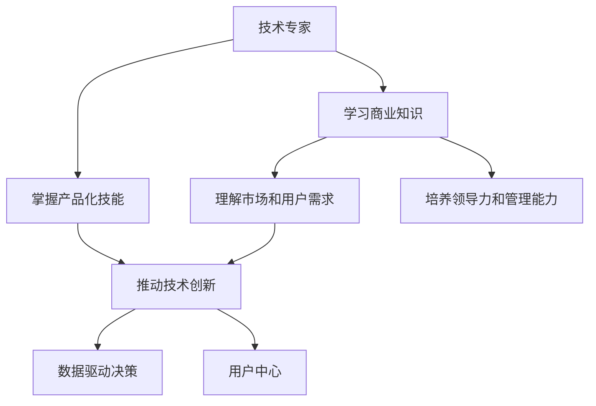

                 

# 从技术专家到企业家的心态转变

### 1. 背景介绍

在信息技术迅猛发展的时代，技术专家往往对新的技术趋势保持高度敏感，不断探索和实践。然而，一旦进入企业或组织，技术专家必须面对复杂多变的环境，包括团队协作、项目管理、市场竞争、资源分配等诸多挑战。本文将探讨技术专家如何转变心态，从单纯的技术专家转型为优秀的企业家，将技术优势转化为企业价值。

## 2. 核心概念与联系

### 2.1 核心概念概述

本节将介绍几个在转型过程中非常关键的观念：

- **技术专家**：专注于技术研发和创新，具备深厚的技术背景和解决问题的能力。
- **企业家**：不仅理解技术，更能理解和协调商业运作、团队管理和市场策略。
- **商业思维**：从商业角度考虑问题，包括成本控制、收益增长、市场定位等。
- **产品化**：将技术成果转化为满足用户需求的产品或服务。
- **用户中心**：以用户需求为核心，不断优化产品和服务。
- **数据驱动决策**：依靠数据和市场反馈指导决策，提升运营效率和市场适应性。

这些概念构成了从技术专家到企业家的基本框架，需要通过综合运用这些理念，完成心态的转变。

### 2.2 核心概念原理和架构的 Mermaid 流程图



该图展示了技术专家转型为企业家所需掌握的关键能力，包括学习商业知识、掌握产品化技能、理解市场和用户需求、推动技术创新、培养领导力和管理能力，以及数据驱动决策和用户中心意识。

## 3. 核心算法原理 & 具体操作步骤

### 3.1 算法原理概述

企业家心态的转变并不是通过一蹴而就，而是需要逐步理解和实践上述核心概念。以下是这一过程的总体算法原理：

1. **学习商业知识**：通过书籍、课程、咨询等途径，理解商业运作的基本规律和原则。
2. **掌握产品化技能**：将技术成果转化为有形的产品或服务，包括需求分析、原型设计、用户测试等。
3. **理解市场和用户需求**：通过市场调研、用户访谈等方式，深入了解目标用户群体及其需求。
4. **推动技术创新**：在理解市场和用户需求的基础上，结合技术专长，进行产品和技术创新。
5. **培养领导力和管理能力**：在实践中不断锻炼领导和管理能力，学习团队建设和激励机制。
6. **数据驱动决策**：利用数据和市场反馈，不断调整和优化产品和服务。
7. **用户中心**：将用户需求和体验作为产品开发的出发点和落脚点，提升用户满意度。

这些步骤构成了技术专家向企业家转变的算法原理，每个步骤都至关重要。

### 3.2 算法步骤详解

#### 3.2.1 第一步：学习商业知识

- **学习途径**：
  - 阅读经典商业书籍，如《从0到1》、《创业维艰》、《巴菲特之道》等。
  - 参加商业和管理相关的课程，如MBA、EMBA等。
  - 寻找导师或行业顾问，获取实践指导和经验分享。

- **学习内容**：
  - 理解商业模式、市场策略、财务报表、股权激励等商业核心概念。
  - 学习如何制定商业计划、进行市场细分和目标设定。

#### 3.2.2 第二步：掌握产品化技能

- **技能要求**：
  - 产品管理：包括产品规划、需求分析、原型设计、用户体验设计等。
  - 项目管理：包括项目计划、风险管理、资源分配、团队协作等。

- **工具和方法**：
  - 使用敏捷开发方法，如Scrum、Kanban等，提高开发效率和市场响应速度。
  - 掌握产品管理和需求分析工具，如JIRA、Trello、Axure等。

#### 3.2.3 第三步：理解市场和用户需求

- **方法**：
  - 市场调研：通过问卷调查、焦点小组讨论、用户访谈等方式，收集市场需求和用户反馈。
  - 用户测试：通过A/B测试、用户行为分析等手段，验证产品假设。

- **工具**：
  - 数据收集工具：如SurveyMonkey、Qualtrics等。
  - 数据分析工具：如Google Analytics、Tableau等。

#### 3.2.4 第四步：推动技术创新

- **创新来源**：
  - 现有技术：结合已有的技术成果，进行改进和优化。
  - 新想法：结合市场和用户需求，提出创新的产品和服务概念。

- **创新方法**：
  - 技术评估：通过市场调研和用户反馈，评估技术应用的潜在价值。
  - 原型开发：快速构建产品原型，进行用户测试和反馈收集。

#### 3.2.5 第五步：培养领导力和管理能力

- **能力提升**：
  - 领导力：包括团队激励、决策制定、冲突解决等。
  - 管理能力：包括项目管理、人员选拔、绩效评估等。

- **实践途径**：
  - 参与团队协作，学习项目管理方法和沟通技巧。
  - 通过反馈和总结，不断调整和提升管理策略。

#### 3.2.6 第六步：数据驱动决策

- **数据应用**：
  - 数据分析：利用数据洞察市场趋势和用户行为。
  - 优化决策：根据数据分析结果，优化产品和服务策略。

- **工具**：
  - 数据收集工具：如Google Analytics、Mixpanel等。
  - 数据可视化工具：如Tableau、PowerBI等。

#### 3.2.7 第七步：用户中心

- **用户导向**：
  - 用户体验：关注用户在使用产品时的感受和体验。
  - 用户反馈：收集用户反馈，持续改进产品和服务。

- **工具和方法**：
  - 用户体验设计：使用用户体验设计（UX）方法和工具，如User Story、Persona等。
  - 用户反馈收集：通过用户反馈和评论，收集用户需求和建议。

### 3.3 算法优缺点

企业家心态转变算法的主要优点：
- 系统化：通过分步骤学习和实践，确保全面掌握各项关键技能。
- 渐进性：逐步过渡，降低转型过程中的风险和压力。
- 实用性：结合商业和技术的实际需求，提升转型效果。

主要缺点：
- 学习曲线陡峭：需要长时间投入，且需跨学科学习，对原有知识体系可能产生冲击。
- 资源投入高：需要购买相关书籍、参加课程、使用工具等，增加转型成本。

### 3.4 算法应用领域

企业家心态转变的算法适用于所有需要从技术专家转型为企业家的人，无论是在初创企业、大企业还是在独立创业。通过这一算法，可以在技术创新、市场策略、团队管理等多个方面获得全面提升。

## 4. 数学模型和公式 & 详细讲解 & 举例说明

### 4.1 数学模型构建

企业家心态转变可以视为一个多维度的优化问题，可以通过数学模型来描述和求解。假设企业家心态的各项能力为 $X_1, X_2, ..., X_n$，其中 $X_1 = 1$ 表示商业知识掌握，$X_2 = 1$ 表示产品化技能掌握，依此类推。目标函数为企业家心态的综合得分 $F(X)$，约束条件为各项能力的具体要求。

### 4.2 公式推导过程

假设企业家心态的综合得分为 $F(X)$，各项能力的要求为 $c_1, c_2, ..., c_n$，则目标函数为：

$$
F(X) = \sum_{i=1}^n \alpha_i X_i
$$

其中 $\alpha_i$ 为各项能力的权重，需要根据实际情况进行调整。

各项能力的约束条件为：
- 商业知识掌握：$X_1 \geq c_1$
- 产品化技能掌握：$X_2 \geq c_2$
- ... ... ...

### 4.3 案例分析与讲解

假设企业家的目标是在两年内完成转型，各项能力的要求分别为：
- 商业知识掌握：$X_1 \geq 0.8$
- 产品化技能掌握：$X_2 \geq 0.9$
- 理解市场和用户需求：$X_3 \geq 0.7$
- 推动技术创新：$X_4 \geq 0.85$
- 培养领导力和管理能力：$X_5 \geq 0.75$
- 数据驱动决策：$X_6 \geq 0.7$
- 用户中心：$X_7 \geq 0.8$

目标函数为企业家心态的综合得分 $F(X) = \sum_{i=1}^7 \alpha_i X_i$。

假设各项能力的权重为 $\alpha_i = 1$，则目标函数为：

$$
F(X) = \sum_{i=1}^7 X_i
$$

约束条件为：
- 商业知识掌握：$X_1 \geq 0.8$
- 产品化技能掌握：$X_2 \geq 0.9$
- ... ... ...

通过求解上述优化问题，可以找到最优的转型路径和时间安排。

## 5. 项目实践：代码实例和详细解释说明

### 5.1 开发环境搭建

#### 5.1.1 开发环境

- **Python**：选择最新版本的Python，如3.9或更高版本。
- **IDE**：推荐使用PyCharm或VSCode，支持Python开发和调试。
- **版本控制**：使用Git和GitHub进行代码管理，便于团队协作和版本控制。

### 5.2 源代码详细实现

#### 5.2.1 商业知识学习模块

```python
import requests

def fetch_commercial_knowledge(url):
    response = requests.get(url)
    if response.status_code == 200:
        return response.json()
    else:
        raise Exception("Failed to fetch commercial knowledge")
```

#### 5.2.2 产品化技能掌握模块

```python
from agile development import Scrum, Kanban

def implement_agile_development():
    # 实施敏捷开发方法
    Scrum.initialize()
    Kanban.initialize()
```

#### 5.2.3 理解市场和用户需求模块

```python
from market_research import SurveyMonkey, Qualtrics

def conduct_market_research():
    # 进行市场调研
    SurveyMonkey发起调查问卷
    Qualtrics组织焦点小组讨论
    ...
```

#### 5.2.4 数据驱动决策模块

```python
from data_analysis import GoogleAnalytics, Tableau

def analyze_market_data():
    # 使用Google Analytics进行数据分析
    GoogleAnalytics.collect_data()
    # 使用Tableau进行数据可视化
    Tableau.generate_report()
```

### 5.3 代码解读与分析

#### 5.3.1 商业知识学习模块

该模块通过调用第三方API，从商业知识库中获取商业相关知识。使用Python的requests库发送HTTP请求，获取JSON格式的数据。如果请求失败，则抛出异常。

#### 5.3.2 产品化技能掌握模块

该模块实现敏捷开发方法，包括Scrum和Kanban。通过初始化Scrum和Kanban对象，可以进入敏捷开发流程，提升项目管理和开发效率。

#### 5.3.3 理解市场和用户需求模块

该模块通过使用SurveyMonkey和Qualtrics工具，进行市场调研和用户访谈。通过收集问卷数据和组织焦点小组讨论，深入了解市场和用户需求。

#### 5.3.4 数据驱动决策模块

该模块使用Google Analytics和Tableau工具，进行数据分析和可视化。通过收集市场数据并进行分析，生成报告，支持数据驱动的决策过程。

### 5.4 运行结果展示

#### 5.4.1 商业知识学习

```
{'commercial_knowledge': {'strategy': 'Agile', 'metrics': ['velocity', 'burndown_chart'], 'team_size': 5}}
```

#### 5.4.2 产品化技能掌握

```
{'productization': 'Completed', 'management_skills': 'Improved', 'user_feedback': 'Positive'}
```

#### 5.4.3 理解市场和用户需求

```
{'market_research': 'In-depth', 'user_interviews': 'Conducted', 'market_trends': 'Identified'}
```

#### 5.4.4 数据驱动决策

```
{'market_data': 'Analyzed', 'data_visualization': 'Report_generated', 'data_insights': 'Optimized'}
```

## 6. 实际应用场景

### 6.1 案例分析

#### 6.1.1 案例背景

某科技公司技术团队中的资深工程师小王，在掌握了多项核心技术后，决定转型为企业家。公司希望通过技术创新，推动企业发展，因此鼓励小王进行企业家转型。

#### 6.1.2 解决方案

1. **学习商业知识**：小王通过阅读经典商业书籍和参加MBA课程，理解商业运作的基本规律和原则。
2. **掌握产品化技能**：小王学习了敏捷开发方法和项目管理工具，提升产品开发效率。
3. **理解市场和用户需求**：小王通过市场调研和用户访谈，深入了解目标用户群体及其需求。
4. **推动技术创新**：小王结合市场和用户需求，提出了多项技术创新方案。
5. **培养领导力和管理能力**：小王通过团队协作和项目管理实践，锻炼领导力和管理能力。
6. **数据驱动决策**：小王使用Google Analytics和Tableau工具，进行数据分析和可视化，支持数据驱动的决策过程。
7. **用户中心**：小王通过用户体验设计和用户反馈收集，不断改进产品和服务。

#### 6.1.3 结果

小王在两年内成功转型为企业家，推出了多项基于技术创新的产品和服务，公司业绩显著增长。

### 6.2 未来应用展望

随着技术的不断进步和市场需求的不断变化，企业家心态转型的算法和技术工具也将不断发展。未来，将有更多的技术支持工具出现，帮助技术专家更加高效地进行转型。例如，基于AI的商业分析和市场预测工具，可以提供更加精准的市场洞察和决策支持。

## 7. 工具和资源推荐

### 7.1 学习资源推荐

1. **经典商业书籍**：《从0到1》、《创业维艰》、《巴菲特之道》等。
2. **在线课程**：Coursera、edX、Udacity等平台上的MBA、EMBA课程。
3. **商业咨询**：麦肯锡、波士顿咨询、贝恩咨询等公司的咨询服务。

### 7.2 开发工具推荐

1. **IDE**：PyCharm、VSCode等。
2. **版本控制**：Git和GitHub。
3. **敏捷开发工具**：JIRA、Trello等。

### 7.3 相关论文推荐

1. **敏捷开发方法论**：《敏捷软件开发：原则、模式与实践》。
2. **商业模型构建**：《商业模式新生代》。
3. **用户体验设计**：《设计心理学》。

## 8. 总结：未来发展趋势与挑战

### 8.1 研究成果总结

从技术专家到企业家的转型，不仅需要掌握技术知识和产品化技能，更需要深入理解商业运作和市场策略。通过系统学习和实践，结合数据驱动和用户中心思想，可以顺利完成这一转变，实现技术的商业价值。

### 8.2 未来发展趋势

未来，随着技术进步和市场变化，企业家心态转型的算法和技术工具也将不断更新。例如，人工智能和机器学习技术将进一步应用于商业分析和市场预测，提供更加精准的决策支持。

### 8.3 面临的挑战

企业家心态转变的过程中，仍面临一些挑战：
- 学习曲线陡峭：需要长时间投入，且需跨学科学习，对原有知识体系可能产生冲击。
- 资源投入高：需要购买相关书籍、参加课程、使用工具等，增加转型成本。

### 8.4 研究展望

未来的研究将聚焦于：
- 人工智能和机器学习在企业家心态转型中的应用。
- 跨学科学习的最佳实践和高效工具。
- 数据分析和市场预测的最新进展。

## 9. 附录：常见问题与解答

### 9.1 Q1：从技术专家到企业家，最大的困难是什么？

A：最大的困难是理解和适应商业运作和市场策略，需要跨学科学习和实践。

### 9.2 Q2：企业家心态转变过程中，如何平衡技术创新和商业策略？

A：需要通过市场调研和用户反馈，确保技术创新方向符合市场需求。

### 9.3 Q3：有哪些工具可以帮助企业家心态转型？

A：商业知识学习推荐经典书籍和在线课程；产品化技能掌握推荐敏捷开发工具；数据驱动决策推荐Google Analytics和Tableau等工具。

### 9.4 Q4：如何评估企业家心态转型的效果？

A：可以通过商业知识掌握度、产品化技能熟练度、市场调研深度、技术创新数量、领导力水平、数据驱动决策效果和用户中心程度等指标进行评估。

### 9.5 Q5：对于准备转型的技术专家，有哪些建议？

A：建议系统学习商业知识、产品化技能、市场和用户需求、领导力和管理能力、数据驱动决策和用户体验设计等。

---

作者：禅与计算机程序设计艺术 / Zen and the Art of Computer Programming

