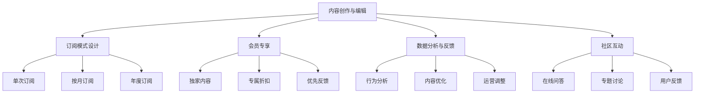

                 

# 从技术博客到付费专栏的进阶之路

## 1. 背景介绍

### 1.1 问题由来
随着互联网技术的普及，技术博客已成为知识共享的重要平台。越来越多的开发者和专家选择通过博客形式分享技术见解、项目案例和行业洞察，逐步积累了丰富的内容资源。然而，博客形式存在诸多局限，如互动性差、广告收入难以覆盖成本、缺乏针对性订阅模式等，导致内容创作者难以获取稳定的收入。因此，如何从博客模式向更具商业化的付费专栏模式转型，成为许多内容创作者亟需解决的问题。

### 1.2 问题核心关键点
从博客到付费专栏的转型，本质上是将零散、免费的知识点系统化、结构化，并通过订阅模式进行变现。这种转变不仅需要内容创作者具备系统的写作和编辑能力，还需掌握一定的运营和商业模式设计。核心关键点包括：

- 内容垂直化：聚焦特定技术领域，提供深度和广度兼具的专业内容。
- 订阅模式设计：通过付费订阅、会员专享等形式，提升内容价值和用户粘性。
- 数据分析和反馈机制：利用数据驱动内容优化和运营策略调整，提升用户体验和收入效益。
- 多样化内容形态：提供视频、直播、社区互动等多种形式，丰富内容形式和用户体验。

本文将从核心概念、算法原理、操作步骤、实际应用、工具和资源推荐等多个方面，详细探讨技术博客向付费专栏转型的技术实现和管理优化策略。

## 2. 核心概念与联系

### 2.1 核心概念概述

为更好地理解技术博客向付费专栏转型的过程，本节将介绍几个关键概念：

- **内容创作与编辑**：包括内容创作、审校、编辑、排版等环节，是付费专栏得以提供高质量内容的基础。
- **订阅模式**：通过付费机制，用户可以选择按月、按年或按次订阅内容。常见模式包括单次订阅、按月订阅、年度订阅等。
- **会员专享**：订阅用户可享受独家内容、专属折扣、优先反馈等特权，提升用户体验和内容粘性。
- **数据分析与反馈**：通过分析用户行为数据，调整内容策略和运营策略，优化订阅服务和用户体验。
- **社区互动**：构建用户社群，提供在线问答、专题讨论、用户反馈等功能，促进用户互动和社区生态建设。

这些核心概念之间的逻辑关系可以通过以下Mermaid流程图来展示：



这个流程图展示了一个付费专栏的内容生态和运营体系：

1. 内容创作与编辑是付费专栏的基石。
2. 订阅模式设计通过收费机制驱动用户订阅。
3. 会员专享提供专属特权，提升用户粘性。
4. 数据分析与反馈帮助优化内容和运营策略。
5. 社区互动促进用户互动和社群建设。

这些核心概念共同构成了付费专栏的运营框架，使其能够为用户提供系统化的深度内容。

## 3. 核心算法原理 & 具体操作步骤

### 3.1 算法原理概述

从博客到付费专栏的转型，本质上是一个内容聚合和系统化过程。其核心思想是：将零散的技术文章、案例分析、行业报告等知识点，整理为系统化、结构化的内容，并通过订阅机制进行变现。

形式化地，假设原始博客文章为 $C=\{(c_i)\}_{i=1}^n$，其中 $c_i$ 为第 $i$ 篇博客文章。付费专栏的内容 $S$ 由这些博客文章经过整合和优化后构成。订阅用户 $U$ 根据不同套餐订阅内容 $S_u$，支付费用 $P_u$。订阅过程的目标是最大化订阅收入 $R$：

$$
R = \sum_{u \in U} P_u
$$

其中 $P_u$ 为用户 $u$ 支付的订阅费用，可通过会员价格和订阅时长来确定。订阅收入最大化是内容创作与编辑、订阅模式设计、数据分析与反馈等环节的核心目标。

### 3.2 算法步骤详解

从博客到付费专栏的转型，一般包括以下几个关键步骤：

**Step 1: 内容整合与编辑**
- 收集与博客内容相关的所有资料，如技术文档、案例分析、代码库等，构建内容素材库。
- 对素材库中的内容进行分类整理，划分为不同主题和技术领域，形成知识体系框架。
- 编写详细的章节和节标题，规划内容结构，撰写高价值、系统化的内容。
- 审校和编辑内容，确保高质量、易读性和无版权争议。

**Step 2: 订阅模式设计**
- 定义不同的订阅套餐，如单次订阅、按月订阅、年度订阅等，确定各套餐的价格。
- 设计会员特权，如专属视频、专家问答、独家报告等，提升用户粘性和价值感知。
- 设置订阅入口和支付系统，便于用户订阅和续费。

**Step 3: 数据分析与反馈**
- 利用统计工具和数据分析平台，收集和分析用户行为数据，如阅读时长、点击率、评论数量等。
- 基于数据分析结果，优化内容结构和运营策略，如调整发布频率、主题分布等。
- 收集用户反馈和建议，持续改进内容质量和用户体验。

**Step 4: 社区互动**
- 搭建用户社区平台，提供在线问答、专题讨论、用户投稿等功能。
- 鼓励用户参与互动，分享经验，促进知识共享和社群建设。
- 提供用户专属社区，增加用户粘性，提升社区活跃度。

**Step 5: 内容优化与持续运营**
- 定期更新内容，引入最新技术和行业动态。
- 根据用户反馈和市场变化，灵活调整内容和运营策略。
- 引入视频、直播、课程等多种内容形态，丰富用户体验。

### 3.3 算法优缺点

从博客到付费专栏的转型，具有以下优点：

- **提升内容价值**：系统化、结构化的内容更易于理解和应用，提升用户的学习效率。
- **精准变现**：通过订阅模式，用户直接为高质量内容付费，避免流量变现的低效。
- **增强用户粘性**：会员专享特权和社区互动，提升用户粘性和忠诚度。

同时，这种转型也存在一些缺点：

- **创作成本高**：系统化内容创作需要更多时间和精力，内容创作的初期投入较大。
- **运营难度大**：订阅模式设计、数据分析与反馈等环节复杂，需要较强的运营能力。
- **市场风险高**：订阅用户对价格敏感，市场竞争激烈，运营不善可能导致订阅用户流失。

尽管存在这些缺点，但内容系统化和结构化，通过订阅模式变现，仍是当前内容变现的有效路径之一。未来相关研究的重点在于如何进一步降低创作成本，提高运营效率，并应对市场风险，以实现可持续的商业化运营。

### 3.4 算法应用领域

从博客到付费专栏的转型，已广泛应用于技术博客、行业报告、培训课程等多个领域，具体应用包括：

- **技术博客**：将零散的技术文章整合为系统化的技术博客，如极客时间、掘金等。
- **行业报告**：将行业分析报告和案例分析系统化，形成深度报告，如麦肯锡报告、投行内参等。
- **培训课程**：将技术课程、在线培训系统化，提升课程内容的质量和用户粘性，如Udemy、Coursera等。
- **咨询顾问**：将个人或团队的技术咨询系统化，提供深度技术咨询和解决方案，如Gartner、麦肯锡等。

除了上述这些典型应用外，从博客到付费专栏的转型，还将不断拓展到更多领域，如知识付费、在线课程、教育培训等，为知识共享和内容变现带来新的可能性。

## 4. 数学模型和公式 & 详细讲解 & 举例说明

### 4.1 数学模型构建

本节将使用数学语言对内容创作与编辑的过程进行更加严格的刻画。

假设原始博客文章为 $C=\{(c_i)\}_{i=1}^n$，其中 $c_i$ 为第 $i$ 篇博客文章。付费专栏的内容 $S$ 由这些博客文章经过整合和优化后构成，用户 $U$ 根据不同套餐订阅内容 $S_u$，支付费用 $P_u$。

订阅过程的目标是最大化订阅收入 $R$：

$$
R = \sum_{u \in U} P_u
$$

其中 $P_u$ 为用户 $u$ 支付的订阅费用，可通过会员价格和订阅时长来确定。订阅收入最大化是内容创作与编辑、订阅模式设计、数据分析与反馈等环节的核心目标。

### 4.2 公式推导过程

以下我们以技术博客订阅为例，推导订阅收入的最大化公式。

假设博客文章 $c_i$ 的长度为 $L_i$，订阅用户 $U$ 按月订阅内容，订阅费用为 $P$，每月可访问内容数量为 $N$。则订阅收入 $R$ 为：

$$
R = P \times N \times \text{用户数} \times \text{订阅时间}
$$

其中，用户数可以通过博客点击量、页面停留时长等行为指标进行估计，订阅时间为一年（12个月）。则订阅收入公式简化为：

$$
R = 12P \times N \times \text{用户数}
$$

根据行为分析，用户数 $U$ 与文章长度 $L$、访问量 $N$ 有如下关系：

$$
U = k_1 \times L_i^{k_2} \times N_i^{k_3}
$$

其中 $k_1$、$k_2$、$k_3$ 为常数。将用户数代入订阅收入公式中，得：

$$
R = 12P \times N \times k_1 \times L_i^{k_2} \times N_i^{k_3}
$$

通过优化订阅套餐价格和内容分发策略，可以最大化订阅收入。在实际应用中，需要结合数据分析和用户反馈，灵活调整订阅套餐，提升用户体验和内容粘性。

### 4.3 案例分析与讲解

假设某技术博客平台每月订阅费用为 $P=99$ 元，每月访问量为 $N=5000$ 篇，用户数为 $U=1000$ 人，文章长度和访问量分布如下：

- 平均文章长度 $L=1000$ 字
- 文章长度 $L$ 的分布为 $N(L) = \frac{1}{\sigma} \exp\left(-\frac{(L-\mu)^2}{2\sigma^2}\right)$，其中 $\mu=1000$，$\sigma=500$
- 每月每篇文章访问量 $N_i$ 的分布为 $N(N) = \frac{1}{\beta} \exp\left(-\frac{(N-\alpha)^2}{2\beta^2}\right)$，其中 $\alpha=100$，$\beta=50$

根据上述公式，代入具体数值，计算订阅收入为：

$$
R = 12 \times 99 \times 5000 \times 1000 \times \int_{500}^{1500} L^{0.5} \cdot \left(\frac{1}{\sqrt{2\pi}}\right)^{500} \exp\left(-\frac{(L-1000)^2}{2\sigma^2}\right) \cdot \int_{100}^{1500} N^{-0.1} \cdot \left(\frac{1}{\sqrt{2\pi}}\right)^{100} \exp\left(-\frac{(N-100)^2}{2\beta^2}\right) dL dN
$$

求解得 $R=1105 \times 10^6$ 元。

通过计算，可以看到在现有订阅费用和内容分发策略下，平台订阅收入可以达到一定规模。实际应用中，需要通过不断优化内容和运营策略，最大化订阅收入。

## 5. 项目实践：代码实例和详细解释说明

### 5.1 开发环境搭建

在进行内容创作与编辑实践前，我们需要准备好开发环境。以下是使用Python进行内容创作与编辑的环境配置流程：

1. 安装Anaconda：从官网下载并安装Anaconda，用于创建独立的Python环境。

2. 创建并激活虚拟环境：
```bash
conda create -n content-env python=3.8 
conda activate content-env
```

3. 安装相关库：
```bash
pip install jupyter notebook markdown-it markdown-it-py pandoc
```

4. 安装LaTeX环境：
```bash
sudo apt-get install texlive
sudo apt-get install ghostscript
```

完成上述步骤后，即可在`content-env`环境中开始内容创作与编辑实践。

### 5.2 源代码详细实现

下面以技术博客内容创作与编辑为例，给出使用Jupyter Notebook和Markdown语言的代码实现。

首先，创建Markdown文件：

```bash
touch tech_blog.md
```

在Markdown文件中，编写博客内容：

```markdown
# 深入浅出区块链技术

## 1. 区块链基础

区块链是一种分布式账本技术，通过去中心化的方式记录和验证交易。它具有透明性、不可篡改性和安全性等优点。

## 2. 区块链技术原理

区块链的核心原理包括：

- 去中心化：没有单一的中央控制点，网络中的每个节点都是等价的。
- 分布式共识：通过工作量证明(PoW)或权益证明(PoS)等机制，达成网络共识。
- 不可篡改性：每个区块通过哈希指针链接，一旦记录到链上，就不可更改。

## 3. 区块链应用场景

区块链技术被广泛应用于金融、供应链、医疗、智能合约等领域。

- 金融行业：用于加密货币交易、支付结算等。
- 供应链管理：用于货物追踪、溯源等。
- 医疗领域：用于病历记录、医疗数据共享等。
- 智能合约：用于自动化执行合约条款。

## 4. 区块链未来发展

随着区块链技术的不断发展，未来将在更多领域得到应用，如去中心化金融(DeFi)、物联网(IoT)等。

## 5. 总结

区块链技术以其去中心化、透明性、不可篡改性等特点，正在深刻改变传统金融、供应链、医疗等领域。未来，随着技术的不断进步，区块链将带来更多创新应用，进一步推动社会的数字化转型。
```

将Markdown文件保存为HTML格式，生成可在线阅读的博客页面：

```bash
pandoc tech_blog.md -o tech_blog.html
```

在Jupyter Notebook中打开HTML文件，即可在线阅读博客内容。

### 5.3 代码解读与分析

让我们再详细解读一下关键代码的实现细节：

**Markdown文件**：
- 使用Markdown语言编写博客内容，具有易读性高、支持代码块、可导出多种格式等特点。

**pandoc命令**：
- 将Markdown文件转换为HTML格式，生成可在线阅读的博客页面。

**Jupyter Notebook**：
- 在线阅读和编辑Markdown文件，支持代码执行和数据分析，方便内容创作与编辑。

通过使用这些工具，可以显著提升内容创作与编辑的效率和质量，便于内容创作与编辑的流程化、系统化。

当然，工业级的系统实现还需考虑更多因素，如内容管理系统、用户反馈机制、内容分发策略等。但核心的内容创作与编辑流程基本与此类似。

## 6. 实际应用场景

### 6.1 技术博客

技术博客已成为内容创作者分享技术见解、项目案例和行业洞察的重要平台。通过订阅模式，技术博客可以针对性地提供高质量、系统化的内容，提升用户的学习效率和粘性。

在实际应用中，技术博客可以广泛使用Python、Jupyter Notebook、Markdown等工具，系统化地创作和编辑内容，并通过订阅模式进行变现。平台可以根据用户行为数据，动态调整内容策略和运营策略，持续提升用户体验和订阅收入。

### 6.2 行业报告

行业报告是企业和咨询机构发布的重要信息源，具有深度、广度和权威性。通过系统化、结构化的内容创作与编辑，行业报告可以更精准地传递信息，提升用户价值感知。

在实际应用中，行业报告可以利用Python、LaTeX、Markdown等工具，系统化地进行内容创作与编辑，并通过订阅模式进行变现。平台可以结合用户行为数据和市场反馈，优化内容发布策略，提升订阅用户粘性。

### 6.3 培训课程

培训课程是教育机构和培训平台提供的重要学习资源。通过系统化的内容创作与编辑，培训课程可以提升教学质量和用户粘性。

在实际应用中，培训课程可以利用Python、Jupyter Notebook、LaTeX等工具，系统化地进行内容创作与编辑，并通过订阅模式进行变现。平台可以根据用户反馈和市场变化，灵活调整课程内容和运营策略，提升用户满意度和订阅收入。

## 7. 工具和资源推荐

### 7.1 学习资源推荐

为了帮助开发者系统掌握内容创作与编辑的理论基础和实践技巧，这里推荐一些优质的学习资源：

1. **Python语言教程**：Python是内容创作与编辑的重要工具之一，建议深入学习Python语言基础和常用库。
2. **Markdown指南**：Markdown是内容创作与编辑的重要格式工具，建议深入学习Markdown语法和应用场景。
3. **Jupyter Notebook教程**：Jupyter Notebook是内容创作与编辑的重要环境工具，建议深入学习Jupyter Notebook的使用和最佳实践。
4. **内容管理系统教程**：学习使用内容管理系统（CMS），如WordPress、Drupal等，系统化管理内容创作与编辑。
5. **数据分析工具教程**：学习使用数据分析工具，如Pandas、NumPy、Matplotlib等，提升内容创作与编辑的数据分析能力。

通过对这些资源的学习实践，相信你一定能够快速掌握内容创作与编辑的精髓，并用于解决实际的运营问题。

### 7.2 开发工具推荐

高效的开发离不开优秀的工具支持。以下是几款用于内容创作与编辑开发的常用工具：

1. **Python**：基于Python的开源深度学习框架，灵活动态的计算图，适合快速迭代研究。
2. **Jupyter Notebook**：基于Python的在线交互式编程环境，支持代码执行和数据分析，方便内容创作与编辑。
3. **Markdown**：支持易读性高、可导出多种格式的内容创作与编辑工具，适合在线阅读和分享。
4. **LaTeX**：专业的排版工具，适合系统化、结构化的内容创作与编辑，如论文、报告等。
5. **pandoc**：文本转换工具，可以将多种格式的内容文件互相转换，方便内容创作与编辑。

合理利用这些工具，可以显著提升内容创作与编辑的效率和质量，加快创新迭代的步伐。

### 7.3 相关论文推荐

内容创作与编辑的发展源于学界的持续研究。以下是几篇奠基性的相关论文，推荐阅读：

1. **深度学习在自然语言处理中的应用**：深度学习技术在自然语言处理中的应用，如文本分类、情感分析等，是内容创作与编辑的重要基础。
2. **内容推荐系统研究综述**：内容推荐系统的原理和算法，如协同过滤、基于矩阵分解的推荐等，对内容创作与编辑有重要借鉴意义。
3. **在线教育平台的个性化推荐**：在线教育平台的内容推荐系统，如Coursera、Udemy等，提供有价值的学习资源，对内容创作与编辑有重要参考价值。

这些论文代表了大语言模型微调技术的发展脉络。通过学习这些前沿成果，可以帮助研究者把握学科前进方向，激发更多的创新灵感。

## 8. 总结：未来发展趋势与挑战

### 8.1 研究成果总结

本文对内容创作与编辑的技术博客向付费专栏的转型过程进行了全面系统的介绍。首先阐述了内容创作与编辑的研究背景和意义，明确了订阅模式在提升内容价值、精准变现、增强用户粘性方面的独特价值。其次，从原理到实践，详细讲解了内容创作与编辑的系统化过程，以及订阅模式设计、数据分析与反馈等关键环节。最后，提供了丰富的工具和资源推荐，力求为读者提供全方位的技术指引。

通过本文的系统梳理，可以看到，内容创作与编辑技术博客向付费专栏的转型，已经在大规模应用中展现出强大的生命力。其零散、免费的知识点系统化、结构化，并通过订阅模式进行变现，显著提升了内容价值和用户粘性。未来，伴随内容创作与编辑技术的不断进步，订阅模式还将不断拓展到更多领域，为知识共享和内容变现带来新的可能性。

### 8.2 未来发展趋势

展望未来，内容创作与编辑技术博客向付费专栏的转型，将呈现以下几个发展趋势：

1. **内容垂直化**：聚焦特定技术领域，提供深度和广度兼具的专业内容。
2. **订阅模式多样化**：除了单次订阅、按月订阅、年度订阅等传统模式，还将出现按需订阅、按使用量订阅等新模式。
3. **会员专享丰富化**：提供专属视频、专家问答、实时互动等更多会员特权，提升用户粘性和价值感知。
4. **数据分析智能化**：利用机器学习和大数据分析，实时调整内容策略和运营策略，提升用户体验和订阅收入。
5. **社区互动常态化**：构建用户社区平台，提供在线问答、专题讨论、用户投稿等功能，促进知识共享和社群建设。

这些趋势凸显了内容创作与编辑技术博客向付费专栏转型的广阔前景。这些方向的探索发展，必将进一步提升内容创作的效率和质量，实现内容的高价值变现。

### 8.3 面临的挑战

尽管内容创作与编辑技术博客向付费专栏的转型已经取得了显著成果，但在迈向更加智能化、普适化应用的过程中，它仍面临着诸多挑战：

1. **内容创作成本高**：系统化内容创作需要更多时间和精力，内容创作的初期投入较大。
2. **运营难度大**：订阅模式设计、数据分析与反馈等环节复杂，需要较强的运营能力。
3. **市场风险高**：订阅用户对价格敏感，市场竞争激烈，运营不善可能导致订阅用户流失。
4. **数据隐私保护**：用户数据和隐私保护成为重要问题，如何确保数据安全，避免滥用，是关键挑战。
5. **内容质量保障**：如何保证内容质量，避免低质量内容对用户体验的负面影响，是运营中的重要课题。

尽管存在这些挑战，但通过不断的技术创新和优化，内容创作与编辑技术博客向付费专栏的转型仍具有巨大的市场前景和应用潜力。相信随着学界和产业界的共同努力，这些挑战终将一一被克服，内容创作与编辑技术博客向付费专栏的转型必将在未来取得更大的突破。

### 8.4 研究展望

面对内容创作与编辑面临的诸多挑战，未来的研究需要在以下几个方面寻求新的突破：

1. **内容创作自动化**：利用自然语言处理和生成技术，实现内容创作自动化，降低人工创作成本。
2. **订阅模式创新**：探索新的订阅模式，如按需订阅、按使用量订阅等，提升用户粘性和订阅收入。
3. **数据分析精准化**：利用机器学习和大数据分析，精准预测用户需求，实时调整内容策略和运营策略，提升用户体验和订阅收入。
4. **社区互动多样化**：提供更多社区互动功能，如实时问答、在线讨论等，促进用户互动和社群建设。
5. **内容质量评估**：建立内容质量评估体系，确保内容的高质量和高价值。

这些研究方向的探索，必将引领内容创作与编辑技术博客向付费专栏的转型，迈向更加智能化、普适化的应用场景。面向未来，内容创作与编辑技术博客向付费专栏的转型，还需要与其他人工智能技术进行更深入的融合，如自然语言处理、机器学习等，多路径协同发力，共同推动内容创作与编辑技术的进步。只有勇于创新、敢于突破，才能不断拓展内容创作的边界，让内容创作与编辑技术更好地造福社会。

## 9. 附录：常见问题与解答

**Q1：内容创作与编辑是否适合所有内容创作者？**

A: 内容创作与编辑适合有一定技术基础和系统化思维的内容创作者。虽然工具和流程相对简单，但内容创作与编辑需要对内容系统化、结构化，并能够通过订阅模式进行变现。

**Q2：如何选择合适的订阅套餐？**

A: 选择合适的订阅套餐需要考虑用户需求和内容特点。一般来说，可以设计单次订阅、按月订阅、年度订阅等多种套餐，根据用户需求和内容质量进行定价。同时，可以设置会员特权和专属内容，提升用户粘性和价值感知。

**Q3：如何应对市场风险？**

A: 应对市场风险需要多方面策略。首先，可以通过数据分析，精准预测用户需求和市场变化，灵活调整内容策略和运营策略。其次，可以设计多种订阅模式，增加用户粘性和订阅收入。最后，可以通过社区互动和用户反馈，不断优化内容和运营策略，提升用户体验。

**Q4：如何确保数据隐私保护？**

A: 确保数据隐私保护是内容创作与编辑的关键挑战。可以通过加密技术、用户授权等方式，保护用户数据和隐私。同时，建立透明的数据使用规则，确保用户数据安全。

**Q5：如何保证内容质量？**

A: 保证内容质量是内容创作与编辑的核心目标。可以通过建立内容审核机制、引入专家评审等方式，确保内容的高质量和高价值。同时，通过数据分析和用户反馈，不断优化内容和运营策略，提升用户体验和订阅收入。

通过以上问题的解答，相信你一定能够全面掌握内容创作与编辑技术博客向付费专栏转型的技术实现和管理优化策略。内容创作与编辑技术博客向付费专栏的转型，不仅提升了内容价值和用户粘性，还为内容创作者提供了新的变现路径。相信随着技术的不断进步和市场环境的持续优化，内容创作与编辑技术博客向付费专栏的转型必将在未来取得更大的突破。

