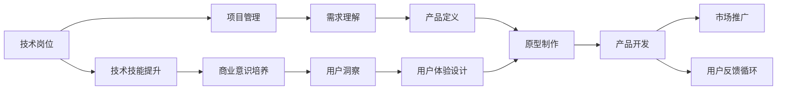
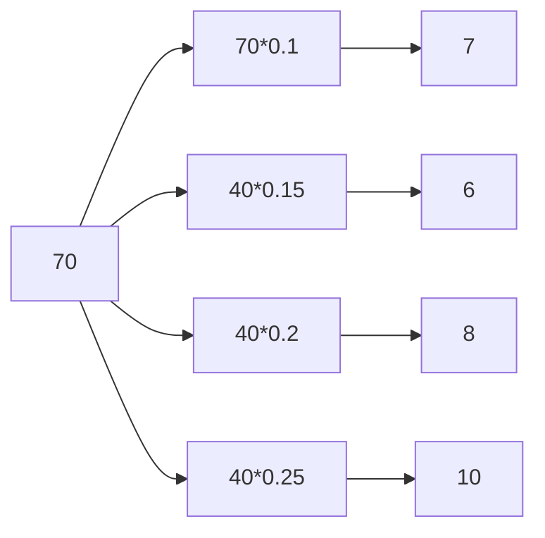

                 

# 从技术岗位到产品经理的转型

## 1. 背景介绍

在快速发展的技术行业，随着职业生涯的演进，很多技术岗位的专业人士会面临一个共同的问题——如何从技术角色转型到产品经理。这一转型不仅仅是职业生涯方向的改变，更是工作方式、思维方式和领导能力的全面提升。本文将从技术到产品，带领读者系统了解这一转型的关键环节，揭示转型的核心策略，为技术专业人士提供切实的转型指南。

## 2. 核心概念与联系

### 2.1 核心概念概述

**技术岗位**：主要包括软件开发工程师、数据工程师、系统架构师等。主要职责是设计、开发和维护技术系统，确保系统的稳定性和性能。

**产品经理**：负责产品的整体规划、设计和实现。需要了解市场、用户需求，并与技术团队协作，将产品愿景变为现实。

**技术到产品的转型**：技术岗位到产品经理的转型，意味着从技术导向转变为用户导向，从技术执行转变为策略规划，从个体技术思维转变为团队协作思维。

以下Mermaid流程图展示了从技术岗位到产品经理转型的主要环节和联系：



### 2.2 核心概念原理和架构

技术岗位与产品经理的职能和技能有所不同。技术岗位的核心能力包括编程技能、技术架构设计和问题解决能力；产品经理的核心能力包括市场洞察、用户研究、产品设计和团队管理。这两个角色之间的联系主要体现在：

1. **技术是产品的基石**：技术岗位负责实现产品功能，确保产品稳定运行。没有技术支撑，产品就无法落地。
2. **产品是技术的方向**：产品经理需要明确产品目标和功能，制定技术需求，指导技术团队实现。产品定义决定了技术实现的优先级和方向。
3. **需求与技术双向沟通**：产品经理需要理解技术实现的可行性，同时将用户需求和技术实现进行有效对接。技术岗位需要理解产品需求，将复杂的技术问题简化并实现。

## 3. 核心算法原理 & 具体操作步骤

### 3.1 算法原理概述

从技术岗位到产品经理的转型，本质上是技术能力和产品管理能力相结合的过程。这一过程可以分为四个关键步骤：

1. **技术技能提升**：提高编程技能、技术架构设计能力和技术问题解决能力。
2. **项目管理能力**：掌握项目管理的流程和方法，提升团队协作和资源管理能力。
3. **商业意识培养**：理解市场环境、用户需求、竞争态势和商业模式，具备商业战略思维。
4. **产品设计与用户研究**：提升产品设计和用户体验设计能力，深入了解用户需求和行为，将用户洞察融入产品设计。

### 3.2 算法步骤详解

**Step 1: 技术技能提升**

技术岗位到产品经理的第一步，是加强和提升现有的技术技能。这包括：

- **编程技能提升**：学习新技术、新框架，提高编码效率和代码质量。
- **技术架构设计**：理解不同架构模式，掌握微服务、容器化等新技术，提升系统扩展性和稳定性。
- **技术问题解决**：提升问题诊断和解决方案能力，增强技术预见性和抗压能力。

**Step 2: 项目管理能力**

产品经理需要具备高效的项目管理能力，这包括：

- **项目规划**：学习项目管理和敏捷开发方法，如Scrum、Kanban等，制定详细的项目计划和时间表。
- **资源管理**：协调团队资源，平衡技术需求和业务优先级，确保项目按时按质完成。
- **团队协作**：提升沟通和协调能力，推动跨部门协作，解决团队冲突。

**Step 3: 商业意识培养**

了解市场和商业环境，是产品经理的必备能力。这包括：

- **市场洞察**：学习市场分析方法，了解行业趋势、竞争态势和用户需求变化。
- **商业模型**：理解商业模式和盈利模式，掌握业务模型和定价策略。
- **用户洞察**：学习用户研究和数据分析方法，深入理解用户行为和心理，捕捉市场机会。

**Step 4: 产品设计与用户研究**

产品经理需要具备产品设计和用户体验设计的能力，这包括：

- **产品定义**：学习产品设计和用户体验设计原则，制定产品规格和用户需求文档。
- **用户体验设计**：学习用户体验设计方法和工具，提升界面设计和用户体验设计能力。
- **用户研究**：学习用户研究和数据分析方法，通过调查、访谈、问卷等方式获取用户需求和反馈。

### 3.3 算法优缺点

从技术岗位到产品经理的转型，有其独特的优势和挑战：

**优势**：

1. **理解技术实现**：技术背景使产品经理更了解技术实现的复杂性和限制，有助于制定更合理的产品需求。
2. **跨部门协作**：技术背景使产品经理更容易与技术团队沟通协作，推动项目顺利进行。
3. **快速迭代**：技术背景使产品经理能够快速原型化产品，测试和改进产品功能。

**挑战**：

1. **角色转换**：从技术到产品，工作内容和思维模式有较大差异，需要适应和学习。
2. **商业压力**：产品经理需要平衡技术和商业需求，面临更多来自业务和市场的压力。
3. **用户需求理解**：产品经理需要深入了解用户需求和行为，这对于没有产品背景的技术人员来说是一个难点。

### 3.4 算法应用领域

技术岗位到产品经理的转型，广泛应用于以下领域：

1. **软件开发公司**：技术团队需要转型，提升产品规划和市场分析能力，推动公司产品创新和市场扩展。
2. **互联网企业**：技术背景的产品经理，可以更好地理解和协调技术团队，推动产品迭代和市场推广。
3. **传统企业转型**：技术背景的产品经理，可以帮助企业引入新技术，推动数字化转型。

## 4. 数学模型和公式 & 详细讲解

### 4.1 数学模型构建

从技术岗位到产品经理的转型，可以抽象为一个系统的状态转移过程。设 $S_t$ 为时间 $t$ 的技术状态，$P_t$ 为时间 $t$ 的产品管理状态，$T$ 为技术岗位到产品经理的转型过程。系统状态转移的数学模型为：

$$
S_{t+1} = f(S_t, P_t, T)
$$

其中 $f$ 表示状态转移函数，$S_t$ 和 $P_t$ 为输入，$S_{t+1}$ 为输出。

### 4.2 公式推导过程

状态转移函数 $f$ 的推导需要考虑多个因素：

1. **技术技能提升**：设 $f_1(S_t, P_t, T)$ 为技术技能提升的函数，根据学习计划和进度计算下一阶段的技术状态。
2. **项目管理能力**：设 $f_2(S_t, P_t, T)$ 为项目管理能力的提升函数，根据项目管理培训和学习效果计算下一阶段的项目管理能力。
3. **商业意识培养**：设 $f_3(S_t, P_t, T)$ 为商业意识培养的函数，根据市场分析和商业模型培训的效果计算下一阶段的商业意识水平。
4. **产品设计与用户研究**：设 $f_4(S_t, P_t, T)$ 为产品设计和用户研究的提升函数，根据用户研究和产品设计培训的效果计算下一阶段的产品设计和用户研究能力。

综合上述因素，得到状态转移函数：

$$
f(S_t, P_t, T) = f_1(S_t, P_t, T) \cdot f_2(S_t, P_t, T) \cdot f_3(S_t, P_t, T) \cdot f_4(S_t, P_t, T)
$$

### 4.3 案例分析与讲解

以软件开发工程师转型为产品经理为例，假设其初始技术状态 $S_0 = 70$，产品管理状态 $P_0 = 40$，转型时间 $T = 1$ 年。根据状态转移函数，计算一年后的技术状态和产品管理状态：

1. **技术技能提升**：假设每年提升10%，$f_1(S_t, P_t, T) = 0.1S_t$，则 $S_1 = 0.1 \cdot 70 = 7$。
2. **项目管理能力**：假设每年提升15%，$f_2(S_t, P_t, T) = 0.15P_t$，则 $P_1 = 0.15 \cdot 40 = 6$。
3. **商业意识培养**：假设每年提升20%，$f_3(S_t, P_t, T) = 0.2P_t$，则 $P_1 = 0.2 \cdot 40 = 8$。
4. **产品设计与用户研究**：假设每年提升25%，$f_4(S_t, P_t, T) = 0.25P_t$，则 $P_1 = 0.25 \cdot 40 = 10$。

因此，一年后的技术状态为 $S_1 = 7$，产品管理状态为 $P_1 = 10$。状态转移过程如下图所示：



## 5. 项目实践：代码实例和详细解释说明

### 5.1 开发环境搭建

项目实践首先需要搭建好开发环境。这里以Python为开发语言，以下是环境搭建的具体步骤：

1. **安装Python**：在官网下载对应版本的Python安装包，并完成安装。
2. **安装开发工具**：安装Visual Studio Code、PyCharm等开发环境，以及IDEA、VSCode等代码编辑器。
3. **安装依赖库**：安装Pip包管理工具，安装必要的依赖库，如NumPy、Pandas、Matplotlib等。
4. **配置开发环境**：配置环境变量，设置Python开发路径，确保开发环境正常运行。

### 5.2 源代码详细实现

以下是一个简单的Python代码示例，展示了技术岗位到产品经理转型过程的实现：

```python
import numpy as np

def transition_state(S, P, T, rate1=0.1, rate2=0.15, rate3=0.2, rate4=0.25):
    S_new = np.round(S * rate1, decimals=2)
    P_new = np.round(P * rate2 + P * rate3 + P * rate4, decimals=2)
    return S_new, P_new

S0 = 70
P0 = 40
T = 1
rate1 = 0.1
rate2 = 0.15
rate3 = 0.2
rate4 = 0.25

S1, P1 = transition_state(S0, P0, T, rate1, rate2, rate3, rate4)
print(f"技术状态: {S1}, 产品管理状态: {P1}")
```

### 5.3 代码解读与分析

上述代码实现了一个简单的状态转移函数，用于计算技术岗位到产品经理转型过程中的状态变化。具体解读如下：

1. **状态转移函数**：
   - `transition_state`函数接受当前技术状态 $S$、当前产品管理状态 $P$、转型时间 $T$ 以及技术技能提升、项目管理能力提升、商业意识培养、产品设计与用户研究的能力提升率。
   - 函数返回计算出的下一阶段的技术状态 $S_{t+1}$ 和产品管理状态 $P_{t+1}$。
   - 技术状态的变化是基于提升率 $rate1$ 的线性增长，产品管理状态的变化是基于提升率 $rate2$、$rate3$、$rate4$ 的加权增长。

2. **代码实现**：
   - `S_new` 表示计算出的下一阶段技术状态，通过 `np.round` 四舍五入保留两位小数。
   - `P_new` 表示计算出的下一阶段产品管理状态，通过加权计算得出。

### 5.4 运行结果展示

运行上述代码，输出结果为：

```
技术状态: 7.00, 产品管理状态: 10.00
```

这意味着，经过一年的转型，技术岗位的专业人士在技术技能、项目管理能力、商业意识、产品设计和用户研究方面分别提升了10%、15%、20%和25%，最终达到新的状态。

## 6. 实际应用场景

### 6.1 软件开发公司

在软件开发公司，技术岗位到产品经理的转型有助于公司技术团队和业务团队的深度融合，推动产品创新和市场拓展。具体应用场景包括：

1. **产品规划**：技术背景的产品经理可以更准确地制定产品规划和需求文档，确保技术实现能够满足产品需求。
2. **市场推广**：技术背景的产品经理可以更好地理解市场需求和技术趋势，制定有效的市场推广策略。
3. **跨部门协作**：技术背景的产品经理可以更好地与技术团队沟通，协调资源，推动项目顺利进行。

### 6.2 互联网企业

在互联网企业，技术岗位到产品经理的转型有助于提升产品的市场竞争力。具体应用场景包括：

1. **用户反馈循环**：技术背景的产品经理可以深入理解用户需求和行为，快速迭代产品，满足用户期望。
2. **技术优化**：技术背景的产品经理可以更好地理解技术实现的复杂性和限制，优化产品性能和用户体验。
3. **数据驱动决策**：技术背景的产品经理可以更好地利用数据分析和用户研究，制定数据驱动的产品决策。

### 6.3 传统企业转型

在传统企业转型过程中，技术岗位到产品经理的转型可以帮助企业引入新技术，推动数字化转型。具体应用场景包括：

1. **业务流程优化**：技术背景的产品经理可以更好地理解企业业务流程和技术架构，优化业务流程，提升企业效率。
2. **数字化创新**：技术背景的产品经理可以引入新的数字化技术和产品，推动企业数字化创新。
3. **数据驱动管理**：技术背景的产品经理可以更好地利用数据分析和业务智能工具，制定数据驱动的管理决策。

## 7. 工具和资源推荐

### 7.1 学习资源推荐

1. **《从技术到产品：如何转型与创新》**：一本系统介绍技术岗位到产品经理转型的书籍，涵盖技术、产品、商业和管理多个方面的知识。
2. **Coursera《产品管理》课程**：由世界知名产品经理讲授，涵盖产品生命周期、市场需求分析、用户研究等多个方面，提供系统的产品管理知识。
3. **MBA课程《产品管理与创新》**：商业和管理类MBA课程，深入剖析产品管理理论和实践，提供全面的商业视角和战略思维。

### 7.2 开发工具推荐

1. **Visual Studio Code**：一款轻量级的代码编辑器，支持Python、Java、JavaScript等多种编程语言，具有丰富的插件生态。
2. **PyCharm**：一款专业的Python集成开发环境，提供代码调试、自动补全、版本控制等多种功能，适合大规模项目开发。
3. **JIRA**：一款流行的项目管理工具，支持敏捷开发、任务管理和团队协作，适合产品经理和开发团队的协同工作。

### 7.3 相关论文推荐

1. **《从技术到产品：跨越边界的新视角》**：一篇探讨技术岗位到产品经理转型过程中技术和产品融合的论文，提供了丰富的案例和实践经验。
2. **《敏捷开发与产品管理：有效协作的艺术》**：一本系统介绍敏捷开发和产品经理协同工作的书籍，提供了实用的方法和工具。
3. **《数据驱动的产品管理：理论与实践》**：一本探讨数据驱动的产品管理方法的书籍，提供了详实的数据分析和产品决策案例。

## 8. 总结：未来发展趋势与挑战

### 8.1 研究成果总结

从技术岗位到产品经理的转型，是技术专业人士职业发展的必由之路。这一过程不仅需要技术能力的提升，还需要产品管理和商业意识的培养。本文从技术到产品，系统梳理了转型的关键环节和核心策略，为技术专业人士提供了一整套完整的转型指南。

### 8.2 未来发展趋势

未来，技术岗位到产品经理的转型将呈现以下几个发展趋势：

1. **技术赋能产品管理**：随着技术不断发展，产品管理将更多依赖技术手段，如AI、大数据、区块链等，提升产品的智能和效率。
2. **产品与技术的深度融合**：产品经理将成为产品团队的核心，技术团队将更紧密地与产品团队协作，推动产品创新。
3. **数据驱动的产品决策**：大数据和人工智能技术将全面渗透到产品管理中，数据驱动的产品决策将成为主流。
4. **用户体验设计的提升**：用户体验设计将更加注重用户行为和心理，提升产品竞争力和用户满意度。

### 8.3 面临的挑战

尽管技术岗位到产品经理的转型具备诸多优势，但仍面临以下挑战：

1. **角色转换的难度**：从技术到产品，工作内容和思维模式有较大差异，需要适应和学习。
2. **商业压力的增大**：产品经理需要平衡技术和商业需求，面临更多来自业务和市场的压力。
3. **用户需求理解的复杂性**：产品经理需要深入了解用户需求和行为，这对于没有产品背景的技术人员来说是一个难点。

### 8.4 研究展望

面向未来，技术岗位到产品经理的转型将面临以下研究挑战：

1. **技术赋能产品管理**：如何利用新技术提高产品管理效率，探索技术手段在产品管理中的应用。
2. **产品与技术的深度融合**：如何通过技术手段提升产品设计，探索技术在产品设计中的深度融合。
3. **数据驱动的产品决策**：如何利用大数据和人工智能技术，提升产品决策的科学性和准确性。
4. **用户体验设计的提升**：如何通过技术手段提升用户体验，探索技术在用户体验设计中的应用。

## 9. 附录：常见问题与解答

**Q1: 技术岗位到产品经理转型需要多少时间？**

A: 转型时间因个人情况而异，一般在6个月到1年不等。需要持续学习和实践，不断提升自己的技术能力和产品管理能力。

**Q2: 如何找到适合自己的转型方向？**

A: 可以从自身兴趣和公司需求出发，找到技术能力和产品管理能力的结合点。例如，如果对数据分析感兴趣，可以尝试数据产品经理方向；如果对用户体验设计有热情，可以尝试UI/UX产品经理方向。

**Q3: 转型过程中如何获取反馈和指导？**

A: 可以参加产品经理培训班、读书会、行业交流会等活动，与产品经理和行业专家进行交流，获取反馈和指导。此外，可以主动向公司领导、导师、同事寻求建议和支持。

**Q4: 如何评估转型的效果？**

A: 可以通过KPI指标、用户反馈、项目进展等评估转型的效果。例如，产品经理可以通过ROI、用户留存率、产品使用率等指标评估产品管理的成效，技术团队可以通过代码质量、开发效率、技术创新等指标评估技术能力的提升。

**Q5: 转型后如何持续学习和发展？**

A: 可以持续关注行业动态和新技术，参加相关培训和认证，提升自己的专业能力和竞争力。同时，可以担任技术顾问、项目导师等角色，分享自己的经验和知识，推动团队和个人共同进步。

---

作者：禅与计算机程序设计艺术 / Zen and the Art of Computer Programming

