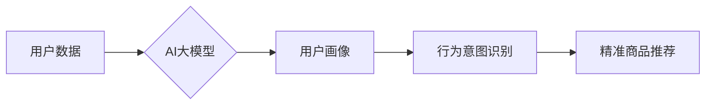

                 

## AI 大模型在电商搜索推荐中的用户画像构建：精准把握用户需求与行为意图

> 关键词：AI大模型、用户画像、电商搜索推荐、行为意图、需求预测、深度学习、自然语言处理

## 1. 背景介绍

在当今数据爆炸的时代，电商平台面临着日益激烈的竞争。如何精准把握用户的需求和行为意图，为用户提供个性化、精准的商品推荐，已成为电商平台发展的重要课题。传统的基于规则或协同过滤的推荐算法，由于缺乏对用户复杂行为和需求的理解，难以满足用户日益多样化的需求。

近年来，随着深度学习技术的快速发展，AI大模型在电商搜索推荐领域展现出巨大的潜力。AI大模型能够通过学习海量用户数据，挖掘用户潜在需求和行为模式，构建更加精准的用户画像，从而实现更精准的商品推荐。

## 2. 核心概念与联系

### 2.1 用户画像

用户画像是指通过对用户数据进行分析和挖掘，构建出用户特征、行为模式、兴趣偏好等多维度的描述，从而形成对用户的全面认知。

### 2.2 行为意图

行为意图是指用户在特定场景下，通过特定的行为表现出的目标或需求。例如，用户搜索“运动鞋”可能意图购买运动鞋，也可能只是想了解运动鞋的款式和价格。

### 2.3 AI大模型

AI大模型是指训练规模庞大、参数数量众多的深度学习模型，能够学习复杂的数据模式和关系，并进行预测、分类、生成等多种任务。

**核心概念与联系流程图**



## 3. 核心算法原理 & 具体操作步骤

### 3.1 算法原理概述

AI大模型在电商搜索推荐中的用户画像构建，主要基于以下核心算法：

* **深度学习**: 利用多层神经网络，从海量用户数据中学习用户特征和行为模式。
* **自然语言处理 (NLP)**: 对用户搜索词、评论、浏览记录等文本数据进行分析，提取用户意图和需求信息。
* **推荐算法**: 基于用户画像和行为意图，推荐与用户需求相匹配的商品。

### 3.2 算法步骤详解

1. **数据收集**: 收集用户行为数据，包括搜索记录、浏览记录、购买记录、评论数据等。
2. **数据预处理**: 对收集到的数据进行清洗、转换、编码等预处理，使其适合模型训练。
3. **特征工程**: 从用户数据中提取特征，例如用户年龄、性别、地理位置、购买历史、浏览偏好等。
4. **模型训练**: 利用深度学习算法，训练AI大模型，使其能够学习用户特征和行为模式。
5. **模型评估**: 使用测试数据评估模型性能，并进行模型调优。
6. **用户画像构建**: 基于训练好的模型，对用户进行画像构建，生成用户特征、行为模式、兴趣偏好等多维度的描述。
7. **行为意图识别**: 利用NLP算法，对用户搜索词、评论等文本数据进行分析，识别用户的行为意图。
8. **精准商品推荐**: 基于用户画像和行为意图，推荐与用户需求相匹配的商品。

### 3.3 算法优缺点

**优点**:

* 能够学习用户复杂的行为模式和需求。
* 推荐结果更加精准和个性化。
* 能够不断学习和优化，提升推荐效果。

**缺点**:

* 需要海量数据进行训练。
* 模型训练成本较高。
* 存在数据隐私和安全问题。

### 3.4 算法应用领域

* **电商搜索推荐**: 为用户推荐相关商品。
* **内容推荐**: 为用户推荐感兴趣的内容。
* **广告推荐**: 为用户推荐相关的广告。
* **个性化服务**: 为用户提供个性化的服务体验。

## 4. 数学模型和公式 & 详细讲解 & 举例说明

### 4.1 数学模型构建

用户画像构建可以采用基于用户的协同过滤模型，该模型通过分析用户之间的相似性，预测用户对商品的评分或偏好。

**用户-商品评分矩阵**:

$$
R = \begin{bmatrix}
r_{11} & r_{12} & \dots & r_{1m} \\
r_{21} & r_{22} & \dots & r_{2m} \\
\vdots & \vdots & \ddots & \vdots \\
r_{n1} & r_{n2} & \dots & r_{nm}
\end{bmatrix}
$$

其中，$r_{ij}$ 表示用户 $i$ 对商品 $j$ 的评分，$n$ 为用户数量，$m$ 为商品数量。

**相似度计算**:

可以使用余弦相似度或皮尔逊相关系数等方法计算用户之间的相似度。

**预测评分**:

$$
\hat{r}_{ui} = \frac{\sum_{j \in N(u)} s_{uj} r_{uj}}{\sum_{j \in N(u)} s_{uj}}
$$

其中，$\hat{r}_{ui}$ 为预测用户 $u$ 对商品 $i$ 的评分，$N(u)$ 为与用户 $u$ 相似的用户集合，$s_{uj}$ 为用户 $u$ 和用户 $j$ 的相似度。

### 4.2 公式推导过程

余弦相似度公式推导过程如下：

$$
\text{cosine}(u, v) = \frac{u \cdot v}{||u|| ||v||}
$$

其中，$u$ 和 $v$ 为两个向量的表示，$u \cdot v$ 为两个向量的点积，$||u||$ 和 $||v||$ 为两个向量的模长。

### 4.3 案例分析与讲解

假设有两个用户 $A$ 和 $B$，他们对以下商品的评分如下：

| 商品 | 用户 $A$ | 用户 $B$ |
|---|---|---|
| 商品 1 | 5 | 4 |
| 商品 2 | 3 | 5 |
| 商品 3 | 4 | 3 |

可以使用余弦相似度计算用户 $A$ 和 $B$ 的相似度。

$$
\text{cosine}(A, B) = \frac{(5 \cdot 4) + (3 \cdot 5) + (4 \cdot 3)}{\sqrt{5^2 + 3^2 + 4^2} \sqrt{4^2 + 5^2 + 3^2}} = \frac{20 + 15 + 12}{\sqrt{50} \sqrt{50}} = \frac{47}{50} = 0.94
$$

用户 $A$ 和 $B$ 的相似度为 0.94，说明他们对商品的偏好非常相似。

## 5. 项目实践：代码实例和详细解释说明

### 5.1 开发环境搭建

* Python 3.6+
* TensorFlow 或 PyTorch
* Jupyter Notebook

### 5.2 源代码详细实现

```python
# 导入必要的库
import tensorflow as tf

# 定义用户-商品评分矩阵
ratings = tf.constant([
    [5, 4, 3],
    [3, 5, 4],
    [4, 3, 5]
])

# 定义用户相似度计算函数
def cosine_similarity(u1, u2):
    dot_product = tf.reduce_sum(u1 * u2)
    norm_u1 = tf.norm(u1)
    norm_u2 = tf.norm(u2)
    return dot_product / (norm_u1 * norm_u2)

# 计算用户之间的相似度
similarities = tf.map_fn(lambda u: cosine_similarity(u, ratings), ratings)

# 打印相似度矩阵
print(similarities)
```

### 5.3 代码解读与分析

* 代码首先导入必要的库。
* 然后定义用户-商品评分矩阵。
* 定义 `cosine_similarity` 函数，计算两个用户的余弦相似度。
* 使用 `tf.map_fn` 函数，对每个用户计算与其他用户的相似度。
* 最后打印相似度矩阵。

### 5.4 运行结果展示

运行代码后，会输出一个相似度矩阵，其中每个元素表示两个用户之间的相似度。

## 6. 实际应用场景

AI大模型在电商搜索推荐中的用户画像构建，已在许多电商平台得到应用，例如：

* **淘宝**: 利用 AI大模型构建用户画像，推荐个性化商品和内容。
* **京东**: 使用 AI大模型进行商品分类和推荐，提升用户购物体验。
* **拼多多**: 基于用户画像，精准推送商品广告，提高转化率。

### 6.4 未来应用展望

未来，AI大模型在电商搜索推荐中的应用将更加广泛和深入，例如：

* **更精准的用户画像**: 利用多模态数据，构建更加全面的用户画像。
* **更个性化的推荐**: 基于用户动态行为和兴趣变化，提供更加个性化的商品推荐。
* **更智能的交互**: 利用自然语言处理，实现更智能的商品搜索和交互体验。

## 7. 工具和资源推荐

### 7.1 学习资源推荐

* **书籍**:
    * 《深度学习》
    * 《自然语言处理》
    * 《推荐系统》
* **在线课程**:
    * Coursera
    * edX
    * Udacity

### 7.2 开发工具推荐

* **TensorFlow**: 开源深度学习框架。
* **PyTorch**: 开源深度学习框架。
* **Scikit-learn**: 机器学习库。

### 7.3 相关论文推荐

* **Attention Is All You Need**: https://arxiv.org/abs/1706.03762
* **BERT**: https://arxiv.org/abs/1810.04805
* **Recurrent Neural Networks for Sequence Learning**: https://arxiv.org/abs/1409.2329

## 8. 总结：未来发展趋势与挑战

### 8.1 研究成果总结

AI大模型在电商搜索推荐中的用户画像构建，取得了显著的成果，能够精准把握用户需求和行为意图，提升用户体验和商业价值。

### 8.2 未来发展趋势

未来，AI大模型在电商搜索推荐领域将朝着以下方向发展：

* **更精准的用户画像**: 利用多模态数据，构建更加全面的用户画像。
* **更个性化的推荐**: 基于用户动态行为和兴趣变化，提供更加个性化的商品推荐。
* **更智能的交互**: 利用自然语言处理，实现更智能的商品搜索和交互体验。

### 8.3 面临的挑战

AI大模型在电商搜索推荐中的应用也面临着一些挑战：

* **数据隐私和安全**: 如何保护用户数据隐私和安全，是需要认真考虑的问题。
* **模型解释性**: AI大模型的决策过程往往难以解释，这可能会导致用户对推荐结果的信任度降低。
* **模型公平性**: AI大模型可能会存在偏见，导致推荐结果不公平。

### 8.4 研究展望

未来，需要进一步研究如何解决这些挑战，使 AI大模型在电商搜索推荐领域得到更加广泛和深入的应用。

## 9. 附录：常见问题与解答

**Q1: AI大模型的训练成本很高吗？**

A1: 确实，AI大模型的训练成本较高，需要大量的计算资源和数据。

**Q2: 如何保证 AI大模型的推荐结果公平性？**

A2: 这是一个重要的研究方向，需要通过数据预处理、模型设计和评估等手段，尽量减少 AI大模型的偏见。

**Q3: 如何解释 AI大模型的推荐结果？**

A3: 这也是一个重要的研究方向，需要开发新的方法，使 AI大模型的决策过程更加透明和可解释。


作者：禅与计算机程序设计艺术 / Zen and the Art of Computer Programming 
<end_of_turn>

