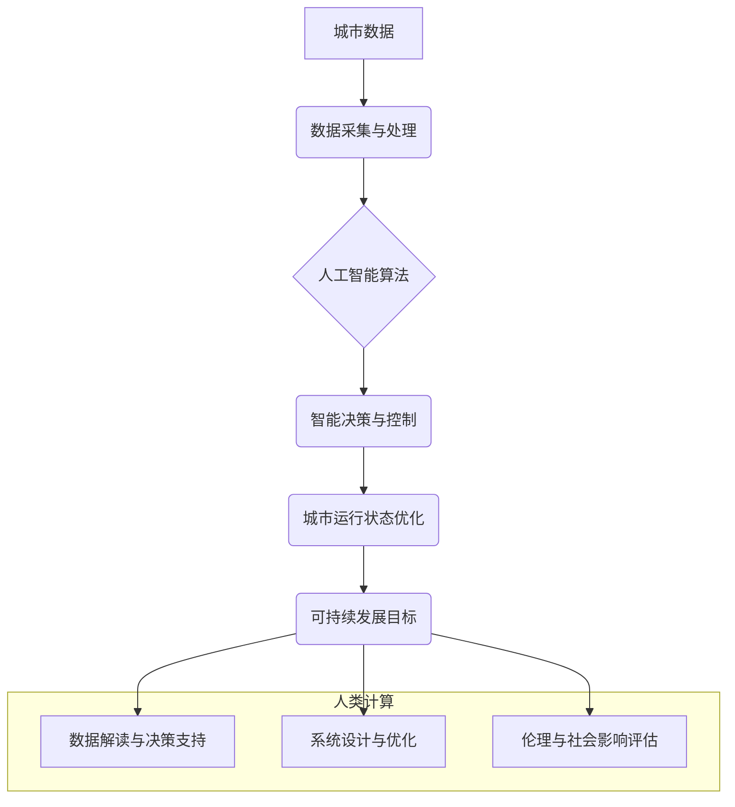

                 

## AI与人类计算：打造可持续发展的城市生活模式与设计规划

> 关键词：人工智能、城市计算、可持续发展、城市规划、人类计算、数据驱动、智能系统、优化算法、机器学习

## 1. 背景介绍

随着全球人口的快速增长和城市化的进程加速，城市面临着日益严峻的挑战，包括资源短缺、环境污染、交通拥堵、社会不公等。传统城市规划模式难以有效应对这些挑战，亟需引入新的理念和技术手段。人工智能（AI）作为一门新兴技术，凭借其强大的数据处理能力、模式识别能力和决策优化能力，为打造可持续发展的城市生活模式提供了新的思路和解决方案。

城市计算是指利用传感器、网络、数据分析和人工智能等技术，对城市运行状态进行实时监测、分析和预测，并根据分析结果进行智能决策和控制。它将城市视为一个复杂的计算系统，通过数据驱动的方式，实现城市管理的智能化、高效化和可持续化。

人类计算是指利用人类的智慧、经验和创造力，与人工智能技术相结合，共同解决复杂问题。在城市计算中，人类计算扮演着至关重要的角色，例如：

* **数据解读和决策支持:** 人工智能可以提供大量数据分析结果，但最终的决策权仍然掌握在人类手中。人类需要根据数据分析结果，结合自身经验和专业知识，做出合理的决策。
* **系统设计和优化:** 人工智能算法需要根据具体的城市环境和需求进行设计和优化。人类需要参与到系统设计和优化过程中，确保系统能够满足城市实际需求。
* **伦理和社会影响评估:** 人工智能技术的应用可能会带来一些伦理和社会影响，例如数据隐私、算法偏见等。人类需要对这些问题进行深入思考和评估，确保人工智能技术的应用能够造福人类。

## 2. 核心概念与联系

城市计算和人类计算相互补充，共同构成了一个智能城市发展的新模式。



## 3. 核心算法原理 & 具体操作步骤

### 3.1  算法原理概述

城市计算中常用的核心算法包括：

* **机器学习算法:** 用于从城市数据中学习模式和规律，例如预测交通流量、识别违章停车等。
* **深度学习算法:** 用于处理复杂的数据，例如图像识别、语音识别等。
* **强化学习算法:** 用于训练智能代理，使其能够在城市环境中做出最优决策，例如无人驾驶汽车、智能交通信号灯等。
* **优化算法:** 用于解决城市规划和管理中的优化问题，例如资源分配、路径规划等。

### 3.2  算法步骤详解

以机器学习算法为例，其基本步骤包括：

1. **数据收集:** 收集城市相关数据，例如交通流量、人口密度、天气状况等。
2. **数据预处理:** 对收集到的数据进行清洗、转换和特征提取等操作，使其能够被算法所使用。
3. **模型选择:** 选择合适的机器学习算法模型，例如线性回归、决策树、支持向量机等。
4. **模型训练:** 使用训练数据对模型进行训练，使其能够学习数据中的模式和规律。
5. **模型评估:** 使用测试数据对模型进行评估，评估模型的准确率、召回率等指标。
6. **模型部署:** 将训练好的模型部署到实际应用场景中，用于预测和决策。

### 3.3  算法优缺点

**优点:**

* **数据驱动:** 基于大量数据分析，能够提供更准确、更可靠的预测和决策。
* **智能化:** 自动化决策过程，提高效率和准确性。
* **可持续性:** 通过优化资源分配和城市运行模式，促进城市可持续发展。

**缺点:**

* **数据依赖:** 算法的性能取决于数据的质量和数量。
* **算法黑盒:** 一些算法的决策过程难以解释，缺乏透明度。
* **伦理风险:** 算法可能存在偏见或歧视，需要进行伦理评估和监管。

### 3.4  算法应用领域

* **智能交通:** 交通流量预测、拥堵缓解、智能信号灯控制、无人驾驶汽车等。
* **环境监测:** 空气质量监测、水质监测、噪声污染监测等。
* **城市规划:** 城市空间规划、资源分配、公共设施布局等。
* **公共安全:** 犯罪预测、紧急事件响应、公共安全监控等。

## 4. 数学模型和公式 & 详细讲解 & 举例说明

### 4.1  数学模型构建

城市计算中常用的数学模型包括：

* **交通流量模型:** 用于预测交通流量，例如：

$$
\text{流量} = f(\text{时间}, \text{地点}, \text{天气}, \text{事件})
$$

其中，流量表示交通流量，时间、地点、天气、事件分别表示影响交通流量的因素。

* **资源分配模型:** 用于优化资源分配，例如：

$$
\text{目标函数} = \text{最大化效益} - \text{成本}
$$

其中，目标函数表示资源分配的目标，效益表示资源分配带来的效益，成本表示资源分配的成本。

### 4.2  公式推导过程

以交通流量预测为例，可以使用线性回归模型进行预测。

1. 收集历史交通流量数据，包括时间、地点、天气、事件等因素。
2. 将数据进行线性回归分析，得到交通流量与各因素之间的关系式。
3. 使用得到的回归方程，预测未来交通流量。

### 4.3  案例分析与讲解

例如，可以使用机器学习算法预测城市交通拥堵情况。

1. 收集城市交通数据，包括道路拥堵情况、交通信号灯状态、车辆数量等。
2. 使用机器学习算法训练模型，例如深度神经网络，学习交通拥堵与各因素之间的关系。
3. 将训练好的模型部署到城市交通管理系统中，实时预测交通拥堵情况，并根据预测结果调整交通信号灯状态、引导车辆行驶路线等，缓解交通拥堵。

## 5. 项目实践：代码实例和详细解释说明

### 5.1  开发环境搭建

* 操作系统：Linux/Windows/macOS
* 编程语言：Python
* 库依赖：NumPy、Pandas、Scikit-learn、TensorFlow等

### 5.2  源代码详细实现

```python
# 导入必要的库
import numpy as np
from sklearn.linear_model import LinearRegression

# 加载交通流量数据
data = pd.read_csv("traffic_data.csv")

# 选择特征变量和目标变量
X = data[['时间', '地点', '天气']]
y = data['流量']

# 创建线性回归模型
model = LinearRegression()

# 训练模型
model.fit(X, y)

# 使用模型预测未来交通流量
future_data = pd.DataFrame({'时间': [10, 11, 12], '地点': ['A', 'B', 'C'], '天气': ['晴', '阴', '雨']})
predicted_traffic = model.predict(future_data)

# 打印预测结果
print(predicted_traffic)
```

### 5.3  代码解读与分析

* 代码首先导入必要的库，例如NumPy用于数值计算、Pandas用于数据处理、Scikit-learn用于机器学习算法。
* 然后加载交通流量数据，并选择特征变量和目标变量。
* 创建线性回归模型，并使用训练数据训练模型。
* 最后使用训练好的模型预测未来交通流量，并打印预测结果。

### 5.4  运行结果展示

运行代码后，将输出未来交通流量的预测结果。

## 6. 实际应用场景

* **智能交通管理:** 利用城市计算技术，实现交通流量预测、拥堵缓解、智能信号灯控制等，提高城市交通效率和安全性。
* **环境监测与保护:** 利用传感器网络和数据分析技术，实时监测城市环境质量，例如空气质量、水质、噪声污染等，并采取措施进行环境保护。
* **城市规划与管理:** 利用数据分析和优化算法，优化城市空间规划、资源分配、公共设施布局等，提高城市管理效率和居民生活质量。
* **公共安全保障:** 利用人工智能技术，实现犯罪预测、紧急事件响应、公共安全监控等，提高城市公共安全水平。

### 6.4  未来应用展望

随着人工智能技术的发展，城市计算将更加智能化、个性化和可持续化。未来，城市计算将应用于更多领域，例如：

* **智慧医疗:** 利用人工智能技术，实现疾病预测、医疗诊断、个性化治疗等，提高医疗服务质量和效率。
* **智慧教育:** 利用人工智能技术，实现个性化学习、智能辅导、在线教育等，提高教育质量和效率。
* **智慧能源:** 利用人工智能技术，实现能源管理优化、智能配电、可再生能源利用等，提高能源利用效率和可持续性。

## 7. 工具和资源推荐

### 7.1  学习资源推荐

* **在线课程:** Coursera、edX、Udacity等平台提供人工智能、城市计算等方面的在线课程。
* **书籍:** 《深度学习》、《人工智能：一种现代方法》、《城市计算》等书籍。
* **博客和论坛:** 知乎、CSDN、Stack Overflow等平台提供人工智能、城市计算等方面的技术博客和论坛。

### 7.2  开发工具推荐

* **编程语言:** Python、Java、C++等。
* **机器学习库:** Scikit-learn、TensorFlow、PyTorch等。
* **数据分析工具:** Pandas、NumPy、Matplotlib等。
* **云计算平台:** AWS、Azure、GCP等。

### 7.3  相关论文推荐

* **城市计算:** "Urban Computing: A Survey"
* **人工智能:** "Deep Learning"
* **可持续发展:** "Sustainable Development Goals"

## 8. 总结：未来发展趋势与挑战

### 8.1  研究成果总结

城市计算和人工智能技术的发展为打造可持续发展的城市生活模式提供了新的思路和解决方案。通过数据驱动、智能化和可持续性，城市计算能够提高城市管理效率、提升居民生活质量、促进城市可持续发展。

### 8.2  未来发展趋势

* **更智能的城市系统:** 利用更先进的人工智能算法，实现城市系统更加智能化、自动化和自适应。
* **更个性化的城市服务:** 利用数据分析和机器学习，提供更加个性化、定制化的城市服务，满足不同居民的需求。
* **更可持续的城市发展:** 利用城市计算技术，优化城市资源分配、降低碳排放、促进环境保护，实现城市的可持续发展。

### 8.3  面临的挑战

* **数据安全和隐私保护:** 城市计算需要收集和处理大量个人数据，因此数据安全和隐私保护是一个重要的挑战。
* **算法公平性和透明度:** 人工智能算法可能存在偏见或歧视，需要确保算法公平性和透明度。
* **技术伦理和社会影响:** 人工智能技术的应用可能会带来一些伦理和社会影响，需要进行深入思考和评估。

### 8.4  研究展望

未来，城市计算和人工智能技术将继续发展，为打造更加智能、可持续和宜居的城市贡献力量。需要加强多学科交叉研究，探索更先进的算法和技术，并关注技术伦理和社会影响，确保人工智能技术能够真正造福人类。

## 9. 附录：常见问题与解答

**Q1: 城市计算和智能城市有什么区别？**

**A1:** 城市计算是智能城市建设的基础，它利用数据和人工智能技术，对城市运行状态进行监测、分析和预测。智能城市则是利用城市计算等技术，实现城市管理的智能化、高效化和可持续化，提升居民生活质量和城市竞争力。

**Q2: 城市计算需要哪些数据？**

**A2:** 城市计算需要收集各种城市数据，例如交通流量、人口密度、天气状况、环境质量、公共设施使用情况等。

**Q3: 城市计算有哪些应用场景？**

**A3:** 城市计算的应用场景非常广泛，例如智能交通、环境监测、城市规划、公共安全等。

**作者：禅与计算机程序设计艺术 / Zen and the Art of Computer Programming**


<end_of_turn>

