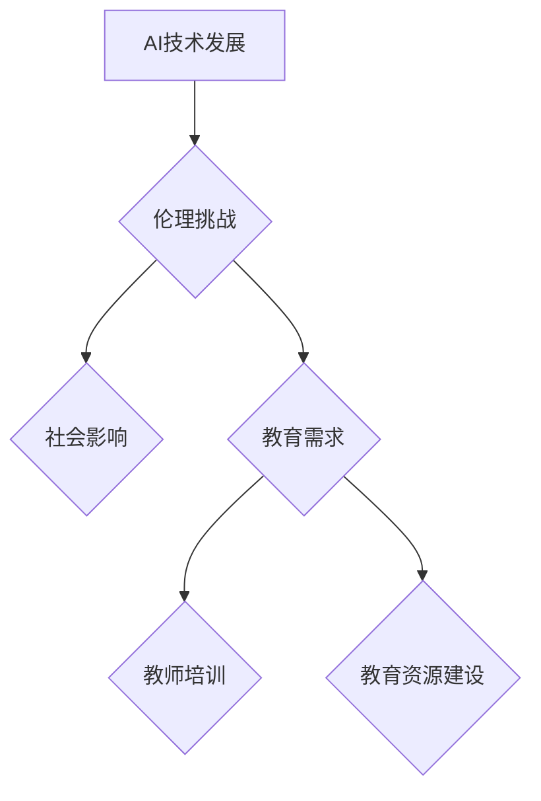

                 

## AI伦理的教育政策:教师培训和教育资源建设

> 关键词：人工智能伦理、教师培训、教育资源、算法偏见、数据隐私、透明度、可解释性、社会影响

## 1. 背景介绍

人工智能（AI）技术飞速发展，已渗透到生活的方方面面，从医疗保健到金融服务，再到交通运输，AI正在改变着我们的世界。然而，AI技术的进步也带来了新的伦理挑战，例如算法偏见、数据隐私、透明度和可解释性等问题。这些挑战需要我们认真思考，并制定相应的教育政策来应对。

教育是培养公民道德和责任感的关键途径。在AI时代，教育政策应将AI伦理纳入课程体系，培养学生对AI技术的理解和批判性思考能力，帮助他们成为负责任的AI使用者和开发者。

## 2. 核心概念与联系

**2.1 AI伦理的核心概念**

AI伦理涉及到AI技术在社会中的应用所带来的伦理问题，主要包括以下几个核心概念：

* **公平性:** AI系统应公平公正地对待所有用户，避免因种族、性别、宗教等因素而产生歧视。
* **透明度:** AI系统的决策过程应透明可解释，用户能够理解AI是如何做出决定的。
* **可控性:** 人类应能够控制AI系统的行为，避免AI系统失控或被滥用。
* **责任:** AI系统的开发和应用应承担相应的社会责任，避免造成负面影响。
* **隐私:** AI系统应保护用户的隐私信息，避免未经授权的访问和使用。

**2.2 AI伦理与教育的联系**

AI伦理与教育有着密切的联系。教育可以帮助学生理解AI技术的原理和潜在风险，培养他们对AI伦理的思考和判断能力。同时，教育也可以帮助学生学习如何负责任地使用AI技术，避免造成负面影响。

**2.3 AI伦理教育的必要性**

在AI时代，AI伦理教育变得尤为重要。因为AI技术正在越来越深入地影响着我们的生活，我们需要确保AI技术的发展和应用符合人类的价值观和利益。

**Mermaid 流程图**

## 3. 核心算法原理 & 具体操作步骤

**3.1 算法原理概述**

在AI伦理教育中，需要对一些核心算法原理进行讲解，例如：

* **监督学习:** 通过标记数据训练模型，用于预测或分类。
* **无监督学习:** 通过未标记数据发现模式和结构。
* **强化学习:** 通过奖励和惩罚机制训练模型，使其在特定环境中做出最佳决策。

**3.2 算法步骤详解**

对于每个算法，需要详细讲解其步骤，例如：

* **监督学习:** 数据预处理、特征工程、模型选择、模型训练、模型评估、模型部署。
* **无监督学习:** 数据预处理、特征工程、聚类算法选择、聚类结果分析。
* **强化学习:** 环境建模、奖励函数设计、策略选择、策略训练、策略评估。

**3.3 算法优缺点**

需要分析每个算法的优缺点，例如：

* **监督学习:** 优点：准确率高；缺点：需要大量标记数据。
* **无监督学习:** 优点：不需要标记数据；缺点：结果解释性较差。
* **强化学习:** 优点：能够学习复杂决策；缺点：训练时间长，容易陷入局部最优。

**3.4 算法应用领域**

需要介绍每个算法在不同领域的应用，例如：

* **监督学习:** 图像识别、自然语言处理、医疗诊断。
* **无监督学习:** 客户画像、异常检测、数据压缩。
* **强化学习:** 游戏AI、机器人控制、自动驾驶。

## 4. 数学模型和公式 & 详细讲解 & 举例说明

**4.1 数学模型构建**

在AI伦理教育中，需要对一些数学模型进行讲解，例如：

* **贝叶斯公式:** 用于计算条件概率，在AI算法中用于分类和预测。
* **损失函数:** 用于衡量模型预测结果与真实结果之间的差异，在模型训练中用于优化模型参数。
* **梯度下降算法:** 用于优化模型参数，通过迭代更新参数，使损失函数最小化。

**4.2 公式推导过程**

需要详细推导这些公式的推导过程，并解释其含义。例如：

* **贝叶斯公式:** $P(A|B) = \frac{P(B|A)P(A)}{P(B)}$

**4.3 案例分析与讲解**

需要通过案例分析，解释这些公式在实际应用中的意义。例如：

* **贝叶斯公式:** 在垃圾邮件过滤中，可以使用贝叶斯公式计算邮件属于垃圾邮件的概率。

## 5. 项目实践：代码实例和详细解释说明

**5.1 开发环境搭建**

需要介绍如何搭建AI开发环境，例如：

* 安装Python和相关库（例如TensorFlow、PyTorch）。
* 设置虚拟环境。
* 下载和安装必要的工具（例如Jupyter Notebook）。

**5.2 源代码详细实现**

需要提供一个简单的AI项目代码实例，例如：

* 一个简单的图像分类模型。
* 一个简单的文本生成模型。

**5.3 代码解读与分析**

需要对代码进行详细解读，解释每个代码块的功能和作用。

**5.4 运行结果展示**

需要展示代码运行的结果，例如：

* 分类模型的准确率。
* 文本生成模型生成的文本内容。

## 6. 实际应用场景

**6.1 AI伦理在教育领域的应用**

* **公平性:** 避免AI系统在教育中产生歧视，例如在自动批改作业时，避免因学生背景而产生偏见。
* **透明度:** 使AI系统在教育中的决策过程更加透明，例如在学生个性化学习推荐时，让学生了解AI是如何做出推荐的。
* **可控性:** 保证人类在教育中仍然拥有控制权，例如在AI辅助教学中，教师仍然需要对教学内容进行最终判断。

**6.2 AI伦理在其他领域的应用**

* **医疗保健:** 避免AI系统在医疗诊断中产生误判，保护患者隐私。
* **金融服务:** 避免AI系统在贷款审批中产生歧视，防止金融欺诈。
* **交通运输:** 确保自动驾驶系统安全可靠，避免造成交通事故。

**6.4 未来应用展望**

随着AI技术的不断发展，AI伦理在更多领域将发挥越来越重要的作用。我们需要不断探索新的AI伦理问题，并制定相应的解决方案。

## 7. 工具和资源推荐

**7.1 学习资源推荐**

* **在线课程:** Coursera、edX、Udacity等平台提供AI伦理相关的在线课程。
* **书籍:** 《AI伦理》 、《算法的隐形世界》等书籍可以帮助读者深入了解AI伦理问题。
* **学术期刊:** 《人工智能杂志》、《自然》等学术期刊发表最新的AI伦理研究成果。

**7.2 开发工具推荐**

* **TensorFlow:** 一个开源的机器学习框架。
* **PyTorch:** 另一个开源的机器学习框架。
* **Jupyter Notebook:** 一个交互式编程环境，方便进行AI开发和实验。

**7.3 相关论文推荐**

* **《On the Dangers of Stochastic Parrots: Can Language Models Be Too Big?》**
* **《AI Ethics: A Guide for Developers》**
* **《The Alignment Problem: Machine Learning and Human Values》**

## 8. 总结：未来发展趋势与挑战

**8.1 研究成果总结**

近年来，AI伦理研究取得了显著进展，人们对AI伦理问题有了更深入的理解。

**8.2 未来发展趋势**

未来，AI伦理研究将更加注重以下几个方面：

* **跨学科合作:** AI伦理研究需要跨越计算机科学、哲学、社会学等多个学科的界限。
* **实践应用:** 将AI伦理研究成果应用到实际场景中，解决实际问题。
* **国际合作:** AI伦理是一个全球性问题，需要各国共同努力，制定国际标准和规范。

**8.3 面临的挑战**

AI伦理研究还面临着一些挑战，例如：

* **定义模糊:** AI伦理概念的界定仍然存在争议。
* **技术发展速度快:** AI技术发展速度很快，伦理问题也随之不断涌现。
* **利益冲突:** 不同利益相关者对AI伦理的理解和诉求可能存在冲突。

**8.4 研究展望**

我们需要继续加强AI伦理研究，为AI技术的健康发展提供理论和实践指导。

## 9. 附录：常见问题与解答

**9.1 如何避免AI系统产生算法偏见？**

* 使用多样化的训练数据，避免数据偏差。
* 对训练数据进行预处理，消除潜在的偏见。
* 使用公平性评估指标，评估模型的公平性。

**9.2 如何保护用户的隐私信息？**

* 采用数据加密技术，保护用户数据安全。
* 遵循数据隐私法规，规范用户数据的使用。
* 提供用户隐私设置，让用户控制自己的数据。

作者：禅与计算机程序设计艺术 / Zen and the Art of Computer Programming 
<end_of_turn>

