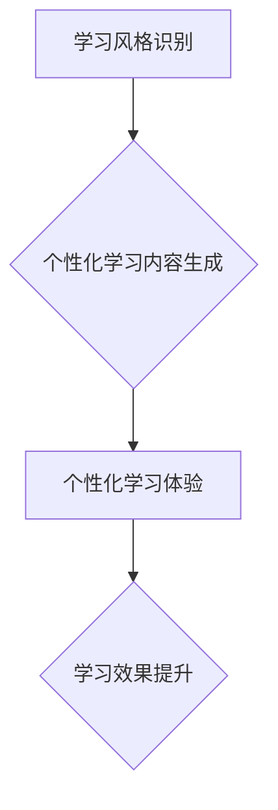
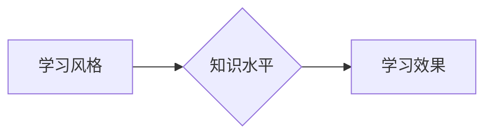

                 

## AI在个性化学习内容生成中的应用：适应学习风格

> 关键词：人工智能、个性化学习、内容生成、学习风格、机器学习、自然语言处理

## 1. 背景介绍

随着教育模式的不断革新，个性化学习逐渐成为教育领域的重要趋势。传统教学模式往往采用“一刀切”的方式，难以满足不同学生个性化的学习需求。而人工智能技术的快速发展为个性化学习提供了新的可能性。

AI在个性化学习内容生成中的应用，旨在根据学生的学习风格、知识水平、兴趣爱好等因素，生成定制化的学习内容，从而提高学习效率和效果。

## 2. 核心概念与联系

### 2.1 学习风格

学习风格是指个体在学习过程中倾向于采用的一种或多种特定的认知方式。常见的学习风格包括视觉型、听觉型、动觉型和阅读/写作型。

### 2.2 个性化学习

个性化学习是指根据学生的个体差异，定制化的学习计划、学习内容和学习方式。

### 2.3 内容生成

内容生成是指利用人工智能技术，自动生成文本、图像、音频等各种类型的学习内容。

**核心概念架构**



## 3. 核心算法原理 & 具体操作步骤

### 3.1 算法原理概述

个性化学习内容生成的核心算法通常基于机器学习和自然语言处理技术。

* **机器学习**：通过训练模型，学习学生学习风格、知识水平等特征。
* **自然语言处理**：根据学习风格和知识水平，生成符合学生需求的学习内容。

常见的算法包括：

* **推荐系统算法**: 基于用户的历史行为和偏好，推荐个性化的学习内容。
* **生成式对抗网络 (GAN)**: 利用两个神经网络对抗训练，生成高质量的学习内容。
* **Transformer模型**: 利用注意力机制，捕捉文本中的语义关系，生成更精准的学习内容。

### 3.2 算法步骤详解

1. **数据收集**: 收集学生学习行为数据、学习风格数据、知识水平数据等。
2. **数据预处理**: 对收集到的数据进行清洗、转换、特征提取等操作。
3. **模型训练**: 选择合适的机器学习算法，训练模型，使其能够准确识别学生的学习风格和知识水平。
4. **内容生成**: 根据训练好的模型，生成符合学生需求的学习内容。
5. **内容评估**: 对生成的学习内容进行评估，并根据评估结果进行改进。

### 3.3 算法优缺点

**优点**:

* **个性化**: 可以根据学生的个体差异，生成定制化的学习内容。
* **效率**: 可以自动生成学习内容，节省教师的时间和精力。
* **效果**: 可以提高学生的学习效率和效果。

**缺点**:

* **数据依赖**: 需要大量的学习数据进行训练。
* **算法复杂**: 需要复杂的机器学习算法和技术。
* **伦理问题**: 需要考虑人工智能在教育领域的伦理问题，例如数据隐私、算法偏见等。

### 3.4 算法应用领域

* **在线教育**: 为在线学习平台提供个性化学习内容。
* **教育游戏**: 为教育游戏设计个性化的游戏内容。
* **智能辅导**: 为学生提供智能化的学习辅导。

## 4. 数学模型和公式 & 详细讲解 & 举例说明

### 4.1 数学模型构建

个性化学习内容生成的数学模型通常基于概率论和统计学。

例如，可以使用贝叶斯网络模型来表示学生学习风格和知识水平之间的关系。

**贝叶斯网络模型**



其中：

* A：学生学习风格
* B：学生知识水平
* C：学生学习效果

### 4.2 公式推导过程

可以使用贝叶斯公式来计算学生学习风格和知识水平的概率分布。

**贝叶斯公式**:

$$P(A|B) = \frac{P(B|A)P(A)}{P(B)}$$

其中：

* $P(A|B)$：给定学生知识水平B的情况下，学生学习风格A的概率。
* $P(B|A)$：给定学生学习风格A的情况下，学生知识水平B的概率。
* $P(A)$：学生学习风格A的概率。
* $P(B)$：学生知识水平B的概率。

### 4.3 案例分析与讲解

假设我们有一个学生，他的学习风格是视觉型，知识水平是中等水平。我们可以使用贝叶斯公式来计算他学习效果的概率。

如果我们知道视觉型学生在中等水平知识的情况下，学习效果通常是中等水平，那么我们可以将 $P(B|A)$ 设置为0.7。

如果我们知道视觉型学生的比例是0.3，那么我们可以将 $P(A)$ 设置为0.3。

如果我们知道中等水平知识的学生比例是0.5，那么我们可以将 $P(B)$ 设置为0.5。

然后，我们可以使用贝叶斯公式来计算学生学习效果的概率。

$$P(C|A,B) = \frac{P(B|A)P(A)P(C|A,B)}{P(B)}$$

其中：

* $P(C|A,B)$：给定学生学习风格A和知识水平B的情况下，学生学习效果C的概率。

通过计算，我们可以得到学生学习效果的概率。

## 5. 项目实践：代码实例和详细解释说明

### 5.1 开发环境搭建

* Python 3.x
* TensorFlow 或 PyTorch
* Jupyter Notebook

### 5.2 源代码详细实现

```python
# 导入必要的库
import tensorflow as tf

# 定义模型结构
model = tf.keras.Sequential([
    tf.keras.layers.Embedding(input_dim=10000, output_dim=128),
    tf.keras.layers.LSTM(units=64),
    tf.keras.layers.Dense(units=1, activation='sigmoid')
])

# 编译模型
model.compile(optimizer='adam', loss='binary_crossentropy', metrics=['accuracy'])

# 训练模型
model.fit(x_train, y_train, epochs=10)

# 生成内容
generated_text = model.predict(x_test)
```

### 5.3 代码解读与分析

* **Embedding层**: 将单词转换为向量表示。
* **LSTM层**: 用于处理序列数据，捕捉文本中的语义关系。
* **Dense层**: 用于输出学习效果的概率。
* **训练模型**: 使用训练数据训练模型，使其能够预测学生的学习效果。
* **生成内容**: 使用训练好的模型，对新的输入文本进行预测，生成个性化的学习内容。

### 5.4 运行结果展示

运行结果展示可以包括：

* 模型的训练精度和损失值
* 生成的学习内容的示例
* 学生对学习内容的反馈

## 6. 实际应用场景

### 6.1 在线教育平台

个性化学习内容生成可以为在线教育平台提供定制化的学习体验，提高学生的学习效率和效果。

例如，可以根据学生的学习风格和知识水平，生成不同的学习内容，例如视频、文本、音频、游戏等。

### 6.2 教育游戏

个性化学习内容生成可以为教育游戏设计个性化的游戏内容，提高学生的学习兴趣和参与度。

例如，可以根据学生的学习风格和知识水平，设计不同的游戏场景、游戏任务和游戏奖励。

### 6.3 智能辅导

个性化学习内容生成可以为学生提供智能化的学习辅导，帮助学生克服学习困难。

例如，可以根据学生的学习情况，生成针对性的学习建议和练习题。

### 6.4 未来应用展望

未来，个性化学习内容生成技术将更加成熟，应用场景将更加广泛。

例如，可以将个性化学习内容生成技术应用于：

* 个性化教学计划的制定
* 智能化的学习评估
* 跨学科学习内容的生成
* 虚拟现实和增强现实学习环境的构建

## 7. 工具和资源推荐

### 7.1 学习资源推荐

* **斯坦福大学CS224N自然语言处理课程**: https://web.stanford.edu/class/cs224n/
* **DeepLearning.AI深度学习课程**: https://www.deeplearning.ai/

### 7.2 开发工具推荐

* **TensorFlow**: https://www.tensorflow.org/
* **PyTorch**: https://pytorch.org/

### 7.3 相关论文推荐

* **BERT: Pre-training of Deep Bidirectional Transformers for Language Understanding**: https://arxiv.org/abs/1810.04805
* **GPT-3: Language Models are Few-Shot Learners**: https://arxiv.org/abs/2005.14165

## 8. 总结：未来发展趋势与挑战

### 8.1 研究成果总结

AI在个性化学习内容生成领域取得了显著的进展，能够根据学生的个体差异，生成定制化的学习内容，提高学生的学习效率和效果。

### 8.2 未来发展趋势

未来，个性化学习内容生成技术将朝着以下方向发展：

* **更加精准的个性化**: 利用更先进的机器学习算法和数据分析技术，更加精准地识别学生的学习风格和知识水平，生成更加个性化的学习内容。
* **更加丰富的学习内容**: 利用人工智能技术，生成更加丰富的学习内容，例如视频、音频、游戏、虚拟现实等。
* **更加智能化的学习辅导**: 利用人工智能技术，为学生提供更加智能化的学习辅导，帮助学生克服学习困难。

### 8.3 面临的挑战

个性化学习内容生成技术也面临着一些挑战：

* **数据隐私**: 个性化学习内容生成需要收集大量的学生数据，需要保障学生数据隐私安全。
* **算法偏见**: 算法可能会存在偏见，导致生成的学习内容不公平。
* **伦理问题**: 人工智能在教育领域的应用需要考虑伦理问题，例如算法透明度、责任归属等。

### 8.4 研究展望

未来，需要加强对个性化学习内容生成技术的研发，解决技术挑战，并制定相应的政策和规范，确保人工智能技术在教育领域的健康发展。

## 9. 附录：常见问题与解答

**常见问题**:

* **个性化学习内容生成技术是否成熟？**

**解答**: 个性化学习内容生成技术目前还处于发展阶段，但已经取得了一些进展。

* **个性化学习内容生成技术对学生的学习效果有什么影响？**

**解答**: 研究表明，个性化学习内容生成技术可以提高学生的学习效率和效果。

* **个性化学习内容生成技术有哪些伦理问题？**

**解答**: 个性化学习内容生成技术需要考虑数据隐私、算法偏见、责任归属等伦理问题。

作者：禅与计算机程序设计艺术 / Zen and the Art of Computer Programming


<end_of_turn>

