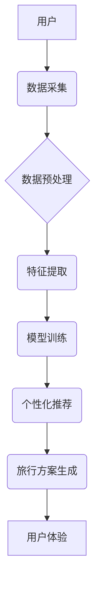

                 

## AI在个性化旅游规划中的应用：定制旅行体验

> 关键词：人工智能、个性化旅游、旅行规划、机器学习、深度学习、自然语言处理、推荐系统

## 1. 背景介绍

旅游业作为全球重要的经济支柱产业，近年来呈现出快速发展趋势。随着互联网和移动技术的普及，人们对旅游体验的需求也日益多样化，不再满足于传统的“一刀切”旅游套餐。个性化旅游，即根据游客的个人喜好、需求和预算定制专属旅行方案，逐渐成为旅游业发展的新方向。

传统旅游规划方式往往依赖于人工经验和模板化方案，难以满足个性化需求，且效率低下。而人工智能（AI）技术的快速发展为个性化旅游规划提供了新的机遇。AI算法能够通过分析海量旅游数据，识别游客的偏好和需求，并生成个性化的旅行建议，从而提升游客体验，提高旅游效率。

## 2. 核心概念与联系

**2.1 核心概念**

* **个性化旅游:** 根据游客的个人喜好、需求和预算定制专属旅行方案，提供差异化和定制化的旅游体验。
* **人工智能 (AI):**  模拟人类智能的计算机系统，能够学习、推理和决策。
* **机器学习 (ML):**  一种AI子领域，通过算法从数据中学习，不断改进预测和决策能力。
* **深度学习 (DL):**  一种更高级的机器学习方法，利用多层神经网络模拟人类大脑的学习过程。
* **自然语言处理 (NLP):**  使计算机能够理解和处理人类语言，例如文本和语音。
* **推荐系统:**  根据用户的历史行为和偏好，推荐相关商品、服务或内容。

**2.2 架构关系**



**2.3  核心技术**

* **数据挖掘:** 从海量旅游数据中提取有价值的信息，例如游客的兴趣爱好、旅行偏好、消费习惯等。
* **机器学习算法:**  例如协同过滤、内容过滤、深度学习等，用于分析用户数据，预测用户需求，并生成个性化推荐。
* **自然语言处理:**  用于理解用户的文本查询和语音指令，并将其转换为机器可理解的格式。
* **推荐系统技术:**  用于根据用户的历史行为和偏好，推荐相关的旅游目的地、景点、酒店、活动等。

## 3. 核心算法原理 & 具体操作步骤

**3.1 算法原理概述**

个性化旅游规划的核心算法通常基于机器学习，例如协同过滤、内容过滤和深度学习等。

* **协同过滤:**  根据用户的历史行为和相似用户对物品的评价，预测用户对特定物品的喜好。
* **内容过滤:**  根据物品的特征和用户的偏好，推荐与用户兴趣相符的物品。
* **深度学习:**  利用多层神经网络，从海量数据中学习更复杂的模式和关系，实现更精准的个性化推荐。

**3.2 算法步骤详解**

以协同过滤算法为例，其具体操作步骤如下：

1. **数据收集:** 收集用户对旅游产品的评分、评论、浏览记录等数据。
2. **数据预处理:** 清洗数据，处理缺失值，转换数据格式。
3. **用户和物品特征提取:**  提取用户的兴趣爱好、旅行偏好、消费习惯等特征，以及旅游产品的类型、地点、价格等特征。
4. **相似度计算:**  计算用户之间的相似度，例如基于余弦相似度或皮尔逊相关系数。
5. **推荐生成:**  根据用户与相似用户的评分偏好，推荐用户可能感兴趣的旅游产品。

**3.3 算法优缺点**

* **优点:**  能够根据用户的历史行为和偏好，提供个性化的推荐，提升用户体验。
* **缺点:**  

    * **冷启动问题:**  对于新用户或新产品，由于缺乏历史数据，难以进行准确的推荐。
    * **数据稀疏性问题:**  用户对旅游产品的评分和评论数据往往稀疏，难以训练出准确的推荐模型。
    * **数据偏差问题:**  用户数据可能存在偏差，例如用户评分可能受到情绪、时间等因素的影响。

**3.4 算法应用领域**

* **旅游推荐系统:**  推荐旅游目的地、景点、酒店、活动等。
* **个性化旅游路线规划:**  根据用户的兴趣爱好和预算，生成个性化的旅行路线。
* **旅游资源匹配:**  匹配用户的需求和旅游资源，例如寻找合适的导游、租车服务等。

## 4. 数学模型和公式 & 详细讲解 & 举例说明

**4.1 数学模型构建**

协同过滤算法的核心是计算用户之间的相似度和物品之间的相似度。常用的相似度度量方法包括余弦相似度和皮尔逊相关系数。

**4.2 公式推导过程**

* **余弦相似度:**  

$$
\text{相似度} = \frac{\mathbf{u} \cdot \mathbf{v}}{\|\mathbf{u}\| \|\mathbf{v}\|}
$$

其中，$\mathbf{u}$ 和 $\mathbf{v}$ 分别表示两个用户的评分向量，$\cdot$ 表示点积，$\|\mathbf{u}\|$ 和 $\|\mathbf{v}\|$ 分别表示两个向量的模长。

* **皮尔逊相关系数:**  

$$
\text{相似度} = \frac{\sum_{i=1}^{n}(u_i - \bar{u})(v_i - \bar{v})}{\sqrt{\sum_{i=1}^{n}(u_i - \bar{u})^2} \sqrt{\sum_{i=1}^{n}(v_i - \bar{v})^2}}
$$

其中，$u_i$ 和 $v_i$ 分别表示两个用户对第 $i$ 个物品的评分，$\bar{u}$ 和 $\bar{v}$ 分别表示两个用户的平均评分。

**4.3 案例分析与讲解**

假设有两个用户A和B，他们对三个旅游景点进行了评分，如下表所示：

| 景点 | 用户A评分 | 用户B评分 |
|---|---|---|
| 景点1 | 5 | 4 |
| 景点2 | 3 | 2 |
| 景点3 | 4 | 5 |

我们可以使用余弦相似度或皮尔逊相关系数计算用户A和B之间的相似度。例如，使用余弦相似度计算，得到用户A和B之间的相似度为0.6，表明他们有一定的相似性。

## 5. 项目实践：代码实例和详细解释说明

**5.1 开发环境搭建**

* **操作系统:**  Linux/macOS/Windows
* **编程语言:**  Python
* **库依赖:**  pandas, numpy, scikit-learn, tensorflow 等

**5.2 源代码详细实现**

```python
import pandas as pd
from sklearn.metrics.pairwise import cosine_similarity

# 加载用户评分数据
data = pd.read_csv('user_ratings.csv')

# 提取用户评分矩阵
user_ratings = data.pivot_table(index='user_id', columns='item_id', values='rating')

# 计算用户之间的余弦相似度
user_similarity = cosine_similarity(user_ratings)

# 获取用户A和用户B之间的相似度
user_A_id = 1
user_B_id = 2
similarity_score = user_similarity[user_A_id, user_B_id]

print(f'用户{user_A_id}和用户{user_B_id}之间的相似度为: {similarity_score}')
```

**5.3 代码解读与分析**

*  代码首先加载用户评分数据，并将其转换为用户评分矩阵。
*  然后使用scikit-learn库中的cosine_similarity函数计算用户之间的余弦相似度。
*  最后获取用户A和用户B之间的相似度，并打印输出。

**5.4 运行结果展示**

运行上述代码后，会输出用户A和用户B之间的相似度值。

## 6. 实际应用场景

**6.1 个性化旅游推荐**

*  根据用户的历史浏览记录、评分和评论，推荐与用户兴趣相符的旅游目的地、景点、酒店、活动等。
*  提供个性化的旅行套餐，满足用户的不同需求和预算。

**6.2 个性化旅行路线规划**

*  根据用户的兴趣爱好、旅行时间和预算，生成个性化的旅行路线。
*  提供路线优化建议，例如推荐最佳交通方式、住宿地点和景点游览顺序。

**6.3 个性化旅游服务**

*  根据用户的需求，推荐合适的导游、租车服务、翻译服务等。
*  提供个性化的旅游咨询和支持，例如解答用户的旅行疑问、提供当地信息等。

**6.4 未来应用展望**

*  **增强现实 (AR) 和虚拟现实 (VR) 技术:**  利用AR和VR技术，为用户提供沉浸式的虚拟旅游体验，帮助用户提前了解旅游目的地和景点。
*  **人工智能聊天机器人:**  开发智能聊天机器人，为用户提供24小时的旅游咨询和服务。
*  **个性化旅游保险:**  根据用户的旅行计划和风险偏好，提供个性化的旅游保险方案。

## 7. 工具和资源推荐

**7.1 学习资源推荐**

*  **书籍:**  《推荐系统实践》、《深度学习》
*  **在线课程:**  Coursera、edX、Udacity 等平台上的机器学习和深度学习课程。
*  **博客和论坛:**  机器学习和推荐系统相关的博客和论坛，例如Towards Data Science、Kaggle 等。

**7.2 开发工具推荐**

*  **Python:**  机器学习和深度学习的常用编程语言。
*  **scikit-learn:**  机器学习库，提供各种算法和工具。
*  **TensorFlow/PyTorch:**  深度学习框架，用于构建和训练深度学习模型。
*  **pandas:**  数据分析和处理库。
*  **NumPy:**  数值计算库。

**7.3 相关论文推荐**

*  **协同过滤:**  "Collaborative Filtering for Recommender Systems" by Su-mei Yang and Jun-yi Lin
*  **内容过滤:**  "Content-Based Recommendation Systems" by  Paul Resnick and  Charles  Z.  Yang
*  **深度学习推荐:**  "Deep Learning for Recommender Systems" by  Xiangnan He et al.

## 8. 总结：未来发展趋势与挑战

**8.1 研究成果总结**

AI在个性化旅游规划领域取得了显著进展，能够提供更精准、更个性化的旅游推荐和服务。

**8.2 未来发展趋势**

*  **更精准的个性化推荐:**  利用更先进的机器学习算法和深度学习模型，实现更精准的个性化推荐。
*  **多模态数据融合:**  融合文本、图像、语音等多模态数据，提供更丰富的旅游体验。
*  **智能旅游助手:**  开发智能旅游助手，为用户提供全方位的旅游服务，例如行程规划、景点推荐、翻译服务等。

**8.3 面临的挑战**

*  **数据隐私和安全:**  旅游数据往往包含用户的个人信息，需要妥善处理数据隐私和安全问题。
*  **算法解释性和可信度:**  深度学习模型的决策过程往往难以解释，需要提高算法的解释性和可信度。
*  **个性化程度的提升:**  如何更好地理解用户的个性化需求，并提供更个性化的旅游体验，仍然是一个挑战。

**8.4 研究展望**

未来，AI在个性化旅游规划领域将继续发展，为用户提供更智能、更便捷、更个性化的旅游体验。


## 9. 附录：常见问题与解答

**9.1 如何解决冷启动问题？**

*  利用用户画像和内容特征进行推荐。
*  引入用户反馈和社交信息进行辅助推荐。
*  使用迁移学习技术，将已训练好的模型迁移到新的用户或产品上。

**9.2 如何解决数据稀疏性问题？**

*  使用矩阵分解技术，将用户评分矩阵分解成低维空间，降低数据稀疏性。
*  引入其他数据源，例如用户兴趣爱好、地理位置等，丰富数据信息。
*  使用聚类算法，将用户和物品进行分组，提高数据密度。

**9.3 如何提高算法的解释性和可信度？**

*  使用可解释性机器学习算法，例如决策树、线性回归等。
*  使用注意力机制，分析模型对哪些特征更加关注，提高模型透明度。
*  进行模型评估和验证，确保模型的准确性和可靠性。


作者：禅与计算机程序设计艺术 / Zen and the Art of Computer Programming 
<end_of_turn>

