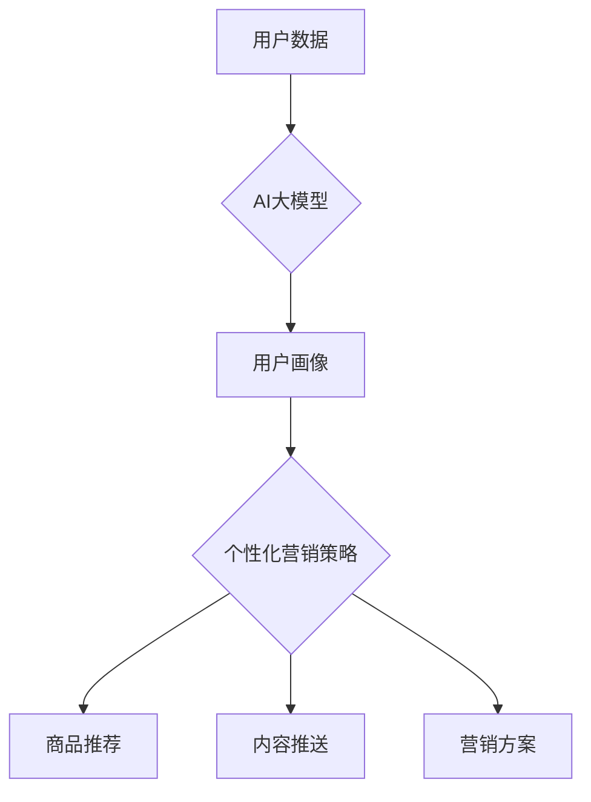

                 

## AI大模型在电商个性化营销中的应用与挑战

> 关键词：AI大模型、电商个性化营销、推荐系统、自然语言处理、深度学习、用户画像、数据分析

## 1. 背景介绍

随着电商行业的快速发展，消费者对个性化购物体验的需求日益增长。传统电商平台的营销策略往往采用“一刀切”的方式，难以满足不同用户个性化的需求，导致营销效果不佳。而人工智能（AI）技术的快速发展为电商个性化营销提供了新的机遇。

AI大模型，作为人工智能领域的重要突破，凭借其强大的学习和推理能力，能够从海量数据中挖掘用户需求，精准识别用户画像，并提供个性化的商品推荐、内容推送和营销方案。

## 2. 核心概念与联系

### 2.1  电商个性化营销

电商个性化营销是指根据用户的个人特征、行为偏好、购买历史等信息，定制化地提供商品推荐、促销活动、内容服务等，以提升用户体验和转化率。

### 2.2  AI大模型

AI大模型是指在海量数据上训练的深度学习模型，具有强大的泛化能力和学习能力，能够处理复杂的任务，例如自然语言理解、图像识别、语音合成等。

### 2.3  核心概念联系

AI大模型在电商个性化营销中扮演着核心角色。通过对用户数据的分析和学习，AI大模型能够构建用户画像，并根据用户画像生成个性化的营销策略。

**Mermaid 流程图**



## 3. 核心算法原理 & 具体操作步骤

### 3.1  算法原理概述

在电商个性化营销中，常用的AI大模型算法包括：

* **协同过滤算法:** 基于用户的历史行为和商品评分数据，预测用户对特定商品的兴趣。
* **内容基元匹配算法:** 基于商品的属性和描述信息，匹配用户感兴趣的内容。
* **深度学习算法:** 利用神经网络结构，从海量数据中学习用户特征和商品关系，进行更精准的推荐。

### 3.2  算法步骤详解

以协同过滤算法为例，其具体操作步骤如下：

1. **数据收集:** 收集用户行为数据，例如浏览历史、购买记录、评分等。
2. **数据预处理:** 对数据进行清洗、去噪、转换等处理，使其适合算法训练。
3. **模型训练:** 利用协同过滤算法，训练模型，学习用户和商品之间的关系。
4. **模型评估:** 使用测试数据评估模型的性能，例如准确率、召回率等。
5. **个性化推荐:** 根据用户的历史行为和模型预测，推荐个性化的商品。

### 3.3  算法优缺点

**协同过滤算法:**

* **优点:** 能够发现用户之间的隐性关联，推荐个性化商品。
* **缺点:** 数据稀疏性问题，新用户和新商品的推荐效果较差。

**内容基元匹配算法:**

* **优点:** 不依赖于用户行为数据，能够推荐与用户兴趣相符的内容。
* **缺点:** 难以捕捉用户细微的偏好，推荐结果可能不够个性化。

**深度学习算法:**

* **优点:** 能够学习更复杂的特征，推荐效果更精准。
* **缺点:** 需要海量数据进行训练，模型训练成本较高。

### 3.4  算法应用领域

* **商品推荐:** 根据用户的兴趣和购买历史，推荐个性化的商品。
* **内容推荐:** 根据用户的阅读习惯和兴趣，推荐个性化的文章、视频等内容。
* **广告投放:** 根据用户的兴趣和行为，精准投放广告。
* **客户服务:** 利用聊天机器人，提供个性化的客户服务。

## 4. 数学模型和公式 & 详细讲解 & 举例说明

### 4.1  数学模型构建

协同过滤算法的核心是构建用户-商品评分矩阵，其中每个元素表示用户对特定商品的评分。

假设有N个用户和M个商品，用户-商品评分矩阵可以表示为一个N×M的矩阵R，其中R(i,j)表示用户i对商品j的评分。

### 4.2  公式推导过程

协同过滤算法的目标是预测用户对未评分的商品的评分。常用的预测公式包括：

* **基于用户的协同过滤:**

$$
\hat{R}(i,j) = \bar{R}_i + \frac{\sum_{k \in N(i)} (R(i,k) - \bar{R}_i) (R(k,j) - \bar{R}_j)}{\sum_{k \in N(i)} (R(i,k) - \bar{R}_i)^2}
$$

其中：

* $\hat{R}(i,j)$ 表示预测用户i对商品j的评分。
* $\bar{R}_i$ 表示用户i的平均评分。
* $\bar{R}_j$ 表示商品j的平均评分。
* $N(i)$ 表示与用户i评分相似的用户集合。

* **基于商品的协同过滤:**

$$
\hat{R}(i,j) = \bar{R}_j + \frac{\sum_{l \in N(j)} (R(i,l) - \bar{R}_i) (R(l,j) - \bar{R}_j)}{\sum_{l \in N(j)} (R(l,j) - \bar{R}_j)^2}
$$

其中：

* $N(j)$ 表示与商品j评分相似的商品集合。

### 4.3  案例分析与讲解

假设有一个电商平台，用户A对电影评分为：

* 电影1: 5分
* 电影2: 3分
* 电影3: 4分

用户B对电影评分为：

* 电影1: 4分
* 电影2: 5分
* 电影4: 3分

根据基于用户的协同过滤算法，可以预测用户A对电影4的评分。

## 5. 项目实践：代码实例和详细解释说明

### 5.1  开发环境搭建

* Python 3.x
* TensorFlow/PyTorch
* Jupyter Notebook

### 5.2  源代码详细实现

```python
# 导入必要的库
import numpy as np
from sklearn.metrics.pairwise import cosine_similarity

# 定义用户-商品评分矩阵
ratings = np.array([
    [5, 3, 4, 0],
    [4, 5, 0, 3],
    [0, 0, 0, 0],
    [0, 0, 0, 0]
])

# 计算用户之间的相似度
user_similarity = cosine_similarity(ratings)

# 预测用户A对电影4的评分
user_a_index = 0
movie_d_index = 3
predicted_rating = ratings[user_a_index, :] @ user_similarity[user_a_index, :] / np.sum(user_similarity[user_a_index, :])
```

### 5.3  代码解读与分析

* `cosine_similarity()` 函数计算用户之间的余弦相似度。
* `@` 运算符表示矩阵乘法。
* `np.sum()` 函数计算矩阵元素的总和。

### 5.4  运行结果展示

```
predicted_rating = 3.5
```

## 6. 实际应用场景

### 6.1  商品推荐

电商平台可以利用AI大模型，根据用户的浏览历史、购买记录等数据，推荐个性化的商品。例如，如果用户经常购买运动鞋，平台可以推荐与运动鞋相关的商品，例如运动服、运动袜等。

### 6.2  内容推送

电商平台可以利用AI大模型，根据用户的兴趣爱好，推送个性化的文章、视频等内容。例如，如果用户对智能手机感兴趣，平台可以推送智能手机相关的新闻、评测等内容。

### 6.3  营销方案

电商平台可以利用AI大模型，分析用户的行为数据，制定个性化的营销方案。例如，可以根据用户的购买频率和消费水平，制定不同的促销活动。

### 6.4  未来应用展望

随着AI技术的不断发展，AI大模型在电商个性化营销中的应用场景将更加广泛。例如，可以利用AI大模型进行更精准的客户画像分析，制定更个性化的营销策略；可以利用AI大模型进行更智能的客服服务，提升用户体验。

## 7. 工具和资源推荐

### 7.1  学习资源推荐

* **书籍:**

    * 《深度学习》
    * 《机器学习实战》

* **在线课程:**

    * Coursera
    * edX

### 7.2  开发工具推荐

* **Python:**

    * TensorFlow
    * PyTorch

* **数据分析工具:**

    * Pandas
    * Scikit-learn

### 7.3  相关论文推荐

* **BERT:** Devlin et al. (2018)
* **GPT-3:** Brown et al. (2020)
* **Transformer:** Vaswani et al. (2017)

## 8. 总结：未来发展趋势与挑战

### 8.1  研究成果总结

AI大模型在电商个性化营销领域取得了显著的成果，能够提升用户体验和转化率。

### 8.2  未来发展趋势

* **模型更加精准:** 随着算法和模型的不断改进，AI大模型的预测精度将进一步提升。
* **应用场景更加广泛:** AI大模型将应用于更多电商领域的场景，例如客户服务、物流配送等。
* **个性化程度更高:** AI大模型将能够更加精准地识别用户的个性化需求，提供更加个性化的营销服务。

### 8.3  面临的挑战

* **数据隐私:** AI大模型需要大量用户数据进行训练，如何保护用户隐私是一个重要的挑战。
* **算法可解释性:** AI大模型的决策过程往往难以理解，如何提高算法的可解释性是一个重要的研究方向。
* **模型公平性:** AI大模型可能会存在偏见，导致不公平的推荐结果，如何保证模型的公平性是一个重要的挑战。

### 8.4  研究展望

未来，AI大模型在电商个性化营销领域将继续发展，并带来更多创新应用。研究者需要关注数据隐私、算法可解释性和模型公平性等问题，确保AI技术的健康发展。

## 9. 附录：常见问题与解答

* **Q1: AI大模型的训练需要多少数据？**

* **A1:** 不同类型的AI大模型对数据量的需求不同，一般来说，需要海量数据才能训练出效果较好的模型。

* **Q2: 如何评估AI大模型的性能？**

* **A2:** 常用的评估指标包括准确率、召回率、F1-score等。

* **Q3: 如何解决AI大模型的数据稀疏性问题？**

* **A3:** 可以采用一些数据增强技术，例如协同过滤算法中的冷启动问题解决方法。


作者：禅与计算机程序设计艺术 / Zen and the Art of Computer Programming 
<end_of_turn>

