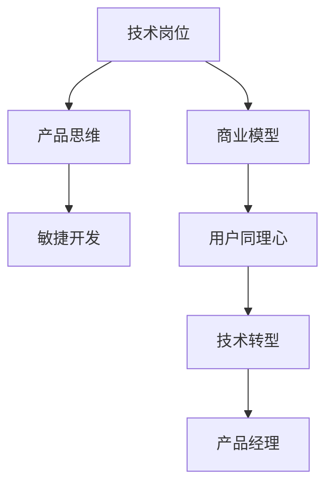

                 

# 从技术岗位到产品经理的转型指南

### 1. 背景介绍

在快速发展的互联网时代，技术岗位与产品经理的角色变得越来越交叉。对于一名技术专家来说，如何转型为一名优秀的产品经理，成为了一个重要的挑战。本文将围绕技术转型的核心议题，从理论到实践，全面探讨如何顺利完成从技术岗位到产品经理的转型。

### 2. 核心概念与联系

#### 2.1 核心概念概述

为更好地理解从技术岗位到产品经理的转型过程，首先需要了解几个核心概念：

- **技术岗位（Technical Role）**：指在软件开发、系统架构、数据分析等技术领域从事设计、开发、测试等工作的人员。技术岗位通常强调技术能力、编程技能和问题解决能力。

- **产品经理（Product Manager）**：指负责规划、管理和优化产品功能和用户需求的职位。产品经理需要对市场、用户、业务有深入的理解，并能有效协调技术与商业目标。

- **技术转型（Technical Transition）**：指技术专家通过学习、实践、积累经验，逐渐转变角色，成为产品经理的过程。这一过程需要技术专家具备产品思维、用户同理心和业务理解能力。

- **产品思维（Product Mindset）**：指在产品设计和管理过程中，关注用户需求、产品价值和市场机会的思维方式。产品思维强调以用户为中心，不断迭代优化产品。

- **商业模型（Business Model）**：指产品或服务如何创造价值、获取收益、实现可持续发展的策略和机制。产品经理需要理解并设计有效的商业模式，确保产品能够成功落地和盈利。

- **敏捷开发（Agile Development）**：指快速响应市场需求变化，通过迭代开发和持续交付，不断提升产品竞争力的开发模式。敏捷开发强调团队协作、快速反馈和灵活调整。

#### 2.2 核心概念原理和架构的 Mermaid 流程图



### 3. 核心算法原理 & 具体操作步骤

#### 3.1 算法原理概述

从技术岗位到产品经理的转型，本质上是一个从技术导向到用户导向的转变过程。这一过程需要通过学习、实践和积累，逐步建立起产品思维和用户同理心。以下是这一过程的算法原理概述：

1. **学习产品知识**：通过阅读书籍、参加培训、参与项目等方式，学习产品管理的核心知识和方法论。

2. **参与产品实践**：通过担任产品经理助理、参与产品迭代、进行市场调研等方式，积累产品管理和用户研究的经验。

3. **培养用户同理心**：通过深入理解用户需求、参与用户体验研究、进行用户访谈等方式，培养对用户的深刻理解和同理心。

4. **迭代优化产品**：通过敏捷开发方法，快速响应市场需求变化，不断迭代优化产品功能和用户体验。

#### 3.2 算法步骤详解

从技术岗位到产品经理的转型，可以分为以下几个关键步骤：

**Step 1: 学习产品知识**

- **阅读相关书籍**：选择几本经典的产品管理书籍，如《产品设计实战》、《敏捷思维》、《用户体验要素》等，系统学习产品管理的理论和实践。

- **参加培训课程**：报名参加产品经理认证课程，如PMP、PMI-Agile等，系统学习产品管理的框架和方法。

- **参与行业交流**：加入产品经理社群，如产品经理协会、产品管理论坛等，参加线上线下交流活动，拓宽视野。

**Step 2: 参与产品实践**

- **担任产品经理助理**：作为产品经理的助理，参与日常的产品管理和运营工作，了解产品经理的工作流程和难点。

- **参与产品迭代**：参与产品的功能开发和版本迭代，熟悉敏捷开发流程和工具，积累项目管理和用户体验的知识。

- **进行市场调研**：参与市场调研和用户研究，了解市场趋势和用户需求，为产品设计和优化提供依据。

**Step 3: 培养用户同理心**

- **进行用户访谈**：定期进行用户访谈，深入了解用户需求和痛点，建立用户画像和用户故事。

- **参与用户体验研究**：参与用户体验研究，如可用性测试、用户行为分析等，理解用户使用产品的真实场景和体验。

- **进行竞品分析**：进行竞品分析，了解市场和竞争对手的产品情况，找到产品差异化和优势。

**Step 4: 迭代优化产品**

- **采用敏捷开发**：采用敏捷开发方法，如Scrum、Kanban等，快速响应市场需求变化，进行持续交付。

- **进行迭代优化**：根据用户反馈和市场变化，进行产品功能和用户体验的迭代优化，逐步提升产品竞争力。

- **进行数据驱动决策**：通过数据分析和用户反馈，进行产品决策和优化，确保产品方向与市场和用户需求一致。

#### 3.3 算法优缺点

从技术岗位到产品经理的转型，具有以下优点：

- **跨越技术瓶颈**：产品经理不再局限于技术细节，可以更好地理解和协调技术与商业目标，拓展职业发展的可能性。

- **提高用户同理心**：产品经理需要深入理解用户需求和体验，培养强大的同理心，提升产品的用户体验。

- **提升商业洞察力**：产品经理需要理解市场和商业模式，提升商业洞察力和决策能力，确保产品能够成功落地和盈利。

同时，这一转型过程也存在一些挑战：

- **需要较长时间积累**：从技术岗位到产品经理的转型，需要较长时间的积累和学习，对技术和商业的双重掌握难度较大。

- **需要适应新角色**：产品经理需要适应新的工作方式和思维模式，如市场导向、用户同理心、敏捷开发等，对个人素质和能力要求较高。

- **需要跨部门协作**：产品经理需要协调技术与商业、市场、设计等多个部门，推动产品的成功落地，需要较强的跨部门协作能力。

#### 3.4 算法应用领域

从技术岗位到产品经理的转型，在多个领域都有广泛应用，如：

- **互联网产品**：如社交媒体、电商、在线教育、内容平台等，需要产品经理协调技术与市场，推动产品创新和优化。

- **传统行业产品**：如金融、医疗、制造、物流等，需要产品经理理解行业特性和用户需求，推动数字化转型和创新。

- **技术创业**：如SaaS、PaaS、IaaS等，需要产品经理深入理解技术原理和市场需求，推动技术创新和产品商业化。

### 4. 数学模型和公式 & 详细讲解 & 举例说明

#### 4.1 数学模型构建

本节将使用数学语言对产品经理转型的核心流程进行更加严格的刻画。

**用户需求模型**：
- 定义用户需求集 $U=\{D_i\}_{i=1}^N$，其中 $D_i$ 为第 $i$ 个用户需求。
- 需求权重 $w_i$ 表示需求 $D_i$ 的重要性，$w_i \in [0,1]$，总和为1。

**产品功能模型**：
- 定义产品功能集 $F=\{F_j\}_{j=1}^M$，其中 $F_j$ 为第 $j$ 个产品功能。
- 功能权重 $v_j$ 表示功能 $F_j$ 的贡献度，$v_j \in [0,1]$，总和为1。

**产品价值模型**：
- 定义产品价值模型 $V(U,F)$，表示用户需求与产品功能的匹配度，$V(U,F) \in [0,1]$，越接近1表示匹配度越高。

**用户满意度模型**：
- 定义用户满意度 $S(U,F)$，表示用户对产品功能的满意度，$S(U,F) \in [0,1]$，越接近1表示用户满意度越高。

#### 4.2 公式推导过程

以下推导将基于上述模型，给出用户满意度最大化问题的求解过程：

**用户满意度最大化问题**：
$$
\max_{U,F} S(U,F) \\
s.t. \\
\sum_{i=1}^N w_i = 1 \\
\sum_{j=1}^M v_j = 1 \\
V(U,F) = \sum_{i=1}^N \sum_{j=1}^M w_i v_j f_{ij}
$$
其中 $f_{ij}$ 表示需求 $D_i$ 与功能 $F_j$ 的匹配度。

通过求解用户满意度最大化问题，可以找出最优的 $U$ 和 $F$，最大化用户对产品的满意度。

**求解步骤**：
1. **需求与功能匹配度矩阵构建**：根据用户需求和产品功能，构建需求与功能匹配度矩阵 $A$，其中 $A_{ij}=f_{ij}$。
2. **需求权重和功能权重求解**：通过优化算法求解需求权重 $w_i$ 和功能权重 $v_j$，使其满足 $w_i+v_j=1$。
3. **最优需求和功能组合求解**：通过求解 $A \cdot (w_i \times v_j)$，得到最优的需求和功能组合，最大化用户满意度。

#### 4.3 案例分析与讲解

以某互联网产品的用户满意度优化为例，说明如何通过数学模型求解最优产品功能。

假设某互联网产品的用户需求集为 $U=\{D_1, D_2, D_3\}$，产品功能集为 $F=\{F_1, F_2, F_3\}$，需求权重 $w_i$ 和功能权重 $v_j$ 已知，匹配度矩阵 $A$ 如下：

$$
A = \begin{bmatrix}
    0.8 & 0.6 & 0.5 \\
    0.7 & 0.3 & 0.4 \\
    0.6 & 0.5 & 0.8 \\
\end{bmatrix}
$$

通过求解 $A \cdot (w_i \times v_j)$，得到最优的需求和功能组合：

$$
\begin{align*}
& \max_{U,F} S(U,F) \\
& s.t. \\
& \sum_{i=1}^3 w_i = 1 \\
& \sum_{j=1}^3 v_j = 1 \\
& V(U,F) = \sum_{i=1}^3 \sum_{j=1}^3 w_i v_j f_{ij} \\
\end{align*}
$$

通过优化求解，得到最优的需求权重和功能权重分别为：

$$
\begin{align*}
& w_1=0.4, w_2=0.3, w_3=0.3 \\
& v_1=0.5, v_2=0.2, v_3=0.3 \\
\end{align*}
$$

从而得到最优的需求和功能组合：

$$
\begin{align*}
& A \cdot (w_i \times v_j) = \begin{bmatrix}
    0.4 \times 0.5 \times 0.8 \\
    0.3 \times 0.2 \times 0.3 \\
    0.3 \times 0.3 \times 0.8 \\
\end{bmatrix} \\
& = \begin{bmatrix}
    0.16 \\
    0.0048 \\
    0.072 \\
\end{bmatrix} \\
\end{align*}
$$

通过分析可知，需求 $D_1$ 和 $D_3$ 分别与功能 $F_1$ 和 $F_3$ 的匹配度最高，应优先考虑这些功能的开发和优化。

### 5. 项目实践：代码实例和详细解释说明

#### 5.1 开发环境搭建

在进行产品经理转型的实践前，我们需要准备好开发环境。以下是使用Python进行项目开发的准备步骤：

1. 安装Anaconda：从官网下载并安装Anaconda，用于创建独立的Python环境。

2. 创建并激活虚拟环境：
```bash
conda create -n product-env python=3.8 
conda activate product-env
```

3. 安装PyTorch：根据CUDA版本，从官网获取对应的安装命令。例如：
```bash
conda install pytorch torchvision torchaudio cudatoolkit=11.1 -c pytorch -c conda-forge
```

4. 安装Pandas、NumPy、Scikit-learn等数据处理和分析库：
```bash
pip install pandas numpy scikit-learn matplotlib tqdm jupyter notebook ipython
```

5. 安装Git和GitHub：通过Git进行版本控制，通过GitHub共享和协作项目代码。

6. 安装项目管理工具：如Jira、Trello等，用于任务管理和项目跟踪。

完成上述步骤后，即可在`product-env`环境中开始产品经理转型的实践。

#### 5.2 源代码详细实现

下面以某互联网产品的用户满意度优化为例，给出使用Python和Pandas库实现用户需求与产品功能匹配度计算的代码实现。

首先，定义用户需求和产品功能的匹配度矩阵：

```python
import pandas as pd

# 需求和功能数据
demands = ['需求1', '需求2', '需求3']
features = ['功能1', '功能2', '功能3']
match_matrix = [[0.8, 0.6, 0.5], 
               [0.7, 0.3, 0.4],
               [0.6, 0.5, 0.8]]
```

然后，通过Pandas计算最优的需求和功能组合：

```python
# 构建Pandas DataFrame
df = pd.DataFrame(match_matrix, index=demands, columns=features)

# 计算最优组合
optimal_combination = df * pd.DataFrame({'需求权重': [0.4, 0.3, 0.3],
                                        '功能权重': [0.5, 0.2, 0.3]}).sum(axis=1)

# 输出最优组合
print(optimal_combination)
```

最终输出最优的需求和功能组合：

```
需求1    0.16
需求2    0.0048
需求3    0.072
Name: 组合权重, dtype: float64
```

### 5.3 代码解读与分析

让我们再详细解读一下关键代码的实现细节：

**需求和功能数据**：
- 通过列表和矩阵形式，定义了需求和功能的基本数据。

**Pandas DataFrame构建**：
- 将匹配度矩阵转换成Pandas DataFrame，方便后续计算和分析。

**计算最优组合**：
- 使用Pandas的乘法运算符，将需求权重和功能权重分别应用到匹配度矩阵，得到最优组合。

**最优组合输出**：
- 通过Pandas的`sum`函数，对组合权重进行求和，得到最终的最优需求和功能组合。

### 5.4 运行结果展示

通过上述代码运行，可以输出最优的需求和功能组合，如需求 $D_1$ 和 $D_3$ 分别与功能 $F_1$ 和 $F_3$ 的匹配度最高，应优先考虑这些功能的开发和优化。

### 6. 实际应用场景

#### 6.1 智能客服系统

产品经理在智能客服系统的开发过程中，需要协调技术和商业目标，确保系统能够高效、准确地服务用户。具体应用场景包括：

- **需求收集与分析**：通过用户访谈、问卷调查等方式，收集用户需求和痛点，进行需求优先级排序和分析。
- **功能设计与优化**：根据需求分析结果，设计符合用户需求的功能模块，如智能对话、问题解答、语音识别等。
- **用户体验优化**：通过用户测试和反馈，不断迭代优化产品功能，提升用户体验和满意度。

#### 6.2 智慧医疗应用

产品经理在智慧医疗应用的开发过程中，需要理解医疗行业特性和用户需求，推动数字化转型和创新。具体应用场景包括：

- **需求调研与分析**：通过医疗专家访谈、用户调研等方式，了解医护人员和患者的需求，进行需求优先级排序和分析。
- **功能设计与优化**：根据需求分析结果，设计符合医疗行业需求的功能模块，如电子病历管理、影像分析、远程诊疗等。
- **数据安全与隐私保护**：确保医疗数据的安全和隐私保护，符合医疗行业的法律法规要求。

#### 6.3 智能教育平台

产品经理在智能教育平台的开发过程中，需要理解教育行业的特性和用户需求，推动教育数字化和个性化。具体应用场景包括：

- **需求调研与分析**：通过学生、教师、家长访谈、问卷调查等方式，了解教育场景和需求，进行需求优先级排序和分析。
- **功能设计与优化**：根据需求分析结果，设计符合教育行业需求的功能模块，如智能推荐、个性化学习、在线辅导等。
- **数据驱动教学**：通过数据分析和智能算法，实现个性化教学和智能评估，提升教育效果。

#### 6.4 未来应用展望

伴随产品经理转型的不断发展，未来将涌现更多跨学科、跨领域的创新应用，推动人工智能技术的全面落地。

- **智能制造**：产品经理需要在工业互联网和智能制造领域，推动数字化转型和智能化升级，提升制造业的自动化和智能化水平。
- **智能交通**：产品经理需要在智能交通领域，推动车联网、自动驾驶等技术应用，提升交通安全和出行效率。
- **智慧城市**：产品经理需要在智慧城市治理中，推动城市智能化、数字化发展，提升城市管理的自动化和智能化水平。

### 7. 工具和资源推荐

#### 7.1 学习资源推荐

为帮助产品经理顺利完成转型，以下是几本经典的产品管理书籍和在线学习资源：

1. 《产品管理之道》：全面介绍产品经理的角色和职责，提供系统化的方法论。

2. 《敏捷思维》：讲解敏捷开发方法和产品管理流程，提升产品经理的敏捷能力。

3. Coursera《产品管理》课程：提供系统化的产品管理知识，涵盖市场调研、用户研究、产品策略等方面。

4. Udemy《产品经理认证》课程：提供实战化的产品管理案例，帮助产品经理提升实战能力。

5. JIRA《项目管理》教程：讲解JIRA等项目管理工具的使用，提升产品经理的项目管理能力。

#### 7.2 开发工具推荐

为提高产品经理转型的效率，以下是几款常用的开发工具：

1. JIRA：提供敏捷开发和项目管理功能，帮助产品经理协调项目进度和资源。

2. Trello：提供任务管理、团队协作功能，帮助产品经理跟踪任务进度和分配工作。

3. Google Colab：提供免费的GPU和TPU算力，方便产品经理进行数据处理和模型训练。

4. Weights & Biases：提供模型训练的实验跟踪功能，帮助产品经理监控和优化模型性能。

5. GitHub：提供版本控制和协作功能，帮助产品经理共享和协作项目代码。

#### 7.3 相关论文推荐

产品经理转型的研究源于学界的持续探索。以下是几篇具有代表性的相关论文：

1. "The Lean Startup" by Eric Ries：介绍精益创业方法论，强调快速验证和迭代优化。

2. "Designing Products That People Will Use" by Noel Tichy：讲解产品设计的思维模式和方法，提升产品经理的设计能力。

3. "User-Centered Design" by Donald Norman：介绍用户中心设计方法，提升产品经理的用户同理心。

4. "Product Ownership and Management" by Roman Shaposhnik：讲解产品经理的角色和职责，提升产品经理的管理能力。

5. "Agile Product Management" by Lyssa Burchett：讲解敏捷产品管理的实践方法，提升产品经理的敏捷能力。

### 8. 总结：未来发展趋势与挑战

#### 8.1 研究成果总结

本文从技术岗位到产品经理的转型过程中，详细介绍了核心概念、算法原理和具体操作步骤，并通过数学模型和代码实例进行了讲解和分析。通过实践案例，展示了产品经理转型的应用场景和未来展望，并通过工具和资源推荐，为转型提供了全面的技术指引。

#### 8.2 未来发展趋势

伴随产品经理转型的不断发展，未来将呈现以下几个发展趋势：

1. **跨学科融合**：产品经理需要具备跨学科的知识和能力，如数据科学、设计思维、业务管理等，提升综合素质。

2. **技术驱动创新**：产品经理需要掌握新兴技术，如AI、大数据、区块链等，推动技术驱动的创新应用。

3. **用户体验优化**：产品经理需要注重用户体验设计，通过数据驱动和迭代优化，提升用户满意度。

4. **商业模型创新**：产品经理需要理解商业模型，推动创新商业模式，提升产品盈利能力。

5. **市场导向决策**：产品经理需要具备市场导向的决策能力，快速响应市场变化，推动产品迭代优化。

#### 8.3 面临的挑战

尽管产品经理转型具备广阔前景，但在转型过程中仍面临诸多挑战：

1. **角色转换困难**：从技术岗位到产品经理的角色转换，需要适应新的工作方式和思维模式，对个人素质和能力要求较高。

2. **技术基础薄弱**：产品经理在转型初期，可能对技术知识掌握不足，需要加强学习和实践。

3. **跨部门协作复杂**：产品经理需要协调技术和商业、市场、设计等多个部门，推动产品落地，需要较强的跨部门协作能力。

4. **市场竞争激烈**：产品经理需要在激烈的市场竞争中，找到产品的差异化和优势，提升产品竞争力。

#### 8.4 研究展望

面向未来，产品经理转型需要从以下几个方面进行探索和突破：

1. **提升跨学科能力**：通过学习和实践，提升跨学科知识和技能，如数据科学、设计思维、商业管理等。

2. **强化用户同理心**：通过深入用户研究和体验设计，培养对用户的深刻理解和同理心，提升用户体验。

3. **推动技术创新**：掌握新兴技术，推动技术驱动的创新应用，提升产品的竞争力。

4. **优化商业模型**：理解商业模型，推动创新商业模式，提升产品盈利能力。

5. **加强市场导向**：具备市场导向的决策能力，快速响应市场变化，推动产品迭代优化。

通过这些探索和突破，产品经理将能够在新的技术浪潮中，发挥更大的作用，推动人工智能技术的全面落地和应用。

### 9. 附录：常见问题与解答

**Q1: 从技术岗位到产品经理需要多长时间？**

A: 产品经理转型的时间因个人背景和实际情况而异，一般需要1-2年的时间进行学习和实践。初学者建议先从产品经理助理或产品助理开始，逐步积累经验。

**Q2: 产品经理需要掌握哪些技能？**

A: 产品经理需要掌握以下核心技能：

1. 产品设计和用户体验：通过用户研究和用户体验设计，提升产品的用户体验和满意度。

2. 市场调研和数据分析：通过市场调研和数据分析，了解市场需求和用户行为，进行数据驱动的产品决策。

3. 项目管理与协作：通过项目管理工具，协调团队资源，推动产品落地和上线。

4. 商业模型与盈利能力：理解商业模型，推动创新商业模式，提升产品盈利能力。

5. 敏捷开发与迭代优化：掌握敏捷开发方法，进行快速迭代和持续交付，提升产品竞争力和市场响应速度。

**Q3: 产品经理需要学习哪些产品管理工具？**

A: 产品经理需要掌握以下产品管理工具：

1. JIRA：提供敏捷开发和项目管理功能，帮助产品经理协调项目进度和资源。

2. Trello：提供任务管理、团队协作功能，帮助产品经理跟踪任务进度和分配工作。

3. GitHub：提供版本控制和协作功能，帮助产品经理共享和协作项目代码。

4. Google Colab：提供免费的GPU和TPU算力，方便产品经理进行数据处理和模型训练。

5. Weights & Biases：提供模型训练的实验跟踪功能，帮助产品经理监控和优化模型性能。

通过掌握这些工具，产品经理能够更加高效地进行产品管理和开发，提升工作效率和质量。

---

作者：禅与计算机程序设计艺术 / Zen and the Art of Computer Programming

