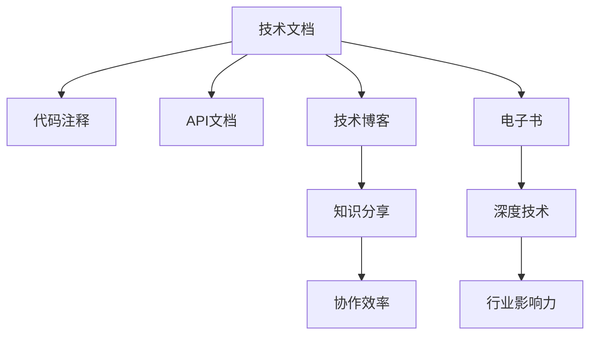

                 

# 从技术文档到付费电子书：程序员的写作之路

> 关键词：程序员写作,技术写作,技术文档,技术博客,电子书,写作技巧,编程文化,知识分享

## 1. 背景介绍

### 1.1 问题由来

在技术快速发展的今天，技术文档和代码已经成为程序员日常工作中不可或缺的元素。如何撰写清晰、简洁、易于理解的技术文档，不仅关系到团队协作的效率，更关乎代码质量及知识传承的成败。然而，很多程序员在写作方面存在一定的困惑和挑战：如何准确表达技术细节？如何组织复杂的信息？如何将技术写作融入日常工作？

### 1.2 问题核心关键点

技术文档和代码是程序员日常工作中最重要的两个元素，其撰写水平直接关系到团队协作效率、代码质量及知识传承的效果。有效的技术写作能够帮助团队成员快速理解代码逻辑、避免重复工作，并通过清晰的文档传承知识，提升整体技术水平。

尽管技术写作的重要性不言而喻，但许多程序员在实际写作过程中仍面临诸多难题。例如：
1. 表达困难：技术文档涉及大量专业术语，如何准确、简洁地传达信息？
2. 组织复杂：如何在结构化组织复杂信息，使读者易于理解？
3. 融入日常：如何将技术写作融入日常开发工作，避免额外负担？

### 1.3 问题研究意义

掌握有效的技术写作技巧，对于提升程序员的工作效率、促进团队协作、以及传播知识具有重要意义：

1. **提升效率**：清晰的技术文档可以大大降低团队沟通成本，避免重复劳动，提高开发效率。
2. **促进协作**：规范的技术文档有助于团队成员理解代码逻辑、分工协作，减少误解和错误。
3. **传承知识**：清晰、详细的技术文档是知识传承的重要工具，有助于新加入成员快速上手。
4. **展示专业**：优秀的技术写作是编程文化的重要组成部分，展示出团队的规范性和专业性。
5. **知识分享**：通过技术博客、技术论文等方式，分享技术经验，提升行业影响力。

## 2. 核心概念与联系

### 2.1 核心概念概述

为了更好地理解技术写作的原则和技巧，本节将介绍几个核心概念：

- **技术文档（Technical Documentation）**：指描述技术产品、系统或流程的文档，包括需求文档、设计文档、代码注释、API文档等。技术文档的主要目的是帮助开发人员理解代码逻辑、维护文档和系统，同时为读者提供必要的信息支持。

- **技术博客（Technical Blogging）**：是一种形式更为自由、易于传播的技术写作方式，通常以文章的形式发布在公共平台上。技术博客有助于分享个人经验、传递技术知识，并促进与读者的互动交流。

- **电子书（Technical Ebooks）**：是结构化、系统化的技术内容，通常以PDF或电子书形式发布。电子书适合深入探讨复杂技术问题，并提供全面的解决方案和实践指导。

- **写作技巧（Technical Writing Skills）**：指在撰写技术文档、博客、书籍时所应掌握的技能和注意事项，包括语言表达、结构布局、视觉设计等。

- **编程文化（Coding Culture）**：指一个团队或社区在技术文档和代码管理上的习惯和规范，通常包括代码风格、注释习惯、版本控制等。

这些核心概念之间的逻辑关系可以通过以下Mermaid流程图来展示：



这个流程图展示了几类技术写作形式及其相互关联：

1. **技术文档**：是代码注释、API文档的基础。
2. **代码注释**：简明扼要地解释代码逻辑，便于维护。
3. **API文档**：详细描述接口调用方式、参数说明等，帮助开发者理解接口使用。
4. **技术博客**：是代码注释、API文档的进一步扩展，适合分享个人经验和行业见解。
5. **电子书**：在技术博客基础上，深入探讨复杂技术问题，提供系统化的解决方案。
6. **知识分享**：技术博客和电子书的主要目的，有助于提升协作效率、传承知识。
7. **协作效率**：技术文档和代码注释有助于团队成员理解代码逻辑、分工协作，减少误解和错误。
8. **行业影响力**：技术博客和电子书通过分享技术经验，提升行业影响力。

## 3. 核心算法原理 & 具体操作步骤

### 3.1 算法原理概述

技术写作的本质是信息传递和知识传承。其核心在于如何准确、简洁地表达技术内容，并使其易于理解。技术写作的算法原理包括以下几个方面：

- **信息传达**：确保信息传达准确无误，避免歧义和误解。
- **结构布局**：合理组织信息，使其结构清晰、易于理解。
- **视觉设计**：使用图表、代码片段等辅助工具，增强信息的可读性。

### 3.2 算法步骤详解

技术写作的步骤主要包括以下几个关键步骤：

**Step 1: 明确目标受众**
- 分析目标受众的背景知识和需求，制定适合他们的写作策略。

**Step 2: 收集信息**
- 收集相关的技术文档、代码、API文档等资料，了解技术细节。

**Step 3: 制定框架**
- 根据受众需求和信息内容，制定文档框架，确定章节、小节和段落结构。

**Step 4: 编写内容**
- 按照框架逐步编写文档内容，注意准确性、简洁性和可读性。

**Step 5: 视觉设计**
- 使用图表、代码片段等辅助工具，增强文档的可视性和可理解性。

**Step 6: 校对和修改**
- 多次校对文档，确保信息的准确性和表达的清晰度。

**Step 7: 反馈和改进**
- 向受众收集反馈，不断改进文档内容和格式。

### 3.3 算法优缺点

技术写作的算法具有以下优点：
1. **信息传达准确**：确保信息传递无误，避免歧义和误解。
2. **结构清晰**：合理组织信息，使文档结构清晰，易于理解。
3. **易于维护**：文档可多次修改和更新，保持最新的技术信息。
4. **促进协作**：规范的技术文档有助于团队成员理解代码逻辑、分工协作，减少误解和错误。

同时，技术写作也存在一定的局限性：
1. **时间成本**：撰写高质量技术文档需要大量时间和精力。
2. **技术更新快**：技术文档需要不断更新以适应技术变化，维护成本较高。
3. **受众限制**：复杂的技术内容可能难以让非专业读者完全理解。

### 3.4 算法应用领域

技术写作广泛应用于软件开发、系统设计、技术支持等多个领域，具体包括：

- **软件开发**：编写需求文档、设计文档、API文档等，帮助开发人员理解项目背景和功能需求。
- **系统设计**：编写系统架构设计文档，描述系统模块和组件之间的关系和数据流。
- **技术支持**：编写用户手册、操作手册等，帮助用户理解和使用产品。
- **知识传承**：编写技术博客、电子书等，传递技术知识和经验。

此外，技术写作在企业内部培训、技术分享会、技术社区等场合也有广泛应用，成为提升技术水平和团队协作的重要手段。

## 4. 数学模型和公式 & 详细讲解 & 举例说明

### 4.1 数学模型构建

技术写作的核心在于信息的准确传达和结构的合理组织。可以构建一个简化的信息模型，描述技术写作的过程：

$$
\text{信息模型} = (\text{目标受众}, \text{信息内容}, \text{信息传递方式}, \text{反馈机制})
$$

其中，目标受众、信息内容和信息传递方式是模型的主体，反馈机制用于不断改进模型。

### 4.2 公式推导过程

为了更好地理解技术写作的算法，以下是一些常用的推导过程和公式：

1. **信息传递准确性**
   - 假设信息内容的长度为 $n$，信息传递的准确性可以用如下公式衡量：

   $$
   \text{准确性} = \frac{\text{正确传递的信息量}}{n}
   $$

   其中，正确传递的信息量可以通过分析文档中的关键信息点、逻辑链条等进行评估。

2. **结构布局优化**
   - 技术文档的结构布局可以通过如下公式进行优化：

   $$
   \text{结构布局} = \text{章节} \times \text{小节} \times \text{段落}
   $$

   通过合理划分章节、小节和段落，可以确保文档结构清晰、逻辑严密，易于读者理解。

3. **视觉设计效果**
   - 视觉设计可以通过添加图表、代码片段等辅助工具来增强文档的可视性，具体公式如下：

   $$
   \text{可视性} = \text{图表数量} \times \text{代码片段数量} \times \text{注释量}
   $$

   增加可视性元素可以有效提升文档的可读性，帮助读者更快理解技术细节。

### 4.3 案例分析与讲解

以编写一个简单的技术博客为例，以下是具体的步骤和关键点：

1. **明确目标受众**
   - 确定目标受众的背景知识和技术水平，如初学者和有基础的开发者。

2. **收集信息**
   - 查找相关的技术文档、代码、API文档等资料，确保信息的全面性和准确性。

3. **制定框架**
   - 制定博客框架，如引言、正文和结论等部分，确定每个部分的内容和长度。

4. **编写内容**
   - 按照框架逐步编写博客内容，注意信息的准确性和表达的清晰度。

5. **视觉设计**
   - 添加代码片段、图表等辅助工具，增强博客的可读性。

6. **校对和修改**
   - 多次校对博客，确保信息的准确性和表达的清晰度。

7. **反馈和改进**
   - 向受众收集反馈，不断改进博客内容和格式。

## 5. 项目实践：代码实例和详细解释说明

### 5.1 开发环境搭建

在进行技术写作实践前，我们需要准备好开发环境。以下是使用Python进行技术写作的开发环境配置流程：

1. 安装Python：从官网下载并安装Python，建议使用最新稳定版本。
2. 安装必要的工具：如VS Code、Sublime Text等代码编辑器，以及Markdown编辑工具。
3. 安装Git：使用Git进行版本控制和代码管理。

完成上述步骤后，即可在本地搭建起一个技术写作的开发环境。

### 5.2 源代码详细实现

以下是编写一个简单的技术博客的Python代码实现：

```python
# 博客结构
blog_structure = {
    "title": "Python 编程指南",
    "introduction": "欢迎阅读Python编程指南。",
    "sections": [
        {
            "title": "环境搭建",
            "content": "详细描述Python环境搭建步骤。"
        },
        {
            "title": "基本语法",
            "content": "描述Python基本语法和常用语句。"
        },
        {
            "title": "高级特性",
            "content": "描述Python高级特性，如装饰器、迭代器等。"
        },
        {
            "title": "实例分析",
            "content": "通过实例分析Python在实际应用中的使用。"
        },
        {
            "title": "参考资料",
            "content": "列出参考资料和进一步学习资料。"
        }
    ]
}

# 博客内容编写
with open("python_guide.md", "w") as f:
    f.write("# " + blog_structure["title"] + "\n")
    f.write(blog_structure["introduction"] + "\n")
    for section in blog_structure["sections"]:
        f.write("# " + section["title"] + "\n")
        f.write(section["content"] + "\n")
```

### 5.3 代码解读与分析

让我们再详细解读一下关键代码的实现细节：

**blog_structure**：
- 定义了博客的总体结构，包括标题、引言和多个章节。

**with open函数**：
- 使用with语句打开博客文件，以写入模式（"w"）写入内容。

**f.write函数**：
- 将博客的标题、引言和各章节内容写入文件，使用Markdown格式进行排版。

**#符号**：
- 在Markdown中使用#号表示博客和各章节的标题。

通过以上代码，我们成功创建了一个简单的技术博客，展示了Python编程指南的基本结构和内容编写方法。

### 5.4 运行结果展示

运行上述代码后，生成一个名为`python_guide.md`的Markdown文件，如下所示：

```markdown
# Python 编程指南

欢迎阅读Python编程指南。

## 环境搭建
详细描述Python环境搭建步骤。

## 基本语法
描述Python基本语法和常用语句。

## 高级特性
描述Python高级特性，如装饰器、迭代器等。

## 实例分析
通过实例分析Python在实际应用中的使用。

## 参考资料
列出参考资料和进一步学习资料。
```

通过Markdown格式编写和展示技术博客，可以方便地进行排版和编辑，同时具有良好的可读性。

## 6. 实际应用场景

### 6.1 企业文档管理

企业技术文档管理是技术写作的重要应用场景。通过编写规范、清晰的技术文档，企业可以有效地管理项目信息、维护文档和系统，确保团队协作的效率和代码质量。

例如，某企业内部文档管理系统可以采用以下方式：
1. **代码注释**：所有代码文件必须包含详细的注释，解释代码逻辑和功能。
2. **API文档**：所有公共API必须包含详细的API文档，描述接口调用方式、参数说明等。
3. **需求文档**：项目启动前必须编写详细的需求文档，描述项目背景、功能需求和设计思路。
4. **设计文档**：项目设计完成后必须编写详细的设计文档，描述系统模块和组件之间的关系和数据流。
5. **用户手册**：产品发布前必须编写详细的使用手册，帮助用户理解和使用产品。

### 6.2 开源项目文档

开源项目通常需要详细的技术文档来维护代码质量和项目协作。通过编写高质量的技术文档，开源项目可以吸引更多开发者参与贡献，提升项目的活跃度和社区影响力。

例如，Linux内核项目在每个版本发布前都会编写详细的文档，描述新版本的主要变化和新增功能。这些文档不仅帮助开发者理解代码变化，还能提升项目的透明度和可信度。

### 6.3 技术博客和电子书

技术博客和电子书是技术写作的重要形式，通过分享个人经验和传递技术知识，提升个人和团队的技术水平。

例如，某程序员在GitHub上开设个人技术博客，定期发布技术文章和教程，吸引了大量技术爱好者关注。同时，他编写的《Python编程实战》电子书，详细介绍了Python编程技巧和最佳实践，成为业界经典之作。

## 7. 工具和资源推荐

### 7.1 学习资源推荐

为了帮助开发者系统掌握技术写作的理论基础和实践技巧，这里推荐一些优质的学习资源：

1. **《技术写作与传播》（Technical Writing and Communication）**：由知名技术写作专家撰写，系统讲解了技术写作的基本原理和常见技巧，适合初学者和进阶学习者。
2. **《风格要素：清晰和有力量的写作》（The Elements of Style）**：经典写作指南，详细介绍了写作中常见错误和规范，帮助提升写作质量。
3. **在线Markdown教程**：如Markdown的基本语法和高级应用，适合新手快速上手。
4. **技术写作博客**：如Medium、TechCrunch等平台上的技术写作博文，提供了大量优秀的技术写作案例和技巧。
5. **在线课程**：如Coursera、Udemy等平台上的技术写作课程，涵盖从基础到高级的各种写作技巧和工具使用。

通过对这些资源的学习实践，相信你一定能够快速掌握技术写作的精髓，并用于解决实际的文档撰写问题。

### 7.2 开发工具推荐

高效的开发离不开优秀的工具支持。以下是几款用于技术写作开发的常用工具：

1. **VS Code**：功能强大的代码编辑器，支持多种编程语言和Markdown格式，适合编写和编辑技术文档。
2. **Sublime Text**：轻量级代码编辑器，适合快速编写和编辑技术博客。
3. **Markdown编辑器**：如Typora、Pandoc等，支持Markdown格式，方便进行文档排版和生成PDF电子书。
4. **Git**：版本控制工具，用于代码和文档的版本管理，确保文档的持续更新和备份。
5. **LaTeX**：专业的排版工具，适用于生成高质量的学术论文和技术书籍。
6. **GitHub/GitLab**：代码托管平台，方便管理和发布技术文档和开源项目。

合理利用这些工具，可以显著提升技术写作的效率和质量，加快创新迭代的步伐。

### 7.3 相关论文推荐

技术写作的发展源于学界的持续研究。以下是几篇奠基性的相关论文，推荐阅读：

1. **《技术写作与传播》（Technical Writing and Communication）**：详细介绍了技术写作的基本原理和常见技巧，适用于技术写作初学者。
2. **《软件文档的编写与设计》（Software Documentation）**：描述了软件文档的编写流程和最佳实践，帮助提升文档质量。
3. **《编写有效技术文档的实践指南》（Practical Guide to Writing Effective Technical Documentation）**：提供具体的写作技巧和案例，帮助解决实际写作问题。
4. **《技术博客：编写与传播》（Technical Blogging: Writing and Dissemination）**：介绍了技术博客的写作方法和分享策略，适合博客初学者。
5. **《电子书开发与发布》（E-book Development and Distribution）**：详细讲解了电子书的开发流程和发布策略，适合电子书撰写者。

这些论文代表了大语言模型微调技术的发展脉络。通过学习这些前沿成果，可以帮助研究者把握学科前进方向，激发更多的创新灵感。

## 8. 总结：未来发展趋势与挑战

### 8.1 总结

本文对技术写作的原则和技巧进行了全面系统的介绍。首先阐述了技术文档和代码的重要性，明确了技术写作在提升协作效率、传承知识方面的独特价值。其次，从原理到实践，详细讲解了技术写作的数学模型和操作步骤，给出了技术写作任务开发的完整代码实例。同时，本文还广泛探讨了技术写作在企业文档管理、开源项目文档、技术博客和电子书等多个领域的应用前景，展示了技术写作范式的巨大潜力。

通过本文的系统梳理，可以看到，技术写作在技术交流、知识传承方面具有重要的作用，能够显著提升团队协作效率和代码质量，促进技术知识的广泛传播。未来，随着技术写作的进一步发展，技术文档和代码将变得更加规范、清晰，从而更好地服务于技术创新和产业发展。

### 8.2 未来发展趋势

展望未来，技术写作将呈现以下几个发展趋势：

1. **自动化生成**：随着自然语言处理技术的进步，部分技术文档和代码注释可以自动生成，大幅提高写作效率。
2. **多语言支持**：技术写作将逐步支持多语言，帮助跨国团队和项目进行沟通和协作。
3. **语义分析**：通过语义分析技术，自动生成更加准确的代码注释和API文档。
4. **智能排版**：结合人工智能技术，自动调整文档排版，提升可读性。
5. **实时协作**：引入实时协作工具，支持多人共同编写和编辑文档，提高协作效率。
6. **自动化测试**：通过自动化测试工具，确保技术文档和代码的准确性和一致性。

以上趋势凸显了技术写作的未来发展方向，这些方向的探索发展，必将进一步提升技术文档和代码的质量，促进技术知识的广泛传播。

### 8.3 面临的挑战

尽管技术写作的重要性日益凸显，但在迈向更加智能化、普适化应用的过程中，它仍面临诸多挑战：

1. **时间成本高**：高质量的技术文档和代码需要大量时间和精力投入，如何高效编写和维护文档是一大难题。
2. **持续更新**：技术文档和代码需要不断更新以适应技术变化，维护成本较高。
3. **技术更新快**：快速变化的技术环境要求技术文档和代码不断更新，如何保持文档的及时性和准确性是一大挑战。
4. **受众多样**：技术文档需要兼顾不同背景和技术水平的受众，如何确保文档的可读性和易懂性是一大挑战。
5. **协作困难**：多人协作编写文档容易产生冲突和误解，如何提高协作效率是一大难题。

### 8.4 研究展望

面对技术写作面临的挑战，未来的研究需要在以下几个方面寻求新的突破：

1. **自动化工具**：开发更加智能化的文档生成工具，减少手动编写文档的时间和成本。
2. **语义分析**：通过语义分析技术，自动生成更加准确的代码注释和API文档，提升文档的准确性和可读性。
3. **协作工具**：开发更加高效的协作工具，支持多人共同编写和编辑文档，提高协作效率。
4. **知识图谱**：结合知识图谱技术，自动构建和更新技术文档，提升文档的全面性和权威性。
5. **多语言支持**：开发多语言支持的技术文档工具，帮助跨国团队和项目进行沟通和协作。

这些研究方向的探索，必将引领技术写作技术迈向更高的台阶，为技术文档和代码的规范化、系统化管理提供新的解决方案。

## 9. 附录：常见问题与解答

**Q1：如何编写高质量的技术文档？**

A: 编写高质量的技术文档需要以下几个步骤：
1. 明确目标受众，了解其背景知识和需求。
2. 收集相关资料，确保信息的全面性和准确性。
3. 制定文档框架，确保结构清晰、逻辑严密。
4. 编写内容，注意信息的准确性和表达的清晰度。
5. 使用视觉设计辅助工具，增强文档的可读性。
6. 多次校对和修改，确保文档的准确性和表达的清晰度。

**Q2：如何高效编写技术博客？**

A: 高效编写技术博客需要以下几个步骤：
1. 明确目标受众，了解其背景知识和需求。
2. 收集相关资料，确保信息的全面性和准确性。
3. 制定博客框架，确保结构清晰、逻辑严密。
4. 编写内容，注意信息的准确性和表达的清晰度。
5. 使用视觉设计辅助工具，增强博客的可读性。
6. 多次校对和修改，确保博客的准确性和表达的清晰度。

**Q3：如何提升技术写作的协作效率？**

A: 提升技术写作的协作效率需要以下几个步骤：
1. 使用协作工具，如Git、GitHub等，方便多人共同编写和编辑文档。
2. 制定明确的文档规范，如代码注释、API文档等。
3. 定期进行代码审查，确保文档的一致性和准确性。
4. 设立文档管理员，负责文档的审核和更新。
5. 使用自动化工具，如自动化测试工具、代码生成工具等，提高协作效率。

**Q4：如何保持技术文档的及时性？**

A: 保持技术文档的及时性需要以下几个步骤：
1. 定期更新文档，确保文档反映最新的技术变化。
2. 设立文档管理员，负责文档的审核和更新。
3. 使用版本控制工具，如Git，记录文档的历史版本和更新日志。
4. 设立文档更新机制，如每周一次或每月一次更新文档。
5. 结合自动化工具，如代码生成工具，自动更新文档。

**Q5：如何确保技术文档的可读性？**

A: 确保技术文档的可读性需要以下几个步骤：
1. 使用简洁明了的语言，避免使用过多的专业术语。
2. 合理组织文档结构，确保章节、小节和段落的逻辑关系清晰。
3. 使用视觉设计辅助工具，如图表、代码片段等，增强文档的可读性。
4. 多次校对和修改，确保文档的准确性和表达的清晰度。
5. 设立文档审核机制，确保文档的质量和可读性。

通过以上常见问题的解答，相信你一定能够更好地掌握技术写作的技巧，编写出高质量的技术文档和博客，提升技术协作和知识传播的效率。

---

作者：禅与计算机程序设计艺术 / Zen and the Art of Computer Programming

