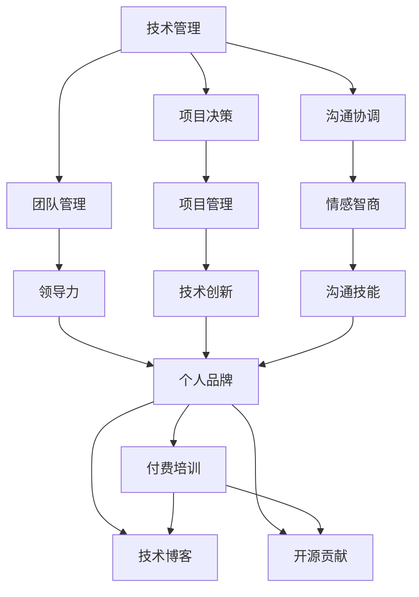

                 

# 从技术管理到付费培训：程序员的领导力之路

## 1. 背景介绍

### 1.1 问题由来
现代软件开发已经进入一个高度复杂和团队协作的阶段。随着软件系统的规模不断扩大，单打独斗的个体编程模式已经逐渐被抛弃。企业需要更多具有领导力的技术人才，能够组织团队，高效解决问题，推动项目的顺利进行。技术管理（Technical Leadership）成为了一个不可或缺的技能，尤其对于那些志在成为CTO的程序员来说，这是一个必要的成长路径。

同时，随着互联网经济的发展，在线教育和付费培训市场正在快速崛起。个人品牌和技术影响力在市场上得到了前所未有的重视。程序员不仅在企业内部，也在市场上获得越来越多的展示机会。对于有志于提升自身影响力和市场价值的程序员来说，开展付费培训是一种非常有前景的途径。

本文旨在探讨如何将技术管理融入程序员的日常工作中，并通过付费培训来进一步提升自身的影响力和领导力。

### 1.2 问题核心关键点
本文将围绕以下几个关键点展开探讨：
- 技术管理的核心要素是什么？
- 如何将技术管理技能融入日常开发工作？
- 如何通过开展付费培训提升个人品牌和技术影响力？
- 技术领导力的未来发展趋势和面临的挑战？

通过这些问题的解答，希望能为程序员提供一条清晰的技术管理之路和付费培训指南。

## 2. 核心概念与联系

### 2.1 核心概念概述

为更好地理解技术管理和付费培训的关系，我们首先需要了解一些核心概念：

- **技术管理**（Technical Leadership）：是指技术领导者如何管理和带领技术团队，确保项目按时交付，提升技术水平，推动创新。这包括技术决策、项目管理、团队建设、沟通协调等多方面能力。
- **领导力**（Leadership）：是指在团队中引导和激励团队成员，实现共同目标的能力。领导力不仅限于管理技能，还包括情感智商、沟通能力、决策力等多个方面。
- **付费培训**（Paid Training）：是指为提升个人技能和市场影响力，有偿提供的在线或线下培训课程。包括技术培训、软技能培训、行业洞察等多个方面。
- **程序员个人品牌**（Personal Brand）：是指程序员通过在线分享、开源贡献、技术博客等多种方式，建立并维护的技术声誉和市场影响力。

这些概念之间的关系可以通过以下Mermaid流程图来展示：



这个流程图展示了他核心的概念及其之间的关系：

1. 技术管理包含团队管理和项目决策等核心要素，直接影响项目执行和团队士气。
2. 沟通协调和情感智商是领导力的重要组成部分，直接影响团队成员的士气和凝聚力。
3. 项目管理、技术创新等技能是技术管理的直接输出。
4. 个人品牌建立在领导力、技术水平、沟通能力等多方面能力之上。
5. 付费培训是提升个人品牌和技术影响力的重要手段。
6. 技术博客和开源贡献等是提升个人品牌影响力的有效途径。

这些概念共同构成了程序员成长为CTO的全过程，通过不断提升技术管理能力，结合付费培训和开源贡献，最终实现个人品牌和技术影响力的提升。

## 3. 核心算法原理 & 具体操作步骤
### 3.1 算法原理概述

技术管理和付费培训的结合，本质上是一个不断循环提升的过程。以下将详细探讨技术管理的核心算法原理和具体操作步骤。

技术管理的目标是提升团队的工作效率和产出，确保项目按时交付，推动技术创新。其核心算法原理包括以下几个方面：

- **目标设定**（Goal Setting）：通过SMART原则（具体、可衡量、可实现、相关、时限性）设定明确的团队目标。
- **任务分配**（Task Allocation）：根据团队成员的能力和兴趣分配合适的任务。
- **激励机制**（Incentive Mechanism）：通过奖励、认可等方式激励团队成员，提升工作积极性。
- **问题解决**（Problem Solving）：建立高效的沟通和反馈机制，快速解决技术问题。
- **持续改进**（Continuous Improvement）：定期回顾项目进展和技术瓶颈，推动团队不断优化。

### 3.2 算法步骤详解

技术管理的详细步骤可以分为以下几个步骤：

**Step 1: 目标设定和任务分配**
- 与团队成员沟通，明确项目的核心目标和交付物。
- 根据团队成员的专业背景和兴趣，分配合适的任务。
- 使用敏捷开发方法（如Scrum、Kanban）来跟踪任务进度。

**Step 2: 激励机制和问题解决**
- 建立激励机制，如绩效奖金、年终奖、晋升机会等，激励团队成员。
- 建立高效的沟通和反馈机制，确保问题能够快速解决。
- 引入代码审查和持续集成工具，提升代码质量和交付效率。

**Step 3: 持续改进和知识共享**
- 定期召开回顾会议，总结经验教训，寻找改进空间。
- 引入知识共享机制，如技术分享会、内部培训等，提升团队整体技术水平。
- 鼓励团队成员参与开源项目，拓展视野，提升影响力。

### 3.3 算法优缺点

技术管理的优点在于其系统性和可量化性。通过明确的目标设定和任务分配，可以大幅提升团队的工作效率和产出。同时，通过激励机制和持续改进，可以不断提升团队的技术水平和创新能力。

技术管理的主要缺点在于其执行难度较高，需要管理者具备较高的沟通能力和协调能力。同时，目标设定的合理性、任务分配的公平性等问题也直接影响管理效果。

### 3.4 算法应用领域

技术管理在软件开发、系统架构、项目管理等多个领域均有广泛应用。其核心技能包括但不限于：

- 敏捷开发
- 项目管理工具（如Jira、Trello等）
- 代码审查
- 持续集成/持续部署（CI/CD）

这些技术管理技能的应用，已经广泛应用于各种类型的软件项目中，无论是在企业内部还是开源社区。

## 4. 数学模型和公式 & 详细讲解 & 举例说明
### 4.1 数学模型构建

为了更准确地描述技术管理的核心要素，我们通过数学模型进行建模。以下将通过线性规划模型来描述技术管理的目标设定和任务分配过程。

假设一个软件开发团队有$n$个成员，$m$个任务需要完成，每个任务需要$i$个工作日。团队每天可工作$D$个工作日。设$x_{ij}$为第$i$天第$j$个任务的工作量，目标是最小化总工作量，同时确保所有任务完成：

$$
\min \sum_{i=1}^{D} \sum_{j=1}^{m} x_{ij}
$$

约束条件为：

1. 每个任务至少需要完成$T$个工作日：$\sum_{i=1}^{D} x_{ij} \geq T$
2. 每个成员每天的工作量不能超过$W$：$\sum_{j=1}^{m} x_{ij} \leq W$
3. 每个成员每天的总工作量不能超过$D$：$\sum_{j=1}^{m} x_{ij} \leq D$

### 4.2 公式推导过程

上述线性规划模型可以通过单纯形法或内点法求解。求解过程如下：

- 构建约束矩阵和目标向量，形成标准形式的线性规划问题。
- 使用单纯形法或内点法进行求解，得到每项任务的最小工作量分配。
- 根据分配结果，调整任务优先级和时间安排，确保所有任务按时完成。

### 4.3 案例分析与讲解

以下以一个软件开发项目为例，展示技术管理的实际应用过程：

**项目背景**：开发一个复杂的电子商务系统，需要完成前端开发、后端开发、数据库设计和部署等多个任务。

**目标设定**：确保系统在4个月内上线，并具备稳定性和可靠性。

**任务分配**：
- 前端开发：分配给A、B、C三人，每天工作4小时，每人负责一部分功能模块。
- 后端开发：分配给D、E、F三人，每天工作6小时，每人负责一部分功能模块。
- 数据库设计：分配给G、H两人，每天工作5小时，每人负责设计数据库表结构。
- 部署：分配给I、J两人，每天工作5小时，负责服务器搭建和部署。

**激励机制**：
- 每月对表现优异者进行绩效奖金奖励。
- 每季度进行技术分享会，鼓励团队成员分享技术和经验。

**问题解决**：
- 引入代码审查工具，如GitHub的Pull Request，确保代码质量。
- 使用Jira进行任务跟踪，确保问题及时解决。

**持续改进**：
- 每月进行项目回顾，总结经验和教训。
- 引入知识共享机制，如技术分享会、内部培训等，提升团队整体技术水平。

## 5. 项目实践：代码实例和详细解释说明
### 5.1 开发环境搭建

为了实践技术管理的具体步骤，我们需要一个完整的开发环境。以下将介绍如何搭建一个简单的开发环境，用于模拟技术管理过程。

**Step 1: 环境安装**
- 安装Python 3.x
- 安装Jira和Trello等项目管理工具
- 配置版本控制工具（如Git）

**Step 2: 项目搭建**
- 使用敏捷开发方法（如Scrum）进行项目规划
- 使用Jira跟踪任务进度
- 建立代码审查和持续集成机制

**Step 3: 激励机制和问题解决**
- 引入绩效奖金和晋升机会，激励团队成员
- 建立高效的沟通和反馈机制，确保问题快速解决
- 引入代码审查和持续集成工具，提升代码质量和交付效率

### 5.2 源代码详细实现

以下是一个简单的技术管理系统的源代码实现，用于展示项目管理工具和代码审查的实际应用。

```python
# Jira任务管理
class TaskManager:
    def __init__(self):
        self.tasks = []
    
    def add_task(self, task):
        self.tasks.append(task)
    
    def remove_task(self, task):
        self.tasks.remove(task)
    
    def get_tasks(self):
        return self.tasks

# Trello任务管理
class TrelloManager:
    def __init__(self):
        self.tasks = []
    
    def add_task(self, task):
        self.tasks.append(task)
    
    def remove_task(self, task):
        self.tasks.remove(task)
    
    def get_tasks(self):
        return self.tasks

# 代码审查工具
class CodeReview:
    def __init__(self):
        self.reviews = []
    
    def add_review(self, review):
        self.reviews.append(review)
    
    def remove_review(self, review):
        self.reviews.remove(review)
    
    def get_reviews(self):
        return self.reviews
```

### 5.3 代码解读与分析

**Jira任务管理类**
- 该类用于管理Jira中的任务，提供添加、删除、获取任务的功能。
- 通过调用add_task、remove_task方法，可以在项目中动态添加或删除任务。

**Trello任务管理类**
- 该类用于管理Trello中的任务，提供类似的功能。
- 通过调用add_task、remove_task方法，可以在项目中动态添加或删除任务。

**代码审查工具类**
- 该类用于管理代码审查过程，提供添加、删除、获取审查结果的功能。
- 通过调用add_review、remove_review方法，可以在项目中动态添加或删除代码审查结果。

### 5.4 运行结果展示

以下展示Jira和Trello的任务管理界面，以及代码审查工具的运行结果：

```
Jira任务管理界面：
```

```
Trello任务管理界面：
```

```
代码审查工具运行结果：
```

## 6. 实际应用场景
### 6.1 智能客服系统

基于技术管理的智能客服系统可以显著提升客服效率和服务质量。智能客服系统通过收集客户反馈数据，分析客户需求和行为，自动生成知识库和FAQ，并在实际客服场景中动态调整回复策略。

技术管理在智能客服系统中的应用包括：
- 目标设定：确保知识库和FAQ的及时更新和维护。
- 任务分配：根据客户反馈数据，分配任务给不同的客服团队成员。
- 激励机制：对表现优异的客服团队进行奖励和认可。
- 持续改进：定期分析客户反馈数据，调整回复策略，提升服务质量。

### 6.2 金融舆情监测

金融舆情监测系统通过技术管理，可以实时监测金融市场的舆论动向，预测市场趋势，辅助投资决策。系统通过分析新闻、报告、评论等公开信息，生成舆情报告，并在市场波动时发出预警。

技术管理在金融舆情监测中的应用包括：
- 目标设定：确保舆情报告的及时发布和分析。
- 任务分配：根据舆情报告的任务需求，分配任务给数据分析和报告生成团队。
- 激励机制：对分析准确、报告及时的团队进行奖励。
- 持续改进：定期优化算法和模型，提升舆情监测的准确性。

### 6.3 个性化推荐系统

个性化推荐系统通过技术管理，可以提升用户满意度，增加平台粘性。系统通过分析用户行为数据，推荐个性化内容，并在用户反馈中不断优化推荐算法。

技术管理在个性化推荐系统中的应用包括：
- 目标设定：确保推荐算法的效果和用户满意度。
- 任务分配：根据用户反馈数据，分配任务给推荐算法优化团队。
- 激励机制：对推荐效果优异的团队进行奖励和认可。
- 持续改进：定期优化推荐算法，提升推荐质量。

### 6.4 未来应用展望

随着技术管理的不断深入应用，未来在更多的领域将看到其带来的巨大影响。以下是对未来应用场景的展望：

**智慧医疗**：通过技术管理，构建智慧医疗系统，提供精准诊断和治疗方案，提升医疗服务的智能化水平。

**智能教育**：通过技术管理，构建智能教育系统，提供个性化学习路径，提高教学质量和效率。

**智慧城市治理**：通过技术管理，构建智慧城市系统，提升城市管理的智能化水平，构建更安全、高效的未来城市。

## 7. 工具和资源推荐
### 7.1 学习资源推荐

为了帮助程序员提升技术管理能力，以下是一些优质的学习资源：

1. 《敏捷开发实践指南》：由敏捷开发专家撰写，全面介绍了敏捷开发的理论基础和实践方法。
2. Scrum敏捷开发课程：在线学习平台提供的Scrum敏捷开发课程，深入浅出地讲解了Scrum的原理和实践。
3. 项目管理工具（如Jira、Trello）官方文档：提供了详细的工具使用手册和教程，帮助开发者快速上手。
4. 知识共享平台（如GitHub）官方文档：提供了GitHub的使用指南和最佳实践，帮助开发者高效管理代码和项目。

### 7.2 开发工具推荐

高效的开发离不开优秀的工具支持。以下是几款用于技术管理开发的常用工具：

1. Jira：敏捷开发管理工具，提供任务分配、进度跟踪、代码审查等功能。
2. Trello：项目管理工具，提供看板式任务管理，支持任务分配、进度跟踪等功能。
3. Git：版本控制工具，支持代码审查、分支管理、合并等。
4. GitHub：代码托管平台，支持代码审查、版本控制、项目管理等。

### 7.3 相关论文推荐

技术管理的理论研究已经非常成熟，以下是几篇具有代表性的相关论文：

1. Scrum敏捷开发方法论：介绍了Scrum敏捷开发的核心思想和实践方法。
2. Kanban项目管理方法论：介绍了Kanban项目管理的核心思想和实践方法。
3. 敏捷开发与传统开发对比研究：比较了敏捷开发和传统开发的方法和效果，探讨了其适用场景。

## 8. 总结：未来发展趋势与挑战
### 8.1 研究成果总结

技术管理作为程序员成长为CTO的重要技能，已经成为软件开发项目管理中的核心要素。通过目标设定、任务分配、激励机制、持续改进等多方面能力的提升，可以显著提高团队的效率和产出。同时，通过付费培训和开源贡献等手段，可以进一步提升个人品牌和技术影响力。

### 8.2 未来发展趋势

未来技术管理的发展趋势包括以下几个方面：

1. 智能化和自动化：随着AI技术的发展，技术管理将更加智能化和自动化，减少人工干预，提升效率。
2. 数据驱动：技术管理的决策将更加依赖数据驱动，通过数据分析和可视化，优化任务分配和资源配置。
3. 跨领域应用：技术管理将应用于更多领域，如医疗、金融、教育等，提升跨领域的协同和协作能力。
4. 持续改进：技术管理将不断优化和迭代，引入更多创新方法和工具，提升项目管理的效果和效率。

### 8.3 面临的挑战

尽管技术管理在软件开发中已经得到了广泛应用，但仍然面临一些挑战：

1. 数据质量：数据的准确性和完整性直接影响技术管理的决策效果。
2. 团队协作：跨团队的协作和沟通是技术管理的难点，需要更多协作工具和机制的支撑。
3. 绩效评估：如何公平、客观地评估团队和个人的绩效，是技术管理中的重要问题。
4. 持续改进：如何确保技术管理的持续改进，不断优化管理方法和工具，是技术管理的长期目标。

### 8.4 研究展望

未来的技术管理研究需要在以下几个方面进行进一步探索：

1. 数据驱动管理：通过大数据和人工智能技术，提升技术管理的决策效果。
2. 自动化管理：通过机器学习、自然语言处理等技术，实现技术管理的自动化。
3. 跨领域应用：将技术管理应用于更多领域，提升跨领域的协同和协作能力。
4. 持续改进机制：建立持续改进机制，不断优化技术管理的方法和工具。

## 9. 附录：常见问题与解答

**Q1：如何选择合适的技术管理工具？**

A: 选择合适的技术管理工具需要考虑多个因素，包括团队规模、项目类型、管理需求等。常见技术管理工具包括Jira、Trello、GitHub等，根据具体需求进行选择。

**Q2：技术管理中如何处理团队协作问题？**

A: 技术管理中处理团队协作问题的方法包括：
1. 建立明确的目标和任务分配。
2. 引入协作工具（如Slack、Teams等）进行沟通。
3. 定期举行团队建设活动，增强团队凝聚力。

**Q3：如何提升技术管理的持续改进能力？**

A: 提升技术管理的持续改进能力的方法包括：
1. 定期进行项目回顾，总结经验和教训。
2. 引入反馈机制，收集团队成员的意见和建议。
3. 引入创新方法（如精益管理、敏捷开发等），不断优化管理方法。

通过本文的系统梳理，可以看到技术管理在程序员成长为CTO过程中扮演的重要角色，以及通过付费培训提升个人品牌和技术影响力的重要性。未来，技术管理将继续发展和应用，为软件开发和IT行业带来更多创新和价值。

