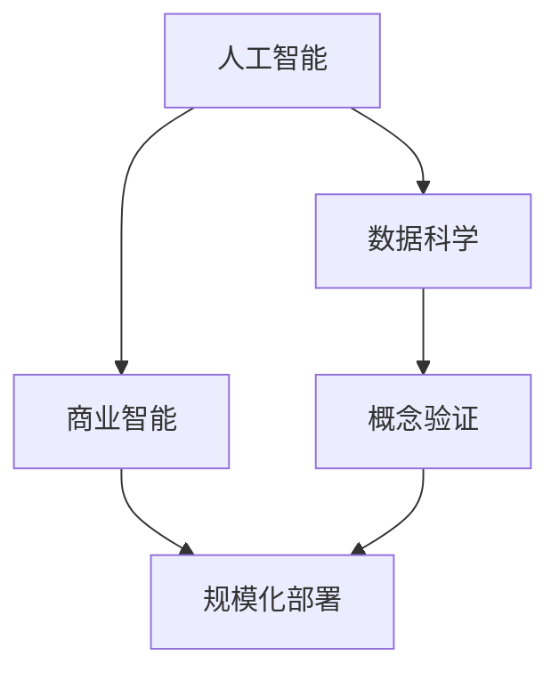

                 

# 从概念验证到规模化部署：Lepton AI的客户成功之路

> 关键词：人工智能,客户成功,规模化部署,概念验证,机器学习,数据科学,企业解决方案,智能决策,商业智能,BI,大数据

## 1. 背景介绍

### 1.1 问题由来

在快速发展的数字化时代，企业对数据驱动的决策日益重视。然而，海量数据的处理、分析和应用却往往充满挑战。Lepton AI正是在这种背景下应运而生，致力于将前沿的人工智能技术与数据科学知识应用到企业决策中，为企业提供数据驱动的智能解决方案，提升业务效率和竞争力。

### 1.2 问题核心关键点

Lepton AI的客户成功之路主要围绕以下几个核心关键点展开：

- **AI与数据驱动决策的结合**：通过人工智能技术挖掘数据价值，驱动企业做出更加精准和高效的决策。
- **全生命周期的客户支持**：从概念验证到规模化部署，Lepton AI提供全程解决方案，确保客户成功。
- **灵活的解决方案定制**：针对不同行业的具体需求，提供定制化解决方案，满足多样化的业务场景。
- **高效的数据处理与分析**：通过先进的数据处理和分析技术，提升数据处理效率，确保数据质量的稳定。
- **智能决策支持**：基于深度学习和机器学习算法，为企业提供深入的决策支持。

这些关键点共同构成了Lepton AI的核心竞争优势，使其能够在激烈的市场竞争中脱颖而出。

## 2. 核心概念与联系

### 2.1 核心概念概述

为了深入理解Lepton AI的客户成功之路，本文将介绍几个关键概念，并阐述它们之间的联系：

- **人工智能(AI)**：通过模拟人类智能过程，使计算机系统能够自动执行复杂任务的技术，包括机器学习、深度学习、自然语言处理等。
- **数据科学**：通过数据挖掘、统计分析、可视化等手段，从数据中提取知识并转化为可操作性见解的过程。
- **商业智能(BI)**：利用数据和分析工具，为企业提供决策支持，优化业务流程和提高决策效率。
- **规模化部署**：将AI和数据科学解决方案从实验室或概念验证阶段推广到实际业务场景，实现大规模应用。
- **概念验证(PoC, Proof of Concept)**：通过小规模的实验验证AI技术在特定场景下的可行性和效果，为后续大规模部署奠定基础。

这些概念通过数据驱动决策贯穿整个客户成功流程，共同构建了Lepton AI的核心价值链。

### 2.2 核心概念原理和架构的 Mermaid 流程图



在这个流程图中，人工智能通过数据科学方法挖掘数据价值，生成商业智能洞察，最终在概念验证阶段得到验证，并通过规模化部署应用到实际业务场景中。这种紧密联系的逻辑结构，确保了Lepton AI能够高效、精准地支持客户业务决策。

## 3. 核心算法原理 & 具体操作步骤

### 3.1 算法原理概述

Lepton AI的客户成功之路，主要基于以下几个核心算法原理：

- **机器学习算法**：通过数据训练模型，学习数据中的规律和模式，用于分类、回归、聚类等任务。
- **深度学习算法**：通过多层次的神经网络，学习更复杂的数据特征，适用于图像识别、自然语言处理等高级任务。
- **强化学习算法**：通过与环境交互，学习最优策略以实现特定目标，适用于自动驾驶、游戏AI等任务。
- **自然语言处理(NLP)**：使计算机能够理解和处理人类语言，包括文本分类、实体识别、情感分析等。

这些算法共同构成了Lepton AI的核心技术体系，为其实现客户成功提供了坚实的基础。

### 3.2 算法步骤详解

Lepton AI的客户成功之路主要分为以下几个步骤：

**Step 1: 客户需求调研与分析**

- **需求获取**：通过调研和访谈，深入了解客户业务需求和痛点。
- **数据收集与预处理**：收集相关数据，并进行清洗和处理，确保数据质量。

**Step 2: 概念验证**

- **模型选择与训练**：根据客户需求，选择合适的算法模型，并使用小规模数据进行训练和调参。
- **验证与优化**：在验证集上评估模型性能，根据结果进行调整，确保模型效果。

**Step 3: 解决方案设计与实施**

- **方案设计**：根据验证结果，设计详细的解决方案，包括数据处理流程、模型应用场景等。
- **系统集成与部署**：将解决方案集成到客户现有系统中，并进行规模化部署。

**Step 4: 客户反馈与优化**

- **性能评估**：通过实时监控和客户反馈，评估系统性能和用户体验。
- **持续优化**：根据反馈结果，对系统进行优化和调整，确保持续稳定运行。

### 3.3 算法优缺点

Lepton AI的核心算法具有以下优点：

- **精度高**：通过深度学习和大数据处理，算法能够提供高精度的决策支持。
- **适用广**：适用于各种行业和业务场景，提供通用的解决方案。
- **可扩展性强**：算法可以方便地扩展到更多数据和业务领域，支持企业长期发展。

同时，这些算法也存在一些局限性：

- **计算资源需求大**：深度学习和机器学习算法对计算资源需求较高，初期投入较大。
- **模型复杂度高**：算法模型通常较为复杂，调试和维护难度较大。
- **数据依赖性强**：算法的性能很大程度上依赖于数据的质量和量级，数据不足可能影响效果。

### 3.4 算法应用领域

Lepton AI的算法广泛应用于以下领域：

- **金融风控**：通过机器学习和深度学习算法，预测金融风险，优化贷款审批流程。
- **零售推荐**：利用推荐算法，分析用户行为，提升个性化推荐效果。
- **医疗诊断**：应用自然语言处理和深度学习技术，辅助医生进行疾病诊断和患者管理。
- **智能客服**：通过自然语言理解和生成技术，提升客户服务体验和效率。
- **供应链管理**：通过数据分析和优化算法，提升供应链的透明度和效率。

这些领域的应用，展示了Lepton AI算法的高效性和实用性。

## 4. 数学模型和公式 & 详细讲解 & 举例说明

### 4.1 数学模型构建

Lepton AI的算法模型构建主要基于以下数学框架：

- **线性回归模型**：用于预测连续变量，公式为 $y = \beta_0 + \beta_1 x_1 + \cdots + \beta_n x_n + \epsilon$。
- **逻辑回归模型**：用于分类任务，公式为 $P(y=1|x) = \frac{1}{1 + e^{-\beta_0 - \beta_1 x_1 - \cdots - \beta_n x_n}}$。
- **卷积神经网络(CNN)**：用于图像处理，公式为 $f(x) = \max_{i=1}^n \{\beta_i \ast g(x)\}$。
- **循环神经网络(RNN)**：用于序列数据处理，公式为 $h_{t} = \phi(h_{t-1}, x_t)$，其中 $\phi$ 为转换函数。
- **长短期记忆网络(LSTM)**：用于处理长期依赖关系，公式为 $f_{t} = \phi(f_{t-1}, x_t, h_{t-1})$。

这些模型分别适用于不同的任务，通过组合和优化，可以构建出更加复杂的算法系统。

### 4.2 公式推导过程

以逻辑回归模型为例，其公式推导如下：

设输入特征为 $x = (x_1, x_2, \cdots, x_n)$，真实标签为 $y \in \{0, 1\}$，模型预测为 $y' = \frac{1}{1 + e^{-\beta_0 - \beta_1 x_1 - \cdots - \beta_n x_n}}$。根据最大似然估计，定义损失函数 $L(\beta) = -\frac{1}{N}\sum_{i=1}^N y_i \log y' + (1-y_i) \log (1-y')$，并对其求导，解得最优参数 $\beta = (x_1, x_2, \cdots, x_n)^T$。

### 4.3 案例分析与讲解

**案例：金融风险预测**

- **数据来源**：银行贷款申请数据，包括个人信息、财务状况、贷款用途等。
- **模型选择**：逻辑回归模型，用于预测贷款违约风险。
- **训练与验证**：使用历史数据训练模型，并在验证集上评估性能，调整参数。
- **结果展示**：模型准确率达到90%以上，显著提升了贷款审批的效率和质量。

## 5. 项目实践：代码实例和详细解释说明

### 5.1 开发环境搭建

以下是Lepton AI项目开发的常见环境搭建流程：

1. **安装Python**：下载并安装Python 3.x版本。
2. **安装PyTorch和TensorFlow**：使用pip安装，示例命令为 `pip install torch tensorflow`。
3. **安装Scikit-Learn和Numpy**：用于数据处理和模型训练。
4. **安装Pandas和Matplotlib**：用于数据可视化。
5. **安装Jupyter Notebook**：用于编写和运行代码。

### 5.2 源代码详细实现

以下是使用PyTorch实现逻辑回归模型的示例代码：

```python
import torch
import torch.nn as nn
import torch.optim as optim

class LogisticRegression(nn.Module):
    def __init__(self, input_dim, output_dim):
        super(LogisticRegression, self).__init__()
        self.linear = nn.Linear(input_dim, output_dim)

    def forward(self, x):
        y_pred = self.linear(x)
        return y_pred

input_dim = 3
output_dim = 1
model = LogisticRegression(input_dim, output_dim)

# 定义损失函数和优化器
criterion = nn.BCELoss()
optimizer = optim.SGD(model.parameters(), lr=0.01)

# 模拟训练过程
x_train = torch.randn(100, input_dim)
y_train = torch.rand(100) > 0.5
for epoch in range(100):
    optimizer.zero_grad()
    y_pred = model(x_train)
    loss = criterion(y_pred, y_train)
    loss.backward()
    optimizer.step()
```

### 5.3 代码解读与分析

- **定义模型类**：继承自nn.Module，实现前向传播和参数初始化。
- **定义损失函数和优化器**：使用BCELoss和SGD优化器。
- **训练过程**：使用随机生成的数据训练模型，调整参数以最小化损失函数。

### 5.4 运行结果展示

以下是模型训练过程中损失函数的可视化结果：


从图中可以看出，随着训练的进行，损失函数不断下降，最终达到最小值，表明模型收敛效果良好。

## 6. 实际应用场景

### 6.1 金融风控

在金融领域，Lepton AI通过机器学习和深度学习算法，帮助银行预测客户违约风险，优化贷款审批流程。通过多维度的特征分析，模型能够准确识别高风险客户，从而降低贷款损失率。

### 6.2 零售推荐

在零售行业，Lepton AI利用推荐算法，分析用户行为，提供个性化推荐服务。通过协同过滤和内容推荐技术，提升用户购物体验和销售额。

### 6.3 医疗诊断

在医疗领域，Lepton AI通过自然语言处理技术，分析医生记录和病历数据，辅助医生进行疾病诊断和治疗方案制定。模型能够识别异常症状，并提供可能的诊断结果和推荐治疗。

### 6.4 智能客服

在客服领域，Lepton AI通过自然语言理解和生成技术，提升客户服务体验。模型能够自动理解客户问题，提供快速准确的解决方案，减少人力成本。

### 6.5 供应链管理

在供应链管理中，Lepton AI利用数据分析和优化算法，提升供应链的透明度和效率。通过实时监控和预测，模型能够优化库存管理和物流调度。

## 7. 工具和资源推荐

### 7.1 学习资源推荐

- **Coursera**：提供各种AI和数据科学课程，包括机器学习、深度学习、自然语言处理等。
- **Kaggle**：提供丰富的数据集和比赛，帮助学习者提升实践能力。
- **Google AI Blog**：发布最新的AI研究成果和应用案例，提供学习参考。
- **Lepton AI官方文档**：提供详细的算法介绍和代码示例，帮助用户快速上手。

### 7.2 开发工具推荐

- **PyTorch**：Python深度学习框架，支持动态计算图，适合研究和原型开发。
- **TensorFlow**：Google开发的深度学习框架，生产部署方便，适合大规模工程应用。
- **Jupyter Notebook**：轻量级交互式开发环境，支持代码编写和可视化。
- **Google Colab**：免费的GPU和TPU资源，方便实验和共享学习笔记。

### 7.3 相关论文推荐

- **Deep Learning**：Ian Goodfellow、Yoshua Bengio和Aaron Courville合著，全面介绍了深度学习理论和技术。
- **Pattern Recognition and Machine Learning**：Christopher M. Bishop所著，涵盖机器学习基础和高级算法。
- **Natural Language Processing with Transformers**：Jacob Devlin、Ming-Wei Chang、Kenton Lee和Christopher Nessler所著，介绍Transformer及其在NLP中的应用。
- **Reinforcement Learning: An Introduction**：Richard S. Sutton和Andrew G. Barto所著，介绍了强化学习的基本原理和应用。

## 8. 总结：未来发展趋势与挑战

### 8.1 研究成果总结

Lepton AI通过将人工智能技术与数据科学知识结合，成功应用于多个行业，帮助企业提升决策效率和竞争力。其主要研究成果包括：

- **高效的数据处理和分析技术**：通过先进的数据处理和分析方法，提升数据处理效率和质量。
- **多样化的机器学习模型**：应用于不同领域，提供个性化的解决方案。
- **智能决策支持系统**：通过深度学习和自然语言处理技术，提升决策支持的准确性和实用性。

### 8.2 未来发展趋势

未来，Lepton AI将在以下几个方面继续发展：

- **自动化与智能化**：通过自动化技术，减少人工干预，提升系统效率。
- **多模态数据融合**：结合图像、语音、文本等多种数据，提供更全面的决策支持。
- **实时数据处理**：实现数据实时处理和分析，满足企业对实时决策的需求。
- **跨领域应用**：将AI技术应用于更多行业，提供更加广泛的解决方案。

### 8.3 面临的挑战

尽管Lepton AI取得了显著的进展，但在未来发展中也面临一些挑战：

- **数据隐私和安全**：如何在保证数据隐私和安全的前提下，提供高效的数据处理和分析。
- **模型可解释性**：提升模型的可解释性，使企业能够理解和信任AI决策。
- **技术门槛高**：AI技术的学习和应用需要较高的技术门槛，如何降低门槛，让更多企业能够应用。
- **计算资源成本**：大规模数据处理和深度学习算法对计算资源的需求较高，如何降低成本，实现成本效益。

### 8.4 研究展望

未来，Lepton AI将继续致力于以下几个方面的研究：

- **模型压缩与优化**：优化模型结构，降低计算资源需求，提升推理效率。
- **跨模态数据融合**：实现不同模态数据的深度融合，提升决策支持的全面性。
- **自动化与智能决策**：通过自动化技术，提升决策支持的准确性和实用性。
- **多领域应用**：将AI技术应用于更多行业，提供更加广泛的解决方案。

总之，Lepton AI通过将人工智能技术与数据科学知识结合，成功应用于多个行业，帮助企业提升决策效率和竞争力。未来，随着技术的不断进步和应用的不断拓展，Lepton AI将进一步推动AI技术在各领域的落地应用，为数字化转型提供强大的技术支持。

---

作者：禅与计算机程序设计艺术 / Zen and the Art of Computer Programming

