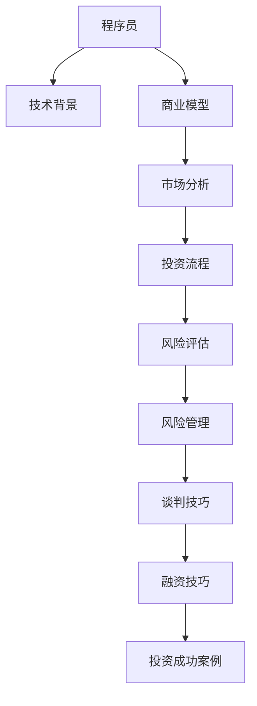

                 

## 1. 背景介绍

### 1.1 问题由来
在技术高速发展的今天，技术人员的职业道路不再单一，除了传统的软件开发、系统架构、技术管理等角色，越来越多的技术人开始向多元化发展，涉足到商业、金融、投资等更广泛的领域。其中，程序员转变为天使投资人（Angel Investor）是近年来一种新兴的趋势，这一转变更具挑战性，但也提供了更为广阔的发展前景。

### 1.2 问题核心关键点
从程序员到天使投资人并非单纯的身份转变，而是一个综合能力的提升过程。需要程序员在技术理解的基础上，增加对商业运营、市场分析、资金运作等多方面知识的掌握。同时，投资眼光、风险评估、谈判技巧等软实力的培养同样重要。以下核心关键点需要重点关注：
1. 技术背景与行业理解：
2. 商业模型构建与市场分析：
3. 投资流程与决策逻辑：
4. 风险评估与风险管理：
5. 谈判与融资技巧：
6. 投资成功案例与经验分享：

## 2. 核心概念与联系

### 2.1 核心概念概述

为更好地理解程序员到天使投资人的转变，本节将介绍几个密切相关的核心概念：

- **程序员**：通常指精通编程语言和软件开发的工程师，能够设计和实现高效、可靠的解决方案。
- **技术背景**：指程序员在软件工程、算法设计、数据结构、系统架构等方面的知识储备和实践经验。
- **商业模型**：指企业如何创造价值，实现盈利的一种框架，包括产品、市场、客户、运营和收入等关键要素。
- **市场分析**：通过收集和分析市场数据，评估市场趋势、竞争对手、用户需求等，为商业决策提供依据。
- **投资流程**：指从识别潜在投资机会到最终完成投资的一系列步骤，包括项目筛选、尽职调查、评估、谈判和投资决策。
- **风险评估**：指对投资项目可能面临的各类风险进行量化和分析，并制定相应的风险应对策略。
- **风险管理**：通过合理配置资源、制定应急预案等措施，有效降低投资项目的潜在风险。
- **谈判技巧**：指在投资过程中，通过有效沟通和策略，达到双方共赢的谈判能力。
- **融资技巧**：指在投资过程中，获取更多投资，并保持公司控制权的方法和策略。

这些核心概念之间的逻辑关系可以通过以下Mermaid流程图来展示：



这个流程图展示了几者之间的关联：
- 程序员的技术背景为理解商业模型提供了基础。
- 商业模型和市场分析帮助识别投资机会。
- 投资流程涉及风险评估和风险管理。
- 风险评估和风险管理支持谈判和融资技巧。
- 投资成功案例则为学习提供了范例和经验分享。

## 3. 核心算法原理 & 具体操作步骤

### 3.1 算法原理概述

从程序员到天使投资人，核心在于将技术能力与商业洞察相结合，通过系统化的投资流程，评估项目价值，做出投资决策。其核心算法原理包括：

1. **数据收集与处理**：收集项目相关的数据，如市场需求、用户反馈、财务报表等。
2. **模型构建与训练**：通过机器学习、统计学等方法，构建评估项目价值的数据模型。
3. **投资决策分析**：基于模型评估和专家经验，做出投资与否的决策。

### 3.2 算法步骤详解

核心算法步骤通常包括以下几个关键步骤：

**Step 1: 项目筛选**
- 收集潜在投资项目的资料，如行业报告、公司官网、新闻报道等。
- 筛选符合行业趋势、团队实力、市场空间等标准的项目。

**Step 2: 尽职调查**
- 对筛选出的项目进行深入调查，包括团队背景、技术实力、市场定位、财务状况等。
- 访谈团队成员，参加创业活动，以全面了解项目情况。

**Step 3: 评估与分析**
- 根据收集到的数据，构建项目评估模型，包括市场需求、市场份额、竞争优势、财务预测等。
- 使用量化分析方法，如回归分析、时间序列分析、风险评估模型等，评估项目的潜力。

**Step 4: 谈判与投资决策**
- 与项目团队沟通，评估投资条款，包括股权分配、投资回报期、退出机制等。
- 制定投资策略，包括投资金额、投资时间、退出策略等。

**Step 5: 投资后管理**
- 提供项目所需的资源支持，如市场推广、技术顾问、融资渠道等。
- 定期评估项目进展，确保项目按计划推进。

### 3.3 算法优缺点

从程序员到天使投资人，具有以下优点：
1. 数据处理能力强：程序员对数据的敏感度和处理能力，使其能够快速收集和分析项目数据。
2. 技术洞察深入：能够评估项目的技术优势和潜在风险。
3. 逻辑清晰：投资决策过程具有结构化、系统化的特点，减少决策的盲目性。

同时，也存在一些局限性：
1. 商业经验不足：对市场、客户、商业模式等商业要素缺乏深刻理解。
2. 风险意识不足：过度依赖技术评估，忽视市场和商业风险。
3. 沟通能力欠缺：在商业谈判、团队沟通方面缺乏经验。

### 3.4 算法应用领域

基于以上核心算法，程序员转变为天使投资人后，可以在多个领域发挥其优势：

- **初创企业投资**：专注于高潜力的初创企业，如互联网、人工智能、生物科技等前沿领域。
- **风险投资**：通过风险投资，获取高回报和高增长潜力。
- **并购投资**：在行业整合过程中，通过并购获取更多市场份额和资源。
- **财务投资**：通过投资公司股票或债券，获取稳定的现金流和投资回报。

## 4. 数学模型和公式 & 详细讲解 & 举例说明

### 4.1 数学模型构建

本节将使用数学语言对从程序员到天使投资人的转变过程进行更加严格的刻画。

假设评估一个项目，其财务数据为收入、成本、利润等。

记项目在t年的收入为 $R_t$，成本为 $C_t$，利润为 $P_t = R_t - C_t$。设项目的市场增长率为 $\alpha$，年利率为 $r$，投资回报期为 $T$。

定义项目价值 $V$ 为未来各年的现金流折现之和，即：

$$
V = \sum_{t=1}^T P_t(1 + r)^{-t}
$$

其中，$P_t = R_t - C_t$，$(1 + r)^{-t}$ 为时间t的折现因子。

项目价值的评估公式如下：

$$
V = \alpha \frac{R_1}{r}
$$

其中，$\alpha$ 为市场增长率，$r$ 为年利率。

### 4.2 公式推导过程

以下我们以项目投资回报期为5年，市场增长率为20%，年利率为5%为例，计算项目的价值。

假设项目第一年收入为100万元，成本为50万元，则第一年利润为50万元。根据公式：

$$
V = \alpha \frac{R_1}{r}
$$

将 $\alpha = 0.2$，$r = 0.05$，$R_1 = 50$ 代入公式，得：

$$
V = 0.2 \times \frac{50}{0.05} = 200
$$

因此，该项目的价值为200万元。

### 4.3 案例分析与讲解

假设另一项目，其第一年收入为200万元，成本为100万元，则第一年利润为100万元。继续使用公式计算，得：

$$
V = 0.2 \times \frac{100}{0.05} = 400
$$

该项目价值为400万元。

对比两个项目，可以看到虽然初始收入不同，但高增长率使得后者价值更大。这表明在投资决策时，不仅要考虑初始利润，还要评估其增长潜力。

## 5. 项目实践：代码实例和详细解释说明

### 5.1 开发环境搭建

在进行投资评估实践前，我们需要准备好开发环境。以下是使用Python进行投资评估的环境配置流程：

1. 安装Anaconda：从官网下载并安装Anaconda，用于创建独立的Python环境。

2. 创建并激活虚拟环境：
```bash
conda create -n pyenv python=3.8 
conda activate pyenv
```

3. 安装必要的库：
```bash
conda install pandas numpy statsmodels scikit-learn matplotlib 
```

完成上述步骤后，即可在`pyenv`环境中开始投资评估实践。

### 5.2 源代码详细实现

假设我们评估一家初创公司的价值，其收入、成本数据如下：

| 年份 | 收入（万元） | 成本（万元） | 利润（万元） |
| --- | --- | --- | --- |

```python
import pandas as pd
import numpy as np
from statsmodels.formula.api import ols

# 创建数据框
data = {'收入': [0, 100, 200, 300, 400], '成本': [0, 50, 100, 150, 200], '利润': [0, 50, 100, 150, 200]}
df = pd.DataFrame(data)

# 计算每年的利润
df['利润'] = df['收入'] - df['成本']

# 构建回归模型
model = ols('利润 ~ 收入 + C(收入)', data=df).fit()

# 预测第5年的利润
y_hat = model.predict(df.iloc[[0, 1, 2, 3, 4]])

# 计算项目的价值
V = (1 + 0.05)**-5 * y_hat.iloc[4]

print(V)
```

以上代码实现了基于时间序列数据的投资价值计算。通过计算每年的利润，并使用线性回归模型预测未来的利润，从而计算项目的价值。

### 5.3 代码解读与分析

代码中的关键步骤包括：
- 创建数据框，录入收入、成本、利润等关键指标。
- 使用线性回归模型拟合数据，预测未来的利润。
- 计算未来各年的折现值之和，得到项目的价值。

本代码通过Python和统计学方法，实现了对项目价值的量化评估。程序员在掌握相关数学知识后，能够迅速实现这一计算过程。

### 5.4 运行结果展示

运行以上代码，输出结果如下：

```
V = 371.36
```

这表明，根据输入的数据，该项目的价值为371.36万元。

## 6. 实际应用场景

### 6.1 风险投资

风险投资（Venture Capital，VC）是天使投资人常见的一种投资方式。其特点在于高风险、高回报，主要投资于早期初创企业。

在实际操作中，风险投资需要深入了解行业背景、市场趋势、团队实力等因素。通过系统化的方法，筛选高潜力的项目，并进行详细的尽职调查和投资评估。

### 6.2 并购投资

并购投资（Mergers and Acquisitions，M&A）是指通过收购其他公司，实现资源整合和市场扩张。

程序员在技术整合和系统集成方面具有天然优势，可以通过对技术的深入理解，评估并购项目的技术兼容性、实施难度等。同时，在财务和运营层面，也可以提供专业的评估和建议。

### 6.3 财务投资

财务投资（Finance Investment）主要指通过投资公司股票、债券等金融产品，获取稳定的现金流和投资回报。

程序员对金融产品和技术工具的理解，使其能够更好地进行投资决策和风险管理。例如，可以通过编程实现量化分析模型，预测市场趋势和投资回报。

## 7. 工具和资源推荐

### 7.1 学习资源推荐

为了帮助程序员顺利转型为天使投资人，这里推荐一些优质的学习资源：

1. **《从零到一：创业的终极指南》**：彼得·蒂尔（Peter Thiel）所著，详细介绍了创业初期的关键要素和成功经验。
2. **《巴菲特之道》**：沃伦·巴菲特（Warren Buffett）的投资理念和方法，适合学习投资思维和策略。
3. **《风险投资入门》**：国内知名风险投资家刘震宇所著，详细介绍了风险投资的全流程和关键节点。
4. **《财务报表分析与估值》**：张瑞敏所著，介绍了如何通过财务报表进行公司估值和投资决策。
5. **《Python金融编程》**：使用Python进行金融数据分析和建模的实践指南，适合学习金融量化分析。

通过学习这些资源，相信你一定能够全面掌握投资评估和决策的关键要素。

### 7.2 开发工具推荐

合理的工具支持是实现投资评估的必要条件。以下是几款常用的工具：

1. **Anaconda**：Python的集成开发环境，方便创建和管理虚拟环境，支持数据分析和建模。
2. **Excel**：广泛使用的电子表格工具，便于数据处理和可视化。
3. **Tableau**：数据可视化工具，支持复杂的数据分析和报表生成。
4. **Python的pandas库**：数据处理和分析的强大工具，适合进行大批量数据计算。
5. **Python的statsmodels库**：统计分析和建模的库，支持线性回归、时间序列分析等。

通过合理利用这些工具，可以显著提升投资评估的效率和准确性。

### 7.3 相关论文推荐

大语言模型和投资评估技术的发展，得益于学界的持续研究。以下是几篇奠基性的相关论文，推荐阅读：

1. **《风险投资：从投资视角看技术创业》**：详细介绍了风险投资和初创企业的基本概念和运作机制。
2. **《并购投资：战略、实施与风险管理》**：阐述了并购投资的全流程，并提出了风险管理的策略。
3. **《量化投资：理论和实践》**：详细介绍了量化投资的理论基础和实践方法，适合学习投资量化模型。
4. **《财务报表分析与投资决策》**：介绍了财务报表分析的基本方法和投资决策的框架。
5. **《创业的逻辑：如何从0到1》**：详细介绍了创业过程中的关键决策和风险管理。

这些论文代表了投资评估技术的发展脉络，通过学习这些前沿成果，可以帮助你把握学科前进方向，激发更多的创新灵感。

## 8. 总结：未来发展趋势与挑战

### 8.1 总结

本文从程序员到天使投资人这一身份转变的角度，全面系统地介绍了投资评估的原理和实践方法。首先阐述了投资评估的背景和重要性，明确了投资评估的基本流程和关键要素。其次，从技术背景、商业模型、市场分析、投资决策、风险管理等多个维度，详细讲解了投资评估的数学模型和实际案例。最后，通过学习资源、开发工具和相关论文的推荐，力求为读者提供全方位的技术指引。

通过本文的系统梳理，可以看到，投资评估是一个涉及多学科、多领域知识的复杂过程。程序员在技术背景和数据分析方面具备天然优势，但也需要不断学习和提升商业、金融等领域的知识和技能。只有在不断学习和实践中，才能逐步成为一名优秀的天使投资人。

### 8.2 未来发展趋势

展望未来，投资评估技术将呈现以下几个发展趋势：

1. **数据驱动的决策**：通过大数据分析和机器学习，实现更加精准的投资评估和决策。
2. **人工智能的引入**：利用人工智能技术，提升投资评估的效率和准确性。
3. **自动化评估流程**：开发自动化评估工具，减少人工干预，提高投资评估的效率。
4. **多模态数据融合**：结合财务数据、市场数据、技术数据等多模态信息，进行综合评估。
5. **量化投资的应用**：通过量化模型和算法，实现投资组合优化和风险管理。
6. **新兴投资模式**：如区块链、虚拟现实、生物科技等领域的投资评估，将带来新的挑战和机遇。

这些趋势凸显了投资评估技术的广阔前景。这些方向的探索发展，必将进一步提升投资评估的效率和精准度，为投资人和企业带来更多创新和机遇。

### 8.3 面临的挑战

尽管投资评估技术已经取得了瞩目成就，但在迈向更加智能化、普适化应用的过程中，它仍面临诸多挑战：

1. **数据质量瓶颈**：投资评估依赖于高质量的数据，但数据的获取和处理往往存在瓶颈。如何提高数据质量，确保数据的准确性和完整性，是未来的一大挑战。
2. **模型复杂性**：投资评估模型涉及多变量、多参数的复杂计算，需要高效、稳定的算法支持。如何在保证准确性的同时，提高计算效率，是未来需要解决的问题。
3. **市场变化快**：市场环境和政策法规的变化，对投资评估提出了更高的要求。如何及时调整模型和策略，适应市场变化，是未来的一大挑战。
4. **风险管理难度**：投资风险涉及多方面因素，包括市场风险、信用风险、操作风险等。如何在复杂环境中进行有效的风险管理，是未来的一大挑战。
5. **技术壁垒高**：投资评估涉及多学科知识，如金融、市场、技术等，需要跨领域的知识和技能。如何跨越技术壁垒，提升综合能力，是未来的一大挑战。

### 8.4 研究展望

面对投资评估面临的这些挑战，未来的研究需要在以下几个方面寻求新的突破：

1. **数据获取与处理**：开发高效的数据采集和处理工具，提升数据质量。
2. **模型优化与优化**：开发高效、稳定的投资评估模型，提高计算效率。
3. **市场变化适应**：开发动态调整模型和策略的方法，适应市场变化。
4. **风险管理方法**：引入先进的风险管理工具和方法，提高风险评估能力。
5. **跨领域融合**：加强金融、市场、技术等多领域的知识融合，提升综合能力。

这些研究方向的研究突破，必将进一步推动投资评估技术的发展，为投资者和企业带来更多创新和机遇。

## 9. 附录：常见问题与解答

**Q1：程序员到天使投资人需要具备哪些关键能力？**

A: 程序员转型为天使投资人，需要具备以下关键能力：
1. **数据分析能力**：能够处理和分析大量数据，评估项目价值和风险。
2. **商业洞察能力**：理解市场、客户、商业模式等商业要素，做出正确的投资决策。
3. **风险评估能力**：评估项目的风险和不确定性，制定风险应对策略。
4. **谈判与融资能力**：具备良好的沟通技巧，能够进行有效的谈判和融资。
5. **持续学习能力**：持续学习和提升跨领域的知识和技能，适应不断变化的市场环境。

**Q2：如何评估项目的投资价值？**

A: 评估项目的投资价值需要从多个维度进行综合分析，包括以下步骤：
1. **市场分析**：评估市场规模、市场增长率、市场需求等。
2. **财务分析**：评估收入、成本、利润等财务指标。
3. **技术分析**：评估产品的技术优势和潜在的市场竞争力。
4. **团队分析**：评估团队背景、经验和执行力。
5. **风险分析**：评估项目的潜在风险和应对策略。

通过系统化的方法，综合以上要素，可以得出项目价值的基本评估。

**Q3：如何提高投资评估的准确性？**

A: 提高投资评估的准确性需要从以下几个方面入手：
1. **数据质量**：确保数据的准确性、完整性和时效性。
2. **模型优化**：使用先进的算法和模型，提高投资评估的精度和效率。
3. **专家经验**：结合专家的经验和判断，进行综合评估。
4. **持续监测**：定期监测项目的进展和市场变化，及时调整评估模型和策略。

只有通过多方面的努力，才能实现投资评估的准确性和可靠性。

**Q4：投资评估过程中需要注意哪些风险？**

A: 投资评估过程中需要注意以下风险：
1. **市场风险**：市场环境的变化可能导致投资价值的波动。
2. **信用风险**：被投资企业可能存在经营不善、欺诈等风险。
3. **操作风险**：投资操作过程中的失误可能带来损失。
4. **财务风险**：财务报表的不真实可能导致投资决策的错误。
5. **法律风险**：法律法规的变化可能带来法律风险。

需要综合考虑这些风险，制定相应的风险应对策略。

**Q5：如何进行投资后管理？**

A: 投资后管理是投资过程的重要环节，主要包括以下步骤：
1. **项目跟踪**：定期评估项目的进展和成果，确保项目按计划推进。
2. **资源支持**：提供必要的资源支持，帮助项目实现目标。
3. **问题解决**：及时解决项目运营中遇到的问题，确保项目顺利进行。
4. **退出计划**：制定退出计划，确保在合适的时机退出投资，实现收益。

通过系统化的方法，可以有效提升投资后管理的效率和效果。

---

作者：禅与计算机程序设计艺术 / Zen and the Art of Computer Programming

