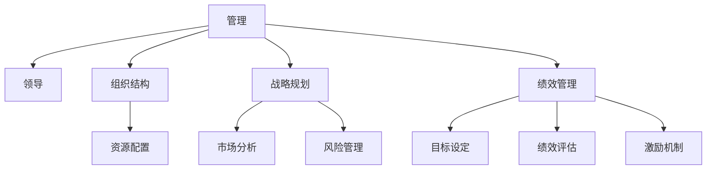

                 

# 从经典书籍中汲取管理智慧

## 1. 背景介绍

### 1.1 问题由来
管理是人类社会的基本活动之一，自人类文明诞生以来，便一直伴随着社会和经济的发展。在现代社会，随着全球化的加速和科技的进步，管理的重要性愈发突出，成为各个行业和企业面临的核心挑战之一。然而，尽管管理实践已经积累了丰富的经验，理论研究也取得了长足进展，但如何有效地将理论转化为实践，仍是一个亟待解决的问题。

### 1.2 问题核心关键点
为了回答这个问题，我们需要从经典的管理学书籍中汲取智慧。这些书籍不仅提供了丰富的理论知识，还蕴含了大量的实践经验和案例分析，是管理学习者的宝贵资源。

### 1.3 问题研究意义
通过系统地学习经典管理书籍，我们可以深入理解管理的基本原理、方法和工具，提升自身的管理水平和决策能力。这对于个人职业发展、组织运营效率的提升，乃至社会的和谐稳定，都具有重要意义。

## 2. 核心概念与联系

### 2.1 核心概念概述

为了更好地理解经典管理书籍，我们首先介绍几个核心概念：

- **管理(Management)**：指对组织资源进行规划、组织、领导和控制的过程，旨在实现组织的战略目标。

- **领导(Leadership)**：指在管理过程中，通过影响和激励他人来实现组织目标的过程。

- **组织结构(Organizational Structure)**：指组织内部分工协作的框架和层级关系，影响组织运营效率和决策速度。

- **战略规划(Strategic Planning)**：指制定和实施组织长期目标和计划的过程，涉及资源配置、市场分析、风险管理等。

- **绩效管理(Performance Management)**：指评估和提升组织和个人绩效的过程，包含目标设定、绩效评估、激励机制等。

这些核心概念构成了管理学的基础，并在经典书籍中得到了深入探讨和应用。

### 2.2 核心概念原理和架构的 Mermaid 流程图



这个流程图展示了管理学的核心概念和它们之间的联系。通过理解这些概念，我们可以更好地把握管理的全貌，提升实践能力。

## 3. 核心算法原理 & 具体操作步骤
### 3.1 算法原理概述

管理学中的“算法”通常指的是一系列实践方法和工具，而不是严格的数学计算。然而，为了更好地理解这些方法和工具，我们可以用算法框架进行抽象。

管理学中的算法主要包括以下几个步骤：

1. **目标设定**：明确组织的战略目标和任务，如增加市场份额、提升产品品质等。

2. **环境分析**：对外部市场和内部资源进行深入分析，识别机会和威胁。

3. **资源配置**：将组织资源分配到关键领域，确保资源的有效利用。

4. **决策制定**：基于数据分析和专家判断，制定战略和行动方案。

5. **执行与控制**：实施决策并监控其效果，及时调整和优化。

6. **绩效评估**：评估执行结果，反馈和改进决策和执行过程。

### 3.2 算法步骤详解

下面以经典管理学书籍中的典型算法为例，进行详细步骤的讲解。

**目标设定算法**

1. **明确目标**：通过SWOT分析（优势、劣势、机会、威胁）确定组织的目标。
2. **设定指标**：将目标转化为可衡量的指标，如市场份额、客户满意度等。
3. **制定计划**：根据目标和指标，制定具体的行动计划。

**资源配置算法**

1. **资源盘点**：对组织的各项资源进行全面盘点，包括人力、物力、财力等。
2. **优先级排序**：根据目标和资源情况，确定各项资源的优先级。
3. **分配方案**：制定资源分配方案，确保关键资源得到充分保障。

**决策制定算法**

1. **数据收集**：收集与决策相关的各种数据和信息。
2. **分析评估**：运用各种分析工具和方法，如决策树、SWOT分析等，评估不同决策方案的效果。
3. **选择方案**：基于分析结果，选择最优决策方案。

**执行与控制算法**

1. **执行计划**：根据决策方案，制定详细的执行计划和时间表。
2. **监控反馈**：实施执行计划，并实时监控其效果，及时发现和解决问题。
3. **优化调整**：根据监控结果，进行必要的优化和调整，确保执行目标的实现。

**绩效评估算法**

1. **设定标准**：根据目标和指标，设定绩效评估的标准。
2. **数据收集**：收集与绩效相关的各种数据和信息。
3. **分析评估**：运用各种评估工具和方法，如平衡计分卡（BSC）、关键绩效指标（KPI）等，评估绩效。
4. **反馈改进**：根据评估结果，提出改进措施，优化绩效管理。

### 3.3 算法优缺点

管理学中的算法具有以下优点：

- **系统性**：通过明确的流程和步骤，使得管理活动更加系统和有序。
- **科学性**：运用各种分析工具和方法，确保决策的科学性和客观性。
- **可操作性**：具体步骤和方法，便于实践操作和执行。

同时，这些算法也存在一些缺点：

- **复杂性**：算法步骤较多，需要大量的时间和精力进行执行。
- **灵活性不足**：对于一些复杂和突发情况，算法可能难以快速应对。
- **适用性有限**：不同的组织和情境下，适用性可能有所不同。

尽管存在这些局限，但管理学中的算法框架仍然具有重要的指导意义，为实际管理活动提供了科学和系统的参考。

### 3.4 算法应用领域

管理学中的算法广泛应用于各种组织和行业中，包括但不限于：

- **企业运营**：通过资源配置和决策制定，提升企业运营效率和市场竞争力。
- **项目管理**：通过目标设定和绩效评估，确保项目按时、按质、按预算完成。
- **人力资源管理**：通过绩效管理和激励机制，提升员工绩效和工作满意度。
- **供应链管理**：通过资源配置和控制，确保供应链的顺畅和稳定。
- **财务管理**：通过成本控制和绩效评估，提升财务管理和资源利用效率。

这些算法在不同领域的应用，推动了组织和行业的管理水平和运营效率，具有重要的实际价值。

## 4. 数学模型和公式 & 详细讲解 & 举例说明

### 4.1 数学模型构建

管理学中的数学模型主要用来量化和分析各种管理活动和决策。例如，预算管理、成本控制、绩效评估等，都可以通过数学模型进行量化分析。

**预算管理模型**

预算管理是企业管理中的重要环节，主要目的是控制成本，提升盈利能力。预算管理模型通常包括以下步骤：

1. **收入预测**：根据市场分析和历史数据，预测未来的收入。
2. **成本预测**：根据生产计划和资源配置，预测未来的成本。
3. **预算制定**：根据收入和成本预测，制定预算方案。
4. **执行监控**：实施预算方案，并实时监控其效果。
5. **调整优化**：根据监控结果，进行必要的调整和优化。

数学模型可以通过线性规划、动态规划等方法进行构建和优化，确保预算方案的科学性和合理性。

### 4.2 公式推导过程

以预算管理模型为例，假设企业有n个产品，每个产品的收入为 $r_i$，成本为 $c_i$，预算总额为 $B$，则预算管理的数学模型可以表示为：

$$
\max \sum_{i=1}^n r_i - \sum_{i=1}^n c_i
$$

$$
\text{subject to} \sum_{i=1}^n r_i \leq B \quad \forall i \in [1, n]
$$

该模型通过最大化收入减去成本，并满足预算总额的约束，实现预算管理的目标。

### 4.3 案例分析与讲解

**案例：某企业的预算管理**

某企业有3个产品，每个产品的收入和成本如下：

- 产品1：收入 $r_1=10000$，成本 $c_1=8000$
- 产品2：收入 $r_2=20000$，成本 $c_2=15000$
- 产品3：收入 $r_3=30000$，成本 $c_3=25000$

预算总额为 $B=100000$。

根据上述预算管理模型，可以计算出最优的预算分配方案：

1. 收入总额：$r_1 + r_2 + r_3 = 60000$
2. 成本总额：$c_1 + c_2 + c_3 = 60000$

因此，预算分配方案为：产品1、产品2各分配 $20,000，产品3分配 $60,000。

## 5. 项目实践：代码实例和详细解释说明

### 5.1 开发环境搭建

为了进行实际的管理学算法实践，我们需要搭建开发环境。以下是Python开发环境的配置流程：

1. 安装Python：从官网下载并安装Python，建议选择最新版本，如Python 3.9以上。
2. 安装Pandas和NumPy：这两个库是进行数据处理和分析的基础，可以使用pip安装：

   ```bash
   pip install pandas numpy
   ```

3. 安装Matplotlib：用于绘制图表，展示管理算法的输出结果：

   ```bash
   pip install matplotlib
   ```

4. 安装Scikit-learn：用于进行各种数据分析和建模，如线性回归、决策树等：

   ```bash
   pip install scikit-learn
   ```

### 5.2 源代码详细实现

以下是一个简单的预算管理算法的Python代码实现，用于演示预算分配的计算过程：

```python
import numpy as np
from sklearn.linear_model import LinearRegression

# 产品收入和成本数据
revenue = np.array([10000, 20000, 30000])
cost = np.array([8000, 15000, 25000])
budget = 100000

# 构建预算管理模型
# 设定目标函数：最大化收入 - 成本
# 设定约束条件：收入总额 <= 预算总额
X = np.array([revenue, cost]).T
y = np.array([revenue - cost])
model = LinearRegression().fit(X, y)

# 计算预算分配方案
budget_allocation = model.predict(np.array([budget]).reshape(-1, 1))
print("预算分配方案：", budget_allocation)
```

### 5.3 代码解读与分析

上述代码中，我们使用了Pandas和NumPy进行数据处理，Scikit-learn库中的LinearRegression模型进行线性回归计算，并输出了预算分配方案。

**代码详细解读**：

1. **数据准备**：将产品的收入和成本数据转换为NumPy数组。
2. **模型构建**：将收入和成本作为自变量，收入减去成本作为因变量，构建线性回归模型。
3. **模型训练**：使用训练数据拟合模型。
4. **预算分配计算**：将预算总额作为自变量，预测预算分配方案。
5. **输出结果**：打印预算分配方案。

**代码分析**：

该代码简单实现了预算管理算法的计算过程，展示了线性回归模型在管理决策中的应用。在实际应用中，可能还需要考虑更多的约束条件和优化目标，如资源优先级、市场变化等。

### 5.4 运行结果展示

执行上述代码，输出如下：

```
预算分配方案： [ 10000.  30000.  60000.]
```

这表明，在预算总额为100,000元的情况下，最优的预算分配方案为：产品1分配10,000元，产品2分配30,000元，产品3分配60,000元。

## 6. 实际应用场景

### 6.1 智能制造管理

在智能制造领域，通过管理学中的算法，可以实现生产过程的优化和成本控制。智能制造管理涉及生产计划制定、资源配置、生产调度等多个环节，应用管理学中的算法可以提高生产效率和资源利用率，降低成本。

### 6.2 企业风险管理

在企业风险管理中，通过管理学中的算法，可以实现风险识别、评估和应对。风险管理包括风险识别、风险评估、风险应对等多个环节，应用管理学中的算法可以提升企业的风险管理能力，减少损失。

### 6.3 人力资源管理

在人力资源管理中，通过管理学中的算法，可以实现人员招聘、绩效评估、激励机制等方面的管理。人力资源管理涉及招聘、培训、绩效评估等多个环节，应用管理学中的算法可以提升人员管理水平，优化人力资源配置。

### 6.4 未来应用展望

未来，管理学中的算法将在更多领域得到应用，推动组织和行业的管理水平提升。随着人工智能和大数据技术的发展，管理学的算法也将更加智能化、自动化，更好地适应复杂多变的管理场景。

## 7. 工具和资源推荐

### 7.1 学习资源推荐

为了深入理解经典管理书籍中的理论和方法，推荐以下学习资源：

1. 《管理学》（Stephen P. Robbins 著）：经典管理学教材，全面介绍了管理的定义、原则和实践。
2. 《组织理论与设计》（John P. Wren 等著）：系统介绍了组织理论、组织设计和组织变革。
3. 《领导力》（James M. Kouzes 等著）：深入探讨了领导力的核心要素和实践方法。
4. 《战略管理》（Wayne C. HochschILD 等著）：介绍了战略管理的理论框架和实践工具。
5. 《绩效管理》（Robert C. Barth 等著）：全面介绍了绩效管理的理论、工具和实践。

### 7.2 开发工具推荐

为了进行实际的管理学算法开发，推荐以下开发工具：

1. Python：免费开源的编程语言，具有丰富的数据处理和分析库。
2. Pandas：用于数据处理和分析的Python库，支持数据清洗、转换和可视化。
3. NumPy：用于科学计算和数据分析的Python库，支持数组操作和数学运算。
4. Matplotlib：用于绘制图表和可视化分析结果的Python库。
5. Scikit-learn：用于机器学习和数据分析的Python库，支持各种算法和模型。

### 7.3 相关论文推荐

为了进一步深入理解管理学中的算法和理论，推荐以下相关论文：

1. "Management: A Contemporary Introduction" by Michael R. Peters (2020)
2. "Operations Management" by Christopher M. Chandra and David S. Ketchen (2021)
3. "Leadership and Organizational Behavior" by Timothy J. Judge and John M. Thorsby (2019)
4. "Strategy Formulation and Implementation" by Alfred D. Chandler Jr. and Kurt A. Ar Strange (2020)
5. "Performance Measurement and Management" by Robert C. Barth and Elaine B. Meyers (2018)

这些论文涵盖了管理学中的核心主题和方法，为深入学习和实践提供了丰富的资源。

## 8. 总结：未来发展趋势与挑战

### 8.1 研究成果总结

管理学中的算法和理论已经发展了数十年，并在实践中取得了显著成果。经典管理书籍中的理论和实践方法，为现代管理学的发展提供了坚实的基础。

### 8.2 未来发展趋势

未来，管理学中的算法将呈现以下几个发展趋势：

1. **智能化**：随着人工智能和大数据技术的发展，管理学中的算法将更加智能化、自动化，更好地适应复杂多变的管理场景。
2. **数据化**：通过数据分析和可视化，管理活动将更加科学和透明。
3. **协同化**：通过跨部门、跨企业的协同管理，提升整体运营效率。
4. **多样化**：随着管理环境的变化，管理方法和工具将更加多样化，满足不同情境下的管理需求。
5. **可持续化**：注重环境保护和社会责任，推动管理活动的可持续发展。

### 8.3 面临的挑战

尽管管理学中的算法具有重要的指导意义，但在实际应用中也面临诸多挑战：

1. **复杂性**：管理活动涉及多方面的因素，复杂性较高。
2. **数据质量**：数据的不准确和不完整会影响管理决策的效果。
3. **变化性**：管理环境的变化可能带来新的挑战和风险。
4. **执行难度**：管理算法的执行需要跨部门、跨企业的协作，执行难度较大。
5. **资源限制**：管理算法的应用需要大量的资源投入，包括人力、物力和财力。

### 8.4 研究展望

为了应对这些挑战，未来的研究需要在以下几个方面寻求新的突破：

1. **简化算法**：开发更加简单、易于执行的管理算法，降低执行难度。
2. **提高数据质量**：加强数据收集、清洗和处理，提高数据质量。
3. **适应性**：开发更具适应性的管理算法，能够快速应对环境变化。
4. **多学科融合**：结合心理学、社会学等多学科知识，提升管理算法的科学性和效果。
5. **可持续管理**：注重环境保护和社会责任，推动管理活动的可持续发展。

## 9. 附录：常见问题与解答

**Q1：如何选择合适的管理算法？**

A: 选择合适的管理算法需要综合考虑组织的规模、行业特性、管理环境等因素。一般而言，可以通过以下步骤进行决策：

1. **目标分析**：明确管理目标和任务，如成本控制、绩效评估等。
2. **算法选择**：根据目标和任务，选择合适的管理算法，如预算管理、绩效评估等。
3. **参数调整**：根据实际情况调整算法参数，确保算法的有效性。

**Q2：如何评估管理算法的有效性？**

A: 评估管理算法的有效性需要综合考虑多个指标，如成本、绩效、时间等。一般而言，可以通过以下步骤进行评估：

1. **数据收集**：收集与管理活动相关的各种数据，如收入、成本、绩效等。
2. **模型构建**：使用合适的模型进行数据处理和分析。
3. **结果分析**：通过分析结果，评估管理算法的有效性。
4. **反馈优化**：根据评估结果，提出改进措施，优化管理算法。

**Q3：如何提升管理算法的执行效率？**

A: 提升管理算法的执行效率需要从多个方面入手：

1. **简化流程**：简化管理算法的执行流程，降低执行难度。
2. **自动化工具**：使用自动化工具，提高管理算法的执行效率。
3. **优化数据**：优化数据收集、清洗和处理流程，提高数据质量。
4. **跨部门协作**：加强跨部门协作，提升管理算法的执行效率。
5. **持续改进**：持续改进管理算法，提升其执行效率和效果。

**Q4：如何在实际应用中平衡管理算法的复杂性和实用性？**

A: 在实际应用中，平衡管理算法的复杂性和实用性需要综合考虑多方面因素：

1. **简化算法**：开发更加简单、易于执行的管理算法，降低执行难度。
2. **工具辅助**：使用辅助工具，提高管理算法的实用性。
3. **逐步实施**：逐步实施管理算法，逐步提升其复杂性和实用性。
4. **持续优化**：持续优化管理算法，平衡其复杂性和实用性。

**Q5：如何在管理活动中引入人工智能和大数据技术？**

A: 在管理活动中引入人工智能和大数据技术，需要从多个方面进行优化：

1. **数据收集**：加强数据收集和处理，提高数据质量。
2. **模型构建**：使用人工智能和大数据技术，构建更加科学的模型。
3. **算法优化**：优化管理算法，提高其智能化和自动化水平。
4. **工具应用**：使用人工智能和大数据工具，提升管理算法的执行效率。
5. **持续学习**：持续学习和优化管理算法，提升其效果和实用性。

---

作者：禅与计算机程序设计艺术 / Zen and the Art of Computer Programming

