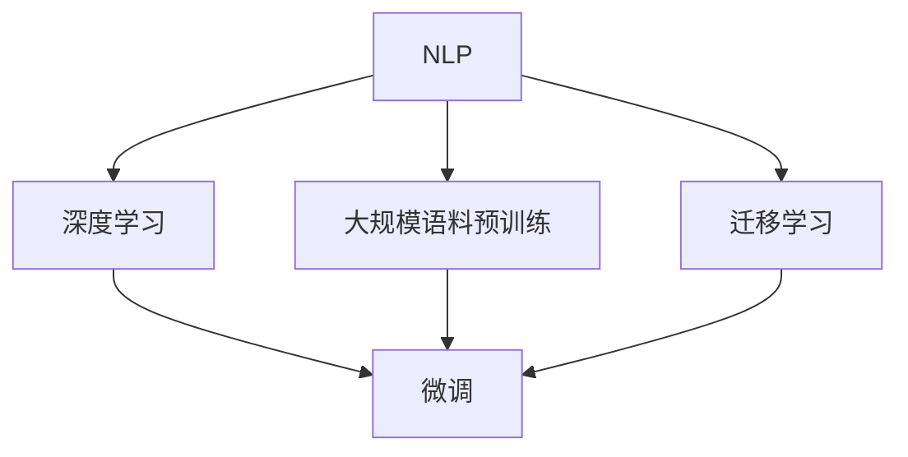

                 

# 从零到一：Lepton AI的创业之路

在数字化时代，人工智能(AI)技术的迅猛发展为企业带来了新的机遇与挑战。从零开始创办一家AI公司，不仅需要强大的技术储备，还需要深入理解市场动态，具备快速迭代和持续创新的能力。本文将分享Lepton AI公司的创业经验，探讨AI初创公司的成功要素和关键挑战，为即将踏入这一领域的创业者提供实用的建议和洞见。

## 1. 背景介绍

### 1.1 问题由来

随着大数据、深度学习和云计算技术的快速发展，AI行业进入了新的阶段。Lepton AI公司的创建，正是响应这一技术浪潮的产物。创业之初，团队致力于解决自然语言处理(NLP)领域的若干难题，包括但不限于：

- **大规模语料预训练**：如何从大规模无标签文本中高效提取语言表示。
- **微调算法优化**：如何在少量标注数据下提高模型性能。
- **跨领域迁移学习**：如何让模型更好地适应不同领域的应用场景。

### 1.2 问题核心关键点

Lepton AI的创业思路可以归纳为几个关键点：

- **技术创新**：通过深度学习模型和大规模语料预训练，提升模型性能。
- **市场需求**：精准识别AI技术在各行业中的应用潜力。
- **商业模式**：构建可持续发展的商业模式，确保公司的长期生存和发展。
- **人才建设**：吸引并培养顶尖的技术人才和行业专家。

## 2. 核心概念与联系

### 2.1 核心概念概述

Lepton AI公司的主要核心概念包括：

- **自然语言处理(NLP)**：使机器能够理解、解释和生成人类语言的技术。
- **深度学习(DL)**：一种基于神经网络的机器学习方法，通过多层非线性映射学习数据模式。
- **大规模语料预训练**：利用大量无标签文本数据训练模型，学习通用的语言知识。
- **微调(Fine-Tuning)**：在预训练模型的基础上，通过有监督学习优化模型，适应特定任务。
- **迁移学习(Transfer Learning)**：将在一个任务上学到的知识迁移到另一个任务上。

这些概念之间相互联系，共同构成了Lepton AI公司的技术基础和应用框架。

### 2.2 核心概念原理和架构的 Mermaid 流程图(Mermaid 流程节点中不要有括号、逗号等特殊字符)



该流程图展示了Lepton AI的核心概念和它们之间的关系：自然语言处理作为基础，深度学习作为手段，通过大规模语料预训练和微调提升模型性能，同时利用迁移学习拓展应用范围。

## 3. 核心算法原理 & 具体操作步骤

### 3.1 算法原理概述

Lepton AI公司的核心算法原理主要围绕以下三个方面：

- **大规模语料预训练**：通过自监督学习任务训练语言模型，学习通用的语言知识。
- **微调算法优化**：利用微调技术，通过少量标注数据优化模型，适应特定任务。
- **迁移学习应用**：将模型应用于不同领域，提升模型泛化能力和性能。

### 3.2 算法步骤详解

Lepton AI的微调算法步骤分为四个阶段：

1. **数据收集**：收集特定领域的标注数据集，划分为训练集、验证集和测试集。
2. **模型初始化**：选择合适的预训练模型，如BERT、GPT等，作为微调的初始参数。
3. **模型微调**：在标注数据集上使用微调算法，优化模型参数。
4. **性能评估**：在测试集上评估模型性能，迭代优化微调策略。

### 3.3 算法优缺点

**优点**：
- **高效性**：微调算法可以在少量标注数据下快速提升模型性能。
- **泛化能力**：预训练模型具有较强的泛化能力，能够适应不同领域的应用场景。
- **灵活性**：微调算法可以根据特定任务的需求，灵活设计任务适配层。

**缺点**：
- **标注成本高**：高质量标注数据往往需要大量时间和人力，标注成本较高。
- **过拟合风险**：模型容易在标注数据上过拟合，泛化能力下降。
- **可解释性不足**：微调模型缺乏解释性，难以调试和优化。

### 3.4 算法应用领域

Lepton AI公司的技术已经广泛应用于以下几个领域：

- **医疗诊断**：利用微调模型分析患者病历，辅助医生进行诊断和治疗。
- **金融风控**：通过微调模型分析金融数据，识别潜在风险和欺诈行为。
- **智能客服**：构建基于微调模型的智能客服系统，提升客户服务效率。
- **内容推荐**：利用微调模型分析用户行为数据，推荐个性化内容。

## 4. 数学模型和公式 & 详细讲解 & 举例说明

### 4.1 数学模型构建

Lepton AI的数学模型构建主要基于深度学习框架，以下以分类任务为例：

- **输入**：文本数据 $x$。
- **输出**：标签 $y$。
- **目标**：最大化交叉熵损失函数 $J(\theta)$。

### 4.2 公式推导过程

对于二分类任务，交叉熵损失函数 $J(\theta)$ 可以表示为：

$$
J(\theta) = -\frac{1}{N} \sum_{i=1}^N (y_i \log \hat{y_i} + (1-y_i) \log (1-\hat{y_i}))
$$

其中 $\hat{y_i}$ 为模型预测结果，$\theta$ 为模型参数。

### 4.3 案例分析与讲解

以医疗诊断为例，Lepton AI通过微调BERT模型，使其能够自动理解医生记录和患者症状，生成可能的诊断结果。微调过程包括：

- **预训练**：在大量医疗文本上训练BERT模型。
- **微调**：在标注的病历和症状数据集上进行微调。
- **评估**：在测试集上评估模型性能，不断优化微调策略。

## 5. 项目实践：代码实例和详细解释说明

### 5.1 开发环境搭建

Lepton AI的开发环境搭建主要包括以下几个步骤：

1. **选择编程语言**：Python是最常用的AI开发语言之一，Lepton AI选择使用Python。
2. **安装相关库**：需要安装TensorFlow、PyTorch、Keras等深度学习库。
3. **配置开发环境**：使用Anaconda创建虚拟环境，安装必要的依赖包。

### 5.2 源代码详细实现

以下是一个使用PyTorch框架实现的微调代码示例：

```python
import torch
import torch.nn as nn
import torch.optim as optim

# 定义模型
class Model(nn.Module):
    def __init__(self):
        super(Model, self).__init__()
        self.encoder = nn.LSTM(100, 256)
        self.fc = nn.Linear(256, num_classes)

    def forward(self, x):
        x, _ = self.encoder(x)
        x = self.fc(x)
        return x

# 定义损失函数和优化器
model = Model()
criterion = nn.CrossEntropyLoss()
optimizer = optim.Adam(model.parameters(), lr=0.001)

# 定义训练函数
def train(model, train_loader, criterion, optimizer, n_epochs):
    for epoch in range(n_epochs):
        for batch in train_loader:
            inputs, labels = batch
            optimizer.zero_grad()
            outputs = model(inputs)
            loss = criterion(outputs, labels)
            loss.backward()
            optimizer.step()

# 定义测试函数
def test(model, test_loader, criterion):
    total_loss = 0
    correct = 0
    with torch.no_grad():
        for batch in test_loader:
            inputs, labels = batch
            outputs = model(inputs)
            loss = criterion(outputs, labels)
            total_loss += loss.item() * len(batch[0])
            predicted = outputs.argmax(dim=1, keepdim=True)
            correct += predicted.eq(labels).sum().item()
    return total_loss / len(test_loader.dataset), correct / len(test_loader.dataset)
```

### 5.3 代码解读与分析

Lepton AI的代码实现分为以下几个步骤：

- **模型定义**：使用PyTorch定义模型结构，包括LSTM编码器和全连接层。
- **损失函数和优化器**：定义交叉熵损失函数和Adam优化器。
- **训练函数**：定义训练过程，包括前向传播、反向传播和优化器更新。
- **测试函数**：定义测试过程，计算损失和准确率。

## 6. 实际应用场景

### 6.4 未来应用展望

Lepton AI的AI技术展望包括以下几个方面：

1. **医疗诊断**：利用深度学习模型分析病历和症状，提高诊断准确率。
2. **金融风控**：通过深度学习模型分析金融数据，识别欺诈行为和风险。
3. **智能客服**：构建基于微调模型的智能客服系统，提升客户服务体验。
4. **内容推荐**：利用深度学习模型分析用户行为数据，推荐个性化内容。
5. **自动化驾驶**：通过深度学习模型分析传感器数据，实现自动驾驶功能。

## 7. 工具和资源推荐

### 7.1 学习资源推荐

Lepton AI推荐以下学习资源：

1. **《深度学习》课程**：斯坦福大学提供的深度学习课程，涵盖深度学习基础和应用。
2. **Kaggle竞赛**：参加Kaggle竞赛，锻炼模型训练和调优能力。
3. **GitHub开源项目**：GitHub上优秀的AI项目，学习和借鉴开源代码。

### 7.2 开发工具推荐

Lepton AI推荐以下开发工具：

1. **Jupyter Notebook**：Python开发常用的Jupyter Notebook，方便代码编写和结果展示。
2. **TensorBoard**：TensorFlow的可视化工具，用于监控模型训练过程。
3. **Weights & Biases**：模型训练实验跟踪工具，记录和可视化模型训练数据。

### 7.3 相关论文推荐

Lepton AI推荐以下相关论文：

1. **"Attention is All You Need"**：Transformer论文，提出Transformer模型，用于提升自然语言处理性能。
2. **"BERT: Pre-training of Deep Bidirectional Transformers for Language Understanding"**：BERT论文，提出BERT模型，用于大规模语料预训练。
3. **"Parameter-Efficient Transfer Learning for NLP"**：提出参数高效微调方法，用于减少模型训练成本。

## 8. 总结：未来发展趋势与挑战

### 8.1 研究成果总结

Lepton AI的研究成果包括：

1. **大规模语料预训练**：通过自监督学习任务训练语言模型，学习通用的语言知识。
2. **微调算法优化**：利用微调技术，通过少量标注数据优化模型，适应特定任务。
3. **迁移学习应用**：将模型应用于不同领域，提升模型泛化能力和性能。

### 8.2 未来发展趋势

Lepton AI的未来发展趋势包括：

1. **模型规模持续增大**：随着算力成本的下降和数据规模的扩张，预训练语言模型的参数量还将持续增长。
2. **微调方法日趋多样**：开发更加参数高效的微调方法，在固定大部分预训练参数的同时，只更新极少量的任务相关参数。
3. **持续学习成为常态**：让模型能够不断学习新知识，同时保持已学习的知识，避免灾难性遗忘。
4. **少样本学习和零样本学习**：利用提示学习，通过精心设计的输入文本，引导模型按期望方式输出，减少微调参数。
5. **跨领域迁移能力增强**：经过海量数据的预训练和多领域任务的微调，未来的语言模型将具备更强大的常识推理和跨领域迁移能力。

### 8.3 面临的挑战

Lepton AI面临的挑战包括：

1. **标注成本瓶颈**：高质量标注数据往往需要大量时间和人力，标注成本较高。
2. **模型鲁棒性不足**：模型面对域外数据时，泛化性能往往大打折扣。
3. **推理效率有待提高**：大规模语言模型往往推理速度慢、内存占用大。
4. **可解释性亟需加强**：模型缺乏解释性，难以解释其内部工作机制和决策逻辑。
5. **安全性有待保障**：模型可能学习到有害信息，产生误导性、歧视性的输出。

### 8.4 研究展望

Lepton AI的研究展望包括：

1. **探索无监督和半监督微调方法**：摆脱对大规模标注数据的依赖，利用自监督学习、主动学习等无监督和半监督范式。
2. **研究参数高效和计算高效的微调范式**：开发更加参数高效的微调方法，在固定大部分预训练参数的同时，只更新极少量的任务相关参数。
3. **引入更多先验知识**：将符号化的先验知识，如知识图谱、逻辑规则等，与神经网络模型进行巧妙融合。
4. **融合因果和对比学习范式**：通过引入因果推断和对比学习思想，增强微调模型建立稳定因果关系的能力。
5. **纳入伦理道德约束**：在模型训练目标中引入伦理导向的评估指标，过滤和惩罚有害的输出倾向。

## 9. 附录：常见问题与解答

**Q1: Lepton AI如何选择预训练模型？**

A: Lepton AI通常选择在大规模语料上预训练过的模型，如BERT、GPT等，这些模型具有较好的语言表示能力。在选择预训练模型时，需要考虑模型的参数量、训练时间、预训练任务的适配性等因素。

**Q2: 微调过程中如何避免过拟合？**

A: 避免过拟合可以采取以下措施：
1. 数据增强：通过回译、近义替换等方式扩充训练集。
2. 正则化：使用L2正则、Dropout、Early Stopping等技术。
3. 对抗训练：引入对抗样本，提高模型鲁棒性。
4. 参数高效微调：只调整少量参数(如Adapter、Prefix等)，减小过拟合风险。
5. 多模型集成：训练多个微调模型，取平均输出，抑制过拟合。

**Q3: 如何提升微调模型的性能？**

A: 提升微调模型性能可以采取以下措施：
1. 选择合适的预训练模型，确保其语言表示能力。
2. 使用大规模标注数据，避免过拟合。
3. 选择合适的损失函数，如交叉熵损失。
4. 调整学习率，避免过拟合。
5. 使用数据增强、正则化等技术，提高模型泛化能力。

**Q4: 如何降低标注数据的成本？**

A: 降低标注数据成本可以采取以下措施：
1. 使用无监督学习方法，如自监督学习、主动学习等。
2. 利用众包平台，通过人工标注获取标注数据。
3. 利用已有的公开数据集，通过数据清洗和标注，构建新数据集。
4. 使用半监督学习，利用少量标注数据和大量未标注数据进行训练。

---

作者：禅与计算机程序设计艺术 / Zen and the Art of Computer Programming

