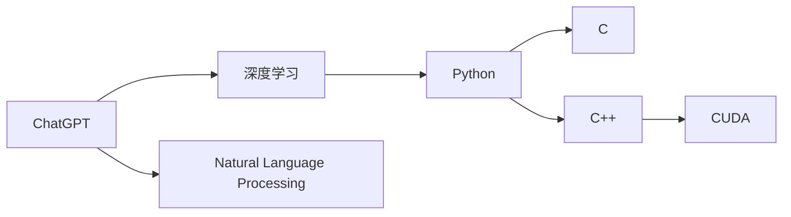

                 

# 从零开始构建ChatGPT类应用：Python、C和CUDA实战

## 1. 背景介绍

随着人工智能技术的不断发展，智能聊天机器人（Chatbot）正在逐步成为各行各业数字化转型的重要工具。智能聊天机器人不仅能够提供24小时在线服务，还能理解自然语言、处理复杂问答，提升用户体验。当前，许多知名的聊天机器人平台如ChatGPT、微软的Azure Bot Service等都是基于深度学习和自然语言处理（NLP）技术构建的。本文将详细介绍如何使用Python、C和CUDA构建ChatGPT类应用，涵盖从模型训练到应用部署的全过程。

## 2. 核心概念与联系

### 2.1 核心概念概述

- **ChatGPT**：一种基于深度学习和NLP技术的智能聊天机器人，能够理解和生成自然语言。
- **深度学习**：一种模仿人脑神经网络的计算模型，通过多层次的神经元组合，实现复杂的任务处理。
- **自然语言处理**：使计算机能够理解、分析和生成人类语言的技术。
- **Python**：一种高效、易读的编程语言，广泛用于数据科学、机器学习和软件开发。
- **C/C++**：高效、系统性的编程语言，常用于系统级编程和底层优化。
- **CUDA**：由NVIDIA开发的并行计算平台和编程模型，用于加速GPU计算。

### 2.2 核心概念原理和架构的 Mermaid 流程图



此图展示了大语言模型ChatGPT的组成架构。其中，深度学习是核心技术，自然语言处理是应用领域，而Python、C和CUDA是实现手段。

## 3. 核心算法原理 & 具体操作步骤

### 3.1 算法原理概述

ChatGPT类应用的核心算法基于预训练语言模型（Pre-trained Language Model, PLM），如Transformer模型。通过在大规模无标签文本数据上进行预训练，PLM模型学习到丰富的语言知识，能够处理自然语言。然后，在特定任务（如问答、对话生成等）上进行微调（Fine-tuning），以适应具体需求。

### 3.2 算法步骤详解

1. **数据准备**：收集并准备训练数据，如对话数据集，包含问题和答案。
2. **模型训练**：使用深度学习框架如PyTorch或TensorFlow构建模型，并使用GPU/CUDA进行并行计算，加速训练过程。
3. **微调**：根据具体任务需求，在预训练模型基础上进行微调，以提高模型在特定任务上的性能。
4. **评估与部署**：在验证集上评估模型性能，并将其部署到实际应用中，如网站、移动应用等。

### 3.3 算法优缺点

**优点**：
- **高效性**：基于深度学习的模型能高效处理自然语言。
- **通用性**：训练后的模型可应用于多种自然语言处理任务。
- **可扩展性**：模型结构可扩展，支持更大规模的数据集。

**缺点**：
- **数据需求大**：需要大量高质量的数据进行预训练。
- **计算资源高**：训练和微调模型需要高性能的GPU或TPU。
- **模型复杂**：模型的构建和微调过程较为复杂。

### 3.4 算法应用领域

ChatGPT类应用广泛应用于客服、教育、娱乐等多个领域：
- **客服领域**：用于自动化回答客户咨询，提升服务效率。
- **教育领域**：用于辅助教学，回答学生问题，提供个性化学习建议。
- **娱乐领域**：用于提供虚拟助手，如游戏AI、小说创作等。

## 4. 数学模型和公式 & 详细讲解 & 举例说明

### 4.1 数学模型构建

假设我们构建的聊天机器人模型为 $M$，输入为 $x$，输出为 $y$。模型的输入 $x$ 可以是自然语言文本，输出 $y$ 可以是自然语言文本或分类标签。

$$
y = M(x)
$$

### 4.2 公式推导过程

假设我们使用Transformer模型进行训练，其计算过程如下：
1. **编码器**：将输入文本 $x$ 转换为一系列向量表示。
2. **解码器**：生成目标文本 $y$ 的向量表示。
3. **注意力机制**：在生成每个单词时，根据上下文动态调整注意力权重。
4. **损失函数**：使用交叉熵损失函数 $L(x, y)$ 计算预测输出与真实标签之间的差异。

以生成对话为例，我们定义模型在输入 $x$ 上的概率分布 $P(y|x)$，最大化该概率分布，使得模型输出的 $y$ 最接近真实标签。

$$
P(y|x) = \frac{e^{L(y|x)}}{\sum_{y'} e^{L(y'|x)}}
$$

### 4.3 案例分析与讲解

假设我们构建了一个简单的问答系统，输入为问题，输出为答案。使用Transformer模型进行训练，损失函数为交叉熵。在训练过程中，我们逐步减小学习率，使得模型逐渐收敛到最优解。

## 5. 项目实践：代码实例和详细解释说明

### 5.1 开发环境搭建

1. **安装Python**：从官网下载并安装Python，建议使用最新版本。
2. **安装PyTorch**：使用pip安装PyTorch，支持深度学习模型训练。
3. **安装CUDA**：NVIDIA提供的并行计算平台，支持GPU加速计算。

### 5.2 源代码详细实现

```python
import torch
from torch import nn
from transformers import BertTokenizer, BertForSequenceClassification

class QAChatbot(nn.Module):
    def __init__(self, model_name='bert-base-uncased'):
        super(QAChatbot, self).__init__()
        self.tokenizer = BertTokenizer.from_pretrained(model_name)
        self.model = BertForSequenceClassification.from_pretrained(model_name, num_labels=2)

    def forward(self, question, answer):
        tokens = self.tokenizer(question, answer, padding=True, max_length=512)
        input_ids = tokens['input_ids']
        attention_mask = tokens['attention_mask']
        logits = self.model(input_ids=input_ids, attention_mask=attention_mask)[0]
        probabilities = torch.softmax(logits, dim=1)
        return probabilities

    def predict(self, question):
        tokens = self.tokenizer(question, padding=True, max_length=512)
        input_ids = tokens['input_ids']
        attention_mask = tokens['attention_mask']
        logits = self.model(input_ids=input_ids, attention_mask=attention_mask)[0]
        probabilities = torch.softmax(logits, dim=1)
        return probabilities.argmax().item()

chatbot = QAChatbot()
```

### 5.3 代码解读与分析

该代码实现了基于BERT模型的简单问答系统，包括模型的加载和预测。其中，`QAChatbot`类继承自`nn.Module`，包含模型初始化、前向传播、预测等函数。在`forward`函数中，使用BERT模型进行输入文本的编码和解码，输出概率分布。在`predict`函数中，对输入文本进行编码，并使用模型进行预测，返回预测结果。

### 5.4 运行结果展示

在运行`predict`函数时，我们可以得到模型对输入文本的预测结果，例如：

```python
result = chatbot.predict("请问天气怎么样？")
print(result)
```

输出结果为预测出的天气情况的概率分布。

## 6. 实际应用场景

### 6.1 智能客服

智能客服系统可以大幅提升企业的服务效率，减少人力成本。例如，某电商平台搭建了基于ChatGPT的智能客服系统，通过预训练语言模型和微调，该系统能够自动化回答常见问题，如退换货政策、订单状态查询等，提升用户满意度。

### 6.2 教育辅助

教育机构可以利用ChatGPT类应用进行智能辅助教学，如自动批改作业、提供个性化学习建议等。某大学引入ChatGPT进行教学答疑，学生可以在线提问，系统即时提供解答，极大地提升了教学互动性和学习效率。

### 6.3 娱乐应用

ChatGPT类应用在娱乐领域的应用也十分广泛，如游戏AI、小说创作等。某游戏公司通过ChatGPT进行剧情生成，让玩家在游戏中体验更加真实的故事线，增强游戏沉浸感。

### 6.4 未来应用展望

未来，ChatGPT类应用将在更多领域得到应用，如医疗、金融、法律等，为各行各业带来变革性影响。例如，在医疗领域，ChatGPT可辅助医生进行病情诊断和治疗建议；在金融领域，ChatGPT可用于金融咨询和风险评估；在法律领域，ChatGPT可帮助律师进行法律查询和合同生成。

## 7. 工具和资源推荐

### 7.1 学习资源推荐

1. **《Python深度学习》**：李沐等著，详细介绍Python在深度学习中的应用。
2. **《TensorFlow深度学习实战》**：王卓著，提供TensorFlow的详细教程和实战案例。
3. **《自然语言处理综论》**：徐宗本等著，全面介绍自然语言处理的基本概念和最新进展。
4. **《深度学习基础》**：李宏毅等著，讲解深度学习的理论基础和实践技巧。
5. **《TensorFlow中文社区》**：提供丰富的学习资料和社区支持。

### 7.2 开发工具推荐

1. **PyTorch**：广泛使用的深度学习框架，支持Python编程。
2. **TensorFlow**：Google开发的深度学习框架，支持C++和Python编程。
3. **CUDA**：NVIDIA提供的并行计算平台，支持GPU加速计算。
4. **Jupyter Notebook**：开源的交互式编程环境，支持多语言编程。
5. **Google Colab**：基于Jupyter Notebook的在线平台，支持GPU计算。

### 7.3 相关论文推荐

1. **"Attention Is All You Need"**：Vaswani等著，提出Transformer模型，开启深度学习大模型时代。
2. **"BERT: Pre-training of Deep Bidirectional Transformers for Language Understanding"**：Devlin等著，提出BERT模型，改进预训练方法。
3. **"Language Models are Unsupervised Multitask Learners"**：Radford等著，提出GPT-2模型，展示大规模语言模型的强大能力。
4. **"Parameter-Efficient Transfer Learning for NLP"**：Howard等著，提出Adapter等参数高效微调方法，提升微调效率。

## 8. 总结：未来发展趋势与挑战

### 8.1 研究成果总结

ChatGPT类应用在深度学习和自然语言处理领域取得了显著成果，通过预训练和微调，模型能够高效处理自然语言，广泛应用于多个领域。未来的研究将继续探索模型结构和训练方法，提升模型的性能和泛化能力。

### 8.2 未来发展趋势

1. **模型规模增大**：未来预训练语言模型将继续朝着更大规模的方向发展，以获得更丰富的语言知识。
2. **多模态融合**：未来ChatGPT类应用将更多地融合视觉、语音等多模态数据，提升自然语言处理能力。
3. **多领域应用**：ChatGPT类应用将在更多领域得到应用，如医疗、金融、法律等，带来变革性影响。
4. **持续学习**：ChatGPT类应用将支持持续学习，实时更新模型知识，提升服务质量。

### 8.3 面临的挑战

尽管ChatGPT类应用取得了诸多进展，但仍面临诸多挑战：
1. **数据需求大**：大规模预训练和微调需要大量的高质量数据，难以获得。
2. **计算资源高**：模型的训练和部署需要高性能的GPU或TPU，计算成本较高。
3. **模型复杂**：模型结构和训练过程复杂，难以调试和优化。
4. **伦理与安全**：模型输出可能包含偏见、有害信息，需要加强监管和安全保障。

### 8.4 研究展望

未来，ChatGPT类应用的研究将从以下几个方向展开：
1. **无监督学习和半监督学习**：探索无监督和半监督学习方法，减少对标注数据的依赖。
2. **多领域和多模态学习**：融合视觉、语音等多模态数据，提升模型的泛化能力。
3. **可解释性与安全性**：提升模型的可解释性，保障模型的安全性和可靠性。
4. **持续学习与终身学习**：支持模型的持续学习，实时更新模型知识，保持服务质量。

## 9. 附录：常见问题与解答

### 9.1 常见问题

**Q1：ChatGPT类应用如何训练和微调？**

A：ChatGPT类应用通过在大规模无标签文本数据上进行预训练，学习语言知识。然后在特定任务上使用小规模标注数据进行微调，适应具体需求。

**Q2：ChatGPT类应用在训练和微调过程中需要注意什么？**

A：在训练和微调过程中，需要注意以下几点：
1. 数据准备：收集高质量的训练数据，标注数据。
2. 模型选择：选择合适的预训练模型，如BERT、GPT等。
3. 参数调整：调整学习率、批大小等训练参数。
4. 正则化：使用L2正则、Dropout等防止过拟合。
5. 模型评估：在验证集上评估模型性能，调整参数。
6. 模型部署：将模型部署到实际应用中，如网站、移动应用等。

**Q3：ChatGPT类应用有哪些实际应用场景？**

A：ChatGPT类应用广泛应用于多个领域：
1. 智能客服：自动化回答客户咨询，提升服务效率。
2. 教育辅助：自动批改作业、提供个性化学习建议。
3. 娱乐应用：生成剧情、提供游戏AI等。
4. 医疗咨询：辅助医生进行病情诊断和治疗建议。
5. 金融咨询：提供金融咨询和风险评估。
6. 法律查询：辅助律师进行法律查询和合同生成。

**Q4：ChatGPT类应用的未来发展趋势是什么？**

A：ChatGPT类应用的未来发展趋势包括：
1. 模型规模增大：未来预训练语言模型将继续朝着更大规模的方向发展。
2. 多模态融合：融合视觉、语音等多模态数据，提升自然语言处理能力。
3. 多领域应用：在更多领域得到应用，如医疗、金融、法律等。
4. 持续学习：支持持续学习，实时更新模型知识，保持服务质量。

---

作者：禅与计算机程序设计艺术 / Zen and the Art of Computer Programming

