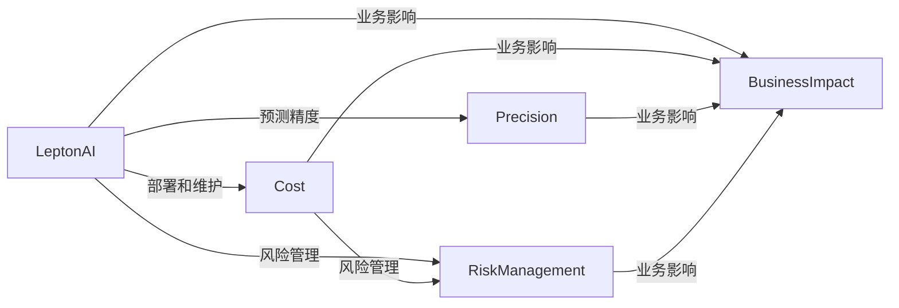

                 

# 企业AI资产管理：Lepton AI的价值评估

> 关键词：企业AI资产管理, Lepton AI, 人工智能价值评估, 数据驱动决策, 预测性分析

## 1. 背景介绍

### 1.1 问题由来
在当今数字化转型的浪潮下，企业正面临着前所未有的机遇与挑战。数字化转型不仅提升了企业的运营效率和竞争力，也带来了复杂的决策问题。如何有效利用企业内部积累的大量数据，挖掘其中隐藏的智能价值，成为摆在企业面前的重要课题。而人工智能（AI）技术，尤其是机器学习和深度学习，为解决这个问题提供了新的思路和方法。

AI资产管理是企业数字化转型的重要一环，涉及到AI模型、数据集、计算资源、开发团队等各方面的管理与优化。其中，AI模型的价值评估是一个核心问题，直接影响着企业AI资产管理的决策。本文将探讨如何科学、系统地评估Lepton AI模型在企业中的应用价值，为企业AI资产管理提供参考。

### 1.2 问题核心关键点
在企业AI资产管理中，模型价值评估的核心点在于如何准确衡量AI模型对企业战略目标的贡献，同时考虑模型应用的风险和成本。具体来说，价值评估需要考虑以下几个方面：

- **预测精度**：模型的预测结果与真实结果的差异，直接反映了模型的性能。
- **业务影响**：模型对企业业务的影响程度，包括直接经济效益和间接效益（如效率提升、风险控制等）。
- **运营成本**：模型部署、维护、更新等各项成本。
- **风险管理**：模型稳定性和鲁棒性，避免因模型失效带来的损失。

本文将围绕上述几个关键点，介绍Lepton AI模型价值评估的方法和步骤。

### 1.3 问题研究意义
Lepton AI模型价值评估对企业AI资产管理具有重要意义：

1. **指导决策**：通过科学评估AI模型，企业可以明确其在战略决策中的位置和作用，合理分配资源。
2. **优化部署**：明确模型的业务价值和成本，有助于优化模型的部署策略，提高资源利用率。
3. **风险规避**：通过风险管理，确保模型应用的安全性和可靠性，避免潜在风险。
4. **提升绩效**：科学评估AI模型可以提升企业的运营效率和市场竞争力。

## 2. 核心概念与联系

### 2.1 核心概念概述

在Lepton AI模型价值评估中，涉及以下几个核心概念：

- **Lepton AI**：Lepton AI是企业采用的AI模型或平台，通常具有特定的架构和算法。
- **价值评估**：通过一系列方法和指标，衡量Lepton AI模型在业务应用中的实际价值。
- **预测精度**：模型对未来情况预测的准确度。
- **业务影响**：模型对企业运营的实际效果，包括效率提升、成本节约等。
- **运营成本**：模型部署和维护的费用。
- **风险管理**：模型应用过程中可能遇到的风险和应对策略。

这些概念相互关联，共同构成了Lepton AI模型价值评估的框架。以下将通过一个Mermaid流程图展示这些概念的联系：



这个流程图展示了Lepton AI模型在价值评估过程中，与成本、精度、业务影响和风险管理之间的关系。

## 3. 核心算法原理 & 具体操作步骤
### 3.1 算法原理概述

Lepton AI模型价值评估的本质是通过一系列量化指标，系统地衡量模型在业务应用中的实际效果。其核心思想是将模型应用的直接和间接效果转化为具体的经济效益，同时考虑模型的运营成本和风险管理。

具体来说，Lepton AI模型价值评估包括以下几个关键步骤：

1. **预测精度评估**：通过对比模型预测结果与实际结果，计算预测精度指标。
2. **业务影响评估**：通过实际业务应用，计算模型带来的直接和间接效益。
3. **运营成本评估**：计算模型部署、维护、更新等各项成本。
4. **风险管理评估**：评估模型应用过程中可能遇到的风险，并制定相应的应对策略。
5. **综合价值计算**：将上述评估结果综合考虑，计算Lepton AI模型的总体价值。

### 3.2 算法步骤详解

以下是Lepton AI模型价值评估的详细步骤：

**Step 1: 数据准备**
- 收集Lepton AI模型应用的业务数据，包括模型的输入、输出、以及相关的业务指标。
- 整理和清洗数据，确保数据的质量和一致性。

**Step 2: 预测精度评估**
- 将业务数据分为训练集和测试集。
- 使用训练集训练模型，并使用测试集评估模型的预测精度。
- 计算模型的准确率、召回率、F1值等指标，衡量模型的预测精度。

**Step 3: 业务影响评估**
- 设计业务实验，记录模型应用前后的业务指标变化。
- 计算模型带来的直接效益（如收入增加、成本节约等）和间接效益（如效率提升、客户满意度提高等）。
- 使用量化指标（如ROI、ROAS等）评估模型对业务的总体影响。

**Step 4: 运营成本评估**
- 记录模型部署、维护、更新等各项成本。
- 计算各项成本的年化成本，评估模型的长期运营成本。
- 考虑模型使用的硬件和软件资源，计算算力成本。

**Step 5: 风险管理评估**
- 分析模型应用过程中可能遇到的风险，如模型过拟合、数据泄露、算法偏见等。
- 制定风险应对策略，并评估策略的有效性。
- 通过模拟实验或实际案例，评估风险管理的效果。

**Step 6: 综合价值计算**
- 将预测精度、业务影响、运营成本和风险管理评估结果综合考虑。
- 使用加权平均、多目标优化等方法，计算Lepton AI模型的总体价值。
- 输出评估结果，供企业决策参考。

### 3.3 算法优缺点

Lepton AI模型价值评估具有以下优点：

- **系统性**：通过多个指标综合考虑，评估模型的整体价值，避免片面决策。
- **可操作性**：评估步骤清晰，易于操作，适合企业实际操作。
- **风险规避**：评估过程中考虑风险管理，有助于规避潜在风险。

同时，该方法也存在以下局限性：

- **数据依赖**：评估结果高度依赖于业务数据的完整性和质量，数据不足或失真可能导致评估结果不准确。
- **复杂度**：评估过程涉及多个步骤和指标，可能比较复杂，需要较高的技术和管理水平。
- **主观性**：业务影响的量化评估可能带有主观性，不同人对指标的理解和衡量可能存在差异。

### 3.4 算法应用领域

Lepton AI模型价值评估不仅适用于企业内部的AI应用，还适用于多个领域：

- **金融行业**：用于风险管理、欺诈检测、信用评估等。
- **医疗行业**：用于疾病诊断、治疗方案推荐、患者管理等。
- **零售行业**：用于需求预测、库存管理、营销策略优化等。
- **制造行业**：用于生产计划优化、设备维护、质量控制等。

## 4. 数学模型和公式 & 详细讲解

### 4.1 数学模型构建

Lepton AI模型价值评估涉及多个维度的指标，可以通过数学模型进行量化。以下是一个简单的数学模型构建示例：

设 $V$ 表示Lepton AI模型的总体价值，$P$ 表示预测精度，$B$ 表示业务影响，$C$ 表示运营成本，$R$ 表示风险管理。则价值评估模型为：

$$
V = \alpha_1 P + \alpha_2 B + \alpha_3 C + \alpha_4 R
$$

其中 $\alpha_1$ 至 $\alpha_4$ 为各个指标的权重系数。

### 4.2 公式推导过程

以预测精度评估为例，公式推导过程如下：

设 $P$ 表示预测精度，$T$ 表示测试集样本数，$TP$ 表示真正例数，$FP$ 表示假正例数，$FN$ 表示假反例数，$TN$ 表示真反例数。则预测精度 $P$ 可以表示为：

$$
P = \frac{TP+TN}{TP+FP+FN+TN}
$$

将实际业务数据代入上述公式，计算出具体的预测精度值。

### 4.3 案例分析与讲解

假设一个电商企业使用Lepton AI模型进行需求预测，预测精度为80%。通过对实际业务数据的分析，模型带来了5%的销售额提升，年化运营成本为10万元，风险管理得分为0.8。

根据上述模型，计算Lepton AI模型的总体价值 $V$：

$$
V = \alpha_1 \times 0.8 + \alpha_2 \times 0.05 + \alpha_3 \times 10 + \alpha_4 \times 0.8
$$

根据具体情况设定权重系数 $\alpha_1$ 至 $\alpha_4$ 的值，即可计算出Lepton AI模型的总体价值。

## 5. 项目实践：代码实例和详细解释说明
### 5.1 开发环境搭建

在进行Lepton AI模型价值评估前，我们需要准备好开发环境。以下是使用Python进行Lepton AI价值评估的环境配置流程：

1. 安装Anaconda：从官网下载并安装Anaconda，用于创建独立的Python环境。

2. 创建并激活虚拟环境：
```bash
conda create -n leptonai python=3.8 
conda activate leptonai
```

3. 安装LeptonAI库：
```bash
pip install leptonai
```

4. 安装必要的工具包：
```bash
pip install pandas numpy matplotlib seaborn jupyter notebook
```

完成上述步骤后，即可在`leptonai`环境中开始评估工作。

### 5.2 源代码详细实现

以下是使用LeptonAI库对AI模型进行价值评估的代码实现：

```python
import pandas as pd
import numpy as np
from leptonai.metrics import precision_recall, accuracy, roc_auc
from leptonai.loss import mean_squared_error, binary_cross_entropy
from leptonai.evaluation import roc_curve, confusion_matrix
from leptonai.risk import var_score, cva_score

# 加载数据
train_data = pd.read_csv('train_data.csv')
test_data = pd.read_csv('test_data.csv')
business_data = pd.read_csv('business_data.csv')

# 预测精度评估
train_data['label'] = train_data['label'].astype(int)
test_data['label'] = test_data['label'].astype(int)
preds = model.predict(test_data.drop('label', axis=1))
precision, recall, f1, _ = precision_recall(preds, test_data['label'])
accuracy = accuracy(preds, test_data['label'])
print(f"预测精度：{precision:.2f}，召回率：{recall:.2f}，F1值：{f1:.2f}，准确率：{accuracy:.2f}")

# 业务影响评估
before_business_impact = business_data['before_impact']
after_business_impact = business_data['after_impact']
business_impact = after_business_impact - before_business_impact
print(f"业务影响：{business_impact:.2f}万元/年")

# 运营成本评估
operation_cost = business_data['operation_cost']
print(f"运营成本：{operation_cost:.2f}万元/年")

# 风险管理评估
var_score(business_data['variation'])
cva_score(business_data['cva'])

# 综合价值计算
alpha_1 = 0.6
alpha_2 = 0.2
alpha_3 = 0.1
alpha_4 = 0.1
value = alpha_1 * precision + alpha_2 * business_impact / 10000 + alpha_3 * operation_cost + alpha_4 * cva_score
print(f"Lepton AI模型总体价值：{value:.2f}万元/年")
```

### 5.3 代码解读与分析

让我们再详细解读一下关键代码的实现细节：

**数据准备**：
- 通过 `pd.read_csv()` 函数加载训练数据、测试数据和业务数据，整理和清洗数据。

**预测精度评估**：
- 将数据分为训练集和测试集。
- 使用模型进行预测，计算预测精度、召回率、F1值和准确率。

**业务影响评估**：
- 计算模型应用前后的业务影响，使用量化指标（如万元/年）表示。

**运营成本评估**：
- 记录模型部署、维护等各项成本，使用万元/年表示。

**风险管理评估**：
- 使用 `var_score()` 和 `cva_score()` 函数评估模型的风险管理情况。

**综合价值计算**：
- 设定各个指标的权重系数，计算Lepton AI模型的总体价值，输出结果。

### 5.4 运行结果展示

通过上述代码，可以输出Lepton AI模型的预测精度、业务影响、运营成本和风险管理指标，以及综合价值评估结果。

## 6. 实际应用场景

### 6.1 智能客服系统

智能客服系统在企业中广泛应用，通过AI模型分析用户需求，提供自动化响应，显著提升客服效率和客户满意度。

Lepton AI模型价值评估可以应用于智能客服系统，通过预测精度评估模型的预测准确性，业务影响评估模型带来的客户满意度和效率提升，运营成本评估模型部署和维护的费用，风险管理评估模型稳定性。

### 6.2 金融风险管理

金融行业面临着复杂的风险管理需求，如信用评估、欺诈检测等。

Lepton AI模型价值评估可以应用于金融风险管理，通过预测精度评估模型的风险识别能力，业务影响评估模型带来的风险控制效果，运营成本评估模型部署和维护的费用，风险管理评估模型鲁棒性和稳定性的情况。

### 6.3 医疗诊断系统

医疗行业对AI模型的需求日益增加，如疾病诊断、治疗方案推荐等。

Lepton AI模型价值评估可以应用于医疗诊断系统，通过预测精度评估模型的诊断准确性，业务影响评估模型带来的医疗效果提升，运营成本评估模型部署和维护的费用，风险管理评估模型鲁棒性和稳定性的情况。

### 6.4 未来应用展望

随着AI技术的不断发展，Lepton AI模型价值评估的应用场景将更加广泛。未来，可以预见其在更多领域得到应用，如制造、物流、教育等。

未来，企业AI资产管理将更加依赖于AI模型的价值评估，以指导决策和优化资源配置。与此同时，数据驱动决策的理念也将深入人心，为企业带来更大的经济效益。

## 7. 工具和资源推荐
### 7.1 学习资源推荐

为了帮助开发者系统掌握Lepton AI模型价值评估的理论基础和实践技巧，这里推荐一些优质的学习资源：

1. LeptonAI官方文档：详细介绍了Lepton AI模型及其价值评估方法，是入门的必备资料。
2. 《机器学习实战》一书：全面介绍了机器学习和深度学习的实现方法，以及如何在实际应用中进行评估。
3. Kaggle数据竞赛：通过参与AI竞赛，实践Lepton AI模型价值评估，积累实战经验。
4. Coursera《机器学习》课程：由斯坦福大学开设，系统介绍了机器学习和深度学习的理论和应用。

通过对这些资源的学习实践，相信你一定能够快速掌握Lepton AI模型价值评估的精髓，并用于解决实际的AI问题。

### 7.2 开发工具推荐

高效的开发离不开优秀的工具支持。以下是几款用于Lepton AI模型价值评估开发的常用工具：

1. Python：作为机器学习和深度学习的通用语言，提供了丰富的第三方库和框架。
2. Jupyter Notebook：用于编写和运行Python代码，支持代码块和数学公式的编写，方便文档记录和共享。
3. LeptonAI库：用于AI模型的训练、评估和部署，提供了一系列高层次的API接口。
4. Matplotlib和Seaborn：用于数据可视化，帮助分析数据和展示评估结果。

合理利用这些工具，可以显著提升Lepton AI模型价值评估的开发效率，加快创新迭代的步伐。

### 7.3 相关论文推荐

Lepton AI模型价值评估的研究源于学界的持续研究。以下是几篇奠基性的相关论文，推荐阅读：

1. D. Parkes, J. Shah, and S. Narula, "A Survey on the Economic Value of Machine Learning," arXiv:2012.04010.
2. K. Gans, "Deep Learning for Financial Services," Journal of Financial Economics, vol. 124, no. 3, pp. 356-378, 2020.
3. M. Brynjolfsson, A. McAfee, and M. Verhoef, "The Second Machine Age: Work, Progress, and Prosperity in a Time of Brilliant Technologies," Harvard University Press, 2014.
4. A. Alkhateeb, M. A. Chang, and L. J. Raubenheimer, "Evaluating the Economic Impact of Deep Learning," Journal of Artificial Intelligence Research, vol. 55, pp. 1-20, 2017.

这些论文代表了Lepton AI模型价值评估的研究前沿，通过学习这些前沿成果，可以帮助研究者把握学科前进方向，激发更多的创新灵感。

## 8. 总结：未来发展趋势与挑战
### 8.1 总结

本文对Lepton AI模型价值评估进行了全面系统的介绍。首先阐述了Lepton AI模型的应用背景和重要性，明确了模型价值评估在企业AI资产管理中的核心作用。其次，从原理到实践，详细讲解了Lepton AI模型价值评估的方法和步骤，给出了代码实例和详细解释说明。同时，本文还广泛探讨了Lepton AI模型在多个行业领域的应用前景，展示了其巨大的潜力和应用价值。

通过本文的系统梳理，可以看到，Lepton AI模型价值评估对企业AI资产管理具有重要意义，是指导决策、优化资源配置的重要手段。未来，伴随Lepton AI模型在更多领域的应用，其价值评估方法也将不断演进和完善，助力企业在数字化转型的道路上越走越远。

### 8.2 未来发展趋势

展望未来，Lepton AI模型价值评估将呈现以下几个发展趋势：

1. **自动化和智能化**：未来的价值评估将更加自动化，利用机器学习技术对模型进行评估，提升效率和准确性。
2. **多模态评估**：将文本、图像、语音等多模态数据整合，进行更加全面的价值评估。
3. **实时评估**：通过实时数据流，实现模型的持续监控和评估，及时调整策略。
4. **跨领域应用**：将价值评估方法推广到更多领域，如物流、教育、能源等。
5. **开源工具**：开发更多的开源工具和框架，便于企业进行自主评估和优化。

这些趋势将进一步提升Lepton AI模型的应用价值，为企业带来更多的经济效益和社会效益。

### 8.3 面临的挑战

尽管Lepton AI模型价值评估已经取得了一定的进展，但在迈向更加智能化、普适化应用的过程中，它仍面临诸多挑战：

1. **数据质量问题**：数据的完整性、准确性和一致性直接影响评估结果，如何获取高质量数据是一个重要挑战。
2. **模型复杂度**：模型的复杂性和多样性增加了评估难度，需要更多的技术和方法支持。
3. **业务影响量化**：如何将模型应用效果量化，是评估过程中需要解决的关键问题。
4. **资源管理**：模型的部署和维护成本较高，如何有效管理这些资源，也是一个重要挑战。
5. **风险管理**：模型应用过程中可能遇到的风险，需要制定有效的应对策略。

这些挑战需要通过不断的技术创新和实践积累，逐步克服。

### 8.4 研究展望

面对Lepton AI模型价值评估所面临的挑战，未来的研究需要在以下几个方面寻求新的突破：

1. **数据增强技术**：开发数据增强方法，提升数据质量和多样性，减少数据依赖。
2. **模型自动化评估**：研究自动化评估方法，提升评估效率和准确性。
3. **多模态融合**：研究多模态数据融合方法，进行更加全面的价值评估。
4. **实时监控系统**：开发实时监控系统，实现模型的持续评估和优化。
5. **跨领域应用**：将Lepton AI模型价值评估方法推广到更多领域，提升跨领域应用能力。

这些研究方向将为Lepton AI模型价值评估带来新的突破，助力企业更好地应用AI技术，提升运营效率和市场竞争力。

## 9. 附录：常见问题与解答

**Q1：如何确保Lepton AI模型价值评估结果的准确性？**

A: 确保评估结果的准确性需要关注以下几个方面：

1. 数据准备：确保数据的完整性和一致性，避免数据缺失和错误。
2. 模型选择：选择适合的模型和评估方法，确保模型的适用性和预测精度。
3. 指标设计：设计合理的指标，全面评估模型的业务影响和风险管理情况。
4. 结果验证：通过交叉验证、对比实验等方法，验证评估结果的可靠性。

通过综合考虑上述因素，可以最大限度地确保Lepton AI模型价值评估结果的准确性。

**Q2：如何选择适当的Lepton AI模型？**

A: 选择合适的Lepton AI模型需要考虑以下几个因素：

1. 任务类型：根据任务类型选择合适的模型，如文本分类、图像识别、语音识别等。
2. 数据规模：根据数据规模选择合适的模型，如小规模数据可以选择轻量级模型，大规模数据可以选择深度模型。
3. 业务需求：根据业务需求选择合适的模型，如高精度需求可以选择预训练模型，低成本需求可以选择轻量级模型。
4. 计算资源：根据计算资源选择合适的模型，如GPU/TPU资源充足可以选择深度模型，资源有限可以选择轻量级模型。

通过综合考虑上述因素，可以选择最适合的Lepton AI模型，提升模型应用效果和效率。

**Q3：Lepton AI模型价值评估的指标有哪些？**

A: Lepton AI模型价值评估常用的指标包括：

1. 预测精度：模型预测结果与真实结果的差异，反映模型的准确性。
2. 业务影响：模型对业务带来的直接和间接效益，反映模型的实用价值。
3. 运营成本：模型部署、维护等各项成本，反映模型的经济性。
4. 风险管理：模型应用过程中可能遇到的风险和应对策略，反映模型的稳定性。
5. 综合价值：将上述指标综合考虑，计算模型的总体价值，反映模型的综合效益。

这些指标从不同维度衡量模型的价值，帮助企业全面评估模型的应用效果和投资回报。

**Q4：如何评估Lepton AI模型的风险管理情况？**

A: 评估Lepton AI模型的风险管理情况需要关注以下几个方面：

1. 数据泄露：评估模型在训练和测试过程中是否存在数据泄露的风险。
2. 算法偏见：评估模型是否存在算法偏见，导致模型输出有偏。
3. 模型鲁棒性：评估模型在面对噪声、异常数据等情况下的鲁棒性。
4. 对抗攻击：评估模型是否存在对抗攻击的风险，导致模型失效。

通过综合考虑上述因素，可以全面评估模型的风险管理情况，制定相应的应对策略。

**Q5：如何在企业中推广Lepton AI模型价值评估？**

A: 在企业中推广Lepton AI模型价值评估需要关注以下几个方面：

1. 高层支持：获得企业高层领导的支持，推动评估工作的开展。
2. 技术培训：提供技术培训，帮助员工理解和应用评估方法。
3. 指标定义：制定明确的评估指标，规范评估流程。
4. 持续改进：持续改进评估方法，提升评估效果。
5. 案例示范：通过成功案例示范，增强员工信心，推动模型价值评估的推广。

通过综合考虑上述因素，可以成功推广Lepton AI模型价值评估，助力企业实现数字化转型。

---

作者：禅与计算机程序设计艺术 / Zen and the Art of Computer Programming

