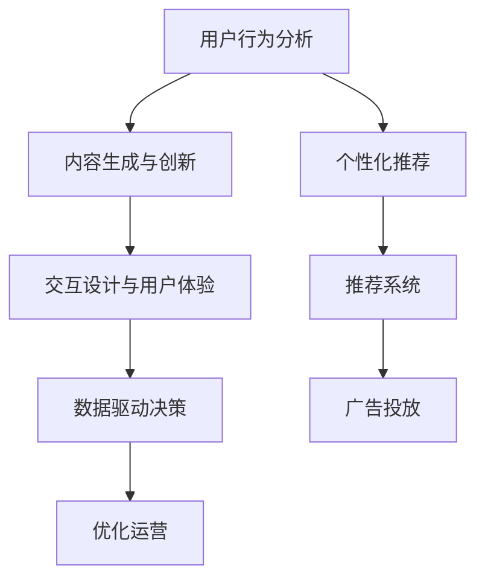

                 

# 企业如何在注意力经济中脱颖而出

## 1. 背景介绍

在数字化浪潮的推动下，信息爆炸和用户注意力分散已成为新常态。企业面对高度竞争的市场环境，不仅需要在产品、技术上不断创新，还需要在注意力争夺战中脱颖而出，赢得用户信任和品牌忠诚度。所谓"注意力经济"，即指在信息过载的时代，谁能有效吸引并锁定用户注意力，谁就能在市场中占据优势。

### 1.1 问题由来

随着社交媒体、内容平台和移动设备的普及，用户获取信息的方式日趋多样化，注意力经济已成主流。企业需要在海量内容中脱颖而出，通过精准的个性化推荐、有趣的内容创造和及时的互动体验，有效吸引并保持用户注意力。然而，现有的推荐算法和内容生产机制，往往难以捕捉用户深层次的情感和需求，无法提供真正吸引人的体验。因此，研究如何在注意力经济中高效获取和利用用户注意力，是当前企业亟需解决的问题。

### 1.2 问题核心关键点

有效吸引用户注意力，需综合考虑以下几个关键点：

- 用户个性化需求：通过分析用户历史行为、偏好和兴趣，提供个性化的推荐和内容。
- 互动体验设计：通过即时反馈、社交互动等方式，增强用户参与感和满意度。
- 内容质量和创意：创造高质量、创意十足的内容，吸引用户兴趣和参与。
- 数据驱动决策：通过用户数据分析，动态调整推荐策略，优化内容生产和互动方式。

本文旨在探讨企业如何在注意力经济中脱颖而出，从技术和管理两个层面，提供全面、深入的解决方案。

## 2. 核心概念与联系

### 2.1 核心概念概述

为更好地理解如何在注意力经济中突出企业优势，本节将介绍几个关键概念及其联系：

- 注意力经济(Attention Economy)：指在信息过载的社会中，企业和组织需要吸引并维持用户注意力以实现商业目标的经济形态。
- 用户行为分析(User Behavior Analysis)：通过统计分析用户的历史行为数据，挖掘用户的兴趣偏好和需求变化。
- 个性化推荐(Personalized Recommendation)：根据用户特征和行为数据，推荐符合其兴趣的产品或内容。
- 内容生成与创新(Content Creation and Innovation)：通过算法和人工创作，生成高质量、创意独特的内容。
- 交互设计与用户体验(Interactive Design and User Experience)：设计用户友好的界面和互动方式，提升用户使用体验。
- 数据驱动决策(Data-Driven Decision Making)：利用数据分析结果，驱动决策制定和优化，提高决策准确性。

这些概念之间的联系可以通过以下Mermaid流程图来展示：



这个流程图展示了从用户行为分析到内容生成，再到交互设计，最终形成数据驱动决策的完整流程。通过这个过程，企业能够实现精准的用户画像，提供个性化的推荐内容，设计良好的用户体验，从而在注意力经济中脱颖而出。

## 3. 核心算法原理 & 具体操作步骤
### 3.1 算法原理概述

企业要在注意力经济中脱颖而出，需通过一系列算法和技术手段，实现精准的用户画像和个性化推荐，同时提升内容的创意性和用户体验。核心算法原理主要包括：

- 用户画像构建：通过分析用户行为数据，生成精准的用户画像。
- 推荐系统设计：利用推荐算法，根据用户画像进行个性化推荐。
- 内容生成与优化：运用自然语言处理和生成模型，创作优质内容，并通过反馈机制不断优化。
- 用户体验设计：设计友好的交互界面和互动方式，提升用户参与度。
- 数据驱动决策：通过数据分析结果，持续优化推荐和内容策略。

### 3.2 算法步骤详解

基于以上原理，企业在注意力经济中的核心操作步骤包括以下几个环节：

**Step 1: 数据采集与处理**

- 收集用户行为数据，包括浏览记录、购买历史、社交互动等。
- 对数据进行清洗和预处理，去除噪音和异常值。
- 将数据转化为适合算法处理的格式，如矩阵形式或向量表示。

**Step 2: 用户画像构建**

- 运用聚类、分类等算法，分析用户行为数据，生成用户画像。
- 对用户画像进行特征提取和降维，确保画像的准确性和高效性。
- 建立用户画像数据库，方便后续查询和更新。

**Step 3: 推荐系统设计**

- 选择合适的推荐算法，如协同过滤、基于内容的推荐、混合推荐等。
- 利用用户画像数据，计算相似用户或物品的评分，生成推荐列表。
- 引入反馈机制，通过用户交互数据不断调整推荐策略，提高推荐效果。

**Step 4: 内容生成与优化**

- 应用自然语言处理模型，如GPT-3、BERT等，生成优质内容。
- 通过A/B测试等手段，分析用户对内容的反馈，不断优化内容创意和风格。
- 利用数据增强技术，如数据扩充、变换等，丰富内容库。

**Step 5: 用户体验设计**

- 设计简洁友好的UI/UX，确保内容展示清晰直观。
- 引入交互设计原则，如即时反馈、个性化推荐等，提升用户参与感。
- 利用用户行为数据，动态调整界面布局和功能，优化用户体验。

**Step 6: 数据驱动决策**

- 利用数据分析工具，如Google Analytics、Tableau等，分析用户行为数据。
- 将分析结果转化为业务决策，如调整推荐算法参数、优化内容策略等。
- 定期评估决策效果，持续优化推荐和内容系统。

### 3.3 算法优缺点

注意力经济中的核心算法具有以下优点：

- 提升用户体验：通过个性化推荐和优质内容，提高用户满意度和参与感。
- 优化资源利用：精准的用户画像和推荐算法，有效提升资源利用率。
- 动态调整策略：数据分析驱动的决策机制，快速响应市场变化。

同时，这些算法也存在一些局限性：

- 数据隐私问题：用户行为数据的收集和使用，需严格遵守隐私法规。
- 算法偏见风险：推荐算法可能产生偏见，需通过模型解释和优化缓解。
- 模型复杂度高：大规模用户画像和内容库的存储和处理，需要高性能计算资源。
- 用户适应性差：过度依赖推荐系统，可能使用户失去主动探索能力。

企业在应用这些算法时，需平衡利弊，优化系统性能。

### 3.4 算法应用领域

注意力经济中的核心算法已在多个领域得到广泛应用，例如：

- 电商推荐：根据用户浏览和购买历史，推荐相关商品。
- 社交媒体：根据用户互动数据，推荐感兴趣的内容。
- 视频平台：根据用户观看行为，推荐个性化视频。
- 新闻网站：根据用户阅读偏好，推荐相关新闻。
- 金融服务：根据用户交易记录，推荐投资组合。

这些应用场景中，通过用户画像构建、推荐系统设计和内容优化，有效提升了用户参与度和满意度，助力企业实现商业目标。

## 4. 数学模型和公式 & 详细讲解  
### 4.1 数学模型构建

企业要构建精准的用户画像和个性化推荐系统，需构建多个数学模型。本文以协同过滤推荐系统为例，介绍基本模型构建方法。

假设用户集为 $U$，物品集为 $I$，用户对物品的评分矩阵为 $R \in \mathbb{R}^{m \times n}$，其中 $m$ 为用户数量，$n$ 为物品数量。推荐系统目标是最小化预测评分与真实评分之间的差异，即：

$$
\min_{R'} \frac{1}{2m} \sum_{u=1}^m \sum_{i=1}^n (R'_{ui} - R_{ui})^2
$$

其中 $R'_{ui}$ 为模型预测的评分，$R_{ui}$ 为真实评分。

### 4.2 公式推导过程

为了解决这个问题，协同过滤推荐系统引入了用户-物品相似度矩阵 $S \in \mathbb{R}^{m \times n}$，表示用户 $u$ 和物品 $i$ 之间的相似度。推荐模型通过求解 $R'$ 最小化损失函数：

$$
\min_{R', S} \frac{1}{2m} \sum_{u=1}^m \sum_{i=1}^n (R'_{ui} - R_{ui})^2 + \lambda (\Vert R' - R \Vert_F^2 + \Vert S - S_0 \Vert_F^2)
$$

其中 $S_0$ 为初始相似度矩阵，$\Vert \cdot \Vert_F$ 表示矩阵的 Frobenius 范数，$\lambda$ 为正则化系数。

根据上述公式，推荐系统可通过求解矩阵 $R'$ 和 $S$ 优化，以生成推荐评分矩阵 $R'$。常见的求解方法包括矩阵分解、奇异值分解、SVD++等。

### 4.3 案例分析与讲解

下面以一个具体案例，分析协同过滤推荐系统的实际应用。

假设某电商平台的推荐系统需要根据用户历史购买记录，为用户推荐相关商品。通过协同过滤算法，推荐系统首先对用户和商品进行聚类，计算用户-商品相似度矩阵 $S$。然后，根据相似度矩阵 $S$，对用户的历史评分数据 $R_{ui}$ 进行加权平均，生成预测评分 $R'_{ui}$：

$$
R'_{ui} = \sum_{j=1}^n S_{uj} \cdot R_{uj}
$$

推荐系统根据预测评分 $R'_{ui}$ 生成推荐列表，展示给用户。用户点击浏览后，系统收集反馈数据，不断调整相似度矩阵 $S$ 和模型参数，提高推荐效果。

通过这个案例，可以看到，协同过滤推荐系统通过相似度计算和加权平均，实现了精准的用户画像和个性化推荐，助力电商平台提升用户购买率和满意度。

## 5. 项目实践：代码实例和详细解释说明
### 5.1 开发环境搭建

要进行推荐系统的项目实践，首先需要搭建好开发环境。以下是使用Python进行项目实践的环境配置流程：

1. 安装Anaconda：从官网下载并安装Anaconda，用于创建独立的Python环境。

2. 创建并激活虚拟环境：
```bash
conda create -n recommendation-env python=3.8 
conda activate recommendation-env
```

3. 安装PyTorch：根据CUDA版本，从官网获取对应的安装命令。例如：
```bash
conda install pytorch torchvision torchaudio cudatoolkit=11.1 -c pytorch -c conda-forge
```

4. 安装TensorFlow：由Google主导开发的开源深度学习框架，生产部署方便，适合大规模工程应用。同样有丰富的预训练语言模型资源。

5. 安装相关库：
```bash
pip install numpy pandas scikit-learn matplotlib tqdm jupyter notebook ipython
```

完成上述步骤后，即可在`recommendation-env`环境中开始项目实践。

### 5.2 源代码详细实现

下面我们以电商推荐系统为例，给出使用PyTorch实现协同过滤推荐系统的完整代码实现。

首先，定义推荐系统的核心类，包含相似度计算和推荐评分生成函数：

```python
import numpy as np
from scipy.sparse import csr_matrix

class RecommendationSystem:
    def __init__(self, data):
        self.data = data
        self.user_count = len(data.index)
        self.item_count = len(data.columns)
        self.build_sparse_matrix()
        self.train()
        self.test()
    
    def build_sparse_matrix(self):
        self.data_matrix = csr_matrix(self.data)
    
    def train(self):
        U, S, Vt = self.svd(self.data_matrix)
        self.U = U
        self.S = S
        self.Vt = Vt
    
    def test(self):
        X = self.U @ self.S @ self.Vt.T
        self.predict = X.toarray()
    
    def svd(self, X):
        U, S, Vt = np.linalg.svd(X)
        return U, S, Vt
```

然后，定义测试数据集和用户-物品评分矩阵：

```python
import pandas as pd

# 假设已有的电商商品数据
data = pd.read_csv('products.csv')

# 生成用户-物品评分矩阵
R = pd.pivot_table(data, index='user', columns='item', values='score')
R = R.fillna(0).to_numpy()
```

接着，构建推荐系统对象并生成推荐评分矩阵：

```python
# 构建推荐系统对象
recommendation_system = RecommendationSystem(R)

# 生成推荐评分矩阵
recommendation_system.predict
```

最后，输出推荐评分矩阵：

```python
# 输出推荐评分矩阵的前几行
print(recommendation_system.predict[:10])
```

通过上述代码，我们可以看到协同过滤推荐系统的工作原理和实现方法。在实际应用中，还需对数据进行预处理、模型优化和评估测试等步骤，才能实现更高效、精准的推荐效果。

### 5.3 代码解读与分析

让我们再详细解读一下关键代码的实现细节：

**RecommendationSystem类**：
- `__init__`方法：初始化用户数量、物品数量，并构建稀疏矩阵，存储用户-物品评分。
- `build_sparse_matrix`方法：将用户-物品评分矩阵转换为稀疏矩阵，便于计算和存储。
- `train`方法：利用矩阵分解技术，求解相似度矩阵 $S$ 和用户-物品评分矩阵 $R$。
- `test`方法：将用户-物品评分矩阵 $R$ 转换为推荐评分矩阵 $X$。
- `svd`方法：利用Scipy库实现奇异值分解，计算用户-物品相似度矩阵 $U$、$S$ 和 $Vt$。

**数据准备**：
- 使用Pandas库读取电商商品数据，生成用户-物品评分矩阵 $R$。
- 对评分矩阵进行填充和转换，确保矩阵的稀疏性。

**模型训练与测试**：
- 创建RecommendationSystem对象，调用训练方法求解用户-物品相似度矩阵 $S$。
- 调用测试方法，生成推荐评分矩阵 $X$。
- 输出推荐评分矩阵的前几行，展示推荐效果。

可以看到，通过Python和PyTorch等工具，协同过滤推荐系统能够高效地实现个性化推荐，提升电商平台的商品推荐精度和用户满意度。

当然，工业级的系统实现还需考虑更多因素，如模型保存和部署、超参数的自动搜索、更灵活的任务适配层等。但核心的推荐范式基本与此类似。

## 6. 实际应用场景
### 6.1 电商推荐

电商推荐是推荐系统最常见的应用场景之一。在电商平台上，用户往往有大量历史浏览和购买记录，推荐系统可以通过这些数据，为用户推荐感兴趣的商品，提升用户购买率和满意度。

### 6.2 社交媒体

社交媒体平台通过推荐系统为用户推荐感兴趣的内容，使用户能够更快地获取有价值的信息。通过分析用户互动数据，推荐系统可以发现用户的兴趣点，推荐相关的内容，提升用户粘性。

### 6.3 视频平台

视频平台通过推荐系统为用户推荐个性化视频，提升用户观看率和平台留存率。通过分析用户观看行为，推荐系统可以为用户推荐相似或相关的视频内容，增强用户的观看体验。

### 6.4 新闻网站

新闻网站通过推荐系统为用户推荐相关新闻，提升用户阅读量和网站流量。通过分析用户阅读偏好，推荐系统可以为用户推荐感兴趣的新闻，提高用户阅读时长。

### 6.5 金融服务

金融服务机构通过推荐系统为用户推荐个性化的投资组合，提升用户理财体验和满意度。通过分析用户交易记录和行为数据，推荐系统可以为用户推荐适合的理财产品，降低用户理财风险。

### 6.6 未来应用展望

随着推荐算法的不断发展，未来推荐系统将在更多领域得到应用，为传统行业带来变革性影响。

在智慧医疗领域，推荐系统可以为用户推荐个性化的健康建议和医疗资源，提升用户的健康意识和医疗体验。

在智能教育领域，推荐系统可以为学生推荐个性化的学习资源和课程，提升学习效果和兴趣。

在智慧城市治理中，推荐系统可以为用户推荐合适的公共服务信息，提升城市管理的智能化水平。

此外，在企业生产、社会治理、文娱传媒等众多领域，推荐系统也将不断涌现，为行业带来新的发展机遇。相信随着推荐算法的持续演进，推荐系统必将在各行业发挥越来越重要的作用。

## 7. 工具和资源推荐
### 7.1 学习资源推荐

为了帮助开发者系统掌握推荐系统技术，这里推荐一些优质的学习资源：

1. 《推荐系统实践》系列博文：由推荐系统专家撰写，深入浅出地介绍了推荐系统原理和应用。

2. CS229《机器学习》课程：斯坦福大学开设的机器学习明星课程，涵盖推荐系统、协同过滤等重要内容。

3. 《推荐系统》书籍：推荐系统领域的经典教材，全面介绍了推荐系统的理论基础和实践技巧。

4. TensorFlow官方文档：TensorFlow的官方文档，提供了丰富的推荐系统样例和算法实现，是学习的宝贵资源。

5. KDD-Cup竞赛：KDD竞赛每年都会发布推荐系统相关的竞赛，通过参赛可以积累实战经验，学习前沿算法。

通过对这些资源的学习实践，相信你一定能够快速掌握推荐系统的精髓，并用于解决实际的推荐问题。

### 7.2 开发工具推荐

高效的开发离不开优秀的工具支持。以下是几款用于推荐系统开发的常用工具：

1. PyTorch：基于Python的开源深度学习框架，灵活便捷，适合快速迭代研究。

2. TensorFlow：由Google主导开发的开源深度学习框架，生产部署方便，适合大规模工程应用。

3. TensorFlow Recommenders：TensorFlow的推荐系统组件，提供了丰富的推荐算法实现。

4. PyTorch Lightning：一个快速搭建深度学习模型的框架，支持分布式训练，提高模型训练效率。

5. Scikit-learn：Python的机器学习库，提供了丰富的特征工程、模型评估工具，适合数据分析和模型验证。

合理利用这些工具，可以显著提升推荐系统开发的效率，加快创新迭代的步伐。

### 7.3 相关论文推荐

推荐系统的发展源于学界的持续研究。以下是几篇奠基性的相关论文，推荐阅读：

1. Implicit Collaborative Filtering using Matrix Factorization：提出矩阵分解技术，是协同过滤推荐系统的重要基础。

2. RankNet: Approximating Ranking with Top-M Rankings：引入近似排序技术，提升推荐系统的精度。

3. Regularization Methods for Matrix Factorization：提出正则化方法，缓解协同过滤的过拟合问题。

4. A Survey of Collaborative Filtering for Recommender Systems：全面综述了协同过滤推荐系统的研究现状，指出了未来的研究方向。

5. Fast Matrix Factorization Techniques for Recommender Systems：提出加速矩阵分解的技术，提升推荐系统的效率。

这些论文代表了大规模推荐系统的研究进展，通过学习这些前沿成果，可以帮助研究者把握推荐系统的研究脉络，激发更多的创新灵感。

## 8. 总结：未来发展趋势与挑战

### 8.1 总结

本文对如何在注意力经济中脱颖而出进行了全面系统的探讨。首先阐述了注意力经济的重要性和企业需要解决的问题，明确了推荐系统和个性化内容对企业成功的重要性。其次，从原理到实践，详细讲解了推荐系统的工作原理和操作步骤，给出了推荐系统项目开发的完整代码实例。同时，本文还广泛探讨了推荐系统在电商、社交、视频、新闻等多个行业领域的应用前景，展示了推荐系统的巨大潜力。此外，本文精选了推荐系统的各类学习资源，力求为读者提供全方位的技术指引。

通过本文的系统梳理，可以看到，推荐系统在注意力经济中具有重要地位，通过精准的用户画像和个性化推荐，企业能够有效吸引并锁定用户注意力，提升商业价值。

### 8.2 未来发展趋势

展望未来，推荐系统将呈现以下几个发展趋势：

1. 深度融合多模态数据：推荐系统将更多地融合视觉、听觉等多模态数据，提升内容的丰富度和用户参与度。

2. 动态实时推荐：推荐系统将通过实时数据分析，动态调整推荐策略，提升推荐效果。

3. 模型复杂度降低：推荐系统将更多地采用轻量级模型和算法，提高推荐效率和可扩展性。

4. 跨领域推荐系统：推荐系统将应用于更多行业，如医疗、教育、金融等，为企业提供更多商业机会。

5. 个性化推荐：推荐系统将更加个性化，利用深度学习技术，捕捉用户深层次的兴趣和需求。

6. 推荐结果可视化：推荐系统将通过可视化界面，让用户更好地理解推荐逻辑和决策过程。

以上趋势凸显了推荐系统的广阔前景。这些方向的探索发展，必将进一步提升推荐系统在各领域的性能和应用范围，为经济社会发展注入新的动力。

### 8.3 面临的挑战

尽管推荐系统已经取得了显著成就，但在迈向更加智能化、普适化应用的过程中，它仍面临着诸多挑战：

1. 数据隐私问题：推荐系统需要大量用户行为数据，如何保护用户隐私，遵守数据保护法规，是一大难题。

2. 算法偏见问题：推荐系统可能存在算法偏见，如何消除偏见，确保公平性，仍需努力。

3. 模型可解释性问题：推荐系统的黑箱问题，使得用户难以理解推荐逻辑，如何提高模型的可解释性，将是重要挑战。

4. 用户满意度问题：推荐系统需要平衡多样性和准确性，如何提升用户满意度，仍然是一个需要深入研究的问题。

5. 资源消耗问题：推荐系统需要高性能计算资源，如何降低计算成本，提升推荐效率，是一大挑战。

6. 动态调整问题：推荐系统需要实时调整，如何高效地处理和分析大量数据，是一大挑战。

正视推荐系统面临的这些挑战，积极应对并寻求突破，将使推荐系统走向更加成熟和实用。相信随着学界和产业界的共同努力，这些挑战终将一一被克服，推荐系统必将在构建人机协同的智能时代中扮演越来越重要的角色。

### 8.4 研究展望

面对推荐系统面临的种种挑战，未来的研究需要在以下几个方面寻求新的突破：

1. 研究无监督推荐算法：探索无监督推荐算法，减少对标注数据的需求，提高推荐系统的普适性。

2. 引入对抗样本技术：利用对抗样本技术，提升推荐系统的鲁棒性，防止模型攻击。

3. 结合知识图谱：将知识图谱引入推荐系统，提高推荐内容的丰富性和多样性。

4. 研究多目标推荐：探索多目标推荐算法，提升推荐结果的多样性和公平性。

5. 引入机器学习算法：将机器学习算法引入推荐系统，提高推荐系统的泛化能力和适应性。

这些研究方向将引领推荐系统迈向新的高度，为各行业提供更加精准、高效、可靠的推荐服务。

## 9. 附录：常见问题与解答

**Q1：推荐系统是如何实现个性化推荐的？**

A: 推荐系统通过分析用户历史行为数据，构建用户画像，利用相似度计算和加权平均，生成个性化推荐列表。常见的方法包括协同过滤、基于内容的推荐、混合推荐等。推荐系统还引入反馈机制，根据用户点击、评分等反馈数据，动态调整推荐策略，提高推荐效果。

**Q2：推荐系统有哪些常见的数据预处理技术？**

A: 推荐系统常见的数据预处理技术包括数据清洗、缺失值填补、特征工程、降维等。例如，通过缺失值填补技术，填补用户行为数据中的缺失值；通过特征工程，提取和构造对推荐有用的特征；通过降维技术，减少数据维度，提高算法效率。

**Q3：如何评估推荐系统的性能？**

A: 推荐系统常用的性能评估指标包括准确率、召回率、F1分数、AUC等。例如，通过计算推荐列表中的相关物品数量和准确率，评估推荐系统的精度；通过计算推荐列表中的召回率，评估推荐系统的覆盖率；通过计算推荐列表中的相关物品数量和召回率，计算F1分数；通过计算推荐列表的相关物品数量和非相关物品数量，计算AUC。

**Q4：推荐系统在实际应用中需要注意哪些问题？**

A: 推荐系统在实际应用中需要注意以下问题：
1. 数据隐私：推荐系统需要大量用户行为数据，如何保护用户隐私，遵守数据保护法规，是一大难题。
2. 算法偏见：推荐系统可能存在算法偏见，如何消除偏见，确保公平性，仍需努力。
3. 模型可解释性：推荐系统的黑箱问题，使得用户难以理解推荐逻辑，如何提高模型的可解释性，将是重要挑战。
4. 用户满意度：推荐系统需要平衡多样性和准确性，如何提升用户满意度，仍然是一个需要深入研究的问题。
5. 资源消耗：推荐系统需要高性能计算资源，如何降低计算成本，提升推荐效率，是一大挑战。
6. 动态调整：推荐系统需要实时调整，如何高效地处理和分析大量数据，是一大挑战。

这些问题的解决，需要企业在技术和管理两个层面共同努力，才能实现推荐系统的最佳效果。

**Q5：推荐系统如何利用用户行为数据生成用户画像？**

A: 推荐系统利用用户历史行为数据，通过聚类、分类等算法，生成用户画像。例如，通过K-means聚类算法，将用户分为不同的群体，生成用户画像；通过协同过滤算法，计算用户-物品相似度矩阵，生成用户画像。用户画像可以表示为向量形式，方便后续的推荐计算和分析。

通过本文的系统梳理，可以看到，推荐系统在注意力经济中具有重要地位，通过精准的用户画像和个性化推荐，企业能够有效吸引并锁定用户注意力，提升商业价值。

---

作者：禅与计算机程序设计艺术 / Zen and the Art of Computer Programming

