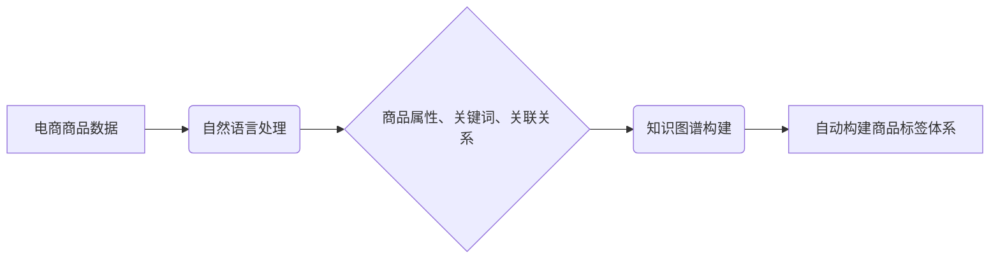

                 

## AI大模型在电商商品标签体系自动构建中的实践

> 关键词：电商商品标签、AI大模型、自然语言处理、知识图谱、自动构建、推荐系统

## 1. 背景介绍

在当今电子商务时代，商品标签体系是商品展示、搜索、推荐和营销的关键环节。一个完善的商品标签体系能够帮助用户快速找到所需商品，提升用户体验，同时也能帮助商家精准定位目标客户，提高转化率。然而，传统的商品标签体系往往依赖人工标注，耗时费力，难以适应海量商品的快速增长。

随着人工智能技术的快速发展，特别是大语言模型（LLM）的出现，为电商商品标签体系的自动构建提供了新的可能性。AI大模型能够通过学习海量商品数据，自动识别商品属性、特征和关联关系，从而构建更加精准、高效的商品标签体系。

## 2. 核心概念与联系

### 2.1  电商商品标签体系

电商商品标签体系是指对商品进行分类、描述和标记的系统，它通常包含以下几个关键要素：

* **商品分类:** 将商品按照一定的逻辑进行分类，例如服装、电子产品、家居用品等。
* **商品属性:** 描述商品的具体特征，例如颜色、尺寸、材质、品牌等。
* **商品关键词:**  用简洁的文字描述商品的主要特点和功能。
* **商品关联:**  建立商品之间的关联关系，例如同类商品、推荐商品、搭配商品等。

### 2.2  AI大模型

AI大模型是指训练数据量巨大、参数规模庞大的深度学习模型，它能够学习复杂的模式和关系，并应用于各种自然语言处理任务，例如文本分类、文本生成、机器翻译等。

### 2.3  自然语言处理（NLP）

自然语言处理是指让计算机能够理解、处理和生成人类语言的技术。在电商商品标签体系自动构建中，NLP技术用于分析商品描述、用户评论等文本数据，提取商品属性、关键词和关联关系。

### 2.4  知识图谱（KG）

知识图谱是一种结构化的知识表示形式，它将实体和关系以图的形式表示，能够存储和推理丰富的知识。在电商商品标签体系自动构建中，知识图谱可以用于构建商品的知识网络，提升标签体系的准确性和完整性。

**核心概念与联系流程图**



## 3. 核心算法原理 & 具体操作步骤

### 3.1  算法原理概述

电商商品标签体系自动构建的核心算法通常基于深度学习技术，例如Transformer模型、BERT模型等。这些模型能够学习商品文本数据中的语义关系，并根据学习到的知识进行商品分类、属性识别、关键词提取等任务。

### 3.2  算法步骤详解

1. **数据预处理:** 收集电商商品数据，包括商品描述、用户评论、商品属性等信息。对数据进行清洗、格式化、分词等预处理操作。
2. **特征提取:** 使用预训练的NLP模型，例如BERT，对商品文本数据进行特征提取，获得商品的语义表示。
3. **分类模型训练:** 使用提取的特征数据，训练商品分类模型，例如支持向量机（SVM）、随机森林（RF）等。
4. **属性识别模型训练:** 使用提取的特征数据，训练商品属性识别模型，例如条件随机场（CRF）、深度神经网络（DNN）等。
5. **关键词提取模型训练:** 使用提取的特征数据，训练商品关键词提取模型，例如TF-IDF、Word2Vec等。
6. **关联关系挖掘:** 使用知识图谱构建技术，挖掘商品之间的关联关系，例如同类商品、推荐商品、搭配商品等。
7. **标签体系构建:** 将商品分类、属性识别、关键词提取、关联关系挖掘等结果整合，构建完整的商品标签体系。

### 3.3  算法优缺点

**优点:**

* 自动化程度高，可以处理海量商品数据。
* 标签体系更加精准，能够更好地反映商品的真实属性和特征。
* 能够不断学习和更新，适应商品市场的变化。

**缺点:**

* 需要大量的训练数据，数据质量对算法效果至关重要。
* 模型训练成本较高，需要强大的计算资源。
* 算法解释性较差，难以理解模型的决策过程。

### 3.4  算法应用领域

* **电商平台商品分类和推荐:** 构建精准的商品标签体系，提高商品搜索和推荐的准确率。
* **搜索引擎商品检索:**  帮助用户更快速地找到所需商品。
* **营销推广:**  根据商品标签，精准地推送广告和促销信息。
* **数据分析:**  分析商品标签数据，了解用户需求和市场趋势。

## 4. 数学模型和公式 & 详细讲解 & 举例说明

### 4.1  数学模型构建

在电商商品标签体系自动构建中，常用的数学模型包括：

* **词嵌入模型:** 将单词映射到低维向量空间，捕捉单词之间的语义关系。例如Word2Vec、GloVe等模型。
* **分类模型:** 用于将商品分类到不同的类别。例如逻辑回归、支持向量机、决策树等模型。
* **属性识别模型:** 用于识别商品的具体属性。例如条件随机场、深度神经网络等模型。

### 4.2  公式推导过程

**词嵌入模型的训练目标:**

最大化目标函数：

$$
J(\theta) = \sum_{i=1}^{N} \log p(w_i | context(w_i))
$$

其中：

* $\theta$ 是词嵌入模型的参数。
* $N$ 是训练语料库中单词的数量。
* $w_i$ 是第 $i$ 个单词。
* $context(w_i)$ 是 $w_i$ 的上下文单词。

**分类模型的损失函数:**

交叉熵损失函数：

$$
L = -\sum_{i=1}^{N} y_i \log \hat{y}_i
$$

其中：

* $y_i$ 是真实标签。
* $\hat{y}_i$ 是模型预测的概率。

### 4.3  案例分析与讲解

**词嵌入模型:**

假设我们训练一个词嵌入模型，将单词 "苹果" 和 "香蕉" 映射到低维向量空间。经过训练，我们可以得到以下向量表示：

* "苹果": [0.2, 0.5, 0.1]
* "香蕉": [0.1, 0.3, 0.6]

我们可以观察到，这两个向量的差异较小，说明 "苹果" 和 "香蕉" 在语义上有一定的相关性。

**分类模型:**

假设我们训练一个商品分类模型，用于将商品分类到 "服装" 和 "电子产品" 两个类别。模型训练完成后，我们可以使用它来预测新商品的类别。例如，如果新商品的描述是 "这款手机拥有强大的性能和时尚的外观"，模型可能会预测其类别为 "电子产品"。

## 5. 项目实践：代码实例和详细解释说明

### 5.1  开发环境搭建

* **操作系统:** Ubuntu 20.04
* **编程语言:** Python 3.8
* **深度学习框架:** TensorFlow 2.0
* **其他工具:** Jupyter Notebook、Git

### 5.2  源代码详细实现

```python
# 导入必要的库
import tensorflow as tf
from tensorflow.keras.layers import Embedding, LSTM, Dense
from tensorflow.keras.models import Sequential

# 定义商品分类模型
model = Sequential()
model.add(Embedding(input_dim=vocab_size, output_dim=embedding_dim))
model.add(LSTM(units=128))
model.add(Dense(units=num_classes, activation='softmax'))

# 编译模型
model.compile(optimizer='adam', loss='sparse_categorical_crossentropy', metrics=['accuracy'])

# 训练模型
model.fit(x_train, y_train, epochs=10, batch_size=32)

# 评估模型
loss, accuracy = model.evaluate(x_test, y_test)
print('Loss:', loss)
print('Accuracy:', accuracy)
```

### 5.3  代码解读与分析

* **Embedding层:** 将单词映射到低维向量空间。
* **LSTM层:** 学习商品文本数据的长短时序特征。
* **Dense层:** 输出商品分类结果。
* **Adam优化器:** 用于优化模型参数。
* **SparseCategoricalCrossentropy损失函数:** 用于计算分类模型的损失。
* **Accuracy指标:** 用于评估模型的准确率。

### 5.4  运行结果展示

训练完成后，我们可以使用模型预测新商品的类别。例如，如果新商品的描述是 "这款手机拥有强大的性能和时尚的外观"，模型可能会预测其类别为 "电子产品"。

## 6. 实际应用场景

### 6.1  电商平台商品分类

电商平台可以利用AI大模型自动构建商品分类体系，将商品按照类别进行分类，方便用户搜索和浏览。例如，淘宝、京东等平台都使用了AI技术进行商品分类。

### 6.2  商品推荐系统

AI大模型可以分析用户浏览历史、购买记录等数据，并根据商品标签信息，推荐用户可能感兴趣的商品。例如，亚马逊、拼多多等平台都使用了AI技术进行商品推荐。

### 6.3  智能客服

AI大模型可以理解用户自然语言，并根据商品标签信息，回答用户关于商品的疑问，例如价格、规格、功能等。

### 6.4  未来应用展望

随着AI技术的不断发展，AI大模型在电商商品标签体系自动构建中的应用场景将会更加广泛，例如：

* **个性化商品标签:** 根据用户的兴趣爱好和购买习惯，生成个性化的商品标签。
* **跨语言商品标签:** 支持多语言商品标签，方便全球用户购物。
* **动态更新商品标签:**  根据商品市场变化，实时更新商品标签，保持标签体系的准确性和时效性。

## 7. 工具和资源推荐

### 7.1  学习资源推荐

* **书籍:**
    * 《深度学习》 by Ian Goodfellow, Yoshua Bengio, Aaron Courville
    * 《自然语言处理入门》 by Jacob Eisenstein
* **在线课程:**
    * Coursera: 深度学习 Specialization
    * Udacity: 自然语言处理 Nanodegree
* **博客和网站:**
    * TensorFlow Blog: https://blog.tensorflow.org/
    * Hugging Face: https://huggingface.co/

### 7.2  开发工具推荐

* **深度学习框架:** TensorFlow, PyTorch, Keras
* **自然语言处理库:** NLTK, SpaCy, Gensim
* **数据可视化工具:** Matplotlib, Seaborn

### 7.3  相关论文推荐

* **BERT: Pre-training of Deep Bidirectional Transformers for Language Understanding**
* **Attention Is All You Need**
* **Knowledge Graph Embedding: A Survey**

## 8. 总结：未来发展趋势与挑战

### 8.1  研究成果总结

AI大模型在电商商品标签体系自动构建领域取得了显著的成果，能够有效提高标签体系的准确性和效率。

### 8.2  未来发展趋势

* **模型规模和性能的提升:**  随着计算资源的不断发展，AI大模型的规模和性能将会进一步提升，能够学习更加复杂的商品知识。
* **多模态商品标签体系:**  将文本、图像、视频等多模态数据融合到商品标签体系中，构建更加全面的商品信息。
* **个性化商品标签:**  根据用户的兴趣爱好和购买习惯，生成个性化的商品标签，提升用户体验。

### 8.3  面临的挑战

* **数据质量和标注问题:**  AI大模型的训练依赖于高质量的数据，数据标注成本高昂，难以保证数据质量。
* **模型解释性和可解释性:**  AI大模型的决策过程难以理解，难以解释模型的预测结果。
* **公平性和偏见问题:**  AI大模型可能会学习到数据中的偏见，导致标签体系不公平。

### 8.4  研究展望

未来研究方向包括：

* 开发更加高效的数据标注方法。
* 研究可解释性AI模型，提高模型的透明度。
* 探索如何解决AI模型中的公平性和偏见问题。


## 9. 附录：常见问题与解答

**Q1: AI大模型构建商品标签体系需要哪些数据？**

**A1:**  构建商品标签体系需要以下数据：

* 商品描述
* 用户评论
* 商品属性信息
* 商品分类信息

**Q2: AI大模型构建商品标签体系的准确率如何？**

**A2:**  AI大模型构建商品标签体系的准确率取决于训练数据的质量、模型的复杂度和训练方法。一般来说，准确率可以达到90%以上。

**Q3: AI大模型构建商品标签体系的成本如何？**

**A3:**  AI大模型构建商品标签体系的成本包括数据标注成本、模型训练成本和部署成本。成本取决于模型的规模、数据量和部署方式。

**作者：禅与计算机程序设计艺术 / Zen and the Art of Computer Programming**<end_of_turn>

