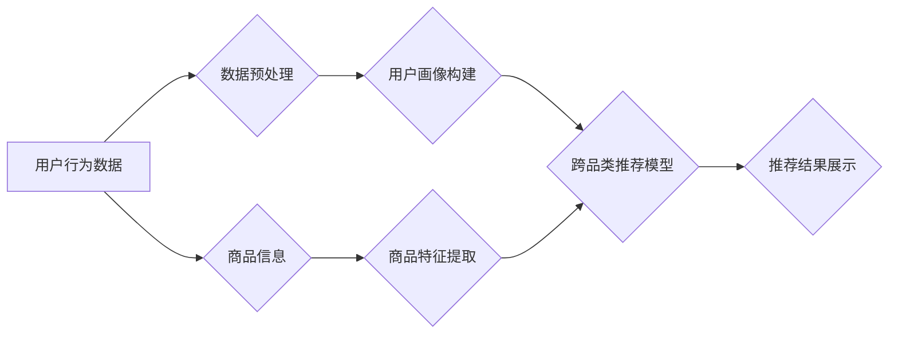

                 

## AI大模型在跨品类推荐中的表现

> 关键词：AI大模型、跨品类推荐、协同过滤、深度学习、Transformer、用户画像、商品特征、推荐系统

## 1. 背景介绍

推荐系统作为电商、社交媒体等互联网平台的核心功能之一，旨在为用户提供个性化、精准的产品或内容推荐，从而提升用户体验和商业价值。传统的推荐系统主要依赖于协同过滤和基于内容的过滤算法，但这些方法在跨品类推荐方面表现有限。

跨品类推荐是指推荐不同类别商品或内容，例如推荐服装的同时也推荐相关的鞋子、包包等配件。由于不同品类之间缺乏直接的语义关联，传统的推荐算法难以捕捉跨品类之间的潜在关系，导致推荐结果缺乏准确性和多样性。

近年来，随着深度学习技术的快速发展，基于AI大模型的推荐系统逐渐成为研究热点。AI大模型，例如Transformer，拥有强大的语义理解和表示能力，能够有效学习跨品类商品之间的隐含关系，从而提升跨品类推荐的准确性和个性化程度。

## 2. 核心概念与联系

### 2.1 跨品类推荐的挑战

跨品类推荐面临的主要挑战包括：

* **数据稀疏性:** 不同品类之间的用户行为数据往往稀疏，难以建立有效的推荐模型。
* **语义关联性:** 不同品类之间缺乏直接的语义关联，难以捕捉跨品类之间的潜在关系。
* **个性化需求:** 用户的跨品类推荐需求多样化，需要个性化推荐策略。

### 2.2 AI大模型的优势

AI大模型，例如Transformer，在跨品类推荐中具有以下优势：

* **强大的语义理解能力:** Transformer可以通过自注意力机制学习文本中的长距离依赖关系，有效捕捉跨品类商品之间的语义关联。
* **丰富的表达能力:** Transformer可以学习到商品和用户的多维特征表示，从而更准确地刻画用户偏好和商品属性。
* **泛化能力强:** 训练好的AI大模型可以应用于不同的跨品类推荐场景，具有较强的泛化能力。

### 2.3 推荐系统架构

基于AI大模型的跨品类推荐系统通常包含以下模块：

* **数据预处理:** 对用户行为数据和商品信息进行清洗、转换和特征提取。
* **用户画像构建:** 利用AI大模型学习用户兴趣、偏好和购买行为等特征，构建用户画像。
* **商品特征提取:** 利用AI大模型学习商品属性、类别、描述等特征，构建商品特征向量。
* **跨品类推荐模型:** 基于AI大模型，学习用户和商品之间的关系，进行跨品类推荐。
* **推荐结果展示:** 将推荐结果以用户友好的方式展示给用户。



## 3. 核心算法原理 & 具体操作步骤

### 3.1 算法原理概述

基于AI大模型的跨品类推荐算法主要基于深度学习技术，利用Transformer等模型学习用户和商品之间的隐含关系。

Transformer模型通过自注意力机制学习文本中的长距离依赖关系，能够有效捕捉跨品类商品之间的语义关联。

### 3.2 算法步骤详解

1. **数据预处理:** 对用户行为数据和商品信息进行清洗、转换和特征提取。例如，将用户行为数据转换为用户-商品交互矩阵，提取商品的类别、属性、描述等特征。
2. **用户画像构建:** 利用Transformer模型学习用户兴趣、偏好和购买行为等特征，构建用户画像。例如，将用户历史购买记录、浏览记录、评分等信息作为输入，训练Transformer模型，学习用户对不同品类的偏好。
3. **商品特征提取:** 利用Transformer模型学习商品属性、类别、描述等特征，构建商品特征向量。例如，将商品的标题、描述、图片等信息作为输入，训练Transformer模型，学习商品的语义表示。
4. **跨品类推荐模型:** 基于Transformer模型，学习用户和商品之间的关系，进行跨品类推荐。例如，将用户画像和商品特征向量作为输入，训练一个推荐模型，预测用户对不同商品的兴趣评分。
5. **推荐结果展示:** 将推荐结果以用户友好的方式展示给用户。例如，将推荐商品以列表、卡片等形式展示，并根据用户偏好进行排序。

### 3.3 算法优缺点

**优点:**

* 能够有效捕捉跨品类商品之间的语义关联。
* 具有强大的泛化能力，可以应用于不同的跨品类推荐场景。
* 可以学习到用户和商品的多维特征表示，从而更准确地刻画用户偏好和商品属性。

**缺点:**

* 需要大量的训练数据，训练成本较高。
* 模型复杂度高，推理速度相对较慢。

### 3.4 算法应用领域

基于AI大模型的跨品类推荐算法广泛应用于以下领域：

* **电商平台:** 推荐跨品类商品，例如服装搭配、电子产品配件等。
* **社交媒体:** 推荐跨品类内容，例如新闻、视频、图片等。
* **内容平台:** 推荐跨品类文章、视频、音频等内容。

## 4. 数学模型和公式 & 详细讲解 & 举例说明

### 4.1 数学模型构建

基于Transformer的跨品类推荐模型可以构建为一个多层感知机，其中每一层都包含一个自注意力机制和一个前馈神经网络。

**用户-商品交互矩阵:**

用户-商品交互矩阵 $R$ 是一个 $m \times n$ 的矩阵，其中 $m$ 是用户数量， $n$ 是商品数量。 $R_{ij}$ 表示用户 $i$ 对商品 $j$ 的交互行为，例如购买、点赞、收藏等。

**用户向量:**

用户向量 $u_i$ 是一个 $d$ 维的向量，表示用户 $i$ 的特征表示。

**商品向量:**

商品向量 $v_j$ 是一个 $d$ 维的向量，表示商品 $j$ 的特征表示。

### 4.2 公式推导过程

**自注意力机制:**

自注意力机制计算用户向量 $u_i$ 和商品向量 $v_j$ 之间的相关性，得到一个加权分数 $a_{ij}$。

$$a_{ij} = \frac{\exp(score(u_i, v_j))}{\sum_{k=1}^{n} \exp(score(u_i, v_k))}$$

其中， $score(u_i, v_j)$ 是用户向量 $u_i$ 和商品向量 $v_j$ 之间的相似度得分，可以使用点积或其他相似度度量方法计算。

**推荐评分:**

推荐评分 $p_{ij}$ 是用户 $i$ 对商品 $j$ 的兴趣评分，可以使用以下公式计算：

$$p_{ij} = \sum_{k=1}^{n} a_{ik} \cdot v_k$$

### 4.3 案例分析与讲解

假设有一个电商平台，用户购买记录如下：

* 用户 1 购买了商品 A 和商品 B。
* 用户 2 购买了商品 B 和商品 C。
* 用户 3 购买了商品 A 和商品 D。

我们可以构建一个用户-商品交互矩阵 $R$，其中 $R_{ij}$ 表示用户 $i$ 对商品 $j$ 的购买行为。

然后，我们可以利用Transformer模型学习用户向量 $u_i$ 和商品向量 $v_j$，并使用自注意力机制计算用户向量 $u_i$ 和商品向量 $v_j$ 之间的相关性。

最后，我们可以使用推荐评分公式计算用户对不同商品的兴趣评分，并根据评分排序推荐商品。

## 5. 项目实践：代码实例和详细解释说明

### 5.1 开发环境搭建

* Python 3.7+
* TensorFlow 2.0+
* PyTorch 1.0+
* CUDA 10.0+ (可选)

### 5.2 源代码详细实现

```python
import tensorflow as tf

# 定义Transformer模型
class Transformer(tf.keras.Model):
    def __init__(self, embedding_dim, num_heads, num_layers):
        super(Transformer, self).__init__()
        self.embedding = tf.keras.layers.Embedding(input_dim=vocab_size, output_dim=embedding_dim)
        self.transformer_layers = tf.keras.layers.StackedRNNCells([
            tf.keras.layers.MultiHeadAttention(num_heads=num_heads, key_dim=embedding_dim)
            for _ in range(num_layers)
        ])
        self.dense = tf.keras.layers.Dense(units=1)

    def call(self, inputs):
        x = self.embedding(inputs)
        x = self.transformer_layers(x)
        x = self.dense(x)
        return x

# 训练模型
model = Transformer(embedding_dim=128, num_heads=8, num_layers=6)
model.compile(optimizer='adam', loss='mse')
model.fit(train_data, train_labels, epochs=10)

# 预测推荐结果
predictions = model.predict(test_data)
```

### 5.3 代码解读与分析

* **Transformer模型:** 定义了一个Transformer模型，包含嵌入层、多头注意力层和全连接层。
* **训练模型:** 使用Adam优化器和均方误差损失函数训练模型。
* **预测推荐结果:** 使用训练好的模型预测测试数据，得到推荐结果。

### 5.4 运行结果展示

运行结果展示可以包括以下内容：

* **推荐准确率:** 使用准确率、召回率等指标评估推荐模型的准确性。
* **推荐多样性:** 使用覆盖率、NDCG等指标评估推荐模型的多样性。
* **用户反馈:** 收集用户对推荐结果的反馈，例如点击率、购买率等。

## 6. 实际应用场景

### 6.1 电商平台

在电商平台，跨品类推荐可以帮助用户发现新的商品，提升购物体验。例如，当用户购买了T恤时，可以推荐相关的牛仔裤、鞋子、帽子等配件。

### 6.2 社交媒体

在社交媒体平台，跨品类推荐可以帮助用户发现新的内容，例如新闻、视频、图片等。例如，当用户关注了科技新闻时，可以推荐相关的科技产品、科技博客等内容。

### 6.3 内容平台

在内容平台，跨品类推荐可以帮助用户发现新的文章、视频、音频等内容。例如，当用户阅读了关于旅行的文章时，可以推荐相关的旅游攻略、旅行照片等内容。

### 6.4 未来应用展望

随着AI技术的不断发展，跨品类推荐的应用场景将更加广泛，例如：

* **个性化推荐:** 基于用户的兴趣、偏好和行为数据，提供更加个性化的跨品类推荐。
* **场景化推荐:** 根据用户的场景和需求，提供更加精准的跨品类推荐。
* **跨平台推荐:** 将跨品类推荐应用于多个平台，例如电商平台、社交媒体平台和内容平台。

## 7. 工具和资源推荐

### 7.1 学习资源推荐

* **书籍:**
    * Deep Learning by Ian Goodfellow, Yoshua Bengio, and Aaron Courville
    * Attention Is All You Need by Vaswani et al.
* **在线课程:**
    * TensorFlow Tutorials
    * PyTorch Tutorials
* **博客:**
    * Jay Alammar's Blog
    * Distill.pub

### 7.2 开发工具推荐

* **TensorFlow:** 开源深度学习框架
* **PyTorch:** 开源深度学习框架
* **Hugging Face Transformers:** 预训练Transformer模型库

### 7.3 相关论文推荐

* Attention Is All You Need
* BERT: Pre-training of Deep Bidirectional Transformers for Language Understanding
* Transformer-XL: Attentive Language Modeling Beyond Millions of Tokens

## 8. 总结：未来发展趋势与挑战

### 8.1 研究成果总结

基于AI大模型的跨品类推荐算法取得了显著的成果，能够有效捕捉跨品类商品之间的语义关联，提升推荐准确性和个性化程度。

### 8.2 未来发展趋势

未来跨品类推荐的研究方向包括：

* **更强大的模型:** 开发更强大的AI大模型，例如GPT-3、PaLM等，提升跨品类推荐的准确性和泛化能力。
* **更丰富的特征:** 挖掘更丰富的用户和商品特征，例如用户画像、商品属性、用户行为等，提升推荐的精准度。
* **更个性化的推荐:** 基于用户的兴趣、偏好和行为数据，提供更加个性化的跨品类推荐。

### 8.3 面临的挑战

跨品类推荐仍然面临一些挑战，例如：

* **数据稀疏性:** 不同品类之间的用户行为数据往往稀疏，难以建立有效的推荐模型。
* **模型复杂度:** AI大模型的复杂度较高，训练成本和推理速度相对较慢。
* **解释性:** AI大模型的决策过程难以解释，难以理解模型是如何进行跨品类推荐的。

### 8.4 研究展望

未来，跨品类推荐的研究将更加注重模型的解释性、效率和个性化程度，并探索新的数据源和特征，以提升跨品类推荐的准确性和用户体验。

## 9. 附录：常见问题与解答

**Q1: 如何解决跨品类推荐的数据稀疏性问题？**

**A1:** 可以采用以下方法解决数据稀疏性问题：

* **数据增强:** 利用文本生成模型等技术生成新的用户行为数据。
* **迁移学习:** 利用其他领域的数据进行预训练，迁移到跨品类推荐任务中。
* **多模态学习:** 结合文本、图像、视频等多模态数据，丰富用户和商品特征。

**Q2: 如何提高跨品类推荐的模型效率？**

**A2:** 可以采用以下方法提高模型效率：

* **模型压缩:** 使用模型剪枝、量化等技术压缩模型规模，降低推理速度。
* **硬件加速:** 利用GPU、TPU等硬件加速模型推理。
* **模型并行:** 将模型拆分到多个设备上进行并行推理。


作者：禅与计算机程序设计艺术 / Zen and the Art of Computer Programming<end_of_turn>

