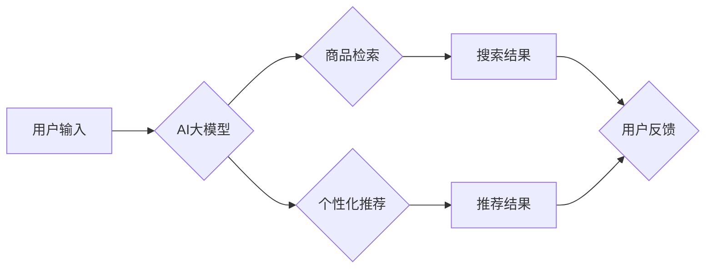

                 

## AI大模型赋能电商搜索推荐的业务创新思维培训平台搭建方案

> 关键词：AI大模型、电商搜索、推荐系统、业务创新、培训平台、深度学习、自然语言处理

## 1. 背景介绍

随着电商行业的快速发展，用户对商品搜索和推荐的需求日益增长。传统的基于关键词匹配和规则引擎的搜索推荐系统已经难以满足用户个性化、精准化的需求。而近年来，深度学习技术的发展为电商搜索推荐带来了新的机遇。

AI大模型，特别是基于Transformer架构的大语言模型（LLM），凭借其强大的语义理解和文本生成能力，在电商搜索推荐领域展现出巨大的潜力。例如，LLM可以理解用户搜索意图，生成更精准的商品推荐，并进行个性化内容创作，提升用户体验。

然而，将AI大模型应用于电商搜索推荐并非易事。需要对模型的原理、算法、数据以及应用场景有深入的理解。同时，还需要考虑模型的部署、维护和安全等问题。

为了帮助电商企业更好地理解和应用AI大模型，我们设计了“AI大模型赋能电商搜索推荐的业务创新思维培训平台”。该平台旨在通过理论讲解、案例分析、实践操作等多种形式，帮助学员掌握AI大模型在电商搜索推荐领域的应用知识和技能。

## 2. 核心概念与联系

### 2.1  电商搜索推荐系统

电商搜索推荐系统是电商平台的核心功能之一，旨在帮助用户快速找到所需商品，并提供个性化的商品推荐。传统的电商搜索推荐系统主要基于以下技术：

* **关键词匹配:** 根据用户输入的关键词，从商品数据库中匹配出相关的商品。
* **规则引擎:** 基于预设的规则，对商品进行排序和推荐。
* **协同过滤:** 根据用户的历史购买行为和相似用户的购买行为，推荐用户可能感兴趣的商品。
* **内容过滤:** 根据商品的属性和描述，推荐与用户兴趣相符的商品。

### 2.2  AI大模型

AI大模型是指在海量数据上训练的深度学习模型，具有强大的泛化能力和学习能力。常见的AI大模型包括：

* **自然语言处理模型:** 例如BERT、GPT-3等，能够理解和生成自然语言文本。
* **计算机视觉模型:** 例如ResNet、YOLO等，能够识别和理解图像和视频。
* **推荐系统模型:** 例如Transformer-based推荐模型，能够学习用户和商品之间的复杂关系，进行精准的商品推荐。

### 2.3  AI大模型赋能电商搜索推荐

AI大模型可以对电商搜索推荐系统进行全面升级，提升其精准度、个性化程度和用户体验。

* **语义理解:** AI大模型可以理解用户搜索意图，即使用户输入的关键词不完全准确，也能找到相关的商品。
* **个性化推荐:** AI大模型可以根据用户的历史购买行为、浏览记录、兴趣偏好等信息，提供个性化的商品推荐。
* **内容创作:** AI大模型可以生成商品描述、促销文案、用户评论等内容，提升商品的吸引力和用户体验。

**核心架构图:**



## 3. 核心算法原理 & 具体操作步骤

### 3.1  算法原理概述

AI大模型在电商搜索推荐中的应用主要基于以下核心算法：

* **Transformer模型:** Transformer模型是一种基于注意力机制的深度学习模型，能够有效地捕捉文本序列中的长距离依赖关系，在自然语言处理任务中表现出色。
* **BERT模型:** BERT（Bidirectional Encoder Representations from Transformers）是一种预训练的Transformer模型，通过双向语言建模，学习了丰富的语义信息，能够理解用户搜索意图和商品描述。
* **推荐系统算法:** 

例如协同过滤、内容过滤、深度学习推荐算法等，可以根据用户的历史行为和商品特征，预测用户对商品的兴趣。

### 3.2  算法步骤详解

**1. 数据预处理:**

收集用户搜索历史、商品信息、购买行为等数据，进行清洗、格式化和特征提取。

**2. 模型训练:**

使用预训练的BERT模型或训练自定义的Transformer模型，对数据进行训练，学习用户和商品之间的关系。

**3. 模型评估:**

使用测试数据评估模型的性能，例如准确率、召回率、点击率等指标。

**4. 模型部署:**

将训练好的模型部署到电商平台，用于实时搜索和推荐。

**5. 模型监控和优化:**

持续监控模型的性能，根据用户反馈和数据变化进行模型优化。

### 3.3  算法优缺点

**优点:**

* **精准度高:** AI大模型能够理解用户搜索意图，提供更精准的商品推荐。
* **个性化程度高:** AI大模型可以根据用户的历史行为和兴趣偏好，提供个性化的商品推荐。
* **用户体验提升:** AI大模型可以生成更吸引人的商品描述和促销文案，提升用户体验。

**缺点:**

* **数据依赖性强:** AI大模型需要海量数据进行训练，数据质量直接影响模型性能。
* **计算资源消耗大:** 训练和部署AI大模型需要大量的计算资源。
* **可解释性差:** AI大模型的决策过程较为复杂，难以解释其推荐结果。

### 3.4  算法应用领域

* **电商搜索:** 提升商品搜索的精准度和用户体验。
* **商品推荐:** 提供个性化的商品推荐，提升用户转化率。
* **内容创作:** 生成商品描述、促销文案、用户评论等内容。
* **客户服务:** 自动回复用户咨询，提升客户服务效率。

## 4. 数学模型和公式 & 详细讲解 & 举例说明

### 4.1  数学模型构建

在电商搜索推荐系统中，常用的数学模型包括：

* **协同过滤模型:** 基于用户的历史行为和相似用户的行为，预测用户对商品的兴趣。

例如，基于用户的协同过滤模型可以使用以下公式计算用户对商品的评分预测:

$$
\hat{r}_{u,i} = \bar{r}_u + \frac{\sum_{v \in N(u)} (r_{v,i} - \bar{r}_v) \cdot sim(u,v)}{\sum_{v \in N(u)} sim(u,v)}
$$

其中:

* $\hat{r}_{u,i}$: 用户u对商品i的评分预测
* $\bar{r}_u$: 用户u的平均评分
* $r_{v,i}$: 用户v对商品i的真实评分
* $N(u)$: 用户u的邻居用户集合
* $sim(u,v)$: 用户u和用户v之间的相似度

* **内容过滤模型:** 基于商品的属性和描述，预测用户对商品的兴趣。

例如，可以使用向量空间模型计算商品和用户的相似度，并根据相似度进行推荐。

### 4.2  公式推导过程

**协同过滤模型的公式推导:**

协同过滤模型的基本思想是，如果用户u和用户v对相似的商品有相似的评分，那么用户u也可能喜欢用户v喜欢的商品。

为了计算用户u对商品i的评分预测，我们可以使用以下公式:

$$
\hat{r}_{u,i} = \bar{r}_u + \frac{\sum_{v \in N(u)} (r_{v,i} - \bar{r}_v) \cdot sim(u,v)}{\sum_{v \in N(u)} sim(u,v)}
$$

其中:

* $\hat{r}_{u,i}$: 用户u对商品i的评分预测
* $\bar{r}_u$: 用户u的平均评分
* $r_{v,i}$: 用户v对商品i的真实评分
* $N(u)$: 用户u的邻居用户集合
* $sim(u,v)$: 用户u和用户v之间的相似度

### 4.3  案例分析与讲解

**案例:**

假设有一个电商平台，用户A和用户B都购买了电影类型的商品，并且对电影类型的商品评分较高。如果用户A搜索了“科幻电影”，那么根据协同过滤模型，我们可以预测用户A也可能喜欢科幻电影类型的商品，并推荐给用户A。

**解释:**

在这个案例中，用户A和用户B是邻居用户，因为他们都购买了电影类型的商品。用户A和用户B对电影类型的商品评分较高，说明他们对电影类型的商品有共同的兴趣。因此，我们可以预测用户A也可能喜欢科幻电影类型的商品。

## 5. 项目实践：代码实例和详细解释说明

### 5.1  开发环境搭建

* **操作系统:** Linux/macOS
* **编程语言:** Python
* **深度学习框架:** TensorFlow/PyTorch
* **数据处理工具:** Pandas/NumPy
* **版本管理工具:** Git

### 5.2  源代码详细实现

```python
# 导入必要的库
import tensorflow as tf
from tensorflow.keras.layers import Embedding, Dense, Flatten
from tensorflow.keras.models import Sequential

# 定义模型
model = Sequential()
model.add(Embedding(input_dim=vocab_size, output_dim=embedding_dim))
model.add(Flatten())
model.add(Dense(units=num_units, activation='relu'))
model.add(Dense(units=num_classes, activation='softmax'))

# 编译模型
model.compile(optimizer='adam', loss='sparse_categorical_crossentropy', metrics=['accuracy'])

# 训练模型
model.fit(x_train, y_train, epochs=epochs, batch_size=batch_size)

# 评估模型
loss, accuracy = model.evaluate(x_test, y_test)
print('Loss:', loss)
print('Accuracy:', accuracy)
```

### 5.3  代码解读与分析

* **Embedding层:** 将用户和商品的ID转换为稠密的向量表示，捕捉用户和商品之间的语义关系。
* **Flatten层:** 将多维向量转换为一维向量，方便后续的全连接层处理。
* **Dense层:** 全连接层，用于学习用户和商品之间的复杂关系。
* **Softmax层:** 输出层，将多维向量转换为概率分布，预测用户对商品的兴趣。

### 5.4  运行结果展示

训练完成后，可以将模型部署到电商平台，并根据用户的搜索行为和商品信息，进行实时搜索和推荐。

## 6. 实际应用场景

### 6.1  电商搜索场景

* **智能搜索:** 理解用户模糊的搜索意图，提供更精准的搜索结果。
* **个性化搜索:** 根据用户的历史行为和兴趣偏好，提供个性化的搜索结果。
* **搜索结果排序:** 根据用户的兴趣和商品的热度等因素，对搜索结果进行排序，提升用户体验。

### 6.2  商品推荐场景

* **个性化推荐:** 根据用户的历史购买行为、浏览记录、兴趣偏好等信息，推荐用户可能感兴趣的商品。
* **跨界推荐:** 基于用户的兴趣偏好，推荐跨界商品，拓展用户的消费范围。
* **新品推荐:** 推荐平台的新产品和热销商品，提升用户发现新商品的可能性。

### 6.3  内容创作场景

* **商品描述生成:** 根据商品的属性和特征，自动生成吸引人的商品描述。
* **促销文案创作:** 根据促销活动主题，自动生成吸引用户的促销文案。
* **用户评论生成:** 根据用户的购买体验，自动生成真实的商品评论。

### 6.4  未来应用展望

* **多模态推荐:** 将文本、图像、视频等多模态数据融合，提供更丰富的商品推荐。
* **实时推荐:** 基于用户的实时行为，提供更精准的实时推荐。
* **个性化营销:** 基于用户的兴趣偏好，进行个性化的营销推广。

## 7. 工具和资源推荐

### 7.1  学习资源推荐

* **书籍:**
    * 《深度学习》
    * 《自然语言处理》
    * 《推荐系统》
* **在线课程:**
    * Coursera
    * edX
    * Udacity
* **博客和论坛:**
    * TensorFlow博客
    * PyTorch博客
    * Kaggle论坛

### 7.2  开发工具推荐

* **深度学习框架:** TensorFlow, PyTorch
* **数据处理工具:** Pandas, NumPy
* **版本管理工具:** Git
* **云计算平台:** AWS, Azure, GCP

### 7.3  相关论文推荐

* **BERT:** Devlin, J., Chang, M. W., Lee, K., & Toutanova, K. (2018). BERT: Pre-training of deep bidirectional transformers for language understanding. arXiv preprint arXiv:1810.04805.
* **Transformer:** Vaswani, A., Shazeer, N., Parmar, N., Uszkoreit, J., Jones, L., Gomez, A. N., ... & Polosukhin, I. (2017). Attention is all you need. In Advances in neural information processing systems (pp. 5998-6008).

## 8. 总结：未来发展趋势与挑战

### 8.1  研究成果总结

AI大模型在电商搜索推荐领域取得了显著的成果，提升了搜索精准度、个性化程度和用户体验。

### 8.2  未来发展趋势

* **多模态融合:** 将文本、图像、视频等多模态数据融合，提供更丰富的商品推荐。
* **实时推荐:** 基于用户的实时行为，提供更精准的实时推荐。
* **个性化营销:** 基于用户的兴趣偏好，进行个性化的营销推广。
* **可解释性增强:** 提升AI模型的透明度和可解释性，帮助用户理解推荐结果。

### 8.3  面临的挑战

* **数据质量:** AI大模型需要海量高质量的数据进行训练，数据质量直接影响模型性能。
* **计算资源:** 训练和部署AI大模型需要大量的计算资源，成本较高。
* **模型安全:** AI模型可能存在安全风险，例如数据泄露、模型攻击等。

### 8.4  研究展望

未来，我们将继续研究AI大模型在电商搜索推荐领域的应用，探索更先进的算法、模型和应用场景，为电商企业提供更智能、更精准、更个性化的服务。

## 9. 附录：常见问题与解答

**1. 如何选择合适的AI大模型？**

选择合适的AI大模型需要根据具体的应用场景和数据特点进行选择。例如，对于文本分类任务，BERT模型表现出色；对于图像识别任务，ResNet模型效果较好。

**2. 如何解决数据质量问题？**

数据质量是AI模型训练的关键因素。可以采用以下方法解决数据质量问题：

* 数据清洗：去除数据中的噪声、重复数据和错误数据。
* 数据格式化：将数据转换为模型可以识别的格式。
* 数据增强：通过人工或自动的方式增加数据量和多样性。

**3. 如何降低模型训练成本？**

可以采用以下方法降低模型训练成本：

* 使用云计算平台进行训练，利用平台提供的计算资源和优化算法。
* 使用模型压缩技术，减少模型参数量，降低训练和部署成本。
* 使用预训练模型，减少模型训练时间和数据需求。


作者：禅与计算机程序设计艺术 / Zen and the Art of Computer Programming<end_of_turn>

