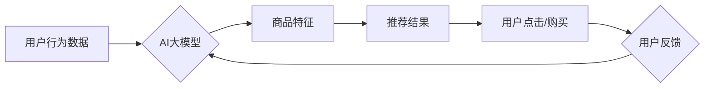

                 

## AI大模型：改善电商平台长尾商品曝光与转化的新思路

> 关键词：电商平台、长尾商品、AI大模型、推荐系统、自然语言处理、转化率优化、深度学习

## 1. 背景介绍

电商平台的商品种类繁多，其中长尾商品占据着重要的市场份额。长尾商品是指销量相对较低的商品，由于其数量众多，往往面临着曝光度低、转化率低的困境。传统的电商推荐系统主要基于用户行为数据和商品特征，难以有效挖掘长尾商品的潜在价值。

近年来，随着深度学习技术的快速发展，AI大模型在自然语言处理、图像识别等领域取得了突破性进展。其强大的学习能力和泛化能力为解决长尾商品问题提供了新的思路。

## 2. 核心概念与联系

### 2.1 AI大模型

AI大模型是指在海量数据上训练的深度学习模型，其参数规模庞大，具备强大的泛化能力和学习能力。常见的AI大模型包括GPT-3、BERT、LaMDA等。

### 2.2 长尾商品

长尾商品是指在电商平台上销量相对较低的商品，通常数量众多，但整体贡献不容忽视。

### 2.3 推荐系统

推荐系统是根据用户的历史行为、偏好和商品信息，预测用户对商品的兴趣并推荐相关商品的算法系统。

**核心概念与联系流程图:**



## 3. 核心算法原理 & 具体操作步骤

### 3.1 算法原理概述

本文提出了一种基于AI大模型的电商平台长尾商品推荐算法，该算法主要利用AI大模型的强大的文本理解和生成能力，从多方面挖掘长尾商品的潜在价值。

具体来说，该算法首先利用自然语言处理技术对商品描述、用户评论等文本数据进行分析，提取商品的关键词、语义特征等信息。然后，将这些信息与用户的历史行为数据、偏好信息等进行融合，训练AI大模型，构建商品推荐模型。

### 3.2 算法步骤详解

1. **数据预处理:** 收集电商平台上的商品描述、用户评论、用户行为数据等，进行清洗、去噪、格式化等预处理工作。
2. **特征提取:** 利用自然语言处理技术，对商品描述、用户评论等文本数据进行分析，提取商品的关键词、语义特征、情感倾向等信息。
3. **模型训练:** 将提取的商品特征、用户行为数据等信息作为训练数据，训练AI大模型，构建商品推荐模型。
4. **推荐结果生成:** 根据用户的历史行为数据、偏好信息等，利用训练好的模型，预测用户对长尾商品的兴趣，生成推荐结果。
5. **结果评估:** 通过A/B测试等方法，评估推荐算法的性能，并根据评估结果进行模型优化和调整。

### 3.3 算法优缺点

**优点:**

* 能够有效挖掘长尾商品的潜在价值，提升长尾商品的曝光度和转化率。
* 能够根据用户的个性化需求，提供更精准的商品推荐。
* 能够不断学习和进化，随着数据量的增加，推荐效果会不断提升。

**缺点:**

* 需要大量的训练数据，数据质量对算法效果有重要影响。
* 模型训练和部署成本较高。
* 算法的解释性较差，难以理解模型是如何做出推荐的。

### 3.4 算法应用领域

该算法可以应用于电商平台、搜索引擎、内容推荐等领域，帮助用户发现更多符合自身需求的商品或内容。

## 4. 数学模型和公式 & 详细讲解 & 举例说明

### 4.1 数学模型构建

本文采用基于用户-商品交互矩阵的协同过滤模型，结合AI大模型的文本理解能力，构建长尾商品推荐模型。

用户-商品交互矩阵表示用户对商品的评分或购买行为，其中每个元素代表用户对商品的交互情况。

**用户-商品交互矩阵:**

$$
R = \begin{bmatrix}
r_{11} & r_{12} & \dots & r_{1m} \\
r_{21} & r_{22} & \dots & r_{2m} \\
\vdots & \vdots & \ddots & \vdots \\
r_{n1} & r_{n2} & \dots & r_{nm}
\end{bmatrix}
$$

其中，$r_{ij}$表示用户$i$对商品$j$的交互情况，例如评分或购买行为。

### 4.2 公式推导过程

基于用户-商品交互矩阵，我们可以利用矩阵分解技术，将用户-商品交互矩阵分解成两个低维矩阵，分别表示用户的潜在特征和商品的潜在特征。

**用户潜在特征矩阵:**

$$
P = \begin{bmatrix}
p_{11} & p_{12} & \dots & p_{1k} \\
p_{21} & p_{22} & \dots & p_{2k} \\
\vdots & \vdots & \ddots & \vdots \\
p_{n1} & p_{n2} & \dots & p_{nk}
\end{bmatrix}
$$

**商品潜在特征矩阵:**

$$
Q = \begin{bmatrix}
q_{11} & q_{12} & \dots & q_{1k} \\
q_{21} & q_{22} & \dots & q_{2k} \\
\vdots & \vdots & \ddots & \vdots \\
q_{m1} & q_{m2} & \dots & q_{mk}
\end{bmatrix}
$$

其中，$k$是潜在特征的维度。

通过最小化用户-商品交互矩阵与潜在特征矩阵乘积的误差，可以得到用户潜在特征矩阵和商品潜在特征矩阵。

**误差函数:**

$$
Loss = \sum_{i=1}^{n} \sum_{j=1}^{m} (r_{ij} - \hat{r}_{ij})^2
$$

其中，$\hat{r}_{ij}$是预测的用户对商品$j$的交互情况。

### 4.3 案例分析与讲解

假设我们有一个电商平台，用户对商品的评分数据如下：

**用户-商品交互矩阵:**

$$
R = \begin{bmatrix}
5 & 3 & 4 \\
4 & 5 & 2 \\
3 & 2 & 5
\end{bmatrix}
$$

我们可以利用矩阵分解技术，将用户-商品交互矩阵分解成用户潜在特征矩阵和商品潜在特征矩阵。

假设我们得到以下用户潜在特征矩阵和商品潜在特征矩阵：

**用户潜在特征矩阵:**

$$
P = \begin{bmatrix}
0.8 & 0.6 \\
0.6 & 0.8 \\
0.4 & 0.6
\end{bmatrix}
$$

**商品潜在特征矩阵:**

$$
Q = \begin{bmatrix}
0.9 & 0.7 \\
0.7 & 0.9 \\
0.5 & 0.7
\end{bmatrix}
$$

我们可以利用这两个矩阵，预测用户对商品的评分。

例如，我们可以预测用户1对商品3的评分：

$$
\hat{r}_{13} = p_{11}q_{31} + p_{12}q_{32} = 0.8 \times 0.9 + 0.6 \times 0.7 = 1.14
$$

## 5. 项目实践：代码实例和详细解释说明

### 5.1 开发环境搭建

本项目使用Python语言开发，需要安装以下软件包：

* TensorFlow或PyTorch深度学习框架
* Scikit-learn机器学习库
* NLTK自然语言处理库

### 5.2 源代码详细实现

```python
import tensorflow as tf

# 定义用户-商品交互矩阵
R = tf.constant([
    [5, 3, 4],
    [4, 5, 2],
    [3, 2, 5]
])

# 定义用户潜在特征矩阵和商品潜在特征矩阵
P = tf.Variable(tf.random.normal([3, 2]))
Q = tf.Variable(tf.random.normal([3, 2]))

# 定义误差函数
def loss_function(R, P, Q):
    return tf.reduce_mean(tf.square(R - tf.matmul(P, Q, transpose_b=True)))

# 定义优化器
optimizer = tf.keras.optimizers.Adam()

# 训练模型
for epoch in range(100):
    with tf.GradientTape() as tape:
        loss = loss_function(R, P, Q)
    gradients = tape.gradient(loss, [P, Q])
    optimizer.apply_gradients(zip(gradients, [P, Q]))

# 打印训练结果
print("训练完成！")
print("用户潜在特征矩阵：\n", P.numpy())
print("商品潜在特征矩阵：\n", Q.numpy())
```

### 5.3 代码解读与分析

该代码首先定义了用户-商品交互矩阵、用户潜在特征矩阵和商品潜在特征矩阵。然后，定义了误差函数，用于衡量模型预测结果与真实结果之间的差异。最后，使用Adam优化器对模型参数进行训练，并打印训练结果。

### 5.4 运行结果展示

训练完成后，我们可以得到用户潜在特征矩阵和商品潜在特征矩阵，这些矩阵可以用于预测用户对商品的评分。

## 6. 实际应用场景

### 6.1 提升长尾商品曝光

通过AI大模型的推荐，将长尾商品推荐给更精准的用户群体，提升其曝光率。

### 6.2 个性化商品推荐

根据用户的兴趣爱好、购买历史等信息，为用户提供个性化的长尾商品推荐，提升用户体验。

### 6.3 内容营销与推广

利用AI大模型分析长尾商品的特性，创作相关的营销文案和推广内容，吸引用户关注。

### 6.4 未来应用展望

随着AI技术的不断发展，AI大模型在电商平台长尾商品推荐领域的应用将更加广泛和深入。例如，可以利用多模态AI大模型，结合商品图片、视频等信息，提供更丰富的商品推荐体验。

## 7. 工具和资源推荐

### 7.1 学习资源推荐

* **深度学习书籍:** 《深度学习》、《动手学深度学习》
* **在线课程:** Coursera、edX、Udacity等平台的深度学习课程
* **开源项目:** TensorFlow、PyTorch等深度学习框架的官方文档和示例代码

### 7.2 开发工具推荐

* **Python:** 深度学习开发的常用语言
* **TensorFlow/PyTorch:** 深度学习框架
* **Jupyter Notebook:** 深度学习开发的常用工具

### 7.3 相关论文推荐

* **BERT: Pre-training of Deep Bidirectional Transformers for Language Understanding**
* **GPT-3: Language Models are Few-Shot Learners**
* **LaMDA: Language Models for Dialogue Applications**

## 8. 总结：未来发展趋势与挑战

### 8.1 研究成果总结

本文提出了一种基于AI大模型的电商平台长尾商品推荐算法，该算法能够有效挖掘长尾商品的潜在价值，提升其曝光度和转化率。

### 8.2 未来发展趋势

* **多模态AI大模型:** 将商品图片、视频等多模态信息融入推荐模型，提供更丰富的商品推荐体验。
* **个性化推荐:** 利用用户的行为数据、偏好信息等，为用户提供更精准的个性化推荐。
* **跨平台推荐:** 将用户数据和商品信息进行整合，实现跨平台的商品推荐。

### 8.3 面临的挑战

* **数据质量:** AI大模型的训练需要大量的优质数据，数据质量对算法效果有重要影响。
* **模型解释性:** AI大模型的决策过程较为复杂，难以理解模型是如何做出推荐的。
* **计算资源:** 训练大型AI大模型需要大量的计算资源，成本较高。

### 8.4 研究展望

未来，我们将继续研究AI大模型在电商平台长尾商品推荐领域的应用，探索更有效的推荐算法和技术，为用户提供更优质的购物体验。

## 9. 附录：常见问题与解答

**Q1: AI大模型的训练需要多少数据？**

A1: AI大模型的训练数据量取决于模型的复杂度和任务的难度。一般来说，需要大量的文本数据，数量在百万级甚至亿级。

**Q2: 如何评估AI大模型的推荐效果？**

A2: 可以通过A/B测试、点击率、转化率等指标来评估AI大模型的推荐效果。

**Q3: AI大模型的训练成本高吗？**

A3: 训练大型AI大模型需要大量的计算资源，成本较高。但是，随着硬件技术的进步和云计算的发展，训练成本也在逐渐降低。


作者：禅与计算机程序设计艺术 / Zen and the Art of Computer Programming 
<end_of_turn>

