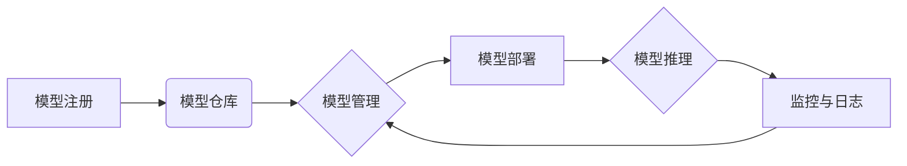

                 

## AI模型的多版本并行：Lepton AI的灵活部署

> 关键词：AI模型、多版本并行、Lepton AI、灵活部署、模型优化、性能提升、资源利用

## 1. 背景介绍

随着人工智能技术的飞速发展，大型AI模型在各个领域展现出强大的应用潜力。然而，这些模型通常具有庞大的参数量和复杂的计算需求，部署和运行面临着诸多挑战。传统的单一模型部署方式难以满足对模型性能、效率和灵活性日益增长的需求。

多版本并行部署成为解决上述问题的有效途径。通过部署多个模型版本并根据实际情况进行动态选择，可以实现模型性能的优化、资源的有效利用以及对新模型的快速迭代和部署。

Lepton AI 作为一款开源的AI模型管理平台，致力于提供灵活、高效的多版本并行部署解决方案。它支持多种模型框架和部署环境，并提供丰富的管理工具和监控功能，帮助开发者轻松构建和管理多版本并行AI模型部署系统。

## 2. 核心概念与联系

### 2.1 多版本并行部署

多版本并行部署是指同时部署多个不同版本的AI模型，并根据实际情况动态选择最合适的模型进行推理。

**核心优势:**

* **性能优化:** 通过部署多个模型版本，可以根据不同的输入数据和场景选择最优的模型进行推理，从而提高模型的整体性能。
* **资源利用:** 可以根据模型的负载情况动态分配资源，避免资源浪费，提高资源利用率。
* **快速迭代:** 新模型的部署和更新更加快速，可以及时响应业务需求和模型性能提升。

### 2.2 Lepton AI 架构

Lepton AI 基于微服务架构，将模型管理、部署、监控等功能模块化设计，实现高可扩展性和灵活性。

**架构图:**



**核心模块:**

* **模型注册:** 提供模型上传、版本管理和元数据存储功能。
* **模型仓库:** 存储所有注册的模型版本，并提供模型检索和下载功能。
* **模型管理:** 提供模型版本控制、模型比较和模型优化等功能。
* **模型部署:** 支持多种部署环境，包括云端、本地和边缘计算。
* **模型推理:** 提供模型推理接口，支持多种数据格式和推理方式。
* **监控与日志:** 实时监控模型运行状态，收集模型运行日志，方便故障诊断和性能分析。

## 3. 核心算法原理 & 具体操作步骤

### 3.1 算法原理概述

Lepton AI 的多版本并行部署算法基于以下核心原理:

* **模型选择策略:** 根据输入数据特征和模型性能指标，选择最合适的模型版本进行推理。
* **资源调度策略:** 根据模型负载情况和资源可用性，动态分配资源，优化模型运行效率。
* **模型更新策略:** 定期更新模型版本，并根据新数据进行模型训练和优化。

### 3.2 算法步骤详解

1. **模型注册:** 开发者将模型上传到 Lepton AI 平台，并提供模型元数据，例如模型名称、版本号、模型框架等。
2. **模型评估:** Lepton AI 平台对注册的模型进行评估，并根据预设的性能指标，例如准确率、召回率、F1-score 等，生成模型性能报告。
3. **模型选择:** 当用户请求模型推理时，Lepton AI 平台根据输入数据特征和模型性能报告，选择最合适的模型版本进行推理。
4. **资源调度:** Lepton AI 平台根据模型负载情况和资源可用性，动态分配资源，例如CPU、内存、GPU 等，确保模型运行效率。
5. **模型推理:** 选择的模型版本进行推理，并返回推理结果。
6. **模型更新:** 定期更新模型版本，并根据新数据进行模型训练和优化，以提高模型性能。

### 3.3 算法优缺点

**优点:**

* **性能优化:** 通过选择最合适的模型版本进行推理，可以提高模型的整体性能。
* **资源利用:** 动态分配资源，避免资源浪费，提高资源利用率。
* **快速迭代:** 新模型的部署和更新更加快速，可以及时响应业务需求和模型性能提升。

**缺点:**

* **模型选择复杂:** 需要根据不同的场景和数据特征选择合适的模型版本，需要一定的经验和技术支持。
* **资源调度复杂:** 需要考虑模型负载情况和资源可用性，需要复杂的资源调度算法。
* **系统维护成本:** 需要维护多个模型版本和部署环境，需要一定的系统维护成本。

### 3.4 算法应用领域

多版本并行部署算法广泛应用于以下领域:

* **自然语言处理:** 选择不同的语言模型版本，根据不同的任务需求进行文本分类、情感分析、机器翻译等。
* **计算机视觉:** 选择不同的图像识别模型版本，根据不同的场景需求进行物体检测、图像分类、人脸识别等。
* **推荐系统:** 选择不同的推荐模型版本，根据用户的行为数据和偏好进行个性化推荐。
* **金融科技:** 选择不同的风险评估模型版本，根据不同的投资策略进行风险控制和投资决策。

## 4. 数学模型和公式 & 详细讲解 & 举例说明

### 4.1 数学模型构建

Lepton AI 的多版本并行部署算法可以抽象为一个优化问题，目标是找到最优的模型版本组合和资源分配方案，以最大化模型性能和资源利用率。

**模型性能指标:**

* **准确率:** 模型预测正确的样本数量占总样本数量的比例。
* **召回率:** 模型预测出的正样本数量占实际正样本数量的比例。
* **F1-score:** 准确率和召回率的调和平均数。

**资源利用率:**

* **CPU利用率:** CPU的使用率。
* **内存利用率:** 内存的使用率。
* **GPU利用率:** GPU的使用率。

**优化目标函数:**

```latex
maximize:  \sum_{i=1}^{n} w_i * P_i
```

其中:

* $n$ 是模型版本数量。
* $w_i$ 是模型 $i$ 的权重，根据模型性能指标和业务需求进行设置。
* $P_i$ 是模型 $i$ 的性能指标，例如准确率、召回率或 F1-score。

**约束条件:**

* 资源约束: 每个模型的资源消耗不能超过系统可分配的资源。
* 模型版本兼容性: 模型版本之间需要兼容，才能进行联合部署。

### 4.2 公式推导过程

优化目标函数的求解可以使用多种算法，例如遗传算法、粒子群算法等。这些算法通过迭代优化模型版本组合和资源分配方案，最终找到最优解。

### 4.3 案例分析与讲解

假设我们有一个电商平台，需要部署多个模型版本进行商品推荐。

* 模型 A: 基于协同过滤算法的推荐模型，性能指标较高，但资源消耗较大。
* 模型 B: 基于内容过滤算法的推荐模型，性能指标较低，但资源消耗较小。

根据用户行为数据和偏好，我们可以设置不同的权重，例如 $w_A = 0.7$，$w_B = 0.3$。

Lepton AI 平台可以根据用户请求和资源可用情况，动态选择模型 A 和模型 B 的组合，并分配相应的资源，以实现最佳的推荐效果和资源利用率。

## 5. 项目实践：代码实例和详细解释说明

### 5.1 开发环境搭建

Lepton AI 支持多种开发环境，例如 Docker、Kubernetes 等。

**Docker 环境搭建:**

1. 安装 Docker。
2. 下载 Lepton AI 的 Docker 镜像。
3. 启动 Lepton AI 的 Docker 容器。

### 5.2 源代码详细实现

Lepton AI 的源代码开源，开发者可以根据自己的需求进行修改和扩展。

**模型注册示例代码:**

```python
from lepton_ai.api import ModelRegistry

# 创建模型注册对象
registry = ModelRegistry()

# 注册模型
registry.register_model(
    model_name="my_model",
    model_version="v1",
    model_framework="tensorflow",
    model_path="/path/to/model",
    model_metadata={"description": "My first AI model"}
)
```

### 5.3 代码解读与分析

* `ModelRegistry` 类负责管理模型注册和版本控制。
* `register_model()` 方法用于注册模型，需要提供模型名称、版本号、框架、路径和元数据等信息。

### 5.4 运行结果展示

Lepton AI 提供了丰富的监控和日志功能，可以实时查看模型运行状态和性能指标。

## 6. 实际应用场景

### 6.1 医疗诊断

Lepton AI 可以部署多个医学影像分析模型，根据不同的疾病类型和影像特征，选择最合适的模型进行诊断，提高诊断准确率和效率。

### 6.2 金融风险评估

Lepton AI 可以部署多个金融风险评估模型，根据不同的投资策略和客户特征，选择最合适的模型进行风险评估，降低金融风险。

### 6.3 个性化教育

Lepton AI 可以部署多个个性化学习模型，根据学生的学习进度和知识掌握情况，选择最合适的模型进行个性化教学，提高学习效率和效果。

### 6.4 未来应用展望

Lepton AI 的多版本并行部署技术将在未来人工智能应用领域发挥越来越重要的作用。随着模型规模和复杂度的不断增加，多版本并行部署将成为构建高效、灵活和可扩展的 AI 系统的必要手段。

## 7. 工具和资源推荐

### 7.1 学习资源推荐

* Lepton AI 官方文档: https://lepton-ai.org/docs/
* TensorFlow 官方文档: https://www.tensorflow.org/
* PyTorch 官方文档: https://pytorch.org/

### 7.2 开发工具推荐

* Docker: https://www.docker.com/
* Kubernetes: https://kubernetes.io/

### 7.3 相关论文推荐

* "Model Parallelism for Deep Learning"
* "Efficient Distributed Training of Deep Networks with Parameter Server"

## 8. 总结：未来发展趋势与挑战

### 8.1 研究成果总结

Lepton AI 的多版本并行部署技术为构建高效、灵活和可扩展的 AI 系统提供了新的思路和方法。

### 8.2 未来发展趋势

* 模型选择策略的智能化: 利用机器学习算法自动选择最合适的模型版本。
* 资源调度策略的优化: 开发更智能的资源调度算法，提高资源利用率。
* 模型更新策略的自动化: 自动化模型更新和训练流程，降低维护成本。

### 8.3 面临的挑战

* 模型版本管理的复杂性: 多版本并行部署需要高效的模型版本管理机制。
* 模型兼容性的问题: 不同模型版本之间需要兼容，才能进行联合部署。
* 系统安全性的保障: 多版本并行部署系统需要保障数据安全和模型安全。

### 8.4 研究展望

Lepton AI 将继续致力于多版本并行部署技术的研发和应用，为构建更智能、更高效的 AI 系统提供更强大的工具和解决方案。

## 9. 附录：常见问题与解答

**常见问题:**

* 如何注册模型到 Lepton AI 平台？
* 如何选择合适的模型版本？
* 如何监控模型运行状态？

**解答:**

* 请参考 5.2 节的代码示例。
* 请参考 4.3 节的案例分析。
* Lepton AI 提供了丰富的监控和日志功能，可以实时查看模型运行状态和性能指标。


作者：禅与计算机程序设计艺术 / Zen and the Art of Computer Programming 
<end_of_turn>

