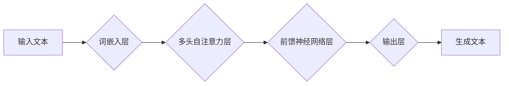

                 

## AI浪潮的持续影响：超出预期，ChatGPT的局限性与自我修正

> 关键词：ChatGPT, 语言模型, 深度学习, 算法局限性, 自我修正, AI伦理

### 1. 背景介绍

近年来，人工智能（AI）技术突飞猛进，特别是深度学习的突破性进展，使得AI浪潮席卷全球。其中，ChatGPT作为一款基于Transformer架构的强大语言模型，以其出色的文本生成能力和广泛的应用场景，迅速成为公众关注的焦点。它能够流畅地进行对话、创作诗歌、撰写代码、翻译语言等，展现出令人惊叹的智能水平。然而，ChatGPT的成功也引发了人们对AI技术的思考：AI技术究竟能达到怎样的程度？它会带来哪些机遇和挑战？

### 2. 核心概念与联系

ChatGPT的核心是深度学习算法，特别是Transformer架构。Transformer是一种新型的神经网络结构，能够有效地处理序列数据，例如文本。它通过自注意力机制（Self-Attention）学习文本中的长距离依赖关系，从而能够理解上下文信息，生成更流畅、更自然的文本。

**Mermaid 流程图**

**核心概念与联系**

* **深度学习:**  一种模仿人类大脑学习机制的机器学习方法，通过多层神经网络学习数据特征。
* **Transformer:**  一种新型的神经网络结构，能够有效地处理序列数据，例如文本。
* **自注意力机制:**  Transformer的核心机制，能够学习文本中的长距离依赖关系。
* **词嵌入:** 将单词映射到向量空间，以便神经网络能够理解单词的语义。
* **生成模型:**  能够根据输入数据生成新的数据，例如文本、图像等。

### 3. 核心算法原理 & 具体操作步骤

#### 3.1  算法原理概述

ChatGPT的核心算法是基于Transformer架构的生成模型。它通过训练大量的文本数据，学习语言的语法规则和语义关系。训练过程可以概括为以下步骤：

1. **词嵌入:** 将输入文本中的每个单词映射到一个向量空间。
2. **多头自注意力:**  利用自注意力机制学习文本中的长距离依赖关系。
3. **前馈神经网络:**  对经过自注意力处理的文本进行进一步的特征提取。
4. **输出层:**  根据训练数据，预测下一个单词。

#### 3.2  算法步骤详解

1. **数据预处理:**  收集大量的文本数据，并进行清洗、分词、标记等预处理操作。
2. **词嵌入层:**  使用词嵌入技术将每个单词映射到一个向量空间。常用的词嵌入方法包括Word2Vec和GloVe。
3. **多头自注意力层:**  将词嵌入向量输入到多头自注意力层，学习文本中的长距离依赖关系。
4. **前馈神经网络层:**  对经过自注意力处理的文本进行进一步的特征提取。
5. **输出层:**  使用softmax函数将前馈神经网络的输出映射到所有可能的单词的概率分布。
6. **损失函数:**  使用交叉熵损失函数计算模型的预测结果与真实结果之间的差异。
7. **反向传播:**  利用梯度下降算法更新模型参数，降低损失函数的值。
8. **训练与评估:**  重复以上步骤，直到模型达到预期的性能。

#### 3.3  算法优缺点

**优点:**

* **强大的文本生成能力:**  能够生成流畅、自然的文本，并适应不同的写作风格。
* **理解上下文信息:**  通过自注意力机制，能够理解文本中的长距离依赖关系，生成更符合语境的文本。
* **可迁移性强:**  预训练的模型可以应用于不同的下游任务，例如文本分类、问答系统等。

**缺点:**

* **训练数据依赖:**  模型的性能取决于训练数据的质量和数量。
* **缺乏真实世界知识:**  模型的知识主要来自训练数据，缺乏对真实世界事件和概念的理解。
* **容易生成虚假信息:**  模型可能会生成与事实不符的文本，需要进行严格的验证和审核。

#### 3.4  算法应用领域

ChatGPT在多个领域都有广泛的应用，例如：

* **聊天机器人:**  构建更智能、更自然的聊天机器人，提供更人性化的用户体验。
* **文本生成:**  自动生成新闻稿、广告文案、诗歌、剧本等各种文本内容。
* **机器翻译:**  提高机器翻译的准确性和流畅度。
* **代码生成:**  辅助程序员编写代码，提高开发效率。
* **教育:**  提供个性化的学习辅导，帮助学生理解知识。

### 4. 数学模型和公式 & 详细讲解 & 举例说明

#### 4.1  数学模型构建

ChatGPT的核心数学模型是基于Transformer架构的序列到序列模型。它使用以下公式计算文本的概率分布：

$$
P(y_1, y_2, ..., y_T | x_1, x_2, ..., x_S) = \prod_{t=1}^{T} P(y_t | y_{<t}, x_1, x_2, ..., x_S)
$$

其中：

* $y_1, y_2, ..., y_T$ 是目标文本的单词序列。
* $x_1, x_2, ..., x_S$ 是输入文本的单词序列。
* $P(y_t | y_{<t}, x_1, x_2, ..., x_S)$ 是在给定之前单词序列 $y_{<t}$ 和输入文本序列 $x_1, x_2, ..., x_S$ 的情况下，预测第 $t$ 个单词的概率。

#### 4.2  公式推导过程

公式的推导过程涉及到多头自注意力机制、前馈神经网络等Transformer架构的各个组件。

* **多头自注意力机制:**  通过计算每个单词与其他单词之间的注意力权重，学习文本中的长距离依赖关系。
* **前馈神经网络:**  对经过自注意力处理的文本进行进一步的特征提取。

#### 4.3  案例分析与讲解

例如，在翻译句子 "The cat sat on the mat" 时，模型会首先将每个单词映射到向量空间，然后利用多头自注意力机制学习每个单词与其他单词之间的关系。最终，模型会根据输入文本和学习到的关系，预测每个单词的翻译结果。

### 5. 项目实践：代码实例和详细解释说明

#### 5.1  开发环境搭建

ChatGPT的开发环境需要安装Python、PyTorch或TensorFlow等深度学习框架，以及一些必要的库，例如transformers、numpy等。

#### 5.2  源代码详细实现

ChatGPT的源代码主要由以下部分组成：

* **词嵌入层:**  使用预训练的词嵌入模型，例如Word2Vec或GloVe。
* **多头自注意力层:**  实现Transformer架构中的多头自注意力机制。
* **前馈神经网络层:**  实现Transformer架构中的前馈神经网络层。
* **输出层:**  使用softmax函数将前馈神经网络的输出映射到所有可能的单词的概率分布。

#### 5.3  代码解读与分析

代码实现需要根据具体的模型架构和任务需求进行调整。例如，需要选择合适的词嵌入模型、调整自注意力层的参数、设置前馈神经网络的层数和激活函数等。

#### 5.4  运行结果展示

运行ChatGPT的代码可以生成文本，并评估模型的性能。常用的评估指标包括困惑度（Perplexity）、BLEU分数等。

### 6. 实际应用场景

ChatGPT在多个实际应用场景中展现出强大的能力：

* **客服机器人:**  ChatGPT可以用于构建智能客服机器人，自动回答用户常见问题，提高客户服务效率。
* **内容创作:**  ChatGPT可以辅助内容创作者生成文章、故事、诗歌等创意内容，提高创作效率。
* **教育辅助:**  ChatGPT可以作为教育辅助工具，帮助学生理解知识、练习写作、进行语言学习等。

### 6.4  未来应用展望

ChatGPT的未来应用前景广阔，例如：

* **个性化学习:**  根据学生的学习风格和进度，提供个性化的学习内容和辅导。
* **跨语言沟通:**  突破语言障碍，实现更便捷的跨语言沟通。
* **科学研究:**  辅助科学家进行数据分析、文本挖掘、知识发现等研究工作。

### 7. 工具和资源推荐

#### 7.1  学习资源推荐

* **书籍:**  《深度学习》、《自然语言处理》
* **在线课程:**  Coursera、edX、Udacity等平台上的深度学习和自然语言处理课程。
* **博客和论坛:**  HuggingFace、Towards Data Science等平台上的AI和NLP相关的博客和论坛。

#### 7.2  开发工具推荐

* **Python:**  深度学习开发的常用编程语言。
* **PyTorch:**  开源深度学习框架，支持GPU加速。
* **TensorFlow:**  谷歌开发的开源深度学习框架。
* **transformers:**  HuggingFace开发的用于处理Transformer模型的库。

#### 7.3  相关论文推荐

* **Attention Is All You Need:**  Transformer模型的原始论文。
* **BERT: Pre-training of Deep Bidirectional Transformers for Language Understanding:**  BERT模型的论文。
* **GPT-3: Language Models are Few-Shot Learners:**  GPT-3模型的论文。

### 8. 总结：未来发展趋势与挑战

#### 8.1  研究成果总结

ChatGPT的成功表明，深度学习技术在自然语言处理领域取得了重大突破。Transformer架构的创新性设计，以及预训练模型的应用，使得语言模型的性能大幅提升，为人工智能的广泛应用提供了基础。

#### 8.2  未来发展趋势

未来，ChatGPT和类似的语言模型将会朝着以下方向发展：

* **更强大的模型:**  模型规模将进一步扩大，参数量将达到数千亿甚至万亿级别，从而提升模型的性能和能力。
* **更广泛的应用:**  语言模型将应用于更多领域，例如科学研究、医疗诊断、法律服务等。
* **更安全的模型:**  研究人员将致力于解决语言模型的潜在风险，例如生成虚假信息、传播偏见等问题。

#### 8.3  面临的挑战

ChatGPT的发展也面临着一些挑战：

* **数据获取和标注:**  训练大型语言模型需要海量的数据，以及大量的标注工作，这在成本和效率上都存在挑战。
* **模型解释性和可控性:**  大型语言模型的内部机制复杂，难以解释其决策过程，这使得模型的可控性和安全性受到质疑。
* **伦理和社会影响:**  语言模型的应用可能会带来伦理和社会问题，例如就业替代、信息操控等，需要引起重视和讨论。

#### 8.4  研究展望

未来，研究人员将继续探索新的模型架构、训练方法和应用场景，推动语言模型技术的发展，并积极应对其带来的挑战，确保人工智能技术能够造福人类社会。

### 9. 附录：常见问题与解答

* **ChatGPT可以理解我的情感吗？**

ChatGPT是一个基于文本的模型，它无法真正理解人类的情感。它只能根据文本中的语言特征，识别出一些情感表达，例如“高兴”、“悲伤”等。

* **ChatGPT可以生成原创内容吗？**

ChatGPT可以生成看似原创的内容，但它实际上是根据训练数据进行组合和重组。因此，ChatGPT生成的文本可能存在重复或抄袭的风险。

* **ChatGPT会取代人类的工作吗？**

ChatGPT可以自动化一些重复性工作，但它无法完全取代人类的工作。人类仍然需要发挥创造力、批判性思维和情感智能等方面的优势。

作者：禅与计算机程序设计艺术 / Zen and the Art of Computer Programming 
<end_of_turn>

