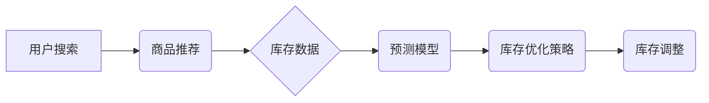

                 

## AI电商搜索平台的库存管理优化

> 关键词：库存管理、电商搜索、人工智能、预测模型、机器学习、优化算法、数据分析

## 1. 背景介绍

随着电商平台的蓬勃发展，库存管理已成为电商企业运营中至关重要的环节。传统的库存管理方法往往依赖于经验和规则，难以应对日益复杂的市场需求和商品种类。而人工智能技术的快速发展为电商库存管理带来了新的机遇。

AI电商搜索平台的库存管理优化是指利用人工智能技术，对电商平台的库存数据进行分析和预测，从而实现库存水平的动态调整，降低库存成本，提高库存周转率，最终提升电商平台的运营效率和盈利能力。

## 2. 核心概念与联系

### 2.1 核心概念

* **库存管理:** 指企业对库存商品的采购、储存、分配和销售等全过程的管理。
* **电商搜索:** 指用户在电商平台上输入关键词或商品信息，平台根据算法匹配并展示相关商品的过程。
* **人工智能 (AI):** 指能够模拟人类智能行为的计算机系统，包括机器学习、深度学习等技术。
* **预测模型:** 利用历史数据和算法，预测未来某个事件或变量的发生概率或数值。

### 2.2 架构关系



**图 2.1 AI电商搜索平台库存管理优化架构**

## 3. 核心算法原理 & 具体操作步骤

### 3.1 算法原理概述

AI电商搜索平台的库存管理优化主要依赖于机器学习算法，通过对历史销售数据、用户行为数据、市场趋势数据等进行分析和预测，构建预测模型，从而实现库存水平的动态调整。常用的机器学习算法包括：

* **线性回归:** 用于预测连续数值，例如未来商品销量。
* **逻辑回归:** 用于预测分类结果，例如商品是否缺货。
* **决策树:** 用于根据一系列规则对数据进行分类和预测。
* **支持向量机 (SVM):** 用于分类和回归问题，具有较好的泛化能力。
* **神经网络:** 用于处理复杂数据，具有强大的学习能力。

### 3.2 算法步骤详解

1. **数据收集:** 收集历史销售数据、用户行为数据、市场趋势数据等相关数据。
2. **数据预处理:** 对收集到的数据进行清洗、转换、特征工程等预处理操作，使其适合机器学习算法的训练。
3. **模型选择:** 根据实际需求选择合适的机器学习算法，例如线性回归、逻辑回归等。
4. **模型训练:** 利用训练数据对选定的模型进行训练，调整模型参数，使其能够准确预测未来商品销量或缺货概率。
5. **模型评估:** 利用测试数据对训练好的模型进行评估，评估模型的预测精度和泛化能力。
6. **模型部署:** 将训练好的模型部署到电商平台，实时预测商品销量或缺货概率。
7. **库存优化策略:** 根据模型预测结果，制定相应的库存优化策略，例如调整订货量、优化库存布局等。
8. **库存调整:** 根据优化策略，对库存进行调整，确保商品供应充足，同时降低库存成本。

### 3.3 算法优缺点

**优点:**

* **数据驱动:** 基于历史数据和算法预测，更加客观和科学。
* **动态调整:** 可以根据实时数据动态调整库存水平，提高库存周转率。
* **降低成本:** 通过优化库存水平，降低库存成本和浪费。

**缺点:**

* **数据依赖:** 算法的准确性依赖于数据的质量和数量。
* **模型复杂:** 训练和部署复杂的机器学习模型需要一定的技术门槛。
* **预测误差:** 预测模型存在一定的误差，无法完全准确预测未来商品销量。

### 3.4 算法应用领域

* **电商平台:** 优化商品库存水平，提高库存周转率，降低库存成本。
* **制造业:** 预测产品需求，优化生产计划，降低库存积压。
* **物流业:** 预测货物运输需求，优化物流配送路线，提高效率。
* **零售业:** 预测商品销售趋势，优化商品采购和定价策略。

## 4. 数学模型和公式 & 详细讲解 & 举例说明

### 4.1 数学模型构建

**库存优化模型的目标:** 

最大化利润，即最大化销售收入减去库存成本。

**模型变量:**

* $Q$: 订货量
* $D$: 商品需求量
* $S$: 单价
* $H$: 库存持有成本
* $P$: 采购成本

**模型公式:**

$$
\text{利润} = S \cdot D - H \cdot Q - P \cdot Q
$$

### 4.2 公式推导过程

* **销售收入:** $S \cdot D$，其中 $S$ 为商品单价，$D$ 为商品需求量。
* **库存持有成本:** $H \cdot Q$，其中 $H$ 为库存持有成本，$Q$ 为订货量。
* **采购成本:** $P \cdot Q$，其中 $P$ 为采购成本，$Q$ 为订货量。

将以上三个成本项相加，得到总成本。

利润 = 销售收入 - 总成本

### 4.3 案例分析与讲解

假设一个电商平台销售一款商品，其单价为 $100$ 元，库存持有成本为 $10$ 元/件/月，采购成本为 $80$ 元/件。

根据历史数据，该商品每月需求量平均为 $1000$ 件。

**使用上述公式计算利润:**

* 销售收入: $100 \cdot 1000 = 100000$ 元
* 库存持有成本: $10 \cdot Q$ 元
* 采购成本: $80 \cdot Q$ 元

利润 = $100000 - (10 \cdot Q + 80 \cdot Q)$

利润 = $100000 - 90Q$

为了最大化利润，需要找到合适的订货量 $Q$。

可以通过求导数的方式找到利润最大化的订货量。

## 5. 项目实践：代码实例和详细解释说明

### 5.1 开发环境搭建

* **操作系统:** Ubuntu 20.04 LTS
* **编程语言:** Python 3.8
* **机器学习库:** scikit-learn
* **数据处理库:** pandas
* **可视化库:** matplotlib

### 5.2 源代码详细实现

```python
import pandas as pd
from sklearn.linear_model import LinearRegression

# 1. 数据加载
data = pd.read_csv('sales_data.csv')

# 2. 数据预处理
# ...

# 3. 模型训练
model = LinearRegression()
model.fit(X_train, y_train)

# 4. 模型评估
# ...

# 5. 预测
future_demand = model.predict(future_data)

# 6. 库存优化策略
# ...
```

### 5.3 代码解读与分析

* **数据加载:** 使用 pandas 库读取销售数据文件。
* **数据预处理:** 对数据进行清洗、转换、特征工程等操作，例如处理缺失值、编码类别变量、提取特征等。
* **模型训练:** 使用 scikit-learn 库的 LinearRegression 类训练线性回归模型。
* **模型评估:** 使用测试数据评估模型的预测精度，例如计算均方误差 (MSE) 或 R-squared 值。
* **预测:** 使用训练好的模型预测未来商品需求量。
* **库存优化策略:** 根据预测结果，制定相应的库存优化策略，例如调整订货量、优化库存布局等。

### 5.4 运行结果展示

* **预测结果:** 展示模型预测的未来商品需求量。
* **库存优化策略:** 展示根据预测结果制定的库存优化策略。
* **效果评估:** 展示库存优化策略的效果，例如库存周转率、库存成本等指标的改善情况。

## 6. 实际应用场景

### 6.1 案例分析

* **服装电商平台:** 利用 AI 预测不同款式和尺码的服装需求，优化库存配置，避免积压库存和缺货情况。
* **电子产品电商平台:** 根据用户搜索历史和购买行为，预测热门电子产品需求，提前备货，满足用户需求。
* **食品电商平台:** 预测不同季节和地区的食品需求，优化库存布局，降低食品浪费。

### 6.2 未来应用展望

* **个性化库存管理:** 根据用户的购买历史和偏好，提供个性化的库存管理方案。
* **智能补货系统:** 利用 AI 自动识别库存不足情况，自动触发补货流程。
* **跨平台库存协同:** 实现不同电商平台的库存数据共享和协同管理。

## 7. 工具和资源推荐

### 7.1 学习资源推荐

* **书籍:**
    * 《Python机器学习实战》
    * 《深度学习》
* **在线课程:**
    * Coursera: 机器学习
    * edX: 深度学习
* **博客和论坛:**
    * 机器学习中文网
    * Kaggle

### 7.2 开发工具推荐

* **Python IDE:** PyCharm, VS Code
* **机器学习库:** scikit-learn, TensorFlow, PyTorch
* **数据处理库:** pandas, NumPy
* **可视化库:** matplotlib, seaborn

### 7.3 相关论文推荐

* **《基于深度学习的电商商品需求预测》**
* **《面向电商平台的库存优化算法研究》**

## 8. 总结：未来发展趋势与挑战

### 8.1 研究成果总结

AI电商搜索平台的库存管理优化技术取得了显著进展，能够有效提高库存周转率、降低库存成本，提升电商平台的运营效率。

### 8.2 未来发展趋势

* **模型精度提升:** 探索更先进的机器学习算法和模型架构，提高预测精度。
* **数据融合:** 融合更多数据源，例如用户行为数据、市场趋势数据、天气数据等，构建更全面的预测模型。
* **个性化库存管理:** 根据用户的购买历史和偏好，提供个性化的库存管理方案。
* **智能补货系统:** 利用 AI 自动识别库存不足情况，自动触发补货流程。

### 8.3 面临的挑战

* **数据质量:** 预测模型的准确性依赖于数据的质量和数量，需要不断收集和清洗数据。
* **模型复杂度:** 训练和部署复杂的机器学习模型需要一定的技术门槛。
* **预测误差:** 预测模型存在一定的误差，需要不断改进模型和算法。

### 8.4 研究展望

未来，AI电商搜索平台的库存管理优化技术将继续发展，朝着更智能、更精准、更个性化的方向发展。


## 9. 附录：常见问题与解答

* **Q1: 如何选择合适的机器学习算法？**
    * **A1:** 选择合适的机器学习算法需要根据实际需求和数据特点进行选择。例如，如果预测的是连续数值，可以使用线性回归或支持向量机；如果预测的是分类结果，可以使用逻辑回归或决策树。
* **Q2: 如何评估模型的预测精度？**
    * **A2:** 可以使用均方误差 (MSE)、R-squared 值等指标来评估模型的预测精度。
* **Q3: 如何处理缺失数据？**
    * **A3:** 可以使用平均值、中位数或其他填充方法来处理缺失数据。
* **Q4: 如何进行特征工程？**
    * **A4:** 特征工程是指对原始数据进行转换和提取，以生成更适合机器学习算法的特征。例如，可以将日期转换为时间戳，将文本数据转换为词向量等。


作者：禅与计算机程序设计艺术 / Zen and the Art of Computer Programming 
<end_of_turn>

