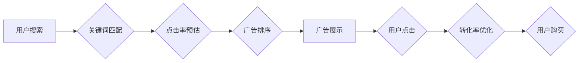

                 

## AI赋能的电商搜索广告投放策略

> 关键词：电商搜索广告、AI算法、深度学习、推荐系统、用户画像、点击率预估、转化率优化、广告投放策略

## 1. 背景介绍

随着电商行业的蓬勃发展，搜索广告已成为商家获取流量和提升销售额的重要手段。传统电商搜索广告投放策略主要依赖于人工经验和规则设定，存在着效率低下、精准度不足、难以适应用户行为变化等问题。而人工智能（AI）技术的快速发展为电商搜索广告投放带来了新的机遇。

AI算法能够通过对海量用户数据进行分析和学习，自动识别用户需求、预测用户行为，并根据这些 insights  优化广告投放策略，从而提升广告的精准度、效率和转化率。

## 2. 核心概念与联系

### 2.1 电商搜索广告投放

电商搜索广告是指在电商平台搜索结果页中，通过付费的方式展示广告信息，引导用户点击广告链接并最终完成购买行为。

### 2.2 AI算法在电商搜索广告中的应用

AI算法在电商搜索广告投放中主要应用于以下几个方面：

* **用户画像构建:** 通过分析用户搜索历史、浏览记录、购买行为等数据，构建用户画像，精准识别用户兴趣和需求。
* **关键词匹配:** 利用自然语言处理（NLP）技术，对用户搜索词进行理解和分析，匹配最相关的广告关键词。
* **点击率预估:** 基于机器学习算法，预测用户点击广告的概率，帮助优化广告投放预算和曝光效果。
* **广告排序:** 根据用户画像、关键词匹配度、点击率预估等因素，对广告进行排序，展示最相关的广告给用户。
* **转化率优化:** 通过分析用户点击广告后的行为，优化广告文案、页面设计等，提升用户转化率。

**核心概念与联系流程图:**



## 3. 核心算法原理 & 具体操作步骤

### 3.1 算法原理概述

在电商搜索广告投放中，常用的AI算法包括：

* **深度学习:** 深度学习算法能够自动学习用户画像、关键词匹配规则、点击率预估模型等，并不断优化算法参数，提升广告投放效果。
* **梯度下降:** 梯度下降算法是深度学习算法训练的核心算法，通过不断调整模型参数，使模型预测结果与实际结果之间的误差最小化。
* **强化学习:** 强化学习算法可以将广告投放视为一个决策过程，通过奖励机制，引导模型学习最优的广告投放策略。

### 3.2 算法步骤详解

以深度学习算法为例，其具体操作步骤如下：

1. **数据收集和预处理:** 收集用户搜索历史、浏览记录、购买行为等数据，并进行清洗、转换、编码等预处理操作。
2. **模型构建:** 根据具体任务，选择合适的深度学习模型架构，例如卷积神经网络（CNN）、循环神经网络（RNN）等。
3. **模型训练:** 使用训练数据训练模型，调整模型参数，使模型预测结果与实际结果之间的误差最小化。
4. **模型评估:** 使用测试数据评估模型性能，例如点击率、转化率等指标。
5. **模型部署:** 将训练好的模型部署到线上环境，用于实时预测用户行为和优化广告投放策略。

### 3.3 算法优缺点

**优点:**

* **精准度高:** 深度学习算法能够自动学习用户画像和行为模式，实现更精准的广告投放。
* **自动化程度高:** 深度学习算法能够自动优化广告投放策略，降低人工干预成本。
* **适应性强:** 深度学习算法能够不断学习和进化，适应用户行为变化。

**缺点:**

* **数据依赖性强:** 深度学习算法需要大量的数据进行训练，否则模型性能会下降。
* **计算资源消耗大:** 深度学习算法训练需要大量的计算资源，成本较高。
* **解释性差:** 深度学习模型的内部机制较为复杂，难以解释模型的决策结果。

### 3.4 算法应用领域

深度学习算法在电商搜索广告投放领域有着广泛的应用，例如：

* **关键词推荐:** 根据用户搜索历史和行为模式，推荐相关的关键词。
* **广告创意生成:** 利用深度学习算法生成更吸引用户的广告创意。
* **广告价格优化:** 根据用户画像和点击率预估，优化广告价格，提高广告收益。

## 4. 数学模型和公式 & 详细讲解 & 举例说明

### 4.1 数学模型构建

在电商搜索广告投放中，点击率预估模型是一个重要的数学模型。点击率预估模型的目标是预测用户点击广告的概率。常用的点击率预估模型包括逻辑回归模型、线性回归模型、支持向量机模型等。

### 4.2 公式推导过程

以逻辑回归模型为例，其点击率预估公式如下：

$$
P(click) = \frac{1}{1 + e^{-(w_0 + w_1 * x_1 + w_2 * x_2 + ... + w_n * x_n)}}
$$

其中：

* $P(click)$ 表示用户点击广告的概率。
* $w_0$ 表示模型的截距项。
* $w_1, w_2, ..., w_n$ 表示模型的参数，分别对应不同的特征。
* $x_1, x_2, ..., x_n$ 表示广告的特征，例如关键词、广告文案、用户画像等。

### 4.3 案例分析与讲解

假设我们有一个电商平台，用户搜索关键词“手机”，平台展示了以下两条广告：

* 广告 A: 手机，价格：1000元
* 广告 B: 手机，价格：2000元

我们可以将广告的特征作为输入到逻辑回归模型中，例如：

* $x_1$: 广告关键词
* $x_2$: 广告价格

模型会根据训练数据学习到 $w_0$, $w_1$, $w_2$ 等参数，并根据用户搜索历史和行为模式，预测用户点击广告 A 和广告 B 的概率。

## 5. 项目实践：代码实例和详细解释说明

### 5.1 开发环境搭建

* Python 3.x
* TensorFlow 或 PyTorch 深度学习框架
* Jupyter Notebook 或 VS Code 代码编辑器

### 5.2 源代码详细实现

```python
import tensorflow as tf

# 定义模型结构
model = tf.keras.models.Sequential([
    tf.keras.layers.Dense(64, activation='relu', input_shape=(2,)),
    tf.keras.layers.Dense(1, activation='sigmoid')
])

# 编译模型
model.compile(optimizer='adam',
              loss='binary_crossentropy',
              metrics=['accuracy'])

# 训练模型
model.fit(X_train, y_train, epochs=10)

# 评估模型
loss, accuracy = model.evaluate(X_test, y_test)
print('Loss:', loss)
print('Accuracy:', accuracy)

# 预测点击率
predictions = model.predict(X_new)
```

### 5.3 代码解读与分析

* **模型结构:** 代码定义了一个简单的深度学习模型，包含两层全连接层。第一层包含 64 个神经元，使用 ReLU 激活函数。第二层包含 1 个神经元，使用 sigmoid 激活函数，输出用户点击广告的概率。
* **模型编译:** 代码使用 Adam 优化器、二元交叉熵损失函数和准确率作为评估指标，编译模型。
* **模型训练:** 代码使用训练数据训练模型，训练 10 个 epochs。
* **模型评估:** 代码使用测试数据评估模型性能，输出损失值和准确率。
* **预测点击率:** 代码使用新数据预测用户点击广告的概率。

### 5.4 运行结果展示

运行代码后，会输出模型的损失值、准确率以及对新数据的预测结果。

## 6. 实际应用场景

AI赋能的电商搜索广告投放策略已在各大电商平台得到广泛应用，例如：

* **淘宝:** 利用深度学习算法，精准推荐商品广告，提升用户转化率。
* **京东:** 使用强化学习算法，优化广告投放策略，降低广告成本。
* **亚马逊:** 通过用户画像构建，个性化推荐广告，提升用户体验。

### 6.4 未来应用展望

未来，AI技术将继续推动电商搜索广告投放的创新发展，例如：

* **多模态广告投放:** 利用图像、视频等多模态数据，构建更丰富的广告内容，提升用户互动。
* **个性化广告投放:** 基于用户行为和偏好，个性化定制广告内容和投放策略，提升广告精准度。
* **跨平台广告投放:** 将广告投放策略扩展到多个平台，实现用户全渠道触达。

## 7. 工具和资源推荐

### 7.1 学习资源推荐

* **书籍:**
    * 深度学习
    * 人工智能：一种现代方法
* **在线课程:**
    * Coursera 深度学习课程
    * Udacity 机器学习工程师课程

### 7.2 开发工具推荐

* **TensorFlow:** 开源深度学习框架
* **PyTorch:** 开源深度学习框架
* **Jupyter Notebook:** 代码编辑和可视化工具

### 7.3 相关论文推荐

* **Attention Is All You Need:** https://arxiv.org/abs/1706.03762
* **BERT: Pre-training of Deep Bidirectional Transformers for Language Understanding:** https://arxiv.org/abs/1810.04805

## 8. 总结：未来发展趋势与挑战

### 8.1 研究成果总结

AI技术在电商搜索广告投放领域取得了显著成果，例如：

* **精准度提升:** 深度学习算法能够精准识别用户需求，提升广告精准度。
* **效率提升:** AI算法能够自动化优化广告投放策略，降低人工干预成本。
* **用户体验提升:** 个性化广告推荐能够提升用户体验。

### 8.2 未来发展趋势

未来，AI技术在电商搜索广告投放领域将继续发展，例如：

* **多模态广告投放:** 利用图像、视频等多模态数据，构建更丰富的广告内容。
* **个性化广告投放:** 基于用户行为和偏好，个性化定制广告内容和投放策略。
* **跨平台广告投放:** 将广告投放策略扩展到多个平台，实现用户全渠道触达。

### 8.3 面临的挑战

AI技术在电商搜索广告投放领域也面临着一些挑战，例如：

* **数据安全:** 用户数据安全是重要的伦理问题，需要妥善处理。
* **算法解释性:** 深度学习模型的内部机制较为复杂，难以解释模型的决策结果。
* **公平性:** AI算法可能存在偏见，需要确保广告投放公平公正。

### 8.4 研究展望

未来，需要进一步研究如何解决AI技术在电商搜索广告投放领域面临的挑战，例如：

* 开发更安全、更透明的AI算法。
* 构建更完善的AI伦理规范。
* 探索AI技术与其他技术的融合应用。


## 9. 附录：常见问题与解答

**Q1: AI算法是否会取代人工？**

A1: AI算法可以自动化很多任务，但不会完全取代人工。人工仍然需要在策略制定、数据分析、模型评估等方面发挥作用。

**Q2: 如何评估AI算法的性能？**

A2: AI算法的性能可以通过多种指标评估，例如点击率、转化率、用户满意度等。

**Q3: 如何保证AI算法的公平性？**

A3: 

需要在数据收集、模型训练、算法评估等各个环节，关注公平性问题，并采取措施避免算法偏见。


作者：禅与计算机程序设计艺术 / Zen and the Art of Computer Programming 
<end_of_turn>

