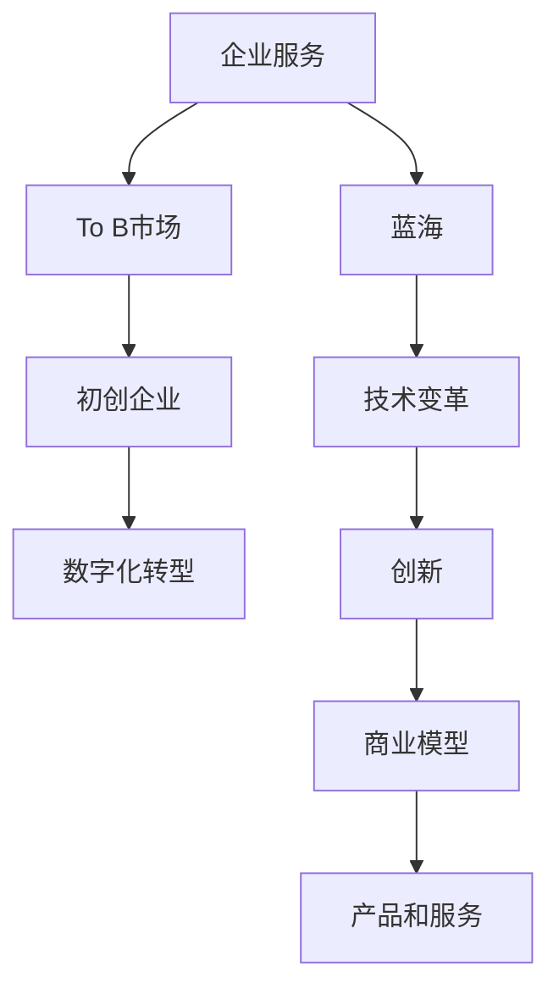

                 

# 企业服务创业：To B市场的蓝海

> 关键词：企业服务,To B市场,蓝海,初创企业,创新,商业模型,技术变革,数字化转型,市场洞察

## 1. 背景介绍

### 1.1 问题由来
随着数字化转型的浪潮席卷全球，企业越来越依赖于信息技术来提升效率、降低成本、创造新价值。然而，传统IT服务已无法满足企业日益增长的数字化需求，To B市场呼唤着新的商业模式和技术解决方案。在这样的背景下，企业服务创业应运而生，成为To B市场的蓝海。

### 1.2 问题核心关键点
To B市场的蓝海，即是指在信息技术快速发展、企业需求不断变化的环境中，企业服务创业者需要寻找新的业务增长点，创造新的价值空间。

企业服务创业的核心关键点包括：
- 洞察目标企业的需求，提供针对性的解决方案。
- 快速响应市场变化，持续迭代产品和服务。
- 构建健康高效的商业模式，实现可持续发展。
- 借助最新技术，提供差异化的竞争优势。
- 注重客户体验和满意度，打造长期合作关系。

### 1.3 问题研究意义
研究To B市场的蓝海，对于指导企业服务创业者找到新的增长机会、提高产品竞争力、实现商业成功具有重要意义：

1. 开拓新的市场空间。To B市场长期存在，但需求不断变化，创业者需持续创新，发掘新的业务机会。
2. 提升产品竞争力。紧跟技术发展趋势，利用新技术实现产品差异化，满足企业个性化需求。
3. 优化商业模式。找到最适合的商业模型，确保企业的长期发展。
4. 助力企业数字化转型。为企业提供定制化的数字化解决方案，推动其业务增长。
5. 提高客户满意度。通过持续的客户服务和反馈机制，提高客户黏性和满意度。

## 2. 核心概念与联系

### 2.1 核心概念概述

为更好地理解To B市场的蓝海，本节将介绍几个密切相关的核心概念：

- 企业服务(Enterprise Service)：指针对企业客户提供的解决方案、工具和咨询服务，旨在提升企业的运营效率和业务成果。
- To B市场(B2B Market)：指面向企业客户的产品和服务市场，与面向消费者的To C市场相对。
- 蓝海(Blue Ocean)：由W. Chan Kim和Renée Mauborgne提出，指通过创造新的需求和竞争领域，开拓未经竞争的市场空间，避开激烈的红海竞争。
- 初创企业(Startup)：指新成立、处于发展初期的企业，通常以创新、灵活、成长迅速为特点。
- 技术变革(Technological Change)：指新技术的出现和发展对市场和产业结构的影响。
- 数字化转型(Digital Transformation)：指利用信息技术推动企业业务的转型升级，提升效率、降低成本、创新产品和服务。

这些核心概念之间的逻辑关系可以通过以下Mermaid流程图来展示：



这个流程图展示了一系列概念之间的联系：

1. 企业服务是To B市场的重要组成部分。
2. 企业服务创业者可以在蓝海中寻找新的机会。
3. 技术变革推动了企业服务的创新。
4. 数字化转型需要企业服务的支持。
5. 初创企业通过创新的产品和服务，可以在To B市场中开拓蓝海。

## 3. 核心算法原理 & 具体操作步骤
### 3.1 算法原理概述

To B市场的蓝海，即通过企业服务创业者提供差异化的产品和服务，创造新的市场需求和竞争领域。其核心思想是：利用最新的技术手段，对市场进行深入分析和洞察，找出未被充分利用的需求点，结合企业的实际需求，提供定制化的解决方案。

企业服务创业的过程，本质上是将技术、市场、商业模式三者进行有效结合，创造出独特的商业价值。具体而言，主要包括以下几个步骤：

1. 技术调研：对最新技术趋势进行研究，寻找可以应用到企业服务中的新技术。
2. 市场分析：对目标市场进行深入分析，了解企业的需求和痛点，找出蓝海市场。
3. 产品设计：根据市场分析和用户反馈，设计符合市场需求的产品和服务。
4. 商业模型构建：选择合适的商业模式，确保产品能够持续发展。
5. 客户营销：利用市场营销策略，吸引目标客户群体。
6. 客户服务：提供优质的售后服务，建立客户信任和忠诚度。
7. 持续迭代：不断收集客户反馈，持续优化产品和服务。

### 3.2 算法步骤详解

以下是对To B市场的蓝海进行深入分析的详细步骤：

**Step 1: 技术调研**
- 收集最新技术动态，如人工智能、大数据、区块链等，对技术趋势进行分析和评估。
- 识别技术热点与企业需求的结合点，分析其应用潜力。
- 评估技术的成熟度和可靠性，确定应用技术的时机和范围。

**Step 2: 市场分析**
- 利用调研报告、行业分析、专家咨询等手段，获取关于To B市场的详细信息。
- 分析目标市场的规模、增长速度、行业竞争格局，找出未被充分满足的需求。
- 确定目标客户群体，了解他们的需求和痛点，以及他们对产品和服务的价格敏感度。

**Step 3: 产品设计**
- 根据市场分析和用户反馈，设计满足用户需求的产品和服务，形成初步的产品原型。
- 进行用户测试和反馈收集，根据用户反馈不断优化产品设计。
- 确定产品功能、用户体验、性能指标等关键特性，形成最终的产品设计方案。

**Step 4: 商业模型构建**
- 根据产品特性和市场需求，选择合适的商业模型，如SaaS、PaaS、IaaS等。
- 明确收入来源、定价策略、订阅模式、客户细分等关键要素，形成详细的商业计划书。
- 制定市场推广策略、销售渠道、客户获取计划等，确保商业模型的可实施性。

**Step 5: 客户营销**
- 利用市场营销策略，包括SEO、SEM、内容营销、社交媒体等，吸引目标客户群体。
- 制定有效的销售策略，包括直销、渠道销售、合作伙伴等，快速扩大市场份额。
- 通过客户教育和体验，建立品牌信任和口碑效应。

**Step 6: 客户服务**
- 提供优质的售后服务，包括技术支持、客户培训、问题解决等，确保客户满意度。
- 收集客户反馈和建议，进行持续改进和优化。
- 建立客户关系管理系统，跟踪客户需求和关系维护。

**Step 7: 持续迭代**
- 定期收集客户反馈和市场变化，进行产品和服务迭代优化。
- 保持市场敏锐度，及时响应市场变化和新技术发展。
- 持续进行市场营销和客户关系管理，确保业务的长期稳定发展。

### 3.3 算法优缺点

To B市场的蓝海方法具有以下优点：
1. 目标明确：通过深入市场分析，明确目标客户和市场需求，提升产品针对性。
2. 创新性强：结合最新技术趋势，提供差异化的产品和服务，获得竞争优势。
3. 市场空间大：在未被充分利用的市场中开拓新领域，避开激烈竞争。
4. 可持续性强：通过持续的客户服务和反馈机制，建立长期合作关系。

同时，该方法也存在一定的局限性：
1. 技术投入高：需要持续进行技术研发和产品迭代，资金投入较大。
2. 市场变化快：市场需求变化迅速，需要快速响应和调整策略。
3. 客户需求多样：企业客户需求各异，需要定制化的解决方案，提升开发难度。
4. 竞争压力大：To B市场竞争激烈，需要不断创新和优化。
5. 客户关系维护难：客户需求变化多，维护客户关系需耗费较大精力。

尽管存在这些局限性，但就目前而言，To B市场的蓝海方法仍然是大规模企业服务创业的主要方向。未来相关研究的重点在于如何进一步降低技术风险，提高市场响应速度，提升客户关系管理的效率。

### 3.4 算法应用领域

To B市场的蓝海方法已经在诸多领域得到应用，覆盖了几乎所有常见企业服务场景，例如：

- SaaS平台：如Salesforce、Zoho CRM等，提供云端的企业级应用软件。
- PaaS服务：如AWS、Azure等，提供企业级计算和存储资源。
- IaaS基础设施：如阿里云、腾讯云等，提供基础设施即服务。
- 金融科技：如支付宝、微信支付等，提供金融服务解决方案。
- 医疗健康：如微医、好大夫在线等，提供医疗健康服务。
- 教育培训：如Coursera、Udemy等，提供在线教育服务。
- 企业通讯：如Slack、Teams等，提供团队协作工具。
- 人力资源管理：如SAP、Oracle等，提供HR管理系统。
- 供应链管理：如SAP、Oracle等，提供供应链管理解决方案。

除了上述这些经典场景外，To B市场的蓝海方法还被创新性地应用到更多新兴领域，如智能制造、智能物流、智慧城市等，为企业数字化转型提供了新的技术路径。

## 4. 数学模型和公式 & 详细讲解  
### 4.1 数学模型构建

To B市场的蓝海模型构建，需要通过量化分析来评估不同商业模型的可行性。

设目标市场规模为 $M$，平均客单价为 $P$，客户获取成本为 $C_{\text{获取}}$，客户流失率为 $r$，则一年内的客户净收入为：

$$
R = P \times M \times (1 - r) - C_{\text{获取}} \times M \times (1 - r)
$$

其中，$R$ 为一年内的净收入，$P$ 为平均客单价，$M$ 为目标市场规模，$r$ 为客户流失率，$C_{\text{获取}}$ 为客户获取成本。

### 4.2 公式推导过程

以下我们将对目标市场规模 $M$ 和平均客单价 $P$ 的推导过程进行详细说明。

**目标市场规模 $M$ 的推导**
假设目标市场的年增长率为 $g$，市场基期规模为 $M_0$，则市场规模 $M$ 可以表示为：

$$
M = M_0 \times (1 + g)^t
$$

其中，$g$ 为目标市场的年增长率，$t$ 为时间（年），$M_0$ 为市场基期规模。

**平均客单价 $P$ 的推导**
假设每个客户的平均订单价值为 $A$，客户重复购买率（复购率）为 $c$，则平均客单价 $P$ 可以表示为：

$$
P = A \times c
$$

其中，$A$ 为每个客户的平均订单价值，$c$ 为客户的复购率。

### 4.3 案例分析与讲解

假设一个To B市场提供的软件订阅服务，市场规模 $M=100$ 万企业，每年增长率 $g=10\%$，市场基期规模 $M_0=100$ 家企业。假设客户获取成本 $C_{\text{获取}}=100$ 元/客户，客户流失率 $r=20\%$，则一年内的净收入 $R$ 可以计算为：

$$
R = P \times M \times (1 - r) - C_{\text{获取}} \times M \times (1 - r) = A \times c \times 100 \times (1 - 0.2) - 100 \times 100 \times (1 - 0.2) = 9000A - 800
$$

其中，$A$ 为每个客户的平均订单价值，$c$ 为客户的复购率。

如果该服务的客单价为 $P=1000$ 元，平均订单价值 $A=1000$ 元，复购率 $c=0.3$，则一年内的净收入 $R$ 为：

$$
R = 9000 \times 1000 - 800 = 9000000
$$

即一年内的净收入为 9000 万元。

## 5. 项目实践：代码实例和详细解释说明
### 5.1 开发环境搭建

在进行To B市场的蓝海创业项目实践前，我们需要准备好开发环境。以下是使用Python进行Django开发的环境配置流程：

1. 安装Anaconda：从官网下载并安装Anaconda，用于创建独立的Python环境。

2. 创建并激活虚拟环境：
```bash
conda create -n django-env python=3.8 
conda activate django-env
```

3. 安装Django：使用pip安装Django框架。
```bash
pip install django
```

4. 安装各个模块：
```bash
pip install Pillow matplotlib django-crispy-forms django-axes3d django-simple-crispy-forms django-graphene-django
```

5. 安装各类工具包：
```bash
pip install numpy pandas scikit-learn matplotlib tqdm jupyter notebook ipython
```

完成上述步骤后，即可在`django-env`环境中开始To B市场蓝海创业项目开发。

### 5.2 源代码详细实现

下面我们以SaaS平台为例，给出使用Django框架构建To B市场蓝海创业项目的PyTorch代码实现。

首先，定义SaaS平台的数据处理函数：

```python
from django.contrib.auth.models import User
from django.db import models

class Customer(models.Model):
    name = models.CharField(max_length=255)
    email = models.EmailField(unique=True)
    is_active = models.BooleanField(default=True)

class Order(models.Model):
    customer = models.ForeignKey(Customer, on_delete=models.CASCADE)
    product = models.CharField(max_length=255)
    price = models.DecimalField(max_digits=10, decimal_places=2)
    quantity = models.IntegerField()
    order_date = models.DateField(auto_now=True)

class Payment(models.Model):
    order = models.ForeignKey(Order, on_delete=models.CASCADE)
    payment_method = models.CharField(max_length=255)
    amount = models.DecimalField(max_digits=10, decimal_places=2)
    payment_date = models.DateField(auto_now=True)

class User(models.Model):
    username = models.CharField(max_length=255)
    password = models.CharField(max_length=255)
    is_staff = models.BooleanField(default=False)

class Product(models.Model):
    name = models.CharField(max_length=255)
    description = models.TextField()
    price = models.DecimalField(max_digits=10, decimal_places=2)

class Invoice(models.Model):
    customer = models.ForeignKey(Customer, on_delete=models.CASCADE)
    product = models.ForeignKey(Product, on_delete=models.CASCADE)
    quantity = models.IntegerField()
    invoice_date = models.DateField(auto_now=True)
```

然后，定义模型和视图函数：

```python
from django.shortcuts import render, redirect
from django.http import HttpResponse

def home(request):
    return render(request, 'home.html')

def customer_list(request):
    customers = Customer.objects.all()
    return render(request, 'customer_list.html', {'customers': customers})

def customer_detail(request, pk):
    customer = Customer.objects.get(pk=pk)
    orders = Order.objects.filter(customer=customer)
    payments = Payment.objects.filter(order__customer=customer)
    return render(request, 'customer_detail.html', {'customer': customer, 'orders': orders, 'payments': payments})

def order_list(request):
    orders = Order.objects.all()
    return render(request, 'order_list.html', {'orders': orders})

def order_detail(request, pk):
    order = Order.objects.get(pk=pk)
    return render(request, 'order_detail.html', {'order': order})

def product_list(request):
    products = Product.objects.all()
    return render(request, 'product_list.html', {'products': products})

def product_detail(request, pk):
    product = Product.objects.get(pk=pk)
    return render(request, 'product_detail.html', {'product': product})
```

最后，定义URL路由和模板：

```html
<!-- home.html -->
<!DOCTYPE html>
<html lang="en">
<head>
    <meta charset="UTF-8">
    <title>To B Market Blue Ocean</title>
</head>
<body>
    <h1>Welcome to the To B Market Blue Ocean</h1>
    <a href="">Customers</a>
    <a href="">Products</a>
</body>
</html>

<!-- customer_list.html -->
<!DOCTYPE html>
<html lang="en">
<head>
    <meta charset="UTF-8">
    <title>Customer List</title>
</head>
<body>
    <h1>Customer List</h1>
    <ul>
        
            <li><a href="">{{ customer.name }}</a></li>
        
    </ul>
</body>
</html>

<!-- customer_detail.html -->
<!DOCTYPE html>
<html lang="en">
<head>
    <meta charset="UTF-8">
    <title>Customer Detail</title>
</head>
<body>
    <h1>{{ customer.name }}</h1>
    <h2>Orders</h2>
    <ul>
        
            <li>{{ order.product }} - {{ order.price }} * {{ order.quantity }} = {{ order.price * order.quantity }}</li>
        
    </ul>
    <h2>Payments</h2>
    <ul>
        
            <li>{{ payment.payment_method }} - {{ payment.amount }}</li>
        
    </ul>
</body>
</html>

<!-- order_list.html -->
<!DOCTYPE html>
<html lang="en">
<head>
    <meta charset="UTF-8">
    <title>Order List</title>
</head>
<body>
    <h1>Order List</h1>
    <ul>
        
            <li><a href="">{{ order.product }} - {{ order.price }} * {{ order.quantity }} = {{ order.price * order.quantity }}</a></li>
        
    </ul>
</body>
</html>

<!-- order_detail.html -->
<!DOCTYPE html>
<html lang="en">
<head>
    <meta charset="UTF-8">
    <title>Order Detail</title>
</head>
<body>
    <h1>Order Detail</h1>
    <h2>Product</h2>
    <p>{{ order.product }}</p>
    <h2>Price</h2>
    <p>{{ order.price }}</p>
    <h2>Quantity</h2>
    <p>{{ order.quantity }}</p>
</body>
</html>

<!-- product_list.html -->
<!DOCTYPE html>
<html lang="en">
<head>
    <meta charset="UTF-8">
    <title>Product List</title>
</head>
<body>
    <h1>Product List</h1>
    <ul>
        
            <li><a href="">{{ product.name }}</a></li>
        
    </ul>
</body>
</html>

<!-- product_detail.html -->
<!DOCTYPE html>
<html lang="en">
<head>
    <meta charset="UTF-8">
    <title>Product Detail</title>
</head>
<body>
    <h1>Product Detail</h1>
    <h2>Name</h2>
    <p>{{ product.name }}</p>
    <h2>Description</h2>
    <p>{{ product.description }}</p>
    <h2>Price</h2>
    <p>{{ product.price }}</p>
</body>
</html>
```

以上就是使用Django框架构建SaaS平台To B市场蓝海创业项目的完整代码实现。可以看到，通过Django框架，可以快速构建后端和前端，实现数据库的CRUD操作和页面渲染。

### 5.3 代码解读与分析

让我们再详细解读一下关键代码的实现细节：

**Customer类**
- 定义了客户的信息，包括姓名、邮箱、是否活跃等。

**Order类**
- 定义了订单的信息，包括客户、产品、价格、数量、订单日期等。

**Payment类**
- 定义了支付的信息，包括订单、支付方式、金额、支付日期等。

**User类**
- 定义了用户的信息，包括用户名、密码、是否为管理员等。

**Product类**
- 定义了产品的信息，包括名称、描述、价格等。

**Invoice类**
- 定义了发票的信息，包括客户、产品、数量、发票日期等。

**视图函数**
- 定义了各个页面的页面展示，通过Django的模板语言和模板渲染，实现了数据的展示和交互。

**URL路由**
- 定义了各个页面的URL路由，通过Django的URL路由器，实现了页面的跳转和展示。

**模板**
- 定义了各个页面的HTML模板，通过Django的模板语言，实现了数据的展示和渲染。

以上代码实现了基本的To B市场蓝海创业项目的开发，涵盖了用户、客户、订单、支付、产品等核心模块，并通过视图函数和URL路由，实现了数据的展示和交互。

## 6. 实际应用场景
### 6.1 智能制造

智能制造是未来制造业的发展趋势，需要高度自动化、智能化、柔性化的生产系统。To B市场的蓝海方法可以帮助智能制造企业提供定制化的解决方案，提升生产效率和产品质量。

通过SaaS平台，智能制造企业可以提供基于物联网(IoT)的生产监控、预测性维护、质量控制等功能，使生产系统更加智能和高效。例如，利用工业物联网(IoT)设备采集的数据，通过数据分析和机器学习，实现设备故障预测和预防性维护，减少设备停机时间，提高生产效率。

### 6.2 智能物流

智能物流是未来物流行业的发展方向，需要高效、灵活、安全的物流管理系统。To B市场的蓝海方法可以为智能物流企业提供定制化的解决方案，提升物流效率和用户体验。

通过PaaS平台，智能物流企业可以提供基于云计算的物流管理服务，实现货物的实时跟踪、路线规划、仓储管理等功能。例如，利用物联网设备采集的货物位置信息，通过实时数据分析，优化物流路线和仓储管理，提高物流效率和用户体验。

### 6.3 智慧城市

智慧城市是未来城市管理的发展方向，需要智能、高效、可持续的城市治理系统。To B市场的蓝海方法可以为智慧城市提供定制化的解决方案，提升城市管理效率和居民生活质量。

通过SaaS平台，智慧城市管理部门可以提供基于大数据的城市管理服务，实现交通流量监测、公共安全监控、环境污染监测等功能。例如，利用城市传感器采集的数据，通过数据分析和机器学习，实现交通流量预测和优化、公共安全事件预警和响应、环境污染监测和治理等，提升城市治理效率和居民生活质量。

## 7. 工具和资源推荐
### 7.1 学习资源推荐

为了帮助开发者系统掌握To B市场的蓝海技术基础和实践技巧，这里推荐一些优质的学习资源：

1. 《To B市场蓝海》系列博文：由To B市场技术专家撰写，深入浅出地介绍了To B市场蓝海技术的核心概念、实践方法和发展趋势。

2. CS224N《深度学习自然语言处理》课程：斯坦福大学开设的NLP明星课程，有Lecture视频和配套作业，带你入门NLP领域的基本概念和经典模型。

3. 《To B市场实战》书籍：介绍To B市场蓝海技术的实际应用，涵盖企业服务开发、商业模型构建、客户关系管理等诸多方面。

4. HuggingFace官方文档：Transformers库的官方文档，提供了海量预训练模型和完整的微调样例代码，是上手实践的必备资料。

5. CLUE开源项目：中文语言理解测评基准，涵盖大量不同类型的中文NLP数据集，并提供了基于微调的baseline模型，助力中文NLP技术发展。

通过对这些资源的学习实践，相信你一定能够快速掌握To B市场蓝海技术的精髓，并用于解决实际的To B市场问题。
###  7.2 开发工具推荐

高效的开发离不开优秀的工具支持。以下是几款用于To B市场蓝海开发常用的工具：

1. Django：基于Python的开源Web框架，灵活高效，适用于各类企业服务Web应用开发。

2. Flask：轻量级的Web框架，简单易用，适用于小型企业服务Web应用开发。

3. FastAPI：基于Python的开源Web框架，支持异步开发，适用于高性能企业服务Web应用开发。

4. Docker：容器化技术，可实现应用程序的快速部署和运行，适用于企业服务系统的云原生部署。

5. Kubernetes：容器编排工具，可实现应用程序的自动化部署和扩展，适用于企业服务系统的云原生架构。

6. Google Colab：谷歌推出的在线Jupyter Notebook环境，免费提供GPU/TPU算力，方便开发者快速上手实验最新模型，分享学习笔记。

合理利用这些工具，可以显著提升To B市场蓝海创业项目的开发效率，加快创新迭代的步伐。

### 7.3 相关论文推荐

To B市场的蓝海方法的发展源于学界的持续研究。以下是几篇奠基性的相关论文，推荐阅读：

1. 《The Lean Startup》：Eric Ries著，介绍精益创业和快速迭代的方法论，帮助创业者快速验证商业模式。

2. 《Blue Ocean Strategy》：W. Chan Kim和Renée Mauborgne著，提出蓝海战略，指导企业在激烈的市场竞争中寻找新的市场空间。

3. 《Towards a Model of the Entrepreneurial Experience》：M.K. Hisrich和L.F. Petersen著，研究企业家创业过程，提供实用的创业方法论。

4. 《Digital Transformation in Business》：L. Rayport和J. Sviokla著，介绍数字化转型的核心概念和实践方法，帮助企业顺利实现数字化转型。

5. 《The Next Supernova: Artificial Intelligence, the Internet of Things, and Business in the New Age》：A. P. Johnson著，介绍人工智能和物联网技术在To B市场的应用，推动企业的数字化转型。

这些论文代表了大市场蓝海技术的发展脉络。通过学习这些前沿成果，可以帮助研究者把握学科前进方向，激发更多的创新灵感。

## 8. 总结：未来发展趋势与挑战

### 8.1 总结

本文对To B市场的蓝海进行了全面系统的介绍。首先阐述了To B市场的蓝海背景和意义，明确了蓝海创业的关键要素，包括目标市场、技术调研、产品设计、商业模型、客户营销、客户服务等。通过详细的案例分析和代码实现，展示了如何通过To B市场的蓝海方法，构建创新的企业服务解决方案。

通过对To B市场的蓝海方法的深入研究，我们可以看到，该方法在To B市场的广泛应用，将为各行业的数字化转型提供新动力，推动企业的业务创新和增长。

### 8.2 未来发展趋势

展望未来，To B市场的蓝海方法将呈现以下几个发展趋势：

1. 技术不断进步。随着AI、大数据、云计算等技术的快速发展，企业服务创业将更加智能化、自动化、高效化。

2. 市场空间扩大。全球化背景下，企业服务创业的市场空间将进一步扩大，提供更具差异化的服务。

3. 客户需求升级。企业客户对服务的需求将更加个性化、定制化，企业服务创业需不断创新，满足客户的新需求。

4. 商业模型多样化。未来企业服务创业的商业模型将更加多样，如订阅制、按需付费、按需服务等，满足不同客户的需求。

5. 生态系统协同。企业服务创业将更加注重生态系统建设，通过合作伙伴关系，形成更强的竞争力和影响力。

### 8.3 面临的挑战

尽管To B市场的蓝海方法已经取得了初步成功，但在迈向更加成熟和稳定发展的过程中，仍然面临诸多挑战：

1. 技术复杂度高。To B市场的技术栈复杂，需具备较强的技术储备和研发能力。

2. 市场竞争激烈。企业服务市场竞争激烈，需不断创新和优化，才能保持竞争优势。

3. 客户需求多变。企业客户需求多变，需持续进行产品迭代和优化。

4. 商业模型复杂。商业模型需满足不同客户需求，设计和管理复杂。

5. 客户关系管理难度大。客户关系管理需耗费大量资源和精力，需持续维护和优化。

尽管存在这些挑战，但To B市场的蓝海方法仍是大规模企业服务创业的主要方向。未来相关研究的重点在于如何进一步降低技术风险，提高市场响应速度，提升客户关系管理的效率。

### 8.4 研究展望

面向未来，To B市场的蓝海研究需要在以下几个方面寻求新的突破：

1. 探索新的商业模型。引入新的商业模型，如平台模式、共享经济模式等，提供更具差异化的服务。

2. 融合新兴技术。引入AI、大数据、区块链等新兴技术，提升企业服务的智能化、自动化水平。

3. 推动生态系统协同。通过构建开放的生态系统，实现合作伙伴协同创新，提升整体竞争力。

4. 加强客户关系管理。通过客户关系管理系统和数据分析，实现精准营销和客户服务。

5. 优化商业模式。优化商业模型设计，实现成本控制和收入增长。

这些研究方向将引领To B市场的蓝海方法迈向更高的台阶，为各行业的数字化转型提供更强大的技术支撑。

## 9. 附录：常见问题与解答

**Q1：To B市场蓝海方法是否适用于所有企业服务？**

A: 虽然To B市场的蓝海方法适用于大多数企业服务，但不同的企业服务需求差异较大，需根据具体情况进行定制化开发。例如，对于数据驱动的企业服务，可以利用大数据技术进行个性化推荐和预测；对于技术驱动的企业服务，可以利用AI技术进行自动化和智能化。

**Q2：如何选择合适的商业模型？**

A: 选择合适的商业模型需考虑企业服务的特点和市场需求。常见的商业模型包括SaaS、PaaS、IaaS、订阅制、按需付费、按需服务等。需根据企业服务的特点和市场需求，选择最合适的商业模型。

**Q3：如何提高客户满意度？**

A: 提高客户满意度需从多个方面进行优化，包括产品质量、服务体验、客户关系管理等。需通过客户反馈机制，持续改进产品和服务，提升客户体验。

**Q4：如何应对市场变化？**

A: 应对市场变化需建立敏捷的开发和运营机制，快速响应市场需求变化。需进行持续的市场调研和数据分析，及时调整产品和服务策略。

**Q5：如何构建健康的商业模式？**

A: 构建健康的商业模式需综合考虑产品特性、市场需求、客户行为等多个因素。需进行详细的商业模型分析和可行性评估，确保商业模型的可行性和可持续性。

**Q6：如何保持竞争优势？**

A: 保持竞争优势需不断创新和优化，提供差异化的服务和产品。需加强技术研发和产品迭代，提升服务品质和用户黏性。

这些问题的解答将帮助企业服务创业者更好地理解To B市场的蓝海方法，并解决实际应用中的关键问题。

---

作者：禅与计算机程序设计艺术 / Zen and the Art of Computer Programming

