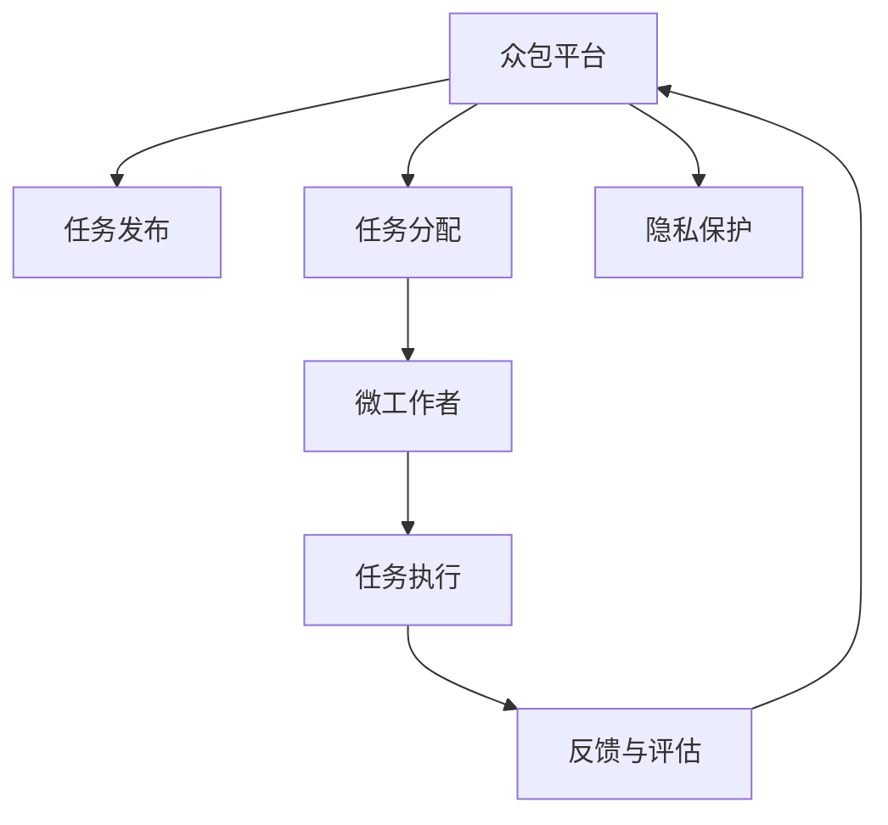

                 

# 众包：汇聚点滴智慧，创造无限可能

## 1. 背景介绍

### 1.1 问题由来

在信息技术飞速发展的今天，各行各业都在利用数据驱动决策，以提升效率和竞争力。然而，数据的收集、处理和分析往往需要耗费大量的人力和时间，特别是那些复杂且大规模的数据任务，更是难上加难。为了应对这一挑战，众包(Crowdsourcing)这一新兴模式应运而生。

众包，即通过互联网平台，将工作任务细化，交由众多分散的个体（通常是网络上的独立工作者）来共同完成。与传统的全职员工不同，众包工作者（也称为“微工作者”）通常是为了赚取额外收入而参与特定任务，并且可以随时随地接入网络进行工作。

### 1.2 问题核心关键点

众包的本质是通过大规模分散的劳动力，高效完成复杂的数据和任务处理，其核心关键点包括：

- **分布式处理**：将任务分解成小部分，分配给不同的众包工作者独立完成，并通过协同合作达到整体目标。
- **低成本**：相较于雇佣全职员工，众包可以显著降低人力成本，特别是在需求不稳定的场景下，具有更大的灵活性。
- **质量多样性**：来自不同背景和工作经验的微工作者，可以提供多样化的观点和方法，从而提高工作质量。
- **反馈机制**：众包平台通常配备了一套反馈机制，用于监督和评估工作成果，确保工作质量。
- **技术应用**：随着人工智能、机器学习等技术的发展，众包平台也在不断优化算法，提升任务处理效率。

众包在各个领域得到了广泛应用，如市场调查、数据标注、内容创作、图像识别等。其低成本、高效协作的特性，使得越来越多的企业和机构选择这一模式来提升其数据处理能力。

### 1.3 问题研究意义

研究众包模式，对于提升信息时代的效率、降低成本、激发创新具有重要意义：

1. **提升效率**：众包模式通过大规模分布式处理，可以高效完成大规模数据处理和任务执行。
2. **降低成本**：相对于全职员工，众包工作者的报酬更为灵活，可以有效降低人力成本。
3. **激发创新**：不同背景的微工作者提供多样化的观点和方法，有利于推动新技术和新方法的产生。
4. **灵活部署**：众包模式可以根据任务需求灵活部署资源，特别适合需要动态调整的人力需求场景。
5. **普适性强**：众包模式适用于几乎所有需要大规模数据处理和任务执行的领域，具有广泛的适用性。

## 2. 核心概念与联系

### 2.1 核心概念概述

为了更好地理解众包的概念，本节将介绍几个关键概念：

- **众包平台(Crowdsourcing Platforms)**：提供任务发布、分配、管理和结算等服务的在线平台。
- **微工作者(Microtask Workers)**：通过众包平台接取和完成小任务（通常以虚拟货币或真实货币的形式支付报酬）的独立工作者。
- **任务分配(Work Distribution)**：将复杂任务分解成小任务，分配给不同的微工作者完成。
- **反馈和评估(Feedback and Evaluation)**：众包平台提供对工作成果的监督和评估机制，确保任务质量。
- **隐私保护(Privacy Protection)**：在众包过程中，保护参与者个人信息和数据隐私的重要性。

这些概念之间的逻辑关系可以通过以下Mermaid流程图来展示：



这个流程图展示了众包平台的核心流程：

1. 任务发布：平台发布各种任务需求。
2. 任务分配：将任务分配给不同的微工作者。
3. 任务执行：微工作者独立完成任务。
4. 反馈与评估：平台对任务成果进行评估。
5. 隐私保护：平台确保任务执行过程中的数据隐私安全。

## 3. 核心算法原理 & 具体操作步骤

### 3.1 算法原理概述

众包平台的运作原理可以简单概括为任务细化、分布式处理、反馈与评估三个步骤。

- **任务细化**：将复杂任务拆分为多个小任务，分配给不同的微工作者独立完成。
- **分布式处理**：通过互联网平台，利用众多分散的劳动力进行任务处理。
- **反馈与评估**：通过一套反馈机制，评估每个微工作者的工作质量，确保任务的整体质量。

### 3.2 算法步骤详解

以下是众包平台工作任务的一个详细操作流程：

**Step 1: 任务发布与分配**

1. **平台发布任务**：平台管理员在众包平台上发布任务，包括任务描述、期望成果、截止时间、报酬等信息。
2. **分配任务**：根据任务需求和微工作者的专业背景、经验等信息，将任务自动分配给合适的微工作者。

**Step 2: 任务执行**

1. **微工作者接取任务**：符合条件的微工作者可以接取任务，并进行理解与准备。
2. **任务执行**：微工作者独立完成分配到的任务，通常通过在线方式提交工作成果。
3. **任务提交**：微工作者将工作成果上传至平台，等待审核和评价。

**Step 3: 反馈与评估**

1. **审核与初审**：平台管理员或专业审核人员对工作成果进行初步审核，判断其是否满足要求。
2. **反馈与修改**：若初审未通过，微工作者需根据反馈信息进行修改。若初审通过，则进行下一步评估。
3. **最终评估**：平台管理员进行最终评估，决定是否接受工作成果。
4. **报酬发放**：平台确认工作成果后，根据平台规则和任务要求，向微工作者发放报酬。

### 3.3 算法优缺点

众包模式具有以下优点：

1. **高效低成本**：通过大规模分布式处理，可以高效完成复杂任务，同时降低人力成本。
2. **灵活多样**：微工作者多样化的背景和工作方法，提升了任务处理的灵活性和多样性。
3. **广泛适用**：适用于各种需要大规模数据处理和任务执行的领域，具有普适性。
4. **质量控制**：通过平台审核和评估机制，确保工作质量。

同时，众包模式也存在一些局限性：

1. **质量不一致**：不同微工作者的工作质量可能存在较大差异。
2. **隐私风险**：在众包过程中，涉及大量个人隐私和敏感数据，需要加强隐私保护措施。
3. **管理复杂**：众包平台需要高效管理和监督大量任务和微工作者，管理成本较高。
4. **依赖平台**：微工作者的工作机会和报酬完全依赖于众包平台，缺乏自主性和稳定性。

### 3.4 算法应用领域

众包模式已在多个领域得到广泛应用，如：

- **数据标注**：收集和标注大规模数据集，如图像、文本、音频等，为机器学习模型提供训练数据。
- **内容创作**：撰写文章、视频脚本、音乐等，满足各种内容消费需求。
- **市场调查**：收集消费者意见和反馈，用于市场分析和产品改进。
- **图像识别**：对图片进行分类、标注、校验等，提升计算机视觉技术水平。
- **测试和反馈**：进行产品原型测试，收集用户反馈，改进产品设计。

除了这些经典应用外，众包模式也在不断拓展到更多领域，如法律咨询、医疗诊断、环境保护等，为各行各业带来了新的可能性。

## 4. 数学模型和公式 & 详细讲解 & 举例说明

### 4.1 数学模型构建

在众包任务中，通常涉及大量任务分配和微工作者评估的优化问题。可以构建数学模型，通过优化算法来最大化平台的任务执行效率和微工作者的收益。

假设平台有$N$个任务和$M$个微工作者，每个任务需要$W$个微工作者完成。定义任务完成时间和微工作者报酬如下：

- 任务完成时间 $T_i$，$i=1,2,\cdots,N$。
- 微工作者报酬 $P_j$，$j=1,2,\cdots,M$。

假设每个微工作者每天可以完成$c_j$个任务，每天工作时间 $T_{max}$，则微工作者完成一个任务所需的时间为 $t_j=\frac{1}{c_j}$。

假设平台的任务分配策略为随机分配，则第$i$个任务分配给第$j$个微工作者的概率为 $p_{ij}=\frac{c_j}{NW}$。

定义平台的任务总完成时间和总报酬如下：

- 任务总完成时间 $\sum_{i=1}^N T_i$。
- 总报酬 $\sum_{j=1}^M P_j$。

通过数学模型，可以优化任务分配策略，最小化任务总完成时间和总报酬。

### 4.2 公式推导过程

根据上述定义，可以构建目标函数和约束条件如下：

目标函数：最小化任务总完成时间和总报酬
$$
\min \sum_{i=1}^N T_i + \sum_{j=1}^M P_j
$$

约束条件：每个任务至少分配给一个微工作者，每个微工作者分配的任务数不超过其每天可完成的最大任务数
$$
\begin{cases}
\sum_{j=1}^M p_{ij} \leq 1 & \forall i=1,2,\cdots,N \\
\sum_{i=1}^N p_{ij} \leq \frac{1}{c_j} & \forall j=1,2,\cdots,M \\
\end{cases}
$$

令 $x_{ij}$ 表示任务 $i$ 分配给微工作者 $j$ 的情况，则有 $p_{ij}=x_{ij}\frac{c_j}{NW}$。

将约束条件改写为：
$$
\begin{cases}
\sum_{j=1}^M x_{ij} \geq 1 & \forall i=1,2,\cdots,N \\
\sum_{i=1}^N x_{ij} \leq \frac{T_{max}}{t_j} & \forall j=1,2,\cdots,M \\
\end{cases}
$$

目标函数变为：
$$
\min \sum_{i=1}^N T_i x_{ij} + \sum_{j=1}^M P_j x_{ij}
$$

其中 $T_i$ 和 $P_j$ 分别为任务 $i$ 的预期完成时间和微工作者 $j$ 的报酬。

通过求解上述优化问题，可以得出任

## 5. 项目实践：代码实例和详细解释说明

### 5.1 开发环境搭建

在进行众包平台开发前，我们需要准备好开发环境。以下是使用Python进行Flask框架开发的环境配置流程：

1. 安装Anaconda：从官网下载并安装Anaconda，用于创建独立的Python环境。

2. 创建并激活虚拟环境：
```bash
conda create -n crowdsourcing-env python=3.8 
conda activate crowdsourcing-env
```

3. 安装Flask：
```bash
pip install flask
```

4. 安装SQLAlchemy：用于数据库交互
```bash
pip install sqlalchemy
```

5. 安装Flask-RESTful：用于构建RESTful API
```bash
pip install flask-restful
```

6. 安装Flask-Cors：用于解决跨域问题
```bash
pip install flask-cors
```

完成上述步骤后，即可在`crowdsourcing-env`环境中开始众包平台开发。

### 5.2 源代码详细实现

下面我们以一个简单的众包平台为例，给出Flask框架下众包任务处理的代码实现。

首先，定义任务和微工作者的数据库模型：

```python
from flask_sqlalchemy import SQLAlchemy
from flask import Flask, jsonify, request

app = Flask(__name__)
app.config['SQLALCHEMY_DATABASE_URI'] = 'sqlite:///example.db'
db = SQLAlchemy(app)

class Task(db.Model):
    id = db.Column(db.Integer, primary_key=True)
    name = db.Column(db.String(255), nullable=False)
    description = db.Column(db.Text, nullable=False)
    completion_time = db.Column(db.Integer, nullable=False)
    reward = db.Column(db.Integer, nullable=False)
    workers = db.relationship('Worker', secondary=task_worker, backref='tasks', lazy='dynamic')

class Worker(db.Model):
    id = db.Column(db.Integer, primary_key=True)
    name = db.Column(db.String(255), nullable=False)
    daily_capacity = db.Column(db.Integer, nullable=False)
    working_hours = db.Column(db.Integer, nullable=False)
    completed_tasks = db.relationship('Task', secondary=task_worker, backref='workers', lazy='dynamic')

task_worker = db.Table('task_worker',
    db.Column('task_id', db.Integer, db.ForeignKey('task.id'), primary_key=True),
    db.Column('worker_id', db.Integer, db.ForeignKey('worker.id'), primary_key=True)
)

@app.route('/tasks', methods=['GET'])
def get_tasks():
    tasks = Task.query.all()
    task_dict = {task.id: {'task_name': task.name, 'description': task.description, 'completion_time': task.completion_time, 'reward': task.reward} for task in tasks}
    return jsonify(task_dict)
```

然后，定义API接口，用于发布任务和微工作者提交任务：

```python
@app.route('/tasks', methods=['POST'])
def post_task():
    task_data = request.get_json()
    new_task = Task(name=task_data['name'], description=task_data['description'], completion_time=task_data['completion_time'], reward=task_data['reward'])
    db.session.add(new_task)
    db.session.commit()
    return jsonify({"message": "Task created successfully!"})

@app.route('/tasks/<int:task_id>/workers', methods=['POST'])
def assign_worker_to_task(task_id):
    worker_data = request.get_json()
    worker_id = worker_data['worker_id']
    db.session.query(Task).filter_by(id=task_id).update({Task.workers.append(Worker.query.filter_by(id=worker_id).first())})
    db.session.commit()
    return jsonify({"message": "Worker assigned to task!"})
```

最后，定义任务评估API接口，用于评估和审核任务：

```python
@app.route('/tasks/<int:task_id>/workers/<int:worker_id>', methods=['GET'])
def get_worker_tasks(task_id, worker_id):
    task_worker = Task.query.filter(Task.workers.has(Worker.id == worker_id)).all()
    task_dict = {task.id: {'task_name': task.name, 'description': task.description, 'completion_time': task.completion_time, 'reward': task.reward} for task in task_worker}
    return jsonify(task_dict)

@app.route('/tasks/<int:task_id>/workers/<int:worker_id>', methods=['POST'])
def submit_task(task_id, worker_id):
    task = Task.query.filter_by(id=task_id).first()
    worker = Worker.query.filter_by(id=worker_id).first()
    task.completed_tasks.append(worker)
    task.completed_time = worker.working_hours
    task.reward = worker.daily_capacity
    db.session.commit()
    return jsonify({"message": "Task submitted successfully!"})
```

## 6. 实际应用场景

### 6.1 众包平台在市场调查中的应用

市场调查是众包平台的重要应用场景之一。传统市场调查往往需要耗费大量时间和成本，且数据质量难以保证。而通过众包平台，可以快速收集大量消费者意见和反馈，降低成本，提高效率。

例如，某电商企业需要了解用户对某款新产品的满意度，可以在众包平台上发布调查任务，要求用户对产品各方面进行评分。平台将任务分配给不同背景的微工作者，收集到大量数据后进行统计分析，得到产品的综合评价。

### 6.2 众包平台在数据标注中的应用

数据标注是机器学习领域的一个重要环节。众包平台可以通过大量微工作者，快速完成大规模数据集的标注工作。

例如，某公司需要标注一批图像数据，将其分类为“猫”和“非猫”。平台可以将图像分配给不同的微工作者，要求其进行标注。由于标注任务难度较大，平台可以提供一定的激励措施，如虚拟货币、现金奖励等，以吸引更多微工作者参与。

### 6.3 众包平台在内容创作中的应用

内容创作是众包平台的重要应用之一。平台可以通过众包方式，获取高质量的文章、视频、音乐等内容，满足不同用户的需求。

例如，某出版社需要大量高质量的书籍内容，可以在众包平台上发布任务，要求微工作者撰写相关内容。平台可以根据任务需求，分配给不同专业背景的微工作者，以确保内容质量和多样性。

## 7. 工具和资源推荐

### 7.1 学习资源推荐

为了帮助开发者系统掌握众包的理论基础和实践技巧，这里推荐一些优质的学习资源：

1. 《众包经济学》书籍：介绍了众包的经济学原理、运作模式、案例分析等内容，是了解众包的重要入门读物。
2. 《微任务众包》论文：对众包任务的分配和优化问题进行了深入研究，提出了基于博弈论的优化算法。
3. 《分布式数据处理》课程：介绍了各种分布式数据处理技术，如Hadoop、Spark等，为众包平台的开发提供了技术支持。
4. 《机器学习众包平台》书籍：全面介绍了机器学习众包平台的开发和应用，包括任务管理和优化等技术细节。
5. 《众包平台架构设计》文章：详细介绍了众包平台的设计思路和架构方案，对平台开发具有较高的参考价值。

通过对这些资源的学习实践，相信你一定能够快速掌握众包的理论和实践技巧，并用于解决实际的业务问题。

### 7.2 开发工具推荐

高效的开发离不开优秀的工具支持。以下是几款用于众包平台开发的常用工具：

1. Flask：轻量级的Python Web框架，易于上手，适用于开发小型API。
2. SQLAlchemy：Python ORM，用于与数据库进行交互，方便进行数据存储和查询。
3. PyJWT：用于生成和验证JSON Web Token，保护API的安全性。
4. Flask-Cors：解决跨域问题，方便API接口的调用。
5. Redis：高性能的内存数据结构存储系统，用于任务队列和管理。

合理利用这些工具，可以显著提升众包平台的开发效率，加快创新迭代的步伐。

### 7.3 相关论文推荐

众包模式的发展源于学界的持续研究。以下是几篇奠基性的相关论文，推荐阅读：

1. "Crowdsourcing Theory: A Survey"：综述了众包理论的发展历程和研究现状，是了解众包理论的重要文献。
2. "Crowdsourcing for Mechanical Turk"：介绍了Amazon Mechanical Turk平台的工作原理和应用案例。
3. "Human-Crowdsourced Datasets for Data Mining"：研究了基于众包的数据集构建方法，对众包数据质量进行了评估。
4. "A Survey of Crowdsourcing: Principles, Strategies, and Applications"：对众包模式的理论基础和应用场景进行了全面总结。
5. "Task Allocation and Bidding Dynamics in Mechanical Turk"：研究了众包平台上任务分配和竞价机制，对任务效率和工作者收益进行了优化。

这些论文代表了大众平台的发展脉络。通过学习这些前沿成果，可以帮助研究者把握学科前进方向，激发更多的创新灵感。

## 8. 总结：未来发展趋势与挑战

### 8.1 总结

本文对众包模式进行了全面系统的介绍。首先阐述了众包模式的背景和核心关键点，明确了众包在提升信息时代效率、降低成本、激发创新方面的重要意义。其次，从原理到实践，详细讲解了众包任务的数学建模和优化算法，给出了众包平台开发的完整代码实例。同时，本文还广泛探讨了众包模式在市场调查、数据标注、内容创作等多个领域的应用前景，展示了众包模式的广阔应用场景。此外，本文精选了众包技术的各类学习资源，力求为读者提供全方位的技术指引。

通过本文的系统梳理，可以看到，众包模式正在成为各行各业的重要应用范式，极大地提升了数据处理和任务执行的效率。未来，伴随技术的持续演进和应用场景的不断拓展，众包模式将进一步提升各行各业的生产力，带来更加智能化、高效化的未来。

### 8.2 未来发展趋势

展望未来，众包模式将呈现以下几个发展趋势：

1. **智能化优化**：通过引入人工智能和机器学习技术，对众包任务进行智能化优化，提高任务分配和执行的效率。
2. **多模态数据处理**：将众包平台拓展到多模态数据处理领域，如图像、视频、语音等，提升平台的服务范围和质量。
3. **隐私保护加强**：在众包过程中，加强对用户隐私的保护，避免数据泄露和安全风险。
4. **持续学习和迭代**：通过不断优化平台算法和任务设计，提高众包平台的用户体验和任务执行效率。
5. **全球化协作**：众包平台可以通过互联网，连接全球各地的微工作者，形成全球化协作网络，提高平台的影响力和资源利用效率。

以上趋势凸显了众包模式的广阔前景。这些方向的探索发展，必将进一步提升众包平台的性能和服务质量，为各行各业带来更加高效、灵活、智能的解决方案。

### 8.3 面临的挑战

尽管众包模式已经取得了显著成就，但在迈向更加智能化、普适化应用的过程中，它仍面临诸多挑战：

1. **任务质量不稳定**：不同微工作者的工作质量可能存在较大差异，影响整体任务执行效果。
2. **隐私和数据安全**：众包过程中涉及大量个人隐私和敏感数据，隐私保护和数据安全问题亟待解决。
3. **平台管理复杂**：众包平台需要高效管理和监督大量任务和微工作者，管理成本较高。
4. **资源优化不足**：现有众包平台往往存在资源浪费问题，如何优化资源分配和任务调度，提升系统效率，还需要进一步研究。
5. **激励机制不完善**：缺乏有效的激励机制，难以激发微工作者的积极性和创造性。

### 8.4 研究展望

面对众包模式所面临的挑战，未来的研究需要在以下几个方面寻求新的突破：

1. **引入人工智能**：将人工智能和机器学习技术引入众包任务优化，提升平台效率和任务质量。
2. **优化资源分配**：研究高效的资源分配算法，优化任务执行和管理，降低平台运营成本。
3. **完善激励机制**：设计科学的激励机制，激发微工作者的积极性和创造性，提升任务执行效果。
4. **加强隐私保护**：在众包过程中，加强用户隐私保护，确保数据安全。
5. **拓展应用场景**：将众包模式拓展到更多领域，提升各行各业的数字化水平。

这些研究方向的探索，必将引领众包模式走向更高的台阶，为构建智能化、高效化的未来社会贡献力量。总之，众包模式具有广阔的应用前景，通过不断优化和创新，必将带来更加智能化、普适化的未来。

## 9. 附录：常见问题与解答

**Q1: 众包模式适用于哪些任务？**

A: 众包模式适用于需要大规模数据处理和任务执行的各类任务，如数据标注、内容创作、市场调查、图像识别等。任务需要分解成小部分，由微工作者独立完成。

**Q2: 如何设计合理的任务分配策略？**

A: 任务分配策略需要考虑微工作者的能力和任务需求，通常采用随机分配或基于博弈论的优化算法。随机分配简单易行，但可能导致任务执行效率低；博弈论优化则更复杂，但能提高任务执行效果。

**Q3: 众包模式如何保障数据隐私？**

A: 在众包过程中，需要加强对用户隐私和数据安全的保护。可以通过加密传输、数据匿名化、访问控制等手段，确保用户数据的安全。

**Q4: 众包模式如何处理任务质量不一致的问题？**

A: 平台可以通过反馈和评估机制，对微工作者的工作质量进行监督和评价，及时发现和处理任务质量问题。对于表现优秀的微工作者，可以提供更多任务和激励。

**Q5: 众包模式如何提高任务执行效率？**

A: 平台可以引入人工智能和机器学习技术，对任务进行智能化优化，提升任务分配和执行效率。同时，优化资源分配和任务调度，降低运营成本。

---

作者：禅与计算机程序设计艺术 / Zen and the Art of Computer Programming

