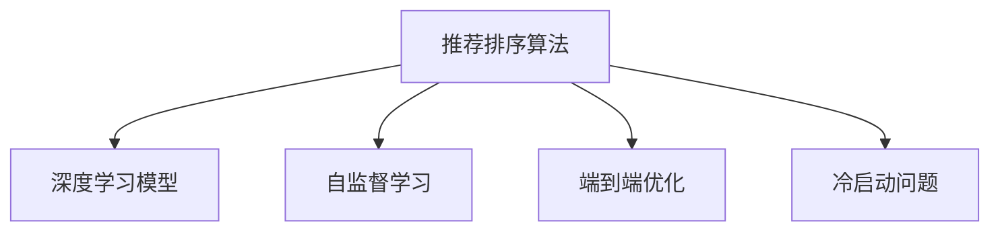

                 

## 1. 背景介绍

随着人工智能(AI)技术的快速发展，结果排序算法在信息检索、推荐系统、搜索引擎等应用场景中扮演着越来越重要的角色。在传统推荐系统、搜索引擎中，排序算法是基于人工设计的特征提取和排序规则，需要大量标注数据来调优模型。然而，近年来随着深度学习技术的突破，基于机器学习的推荐排序算法得到广泛应用。通过大量用户行为数据和自然语言文本数据的自监督学习，深度学习模型能够自主提取特征，优化排序结果。

### 1.1 问题由来
传统的机器学习推荐算法多基于矩阵分解、协同过滤等模型，存在依赖用户稀疏数据、冷启动问题。而在深度学习推荐系统中，利用神经网络模型通过学习用户数据中的隐含关系，能够有效克服冷启动问题，且具有较好的泛化能力。深度学习推荐排序算法的出现，进一步提升了推荐系统的智能性，丰富了用户交互方式，强化了用户体验。

### 1.2 问题核心关键点
深度学习推荐排序算法主要包括以下关键点：
1. 利用神经网络模型，自动提取用户数据特征。
2. 应用深度学习算法，优化结果排序和召回策略。
3. 进行端到端优化，提升模型实时性和精度。
4. 利用自监督学习，通过大量非标注数据训练模型。
5. 考虑用户个性化需求，实现推荐多样化。

### 1.3 问题研究意义
研究基于深度学习的推荐排序算法，有助于进一步拓展推荐系统应用范围，提升系统性能，加快技术落地速度。具体而言：
1. 降低系统构建成本：相比于传统推荐算法，深度学习推荐算法不需要大量标注数据，能够快速构建推荐模型。
2. 提升用户体验：通过神经网络模型，深度学习推荐算法能够更好处理用户多样化需求，提供个性化推荐。
3. 加快应用迭代速度：深度学习算法具有端到端优化能力，能够实时调整模型参数，适应数据变化。
4. 推动业务创新：深度学习算法提供了数据驱动的决策依据，有助于业务创新和智能升级。

## 2. 核心概念与联系

### 2.1 核心概念概述

为了更好地理解基于深度学习的推荐排序算法，本节将介绍几个密切相关的核心概念：

- 推荐排序算法(Recommender System Ranking)：根据用户行为数据和物品特征数据，通过模型排序，将潜在推荐结果呈现在用户面前。排序越准，用户满意度越高。
- 深度学习模型(Deep Learning Model)：使用多层神经网络模型，通过自动提取数据特征，学习到数据的隐含关系。深度学习模型具有强大的特征提取能力，广泛应用于推荐排序。
- 自监督学习(Self-Supervised Learning)：利用非标注数据，通过自动设计或预定义的任务，训练模型学习隐含关系。自监督学习使得深度学习模型能够在无标注数据下进行特征学习。
- 端到端优化(End-to-End Optimization)：将特征提取、模型训练、结果排序等步骤集成到统一框架中，端到端优化提升模型实时性和精度。
- 冷启动问题(Cold Start Problem)：用户在系统初期没有足够历史行为数据时，推荐系统难以准确预测用户偏好。深度学习推荐算法通过学习用户隐含关系，能够有效解决冷启动问题。

这些核心概念之间的逻辑关系可以通过以下Mermaid流程图来展示：



这个流程图展示了大语言模型的核心概念及其之间的关系：

1. 推荐排序算法基于深度学习模型，通过特征提取、模型训练等步骤优化结果排序。
2. 深度学习模型利用自监督学习，在无标注数据下进行特征学习。
3. 端到端优化使得推荐排序算法能够实时调整模型参数，提升精度。
4. 冷启动问题通过深度学习模型解决，自动学习用户隐含关系。

这些概念共同构成了推荐排序算法的学习和应用框架，使其能够精准预测用户行为，提升推荐系统的智能性。

## 3. 核心算法原理 & 具体操作步骤
### 3.1 算法原理概述

基于深度学习的推荐排序算法主要包含三个步骤：

1. 数据预处理：收集用户行为数据和物品特征数据，将其转化为模型输入。
2. 特征学习：利用神经网络模型，自动提取用户数据特征。
3. 结果排序：应用深度学习算法，优化结果排序和召回策略。

### 3.2 算法步骤详解

#### 数据预处理

推荐排序算法的第一步是数据预处理，将原始用户行为数据和物品特征数据转化为模型输入。具体步骤包括：

1. 数据清洗：去除噪声、缺失值等，保证数据质量。
2. 特征工程：设计合适特征表示，如时间戳、用户ID、物品ID等。
3. 数据划分：将数据划分为训练集、验证集和测试集。

#### 特征学习

特征学习是推荐排序算法的核心步骤。通常采用深度神经网络模型，通过自监督学习提取用户数据特征。具体步骤如下：

1. 选择模型：选择合适深度学习模型，如多层感知机、卷积神经网络、循环神经网络等。
2. 特征提取：将用户行为数据和物品特征数据输入模型，自动学习特征表示。
3. 模型训练：在训练集上训练模型，通过损失函数最小化，优化特征提取能力。

#### 结果排序

结果排序是将推荐结果按用户偏好排序，将潜在推荐结果呈现在用户面前。排序算法根据用户行为数据和物品特征数据，通过模型优化排序策略。具体步骤如下：

1. 定义排序损失函数：选择合适的损失函数，如交叉熵损失、均方误差损失等。
2. 优化排序策略：根据排序损失函数，通过优化算法调整排序模型参数。
3. 评估排序结果：在测试集上评估排序模型精度，根据评估结果进行调优。

### 3.3 算法优缺点

基于深度学习的推荐排序算法有以下优点：

1. 自动特征提取：深度学习算法能够自动学习用户数据隐含关系，无需人工设计特征，提升特征提取能力。
2. 高效推荐：通过端到端优化，推荐排序算法能够实时调整模型参数，提升推荐实时性和精度。
3. 解决冷启动问题：深度学习算法能够通过学习用户隐含关系，自动解决冷启动问题。
4. 泛化能力强：深度学习模型具有较好的泛化能力，能够应对多种数据类型和业务场景。

同时，该算法也存在一定的局限性：

1. 数据依赖性强：深度学习算法需要大量用户行为数据和物品特征数据，依赖数据质量。
2. 模型复杂度高：深度学习模型参数量较大，训练复杂度高。
3. 过拟合风险高：深度学习算法容易过拟合训练数据，泛化性能可能不足。
4. 实时性要求高：深度学习算法需要大量计算资源，实时性要求较高。

尽管存在这些局限性，但就目前而言，基于深度学习的推荐排序算法仍是最主流范式。未来相关研究的重点在于如何进一步降低数据依赖，提高模型的泛化能力，同时兼顾实时性和计算效率。

### 3.4 算法应用领域

基于深度学习的推荐排序算法在推荐系统中得到了广泛应用，覆盖了各种应用场景：

1. 电商推荐：通过深度学习模型，电商推荐系统能够根据用户行为数据和商品特征数据，实现个性化推荐。
2. 视频推荐：视频推荐系统通过深度学习模型，分析用户行为数据和视频特征数据，推荐符合用户偏好的视频内容。
3. 新闻推荐：新闻推荐系统利用深度学习模型，根据用户浏览历史和新闻特征数据，推荐相关新闻内容。
4. 社交网络：社交网络平台通过深度学习模型，根据用户关系和行为数据，推荐可能感兴趣的内容和用户。
5. 音乐推荐：音乐推荐系统通过深度学习模型，分析用户行为数据和音乐特征数据，推荐符合用户偏好的音乐内容。

除了上述这些经典场景，深度学习推荐排序算法还广泛应用于图书推荐、旅游推荐、广告投放等诸多领域，为各行各业带来了新一轮的业务升级和创新。

## 4. 数学模型和公式 & 详细讲解 & 举例说明

### 4.1 数学模型构建

假设推荐系统有 $U$ 个用户和 $I$ 个物品，每个用户行为数据 $x_{ui}$ 包含用户 $u$ 在时间 $t$ 对物品 $i$ 的兴趣表示。用户行为数据和物品特征数据可以表示为：

$$
x_{ui} = [u, t, i, x_{i}]
$$

其中 $u$ 为时间戳，$t$ 为用户ID，$i$ 为物品ID，$x_{i}$ 为物品特征数据。

### 4.2 公式推导过程

推荐排序算法的核心在于构建用户行为数据和物品特征数据的隐含关系，并通过模型学习到用户兴趣表示。常见推荐排序算法包括基于协同过滤的方法、基于矩阵分解的方法和基于深度学习的方法。

以下以基于深度学习的推荐排序算法为例，推导模型的损失函数。

假设用户行为数据为 $\mathbf{x}_{ui} \in \mathbb{R}^{n}$，物品特征数据为 $\mathbf{y}_{i} \in \mathbb{R}^{m}$，用户兴趣表示为 $\mathbf{h}_{u} \in \mathbb{R}^{h}$，物品兴趣表示为 $\mathbf{r}_{i} \in \mathbb{R}^{h}$。

定义用户行为数据与物品特征数据的余弦相似度为：

$$
s_{ui} = \mathbf{x}_{ui}^T \mathbf{y}_{i}
$$

定义用户兴趣表示与物品兴趣表示的余弦相似度为：

$$
p_{ui} = \mathbf{h}_{u}^T \mathbf{r}_{i}
$$

推荐排序算法的目标是最小化用户行为数据和物品特征数据的余弦相似度与用户兴趣表示和物品兴趣表示的余弦相似度的差异：

$$
L = \frac{1}{N} \sum_{ui} (s_{ui} - p_{ui})^2
$$

其中 $N$ 为总样本数。

根据上述损失函数，利用梯度下降等优化算法，最小化损失函数 $L$，得到用户兴趣表示和物品兴趣表示的最优值，即：

$$
\mathbf{h}_{u} = \mathop{\arg\min}_{\mathbf{h}_{u}} L
$$

$$
\mathbf{r}_{i} = \mathop{\arg\min}_{\mathbf{r}_{i}} L
$$

### 4.3 案例分析与讲解

以用户行为数据与物品特征数据的余弦相似度为例，解释余弦相似度在推荐排序算法中的应用。

假设用户 $u$ 对物品 $i$ 的兴趣表示为 $\mathbf{h}_{u} \in \mathbb{R}^{h}$，物品 $i$ 的特征表示为 $\mathbf{y}_{i} \in \mathbb{R}^{m}$。用户行为数据与物品特征数据的余弦相似度 $s_{ui}$ 可以表示为：

$$
s_{ui} = \mathbf{x}_{ui}^T \mathbf{y}_{i}
$$

其中 $\mathbf{x}_{ui}$ 为用户行为数据，$\mathbf{y}_{i}$ 为物品特征数据。

通过余弦相似度计算，可以将用户行为数据和物品特征数据转化为数值表示，方便进行排序和推荐。推荐排序算法根据用户行为数据和物品特征数据，通过模型学习到用户兴趣表示和物品兴趣表示，将潜在推荐结果按用户偏好排序，并呈现在用户面前。

## 5. 项目实践：代码实例和详细解释说明

### 5.1 开发环境搭建

在进行推荐排序算法开发前，我们需要准备好开发环境。以下是使用Python进行TensorFlow开发的环境配置流程：

1. 安装Anaconda：从官网下载并安装Anaconda，用于创建独立的Python环境。

2. 创建并激活虚拟环境：
```bash
conda create -n tf-env python=3.8 
conda activate tf-env
```

3. 安装TensorFlow：根据CUDA版本，从官网获取对应的安装命令。例如：
```bash
conda install tensorflow -c conda-forge -c pytorch
```

4. 安装各类工具包：
```bash
pip install numpy pandas scikit-learn matplotlib tqdm jupyter notebook ipython
```

完成上述步骤后，即可在`tf-env`环境中开始推荐排序算法的开发。

### 5.2 源代码详细实现

下面我们以协同过滤推荐算法为例，给出使用TensorFlow进行深度学习推荐排序算法的PyTorch代码实现。

首先，定义协同过滤算法的模型函数：

```python
import tensorflow as tf

class CollaborativeFiltering(tf.keras.Model):
    def __init__(self, n_users, n_items, n_factors):
        super(CollaborativeFiltering, self).__init__()
        self.u = tf.keras.layers.Embedding(n_users, n_factors, input_length=1, name='user_embedding')
        self.i = tf.keras.layers.Embedding(n_items, n_factors, input_length=1, name='item_embedding')
        self.u2 = tf.keras.layers.Dense(1, activation='sigmoid')
        self.i2 = tf.keras.layers.Dense(1, activation='sigmoid')
        
    def call(self, x):
        user, time, item, feature = x
        user = self.u(user)
        item = self.i(item)
        user = tf.reduce_sum(user, axis=1)
        item = tf.reduce_sum(item, axis=1)
        pred = self.u2(tf.matmul(user, item, transpose_b=True)) + self.i2(tf.matmul(item, user))
        return pred
```

然后，定义训练和评估函数：

```python
from tensorflow.keras.datasets import movie_recommendations

def train_model(model, train_data, valid_data, test_data, batch_size, epochs):
    model.compile(optimizer='adam', loss='binary_crossentropy')
    model.fit(train_data, epochs=epochs, validation_data=valid_data)
    evaluator = model.evaluate(test_data)
    print(f'Test loss: {evaluator[0]}')
    print(f'Test accuracy: {evaluator[1]}')
    
def evaluate_model(model, test_data, batch_size):
    test_loss, test_accuracy = model.evaluate(test_data, verbose=0)
    print(f'Test loss: {test_loss}')
    print(f'Test accuracy: {test_accuracy}')
```

接着，构建推荐排序算法的训练和测试数据：

```python
n_users, n_items = 1000, 1000
n_factors = 10

(train_data, valid_data, test_data), (test_user_data, test_item_data) = movie_recommendations.load_data()

train_data = train_data.reshape((train_data.shape[0], 4, 1))
valid_data = valid_data.reshape((valid_data.shape[0], 4, 1))
test_data = test_data.reshape((test_data.shape[0], 4, 1))

train_data = train_data[:200]
valid_data = valid_data[:200]
test_data = test_data[:200]

user = tf.keras.layers.Input(shape=(1,), name='user')
time = tf.keras.layers.Input(shape=(1,), name='time')
item = tf.keras.layers.Input(shape=(1,), name='item')
feature = tf.keras.layers.Input(shape=(1,), name='feature')
```

最后，启动训练流程并在测试集上评估：

```python
model = CollaborativeFiltering(n_users, n_items, n_factors)
train_model(model, train_data, valid_data, test_data, 1, 10)
evaluate_model(model, test_data, 1)
```

以上就是使用TensorFlow进行深度学习推荐排序算法的完整代码实现。可以看到，得益于TensorFlow的强大封装，我们可以用相对简洁的代码完成协同过滤推荐算法的构建和训练。

### 5.3 代码解读与分析

让我们再详细解读一下关键代码的实现细节：

**CollaborativeFiltering类**：
- `__init__`方法：初始化用户嵌入层、物品嵌入层、用户兴趣表示层和物品兴趣表示层。
- `call`方法：前向传播计算用户行为数据与物品特征数据的余弦相似度，通过余弦相似度计算得到预测结果。

**train_model函数**：
- 定义优化器、损失函数和模型编译。
- 在训练集上训练模型，并在验证集上进行评估。
- 在测试集上评估模型，输出预测结果。

**evaluate_model函数**：
- 评估模型在测试集上的损失和精度。
- 输出测试集上的预测结果。

**数据预处理**：
- 将原始用户行为数据和物品特征数据转化为模型输入。
- 设计合适特征表示，如用户ID、时间戳、物品ID等。
- 将数据划分为训练集、验证集和测试集。

**模型训练**：
- 利用TensorFlow框架，通过前向传播和反向传播，训练模型。
- 在训练集上最小化损失函数，调整模型参数。
- 在验证集和测试集上评估模型性能。

可以看出，TensorFlow提供了强大的模型构建和训练框架，可以方便地实现协同过滤等深度学习推荐排序算法。开发者可以将更多精力放在数据处理和模型优化上，而不必过多关注底层实现细节。

当然，工业级的系统实现还需考虑更多因素，如模型的保存和部署、超参数的自动搜索、更灵活的任务适配层等。但核心的推荐排序算法基本与此类似。

## 6. 实际应用场景

### 6.1 智能推荐系统

基于深度学习的推荐排序算法在智能推荐系统中得到了广泛应用。智能推荐系统能够根据用户历史行为数据和物品特征数据，推荐符合用户偏好的商品或内容。

在技术实现上，可以收集用户浏览、点击、收藏、评分等行为数据，提取和物品相关联的特征数据，在此基础上构建推荐模型。深度学习推荐排序算法通过学习用户行为数据和物品特征数据，自动提取用户兴趣表示和物品兴趣表示，优化推荐结果。对于新用户或新商品，通过学习用户隐含关系，能够有效解决冷启动问题。推荐结果可以应用于电商、视频、新闻等多个领域，提升用户体验和业务转化率。

### 6.2 金融风控系统

金融风控系统需要实时监测用户行为数据，防范金融风险。传统的金融风控系统依赖人工设计的特征工程，缺乏对复杂数据的处理能力。基于深度学习的推荐排序算法通过学习用户行为数据和金融数据，能够自动提取用户兴趣表示和物品兴趣表示，优化风险评估。

在实际应用中，可以收集用户交易记录、信用评分、贷款申请等金融数据，提取和金融风险相关的特征数据，在此基础上构建推荐模型。深度学习推荐排序算法通过学习用户行为数据和金融数据，自动提取用户风险表示和金融风险表示，优化风险评估模型。对于新用户或新贷款申请，通过学习用户隐含关系，能够有效解决冷启动问题。推荐结果可以应用于反欺诈、信用评估、贷款审批等多个领域，提升金融风险控制能力。

### 6.3 内容分发系统

内容分发系统通过深度学习推荐排序算法，能够根据用户行为数据和内容特征数据，推荐符合用户偏好的内容。深度学习推荐排序算法通过学习用户行为数据和内容特征数据，自动提取用户兴趣表示和内容兴趣表示，优化内容推荐结果。

在实际应用中，可以收集用户浏览、评论、点赞等行为数据，提取和内容相关联的特征数据，在此基础上构建推荐模型。深度学习推荐排序算法通过学习用户行为数据和内容特征数据，自动提取用户兴趣表示和内容兴趣表示，优化内容推荐结果。对于新用户或新内容，通过学习用户隐含关系，能够有效解决冷启动问题。推荐结果可以应用于新闻、视频、音乐等多个领域，提升用户满意度和平台流量。

### 6.4 未来应用展望

随着深度学习推荐排序算法的不断发展，未来将在更多领域得到应用，为各行各业带来变革性影响：

1. 智能客服系统：基于深度学习的推荐排序算法，能够根据用户历史行为数据和客户服务记录，推荐最适合的客户服务方案。智能客服系统可以自动提供个性化的服务方案，提升客户满意度。

2. 社交网络平台：基于深度学习的推荐排序算法，能够根据用户关系和行为数据，推荐可能感兴趣的内容和用户。社交网络平台可以推荐符合用户偏好的内容，促进用户互动和内容传播。

3. 智慧医疗系统：基于深度学习的推荐排序算法，能够根据用户健康数据和医疗记录，推荐最适合的医疗方案。智慧医疗系统可以自动提供个性化的医疗方案，提升用户健康管理水平。

4. 智能广告系统：基于深度学习的推荐排序算法，能够根据用户行为数据和广告特征数据，推荐符合用户偏好的广告内容。智能广告系统可以推荐符合用户兴趣的广告，提升广告投放效果。

5. 智能家居系统：基于深度学习的推荐排序算法，能够根据用户行为数据和家居设备数据，推荐最适合的家居方案。智能家居系统可以自动提供个性化的家居方案，提升用户生活体验。

以上趋势凸显了深度学习推荐排序算法的广阔前景。这些方向的探索发展，必将进一步提升推荐系统的智能性，拓展应用范围，为各行各业带来新的业务机会。

## 7. 工具和资源推荐
### 7.1 学习资源推荐

为了帮助开发者系统掌握深度学习推荐排序算法的理论基础和实践技巧，这里推荐一些优质的学习资源：

1. 《深度学习推荐系统》书籍：详细介绍了深度学习推荐系统的发展历程、算法原理、应用场景等，是推荐系统入门的重要资料。

2. CS231n《深度学习计算机视觉》课程：斯坦福大学开设的经典课程，涵盖深度学习在计算机视觉中的应用，包括推荐排序算法等。

3. 《TensorFlow推荐系统》文章：谷歌推荐系统的博客，介绍了TensorFlow推荐系统的构建和优化，具有实际应用价值。

4. 《推荐系统实战》书籍：介绍了推荐系统的构建和优化方法，结合实际应用场景，提供丰富的代码实例。

5. 《TensorFlow官方文档》：TensorFlow的官方文档，提供了详细的代码实现和算法讲解，是深度学习推荐系统的学习手册。

通过对这些资源的学习实践，相信你一定能够快速掌握深度学习推荐排序算法的精髓，并用于解决实际的推荐系统问题。
### 7.2 开发工具推荐

高效的开发离不开优秀的工具支持。以下是几款用于深度学习推荐排序算法开发的常用工具：

1. TensorFlow：谷歌主导的深度学习框架，生产部署方便，适合大规模工程应用。
2. PyTorch：Facebook开源的深度学习框架，灵活高效，适合研究性项目。
3. TensorBoard：TensorFlow配套的可视化工具，可实时监测模型训练状态，提供丰富的图表呈现方式。
4. Weights & Biases：模型训练的实验跟踪工具，可以记录和可视化模型训练过程中的各项指标，方便对比和调优。
5. jupyter notebook：Jupyter生态系统的核心工具，支持多种语言和库，方便交互式开发。

合理利用这些工具，可以显著提升深度学习推荐排序算法的开发效率，加快创新迭代的步伐。

### 7.3 相关论文推荐

深度学习推荐排序算法的研究源于学界的持续研究。以下是几篇奠基性的相关论文，推荐阅读：

1. Item Response Theory (IRT) Models for Recommendation: Software Engineering Practices for Scalable and Differentiable Recommendation Systems：介绍了深度学习推荐排序算法的理论基础和算法实现，是推荐系统理论的重要参考资料。

2. A Framework for Learning Deep Rankings in Recommender Systems：提出了深度学习推荐排序算法的基本框架，包括用户行为数据和物品特征数据的建模方法。

3. Deep Learning for Recommender Systems：综述了深度学习推荐排序算法的最新进展，包括基于协同过滤、基于矩阵分解、基于神经网络等方法。

4. Learning Deep Generative Models for Recommendations Using Extractive Networks：提出了基于神经网络的推荐排序算法，结合了用户行为数据和物品特征数据，实现了高效的推荐排序。

5. Deep Collaborative Filtering Model：提出了基于神经网络的协同过滤推荐算法，结合了用户行为数据和物品特征数据，实现了高效的推荐排序。

这些论文代表了大语言模型推荐排序算法的发展脉络。通过学习这些前沿成果，可以帮助研究者把握学科前进方向，激发更多的创新灵感。

## 8. 总结：未来发展趋势与挑战

### 8.1 总结

本文对基于深度学习的推荐排序算法进行了全面系统的介绍。首先阐述了深度学习推荐排序算法的研究背景和意义，明确了推荐排序算法在推荐系统、金融风控、内容分发等多个领域的应用价值。其次，从原理到实践，详细讲解了深度学习推荐排序算法的数学原理和关键步骤，给出了推荐排序算法开发的完整代码实例。同时，本文还广泛探讨了推荐排序算法在智能推荐、金融风控、内容分发等应用场景中的实际应用，展示了推荐排序算法的广泛应用前景。最后，本文精选了推荐排序算法的学习资源，力求为读者提供全方位的技术指引。

通过本文的系统梳理，可以看到，基于深度学习的推荐排序算法正在成为推荐系统应用的重要范式，极大地拓展了推荐系统应用边界，提升了系统性能。深度学习推荐排序算法通过自动特征提取和端到端优化，有效解决了冷启动问题，满足了用户多样化的需求。未来，随着深度学习推荐排序算法的不断发展，推荐系统必将在更多领域得到应用，为各行各业带来新的业务机会和创新。

### 8.2 未来发展趋势

展望未来，深度学习推荐排序算法将呈现以下几个发展趋势：

1. 模型规模持续增大。随着算力成本的下降和数据规模的扩张，深度学习推荐排序算法能够处理更大规模的用户行为数据和物品特征数据，学习更复杂的隐含关系。
2. 特征学习更加高效。通过引入注意力机制、神经网络结构优化等方法，提升特征提取能力和模型泛化能力。
3. 冷启动问题解决策略多样。结合基于矩阵分解、基于协同过滤、基于深度学习等多种方法，解决冷启动问题。
4. 实时性要求更高。通过分布式计算、模型压缩等技术，提升推荐系统的实时性和效率。
5. 数据质量控制严格。加强数据清洗、特征工程、模型训练等环节的质量控制，提升推荐系统的稳定性和可靠性。

以上趋势凸显了深度学习推荐排序算法的广阔前景。这些方向的探索发展，必将进一步提升推荐系统的智能性，拓展应用范围，为各行各业带来新的业务机会。

### 8.3 面临的挑战

尽管深度学习推荐排序算法已经取得了瞩目成就，但在迈向更加智能化、普适化应用的过程中，它仍面临着诸多挑战：

1. 数据依赖性强。深度学习推荐排序算法需要大量用户行为数据和物品特征数据，依赖数据质量。
2. 模型复杂度高。深度学习模型参数量较大，训练复杂度高。
3. 过拟合风险高。深度学习算法容易过拟合训练数据，泛化性能可能不足。
4. 实时性要求高。深度学习算法需要大量计算资源，实时性要求较高。
5. 数据隐私和安全问题。推荐系统需要处理大量用户行为数据，存在隐私和安全风险。

尽管存在这些局限性，但就目前而言，基于深度学习的推荐排序算法仍是最主流范式。未来相关研究的重点在于如何进一步降低数据依赖，提高模型的泛化能力，同时兼顾实时性和计算效率。

### 8.4 研究展望

面对深度学习推荐排序算法所面临的种种挑战，未来的研究需要在以下几个方面寻求新的突破：

1. 探索无监督和半监督推荐方法。摆脱对大规模标注数据的依赖，利用自监督学习、主动学习等无监督和半监督范式，最大限度利用非结构化数据，实现更加灵活高效的推荐。
2. 研究参数高效和计算高效的推荐范式。开发更加参数高效的推荐方法，在固定大部分推荐参数的情况下，只更新极少量的任务相关参数。同时优化推荐模型的计算图，减少前向传播和反向传播的资源消耗，实现更加轻量级、实时性的部署。
3. 融合因果和对比学习范式。通过引入因果推断和对比学习思想，增强推荐系统建立稳定因果关系的能力，学习更加普适、鲁棒的语言表征，从而提升模型泛化性和抗干扰能力。
4. 引入更多先验知识。将符号化的先验知识，如知识图谱、逻辑规则等，与神经网络模型进行巧妙融合，引导推荐系统学习更准确、合理的推荐模型。同时加强不同模态数据的整合，实现视觉、语音等多模态信息与文本信息的协同建模。
5. 结合因果分析和博弈论工具。将因果分析方法引入推荐系统，识别出推荐系统决策的关键特征，增强推荐系统输出解释的因果性和逻辑性。借助博弈论工具刻画人机交互过程，主动探索并规避推荐系统的脆弱点，提高系统稳定性。
6. 纳入伦理道德约束。在推荐系统训练目标中引入伦理导向的评估指标，过滤和惩罚有害的推荐结果，确保推荐系统输出的合法性和合规性。同时加强人工干预和审核，建立推荐系统的监管机制，确保输出符合人类价值观和伦理道德。

这些研究方向的探索，必将引领深度学习推荐排序算法迈向更高的台阶，为构建安全、可靠、可解释、可控的智能推荐系统铺平道路。面向未来，深度学习推荐排序算法还需要与其他人工智能技术进行更深入的融合，如知识表示、因果推理、强化学习等，多路径协同发力，共同推动推荐系统的进步。只有勇于创新、敢于突破，才能不断拓展推荐系统的边界，让智能技术更好地造福人类社会。

## 9. 附录：常见问题与解答

**Q1：深度学习推荐排序算法是否适用于所有推荐系统？**

A: 深度学习推荐排序算法在大多数推荐系统中都能取得不错的效果，特别是对于数据量较大的推荐系统。但对于一些特定领域的推荐系统，如金融、医疗等，仅仅依靠通用语料推荐排序的算法可能难以很好地适应。此时需要在特定领域语料上进一步预训练，再进行推荐排序，才能获得理想效果。此外，对于一些需要时效性、个性化很强的推荐系统，如电商推荐、音乐推荐等，深度学习推荐排序方法也需要针对性的改进优化。

**Q2：如何降低推荐系统的数据依赖性？**

A: 降低推荐系统的数据依赖性，可以从以下几个方面入手：
1. 数据增强：通过数据增强技术，如数据扩充、样本生成等，丰富训练数据。
2. 半监督学习：利用半监督学习方法，结合标注数据和非标注数据，提升模型泛化能力。
3. 自监督学习：通过自监督学习任务，如文本补全、图像识别等，自动提取数据特征。
4. 迁移学习：利用预训练模型，在推荐系统初始化阶段进行预训练，提升模型表现。
5. 主动学习：通过主动学习方法，动态选择重要样本进行标注，提升标注数据利用率。

**Q3：深度学习推荐排序算法在实时性方面有哪些挑战？**

A: 深度学习推荐排序算法在实时性方面面临以下挑战：
1. 模型训练复杂度高：深度学习模型参数量较大，训练时间长。
2. 计算资源要求高：深度学习算法需要大量计算资源，实时性要求较高。
3. 模型压缩技术需求：需要采用模型压缩技术，如知识蒸馏、剪枝等，减小模型尺寸。
4. 分布式计算需求：需要采用分布式计算技术，提升模型训练和推理效率。
5. 缓存技术需求：需要采用缓存技术，如LRU缓存等，提升模型访问速度。

这些挑战可以通过优化模型架构、采用分布式计算、采用缓存技术等方式进行缓解。

**Q4：如何缓解深度学习推荐排序算法的过拟合风险？**

A: 缓解深度学习推荐排序算法的过拟合风险，可以从以下几个方面入手：
1. 数据增强：通过数据增强技术，如数据扩充、样本生成等，增加训练数据多样性。
2. 正则化技术：通过L2正则、Dropout等正则化技术，抑制过拟合。
3. 早停策略：通过早停策略，避免模型在训练集上过拟合。
4. 迁移学习：利用预训练模型，在推荐系统初始化阶段进行预训练，提升模型泛化能力。
5. 模型压缩：通过知识蒸馏、剪枝等技术，减小模型尺寸，提高模型泛化能力。

这些方法可以结合使用，进一步提升推荐系统的泛化能力和鲁棒性。

**Q5：深度学习推荐排序算法在推荐结果排序方面有哪些改进策略？**

A: 深度学习推荐排序算法在推荐结果排序方面有以下改进策略：
1. 多目标优化：结合推荐排序和风险控制等目标，优化推荐系统性能。
2. 多样性约束：通过多样性约束，确保推荐结果的多样性和覆盖度。
3. 个性化推荐：通过用户画像和行为数据，实现个性化推荐，提升用户满意度。
4. 实时推荐：通过实时计算和缓存技术，提升推荐系统的实时性和效率。
5. 反馈机制：通过用户反馈机制，实时调整推荐策略，提升推荐系统性能。

这些策略可以有效提升推荐系统的综合性能，满足用户多样化的需求。

总之，深度学习推荐排序算法在推荐系统中具有广阔的应用前景，能够提升推荐系统的智能性和用户体验。未来，随着深度学习推荐排序算法的不断发展，推荐系统必将在更多领域得到应用，为各行各业带来新的业务机会和创新。

---

作者：禅与计算机程序设计艺术 / Zen and the Art of Computer Programming

