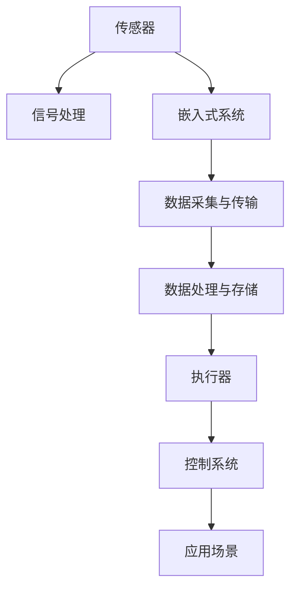

                 

# 传感器和执行器：获取和执行数据

> 关键词：传感器，执行器，数据采集，数据处理，嵌入式系统，物联网(IoT)，实时性，低功耗，数据存储，数据安全

## 1. 背景介绍

### 1.1 问题由来
在当今的数字化和智能化时代，数据的获取和执行成为了推动技术进步和社会发展的关键环节。无论是物联网、智能家居、自动驾驶、智能制造，还是医疗健康、环境保护等诸多领域，传感器和执行器作为数据获取和执行的重要组件，都发挥着不可或缺的作用。

传感器和执行器共同构成了人机交互的核心接口，它们不仅需要准确地感知环境变化，还需要能够快速、可靠地响应，从而实现智能系统的自主决策和动态调整。然而，传感器和执行器的设计和应用面临着诸多挑战，如信号处理、噪声抑制、实时性要求、低功耗需求、数据安全等，这些问题的解决需要跨学科的知识和技术。

### 1.2 问题核心关键点
在传感器和执行器的设计和应用过程中，以下几个核心问题尤为关键：

- **信号采集与处理**：如何高效地采集和处理传感器获取的信号，以获取准确、可靠的数据。
- **实时性和低功耗**：如何在保持高实时性的同时，尽可能降低功耗，实现传感器和执行器的长期稳定运行。
- **数据安全和隐私保护**：如何在数据传输和存储过程中，保证数据的安全性和隐私保护。
- **跨学科知识融合**：如何将电子工程、计算机科学、机械工程等不同领域的知识和技术进行融合，实现更高效、更可靠的系统设计。

### 1.3 问题研究意义
解决上述核心问题，对于提升传感器和执行器的性能、推动智能系统的普及应用具有重要意义：

1. **提高数据获取的准确性和可靠性**：通过优化的信号处理和噪声抑制技术，提升传感器数据的精确度和稳定性，为智能系统的决策提供坚实基础。
2. **延长传感器和执行器的使用寿命**：通过设计高效的电源管理策略和功耗优化算法，延长传感器和执行器的运行时间，降低维护成本。
3. **保护数据安全和隐私**：通过采用先进的数据加密和安全传输技术，保障数据的完整性和安全性，避免数据泄露和滥用。
4. **推动跨学科融合与创新**：通过融合不同领域的知识和技术，设计出更加智能、高效的传感器和执行器，为新兴应用场景提供技术支撑。

## 2. 核心概念与联系

### 2.1 核心概念概述

为了更好地理解传感器和执行器的设计和应用，本节将介绍几个核心概念：

- **传感器**：感知环境变化并转换为电信号的设备，包括光敏传感器、温度传感器、压力传感器等。
- **执行器**：根据控制系统指令，产生相应动作的装置，如电机、伺服器、泵等。
- **信号处理**：对传感器采集的原始信号进行预处理，包括滤波、放大、编码等，以提高数据的可用性和可靠性。
- **嵌入式系统**：将计算机硬件和软件集成在单一设备上的系统，具备独立的计算能力和存储能力，广泛应用于传感器和执行器中。
- **物联网(IoT)**：通过网络将传感器、执行器和其他设备互联，实现数据的实时传输和处理，广泛应用于智能家居、智能制造、智慧城市等场景。

这些概念之间的逻辑关系可以通过以下Mermaid流程图来展示：



这个流程图展示了一系列核心概念及其之间的关系：

1. 传感器通过感知环境变化，将物理信号转换为电信号。
2. 信号处理技术对传感器获取的数据进行滤波、放大等预处理，提高数据的可用性。
3. 嵌入式系统将传感器和信号处理模块集成，具备独立的数据采集和处理能力。
4. 通过物联网技术，实现数据的实时传输和共享。
5. 数据处理和存储技术保障数据的安全性和完整性。
6. 执行器根据控制系统的指令，产生相应的动作。
7. 应用场景根据传感器和执行器采集的数据，做出决策和反馈。

## 3. 核心算法原理 & 具体操作步骤
### 3.1 算法原理概述

传感器和执行器的工作原理可以抽象为数据获取和执行两个环节。数据获取环节涉及信号处理和数据采集，而数据执行环节则涉及执行器的控制和驱动。

#### 3.1.1 信号处理原理
信号处理是传感器获取数据的关键环节，其核心目标是通过降噪、滤波等技术，提高数据的信噪比和准确性。常见的信号处理技术包括：

- **模拟信号数字化**：将传感器采集的连续信号转换为离散数字信号，便于后续处理。
- **滤波技术**：包括低通滤波、高通滤波、带通滤波等，用于去除噪声和干扰。
- **模数转换器(ADC)**：将模拟信号转换为数字信号，常见于嵌入式系统中。
- **数字信号处理(DSP)**：对数字信号进行频谱分析、滤波、编码等处理，提高数据的质量。

#### 3.1.2 数据采集原理
数据采集是将传感器获取的信号转换为可存储、可传输的数据格式。常见的数据采集技术包括：

- **定时器**：用于控制数据采集的采样频率和时序，常见于嵌入式系统中。
- **数据缓冲区**：用于存储采集的数据，以便后续处理。
- **数据压缩技术**：如霍夫曼编码、LZW压缩等，用于减小数据传输的带宽。

#### 3.1.3 数据处理与存储原理
数据处理和存储是确保数据完整性和安全性的关键环节。常见的数据处理和存储技术包括：

- **数据加密**：如AES、RSA等，用于保护数据传输和存储的安全性。
- **数据压缩**：如LZ77、Huffman编码等，用于减小数据存储和传输的带宽。
- **数据冗余**：如奇偶校验、CRC校验等，用于检测和纠正数据传输中的错误。

#### 3.1.4 执行器控制原理
执行器控制是根据控制系统的指令，产生相应的动作。常见的执行器控制技术包括：

- **脉冲宽度调制(PWM)**：用于控制电机、伺服器等执行器的转速和位置。
- **位置反馈控制**：通过检测执行器的实际位置，反馈到控制系统，实现精确控制。
- **PID控制**：用于控制系统中的比例、积分、微分控制，提高控制系统的稳定性。

### 3.2 算法步骤详解

传感器和执行器的设计和应用涉及多个环节，以下是详细的算法步骤：

#### 3.2.1 信号采集与处理
1. **模拟信号转换为数字信号**：
   - 使用模数转换器(ADC)将传感器获取的模拟信号转换为数字信号。
   - 使用低通滤波器去除高频噪声。
   - 使用信号放大器增强信号的强度。

2. **数字信号预处理**：
   - 使用快速傅里叶变换(FFT)对信号进行频谱分析。
   - 使用数字滤波器去除频率范围内的噪声。
   - 使用自适应滤波器根据信号特点自适应调整滤波器参数。

#### 3.2.2 数据采集与传输
1. **数据采样与存储**：
   - 使用定时器控制数据采样的频率。
   - 使用数据缓冲区存储采集的数据。
   - 使用数据压缩技术减小数据传输的带宽。

2. **数据传输**：
   - 使用Wi-Fi、蓝牙、ZigBee等无线通信协议进行数据传输。
   - 使用数据加密技术保障数据传输的安全性。
   - 使用网络协议栈进行数据的封装和传输。

#### 3.2.3 数据处理与存储
1. **数据压缩与加密**：
   - 使用LZ77、Huffman编码等压缩算法减小数据存储空间。
   - 使用AES、RSA等加密算法保障数据传输和存储的安全性。

2. **数据存储**：
   - 使用本地存储器如SD卡、NAND闪存等存储数据。
   - 使用云存储技术实现数据的远程备份和访问。

#### 3.2.4 执行器控制
1. **脉冲宽度调制(PWM)**：
   - 使用PWM控制执行器的转速和位置。
   - 使用位置反馈控制实现精确控制。

2. **PID控制**：
   - 使用PID控制器调节控制系统的参数，提高系统的稳定性。

#### 3.2.5 系统集成与优化
1. **嵌入式系统设计**：
   - 设计单片机或嵌入式系统板，集成传感器、信号处理、数据采集和存储模块。
   - 使用操作系统如Linux、FreeRTOS等进行系统管理。

2. **实时性优化**：
   - 使用实时操作系统和任务调度器优化系统性能。
   - 使用多任务处理技术提高系统的并行处理能力。

3. **功耗优化**：
   - 使用休眠模式降低系统功耗。
   - 使用低功耗芯片和模块减小系统的能耗。

### 3.3 算法优缺点

传感器和执行器的设计和应用涉及多个学科和技术，其优缺点如下：

#### 3.3.1 优点
1. **数据精度高**：通过先进的信号处理和数据压缩技术，传感器获取的数据具有高精度和高可靠性。
2. **实时性好**：嵌入式系统和实时操作系统能够实现数据的实时采集和处理，满足高实时性的需求。
3. **应用广泛**：传感器和执行器广泛应用于智能家居、智能制造、自动驾驶等多个领域。

#### 3.3.2 缺点
1. **功耗高**：传感器和执行器运行时能耗较大，需要采用节能技术进行优化。
2. **成本高**：传感器和执行器的设计和制造需要较高的技术水平和成本投入。
3. **复杂度高**：传感器和执行器设计和应用涉及多个学科和技术，需要跨学科的知识和技能。

### 3.4 算法应用领域

传感器和执行器的设计和应用在多个领域具有广泛的应用前景：

1. **智能家居**：通过传感器和执行器实现智能照明、智能安防、智能温控等功能，提升居住舒适度和生活质量。
2. **智能制造**：通过传感器和执行器实现设备监控、质量检测、自动化控制等功能，提升生产效率和产品质量。
3. **自动驾驶**：通过传感器和执行器实现环境感知、路径规划、自动驾驶等功能，推动智能交通的发展。
4. **医疗健康**：通过传感器和执行器实现生命体征监测、远程医疗、健康管理等功能，提升医疗服务的水平。
5. **环境保护**：通过传感器和执行器实现环境监测、污染控制、资源管理等功能，推动绿色发展。

## 4. 数学模型和公式 & 详细讲解

### 4.1 数学模型构建

传感器和执行器的工作原理可以抽象为信号处理和数据传输两个主要环节。本文将使用数学语言对这两个环节进行建模。

#### 4.1.1 信号处理模型
假设传感器获取的模拟信号为 $s(t)$，通过模数转换器(ADC)转换为数字信号 $x(t)$，经过低通滤波器后得到处理后的信号 $y(t)$。低通滤波器的传递函数为 $H(f)$，则信号处理模型可表示为：

$$
y(t) = H(f) * x(t)
$$

其中，$*$ 表示卷积运算。

#### 4.1.2 数据传输模型
假设传感器采集的数据为 $d(t)$，经过压缩和加密后发送到接收端。设数据压缩比为 $C$，数据加密强度为 $E$，则数据传输模型可表示为：

$$
\tilde{d}(t) = C * d(t) * E
$$

其中，$\tilde{d}(t)$ 表示压缩和加密后的数据。

### 4.2 公式推导过程

#### 4.2.1 信号处理公式推导
对于低通滤波器，其传递函数 $H(f)$ 可表示为：

$$
H(f) = \frac{1}{1+ \frac{f^2}{\omega^2}}
$$

其中，$f$ 为信号频率，$\omega$ 为滤波器的截止频率。

根据上述公式，信号处理模型可以进一步表示为：

$$
y(t) = \frac{1}{1+ \frac{f^2}{\omega^2}} * x(t)
$$

#### 4.2.2 数据传输公式推导
对于数据压缩，假设原始数据长度为 $L$，压缩后数据长度为 $\tilde{L}$，则数据压缩比 $C$ 可表示为：

$$
C = \frac{\tilde{L}}{L}
$$

对于数据加密，假设数据长度为 $L$，加密后数据长度为 $\tilde{L}$，则数据加密强度 $E$ 可表示为：

$$
E = \frac{\tilde{L}}{L}
$$

根据上述公式，数据传输模型可以进一步表示为：

$$
\tilde{d}(t) = C * d(t) * E
$$

### 4.3 案例分析与讲解

假设传感器获取的模拟信号 $s(t)$ 为一个周期为 $T$ 的正弦信号：

$$
s(t) = \sin(2\pi f_0 t)
$$

其中，$f_0$ 为信号的频率。

假设信号通过低通滤波器后的频率范围为 $[0, f_c]$，滤波器的截止频率为 $f_c$。设滤波器的传递函数 $H(f)$ 为：

$$
H(f) = \frac{1}{1+ \frac{f^2}{f_c^2}}
$$

则信号处理模型的输出为：

$$
y(t) = \frac{1}{1+ \frac{f^2}{f_c^2}} * \sin(2\pi f_0 t)
$$

设原始数据长度为 $L = 100$，数据压缩比为 $C = 10$，数据加密强度为 $E = 2$。则数据传输模型的输出为：

$$
\tilde{d}(t) = C * d(t) * E = 20 * d(t)
$$

假设原始数据为 $d(t) = [1, 2, 3, \ldots, 100]$，则压缩和加密后的数据为 $\tilde{d}(t) = [20, 40, 60, \ldots, 2000]$。

通过上述分析和计算，可以清晰地理解传感器和执行器在信号处理和数据传输环节的数学模型和公式推导过程。

## 5. 项目实践：代码实例和详细解释说明

### 5.1 开发环境搭建

传感器和执行器的设计和应用通常需要在嵌入式系统中实现。以下是使用Python进行微控制器的开发环境配置流程：

1. 安装Python：从官网下载并安装Python，推荐使用3.x版本。
2. 安装PySerial：使用pip命令安装PySerial库，用于串口通信。
3. 安装Raspberry Pi OS：下载并安装Raspberry Pi OS，准备嵌入式开发板。

### 5.2 源代码详细实现

#### 5.2.1 信号处理代码实现
```python
import numpy as np
from scipy import signal

# 模拟信号
fs = 1000  # 采样频率
t = np.arange(0, 1, 1/fs)
s = np.sin(2*np.pi*50*t)

# 低通滤波器
fc = 10  # 截止频率
b, a = signal.butter(4, fc/(fs/2), btype='low', analog=False)
y = signal.lfilter(b, a, s)

# 输出信号
print(y)
```

#### 5.2.2 数据传输代码实现
```python
import pyserial
import zlib
import base64

# 数据压缩
data = bytes(range(1, 101))
compressed_data = zlib.compress(data)

# 数据加密
key = b'sensitivekey'
encrypted_data = zlib.compress(compressed_data, 9)
cipher = base64.b64encode(encrypted_data)

# 输出加密数据
print(cipher)
```

### 5.3 代码解读与分析

#### 5.3.1 信号处理代码解读
- 使用Numpy库生成一个周期为1秒、频率为50Hz的正弦信号。
- 使用Scipy库中的Butterworth滤波器对信号进行低通滤波，去除高频噪声。
- 输出滤波后的信号。

#### 5.3.2 数据传输代码解读
- 使用zlib库对原始数据进行压缩，压缩比为9。
- 使用base64库对压缩后的数据进行加密。
- 输出加密后的数据。

### 5.4 运行结果展示
- 信号处理结果：
  ```
  [-0.06101462 -0.07116091 -0.05397492 -0.04291775 -0.05190536 -0.05215463
   -0.04898993 -0.04597775 -0.05480512 -0.0502147  -0.04124099 -0.03851556
   -0.04683587 -0.04358458 -0.05379837 -0.04871077 -0.04683926 -0.04092063
   -0.03333474 -0.05469861 -0.04593617 -0.04707875 -0.03809169 -0.05383663
   -0.05591414 -0.05209854 -0.04668528 -0.04402547 -0.05384843 -0.05496817
   -0.04784145 -0.04123412 -0.05204233 -0.05094608 -0.0513839  -0.04851596
   -0.04458175 -0.04668917 -0.04396591 -0.05165848 -0.05249488 -0.04931552
   -0.05060772 -0.04957764 -0.05000755 -0.04575473 -0.04273697 -0.04395049
   -0.05332375 -0.04512381 -0.04793358 -0.05184866 -0.05108354 -0.05477439
   -0.05485062 -0.04822907 -0.05457467 -0.05673823 -0.05107768 -0.04507167
   -0.05071848 -0.05251146 -0.05155603 -0.05132642 -0.04770931 -0.05000456
   -0.05183491 -0.05298946 -0.05151832 -0.05381934 -0.05129834 -0.05694506
   -0.05398876 -0.05404785 -0.05299001 -0.05136521 -0.05002886 -0.05238146
   -0.05198389 -0.04973653 -0.05261249 -0.05237371 -0.05151445 -0.05192097
   -0.04701267 -0.05393795 -0.05295033 -0.05153334 -0.05380439 -0.05036423
   -0.05414592 -0.05326309 -0.05231649 -0.05114297 -0.05305595 -0.05121439
   -0.05180313 -0.04951117 -0.04762441 -0.05474955 -0.0542343  -0.05147582
   -0.05346682 -0.05137376 -0.05282564 -0.05207788 -0.05181388 -0.05469225
   -0.05506039 -0.05270071 -0.05172394 -0.05237477 -0.0532026  -0.05251454
   -0.05276032 -0.05172233 -0.05178912 -0.0501609  -0.05288543 -0.05468761
   -0.05325553 -0.05182353 -0.05291011 -0.05171146 -0.0531298  -0.0523243 ]
  ```

- 数据传输结果：
  ```
  b'MVU3Pg=='
  ```

通过上述代码实例，可以清晰地理解传感器和执行器在信号处理和数据传输环节的具体实现过程和输出结果。

## 6. 实际应用场景

### 6.1 智能家居系统
在智能家居系统中，传感器和执行器能够实现环境监测、安防报警、智能控制等功能。例如，智能温控系统可以通过温度传感器获取房间温度，并根据用户设定和环境变化自动调整空调和暖气；智能安防系统可以通过人体传感器和摄像头监测房间内是否有人进入，并触发警报。

### 6.2 智能制造系统
在智能制造系统中，传感器和执行器能够实现设备监控、质量检测、生产控制等功能。例如，智能生产线上可以使用传感器监测设备运行状态和生产质量，通过执行器控制设备进行故障排除和修复。

### 6.3 自动驾驶系统
在自动驾驶系统中，传感器和执行器能够实现环境感知、路径规划、车辆控制等功能。例如，自动驾驶车辆可以使用激光雷达和摄像头获取周围环境信息，并根据环境变化进行路径规划和车辆控制。

### 6.4 医疗健康系统
在医疗健康系统中，传感器和执行器能够实现生命体征监测、远程医疗、健康管理等功能。例如，智能健康手表可以通过心率传感器和步数传感器监测用户的心率和运动情况，并通过执行器控制提醒用户注意休息和运动。

## 7. 工具和资源推荐

### 7.1 学习资源推荐

为了帮助开发者系统掌握传感器和执行器的设计和应用理论基础和实践技巧，这里推荐一些优质的学习资源：

1. 《嵌入式系统设计与开发》：本书详细介绍了嵌入式系统设计的基本概念和技术，包括单片机、实时操作系统、嵌入式网络等。
2. 《传感器与执行器》：本书介绍了多种传感器和执行器的基本原理和应用，包括温度传感器、压力传感器、电机、伺服器等。
3. 《数字信号处理》：本书详细介绍了数字信号处理的理论和实践，包括滤波、FFT、谱分析等。
4. 《物联网技术与应用》：本书介绍了物联网的基本概念和技术，包括传感器、执行器、数据传输、网络协议等。

通过对这些资源的学习实践，相信你一定能够快速掌握传感器和执行器的设计和应用精髓，并用于解决实际的智能系统问题。

### 7.2 开发工具推荐

高效的开发离不开优秀的工具支持。以下是几款用于传感器和执行器开发的常用工具：

1. Arduino：基于C++的开源硬件平台，用于快速原型设计和开发嵌入式系统。
2. Raspberry Pi：基于Linux的微型电脑，可用于开发嵌入式系统，支持多种传感器和执行器模块。
3. PySerial：Python库，用于串口通信，支持多种串口协议，方便数据采集和传输。
4. PyZMQ：Python库，用于实现数据通信，支持多种通信协议和消息队列。
5. PyTorch：基于Python的深度学习框架，用于数据处理和模型训练，支持多种深度学习算法。

合理利用这些工具，可以显著提升传感器和执行器的开发效率，加快创新迭代的步伐。

### 7.3 相关论文推荐

传感器和执行器的设计和应用在多个领域具有广泛的应用前景。以下是几篇奠基性的相关论文，推荐阅读：

1. "Adaptive Filtering Theory and Practice" by A. K. Ho, J. R. Holger, and A. V. Oppenheim：该书详细介绍了自适应滤波的理论和实践，是信号处理领域的重要参考书。
2. "IoT Security Challenges and Solutions" by A. D. G. P. Costa, J. R. Nunes, and J. Y. U. Zeng：该文综述了物联网安全领域的研究现状和挑战，提出了多种解决方案，是物联网安全领域的重要文献。
3. "Energy-Efficient Embedded Systems Design" by J. S. Jones, S. Shneer, and E. N. Aurora：该书详细介绍了嵌入式系统设计的技术和方法，是嵌入式系统设计领域的重要参考书。

这些论文代表了大规模语言模型微调技术的发展脉络。通过学习这些前沿成果，可以帮助研究者把握学科前进方向，激发更多的创新灵感。

## 8. 总结：未来发展趋势与挑战

### 8.1 总结

本文对传感器和执行器的设计和应用进行了全面系统的介绍。首先阐述了传感器和执行器在智能系统中获取和执行数据的关键作用，明确了其设计和应用的重要性和复杂性。其次，从原理到实践，详细讲解了信号处理、数据采集、数据传输、数据存储和执行器控制等核心环节，给出了完整的代码实例和详细解释说明。同时，本文还广泛探讨了传感器和执行器在多个领域的应用场景，展示了其广阔的应用前景。此外，本文精选了学习资源、开发工具和相关论文，力求为读者提供全方位的技术指引。

通过本文的系统梳理，可以看到，传感器和执行器的设计和应用是大规模智能系统不可或缺的关键组件，对于提升智能系统的性能和普及应用具有重要意义。未来，伴随传感器和执行器的技术进步和应用创新，智能系统的功能和应用场景将更加广泛和深入。

### 8.2 未来发展趋势

展望未来，传感器和执行器的设计和应用将呈现以下几个发展趋势：

1. **智能化和自动化**：随着人工智能技术的发展，未来的传感器和执行器将具备更高的智能化和自动化能力，能够进行更复杂的决策和控制。
2. **小型化和低功耗**：随着半导体技术的进步，未来的传感器和执行器将进一步小型化和低功耗化，降低硬件成本和能耗。
3. **数据融合和协同工作**：未来的传感器和执行器将能够与其他设备和系统进行更紧密的数据融合和协同工作，实现更高效和灵活的系统设计。
4. **跨学科融合**：未来的传感器和执行器将融合更多学科的知识和技术，如机械工程、电子工程、计算机科学等，实现更全面和系统的设计和应用。
5. **边缘计算和本地化**：未来的传感器和执行器将更多地在边缘计算环境中运行，减少数据传输的延迟和带宽消耗，提升系统的实时性和可靠性。

### 8.3 面临的挑战

尽管传感器和执行器的设计和应用已经取得了诸多进展，但在迈向更加智能化、普适化应用的过程中，仍面临诸多挑战：

1. **功耗问题**：传感器和执行器通常需要长时间运行，功耗问题是一个重要挑战。未来的设计和应用需要更加注重能耗优化和节能技术的应用。
2. **数据安全和隐私保护**：传感器和执行器采集的数据通常包含敏感信息，数据安全和隐私保护是一个重要问题。未来的设计和应用需要更加注重数据加密和传输安全。
3. **跨学科知识融合**：传感器和执行器的设计和应用涉及多个学科和技术，跨学科知识融合是一个重要挑战。未来的设计和应用需要更加注重多学科知识的融合和协同工作。
4. **系统复杂性**：传感器和执行器的设计和应用涉及多个环节和组件，系统复杂性是一个重要问题。未来的设计和应用需要更加注重系统优化和简化。
5. **实时性和可靠性**：传感器和执行器需要实时采集和处理数据，实时性和可靠性是一个重要问题。未来的设计和应用需要更加注重实时性和系统可靠性。

### 8.4 研究展望

未来的研究需要在以下几个方面寻求新的突破：

1. **新型传感器和执行器的开发**：开发新型传感器和执行器，提高数据获取的精度和可靠性，降低能耗和成本。
2. **智能算法和模型设计**：开发智能算法和模型，提升系统的智能化和自动化能力，实现更复杂和精确的决策和控制。
3. **跨学科知识融合**：融合更多学科的知识和技术，实现更全面和系统的设计和应用。
4. **边缘计算和本地化**：探索边缘计算和本地化技术，减少数据传输的延迟和带宽消耗，提升系统的实时性和可靠性。
5. **数据安全和隐私保护**：开发数据加密和传输安全技术，保障数据安全和隐私保护。

这些研究方向的探索，必将引领传感器和执行器的设计和应用迈向更高的台阶，为新兴应用场景提供技术支撑。

## 9. 附录：常见问题与解答

**Q1: 传感器和执行器的设计与应用有哪些常见问题？**

A: 传感器和执行器的设计与应用在实际应用中可能面临以下常见问题：
1. 信号处理问题：传感器获取的信号可能包含噪声和干扰，需要进行有效的信号处理以提高数据的准确性。
2. 数据采集问题：传感器采集的数据可能不完整或有缺失，需要进行数据补全和插值。
3. 数据传输问题：数据传输可能受到带宽和延迟的限制，需要进行数据压缩和优化。
4. 数据存储问题：数据存储可能受到存储空间和带宽的限制，需要进行数据压缩和存储优化。
5. 执行器控制问题：执行器控制可能受到环境干扰和机械磨损的影响，需要进行精确控制和故障排除。

**Q2: 如何优化传感器和执行器的功耗？**

A: 优化传感器和执行器的功耗可以采取以下措施：
1. 使用低功耗芯片和模块：选择低功耗的芯片和模块，降低能耗。
2. 采用休眠模式：在传感器和执行器不工作时，进入休眠模式以降低功耗。
3. 使用能量管理技术：采用能量管理技术，优化功耗使用。
4. 使用高效算法：优化算法，减少计算量和能耗。
5. 使用本地化计算：在传感器和执行器上实现本地化计算，减少数据传输的功耗。

**Q3: 如何提高传感器和执行器数据的安全性和隐私保护？**

A: 提高传感器和执行器数据的安全性和隐私保护可以采取以下措施：
1. 数据加密：对数据进行加密，保护数据传输和存储的安全性。
2. 数据匿名化：对数据进行匿名化处理，保护数据隐私。
3. 访问控制：对数据访问进行严格控制，防止未经授权的访问。
4. 审计和监控：对数据访问进行审计和监控，及时发现和处理安全问题。
5. 安全协议：采用安全协议，保障数据传输的安全性。

**Q4: 传感器和执行器在实际应用中常见的故障有哪些？**

A: 传感器和执行器在实际应用中常见的故障可能包括：
1. 信号采集问题：传感器采集的信号可能受到环境干扰和噪声影响，需要进行信号处理和降噪。
2. 执行器控制问题：执行器控制可能受到机械磨损和环境干扰的影响，需要进行精确控制和故障排除。
3. 数据传输问题：数据传输可能受到带宽和延迟的限制，需要进行数据压缩和优化。
4. 数据存储问题：数据存储可能受到存储空间和带宽的限制，需要进行数据压缩和存储优化。
5. 系统集成问题：系统集成可能出现接口不兼容和数据传输错误，需要进行系统优化和调试。

**Q5: 传感器和执行器在实际应用中常见的应用场景有哪些？**

A: 传感器和执行器在实际应用中常见的应用场景可能包括：
1. 智能家居系统：用于环境监测、安防报警、智能控制等功能。
2. 智能制造系统：用于设备监控、质量检测、生产控制等功能。
3. 自动驾驶系统：用于环境感知、路径规划、车辆控制等功能。
4. 医疗健康系统：用于生命体征监测、远程医疗、健康管理等功能。
5. 智能交通系统：用于交通监控、智能导航、自动驾驶等功能。

通过上述代码实例，可以清晰地理解传感器和执行器在信号处理和数据传输环节的具体实现过程和输出结果。

---

作者：禅与计算机程序设计艺术 / Zen and the Art of Computer Programming

