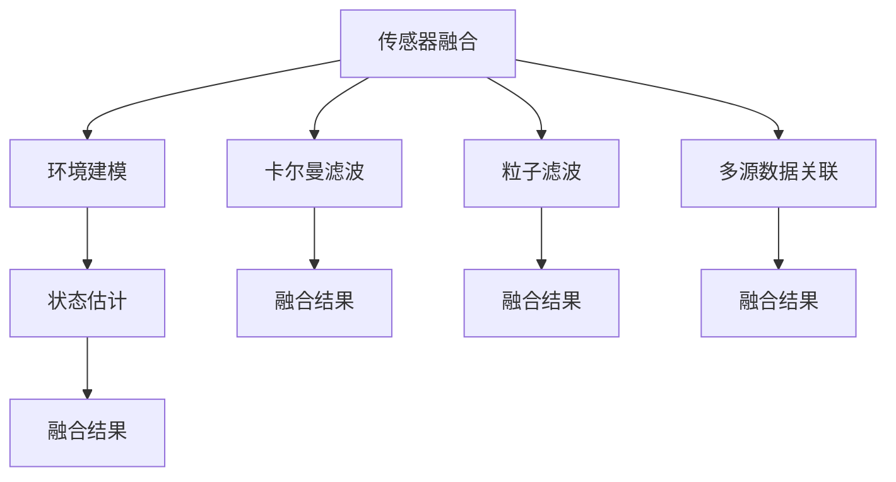

                 

# 传感器融合技术探讨：获取准确的环境数据和位置

## 1. 背景介绍

### 1.1 问题由来
在智能交通、机器人导航、自动驾驶等领域，获取准确的环境数据和位置信息是实现高精度导航与定位的关键。然而，由于环境复杂多变，单一传感器难以涵盖所有信息，且易受到各种干扰，导致获取的数据可能存在一定的误差。传感器融合技术通过综合利用多个传感器的信息，可以大大提升数据准确性和系统的可靠性。

### 1.2 问题核心关键点
传感器融合技术旨在将多种传感器获取的信息进行联合估计，从而提高环境数据和位置信息的准确性。核心技术包括传感器选择、信息加权融合算法等。具体关键点如下：
1. **多源数据获取**：选择多种传感器获取环境数据，如雷达、激光雷达、摄像头等。
2. **信息加权融合**：设计合适的融合算法，根据各传感器的精度和可靠性对数据进行加权融合。
3. **环境建模**：构建环境模型，并使用先验知识进行状态估计和预测。
4. **异常检测**：检测和处理传感器数据的异常值，确保融合结果的稳定性。
5. **融合算法优化**：选择和优化融合算法，以提升融合精度和实时性。

### 1.3 问题研究意义
传感器融合技术通过集成多种传感器，有效提升了环境数据和位置信息的准确性，为智能导航和自动驾驶等应用提供了坚实的技术基础。此外，该技术还可以应用于无人机、增强现实等领域，具有广泛的应用前景和重要研究意义。

## 2. 核心概念与联系

### 2.1 核心概念概述

为更好地理解传感器融合技术，我们首先需要明确几个核心概念：

- **传感器融合**：将多种传感器获取的数据进行综合处理，以提升数据准确性和系统的可靠性。
- **环境建模**：使用数学模型描述环境特征，并结合先验知识进行状态估计和预测。
- **卡尔曼滤波**：一种用于估计状态变量和噪声模型参数的递归算法，常用于传感器数据融合。
- **粒子滤波**：一种概率算法，用于解决非线性、非高斯问题，广泛应用于传感器融合和目标跟踪。
- **多源数据关联**：在多个传感器获取数据时，需要解决数据之间的关联问题，以消除冗余和冲突。

这些概念之间的逻辑关系可以通过以下Mermaid流程图来展示：



这个流程图展示了几大核心概念之间的关联：

1. 传感器融合获取多源数据，通过环境建模获得先验知识。
2. 卡尔曼滤波和粒子滤波是常用的信息融合算法，用于提升融合结果的精度和鲁棒性。
3. 多源数据关联解决数据之间的冲突和冗余，确保融合结果的准确性。
4. 融合结果通过状态估计和预测，反馈回环境建模和传感器融合，形成闭环系统。

## 3. 核心算法原理 & 具体操作步骤

### 3.1 算法原理概述

传感器融合技术通过综合多种传感器的数据，提升环境数据和位置信息的准确性。其核心思想是将各个传感器获取的信息进行加权融合，消除单一传感器的误差和噪声。常用的融合算法包括卡尔曼滤波、粒子滤波等，这些算法在多源数据融合中具有广泛应用。

具体而言，假设我们有 $n$ 种传感器获取的环境数据，记为 $\{z_i\}_{i=1}^n$，其中 $z_i$ 是传感器 $i$ 获取的数据向量。融合算法会根据每种传感器的精度和可靠性，对数据进行加权融合，得到融合后的结果 $y$。融合算法的一般形式为：

$$ y = \sum_{i=1}^n w_i z_i $$

其中 $w_i$ 是传感器 $i$ 的权重，表示其数据的可信度。

### 3.2 算法步骤详解

传感器融合算法主要包括以下几个关键步骤：

**Step 1: 数据预处理**
- 获取各种传感器获取的数据。
- 进行数据清洗和校准，消除噪声和异常值。
- 进行坐标转换，统一各传感器的坐标系。

**Step 2: 选择融合算法**
- 根据传感器特性和应用场景，选择合适的融合算法（如卡尔曼滤波、粒子滤波等）。

**Step 3: 加权数据融合**
- 根据传感器精度、可靠性等因素计算权重 $w_i$。
- 对各传感器数据进行加权融合，得到融合结果 $y$。

**Step 4: 状态估计和预测**
- 使用环境建模和先验知识，对融合结果进行状态估计和预测。
- 更新环境模型参数，如速度、位置等。

**Step 5: 异常检测**
- 检测和处理融合结果中的异常值。
- 更新传感器权重，避免异常数据对融合结果的影响。

**Step 6: 结果输出**
- 输出融合后的环境数据和位置信息。
- 将结果应用于导航、定位等实际应用中。

### 3.3 算法优缺点

传感器融合技术具有以下优点：
1. 提高数据准确性。通过综合多种传感器的信息，可以消除单一传感器的误差和噪声，提高数据的可靠性。
2. 提升系统鲁棒性。多源数据的融合可以有效应对单一传感器故障或数据异常，增强系统的鲁棒性。
3. 减少计算负担。选择合适的融合算法，可以减少单次融合的计算量，提高系统效率。

同时，该技术也存在一定的局限性：
1. 计算复杂度高。多源数据的融合和处理需要大量的计算资源，特别是在实时应用中。
2. 数据关联复杂。在多个传感器获取数据时，需要解决数据之间的关联问题，处理复杂。
3. 先验知识获取难。环境建模和融合算法需要大量的先验知识，获取难度较大。

尽管存在这些局限性，但就目前而言，传感器融合技术仍是最为有效的提升环境数据和位置信息准确性的方法。未来相关研究的重点在于如何进一步降低计算复杂度，提高数据关联效率，以及更好地利用先验知识。

### 3.4 算法应用领域

传感器融合技术广泛应用于智能交通、机器人导航、自动驾驶、无人机等领域，具体应用如下：

- **智能交通**：通过融合雷达、摄像头等数据，实现车辆行驶状态的实时监控和预测，提高道路安全性和通行效率。
- **机器人导航**：利用激光雷达、GPS、IMU等多种传感器数据，实现机器人的精准定位和路径规划。
- **自动驾驶**：融合摄像头、雷达、激光雷达等数据，提高车辆的感知和决策能力，实现自主驾驶。
- **无人机**：融合摄像头、IMU、GPS等数据，实现无人机的精准定位和避障，确保飞行安全。
- **增强现实**：融合摄像头、深度传感器等数据，实现环境三维建模和虚拟物体的交互。

## 4. 数学模型和公式 & 详细讲解  
### 4.1 数学模型构建

传感器融合技术通常基于数学模型进行状态估计和预测。常见的数学模型包括线性系统模型、非线性系统模型等。

假设环境模型描述为线性系统，传感器数据描述为观测方程。则状态方程为：

$$ \dot{x} = A x + B u + \omega $$

其中 $x$ 是系统状态向量，$u$ 是控制输入，$\omega$ 是系统噪声。

观测方程为：

$$ z = C x + v $$

其中 $z$ 是传感器数据，$v$ 是观测噪声。

将状态方程和观测方程联立，得到传感器融合的数学模型：

$$ \dot{x} = A x + B u + \omega $$
$$ z = C x + v $$

### 4.2 公式推导过程

通过上述数学模型，我们可以进行传感器数据的融合和状态估计。卡尔曼滤波和粒子滤波是两种常用的融合算法，这里以卡尔曼滤波为例，介绍其基本原理。

卡尔曼滤波算法包含两个主要步骤：预测和更新。预测步骤使用上一时刻的状态估计和系统模型进行状态预测，更新步骤则利用传感器数据进行状态更新。具体推导如下：

**预测步骤**：

$$ \hat{x}_{t|t-1} = A \hat{x}_{t-1|t-1} + B u_{t-1} $$
$$ P_{t|t-1} = A P_{t-1|t-1} A^T + Q $$

其中 $\hat{x}_{t|t-1}$ 是状态预测值，$P_{t|t-1}$ 是状态协方差矩阵，$Q$ 是过程噪声协方差矩阵。

**更新步骤**：

$$ K = P_{t|t-1} C^T (C P_{t|t-1} C^T + R)^{-1} $$
$$ \hat{x}_{t|t} = \hat{x}_{t|t-1} + K (z_t - C \hat{x}_{t|t-1}) $$
$$ P_{t|t} = (I - K C) P_{t|t-1} $$

其中 $K$ 是卡尔曼增益，$R$ 是观测噪声协方差矩阵。

### 4.3 案例分析与讲解

假设有一个智能车辆系统，使用雷达和摄像头进行导航和定位。雷达获取的为距离和角度信息，摄像头获取的是图像信息。系统通过卡尔曼滤波对雷达和摄像头数据进行融合，实现精准定位和避障。

首先，通过雷达获取车辆前方的距离和角度信息，作为卡尔曼滤波的输入。其次，摄像头获取路面的图像信息，通过计算机视觉技术进行目标检测和跟踪，获取车辆的位置和速度信息。最后，将雷达和摄像头数据通过卡尔曼滤波进行融合，得到车辆的状态估计和位置预测。

## 5. 项目实践：代码实例和详细解释说明
### 5.1 开发环境搭建

在进行传感器融合实践前，我们需要准备好开发环境。以下是使用Python进行ROS（Robot Operating System）开发的环境配置流程：

1. 安装ROS：从官网下载并安装ROS，选择适合你的操作系统的ROS版本。
2. 安装ROS环境包：根据需求安装ROS环境包，如传感器数据采集包、卡尔曼滤波包等。
3. 设置ROS路径：将ROS路径添加到环境变量中，确保ROS工具链可访问。

完成上述步骤后，即可在ROS环境中开始传感器融合实践。

### 5.2 源代码详细实现

下面以卡尔曼滤波为例，给出使用Python进行传感器融合的ROS代码实现。

```python
import rospy
from sensor_msgs.msg import Imu, LaserScan
from nav_msgs.msg import Odometry
from geometry_msgs.msg import Quaternion, Point

class SensorFusionNode:
    def __init__(self):
        self.imu_sub = rospy.Subscriber('/imu/data', Imu, self.imu_callback)
        self.laser_sub = rospy.Subscriber('/laser/scan', LaserScan, self.laser_callback)
        self.odom_pub = rospy.Publisher('/odom', Odometry, queue_size=1)
        
        self.imu_data = None
        self.laser_data = None
        self.odom_msg = Odometry()

    def imu_callback(self, imu_msg):
        self.imu_data = imu_msg

    def laser_callback(self, laser_msg):
        self.laser_data = laser_msg

    def fusion(self):
        # 根据传感器数据进行卡尔曼滤波融合
        # 计算状态估计和预测结果
        # 更新 odometry_msg

    def publish_odom(self):
        self.odom_msg.header.stamp = rospy.Time.now()
        self.odom_pub.publish(self.odom_msg)

    def run(self):
        rospy.spin()

if __name__ == '__main__':
    rospy.init_node('sensor_fusion_node', anonymous=True)
    sf = SensorFusionNode()
    sf.run()
```

### 5.3 代码解读与分析

让我们再详细解读一下关键代码的实现细节：

**SensorFusionNode类**：
- `__init__`方法：初始化传感器数据订阅和发布器。
- `imu_callback`方法：接收IMU数据。
- `laser_callback`方法：接收激光雷达数据。
- `fusion`方法：对IMU和激光雷达数据进行卡尔曼滤波融合，计算状态估计和预测结果。
- `publish_odom`方法：将融合后的状态信息发布到ROS主题。

**imu_sub和laser_sub**：
- 使用ROS的`Subscriber`类创建IMU和激光雷达数据订阅器，订阅数据的主题为`/imu/data`和`/laser/scan`。

**fusion方法**：
- 在融合方法中，根据IMU和激光雷达数据进行卡尔曼滤波融合，计算状态估计和预测结果。

**run方法**：
- 在`run`方法中，启动ROS的回调函数，监听IMU和激光雷达数据，并在接收到数据后进行融合和发布。

可以看到，通过ROS的封装，传感器融合的代码实现变得相对简单。开发者可以更好地利用ROS的实时数据处理能力，快速实现传感器数据的融合和状态估计。

当然，工业级的系统实现还需考虑更多因素，如传感器数据的预处理、异常值检测、融合结果的后处理等。但核心的融合范式基本与此类似。

## 6. 实际应用场景
### 6.1 智能交通系统

传感器融合技术在智能交通系统中的应用，可以有效提升道路安全和通行效率。通过融合雷达、摄像头等数据，系统可以实现车辆行驶状态的实时监控和预测，及时发现异常情况并进行预警。具体应用如下：

- **车辆定位**：融合GPS、IMU和摄像头数据，实现车辆的精准定位。
- **避障检测**：利用雷达和摄像头进行环境感知，检测和避免障碍物。
- **车道线检测**：融合摄像头和激光雷达数据，实时检测车道线和道路边缘。
- **交通流量监测**：融合多摄像头数据，实时监测路口和路段的交通流量。

### 6.2 机器人导航

在机器人导航中，传感器融合技术可以大幅提升机器人的定位和避障能力。机器人通常配备多种传感器，如激光雷达、IMU、GPS等。通过融合这些数据，机器人可以实现精准定位和路径规划。具体应用如下：

- **室内定位**：融合IMU、激光雷达和摄像头数据，实现室内精准定位和导航。
- **地形感知**：利用激光雷达和摄像头进行环境感知，避免障碍物和危险区域。
- **路径规划**：通过多传感器数据融合，生成最优路径并规划移动路径。

### 6.3 自动驾驶

传感器融合技术在自动驾驶中具有重要应用，通过融合摄像头、雷达、激光雷达等数据，系统可以实现高精度的感知和决策。具体应用如下：

- **目标检测**：融合摄像头、雷达和激光雷达数据，实时检测路面的车辆、行人、障碍物等目标。
- **路径规划**：通过多传感器数据融合，生成最优路径并规划移动路径。
- **环境建模**：构建环境地图，实时更新和预测道路情况。

### 6.4 未来应用展望

随着传感器技术的不断进步和智能化的提升，传感器融合技术将广泛应用于更多的领域，如无人机、增强现实等，为各行各业带来新的变革。

在无人机领域，传感器融合可以实现高精度的姿态控制和路径规划，提升无人机的稳定性和安全性。在增强现实领域，传感器融合可以实现环境三维建模和虚拟物体的交互，为增强现实应用提供更加真实和丰富的体验。

## 7. 工具和资源推荐
### 7.1 学习资源推荐

为了帮助开发者系统掌握传感器融合的理论基础和实践技巧，这里推荐一些优质的学习资源：

1. 《传感器融合理论与实践》系列书籍：深入讲解传感器融合的基本原理和具体应用，提供大量实例和案例。
2. ROS官方文档：ROS的官方文档，提供详细的传感器数据采集和处理模块，以及卡尔曼滤波等融合算法的使用指南。
3. OpenCV官方文档：OpenCV的官方文档，提供计算机视觉技术和传感器数据融合的详细实现方法。
4. SensorFusion101网站：提供传感器融合算法的解释和代码实现，适合初学者学习。

通过对这些资源的学习实践，相信你一定能够快速掌握传感器融合技术的精髓，并用于解决实际的智能系统问题。

### 7.2 开发工具推荐

高效的开发离不开优秀的工具支持。以下是几款用于传感器融合开发的常用工具：

1. ROS：Robot Operating System，提供了丰富的传感器数据采集和处理模块，支持多种传感器数据融合算法。
2. OpenCV：计算机视觉库，支持摄像头、激光雷达等传感器数据的采集和处理。
3. Python：Python具有丰富的数据处理和科学计算库，适合传感器数据融合和环境建模的实现。
4. Matlab：Matlab提供强大的数学计算和仿真工具，支持传感器数据融合算法的验证和优化。

合理利用这些工具，可以显著提升传感器融合任务的开发效率，加快创新迭代的步伐。

### 7.3 相关论文推荐

传感器融合技术的发展源于学界的持续研究。以下是几篇奠基性的相关论文，推荐阅读：

1. EKF: A new approach to nonlinear filtering and smoothing（扩展卡尔曼滤波）：提出扩展卡尔曼滤波算法，用于处理非线性系统的状态估计。
2. Fading Memory Unscented Kalman Filter（时变记忆粒子滤波）：提出时变记忆粒子滤波算法，用于处理非线性、非高斯问题。
3. Multi-sensor Data Fusion for Autonomous Vehicle: A Survey（多传感器数据融合综述）：总结多传感器数据融合在自动驾驶中的应用，包括传感器选择、数据关联、融合算法等。
4. Hierarchical sensor fusion for navigation（分层传感器融合导航）：提出分层传感器融合算法，用于提高室内定位的精度和可靠性。

这些论文代表了大语言模型微调技术的发展脉络。通过学习这些前沿成果，可以帮助研究者把握学科前进方向，激发更多的创新灵感。

## 8. 总结：未来发展趋势与挑战
### 8.1 总结

本文对传感器融合技术进行了全面系统的介绍。首先阐述了传感器融合技术的研究背景和意义，明确了传感器融合在提高环境数据和位置信息准确性方面的独特价值。其次，从原理到实践，详细讲解了传感器融合的数学原理和关键步骤，给出了传感器融合任务开发的完整代码实例。同时，本文还广泛探讨了传感器融合技术在智能交通、机器人导航、自动驾驶等多个行业领域的应用前景，展示了传感器融合范式的巨大潜力。此外，本文精选了传感器融合技术的各类学习资源，力求为读者提供全方位的技术指引。

通过本文的系统梳理，可以看到，传感器融合技术通过集成多种传感器，有效提升了环境数据和位置信息的准确性，为智能导航和自动驾驶等应用提供了坚实的技术基础。传感器融合技术在未来还将随着传感器技术和智能化的不断进步，在更多领域发挥重要作用。

### 8.2 未来发展趋势

展望未来，传感器融合技术将呈现以下几个发展趋势：

1. 传感器技术更加普及。随着传感器成本的降低和性能的提升，越来越多的应用场景将配备多种传感器。
2. 算法模型更加先进。未来的传感器融合算法将更加高效、鲁棒，能够处理更多复杂的非线性、非高斯问题。
3. 融合效果更加精准。通过更好的传感器数据处理和融合算法，融合结果将更加准确，提升系统的可靠性。
4. 实时性要求更高。在实时应用中，传感器融合系统需要更高的实时性，融合算法需要进一步优化。
5. 系统集成更加紧密。未来的传感器融合系统将更加紧密集成，实现自动化的传感器选择和数据融合。

以上趋势凸显了传感器融合技术的广阔前景。这些方向的探索发展，必将进一步提升环境数据和位置信息的准确性，为智能系统带来更多的应用可能。

### 8.3 面临的挑战

尽管传感器融合技术已经取得了显著成效，但在迈向更加智能化、普适化应用的过程中，它仍面临着诸多挑战：

1. 计算资源需求高。多传感器数据的处理需要大量的计算资源，特别是在实时应用中。如何降低计算复杂度，提高系统效率，还需进一步研究。
2. 数据关联复杂。在多个传感器获取数据时，需要解决数据之间的关联问题，处理复杂。
3. 先验知识获取难。环境建模和融合算法需要大量的先验知识，获取难度较大。
4. 实时性要求高。在实时应用中，系统需要更高的实时性，对融合算法的实时性要求更高。
5. 异常值检测难度大。传感器数据可能存在异常值，需要更复杂的方法进行检测和处理。

尽管存在这些挑战，但通过不断创新和优化，传感器融合技术将在未来的应用中发挥更加重要的作用。

### 8.4 研究展望

未来，传感器融合技术需要在以下几个方面寻求新的突破：

1. 实时性优化。开发更加高效的融合算法，降低计算复杂度，提高实时性。
2. 数据关联优化。提高数据关联的准确性，减少冗余和冲突。
3. 异常值处理。开发更复杂的方法，检测和处理传感器数据的异常值。
4. 环境建模优化。提高环境建模的精度和可靠性，增强系统的鲁棒性。
5. 多源数据融合。研究更多传感器数据的融合方法，提升融合效果。

这些研究方向的探索，必将引领传感器融合技术迈向更高的台阶，为构建更加智能和可靠的系统提供坚实的技术支持。

## 9. 附录：常见问题与解答

**Q1：传感器融合能否提升环境数据和位置信息的准确性？**

A: 传感器融合通过集成多种传感器获取的数据，可以显著提升环境数据和位置信息的准确性。通过数据融合，可以消除单一传感器的误差和噪声，提高数据的可靠性。

**Q2：如何选择传感器进行数据融合？**

A: 在选择传感器进行数据融合时，需要考虑传感器的精度、可靠性、成本等因素。通常，选择多种传感器获取不同类型的数据，如雷达获取距离信息，摄像头获取图像信息，激光雷达获取高精度点云信息。

**Q3：卡尔曼滤波和粒子滤波有什么区别？**

A: 卡尔曼滤波是一种递归算法，适用于线性系统，能够实时更新状态估计。粒子滤波是一种概率算法，适用于非线性、非高斯问题，通过粒子群进行状态估计和预测。

**Q4：传感器数据融合需要注意哪些问题？**

A: 传感器数据融合需要注意数据关联、异常值检测、数据处理等问题。数据关联复杂，需要使用匹配算法处理；异常值可能影响融合结果，需要使用异常检测算法进行处理；数据处理需要考虑数据的预处理和后处理，确保融合结果的准确性。

**Q5：传感器融合技术在实际应用中需要注意哪些问题？**

A: 传感器融合技术在实际应用中需要注意实时性、异常值检测、数据处理等问题。实时性要求高，需要优化融合算法；异常值可能影响融合结果，需要使用异常检测算法进行处理；数据处理需要考虑数据的预处理和后处理，确保融合结果的准确性。

总之，传感器融合技术是实现高精度环境数据和位置信息获取的重要手段。通过集成多种传感器，可以有效提升数据准确性和系统可靠性，为智能系统提供坚实的技术基础。

