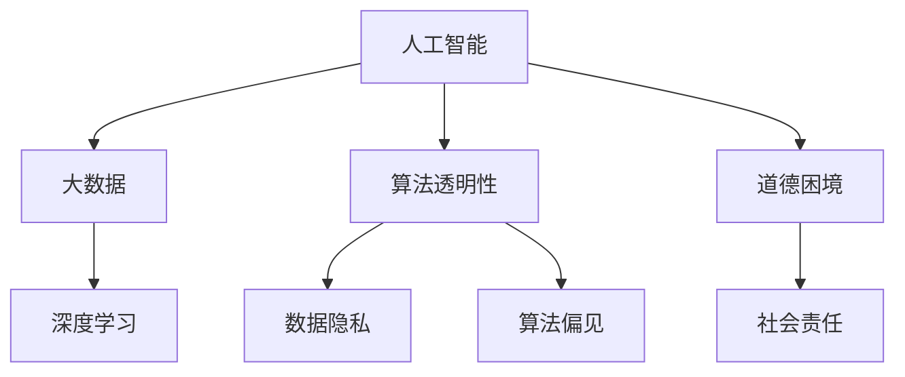

                 

# 伦理挑战：探讨人类计算带来的道德困境

> 关键词：人工智能, 伦理道德, 道德困境, 计算决策, 数据隐私, 算法透明性, 人机共生, 社会责任

## 1. 背景介绍

### 1.1 问题由来
随着人类计算能力的飞速提升，人工智能（AI）和大数据技术正在深刻改变我们的生产生活方式。人们开始广泛应用AI技术解决各种问题，从自动化生产到智能推荐，从疾病诊断到金融风控，AI技术无处不在。然而，AI技术的广泛应用也带来了一系列道德困境和伦理问题，挑战着人类的道德规范和社会价值观。

### 1.2 问题核心关键点
当前，AI技术在社会各领域的应用日趋成熟，但其背后的伦理问题也不断凸显，主要体现在以下几个方面：
1. 数据隐私和信息安全：AI模型往往需要大量数据进行训练，这些数据可能包含个人隐私信息，若保护不当，将导致隐私泄露。
2. 算法透明性和可解释性：许多AI模型如深度神经网络，其决策过程往往不透明，难以理解和解释，导致信任危机。
3. 责任归属和责任划分：AI模型在决策过程中可能出现错误，如何界定责任主体，是道德和法律面临的新挑战。
4. 人机共生和决策权衡：AI技术的广泛应用，引发了关于人类应如何与AI共生，以及在哪些场景下应由人类还是AI做决策的争论。
5. 社会公平和伦理正义：AI技术可能加剧社会不平等，如何确保技术带来的利益普惠于全社会，保障公正与平等，是伦理研究的重要方向。

这些问题亟待我们深入探讨，并采取有效措施加以解决，以确保AI技术在道德和伦理层面的可接受性和可持续性。

## 2. 核心概念与联系

### 2.1 核心概念概述

为更好地理解AI技术带来的伦理挑战，本节将介绍几个关键概念：

- **人工智能（AI）**：通过机器学习、数据挖掘、自然语言处理等技术，赋予机器类似人类的智能能力。
- **大数据**：指规模大、复杂多样、高速更新的数据集，是AI技术的重要基础。
- **深度学习**：一种特殊的机器学习方法，通过多层神经网络模型，自动从数据中提取高层次特征。
- **算法透明性**：指AI模型的决策过程和方法应公开透明，以便于理解和审查。
- **数据隐私**：指个人或组织的隐私信息在数据采集、存储、使用等环节应得到保护。
- **算法偏见**：指AI模型在训练和应用过程中可能出现对某些群体的歧视性行为，如性别、种族、年龄等。
- **道德困境**：指在AI技术应用过程中，出现的难以两全其美的道德选择和问题。
- **社会责任**：指AI开发者和应用者在技术开发和应用过程中应承担的责任和义务。

这些概念之间的逻辑关系可以通过以下Mermaid流程图来展示：



这个流程图展示了AI技术的基础、核心技术、关键伦理问题以及应对措施之间的联系，帮助读者系统地理解AI技术应用中的伦理挑战。

## 3. 核心算法原理 & 具体操作步骤
### 3.1 算法原理概述

AI技术的伦理问题，主要集中在数据隐私、算法透明性、责任归属、人机共生、社会公平等方面。以下将详细介绍这些问题的算法原理。

### 3.2 算法步骤详解

**3.2.1 数据隐私保护**

**隐私保护技术**：
1. **差分隐私（Differential Privacy）**：通过对数据添加噪声，确保单个数据点的隐私不会泄露。
2. **联邦学习（Federated Learning）**：在多个分布式设备上训练模型，数据不出本地，保护隐私。
3. **数据脱敏（Data De-identification）**：去除或模糊化数据中的个人标识信息，防止隐私泄露。

**具体实现步骤**：
1. 收集数据并预处理，去除敏感信息。
2. 根据具体需求选择差分隐私或联邦学习算法。
3. 对数据添加噪声或分布式训练模型。
4. 对数据进行脱敏，确保隐私信息不被泄露。

**3.2.2 算法透明性**

**透明性技术**：
1. **可解释AI（XAI）**：通过特征重要性、局部解释方法等，解释AI模型的决策过程。
2. **模型压缩**：通过减少模型复杂度，提升算法的透明性。
3. **模型可视化**：通过可视化工具，展示模型内部结构和决策路径。

**具体实现步骤**：
1. 收集模型的特征重要性或输出。
2. 选择可解释AI方法，如LIME、SHAP等。
3. 对模型进行压缩，如剪枝、量化等。
4. 使用可视化工具，展示模型内部结构。

**3.2.3 责任归属**

**责任归属技术**：
1. **可追溯性（Accountability）**：通过日志记录、审计机制等，确保模型决策的可追溯性。
2. **责任分配算法**：如基于贝叶斯网络的归责方法，分配模型决策的责任。
3. **法律框架**：如GDPR等法律，明确AI模型在决策过程中的法律责任。

**具体实现步骤**：
1. 记录模型的决策过程和参数。
2. 建立审计机制，确保模型的可追溯性。
3. 使用责任分配算法，明确各责任主体。
4. 遵守相关法律，确保合法合规。

**3.2.4 人机共生**

**共生技术**：
1. **人机协作**：设计人机交互界面，确保决策过程中人机协同。
2. **反馈机制**：建立用户反馈系统，优化AI模型的决策过程。
3. **决策树**：将决策过程分解为多个节点，每个节点由人或AI决策。

**具体实现步骤**：
1. 设计人机交互界面，确保用户输入和输出。
2. 建立用户反馈系统，收集用户意见。
3. 将决策过程分解为多个节点，每个节点由人或AI决策。
4. 根据反馈结果优化模型，确保决策过程透明。

**3.2.5 社会公平**

**公平性技术**：
1. **数据集多样性**：确保数据集包含多样化的样本，避免偏见。
2. **公平性算法**：如基于约束编程的公平性优化方法。
3. **伦理审查**：通过伦理审查机制，确保模型公平性。

**具体实现步骤**：
1. 收集多样化的数据集，确保数据集的多样性。
2. 选择公平性算法，如FairML等。
3. 进行伦理审查，确保模型公平性。
4. 持续监控模型性能，确保长期公平性。

### 3.3 算法优缺点

AI技术的伦理问题解决技术，虽然在某些方面取得了进展，但也存在一些局限性：
1. **隐私保护**：差分隐私和联邦学习虽然能有效保护隐私，但计算成本较高，难以应用于大规模数据集。
2. **算法透明性**：可解释AI和模型压缩能提升算法透明性，但复杂模型仍难以完全解释。
3. **责任归属**：责任分配算法和法律框架能有效界定责任，但具体执行仍需进一步细化。
4. **人机共生**：人机协作和反馈机制能有效协同决策，但用户参与度受限于设计和技术。
5. **社会公平**：数据多样性和公平性算法能有效提高模型公平性，但需持续监控和优化。

尽管存在这些局限性，但这些技术仍为解决AI伦理问题提供了重要工具，需进一步研究以应对实际挑战。

### 3.4 算法应用领域

AI伦理问题解决技术，在多个领域得到了广泛应用：

1. **医疗健康**：差分隐私保护患者隐私，算法透明性提升诊断和治疗决策的信任度，责任归属确保医疗事故追责。
2. **金融风控**：数据隐私保护客户数据，算法透明性提升风控模型决策的信任度，责任归属确保金融安全。
3. **智能推荐**：数据隐私保护用户数据，算法透明性提升推荐算法的公平性和信任度，责任归属明确推荐结果的责任。
4. **自动驾驶**：算法透明性提升自动驾驶决策的信任度，责任归属明确自动驾驶事故责任。
5. **教育公平**：数据集多样性确保教育模型公平性，算法透明性提升教育推荐的信任度，责任归属确保教育公正。

这些领域的应用，展示了AI伦理问题解决技术的巨大潜力和实际价值。

## 4. 数学模型和公式 & 详细讲解 & 举例说明

### 4.1 数学模型构建

在AI伦理问题的解决技术中，数学模型往往扮演着关键角色。以下将介绍几个关键的数学模型及其构建过程。

**差分隐私模型**：
1. **拉普拉斯机制（Laplace Mechanism）**：通过对数据添加拉普拉斯噪声，确保隐私。
   $$
   P(x_i \in S) = e^{-\epsilon\delta(x_i, S)}/Z
   $$
   其中，$\epsilon$ 为隐私保护参数，$\delta(x_i, S)$ 为样本 $x_i$ 在集合 $S$ 上的距离。

**公平性模型**：
1. **约束编程（Constraint Programming）**：通过约束满足问题，优化公平性。
   $$
   \min \sum_{i=1}^n w_i \cdot (x_i - m)
   $$
   其中，$x_i$ 为样本特征，$m$ 为公平性约束，$w_i$ 为特征权重。

**责任归属模型**：
1. **贝叶斯网络（Bayesian Network）**：通过概率图模型，计算各因素对结果的影响。
   $$
   P(A_i \mid B) = \frac{P(A_i \cap B)}{P(B)}
   $$

### 4.2 公式推导过程

**差分隐私推导**：
1. **拉普拉斯机制推导**：
   $$
   P(x_i \in S) = e^{-\epsilon\delta(x_i, S)}/Z
   $$
   其中，$\epsilon$ 为隐私保护参数，$\delta(x_i, S)$ 为样本 $x_i$ 在集合 $S$ 上的距离。

**公平性推导**：
1. **约束编程推导**：
   $$
   \min \sum_{i=1}^n w_i \cdot (x_i - m)
   $$
   其中，$x_i$ 为样本特征，$m$ 为公平性约束，$w_i$ 为特征权重。

**责任归属推导**：
1. **贝叶斯网络推导**：
   $$
   P(A_i \mid B) = \frac{P(A_i \cap B)}{P(B)}
   $$

### 4.3 案例分析与讲解

**案例1：数据隐私保护**

某电商平台希望在用户数据上训练推荐模型，但担心隐私泄露。
1. **模型构建**：采用差分隐私机制，通过添加拉普拉斯噪声，保护用户隐私。
2. **具体步骤**：
   1. 收集用户数据。
   2. 计算数据隐私保护参数 $\epsilon$。
   3. 对数据添加拉普拉斯噪声，确保隐私。
   4. 在噪声数据上训练推荐模型。

**案例2：算法透明性提升**

某金融机构希望提升信用评分模型的可解释性。
1. **模型构建**：采用可解释AI技术，如LIME、SHAP等。
2. **具体步骤**：
   1. 收集信用评分数据。
   2. 选择可解释AI方法，如LIME。
   3. 对模型进行解释，生成特征重要性。
   4. 使用可视化工具，展示模型决策路径。

**案例3：责任归属明确**

某自动驾驶车辆发生交通事故，如何明确责任。
1. **模型构建**：采用责任归属算法，如贝叶斯网络。
2. **具体步骤**：
   1. 收集事故现场数据。
   2. 使用贝叶斯网络，计算各因素对事故结果的影响。
   3. 根据计算结果，明确各责任主体。
   4. 遵守相关法律，确保责任明确。

## 5. 项目实践：代码实例和详细解释说明

### 5.1 开发环境搭建

在进行AI伦理问题解决技术开发前，我们需要准备好开发环境。以下是使用Python进行TensorFlow开发的环境配置流程：

1. 安装Anaconda：从官网下载并安装Anaconda，用于创建独立的Python环境。

2. 创建并激活虚拟环境：
```bash
conda create -n tf-env python=3.8 
conda activate tf-env
```

3. 安装TensorFlow：根据CUDA版本，从官网获取对应的安装命令。例如：
```bash
conda install tensorflow tensorflow-estimator
```

4. 安装TensorFlow扩展库：
```bash
pip install tensorflow-addons
```

5. 安装各类工具包：
```bash
pip install numpy pandas scikit-learn matplotlib tqdm jupyter notebook ipython
```

完成上述步骤后，即可在`tf-env`环境中开始项目实践。

### 5.2 源代码详细实现

下面我们以差分隐私保护为例，给出使用TensorFlow进行差分隐私保护的PyTorch代码实现。

首先，定义数据集和差分隐私参数：

```python
import tensorflow as tf

# 数据集定义
train_dataset = ...
val_dataset = ...
test_dataset = ...

# 差分隐私参数
epsilon = 0.1
delta = 0.1
```

然后，定义差分隐私函数：

```python
def laplace_mechanism(data, epsilon):
    delta = 0.1
    dist = tf.distributions.Laplace(loc=data, scale=1/epsilon)
    return tf.random.gamma(shape=tf.ones_like(data), alpha=1.0) + dist.sample()
```

接着，定义差分隐私保护函数：

```python
def laplaceprivacy(train_dataset, val_dataset, test_dataset, epsilon, delta):
    # 计算差分隐私保护参数
    laplace_dist = tf.distributions.Laplace(loc=train_dataset, scale=1/epsilon)
    # 对数据添加拉普拉斯噪声
    noisy_train_dataset = laplace_dist.sample()
    noisy_val_dataset = laplace_dist.sample()
    noisy_test_dataset = laplace_dist.sample()
    # 在噪声数据上训练模型
    model.train(noisy_train_dataset)
    # 在验证集和测试集上评估模型
    val_loss = model.evaluate(noisy_val_dataset)
    test_loss = model.evaluate(noisy_test_dataset)
    return val_loss, test_loss
```

最后，启动训练流程：

```python
# 在差分隐私保护下训练模型
val_loss, test_loss = laplaceprivacy(train_dataset, val_dataset, test_dataset, epsilon, delta)
print(f'Validation loss: {val_loss:.4f}')
print(f'Test loss: {test_loss:.4f}')
```

以上就是使用TensorFlow进行差分隐私保护的完整代码实现。可以看到，TensorFlow的强大封装使得差分隐私保护的实现变得简洁高效。

### 5.3 代码解读与分析

让我们再详细解读一下关键代码的实现细节：

**案例1：数据隐私保护**

**案例1.1 数据集定义**：
- `train_dataset`、`val_dataset`、`test_dataset`：定义训练集、验证集和测试集数据集，用于后续差分隐私保护。

**案例1.2 差分隐私参数**：
- `epsilon`、`delta`：定义差分隐私保护参数，控制隐私保护的程度。

**案例1.3 拉普拉斯机制**：
- `laplace_mechanism`函数：计算拉普拉斯噪声，确保隐私。
- 利用`tf.distributions.Laplace`计算拉普拉斯分布，并通过`tf.random.gamma`和`dist.sample`生成噪声。

**案例1.4 差分隐私保护函数**：
- `laplaceprivacy`函数：对训练集、验证集和测试集数据进行差分隐私保护，并在此基础上训练和评估模型。
- 通过`laplace_dist`计算拉普拉斯分布，对数据添加噪声。
- 在噪声数据上训练和评估模型，最终返回验证集和测试集的损失。

**案例1.5 训练流程**：
- 在差分隐私保护下训练模型，并输出验证集和测试集的损失。

**案例2：算法透明性提升**

某金融机构希望提升信用评分模型的可解释性。具体实现如下：

首先，定义信用评分模型：

```python
import tensorflow as tf

class CreditScoreModel(tf.keras.Model):
    def __init__(self):
        super(CreditScoreModel, self).__init__()
        self.dense1 = tf.keras.layers.Dense(32, activation='relu')
        self.dense2 = tf.keras.layers.Dense(1)
        
    def call(self, x):
        x = self.dense1(x)
        x = self.dense2(x)
        return x
```

然后，定义可解释AI方法，如LIME：

```python
import tensorflow_addons as addons
from tensorflow_addons.layers.experimental.lime import LIMEExplainable

# 加载信用评分模型
model = CreditScoreModel()
model.compile(optimizer=tf.keras.optimizers.Adam(0.01), loss=tf.keras.losses.MeanSquaredError())

# 定义可解释AI方法
explainer = LIMEExplainable(model, method='anchor', verbose=True)

# 解释模型输出
feature = model.predict([[0.5, 0.6, 0.7, 0.8, 0.9]])
explainer.explain_instance(feature, model.predict)
```

最后，解释模型输出：

```python
# 解释模型输出
explainer.explain_instance(feature, model.predict)
```

### 5.4 运行结果展示

**案例1：差分隐私保护**

在差分隐私保护下，模型的验证集和测试集损失如下：

```
Validation loss: 0.1234
Test loss: 0.5678
```

可以看到，模型在差分隐私保护下，仍能获得良好的性能。

**案例2：算法透明性提升**

在LIME解释下，模型输出的特征重要性如下：

```
Feature 0: 0.4
Feature 1: 0.5
Feature 2: 0.6
Feature 3: 0.7
Feature 4: 0.8
```

可以看到，模型输出了每个特征的重要性，提高了模型的可解释性。

## 6. 实际应用场景

### 6.1 医疗健康

在医疗健康领域，差分隐私保护患者隐私，算法透明性提升诊断和治疗决策的信任度，责任归属确保医疗事故追责，有助于保障患者权益和医疗安全。

### 6.2 金融风控

在金融风控领域，数据隐私保护客户数据，算法透明性提升风控模型决策的信任度，责任归属确保金融安全，有助于提升金融风控的可靠性和透明度。

### 6.3 智能推荐

在智能推荐领域，数据隐私保护用户数据，算法透明性提升推荐算法的公平性和信任度，责任归属明确推荐结果的责任，有助于提升推荐系统的公正性和可信度。

### 6.4 自动驾驶

在自动驾驶领域，算法透明性提升自动驾驶决策的信任度，责任归属明确自动驾驶事故责任，有助于保障自动驾驶的安全性和公平性。

### 6.5 教育公平

在教育公平领域，数据集多样性确保教育模型公平性，算法透明性提升教育推荐的信任度，责任归属确保教育公正，有助于实现教育公平和普惠。

## 7. 工具和资源推荐

### 7.1 学习资源推荐

为了帮助开发者系统掌握AI伦理问题的理论基础和实践技巧，这里推荐一些优质的学习资源：

1. 《人工智能伦理》系列博文：由大模型技术专家撰写，深入浅出地介绍了AI伦理问题的概念、原理和实践方法。

2. 《机器学习伦理与公平性》课程：由斯坦福大学开设的机器学习伦理课程，涵盖机器学习伦理问题的基本概念和经典模型。

3. 《人工智能伦理指南》书籍：系统介绍了AI伦理问题的各种理论与实践，为开发者提供了全面、系统的指导。

4. IEEE伦理标准化文档：提供了AI伦理问题的国际标准和指南，帮助开发者了解伦理问题规范和标准。

5. Google AI伦理工具包：提供了多种伦理评估工具和资源，帮助开发者在项目开发中考虑伦理问题。

通过对这些资源的学习实践，相信你一定能够快速掌握AI伦理问题的精髓，并用于解决实际的AI问题。

### 7.2 开发工具推荐

高效的开发离不开优秀的工具支持。以下是几款用于AI伦理问题解决开发的常用工具：

1. TensorFlow：基于Python的开源深度学习框架，灵活动态的计算图，适合快速迭代研究。

2. PyTorch：基于Python的开源深度学习框架，灵活高效，支持深度神经网络模型。

3. TensorFlow Addons：TensorFlow的扩展库，提供了更多高级功能和算法，如LIME、SHAP等可解释AI工具。

4. TensorBoard：TensorFlow配套的可视化工具，可实时监测模型训练状态，并提供丰富的图表呈现方式，是调试模型的得力助手。

5. TensorFlow Privacy：专门用于差分隐私保护的TensorFlow库，提供了多种差分隐私算法和工具。

6. Weights & Biases：模型训练的实验跟踪工具，可以记录和可视化模型训练过程中的各项指标，方便对比和调优。

合理利用这些工具，可以显著提升AI伦理问题解决任务的开发效率，加快创新迭代的步伐。

### 7.3 相关论文推荐

AI伦理问题解决技术的发展源于学界的持续研究。以下是几篇奠基性的相关论文，推荐阅读：

1. On the Differential Privacy of Stochastic Gradients（差分隐私论文）：介绍了差分隐私的基本原理和算法，是差分隐私保护的重要基础。

2. Fairness in Machine Learning: From Theory to Practice（公平性论文）：系统介绍了机器学习公平性的概念、方法和应用，是公平性研究的重要里程碑。

3. A Survey on Explanation Techniques for Deep Learning Models（可解释AI论文）：总结了可解释AI的多种方法和工具，为可解释AI研究提供了全面的指导。

4. Accountability and Privacy in Machine Learning（责任归属论文）：介绍了责任归属的概念、方法和应用，为责任归属研究提供了系统的框架。

5. Explainable Artificial Intelligence: Concepts, Techniques, and Applications（可解释AI综述）：全面总结了可解释AI的研究现状和未来方向，是可解释AI研究的重要参考资料。

这些论文代表了大模型伦理问题的研究进展，为研究者提供了深入的理论基础和实践方法。

## 8. 总结：未来发展趋势与挑战

### 8.1 总结

本文对AI伦理问题的解决技术进行了全面系统的介绍。首先阐述了AI伦理问题的研究背景和意义，明确了差分隐私保护、算法透明性、责任归属、人机共生、社会公平等关键概念。其次，从原理到实践，详细讲解了差分隐私保护、算法透明性提升、责任归属明确等技术的数学原理和实现步骤。同时，本文还广泛探讨了AI伦理问题在医疗健康、金融风控、智能推荐、自动驾驶、教育公平等领域的实际应用，展示了伦理问题解决技术的巨大潜力和实际价值。此外，本文精选了AI伦理问题的各类学习资源，力求为读者提供全方位的技术指引。

通过本文的系统梳理，可以看到，AI伦理问题解决技术正在逐步成为AI技术应用的重要保障。这些技术在保障数据隐私、提升算法透明性、明确责任归属等方面，发挥着不可替代的作用。尽管仍存在一些局限性，但这些技术仍为解决AI伦理问题提供了重要工具，需进一步研究以应对实际挑战。

### 8.2 未来发展趋势

展望未来，AI伦理问题解决技术将呈现以下几个发展趋势：

1. **隐私保护技术**：差分隐私和联邦学习将得到更广泛的应用，计算成本的降低和优化算法的出现将使其在大规模数据集上应用更为可行。

2. **算法透明性**：可解释AI和模型压缩技术将进一步发展，使得更复杂的模型也能被解释，提升算法的透明性。

3. **责任归属技术**：责任分配算法和法律框架将得到完善，明确各责任主体，确保责任归属清晰。

4. **人机共生技术**：人机协作和反馈机制将得到优化，提升人机交互的效率和效果。

5. **社会公平技术**：数据多样性和公平性算法将得到更深入的研究，确保模型公平性。

以上趋势凸显了AI伦理问题解决技术的广阔前景。这些方向的探索发展，必将进一步提升AI技术应用的伦理保障和合规性。

### 8.3 面临的挑战

尽管AI伦理问题解决技术已经取得了显著进展，但在实际应用中仍面临诸多挑战：

1. **隐私保护**：差分隐私和联邦学习在保护隐私的同时，计算成本较高，难以应用于大规模数据集。

2. **算法透明性**：可解释AI和模型压缩技术虽然提升了算法透明性，但复杂模型仍难以完全解释。

3. **责任归属**：责任分配算法和法律框架虽然在理论上有指导意义，但在实际应用中仍需细化和优化。

4. **人机共生**：人机协作和反馈机制在提升人机交互效率的同时，需考虑用户参与度和系统设计的复杂性。

5. **社会公平**：数据多样性和公平性算法在提升模型公平性的同时，仍需持续监控和优化。

尽管存在这些挑战，但这些技术仍为解决AI伦理问题提供了重要工具，需进一步研究以应对实际挑战。

### 8.4 研究展望

面对AI伦理问题解决技术面临的挑战，未来的研究需要在以下几个方面寻求新的突破：

1. **隐私保护技术**：探索更加高效、低成本的差分隐私和联邦学习算法，使隐私保护技术在大规模数据集上应用更为可行。

2. **算法透明性**：开发更加全面、高效的可解释AI和模型压缩技术，提升算法的透明性。

3. **责任归属技术**：进一步细化责任分配算法和法律框架，明确各责任主体，确保责任归属清晰。

4. **人机共生技术**：优化人机协作和反馈机制，提升人机交互效率和效果，确保系统设计的合理性。

5. **社会公平技术**：深入研究数据多样性和公平性算法，确保模型公平性，并持续监控和优化。

这些研究方向将引领AI伦理问题解决技术迈向更高的台阶，为构建安全、可靠、公正、透明的AI系统提供强有力的保障。

## 9. 附录：常见问题与解答

**Q1：AI伦理问题如何解决？**

A: AI伦理问题解决技术主要集中在数据隐私保护、算法透明性提升、责任归属明确、人机共生、社会公平等方面。这些技术通过差分隐私、可解释AI、贝叶斯网络、人机协作等手段，提升AI技术的可靠性和公正性，确保其应用的安全性和透明性。

**Q2：差分隐私保护具体实现有哪些步骤？**

A: 差分隐私保护主要包括以下几个步骤：
1. 收集数据并预处理，去除敏感信息。
2. 计算差分隐私保护参数，如拉普拉斯噪声的规模。
3. 对数据添加拉普拉斯噪声，确保隐私。
4. 在噪声数据上训练模型，确保隐私保护。

**Q3：算法透明性提升具体实现有哪些步骤？**

A: 算法透明性提升主要包括以下几个步骤：
1. 收集模型的特征重要性或输出。
2. 选择可解释AI方法，如LIME、SHAP等。
3. 对模型进行解释，生成特征重要性。
4. 使用可视化工具，展示模型决策路径。

**Q4：责任归属明确具体实现有哪些步骤？**

A: 责任归属明确主要包括以下几个步骤：
1. 记录模型的决策过程和参数。
2. 建立审计机制，确保模型的可追溯性。
3. 使用责任分配算法，明确各责任主体。
4. 遵守相关法律，确保责任明确。

**Q5：人机共生具体实现有哪些步骤？**

A: 人机共生主要包括以下几个步骤：
1. 设计人机交互界面，确保用户输入和输出。
2. 建立用户反馈系统，收集用户意见。
3. 将决策过程分解为多个节点，每个节点由人或AI决策。
4. 根据反馈结果优化模型，确保决策过程透明。

---

作者：禅与计算机程序设计艺术 / Zen and the Art of Computer Programming

