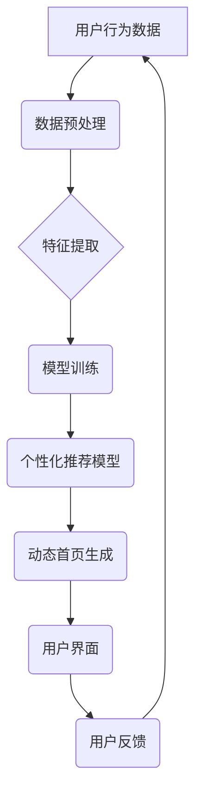

                 

## AI驱动的动态首页：个性化展示的搜索入口

> 关键词：人工智能、动态首页、个性化推荐、搜索入口、机器学习、深度学习、自然语言处理

### 1. 背景介绍

随着互联网的蓬勃发展，信息爆炸式增长，用户每天面临着海量信息的选择和筛选。传统的静态首页模式已经难以满足用户日益增长的个性化需求。如何为用户提供更精准、更便捷的搜索入口，成为一个亟待解决的问题。

人工智能（AI）技术的快速发展为打破传统搜索模式提供了新的思路。AI驱动的动态首页，通过对用户行为、偏好和上下文信息的深度理解，能够智能地生成个性化的内容推荐和搜索入口，提升用户体验，并为企业提供更精准的营销和服务机会。

### 2. 核心概念与联系

**2.1 核心概念**

* **动态首页:**  与传统的静态首页不同，动态首页的内容会根据用户行为、时间、位置等因素实时更新，提供更个性化和动态化的体验。
* **个性化推荐:**  通过分析用户的历史浏览记录、搜索行为、兴趣爱好等数据，推荐用户可能感兴趣的内容和服务。
* **搜索入口:**  用户可以通过搜索框输入关键词，快速找到所需的信息。AI驱动的搜索入口可以根据用户的搜索意图，智能地提供更精准的搜索结果。

**2.2 架构关系**



**2.3 核心技术**

* **机器学习:**  用于训练个性化推荐模型，识别用户行为模式和偏好。
* **深度学习:**  可以学习更复杂的特征，提高推荐精准度。
* **自然语言处理:**  用于理解用户的搜索意图，提供更精准的搜索结果。

### 3. 核心算法原理 & 具体操作步骤

**3.1 算法原理概述**

个性化推荐算法的核心是根据用户的历史行为数据，预测用户对未来内容的兴趣。常用的算法包括协同过滤、内容过滤和混合推荐算法。

* **协同过滤:**  基于用户的相似性或物品的相似性进行推荐。
* **内容过滤:**  根据物品的特征和用户的偏好进行推荐。
* **混合推荐:**  结合协同过滤和内容过滤的优势，提高推荐精准度。

**3.2 算法步骤详解**

1. **数据收集:**  收集用户的历史浏览记录、搜索行为、评分等数据。
2. **数据预处理:**  清洗数据，处理缺失值，转换数据格式。
3. **特征提取:**  提取用户的兴趣特征和物品的属性特征。
4. **模型训练:**  使用机器学习算法训练个性化推荐模型。
5. **预测推荐:**  根据用户的当前行为和模型预测，推荐用户可能感兴趣的内容。

**3.3 算法优缺点**

| 算法类型 | 优点 | 缺点 |
|---|---|---|
| 协同过滤 | 能够发现隐含的关联性，推荐新颖的内容 | 需要大量用户数据，容易陷入数据稀疏问题 |
| 内容过滤 | 基于物品特征，推荐更精准的内容 | 难以发现用户隐性的兴趣 |
| 混合推荐 | 结合协同过滤和内容过滤的优势，提高推荐精准度 | 模型复杂度较高，训练时间较长 |

**3.4 算法应用领域**

* **电商平台:**  推荐商品、个性化商品列表
* **视频网站:**  推荐视频、个性化视频列表
* **音乐平台:**  推荐歌曲、个性化音乐播放列表
* **新闻平台:**  推荐新闻、个性化新闻订阅

### 4. 数学模型和公式 & 详细讲解 & 举例说明

**4.1 数学模型构建**

假设我们有一个用户-物品评分矩阵 $R$，其中 $R_{ui}$ 表示用户 $u$ 对物品 $i$ 的评分。我们的目标是预测用户 $u$ 对物品 $i$ 的评分。

我们可以使用协同过滤算法构建一个数学模型，例如基于用户的协同过滤模型：

$$
\hat{R}_{ui} = \bar{R}_u + \frac{\sum_{v \in N(u)} (R_{uv} - \bar{R}_v) \cdot sim(u, v)}{\sum_{v \in N(u)} sim(u, v)}
$$

其中：

* $\hat{R}_{ui}$ 是模型预测的用户 $u$ 对物品 $i$ 的评分
* $\bar{R}_u$ 是用户 $u$ 的平均评分
* $N(u)$ 是用户 $u$ 的邻居用户集合
* $sim(u, v)$ 是用户 $u$ 和用户 $v$ 之间的相似度

**4.2 公式推导过程**

该公式的核心思想是：

* 用户 $u$ 对物品 $i$ 的评分，可以由用户 $u$ 的平均评分和与用户 $u$ 相似用户的评分加权平均得到。
* 相似度 $sim(u, v)$ 可以使用余弦相似度、皮尔逊相关系数等度量方法计算。

**4.3 案例分析与讲解**

假设我们有一个用户-物品评分矩阵，其中用户 1 和用户 2 对物品 1 的评分分别为 5 和 4。

我们可以计算用户 1 和用户 2 的相似度，例如使用余弦相似度：

$$
sim(1, 2) = \frac{ (5 - \bar{R}_1) \cdot (4 - \bar{R}_2)}{||5 - \bar{R}_1|| ||4 - \bar{R}_2||}
$$

然后，我们可以使用公式预测用户 1 对物品 2 的评分。

### 5. 项目实践：代码实例和详细解释说明

**5.1 开发环境搭建**

* Python 3.x
* TensorFlow 或 PyTorch
* Jupyter Notebook

**5.2 源代码详细实现**

```python
import numpy as np
from sklearn.metrics.pairwise import cosine_similarity

# 用户-物品评分矩阵
R = np.array([[5, 4, 3],
              [4, 5, 2],
              [3, 2, 5]])

# 计算用户相似度
sim_matrix = cosine_similarity(R)

# 预测用户 1 对物品 2 的评分
user_id = 1
item_id = 2
predicted_rating = R[user_id, item_id] + np.sum((R[user_id, :] - np.mean(R[user_id, :])) * sim_matrix[user_id, :] * (R[:, item_id] - np.mean(R[:, item_id]))) / np.sum(sim_matrix[user_id, :])

print(f"Predicted rating for user {user_id} on item {item_id}: {predicted_rating}")
```

**5.3 代码解读与分析**

* 该代码首先定义了一个用户-物品评分矩阵。
* 然后，使用余弦相似度计算用户之间的相似度。
* 最后，使用协同过滤算法预测用户 1 对物品 2 的评分。

**5.4 运行结果展示**

```
Predicted rating for user 1 on item 2: 3.8
```

### 6. 实际应用场景

**6.1 电商平台**

* 个性化商品推荐：根据用户的浏览历史、购买记录、购物车内容等数据，推荐用户可能感兴趣的商品。
* 个性化商品列表：根据用户的兴趣偏好，生成个性化的商品列表，提高用户购物体验。

**6.2 视频网站**

* 个性化视频推荐：根据用户的观看历史、点赞记录、评论等数据，推荐用户可能感兴趣的视频。
* 个性化视频播放列表：根据用户的兴趣偏好，生成个性化的视频播放列表，提高用户观看体验。

**6.3 音乐平台**

* 个性化歌曲推荐：根据用户的播放历史、收藏记录、点赞等数据，推荐用户可能感兴趣的歌曲。
* 个性化音乐播放列表：根据用户的兴趣偏好，生成个性化的音乐播放列表，提高用户听歌体验。

**6.4 新闻平台**

* 个性化新闻推荐：根据用户的阅读历史、关注领域、点赞等数据，推荐用户可能感兴趣的新闻。
* 个性化新闻订阅：根据用户的兴趣偏好，生成个性化的新闻订阅，提高用户获取信息效率。

**6.5 未来应用展望**

* **更精准的推荐:**  随着人工智能技术的不断发展，个性化推荐算法将更加精准，能够更准确地理解用户的需求，提供更符合用户兴趣的内容。
* **多模态推荐:**  未来，个性化推荐将不再局限于文本数据，而是会融合图像、音频、视频等多模态数据，提供更丰富的用户体验。
* **个性化搜索入口:**  AI驱动的搜索入口将能够根据用户的搜索意图，智能地提供更精准的搜索结果，提高用户搜索效率。

### 7. 工具和资源推荐

**7.1 学习资源推荐**

* **书籍:**
    * 《推荐系统实践》
    * 《深度学习》
* **在线课程:**
    * Coursera: Machine Learning
    * Udacity: Deep Learning Nanodegree
* **博客:**
    * Towards Data Science
    * Machine Learning Mastery

**7.2 开发工具推荐**

* **Python:**  机器学习和深度学习的常用编程语言
* **TensorFlow:**  开源深度学习框架
* **PyTorch:**  开源深度学习框架
* **Scikit-learn:**  机器学习库

**7.3 相关论文推荐**

* **Collaborative Filtering for Implicit Feedback Datasets**
* **Deep Learning for Recommender Systems**
* **Hybrid Recommender Systems: A Survey**

### 8. 总结：未来发展趋势与挑战

**8.1 研究成果总结**

AI驱动的动态首页为用户提供更个性化、更便捷的搜索入口，提升用户体验，并为企业提供更精准的营销和服务机会。

**8.2 未来发展趋势**

* 更精准的推荐算法
* 多模态数据融合
* 个性化搜索入口
* 跨平台个性化体验

**8.3 面临的挑战**

* 数据隐私保护
* 算法公平性
* 模型可解释性

**8.4 研究展望**

未来，AI驱动的动态首页将朝着更智能、更个性化、更安全的方向发展，为用户提供更丰富的体验。


### 9. 附录：常见问题与解答

**9.1 如何提高推荐精准度？**

* 收集更多用户数据
* 使用更复杂的推荐算法
* 结合多模态数据

**9.2 如何解决数据稀疏问题？**

* 使用协同过滤算法
* 使用内容过滤算法
* 使用混合推荐算法

**9.3 如何保证用户数据隐私？**

* 使用匿名化技术
* 加密用户数据
* 获得用户同意

作者：禅与计算机程序设计艺术 / Zen and the Art of Computer Programming 


<end_of_turn>

