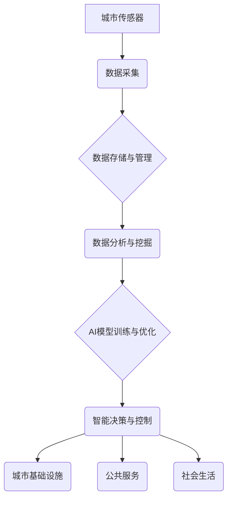

                 

## AI驱动的智能城市规划与管理

> 关键词：人工智能、智能城市、城市规划、城市管理、机器学习、深度学习、数据分析、优化算法

## 1. 背景介绍

随着全球人口的快速增长和城市化的进程不断加速，城市面临着日益严峻的挑战，包括交通拥堵、环境污染、资源短缺、公共服务效率低下等。传统城市规划和管理模式难以有效应对这些挑战，亟需新的解决方案。人工智能（AI）作为一门新兴技术，凭借其强大的数据处理、分析和预测能力，为智能城市规划与管理提供了新的思路和方法。

智能城市是指利用信息技术和通信技术，将城市基础设施、公共服务、社会生活等各个方面进行数字化、智能化改造，提升城市整体运行效率、居民生活质量和城市可持续发展能力的城市。AI技术在智能城市建设中扮演着越来越重要的角色，它可以帮助城市更好地收集、分析和利用数据，从而实现城市规划和管理的智能化、精准化和高效化。

## 2. 核心概念与联系

**2.1 核心概念**

* **智能城市:** 利用信息技术和通信技术，将城市基础设施、公共服务、社会生活等各个方面进行数字化、智能化改造，提升城市整体运行效率、居民生活质量和城市可持续发展能力的城市。
* **人工智能 (AI):** 能够模拟人类智能行为的计算机系统，包括学习、推理、决策、感知和语言理解等能力。
* **机器学习 (ML):** 一种人工智能技术，通过算法训练数据，使机器能够从数据中学习并做出预测或决策。
* **深度学习 (DL):** 一种机器学习技术，利用多层神经网络模拟人类大脑的学习过程，能够处理更复杂的数据和任务。
* **数据分析:** 从数据中提取有价值的信息，用于支持决策和优化城市管理。

**2.2 架构图**



**2.3 联系**

AI技术通过分析城市数据，可以帮助城市规划者和管理者更好地了解城市运行状况，预测未来趋势，并制定更科学、更有效的规划和管理方案。例如，AI可以用于优化交通流量，预测能源需求，管理公共资源，提升公共安全等方面。

## 3. 核心算法原理 & 具体操作步骤

**3.1 算法原理概述**

智能城市规划与管理中常用的AI算法包括：

* **机器学习算法:** 
    * **回归算法:** 用于预测连续数值，例如房价、人口增长率等。
    * **分类算法:** 用于分类数据，例如垃圾分类、交通事故预测等。
    * **聚类算法:** 用于将数据分组，例如用户画像、区域划分等。
* **深度学习算法:** 
    * **卷积神经网络 (CNN):** 用于图像识别和处理，例如交通监控、建筑物检测等。
    * **循环神经网络 (RNN):** 用于处理序列数据，例如交通流量预测、文本分析等。
    * **生成对抗网络 (GAN):** 用于生成数据，例如城市规划模拟、交通场景合成等。

**3.2 算法步骤详解**

以机器学习中的线性回归算法为例，其具体操作步骤如下：

1. **数据收集与预处理:** 收集城市相关数据，例如人口、交通流量、经济指标等，并进行清洗、转换和特征工程等预处理操作。
2. **模型选择:** 选择合适的机器学习算法，例如线性回归、逻辑回归等。
3. **模型训练:** 使用训练数据训练模型，调整模型参数，使模型能够准确预测目标变量。
4. **模型评估:** 使用测试数据评估模型性能，例如准确率、召回率、F1-score等。
5. **模型部署:** 将训练好的模型部署到生产环境中，用于预测和决策。

**3.3 算法优缺点**

* **优点:** 
    * 能够从数据中自动学习规律，无需人工编程。
    * 能够处理海量数据，发现隐藏的模式和趋势。
    * 能够不断优化和改进，提高预测精度。
* **缺点:** 
    * 需要大量的训练数据，否则模型性能会下降。
    * 对数据质量要求较高，数据噪声和偏差会影响模型结果。
    * 模型解释性较差，难以理解模型决策过程。

**3.4 算法应用领域**

* **交通管理:** 交通流量预测、拥堵路段识别、智能交通信号灯控制等。
* **环境监测:** 空气质量监测、水质监测、噪声污染监测等。
* **公共安全:** 犯罪预测、火灾预警、紧急救援调度等。
* **城市规划:** 城市发展规划、土地利用规划、基础设施建设规划等。

## 4. 数学模型和公式 & 详细讲解 & 举例说明

**4.1 数学模型构建**

在智能城市规划与管理中，常用的数学模型包括：

* **线性规划模型:** 用于解决资源分配、成本优化等问题。
* **非线性规划模型:** 用于解决更复杂的优化问题，例如交通网络优化、能源管理等。
* **动态规划模型:** 用于解决时间序列问题，例如交通流量预测、人口增长预测等。

**4.2 公式推导过程**

以线性规划模型为例，其目标函数和约束条件可以表示为：

* **目标函数:**  $f(x) = c_1x_1 + c_2x_2 + ... + c_nx_n$

* **约束条件:**

    * $a_{11}x_1 + a_{12}x_2 + ... + a_{1n}x_n \leq b_1$
    * $a_{21}x_1 + a_{22}x_2 + ... + a_{2n}x_n \leq b_2$
    * ...
    * $a_{m1}x_1 + a_{m2}x_2 + ... + a_{mn}x_n \leq b_m$

其中，$x_1, x_2, ..., x_n$ 是决策变量，$c_1, c_2, ..., c_n$ 是目标函数系数，$a_{ij}$ 是约束条件系数，$b_1, b_2, ..., b_m$ 是约束条件常数。

**4.3 案例分析与讲解**

假设一个城市需要规划公共交通线路，目标是最大化乘客运送量，同时满足预算限制和道路容量限制。可以使用线性规划模型来解决这个问题。

* **目标函数:** 最大化乘客运送量，即最大化 $f(x) = \sum_{i=1}^{n} x_i \cdot p_i$，其中 $x_i$ 是线路 $i$ 的长度，$p_i$ 是线路 $i$ 的乘客量。
* **约束条件:** 
    * 路线长度总和不超过预算限制，即 $\sum_{i=1}^{n} x_i \leq B$。
    * 路线行驶时间不超过道路容量限制，即 $\sum_{i=1}^{n} x_i \cdot t_i \leq C$，其中 $t_i$ 是线路 $i$ 的行驶时间。

通过求解线性规划模型，可以得到最优的线路规划方案，最大化乘客运送量，同时满足预算和道路容量限制。

## 5. 项目实践：代码实例和详细解释说明

**5.1 开发环境搭建**

* **操作系统:** Ubuntu 20.04 LTS
* **编程语言:** Python 3.8
* **深度学习框架:** TensorFlow 2.0
* **数据处理库:** Pandas, NumPy
* **可视化库:** Matplotlib, Seaborn

**5.2 源代码详细实现**

以下是一个使用 TensorFlow 构建交通流量预测模型的代码示例：

```python
import tensorflow as tf
from tensorflow.keras.models import Sequential
from tensorflow.keras.layers import LSTM, Dense

# 数据加载和预处理
# ...

# 模型构建
model = Sequential()
model.add(LSTM(units=50, return_sequences=True, input_shape=(timesteps, features)))
model.add(LSTM(units=50))
model.add(Dense(units=1))

# 模型编译
model.compile(loss='mean_squared_error', optimizer='adam')

# 模型训练
model.fit(X_train, y_train, epochs=100, batch_size=32)

# 模型评估
loss = model.evaluate(X_test, y_test)
print('Test Loss:', loss)

# 模型预测
predictions = model.predict(X_new)
```

**5.3 代码解读与分析**

* 该代码使用 LSTM 网络构建交通流量预测模型。
* LSTM 网络是一种专门用于处理时间序列数据的深度学习算法。
* 模型输入为历史交通流量数据，输出为未来交通流量预测值。
* 模型训练使用训练数据，并使用均方误差作为损失函数，Adam 作为优化器。
* 模型评估使用测试数据，计算测试损失。
* 模型预测使用新的数据进行预测。

**5.4 运行结果展示**

运行结果包括模型训练过程中的损失曲线、测试损失值以及模型预测结果。

## 6. 实际应用场景

**6.1 交通管理**

* **交通流量预测:** 利用历史交通数据和实时路况信息，预测未来交通流量，优化交通信号灯控制、道路规划和公共交通调度。
* **拥堵路段识别:** 利用传感器数据和机器学习算法，识别交通拥堵路段，并提供实时路况信息和避堵建议。
* **智能交通信号灯控制:** 根据实时交通流量情况，动态调整交通信号灯的绿灯时间，优化交通流量流動。

**6.2 环境监测**

* **空气质量监测:** 利用传感器数据和机器学习算法，监测空气质量，预测污染物浓度，并提供空气质量预警和健康建议。
* **水质监测:** 利用传感器数据和机器学习算法，监测水质，预测污染物排放，并提供水质预警和污染源溯源。
* **噪声污染监测:** 利用传感器数据和机器学习算法，监测噪声污染，识别噪声源，并提供噪声控制建议。

**6.3 公共安全**

* **犯罪预测:** 利用犯罪数据和社会经济数据，预测犯罪高发区域和时间，加强警力部署和预防措施。
* **火灾预警:** 利用传感器数据和机器学习算法，监测火灾风险，预测火灾发生地点和时间，并提供火灾预警和救援调度。
* **紧急救援调度:** 利用传感器数据和机器学习算法，优化紧急救援调度，缩短救援时间，提高救援效率。

**6.4 未来应用展望**

随着人工智能技术的不断发展，其在智能城市规划与管理中的应用场景将更加广泛和深入。例如：

* **个性化城市服务:** 利用用户数据和机器学习算法，提供个性化的城市服务，例如推荐路线、提供生活信息、定制公共服务等。
* **城市资源优化:** 利用传感器数据和机器学习算法，优化城市资源分配，例如能源管理、水资源管理、交通资源管理等。
* **城市可持续发展:** 利用人工智能技术，监测城市环境状况，预测城市发展趋势，制定可持续发展规划。

## 7. 工具和资源推荐

**7.1 学习资源推荐**

* **在线课程:** Coursera, edX, Udacity 等平台提供人工智能、机器学习、深度学习等方面的在线课程。
* **书籍:** 《深度学习》、《机器学习实战》、《Python机器学习》等书籍。
* **博客和论坛:** TensorFlow 官方博客、机器学习社区等平台提供丰富的学习资源和技术交流。

**7.2 开发工具推荐**

* **编程语言:** Python, R
* **深度学习框架:** TensorFlow, PyTorch, Keras
* **数据处理库:** Pandas, NumPy
* **可视化库:** Matplotlib, Seaborn

**7.3 相关论文推荐**

* **《深度学习》**
* **《机器学习》**
* **《人工智能在城市规划中的应用》**

## 8. 总结：未来发展趋势与挑战

**8.1 研究成果总结**

近年来，人工智能技术在智能城市规划与管理领域取得了显著进展，例如交通流量预测、环境监测、公共安全等方面取得了突破性成果。

**8.2 未来发展趋势**

* **模型更加智能化:** 利用更先进的深度学习算法，构建更智能、更精准的城市规划与管理模型。
* **数据更加丰富化:** 利用更多传感器数据、社会数据、地理数据等，构建更全面的城市数据模型。
* **应用更加广泛化:** 将人工智能技术应用到更多城市规划与管理领域，例如城市设计、城市运营、城市治理等。

**8.3 面临的挑战**

* **数据隐私和安全:** 城市数据涉及到个人隐私和安全问题，需要采取有效措施保护数据安全。
* **算法解释性和可信度:** 许多人工智能算法的决策过程难以解释，需要提高算法的透明度和可信度。
* **技术伦理和社会影响:** 人工智能技术在城市规划与管理中的应用需要考虑其伦理和社会影响，避免产生负面影响。

**8.4 研究展望**

未来，人工智能技术在智能城市规划与管理领域将继续发挥重要作用，需要加强基础研究，探索更智能、更安全、更可持续的城市发展模式。

## 9. 附录：常见问题与解答

**9.1 如何选择合适的AI算法？**

选择合适的AI算法取决于具体的应用场景和数据特点。例如，对于预测连续数值，可以使用回归算法；对于分类数据，可以使用分类算法；对于处理时间序列数据，可以使用LSTM网络等。

**9.2 如何处理城市数据中的噪声和偏差？**

数据预处理是AI模型训练的关键步骤，需要对城市数据进行清洗、转换和特征工程等操作，去除噪声和偏差，提高数据质量。

**9.3 如何保证AI模型的公平性和公正性？**

AI模型的训练数据可能存在偏差，导致模型输出结果不公平。需要采取措施，例如数据多样化、算法公平性评估等，确保AI模型的公平性和公正性。


作者：禅与计算机程序设计艺术 / Zen and the Art of Computer Programming<end_of_turn>

