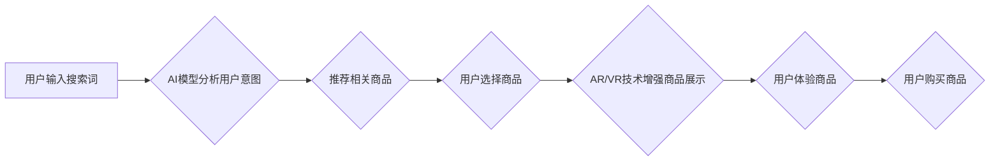

                 

## AR/VR技术在AI电商搜索中的应用前景

> 关键词：增强现实 (AR)、虚拟现实 (VR)、人工智能 (AI)、电商搜索、用户体验、产品交互、个性化推荐

## 1. 背景介绍

电子商务的蓬勃发展为消费者提供了便捷的购物体验，但传统的电商搜索方式仍然存在一些局限性。例如，文字描述难以准确传达产品的真实外观和功能，用户难以直观地了解产品的细节和使用场景。近年来，增强现实 (AR) 和虚拟现实 (VR) 技术的快速发展为电商搜索带来了新的机遇。AR/VR技术能够创造沉浸式的购物体验，帮助用户更直观地了解产品，从而提升购物决策的准确性和效率。

## 2. 核心概念与联系

### 2.1 AR/VR技术概述

* **增强现实 (AR)**：AR技术将虚拟信息叠加到现实世界中，通过手机、平板电脑或AR眼镜等设备，用户可以实时地看到虚拟物体与现实环境的融合。
* **虚拟现实 (VR)**：VR技术通过头戴式设备，将用户置身于一个完全虚拟的环境中，用户可以沉浸式地体验虚拟世界。

### 2.2 AI电商搜索

AI电商搜索是指利用人工智能技术，对电商平台上的商品进行智能分析和推荐，帮助用户更精准地找到所需商品。AI电商搜索的核心技术包括：

* **自然语言处理 (NLP)**：理解用户搜索的意图和需求。
* **机器学习 (ML)**：根据用户行为和历史数据，预测用户可能感兴趣的商品。
* **深度学习 (DL)**：利用深度神经网络，对商品进行更精准的分类和推荐。

### 2.3 AR/VR与AI电商搜索的融合

AR/VR技术与AI电商搜索的融合，可以为用户提供更沉浸式、更个性化的购物体验。例如，用户可以通过AR技术在手机上虚拟试穿衣服，或者在虚拟试衣间中体验不同风格的搭配。通过VR技术，用户可以进入虚拟的商场，体验真实的购物场景，并与虚拟的销售人员进行互动。

**Mermaid 流程图**



## 3. 核心算法原理 & 具体操作步骤

### 3.1 算法原理概述

AR/VR技术在AI电商搜索中的应用，主要依赖于以下核心算法：

* **目标检测算法**: 用于识别用户搜索的商品类型，并将其与现实世界中的物体进行匹配。
* **三维重建算法**: 用于构建商品的三维模型，以便用户在AR/VR环境中进行交互。
* **路径规划算法**: 用于规划用户在虚拟环境中的移动路径，确保用户能够流畅地体验商品。
* **个性化推荐算法**: 用于根据用户的搜索历史、购买记录和偏好，推荐个性化的商品。

### 3.2 算法步骤详解

1. **用户输入搜索词**: 用户输入想要搜索的商品名称或关键词。
2. **AI模型分析用户意图**: AI模型利用NLP技术分析用户的搜索词，识别用户的购物意图。
3. **推荐相关商品**: AI模型根据用户的搜索意图，从电商平台的商品库中推荐相关商品。
4. **AR/VR技术增强商品展示**: AR/VR技术将推荐的商品信息与现实世界或虚拟环境进行融合，增强商品的展示效果。
5. **用户体验商品**: 用户可以通过AR/VR设备，虚拟试穿衣服、虚拟家具摆设、虚拟试驾汽车等，体验商品的真实效果。
6. **用户购买商品**: 用户根据体验，选择购买感兴趣的商品。

### 3.3 算法优缺点

**优点**:

* **提升用户体验**: AR/VR技术可以为用户提供更沉浸式、更直观的购物体验。
* **提高商品转化率**: 通过虚拟体验，用户可以更准确地了解商品，从而提高购买意愿。
* **降低退货率**: 用户可以通过虚拟体验，避免购买不合适的商品，从而降低退货率。

**缺点**:

* **技术门槛高**: AR/VR技术开发和应用需要较高的技术门槛。
* **成本较高**: AR/VR设备和软件开发成本较高。
* **用户接受度**: 部分用户对AR/VR技术还存在一定的抵触情绪。

### 3.4 算法应用领域

AR/VR技术在AI电商搜索的应用领域非常广泛，包括：

* **服装电商**: 用户可以通过AR技术在手机上虚拟试穿衣服，体验不同风格的搭配。
* **家居电商**: 用户可以通过VR技术进入虚拟的房间，体验不同家具的摆设效果。
* **汽车电商**: 用户可以通过VR技术体验虚拟试驾，感受汽车的性能和操控体验。
* **化妆品电商**: 用户可以通过AR技术虚拟试妆，体验不同化妆品的妆效。

## 4. 数学模型和公式 & 详细讲解 & 举例说明

### 4.1 数学模型构建

AR/VR技术在AI电商搜索中的应用，涉及到多个数学模型，例如：

* **目标检测模型**: 使用深度学习算法，例如YOLO或Faster R-CNN，对图像中的目标进行识别和定位。
* **三维重建模型**: 使用深度学习算法，例如PointNet或VoxelNet，从图像序列中重建三维物体模型。
* **路径规划模型**: 使用搜索算法，例如A*算法或Dijkstra算法，规划用户在虚拟环境中的移动路径。

### 4.2 公式推导过程

目标检测模型的损失函数通常使用交叉熵损失函数和L1损失函数的组合，用于衡量模型预测结果与真实标签之间的差异。

$$
Loss = \alpha \cdot CrossEntropyLoss + \beta \cdot L1Loss
$$

其中，$\alpha$ 和 $\beta$ 是权重参数，用于平衡交叉熵损失和L1损失的贡献。

### 4.3 案例分析与讲解

例如，在服装电商中，目标检测模型可以识别用户的上半身，并将其与虚拟衣服进行匹配，实现虚拟试穿效果。三维重建模型可以重建用户的虚拟人体模型，以便更准确地展示虚拟衣服的穿着效果。

## 5. 项目实践：代码实例和详细解释说明

### 5.1 开发环境搭建

* **操作系统**: Windows/macOS/Linux
* **编程语言**: Python
* **深度学习框架**: TensorFlow/PyTorch
* **AR/VR开发工具**: ARKit/ARCore/Unity/Unreal Engine

### 5.2 源代码详细实现

以下是一个简单的AR虚拟试穿示例代码，使用Python和ARKit框架实现：

```python
import cv2
import numpy as np
from arkit import ARKit

# 初始化ARKit
arkit = ARKit()

# 加载虚拟衣服模型
virtual_clothes = arkit.load_model("virtual_clothes.obj")

# 获取摄像头图像
image = cv2.imread("image.jpg")

# 使用目标检测模型识别用户上半身
bbox = detect_person(image)

# 将虚拟衣服模型放置在用户上半身位置
virtual_clothes.position = bbox

# 将虚拟衣服模型与摄像头图像融合
output_image = arkit.overlay_model(image, virtual_clothes)

# 显示融合后的图像
cv2.imshow("Virtual Try-On", output_image)
cv2.waitKey(0)
```

### 5.3 代码解读与分析

* **目标检测**: 使用目标检测模型识别用户上半身的位置和大小。
* **三维重建**: 使用三维重建模型重建用户的虚拟人体模型。
* **AR渲染**: 使用ARKit框架将虚拟衣服模型放置在用户上半身位置，并与摄像头图像融合。

### 5.4 运行结果展示

运行该代码后，用户可以在摄像头图像中看到虚拟衣服的试穿效果。

## 6. 实际应用场景

### 6.1 服装电商

用户可以通过AR技术在手机上虚拟试穿衣服，体验不同风格的搭配，从而提高购买意愿。

### 6.2 家居电商

用户可以通过VR技术进入虚拟的房间，体验不同家具的摆设效果，从而更准确地选择合适的家具。

### 6.3 汽车电商

用户可以通过VR技术体验虚拟试驾，感受汽车的性能和操控体验，从而更直观地了解汽车的特点。

### 6.4 未来应用展望

AR/VR技术在AI电商搜索的应用前景广阔，未来可能出现以下应用场景：

* **个性化虚拟试衣间**: 根据用户的体型、喜好和风格，定制个性化的虚拟试衣间。
* **虚拟购物助手**: 利用AI技术，提供虚拟购物助手，帮助用户进行商品搜索、推荐和购买。
* **沉浸式购物体验**: 利用VR技术，打造沉浸式的虚拟购物体验，让用户仿佛身临其境。

## 7. 工具和资源推荐

### 7.1 学习资源推荐

* **书籍**:
    * 《增强现实技术》
    * 《虚拟现实技术》
    * 《深度学习》
* **在线课程**:
    * Coursera: AR/VR Development
    * Udacity: Deep Learning Nanodegree
* **社区**:
    * AR/VR Developers Forum
    * TensorFlow Community
    * PyTorch Community

### 7.2 开发工具推荐

* **AR/VR开发平台**: ARKit/ARCore/Unity/Unreal Engine
* **深度学习框架**: TensorFlow/PyTorch
* **计算机视觉库**: OpenCV

### 7.3 相关论文推荐

* **AR/VR技术**:
    * "A Survey of Augmented Reality"
    * "Virtual Reality: Principles and Applications"
* **AI电商搜索**:
    * "Deep Learning for Recommender Systems"
    * "Neural Network-Based Search Engines"

## 8. 总结：未来发展趋势与挑战

### 8.1 研究成果总结

AR/VR技术与AI电商搜索的融合，为用户提供了更沉浸式、更个性化的购物体验，并提升了商品转化率和用户满意度。

### 8.2 未来发展趋势

* **更逼真的虚拟体验**: 利用更先进的AR/VR技术，打造更逼真的虚拟体验，例如触觉反馈和嗅觉刺激。
* **更智能的推荐系统**: 利用更强大的AI算法，提供更精准的商品推荐，并根据用户的行为和偏好进行个性化定制。
* **更广泛的应用场景**: AR/VR技术在AI电商搜索的应用场景将不断扩展，覆盖更多行业和领域。

### 8.3 面临的挑战

* **技术门槛高**: AR/VR技术开发和应用需要较高的技术门槛，需要更多的技术人才和研发投入。
* **成本较高**: AR/VR设备和软件开发成本较高，需要电商平台进行相应的成本投入。
* **用户接受度**: 部分用户对AR/VR技术还存在一定的抵触情绪，需要进行有效的推广和教育。

### 8.4 研究展望

未来，AR/VR技术与AI电商搜索的融合将继续深入发展，为用户提供更便捷、更智能、更沉浸式的购物体验。


## 9. 附录：常见问题与解答

**Q1: AR/VR技术与传统电商搜索相比，有哪些优势？**

**A1**: AR/VR技术可以为用户提供更沉浸式、更直观的购物体验，帮助用户更准确地了解商品，从而提高购买意愿和用户满意度。

**Q2: AR/VR技术在AI电商搜索中的应用有哪些？**

**A2**: AR/VR技术可以应用于虚拟试穿、虚拟家具摆设、虚拟试驾等场景，为用户提供更直观的商品体验。

**Q3: AR/VR技术在AI电商搜索中的应用有哪些挑战？**

**A3**: AR/VR技术在AI电商搜索中的应用面临着技术门槛高、成本较高、用户接受度等挑战。

**Q4: 未来AR/VR技术在AI电商搜索的发展趋势是什么？**

**A4**: 未来AR/VR技术在AI电商搜索的发展趋势是更逼真的虚拟体验、更智能的推荐系统、更广泛的应用场景。


作者：禅与计算机程序设计艺术 / Zen and the Art of Computer Programming 
<end_of_turn>

