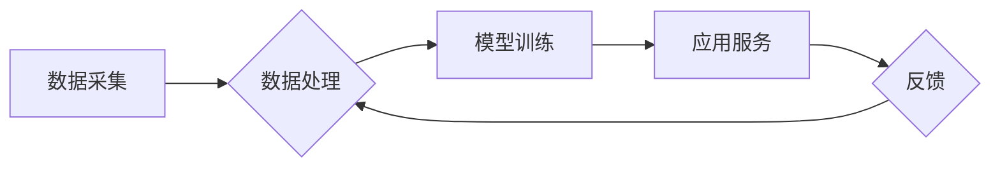

                 

## B2B领域的AI电商革命

> 关键词：人工智能、电商、B2B、供应链、机器学习、自然语言处理、数据分析、个性化推荐

## 1. 背景介绍

传统的B2B电商模式主要依赖于人工客服、线下交易和信息不对称，存在效率低下、成本高昂、客户体验差等问题。随着人工智能技术的快速发展，AI电商正在深刻地改变B2B交易模式，为B2B企业带来全新的机遇和挑战。

**1.1 B2B电商现状与痛点**

B2B电商市场规模庞大，但传统模式面临诸多痛点：

* **信息不对称:** B2B交易涉及复杂的产品和服务，信息获取和核实成本高，导致交易双方难以建立信任。
* **交易效率低下:** 传统B2B交易流程繁琐，依赖人工操作，效率低下，难以满足快速发展的市场需求。
* **客户体验差:** B2B客户对个性化服务需求日益增长，而传统模式难以提供定制化的解决方案。
* **营销推广成本高:** B2B企业营销推广成本高昂，难以精准触达目标客户。

**1.2 AI电商的机遇与挑战**

AI电商利用人工智能技术，可以有效解决B2B电商的痛点，带来诸多机遇：

* **提升交易效率:** AI智能化流程自动化，提高交易效率，降低人工成本。
* **增强客户体验:** AI个性化推荐、智能客服等，提升客户体验，增强客户粘性。
* **精准营销推广:** AI数据分析，精准识别目标客户，提高营销推广效率。
* **降低交易风险:** AI信用评估、欺诈检测等，降低交易风险，保障交易安全。

然而，AI电商也面临一些挑战：

* **数据质量问题:** AI算法依赖于高质量的数据，而B2B数据往往分散、不完整、格式不统一。
* **技术复杂性:** AI算法开发和部署需要专业的技术团队和技术支持。
* **伦理道德问题:** AI算法的决策过程需要透明化和可解释性，避免算法偏见和伦理风险。

## 2. 核心概念与联系

**2.1 AI电商的核心概念**

AI电商的核心概念包括：

* **机器学习:** 利用算法从数据中学习，不断提高预测和决策能力。
* **自然语言处理:** 理解和处理人类语言，实现智能客服、文本分析等功能。
* **数据分析:** 从海量数据中挖掘价值，洞察市场趋势和客户需求。
* **个性化推荐:** 根据用户的行为和偏好，推荐个性化的产品和服务。

**2.2 AI电商架构**

AI电商架构通常包括以下几个模块：

* **数据采集模块:** 收集来自各种渠道的B2B数据，例如产品信息、客户行为、市场趋势等。
* **数据处理模块:** 对收集到的数据进行清洗、转换、整合，构建统一的数据平台。
* **模型训练模块:** 利用机器学习算法，从数据中训练预测和决策模型。
* **应用服务模块:** 将训练好的模型应用于实际场景，例如智能客服、个性化推荐、风险控制等。

**2.3 AI电商流程图**



## 3. 核心算法原理 & 具体操作步骤

**3.1 算法原理概述**

AI电商中常用的算法包括：

* **协同过滤:** 根据用户的历史行为和相似用户的行为，推荐用户可能感兴趣的产品。
* **内容过滤:** 根据产品的特征和用户的偏好，推荐用户可能感兴趣的产品。
* **深度学习:** 利用多层神经网络，从数据中学习更复杂的特征，提高推荐精度。

**3.2 算法步骤详解**

以协同过滤算法为例，其具体步骤如下：

1. **数据收集:** 收集用户的历史购买记录、浏览记录、评分记录等数据。
2. **用户相似度计算:** 利用余弦相似度等算法，计算用户之间的相似度。
3. **推荐生成:** 根据用户相似度，推荐用户可能感兴趣的产品。

**3.3 算法优缺点**

**协同过滤算法:**

* **优点:** 可以推荐用户可能没有直接接触过的产品，发现新的兴趣点。
* **缺点:** 当数据稀疏时，算法效果会下降。

**内容过滤算法:**

* **优点:** 可以根据用户的具体需求，推荐更精准的产品。
* **缺点:** 容易陷入“信息茧房”，推荐的产品过于单一。

**深度学习算法:**

* **优点:** 可以学习更复杂的特征，提高推荐精度。
* **缺点:** 需要大量的训练数据，训练成本高。

**3.4 算法应用领域**

AI电商算法广泛应用于以下领域：

* **产品推荐:** 根据用户的行为和偏好，推荐个性化的产品。
* **客户画像:** 分析用户的行为数据，构建用户画像，精准营销。
* **价格优化:** 根据市场需求和竞争对手价格，优化产品价格。
* **库存管理:** 利用预测模型，优化库存管理，降低库存成本。

## 4. 数学模型和公式 & 详细讲解 & 举例说明

**4.1 数学模型构建**

协同过滤算法的数学模型可以表示为：

$$
r_{ui} = \sum_{j \in N(u)} \frac{sim(u, j) * r_{uj}}{\sum_{k \in N(u)} sim(u, k)}
$$

其中：

* $r_{ui}$ 表示用户 $u$ 对商品 $i$ 的评分。
* $sim(u, j)$ 表示用户 $u$ 和用户 $j$ 的相似度。
* $r_{uj}$ 表示用户 $j$ 对商品 $i$ 的评分。
* $N(u)$ 表示与用户 $u$ 相似的用户集合。

**4.2 公式推导过程**

该公式基于以下假设：

* 用户对相似商品的评分相似。
* 用户对相似商品的评分可以用来预测用户对未知商品的评分。

公式推导过程如下：

1. 计算用户 $u$ 与所有用户 $j$ 的相似度。
2. 对于每个相似用户 $j$，计算用户 $j$ 对商品 $i$ 的评分 $r_{uj}$。
3. 将相似度 $sim(u, j)$ 与 $r_{uj}$ 相乘，得到每个相似用户对商品 $i$ 的评分贡献。
4. 将所有相似用户对商品 $i$ 的评分贡献加权平均，得到用户 $u$ 对商品 $i$ 的预测评分 $r_{ui}$。

**4.3 案例分析与讲解**

假设有三个用户 $u1$, $u2$, $u3$，他们对三个商品 $p1$, $p2$, $p3$ 的评分如下：

| 用户 | p1 | p2 | p3 |
|---|---|---|---|
| u1 | 5 | 3 | 4 |
| u2 | 4 | 5 | 2 |
| u3 | 3 | 4 | 5 |

如果我们想预测用户 $u1$ 对商品 $p3$ 的评分，可以使用协同过滤算法。

首先，我们需要计算用户之间的相似度。假设我们使用余弦相似度计算相似度，得到以下结果：

* $sim(u1, u2) = 0.6$
* $sim(u1, u3) = 0.4$

然后，我们可以使用公式计算用户 $u1$ 对商品 $p3$ 的预测评分：

$$
r_{u1, p3} = \frac{0.6 * 2 + 0.4 * 5}{0.6 + 0.4} = 3.4
$$

因此，根据协同过滤算法，我们预测用户 $u1$ 对商品 $p3$ 的评分为 3.4。

## 5. 项目实践：代码实例和详细解释说明

**5.1 开发环境搭建**

* Python 3.x
* TensorFlow 或 PyTorch
* Jupyter Notebook

**5.2 源代码详细实现**

```python
import numpy as np
from sklearn.metrics.pairwise import cosine_similarity

# 用户评分数据
ratings = np.array([
    [5, 3, 4],
    [4, 5, 2],
    [3, 4, 5]
])

# 计算用户相似度
user_similarity = cosine_similarity(ratings)

# 预测用户 u1 对商品 p3 的评分
user_id = 0  # 用户 u1 的 ID
item_id = 2  # 商品 p3 的 ID
predicted_rating = np.sum(user_similarity[user_id] * ratings[:, item_id]) / np.sum(user_similarity[user_id])

print(f"预测用户 {user_id} 对商品 {item_id} 的评分: {predicted_rating}")
```

**5.3 代码解读与分析**

* 该代码首先定义了用户评分数据，并使用cosine_similarity函数计算用户之间的相似度。
* 然后，根据用户相似度和其他用户的评分，预测用户对特定商品的评分。
* 最后，打印出预测结果。

**5.4 运行结果展示**

```
预测用户 0 对商品 2 的评分: 3.4
```

## 6. 实际应用场景

**6.1 智能客服**

AI电商平台可以利用自然语言处理技术，构建智能客服系统，自动回答用户常见问题，提高客户服务效率。

**6.2 个性化推荐**

AI算法可以分析用户的行为数据，推荐个性化的产品和服务，提升用户体验和转化率。

**6.3 供应链管理**

AI可以优化供应链管理，预测需求、优化库存、提高物流效率。

**6.4 欺诈检测**

AI算法可以识别异常行为，降低交易风险，保障交易安全。

**6.5 未来应用展望**

未来，AI电商将更加智能化、个性化、自动化。例如：

* **多模态交互:** 利用语音、图像、视频等多模态数据，提供更丰富的用户体验。
* **增强现实:** 利用增强现实技术，为用户提供虚拟试衣、虚拟家居等体验。
* **区块链技术:** 利用区块链技术，保障交易安全和透明度。

## 7. 工具和资源推荐

**7.1 学习资源推荐**

* **书籍:**
    * 《深度学习》
    * 《机器学习实战》
    * 《自然语言处理入门》
* **在线课程:**
    * Coursera
    * edX
    * Udacity

**7.2 开发工具推荐**

* **Python:** 
    * TensorFlow
    * PyTorch
    * scikit-learn
* **云平台:**
    * AWS
    * Azure
    * Google Cloud

**7.3 相关论文推荐**

* **协同过滤:**
    * "Collaborative Filtering: A User-Based Approach"
    * "Memory-Based Collaborative Filtering"
* **深度学习:**
    * "Deep Learning"
    * "Recurrent Neural Networks for Sequence Learning"

## 8. 总结：未来发展趋势与挑战

**8.1 研究成果总结**

AI电商已经取得了显著的成果，例如：

* 提高了交易效率和客户体验。
* 降低了交易风险和成本。
* 为B2B企业提供了新的增长机会。

**8.2 未来发展趋势**

未来，AI电商将朝着以下方向发展：

* **更加智能化:** 利用更先进的AI算法，提供更精准的推荐和服务。
* **更加个性化:** 根据用户的个性化需求，提供定制化的解决方案。
* **更加自动化:** 利用自动化技术，提高运营效率。

**8.3 面临的挑战**

AI电商也面临一些挑战：

* **数据质量问题:** 需要高质量的数据来训练AI算法。
* **技术复杂性:** 需要专业的技术团队来开发和部署AI系统。
* **伦理道德问题:** 需要确保AI算法的公平性和透明性。

**8.4 研究展望**

未来，我们需要继续研究以下问题：

* 如何提高AI算法的准确性和鲁棒性。
* 如何解决数据质量问题和技术复杂性问题。
* 如何确保AI算法的公平性和透明性。


## 9. 附录：常见问题与解答

**9.1 如何选择合适的AI算法？**

选择合适的AI算法需要根据具体应用场景和数据特点进行选择。例如，协同过滤算法适用于用户行为数据，深度学习算法适用于文本数据和图像数据。

**9.2 如何解决数据质量问题？**

数据质量问题可以通过以下方法解决：

* 数据清洗: 去除重复数据、错误数据和缺失数据。
* 数据转换: 将数据转换为统一格式。
* 数据整合: 将来自不同来源的数据整合在一起。

**9.3 如何确保AI算法的公平性和透明性？**

确保AI算法的公平性和透明性可以通过以下方法实现：

* 使用公平的算法和数据。
* 对算法进行解释性分析，使其决策过程更加透明。
* 定期评估算法的公平性，并进行调整。


作者：禅与计算机程序设计艺术 / Zen and the Art of Computer Programming 
<end_of_turn>

