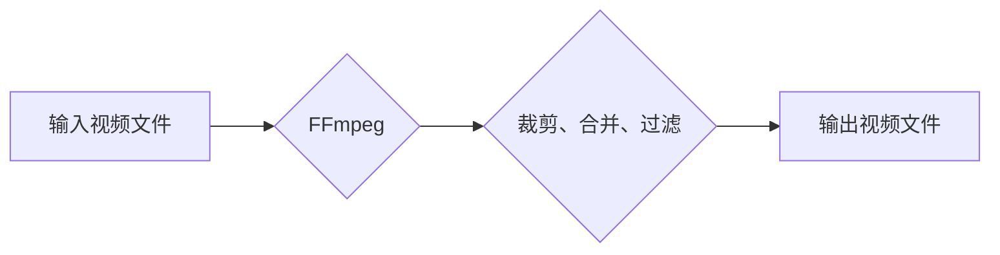

                 

## FFmpeg 视频编辑技巧分享：裁剪、合并和过滤视频片段的艺术

> 关键词：FFmpeg, 视频编辑, 裁剪, 合并, 过滤, 视频处理, 命令行工具

## 1. 背景介绍

在数字时代，视频内容已成为信息传播和娱乐的主要形式。如何高效地处理和编辑视频片段，成为了一个重要的技术需求。FFmpeg 作为一款强大的开源视频处理工具，凭借其丰富的功能和灵活的命令行接口，成为了视频编辑领域的利器。

本文将深入探讨 FFmpeg 在视频裁剪、合并和过滤方面的应用，并通过详细的算法原理、代码实例和实际应用场景，帮助读者掌握 FFmpeg 的核心技巧，提升视频处理能力。

## 2. 核心概念与联系

FFmpeg 是一种多媒体框架，支持多种音频和视频格式的解码、编码和转换。其核心概念包括：

* **流 (Stream):** 视频和音频数据由一系列数据包组成，称为流。FFmpeg 可以处理多种类型的流，包括音频流、视频流和字幕流。
* **格式 (Format):** 视频和音频数据采用不同的格式进行存储和传输，例如 MP4、AVI、MKV 等。FFmpeg 支持多种格式的解码和编码。
* **编解码器 (Codec):** 编解码器负责将视频和音频数据进行压缩和解压缩。FFmpeg 支持多种编解码器，例如 H.264、AAC、MP3 等。

**Mermaid 流程图：**



## 3. 核心算法原理 & 具体操作步骤

### 3.1  算法原理概述

FFmpeg 的视频编辑功能基于视频流的处理。通过对视频流进行读取、截取、拼接和写入等操作，可以实现裁剪、合并和过滤视频片段。

* **裁剪:** 从视频流中提取指定时间范围内的片段。
* **合并:** 将多个视频片段拼接成一个新的视频文件。
* **过滤:** 对视频流进行各种处理，例如调整亮度、对比度、添加特效等。

### 3.2  算法步骤详解

**裁剪:**

1. 读取视频文件，获取视频流信息。
2. 根据指定的时间范围，截取视频流中的相应片段。
3. 将截取后的视频片段写入新的视频文件。

**合并:**

1. 读取多个视频文件，获取视频流信息。
2. 将多个视频流按照指定顺序拼接在一起。
3. 将拼接后的视频流写入新的视频文件。

**过滤:**

1. 读取视频文件，获取视频流信息。
2. 使用 FFmpeg 的滤镜功能对视频流进行处理。
3. 将处理后的视频流写入新的视频文件。

### 3.3  算法优缺点

**优点:**

* 功能强大，支持多种视频格式和编解码器。
* 命令行接口灵活，可定制化操作。
* 开源免费，可自由使用和修改。

**缺点:**

* 命令行操作相对复杂，需要一定的学习成本。
* 图形界面较少，操作体验不如图形化编辑软件。

### 3.4  算法应用领域

FFmpeg 的视频编辑功能广泛应用于以下领域:

* **视频剪辑:** 制作电影、电视剧、广告等视频内容。
* **视频监控:** 对视频监控录像进行裁剪、合并和分析。
* **直播平台:** 对直播视频进行实时裁剪、合并和过滤。
* **教育培训:** 制作视频课程和教学素材。

## 4. 数学模型和公式 & 详细讲解 & 举例说明

### 4.1  数学模型构建

视频裁剪、合并和过滤涉及到时间、空间和色彩等方面的数学模型。

* **时间模型:** 视频片段的时间范围可以用开始时间和结束时间表示，例如：

$$
t_{start} \leq t \leq t_{end}
$$

* **空间模型:** 视频片段的空间范围可以用裁剪区域的坐标表示，例如：

$$
x_{start} \leq x \leq x_{end}, y_{start} \leq y \leq y_{end}
$$

* **色彩模型:** 视频片段的颜色可以用RGB或YUV等色彩空间表示。

### 4.2  公式推导过程

视频裁剪的算法可以根据时间模型进行推导。假设视频文件总时长为 $T$，需要裁剪的时间范围为 $[t_{start}, t_{end}]$，则裁剪后的视频片段长度为：

$$
L = t_{end} - t_{start}
$$

### 4.3  案例分析与讲解

**举例说明:**

假设一个视频文件时长为 10 秒，需要裁剪从第 2 秒到第 5 秒的片段，则裁剪后的视频片段长度为：

$$
L = 5 - 2 = 3 \text{ 秒}
$$

## 5. 项目实践：代码实例和详细解释说明

### 5.1  开发环境搭建

FFmpeg 可以跨平台使用，需要根据自己的操作系统进行安装。

* **Linux:** 使用 apt-get 或 yum 命令安装。
* **Windows:** 下载 FFmpeg 的 Windows 版本并进行安装。
* **macOS:** 使用 Homebrew 或 MacPorts 命令安装。

### 5.2  源代码详细实现

**裁剪视频:**

```bash
ffmpeg -i input.mp4 -ss 2 -to 5 -c copy output.mp4
```

**合并视频:**

```bash
ffmpeg -i video1.mp4 -i video2.mp4 -filter_complex "[0:v][1:v]concat=n=2:v=1" -c:v libx264 output.mp4
```

**过滤视频:**

```bash
ffmpeg -i input.mp4 -vf "scale=640:480" output.mp4
```

### 5.3  代码解读与分析

* `-i`: 指定输入文件。
* `-ss`: 指定开始时间。
* `-to`: 指定结束时间。
* `-c copy`: 使用原有的编解码器，不进行重新编码。
* `-filter_complex`: 使用滤镜链进行处理。
* `concat`: 将多个视频流拼接在一起。
* `scale`: 调整视频分辨率。

### 5.4  运行结果展示

运行上述命令后，将生成相应的输出视频文件。

## 6. 实际应用场景

### 6.1  视频剪辑

FFmpeg 可以用于制作电影、电视剧、广告等视频内容。例如，可以裁剪不需要的片段，合并多个片段，添加字幕和特效等。

### 6.2  视频监控

FFmpeg 可以用于对视频监控录像进行裁剪、合并和分析。例如，可以裁剪出特定时间段的录像，合并多个摄像头录像，提取关键帧进行分析等。

### 6.3  直播平台

FFmpeg 可以用于直播平台的视频处理。例如，可以实时裁剪直播视频，合并多个直播流，添加水印和广告等。

### 6.4  未来应用展望

随着视频技术的不断发展，FFmpeg 的应用场景将更加广泛。例如，可以用于虚拟现实视频处理、视频会议录制和转码、视频游戏直播等领域。

## 7. 工具和资源推荐

### 7.1  学习资源推荐

* FFmpeg 官方文档: https://ffmpeg.org/documentation.html
* FFmpeg 教程: https://www.tutorialspoint.com/ffmpeg/index.htm
* FFmpeg 命令行参考: https://ffmpeg.org/ffmpeg.html

### 7.2  开发工具推荐

* **FFmpeg:** https://ffmpeg.org/
* **VLC Media Player:** https://www.videolan.org/vlc/
* **HandBrake:** https://handbrake.fr/

### 7.3  相关论文推荐

* FFmpeg: A Multi-Media Framework
* Video Processing with FFmpeg

## 8. 总结：未来发展趋势与挑战

### 8.1  研究成果总结

FFmpeg 作为一款开源视频处理工具，已经取得了巨大的成功。其强大的功能、灵活的接口和广泛的应用场景，使其成为视频处理领域的标杆。

### 8.2  未来发展趋势

FFmpeg 将继续朝着以下方向发展:

* **更强大的功能:** 支持更多视频格式和编解码器，提供更丰富的滤镜和特效。
* **更易于使用:** 提供更友好的图形界面，简化命令行操作。
* **更强大的性能:** 优化算法和代码，提高处理速度和效率。

### 8.3  面临的挑战

FFmpeg 面临的挑战包括:

* **开源社区的维护:** 需要持续的社区支持和贡献，才能保证 FFmpeg 的持续发展。
* **新技术的融合:** 需要不断吸收和融合新的视频处理技术，才能保持竞争力。
* **跨平台兼容性:** 需要保证 FFmpeg 在不同平台上的兼容性，才能满足用户的需求。

### 8.4  研究展望

未来，FFmpeg 将继续作为视频处理领域的领先工具，为用户提供更强大、更易用、更高效的视频处理解决方案。


## 9. 附录：常见问题与解答

**常见问题:**

* FFmpeg 命令行参数太多，如何快速学习？
* FFmpeg 的滤镜功能如何使用？
* FFmpeg 如何处理不同视频格式？

**解答:**

* FFmpeg 官方文档和教程提供了详细的命令行参数说明。
* FFmpeg 的滤镜功能可以通过 `-vf` 参数指定。
* FFmpeg 支持多种视频格式的解码和编码。


作者：禅与计算机程序设计艺术 / Zen and the Art of Computer Programming 
<end_of_turn>

