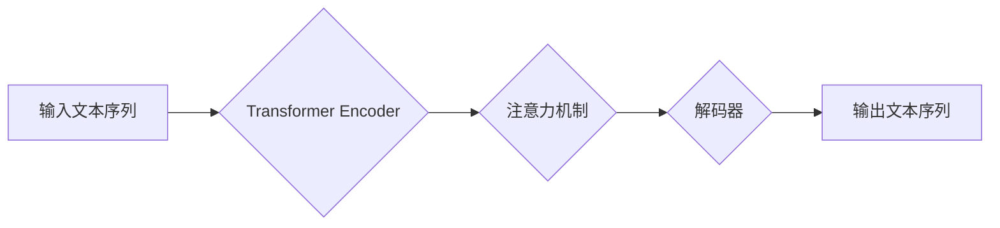

                 

## GPT-3的技术突破：为什么它如此强大？

> 关键词：GPT-3, 大语言模型, Transformer, 迁移学习, 自然语言处理, 深度学习, 生成式模型

### 1. 背景介绍

近年来，人工智能领域取得了令人瞩目的进展，其中自然语言处理 (NLP) 领域尤为突出。作为 NLP 领域的重要分支，文本生成一直是研究的热点问题。传统的文本生成方法通常依赖于复杂的规则和模板，难以捕捉语言的复杂性和多样性。

2020 年，OpenAI 发布了 GPT-3 (Generative Pre-trained Transformer 3)，一个拥有 1750 亿参数的巨型语言模型，彻底改变了人们对文本生成的认知。GPT-3 凭借其强大的文本生成能力、广泛的应用场景和令人惊叹的创新性，迅速成为人工智能领域最具影响力的模型之一。

### 2. 核心概念与联系

GPT-3 基于 Transformer 架构，并采用迁移学习策略进行预训练。

#### 2.1 Transformer 架构

Transformer 架构是近年来 NLP 领域最具突破性的进展之一。它摒弃了传统的循环神经网络 (RNN) 架构，采用注意力机制来捕捉文本序列中的长距离依赖关系。注意力机制允许模型关注输入序列中与当前任务最相关的部分，从而提高了模型的理解力和生成能力。

#### 2.2 迁移学习

迁移学习是指利用预训练模型在特定任务上的知识，来提升新任务的学习效率。GPT-3 在海量文本数据上进行预训练，学习了语言的语法、语义和结构等知识。这些预训练知识可以迁移到各种下游任务中，例如文本分类、机器翻译、问答系统等，显著提高了模型的性能。

**Mermaid 流程图**

### 3. 核心算法原理 & 具体操作步骤

#### 3.1 算法原理概述

GPT-3 的核心算法是基于 Transformer 架构的解码器网络。解码器网络接收预处理后的文本序列作为输入，并通过一系列 Transformer 层进行处理，最终生成目标文本序列。

#### 3.2 算法步骤详解

1. **文本预处理:** 将输入文本序列进行分词、标记化等预处理操作，使其能够被模型理解。
2. **嵌入层:** 将每个单词转换为稠密的向量表示，称为词嵌入。
3. **Transformer 层:** 将嵌入后的文本序列输入到 Transformer 层中，通过多头注意力机制和前馈神经网络进行处理，捕捉文本序列中的上下文信息和长距离依赖关系。
4. **输出层:** 将 Transformer 层的输出经过线性变换和 softmax 函数，生成目标文本序列的概率分布。
5. **解码:** 根据概率分布选择最可能的下一个单词，并将其添加到输出序列中。重复上述步骤，直到生成完整的目标文本序列。

#### 3.3 算法优缺点

**优点:**

* 强大的文本生成能力：GPT-3 可以生成高质量、流畅、连贯的文本。
* 广泛的应用场景：GPT-3 可以应用于各种 NLP 任务，例如文本摘要、机器翻译、对话系统等。
* 迁移学习的优势：预训练模型可以迁移到各种下游任务中，提高模型的性能。

**缺点:**

* 参数量巨大：GPT-3 拥有 1750 亿参数，需要大量的计算资源进行训练和推理。
* 训练数据依赖：GPT-3 的性能依赖于训练数据的质量和规模。
* 潜在的偏差和风险：GPT-3 可能会学习到训练数据中的偏差和错误信息，从而生成不准确或有害的文本。

#### 3.4 算法应用领域

GPT-3 的应用领域非常广泛，包括：

* **文本生成:** 写作、诗歌创作、代码生成、剧本创作等。
* **对话系统:** 聊天机器人、虚拟助手、客服系统等。
* **机器翻译:** 将一种语言翻译成另一种语言。
* **文本摘要:** 将长篇文本压缩成简短的摘要。
* **问答系统:** 回答用户提出的问题。

### 4. 数学模型和公式 & 详细讲解 & 举例说明

#### 4.1 数学模型构建

GPT-3 的数学模型基于 Transformer 架构，其核心是注意力机制和多头注意力机制。

**注意力机制:**

注意力机制允许模型关注输入序列中与当前任务最相关的部分。其计算公式如下：

$$
\text{Attention}(Q, K, V) = \text{softmax}\left(\frac{QK^T}{\sqrt{d_k}}\right)V
$$

其中：

* $Q$：查询矩阵
* $K$：键矩阵
* $V$：值矩阵
* $d_k$：键向量的维度

**多头注意力机制:**

多头注意力机制将注意力机制应用于多个不同的子空间，从而捕捉到更丰富的上下文信息。其计算公式如下：

$$
\text{MultiHeadAttention}(Q, K, V) = \text{Concat}\left(\text{head}_1(Q, K, V), ..., \text{head}_h(Q, K, V)\right)W_O
$$

其中：

* $h$：注意力头的数量
* $\text{head}_i(Q, K, V)$：第 $i$ 个注意力头的输出
* $W_O$：最终输出层的权重矩阵

#### 4.2 公式推导过程

注意力机制的公式推导过程可以参考 Transformer 原文论文。

#### 4.3 案例分析与讲解

假设我们有一个句子 "The cat sat on the mat"，我们想要计算 "sat" 这个词的注意力权重。

使用注意力机制，我们可以计算 "sat" 与其他词之间的相关性，例如 "cat"、"on"、"mat" 等。

通过计算注意力权重，我们可以知道 "sat" 与哪些词语的关系最为密切，从而更好地理解句子的语义。

### 5. 项目实践：代码实例和详细解释说明

#### 5.1 开发环境搭建

GPT-3 的开发环境搭建需要以下软件和工具：

* Python 3.6+
* PyTorch 或 TensorFlow
* CUDA 和 cuDNN

#### 5.2 源代码详细实现

由于 GPT-3 的代码开源，我们可以直接使用其源代码进行开发。

#### 5.3 代码解读与分析

GPT-3 的源代码包含 Transformer 架构的实现、注意力机制的实现、训练和推理过程的实现等。

#### 5.4 运行结果展示

运行 GPT-3 的代码可以生成高质量的文本，例如诗歌、故事、代码等。

### 6. 实际应用场景

GPT-3 在各个领域都有着广泛的应用场景，例如：

#### 6.1 文本生成

GPT-3 可以用于生成各种类型的文本，例如：

* **小说:** GPT-3 可以根据给定的主题和人物设定生成小说故事。
* **诗歌:** GPT-3 可以根据给定的风格和主题生成诗歌。
* **代码:** GPT-3 可以根据给定的功能需求生成代码。

#### 6.2 对话系统

GPT-3 可以用于构建更智能、更自然的对话系统，例如：

* **聊天机器人:** GPT-3 可以与用户进行自然语言对话，回答用户的问题，提供信息。
* **虚拟助手:** GPT-3 可以帮助用户完成各种任务，例如设置提醒、预订酒店、查找信息等。

#### 6.3 机器翻译

GPT-3 可以用于将一种语言翻译成另一种语言，例如：

* **英语翻译成中文:** GPT-3 可以将英文文本翻译成中文文本。
* **中文翻译成英语:** GPT-3 可以将中文文本翻译成英文文本。

#### 6.4 未来应用展望

GPT-3 的未来应用前景非常广阔，例如：

* **个性化教育:** GPT-3 可以根据学生的学习进度和需求提供个性化的学习内容。
* **医疗诊断:** GPT-3 可以帮助医生分析患者的病历和症状，辅助诊断疾病。
* **法律服务:** GPT-3 可以帮助律师分析法律文件，撰写法律意见书。

### 7. 工具和资源推荐

#### 7.1 学习资源推荐

* **Transformer 原文论文:** https://arxiv.org/abs/1706.03762
* **OpenAI GPT-3 文档:** https://openai.com/blog/gpt-3/
* **HuggingFace Transformers 库:** https://huggingface.co/transformers/

#### 7.2 开发工具推荐

* **PyTorch:** https://pytorch.org/
* **TensorFlow:** https://www.tensorflow.org/

#### 7.3 相关论文推荐

* **BERT: Pre-training of Deep Bidirectional Transformers for Language Understanding:** https://arxiv.org/abs/1810.04805
* **XLNet: Generalized Autoregressive Pretraining for Language Understanding:** https://arxiv.org/abs/1906.08237

### 8. 总结：未来发展趋势与挑战

#### 8.1 研究成果总结

GPT-3 的成功标志着深度学习在 NLP 领域的巨大进步。其强大的文本生成能力和广泛的应用场景，为人工智能的未来发展指明了方向。

#### 8.2 未来发展趋势

未来，GPT-3 的发展趋势包括：

* **模型规模的进一步扩大:** 更大的模型规模可以带来更强的性能。
* **训练数据的多样化:** 更丰富的训练数据可以帮助模型学习更广泛的知识。
* **算法的改进:** 新的算法和架构可以提高模型的效率和性能。

#### 8.3 面临的挑战

GPT-3 仍然面临一些挑战，例如：

* **计算资源的限制:** 训练和推理大型语言模型需要大量的计算资源。
* **数据安全和隐私问题:** 大型语言模型的训练需要大量的文本数据，如何保护数据安全和隐私是一个重要问题。
* **模型的解释性和可控性:** 大型语言模型的决策过程难以理解和解释，如何提高模型的可控性和透明性是一个重要的研究方向。

#### 8.4 研究展望

未来，研究人员将继续探索大型语言模型的潜力，开发更强大、更安全、更可控的模型，为人工智能的未来发展做出更大的贡献。

### 9. 附录：常见问题与解答

#### 9.1 GPT-3 和 BERT 的区别

GPT-3 和 BERT 都是基于 Transformer 架构的语言模型，但它们在训练目标和应用场景上有所不同。

GPT-3 是一个自回归语言模型，其训练目标是预测下一个单词。它擅长文本生成任务，例如故事创作、诗歌创作、代码生成等。

BERT 是一个双向语言模型，其训练目标是预测句子中某个词语的上下文信息。它擅长理解文本语义的任务，例如文本分类、问答系统、情感分析等。

#### 9.2 GPT-3 的训练数据是什么？

GPT-3 的训练数据来自互联网上的公开文本数据，包括书籍、文章、代码、对话等。

#### 9.3 如何使用 GPT-3？

OpenAI 提供了 GPT-3 的 API，开发者可以通过 API 调用 GPT-3 模型进行文本生成等操作。

#### 9.4 GPT-3 的伦理问题是什么？

GPT-3 作为一种强大的人工智能模型，也存在一些伦理问题，例如：

* **生成虚假信息:** GPT-3 可以生成看似真实但实际上是虚假的信息，这可能导致误导和欺骗。
* **歧视和偏见:** GPT-3 的训练数据可能包含社会偏见，这可能导致模型生成带有歧视性的文本。
* **隐私问题:** GPT-3 的训练数据可能包含个人隐私信息，如何保护这些信息是一个重要问题。

作者：禅与计算机程序设计艺术 / Zen and the Art of Computer Programming 
<end_of_turn>

