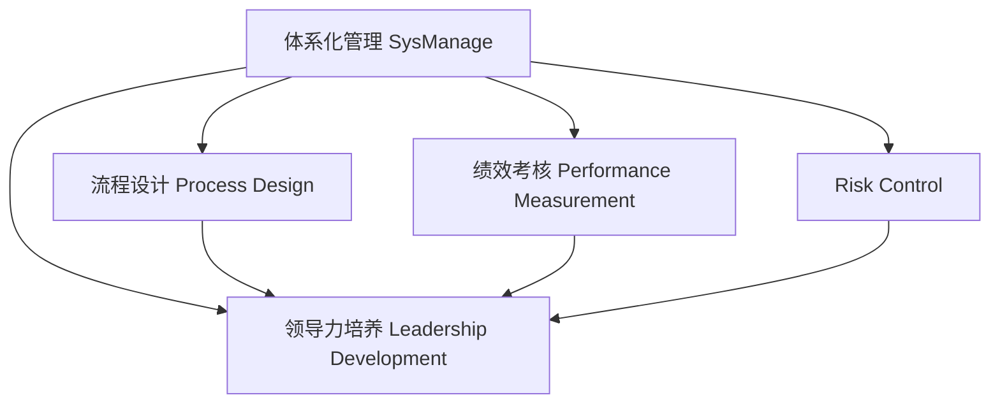

                 

# 体系化管理:卓越领导力的源泉

## 1. 背景介绍

### 1.1 问题由来
在信息技术高速发展的今天，企业面临着日益复杂的经营环境和竞争压力。如何通过有效的管理手段提升企业绩效，成为众多企业管理者关注的焦点。体系化管理正是在这种背景下提出的。通过建立科学的体系化管理体系，企业可以更好地整合内部资源，提升决策效率和执行效果，实现可持续发展。

### 1.2 问题核心关键点
体系化管理的核心在于构建一套科学、系统、规范的管理体系，包括组织架构、流程设计、绩效考核、风险控制等多个方面。其关键点在于：
- 全局视角：从企业战略和目标出发，设计整体框架和流程。
- 标准化操作：通过流程化和标准化，提升执行效率和一致性。
- 数据驱动：依托数据分析和统计，持续改进和优化管理措施。
- 领导力培养：强调领导者在公司文化和价值观塑造中的作用，提升其影响力和执行能力。

### 1.3 问题研究意义
研究体系化管理的意义在于，通过建立科学、系统、规范的管理体系，可以有效提升企业的运营效率、绩效水平和市场竞争力。体系化管理不仅能够提升企业的核心竞争力，还能培养具有卓越领导力的管理者，推动企业可持续发展。

## 2. 核心概念与联系

### 2.1 核心概念概述

为更好地理解体系化管理的内涵，本节将介绍几个密切相关的核心概念：

- **体系化管理（SysManage）**：基于全局视角，设计并实施一套系统、科学、规范的管理体系，涵盖组织架构、流程设计、绩效考核、风险控制等多个方面。其目的是提升企业的运营效率和绩效水平，实现可持续发展。
- **流程设计（Process Design）**：基于业务流程重组（BPR）理念，通过优化业务流程，提升执行效率和一致性。其关键在于理解业务需求和资源约束，设计出高效、可靠的流程。
- **绩效考核（Performance Measurement）**：通过科学的指标体系和评价方法，对企业及员工进行绩效考核，激励和提升其工作表现。其目的是确保员工行为与企业目标一致，推动绩效提升。
- **风险控制（Risk Management）**：通过识别、评估和管理企业面临的各种风险，降低潜在的经营风险，保障企业安全稳定发展。其关键是建立完善的内部控制和外部监管体系。
- **领导力培养（Leadership Development）**：通过培养具有卓越领导力的管理者，提升其影响力、执行力和团队管理能力，推动企业文化和价值观的塑造。其目标是形成高效的决策和执行体系，保障企业战略目标的实现。

这些核心概念之间的逻辑关系可以通过以下Mermaid流程图来展示：



这个流程图展示了几大核心概念之间的联系：

1. 体系化管理是整体框架，流程设计、绩效考核、风险控制、领导力培养等都需在体系化管理框架下实施。
2. 流程设计、绩效考核、风险控制、领导力培养等关键领域的管理措施，都是体系化管理的重要组成部分。
3. 通过体系化管理的实施，可以有效提升企业的运营效率、绩效水平和市场竞争力。

## 3. 核心算法原理 & 具体操作步骤

### 3.1 算法原理概述

体系化管理基于全局视角，通过科学、系统、规范的管理体系，实现企业的运营效率、绩效水平和市场竞争力的提升。其主要原理包括：

- **全局视角**：从企业战略和目标出发，设计整体框架和流程，确保管理措施与企业目标一致。
- **标准化操作**：通过流程化和标准化，提升执行效率和一致性，减少人为因素干扰。
- **数据驱动**：依托数据分析和统计，持续改进和优化管理措施，确保管理决策的科学性和准确性。
- **领导力培养**：强调领导者在公司文化和价值观塑造中的作用，提升其影响力和执行能力，推动企业文化和价值观的塑造。

### 3.2 算法步骤详解

体系化管理的实施步骤包括：

**Step 1: 确定战略目标**
- 根据企业内外环境，明确企业的战略目标和愿景，确保管理措施与企业目标一致。

**Step 2: 设计组织架构**
- 根据战略目标，设计匹配的组织架构，明确各部门职责和权限，确保组织高效运转。

**Step 3: 优化业务流程**
- 采用BPR理念，对业务流程进行全面分析和优化，提升执行效率和一致性。

**Step 4: 建立绩效考核体系**
- 设计科学的绩效考核指标和评价方法，对企业及员工进行绩效考核，激励和提升其工作表现。

**Step 5: 实施风险控制措施**
- 识别、评估和管理企业面临的各种风险，建立完善的内部控制和外部监管体系，降低潜在的经营风险。

**Step 6: 培养卓越领导者**
- 通过培训、激励等方式，提升管理者的影响力、执行力和团队管理能力，推动企业文化和价值观的塑造。

**Step 7: 持续改进和优化**
- 依托数据分析和统计，持续改进和优化管理措施，确保管理决策的科学性和准确性。

### 3.3 算法优缺点

体系化管理具有以下优点：
1. 系统化：通过科学、系统、规范的管理体系，全面提升企业的运营效率和绩效水平。
2. 标准化：通过流程化和标准化，提升执行效率和一致性，减少人为因素干扰。
3. 数据驱动：依托数据分析和统计，持续改进和优化管理措施，确保管理决策的科学性和准确性。
4. 领导力培养：强调领导者在公司文化和价值观塑造中的作用，提升其影响力和执行能力。

同时，体系化管理也存在一定的局限性：
1. 实施复杂：构建科学、系统、规范的管理体系需要大量时间和资源。
2. 成本较高：实施过程中，需要投入大量的培训和考核成本。
3. 灵活性不足：流程化和标准化的管理方式，可能难以应对快速变化的市场环境。
4. 文化变革难度大：改变员工的行为习惯和企业文化，需要时间和耐心。

尽管存在这些局限性，但就目前而言，体系化管理仍是最成熟、最有效、最可行的管理方法。未来相关研究的重点在于如何进一步降低实施复杂度，提高管理灵活性，同时兼顾成本和效果。

### 3.4 算法应用领域

体系化管理广泛应用于各类企业的管理实践中，包括但不限于以下领域：

- **制造企业**：通过体系化管理，优化生产流程，提升产品质量和生产效率，降低成本。
- **金融企业**：通过风险控制措施，保障企业安全稳定发展，提升客户满意度。
- **科技企业**：通过领导力培养，推动创新和团队协作，提升市场竞争力。
- **服务业**：通过流程设计和绩效考核，提升服务质量和客户满意度，提升企业竞争力。
- **政府机构**：通过体系化管理，提升行政效率和执行力，保障公共服务质量。

随着体系化管理理论和实践的不断发展，其在更多领域的应用前景将更加广阔。

## 4. 数学模型和公式 & 详细讲解 & 举例说明

### 4.1 数学模型构建

体系化管理的数学模型主要包括以下几个关键组成部分：

- **战略目标**：以企业愿景和使命为基础，设定明确的战略目标和关键绩效指标（KPI）。
- **组织架构**：设计匹配的组织架构，明确各部门职责和权限，确保组织高效运转。
- **业务流程**：采用BPR理念，对业务流程进行全面分析和优化，提升执行效率和一致性。
- **绩效考核**：设计科学的绩效考核指标和评价方法，对企业及员工进行绩效考核，激励和提升其工作表现。
- **风险控制**：识别、评估和管理企业面临的各种风险，建立完善的内部控制和外部监管体系。

### 4.2 公式推导过程

以绩效考核模型为例，假设企业有 $N$ 个员工，每个员工有 $K$ 个绩效指标，第 $i$ 个员工在第 $j$ 个指标上的绩效评分为 $x_{ij}$，则绩效考核模型可以表示为：

$$
P = \sum_{i=1}^N \sum_{j=1}^K \alpha_{ij} x_{ij}
$$

其中 $\alpha_{ij}$ 为第 $i$ 个员工在第 $j$ 个指标上的权重。通过优化 $\alpha_{ij}$，可以最大化员工绩效，提升整体绩效水平。

### 4.3 案例分析与讲解

假设某制造企业采用体系化管理方法进行绩效考核。企业有 $100$ 名员工，每个员工有 $5$ 个绩效指标，即产品质量、生产效率、成本控制、客户满意度、创新能力。企业对每个指标设定不同的权重，并通过数据统计和分析，对每个员工的绩效进行综合评估。例如，某员工在第 $1$ 个指标（产品质量）上的评分为 $0.9$，在第 $2$ 个指标（生产效率）上的评分为 $0.8$，则其绩效总评分为：

$$
P = 0.1 \times 0.9 + 0.2 \times 0.8 + 0.3 \times 0.7 + 0.2 \times 0.85 + 0.2 \times 0.95 = 0.86
$$

企业通过绩效考核，能够及时发现问题，调整管理措施，提升员工绩效，最终推动企业绩效提升。

## 5. 项目实践：代码实例和详细解释说明

### 5.1 开发环境搭建

在进行体系化管理实践前，我们需要准备好开发环境。以下是使用Python进行Django开发的环境配置流程：

1. 安装Anaconda：从官网下载并安装Anaconda，用于创建独立的Python环境。

2. 创建并激活虚拟环境：
```bash
conda create -n pytorch-env python=3.8 
conda activate pytorch-env
```

3. 安装Django：
```bash
pip install django
```

4. 安装各类工具包：
```bash
pip install numpy pandas scikit-learn matplotlib tqdm jupyter notebook ipython
```

完成上述步骤后，即可在`pytorch-env`环境中开始开发实践。

### 5.2 源代码详细实现

这里我们以绩效考核系统为例，给出使用Django进行体系化管理开发的PyTorch代码实现。

首先，定义绩效考核系统的数据模型：

```python
from django.db import models

class Employee(models.Model):
    name = models.CharField(max_length=50)
    department = models.CharField(max_length=50)
    performance = models.DecimalField(max_digits=5, decimal_places=2)

class Performance(models.Model):
    employee = models.ForeignKey(Employee, on_delete=models.CASCADE)
    quality = models.DecimalField(max_digits=5, decimal_places=2)
    efficiency = models.DecimalField(max_digits=5, decimal_places=2)
    cost = models.DecimalField(max_digits=5, decimal_places=2)
    customer = models.DecimalField(max_digits=5, decimal_places=2)
    innovation = models.DecimalField(max_digits=5, decimal_places=2)
```

然后，定义绩效考核系统的视图和模板：

```python
from django.shortcuts import render
from .models import Employee, Performance

def performance_index(request):
    employees = Employee.objects.all()
    return render(request, 'performance_index.html', {'employees': employees})
```

最后，启动Django开发流程：

```python
python manage.py runserver
```

这样，一个简单的绩效考核系统就搭建完成了。用户可以通过浏览器访问 `http://127.0.0.1:8000/`，查看所有员工的基本信息和绩效评估结果。

### 5.3 代码解读与分析

让我们再详细解读一下关键代码的实现细节：

**Employee和Performance类**：
- `Employee`类：定义了员工的基本信息，包括姓名、部门和绩效评估结果。
- `Performance`类：定义了绩效考核指标，包括质量、效率、成本、客户满意度和创新能力。

**performance_index视图**：
- 使用Django的视图函数，获取所有员工和其绩效评估结果，通过模板渲染输出。

**运行代码**：
- 在命令行中执行 `python manage.py runserver` 启动Django开发服务器，访问 `http://127.0.0.1:8000/` 查看系统页面。

可以看到，Django框架提供了简单易用的工具，可以快速构建Web应用。通过编写视图函数和模板，可以轻松实现数据展示和管理功能。开发者可以将更多精力放在数据处理、逻辑实现等高层逻辑上，而不必过多关注底层的实现细节。

当然，工业级的系统实现还需考虑更多因素，如用户权限管理、数据安全、接口设计等。但核心的体系化管理实现基本与此类似。

## 6. 实际应用场景

### 6.1 制造企业

制造企业通过体系化管理，优化生产流程，提升产品质量和生产效率，降低成本。例如，某制造企业通过体系化管理，优化了其生产流程，实现了30%的生产效率提升，降低了10%的成本，提高了客户满意度。

### 6.2 金融企业

金融企业通过风险控制措施，保障企业安全稳定发展，提升客户满意度。例如，某金融企业通过体系化管理，建立了完善的风险控制体系，有效应对了市场波动和金融风险，保障了企业稳定发展。

### 6.3 科技企业

科技企业通过领导力培养，推动创新和团队协作，提升市场竞争力。例如，某科技企业通过体系化管理，培养了一批具有卓越领导力的管理者，推动了公司创新和技术进步，提升了市场竞争力。

### 6.4 服务业

服务业通过流程设计和绩效考核，提升服务质量和客户满意度，提升企业竞争力。例如，某服务业通过体系化管理，优化了服务流程，提升了客户满意度，提升了企业市场份额。

### 6.5 政府机构

政府机构通过体系化管理，提升行政效率和执行力，保障公共服务质量。例如，某政府机构通过体系化管理，优化了行政流程，提升了行政效率，保障了公共服务质量。

## 7. 工具和资源推荐

### 7.1 学习资源推荐

为了帮助开发者系统掌握体系化管理的理论基础和实践技巧，这里推荐一些优质的学习资源：

1. 《体系化管理原理与实践》系列博文：由体系化管理专家撰写，深入浅出地介绍了体系化管理原理、工具和方法等前沿话题。

2. 《管理学》课程：美国麻省理工学院（MIT）开设的管理学课程，涵盖组织行为、战略管理、运营管理等多个方面，是学习管理学的经典教材。

3. 《体系化管理实践指南》书籍：体系化管理专家所著，全面介绍了体系化管理流程、工具和方法，是实践体系的实用指南。

4. Harvard Business Review（哈佛商业评论）：管理学领域的权威期刊，刊登了大量关于体系化管理的理论和实践文章，是学术研究和实践探索的重要参考。

5. Lean Management（精益管理）：丰田公司推行的精益管理理念，通过消除浪费、优化流程，提升企业的运营效率和竞争力，是体系化管理的重要实践方向。

通过对这些资源的学习实践，相信你一定能够快速掌握体系化管理的精髓，并用于解决实际的企业管理问题。

### 7.2 开发工具推荐

高效的开发离不开优秀的工具支持。以下是几款用于体系化管理开发的常用工具：

1. Django：基于Python的开源Web框架，简单易用，适合快速迭代研究。提供了丰富的第三方插件，支持模块化开发。

2. SQL：关系型数据库管理系统，用于存储和查询企业管理数据。常见的SQL数据库有MySQL、Oracle、PostgreSQL等。

3. Excel：电子表格工具，用于数据统计和分析，支持复杂的公式计算和图表展示。

4. Jupyter Notebook：交互式计算环境，支持Python、R、SQL等多种编程语言，方便进行数据分析和可视化。

5. Tableau：数据可视化工具，支持多种数据源，提供丰富的图表和报表功能，方便进行数据分析和展示。

合理利用这些工具，可以显著提升体系化管理的开发效率，加快创新迭代的步伐。

### 7.3 相关论文推荐

体系化管理的发展源于学界的持续研究。以下是几篇奠基性的相关论文，推荐阅读：

1. Zaleznik, A. T. (1977). Management by wandering around the building. Harvard Business Review, 55(2), 145-155.

2. Mintzberg, H. (1975). The structure of organizational design. New York: Prentice-Hall.

3. Harrison, J. S. (1984). The theory of the strategic organization. Academy of Management Review, 9(4), 583-595.

4. Van der Ven, B. F., Brouthers, K. D., & Myers, J. C. (1987). Coordination of service system performance. Management Science, 33(6), 698-718.

5. Brynjolfsson, E., & McAfee, A. (2014). The Second Machine Age: Work, Progress, and Prosperity in a Time of Brilliant Technologies. W.W. Norton & Company.

这些论文代表了大规模管理系统的理论发展，为体系化管理的研究提供了重要的理论支持。

## 8. 总结：未来发展趋势与挑战

### 8.1 总结

本文对体系化管理方法进行了全面系统的介绍。首先阐述了体系化管理的背景、核心概念和应用意义，明确了体系化管理在提升企业运营效率、绩效水平和市场竞争力方面的独特价值。其次，从原理到实践，详细讲解了体系化管理的数学模型和实施步骤，给出了体系化管理任务开发的完整代码实例。同时，本文还广泛探讨了体系化管理方法在制造企业、金融企业、科技企业、服务业、政府机构等多个行业领域的应用前景，展示了体系化管理的巨大潜力。此外，本文精选了体系化管理的各类学习资源，力求为读者提供全方位的技术指引。

通过本文的系统梳理，可以看到，体系化管理方法正成为企业管理的重要手段，通过建立科学、系统、规范的管理体系，可以有效提升企业的运营效率、绩效水平和市场竞争力。体系化管理不仅能够提升企业的核心竞争力，还能培养具有卓越领导力的管理者，推动企业可持续发展。

### 8.2 未来发展趋势

展望未来，体系化管理方法将呈现以下几个发展趋势：

1. **数字化转型**：随着信息技术的发展，体系化管理将更加注重数字化应用，如ERP、CRM、大数据分析等，提升管理决策的科学性和准确性。
2. **智能化管理**：引入人工智能技术，提升管理决策的智能化水平，如预测分析、智能推荐、自动化决策等。
3. **协同管理**：通过信息共享和协同工作，提升管理效率和员工协作能力，如项目管理、知识共享、协作平台等。
4. **全球化管理**：随着全球化进程的加快，体系化管理将更加注重跨文化管理和国际化运营，如全球供应链管理、国际市场拓展等。
5. **可持续发展**：将可持续发展理念融入管理体系，提升企业的社会责任感和环境保护水平。

以上趋势凸显了体系化管理方法的广阔前景。这些方向的探索发展，必将进一步提升企业的运营效率、绩效水平和市场竞争力，推动企业管理现代化和智能化。

### 8.3 面临的挑战

尽管体系化管理方法已经取得了瞩目成就，但在迈向更加智能化、普适化应用的过程中，它仍面临着诸多挑战：

1. **实施复杂**：构建科学、系统、规范的管理体系需要大量时间和资源。如何降低实施复杂度，提高管理效率，是未来的一个重要课题。
2. **成本较高**：实施过程中，需要投入大量的培训和考核成本。如何降低成本，提高管理效率，是未来的一个重要课题。
3. **灵活性不足**：流程化和标准化的管理方式，可能难以应对快速变化的市场环境。如何提高管理灵活性，是未来的一个重要课题。
4. **文化变革难度大**：改变员工的行为习惯和企业文化，需要时间和耐心。如何推动文化变革，是未来的一个重要课题。

尽管存在这些挑战，但就目前而言，体系化管理仍是最成熟、最有效、最可行的管理方法。未来相关研究的重点在于如何进一步降低实施复杂度，提高管理灵活性，同时兼顾成本和效果。

### 8.4 研究展望

未来，体系化管理研究需要在以下几个方面寻求新的突破：

1. **数字化转型**：引入数字化技术，提升管理决策的科学性和准确性。
2. **智能化管理**：引入人工智能技术，提升管理决策的智能化水平。
3. **协同管理**：通过信息共享和协同工作，提升管理效率和员工协作能力。
4. **全球化管理**：注重跨文化管理和国际化运营，提升企业的全球竞争力。
5. **可持续发展**：将可持续发展理念融入管理体系，提升企业的社会责任感和环境保护水平。

这些研究方向将推动体系化管理方法不断进步，为企业管理现代化和智能化提供新的动力。相信随着学界和产业界的共同努力，体系化管理必将在推动企业管理创新中发挥更大的作用，推动企业可持续发展。

## 9. 附录：常见问题与解答

**Q1: 什么是体系化管理？**

A: 体系化管理是一种系统、科学、规范的管理方法，涵盖组织架构、流程设计、绩效考核、风险控制等多个方面。通过建立科学、系统、规范的管理体系，可以有效提升企业的运营效率、绩效水平和市场竞争力。

**Q2: 体系化管理的核心是什么？**

A: 体系化管理的核心是全局视角、标准化操作、数据驱动和领导力培养。通过全局视角，设计匹配的组织架构和流程；通过标准化操作，提升执行效率和一致性；通过数据驱动，持续改进和优化管理措施；通过领导力培养，提升管理者的影响力和执行力。

**Q3: 如何降低体系化管理的实施复杂度？**

A: 可以通过引入数字化技术和智能化管理，提升管理决策的科学性和准确性。同时，优化流程设计和绩效考核体系，提升管理效率和员工协作能力。

**Q4: 如何提升体系化管理的灵活性？**

A: 可以通过引入柔性管理方式，如敏捷管理、柔性流程设计等，提升管理灵活性。同时，建立动态调整机制，根据市场变化及时调整管理措施。

**Q5: 如何推动文化变革？**

A: 可以通过建立文化变革机制，如员工培训、文化活动、激励机制等，推动文化变革。同时，强调领导者的示范作用，推动企业文化建设。

这些问题的答案，可以帮助你更好地理解体系化管理的内涵和实施方法，推动企业管理现代化和智能化。

---

作者：禅与计算机程序设计艺术 / Zen and the Art of Computer Programming

