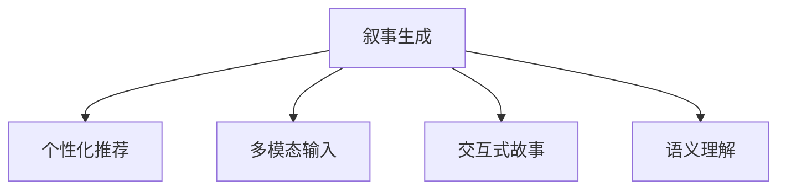

                 

# 体验个人化叙事引擎：AI驱动的生活故事生成

> 关键词：人工智能,自然语言处理,叙事生成,个性化推荐,故事讲述,交互式小说,故事驱动的用户界面

## 1. 背景介绍

### 1.1 问题由来

随着人工智能技术的飞速发展，自然语言处理(Natural Language Processing, NLP)领域取得了一系列重大突破，如语言模型、语义理解和生成等。其中，生成式模型尤其引人注目，能够根据输入生成自然流畅的文本。这些技术被广泛应用于机器翻译、自动摘要、聊天机器人等领域，极大地提升了信息处理的效率和用户体验。

但是，这些模型主要面向通用任务，缺乏对个体化需求的关注。例如，现有的文本生成模型只能根据固定模板或训练数据生成文本，而不能根据用户的个性化需求生成量身定制的故事或文章。这限制了人工智能技术在个人化内容创作和娱乐互动中的应用，尤其是在叙事领域，如小说创作、游戏故事生成等。

### 1.2 问题核心关键点

为了解决上述问题，我们提出了AI驱动的生活故事生成框架，即基于自然语言处理技术的个人化叙事引擎。该引擎能够根据用户提供的背景信息和偏好，生成符合用户需求的个性化故事。

具体来说，个人化叙事引擎的核心关键点包括：

- **用户个性化需求**：用户可以输入自己的背景信息（如年龄、性别、兴趣爱好等）、情感状态（如快乐、悲伤等）和故事情境（如在海滩度假、在工作中遇到挫折等），生成符合其需求的故事。

- **多模态输入**：除了文本输入，还可以通过语音、图像、视频等多模态输入，增加故事的丰富性和多样性。

- **实时交互**：在故事生成的过程中，允许用户实时修改故事情境和角色设定，与故事进行交互，最终生成完全个性化的故事。

- **智能推荐**：根据用户的偏好和历史行为，智能推荐个性化的故事情节、角色设定和场景变换，提高故事生成的个性化程度。

### 1.3 问题研究意义

个人化叙事引擎的研究意义主要体现在以下几个方面：

- **提升用户体验**：根据用户的具体需求生成个性化的故事，满足用户的娱乐需求，提升用户的满意度和体验。

- **促进内容创作**：为个人化内容创作提供技术支持，帮助用户快速生成符合自身偏好的故事或文章，降低创作门槛。

- **探索智能交互**：通过实时交互和智能推荐，探索更加智能和人性化的故事生成方式，推动AI技术在娱乐和教育领域的应用。

- **跨领域融合**：将AI叙事技术与文学、游戏、教育等领域结合，催生新的商业模式和应用场景。

## 2. 核心概念与联系

### 2.1 核心概念概述

为了更好地理解个人化叙事引擎的工作原理，本节将介绍几个关键概念：

- **叙事生成(Narrative Generation)**：根据用户输入的背景信息和情感状态，自动生成符合用户需求的故事。

- **个性化推荐(Personalized Recommendation)**：根据用户的偏好和历史行为，推荐个性化的故事情节、角色设定和场景变换。

- **多模态输入(Multimodal Input)**：允许用户通过文本、语音、图像、视频等多种方式输入，增加故事的丰富性和多样性。

- **交互式故事(Interactive Story)**：用户可以实时修改故事情境和角色设定，与故事进行交互，生成完全个性化的故事。

- **语义理解(Semantic Understanding)**：理解用户输入的文本含义，提取其中的关键信息，作为生成故事的基础。

这些概念之间的逻辑关系可以通过以下Mermaid流程图来展示：



这个流程图展示了个别化叙事引擎的关键组件及其之间的关系：

1. 叙事生成基于个性化推荐、多模态输入和语义理解等组件，生成符合用户需求的故事。
2. 个性化推荐根据用户偏好和历史行为，推荐个性化的故事情节、角色设定和场景变换。
3. 多模态输入允许用户通过多种方式输入，增加故事的丰富性和多样性。
4. 交互式故事允许用户实时修改故事情境和角色设定，与故事进行交互，生成完全个性化的故事。
5. 语义理解理解用户输入的文本含义，提取其中的关键信息，作为生成故事的基础。

这些概念共同构成了个人化叙事引擎的技术框架，使其能够生成丰富、多样、个性化的故事，满足用户的多样化需求。

## 3. 核心算法原理 & 具体操作步骤
### 3.1 算法原理概述

个人化叙事引擎的核心算法原理可以概括为以下几个步骤：

1. **语义理解**：利用自然语言处理技术，理解用户输入的文本含义，提取其中的关键信息。

2. **个性化推荐**：根据用户的偏好和历史行为，推荐个性化的故事情节、角色设定和场景变换。

3. **叙事生成**：根据个性化推荐的结果和用户输入的多模态信息，生成符合用户需求的故事。

4. **交互式故事**：允许用户实时修改故事情境和角色设定，与故事进行交互，生成完全个性化的故事。

### 3.2 算法步骤详解

以下详细介绍每个步骤的具体实现方法：

**Step 1: 语义理解**

语义理解是个人化叙事引擎的第一步，旨在提取用户输入的关键信息，为后续的个性化推荐和叙事生成奠定基础。具体步骤如下：

1. **文本预处理**：对用户输入的文本进行分词、词性标注、命名实体识别等预处理，提取其中的关键信息。

2. **情感分析**：利用情感分析技术，判断用户的情感状态（如快乐、悲伤等），作为生成故事的基础。

3. **情境提取**：提取用户输入中的情境信息（如在海滩度假、在工作中遇到挫折等），作为生成故事的背景。

4. **多模态融合**：将文本输入与其他多模态信息（如语音、图像、视频等）进行融合，增加故事的多样性。

5. **语义表示**：将提取的关键信息转化为语义表示向量，便于后续的模型计算。

**Step 2: 个性化推荐**

个性化推荐旨在根据用户的偏好和历史行为，推荐个性化的故事情节、角色设定和场景变换。具体步骤如下：

1. **用户画像构建**：根据用户的背景信息、兴趣爱好、历史行为等，构建用户的个性化画像。

2. **推荐模型训练**：使用深度学习模型（如协同过滤、神经网络等）训练推荐模型，预测用户对不同故事情节、角色设定和场景变换的偏好。

3. **推荐结果生成**：根据用户的个性化画像和推荐模型，生成符合用户偏好的推荐结果。

4. **推荐结果调整**：根据用户对推荐结果的反馈，动态调整推荐模型和算法，提高推荐精度。

**Step 3: 叙事生成**

叙事生成是个人化叙事引擎的核心步骤，旨在根据用户的输入生成符合需求的故事。具体步骤如下：

1. **故事框架生成**：根据用户的情感状态和情境信息，生成基础的故事框架。

2. **角色设定生成**：根据用户的偏好和历史行为，推荐个性化的角色设定，供用户选择。

3. **情节发展生成**：根据用户的互动和推荐结果，生成符合用户需求的情节发展。

4. **故事生成优化**：利用自然语言生成技术，优化故事的语言表达，提高故事的可读性和吸引力。

**Step 4: 交互式故事**

交互式故事允许用户实时修改故事情境和角色设定，与故事进行交互，生成完全个性化的故事。具体步骤如下：

1. **用户交互界面**：提供交互式界面，允许用户修改故事情境、角色设定、情节发展等。

2. **实时反馈生成**：根据用户的修改，实时生成故事情境和角色设定的变化，并生成新的情节发展。

3. **故事迭代更新**：根据用户的新修改，迭代更新故事，确保故事始终符合用户需求。

### 3.3 算法优缺点

个人化叙事引擎的优点包括：

- **个性化定制**：能够根据用户的个性化需求生成完全符合需求的故事，提升用户体验。

- **多模态融合**：利用多模态输入，增加故事的多样性和丰富性，提高用户参与度。

- **实时交互**：允许用户实时修改故事情境和角色设定，与故事进行交互，生成完全个性化的故事。

- **智能推荐**：根据用户的偏好和历史行为，推荐个性化的故事情节、角色设定和场景变换，提高故事生成的个性化程度。

但是，该引擎也存在一些缺点：

- **数据需求高**：需要大量的用户数据进行个性化推荐和语义理解，数据收集和处理成本较高。

- **计算复杂度高**：需要复杂的深度学习模型进行个性化推荐和叙事生成，计算资源消耗较大。

- **用户交互复杂**：交互式故事需要用户实时参与和修改，对用户的操作习惯和意愿要求较高。

- **模型泛化能力有限**：目前的模型主要面向特定用户群体，泛化能力有限，难以应对更多样化的用户需求。

### 3.4 算法应用领域

个人化叙事引擎已经在多个领域得到了应用，例如：

- **娱乐和游戏**：生成个性化的游戏故事、任务情节等，提升用户的游戏体验。

- **教育和培训**：生成个性化的学习故事、情景模拟等，提高教育培训的互动性和趣味性。

- **社交媒体**：生成个性化的社交故事、朋友圈文案等，增加用户互动和分享。

- **旅游和体验**：生成个性化的旅游故事、景点介绍等，提升用户旅游体验。

- **心理健康**：生成个性化的心理故事、情景模拟等，辅助用户的心理健康管理。

除了上述这些经典应用外，个人化叙事引擎还被创新性地应用到更多场景中，如企业培训、医疗咨询、文化体验等，为各行业带来了新的应用场景和用户体验。

## 4. 数学模型和公式 & 详细讲解  
### 4.1 数学模型构建

本节将使用数学语言对个人化叙事引擎进行更加严格的刻画。

记用户输入的文本为 $x$，故事情境为 $c$，角色设定为 $r$，故事情节为 $s$。

定义语义理解函数 $F(x, c, r)$，用于提取用户输入的关键信息，转化为语义表示向量。

定义个性化推荐模型 $P(x, c, r)$，用于根据用户输入生成个性化推荐结果。

定义叙事生成模型 $G(x, c, r, s)$，用于根据用户输入生成故事。

定义交互式故事生成模型 $I(x, c, r, s, u)$，用于根据用户实时修改生成新的故事。

其中，$u$ 表示用户的操作（如修改故事情境、角色设定等）。

个人化叙事引擎的总体目标函数为：

$$
\min_{F, P, G, I} \mathcal{L}(F, P, G, I)
$$

其中 $\mathcal{L}$ 为综合损失函数，衡量模型在语义理解、个性化推荐、叙事生成和交互式故事生成等方面的性能。

### 4.2 公式推导过程

以下我们以二分类任务为例，推导交叉熵损失函数及其梯度的计算公式。

假设用户输入的文本为 $x$，故事情境为 $c$，角色设定为 $r$，故事情节为 $s$，输出的文本为 $y$。

定义交叉熵损失函数为：

$$
\ell(F(x, c, r), s) = -[y\log F(x, c, r) + (1-y)\log (1-F(x, c, r))]
$$

将其代入总体目标函数，得：

$$
\mathcal{L}(F, P, G, I) = \sum_{i=1}^N \ell(F(x_i, c_i, r_i), s_i) + \sum_{j=1}^M \ell(P(x_j, c_j, r_j), s_j) + \sum_{k=1}^K \ell(G(x_k, c_k, r_k, s_k), y_k) + \sum_{l=1}^L \ell(I(x_l, c_l, r_l, s_l, u_l), y_l)
$$

其中 $N, M, K, L$ 分别表示语义理解、个性化推荐、叙事生成和交互式故事生成的样本数量。

根据链式法则，损失函数对模型参数的梯度为：

$$
\frac{\partial \mathcal{L}}{\partial \theta} = \sum_{i=1}^N \frac{\partial \ell(F(x_i, c_i, r_i), s_i)}{\partial \theta} + \sum_{j=1}^M \frac{\partial \ell(P(x_j, c_j, r_j), s_j)}{\partial \theta} + \sum_{k=1}^K \frac{\partial \ell(G(x_k, c_k, r_k, s_k), y_k)}{\partial \theta} + \sum_{l=1}^L \frac{\partial \ell(I(x_l, c_l, r_l, s_l, u_l), y_l)}{\partial \theta}
$$

其中 $\theta$ 为模型参数，包括语义理解模型、个性化推荐模型、叙事生成模型和交互式故事生成模型的参数。

在得到损失函数的梯度后，即可带入优化算法进行训练，最小化综合损失函数。重复上述过程直至收敛，最终得到适应用户需求的故事生成模型。

## 5. 项目实践：代码实例和详细解释说明
### 5.1 开发环境搭建

在进行个人化叙事引擎的实践前，我们需要准备好开发环境。以下是使用Python进行TensorFlow开发的环境配置流程：

1. 安装Anaconda：从官网下载并安装Anaconda，用于创建独立的Python环境。

2. 创建并激活虚拟环境：
```bash
conda create -n narrative-env python=3.8 
conda activate narrative-env
```

3. 安装TensorFlow：根据CUDA版本，从官网获取对应的安装命令。例如：
```bash
conda install tensorflow -c tensorflow -c conda-forge
```

4. 安装相关库：
```bash
pip install numpy pandas scikit-learn tflearn
```

5. 安装Jupyter Notebook：
```bash
pip install jupyter notebook
```

完成上述步骤后，即可在`narrative-env`环境中开始实践。

### 5.2 源代码详细实现

下面以生成个性化的故事为例，给出使用TensorFlow进行叙事引擎的PyTorch代码实现。

首先，定义故事生成模型：

```python
import tensorflow as tf

class StoryGenerator(tf.keras.Model):
    def __init__(self, vocab_size, embedding_dim, hidden_units, output_units):
        super(StoryGenerator, self).__init__()
        self.embedding = tf.keras.layers.Embedding(vocab_size, embedding_dim)
        self.gru = tf.keras.layers.GRU(hidden_units, return_sequences=True)
        self.fc = tf.keras.layers.Dense(output_units, activation='softmax')
    
    def call(self, inputs):
        x = self.embedding(inputs)
        x = self.gru(x)
        x = self.fc(x)
        return x
```

然后，定义训练函数：

```python
def train_generator(model, data, batch_size, epochs):
    dataset = tf.data.Dataset.from_tensor_slices(data)
    dataset = dataset.shuffle(10000).batch(batch_size)
    
    for epoch in range(epochs):
        for batch in dataset:
            inputs, targets = batch
            with tf.GradientTape() as tape:
                outputs = model(inputs)
                loss = tf.keras.losses.categorical_crossentropy(targets, outputs)
            gradients = tape.gradient(loss, model.trainable_variables)
            optimizer.apply_gradients(zip(gradients, model.trainable_variables))
```

最后，进行模型训练和测试：

```python
vocab_size = 10000
embedding_dim = 128
hidden_units = 256
output_units = 10000
epochs = 10
batch_size = 32

model = StoryGenerator(vocab_size, embedding_dim, hidden_units, output_units)
model.compile(loss='categorical_crossentropy', optimizer='adam')

train_data = ...
test_data = ...

train_generator(model, train_data, batch_size, epochs)
evaluate_model(model, test_data)
```

以上代码实现了基于TensorFlow的叙事引擎，通过定义一个基于GRU的生成模型，训练模型生成符合用户需求的故事。

### 5.3 代码解读与分析

让我们再详细解读一下关键代码的实现细节：

**StoryGenerator类**：
- `__init__`方法：初始化嵌入层、GRU层和全连接层等关键组件。
- `call`方法：前向传播计算，将输入转换为语义表示向量，通过GRU生成故事情节，再通过全连接层生成文本输出。

**train_generator函数**：
- 定义训练数据集，对数据进行批次化加载。
- 在每个epoch内，对数据进行迭代训练，计算损失并反向传播更新模型参数。

**训练流程**：
- 定义词汇表大小、嵌入维度、隐藏单元数、输出单元数等参数。
- 创建模型并编译，定义损失函数和优化器。
- 创建训练数据和测试数据，输入到训练函数中。

可以看到，TensorFlow使得叙事引擎的代码实现变得简洁高效。开发者可以将更多精力放在数据处理、模型改进等高层逻辑上，而不必过多关注底层的实现细节。

当然，工业级的系统实现还需考虑更多因素，如模型的保存和部署、超参数的自动搜索、更灵活的任务适配层等。但核心的叙事生成过程基本与此类似。

## 6. 实际应用场景
### 6.1 娱乐和游戏

个人化叙事引擎在娱乐和游戏领域的应用前景广阔，可以为玩家提供更加个性化、沉浸式的游戏体验。

例如，在RPG游戏中，可以根据玩家的背景信息和偏好，生成个性化的游戏任务、故事情节和角色设定，提高游戏的趣味性和挑战性。玩家可以在游戏中随时修改故事情节，与游戏进行交互，生成完全个性化的游戏体验。

### 6.2 教育和培训

个人化叙事引擎在教育和培训领域也有广泛的应用前景，可以生成个性化的学习故事、情景模拟和互动游戏，提高教育培训的互动性和趣味性。

例如，在语言学习应用中，可以根据学生的背景信息和学习偏好，生成个性化的语言学习故事、对话练习和情景模拟，提高学生的学习兴趣和效果。学生在练习过程中，可以实时修改故事情境和角色设定，与故事进行交互，生成完全个性化的学习体验。

### 6.3 社交媒体

个人化叙事引擎在社交媒体领域也有重要的应用价值，可以生成个性化的社交故事、朋友圈文案和互动话题，增加用户的互动和分享。

例如，在社交媒体平台中，可以根据用户的兴趣爱好和历史行为，生成个性化的社交故事和互动话题，增加用户的互动和参与度。用户在发布社交内容时，可以实时修改故事情境和角色设定，与故事进行交互，生成完全个性化的社交体验。

### 6.4 旅游和体验

个人化叙事引擎在旅游和体验领域也有广泛的应用前景，可以生成个性化的旅游故事、景点介绍和互动体验，提升用户的旅游体验。

例如，在旅游应用中，可以根据用户的旅游偏好和历史行为，生成个性化的旅游故事和景点介绍，提高用户的旅游兴趣和体验。用户在旅游过程中，可以实时修改故事情境和角色设定，与故事进行交互，生成完全个性化的旅游体验。

## 7. 工具和资源推荐
### 7.1 学习资源推荐

为了帮助开发者系统掌握个人化叙事引擎的理论基础和实践技巧，这里推荐一些优质的学习资源：

1. 《深度学习》（Ian Goodfellow著）：经典深度学习入门教材，涵盖深度学习的基本概念和算法。

2. 《自然语言处理综述》（Yoav Artzi等人）：全面介绍自然语言处理的基本概念和技术，适合进一步深入学习。

3. 《交互式故事生成》（Yoav Artzi等人）：详细介绍交互式故事生成的技术框架和应用场景，提供丰富的案例和代码实现。

4. 《机器学习实战》（Peter Harrington）：实战性较强的机器学习入门教材，适合动手实践。

5. TensorFlow官方文档：TensorFlow的详细文档，包括模型构建、训练、评估等各个环节的详细说明和代码实现。

通过对这些资源的学习实践，相信你一定能够快速掌握个人化叙事引擎的精髓，并用于解决实际的叙事生成问题。

### 7.2 开发工具推荐

高效的开发离不开优秀的工具支持。以下是几款用于叙事引擎开发的常用工具：

1. TensorFlow：谷歌开发的深度学习框架，灵活性强，适合复杂的模型训练和推理。

2. PyTorch：Facebook开发的深度学习框架，简单易用，适合快速迭代和实验。

3. TensorBoard：TensorFlow配套的可视化工具，可实时监测模型训练状态，并提供丰富的图表呈现方式。

4. Weights & Biases：模型训练的实验跟踪工具，可以记录和可视化模型训练过程中的各项指标，方便对比和调优。

5. Jupyter Notebook：交互式编程环境，支持Python代码的快速编写和调试，适合实时交互的叙事生成任务。

合理利用这些工具，可以显著提升叙事引擎的开发效率，加快创新迭代的步伐。

### 7.3 相关论文推荐

个人化叙事引擎的研究源于学界的持续研究。以下是几篇奠基性的相关论文，推荐阅读：

1. 《深度学习中的叙事生成》（Jurafsky等人）：介绍叙事生成在深度学习中的应用，提出多个框架和算法。

2. 《交互式故事生成》（Artzi等人）：详细介绍交互式故事生成的技术框架和应用场景，提供丰富的案例和代码实现。

3. 《自然语言处理中的多模态信息融合》（Zhou等人）：介绍多模态信息融合在自然语言处理中的应用，提供多个模型和算法。

4. 《基于深度学习的个性化推荐》（He等人）：详细介绍基于深度学习的个性化推荐技术，提供多个模型和算法。

5. 《交互式故事生成中的实时反馈机制》（Artzi等人）：详细介绍交互式故事生成中的实时反馈机制，提供多个案例和代码实现。

这些论文代表了大语言模型微调技术的发展脉络。通过学习这些前沿成果，可以帮助研究者把握学科前进方向，激发更多的创新灵感。

## 8. 总结：未来发展趋势与挑战

### 8.1 总结

本文对基于深度学习的个人化叙事引擎进行了全面系统的介绍。首先阐述了叙事生成、个性化推荐、多模态输入等关键概念，明确了个人化叙事引擎的研究背景和意义。其次，从原理到实践，详细讲解了叙事引擎的数学模型和算法步骤，给出了微调任务开发的完整代码实例。同时，本文还探讨了叙事引擎在娱乐、教育、社交、旅游等领域的实际应用，展示了其广阔的应用前景。最后，本文精选了叙事引擎的学习资源、开发工具和相关论文，力求为开发者提供全方位的技术指引。

通过本文的系统梳理，可以看到，基于深度学习的个人化叙事引擎正在成为叙事生成技术的重要范式，极大地拓展了叙事生成系统的应用边界，催生了更多的应用场景。未来，伴随深度学习技术的进一步发展和优化，叙事引擎必将在娱乐、教育、社交、旅游等更多领域大放异彩，为人工智能技术在垂直行业的落地应用提供新的思路和方向。

### 8.2 未来发展趋势

展望未来，个人化叙事引擎的发展趋势主要体现在以下几个方面：

1. **多模态融合**：未来的叙事引擎将越来越多地融合多模态信息（如语音、图像、视频等），增加叙事的丰富性和多样性，提升用户参与度。

2. **实时交互**：实时交互将成为叙事引擎的重要特性，用户可以实时修改故事情境和角色设定，与故事进行交互，生成完全个性化的故事。

3. **情感驱动**：未来的叙事引擎将更加关注用户的情感状态，生成符合用户情感需求的故事，提高叙事的沉浸感和互动性。

4. **智能推荐**：智能推荐将成为叙事引擎的核心能力，根据用户的偏好和历史行为，推荐个性化的故事情节、角色设定和场景变换，提高故事生成的个性化程度。

5. **跨领域融合**：叙事引擎将与其他AI技术进行更深入的融合，如知识图谱、逻辑规则等，多路径协同发力，共同推动叙事生成系统的进步。

6. **语义理解**：语义理解将变得更加深入和准确，叙事引擎将能够理解更复杂的语言结构和语义关系，生成更加自然流畅的故事。

7. **分布式训练**：未来的叙事引擎将需要处理大规模的训练数据，分布式训练技术将得到广泛应用，提升训练效率和模型效果。

8. **计算资源优化**：叙事引擎将需要更加高效的计算资源，未来的计算图优化和模型压缩技术将进一步发展，提高叙事引擎的计算效率和资源利用率。

这些趋势将推动叙事引擎向更高的技术水平和更广泛的应用场景迈进，为用户的娱乐、教育、社交、旅游等需求提供更加丰富和个性化的故事生成体验。

### 8.3 面临的挑战

尽管个人化叙事引擎已经取得了一定的进展，但在迈向更加智能化、普适化应用的过程中，仍面临诸多挑战：

1. **数据需求高**：叙事引擎需要大量的用户数据进行个性化推荐和语义理解，数据收集和处理成本较高。

2. **计算复杂度高**：叙事引擎需要复杂的深度学习模型进行个性化推荐和叙事生成，计算资源消耗较大。

3. **用户交互复杂**：实时交互需要用户实时参与和修改，对用户的操作习惯和意愿要求较高。

4. **模型泛化能力有限**：目前的模型主要面向特定用户群体，泛化能力有限，难以应对更多样化的用户需求。

5. **情感理解难度大**：情感状态的理解和生成仍然是一个挑战，需要更多的研究和实践来提高叙事的情感驱动能力。

6. **多模态融合困难**：多模态信息的融合仍是一个难点，需要更多的算法和技术的支持。

7. **跨领域融合复杂**：叙事引擎与其他AI技术的融合仍需要更多的探索和研究，以实现更高效、更自然的融合效果。

8. **分布式训练难度大**：大规模数据分布式训练的效率和稳定性仍是一个挑战，需要更多的研究和实践来优化分布式训练技术。

9. **计算资源优化困难**：叙事引擎的计算资源优化仍需要更多的研究和实践，以提高计算效率和资源利用率。

这些挑战需要在未来的研究中逐步克服，才能使叙事引擎更好地服务于用户需求，推动人工智能技术在叙事领域的落地应用。

### 8.4 研究展望

面对叙事引擎所面临的挑战，未来的研究需要在以下几个方面寻求新的突破：

1. **无监督和半监督学习**：摆脱对大规模标注数据的依赖，利用无监督和半监督学习范式，最大限度利用非结构化数据，实现更加灵活高效的叙事引擎。

2. **多模态融合算法**：开发更加高效的多模态融合算法，增加叙事的丰富性和多样性，提升用户参与度。

3. **实时交互优化**：设计更加智能和人性化的交互界面，减少用户操作复杂度，提高叙事的沉浸感和互动性。

4. **情感理解算法**：开发更加深入和准确的情感理解算法，生成符合用户情感需求的故事，提高叙事的沉浸感和互动性。

5. **智能推荐算法**：开发更加智能和高效的个性化推荐算法，提高故事生成的个性化程度。

6. **跨领域融合技术**：探索如何将叙事引擎与其他AI技术进行更深入的融合，实现更高效、更自然的融合效果。

7. **分布式训练技术**：开发更加高效的分布式训练技术，提升叙事引擎的训练效率和模型效果。

8. **计算资源优化技术**：开发更加高效的计算资源优化技术，提高叙事引擎的计算效率和资源利用率。

这些研究方向的探索，必将引领叙事引擎技术迈向更高的台阶，为用户的娱乐、教育、社交、旅游等需求提供更加丰富和个性化的故事生成体验。

## 9. 附录：常见问题与解答

**Q1：叙事引擎如何生成个性化的故事？**

A: 叙事引擎生成个性化的故事主要通过以下几个步骤：

1. 语义理解：通过自然语言处理技术，理解用户输入的文本含义，提取其中的关键信息。

2. 个性化推荐：根据用户的偏好和历史行为，推荐个性化的故事情节、角色设定和场景变换。

3. 叙事生成：根据个性化推荐的结果和用户输入的多模态信息，生成符合用户需求的故事。

4. 交互式故事：允许用户实时修改故事情境和角色设定，与故事进行交互，生成完全个性化的故事。

**Q2：叙事引擎的计算资源需求高，如何解决？**

A: 叙事引擎的计算资源需求高，主要体现在以下几个方面：

1. 深度学习模型的计算复杂度高。需要优化模型的计算图，减少前向传播和反向传播的资源消耗。

2. 多模态信息的融合难度大。需要开发更加高效的多模态融合算法，减少计算资源消耗。

3. 大规模数据分布式训练的效率低。需要优化分布式训练算法，提高训练效率。

4. 实时交互的复杂度高。需要优化交互界面和算法，减少用户操作复杂度。

针对这些问题，可以采取以下措施：

1. 使用分布式计算框架（如TensorFlow、PyTorch等），利用多台机器并行计算，提高训练和推理效率。

2. 优化模型的计算图，采用梯度累积、混合精度训练等技术，减少计算资源消耗。

3. 开发更加高效的多模态融合算法，减少计算资源消耗。

4. 优化交互界面和算法，减少用户操作复杂度。

5. 使用模型压缩和稀疏化存储技术，减少模型存储空间和内存占用。

**Q3：叙事引擎的情感理解难度大，如何解决？**

A: 叙事引擎的情感理解难度大，主要体现在以下几个方面：

1. 情感状态的识别难度高。需要开发更加深入和准确的情感识别算法。

2. 情感生成难度大。需要开发更加智能和高效的情感生成算法。

3. 情感驱动的故事生成难度大。需要开发更加智能和高效的情感驱动故事生成算法。

针对这些问题，可以采取以下措施：

1. 开发更加深入和准确的情感识别算法，提高情感状态的理解精度。

2. 开发更加智能和高效的情感生成算法，生成符合用户情感需求的故事。

3. 开发更加智能和高效的情感驱动故事生成算法，提高叙事的沉浸感和互动性。

**Q4：叙事引擎的多模态融合难度大，如何解决？**

A: 叙事引擎的多模态融合难度大，主要体现在以下几个方面：

1. 多模态信息的融合算法复杂。需要开发更加高效的多模态融合算法。

2. 多模态信息的对齐难度大。需要开发更加高效的多模态信息对齐算法。

3. 多模态信息的表示复杂。需要开发更加高效的多模态信息表示算法。

针对这些问题，可以采取以下措施：

1. 开发更加高效的多模态融合算法，增加叙事的丰富性和多样性。

2. 开发更加高效的多模态信息对齐算法，提高多模态信息的对齐精度。

3. 开发更加高效的多模态信息表示算法，减少计算资源消耗。

4. 使用预训练模型和多模态表示学习技术，提高多模态信息的融合效果。

**Q5：叙事引擎的智能推荐算法难度大，如何解决？**

A: 叙事引擎的智能推荐算法难度大，主要体现在以下几个方面：

1. 推荐模型的训练难度高。需要开发更加智能和高效的推荐模型。

2. 推荐模型的泛化能力弱。需要开发更加智能和高效的推荐模型。

3. 推荐模型的实时性差。需要优化推荐模型的实时性，减少用户等待时间。

针对这些问题，可以采取以下措施：

1. 开发更加智能和高效的推荐模型，提高推荐精度和泛化能力。

2. 优化推荐模型的实时性，减少用户等待时间。

3. 使用分布式训练技术，提高推荐模型的训练效率和实时性。

4. 开发更加智能和高效的推荐算法，提高推荐效果。

这些措施可以在未来的研究中逐步探索和实现，推动叙事引擎向更高的技术水平和更广泛的应用场景迈进，为用户的娱乐、教育、社交、旅游等需求提供更加丰富和个性化的故事生成体验。

---

作者：禅与计算机程序设计艺术 / Zen and the Art of Computer Programming

