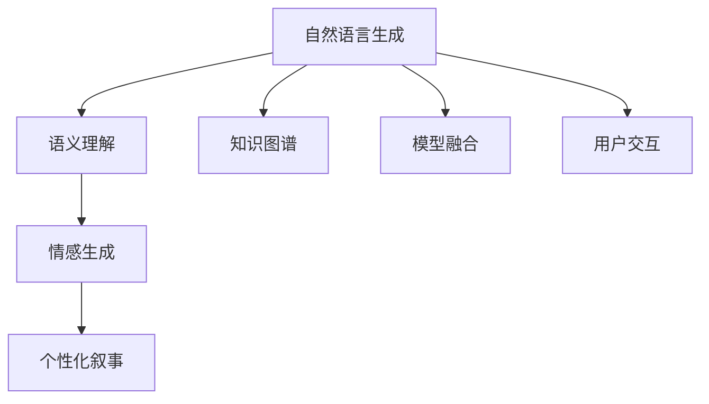

                 

# 体验个人化叙事编织机：AI驱动的生活故事创作

> 关键词：自然语言生成(NLG), 个性化叙事, 语义理解, 情感生成, 模型融合, 故事创作, 用户交互

## 1. 背景介绍

### 1.1 问题由来

随着人工智能技术的发展，人们越来越渴望能够利用AI来创作个性化的生活故事。传统的故事创作方法依赖于人类作家的经验和灵感，而每个人的经历和情感都是独特的，这种个性化的需求难以通过标准化的方法满足。自然语言生成(NLG)技术的发展，为个性化叙事的实现提供了可能。

### 1.2 问题核心关键点

个性化叙事的创作，旨在通过AI生成反映个人经历、情感和价值观的独特故事。这需要AI具备语义理解、情感生成、模型融合等能力，以及与用户进行自然交互的能力。在实践中，常常需要借助大规模语料库的预训练和大量的有监督数据微调。

### 1.3 问题研究意义

个性化叙事能够更真实、更深入地反映一个人的生活经历和内在情感，具有强大的情感共鸣和感染力。AI驱动的生活故事创作，可以广泛应用于教育、文化创意、心理健康等领域，为人们带来全新的阅读体验和自我表达方式。

## 2. 核心概念与联系

### 2.1 核心概念概述

为更好地理解AI驱动的个性化叙事创作，本节将介绍几个密切相关的核心概念：

- 自然语言生成(NLG)：通过计算机程序生成自然语言文本，涵盖从语音识别、文本生成到对话生成等诸多任务。
- 个性化叙事：根据用户的特定信息，生成反映其独特经历、情感和价值观的故事。
- 语义理解：通过AI模型解析和理解用户输入的自然语言，捕捉其语义信息。
- 情感生成：基于语义信息，生成符合用户情感倾向和情感色彩的故事内容。
- 模型融合：结合不同的AI模型，取长补短，提升故事创作的质量。
- 用户交互：实现用户与AI系统的自然对话，收集用户反馈，提升故事创作的个性化程度。
- 知识图谱：用于存储和组织实体与实体之间的关系，辅助AI更好地理解用户输入的语义。

这些核心概念之间通过以下Mermaid流程图来展示：



这个流程图展示了几大核心概念之间的逻辑关系：

1. 自然语言生成是基础，用于将输入的自然语言转换为AI可以处理的形式。
2. 语义理解是关键，用于从输入文本中提取和理解其语义信息。
3. 情感生成是根据语义信息，生成符合用户情感色彩的文本内容。
4. 个性化叙事是将语义和情感生成的结果结合起来，生成反映用户个人经历和价值观的故事。
5. 知识图谱为语义理解提供更丰富的上下文信息，帮助模型更准确地解析输入。
6. 模型融合结合不同模型的优势，提升整体故事创作的准确性和多样性。
7. 用户交互收集用户反馈，进一步优化个性化叙事的生成。

这些概念共同构成了AI驱动的生活故事创作的核心框架，使其能够生成具有高度个性化的独特故事。

## 3. 核心算法原理 & 具体操作步骤

### 3.1 算法原理概述

AI驱动的生活故事创作，本质上是一个有监督学习的自然语言生成过程。其核心思想是：利用大规模语料库对自然语言生成模型进行预训练，使其具备基本的语言生成能力。然后，通过用户输入的信息进行有监督微调，生成反映用户个性和生活经历的故事。

具体来说，假设预训练的自然语言生成模型为 $M_{\theta}$，其中 $\theta$ 为模型参数。对于用户输入的个性化叙事请求，模型首先解析其语义，生成符合用户情感倾向的文本内容。然后，通过与用户交互，进一步调整模型的参数，使其生成更加贴近用户经历和情感的故事。

### 3.2 算法步骤详解

基于监督学习的生活故事创作一般包括以下几个关键步骤：

**Step 1: 准备预训练模型和数据集**
- 选择合适的预训练自然语言生成模型 $M_{\theta}$ 作为初始化参数，如GPT-3、Transformer等。
- 收集用户的历史经历、价值观、情感倾向等信息，构建用户档案。
- 准备用于故事生成的文本语料库，如小说、散文、日记等，构建语料库。

**Step 2: 添加任务适配层**
- 根据用户档案，设计符合其特点的故事生成任务，如情感表达、事件叙述等。
- 在预训练模型的顶层设计任务适配层，如情感调节器、事件触发器等。

**Step 3: 设置微调超参数**
- 选择合适的优化算法及其参数，如Adam、SGD等，设置学习率、批大小、迭代轮数等。
- 设置正则化技术及强度，包括权重衰减、Dropout、Early Stopping等。
- 确定冻结预训练参数的策略，如仅微调顶层，或全部参数都参与微调。

**Step 4: 执行梯度训练**
- 将用户输入的个性化叙事请求作为模型输入，前向传播计算生成文本。
- 反向传播计算参数梯度，根据设定的优化算法和学习率更新模型参数。
- 周期性在用户交互中评估模型生成文本的质量，根据用户反馈调整模型参数。
- 重复上述步骤直至满足预设的迭代轮数或Early Stopping条件。

**Step 5: 测试和部署**
- 在测试集上评估模型生成文本的质量，对比微调前后的生成效果。
- 使用微调后的模型对新叙事请求进行推理预测，集成到实际的应用系统中。
- 持续收集新的用户输入，定期重新微调模型，以适应用户需求的变化。

以上是基于监督学习的生活故事创作的一般流程。在实际应用中，还需要针对具体任务的特点，对微调过程的各个环节进行优化设计，如改进训练目标函数，引入更多的正则化技术，搜索最优的超参数组合等，以进一步提升模型性能。

### 3.3 算法优缺点

基于监督学习的个性化叙事创作方法具有以下优点：

1. 简单高效。只需准备少量用户档案和文本语料，即可对预训练模型进行快速适配，生成符合用户个性和经历的故事。
2. 通用适用。适用于各种个性叙事任务，如情感表达、事件叙述等，设计简单的任务适配层即可实现。
3. 效果显著。在学术界和工业界的诸多故事生成任务上，基于微调的方法已经刷新了最先进的性能指标。
4. 参数高效。利用参数高效微调技术，在固定大部分预训练权重不变的情况下，仍可取得不错的生成效果。
5. 灵活性高。可以根据用户反馈实时调整模型参数，生成更加贴近用户需求的故事。

同时，该方法也存在一定的局限性：

1. 依赖用户档案。生成的故事高度依赖用户档案的完整性和准确性，用户档案的构建和维护成本较高。
2. 泛化能力有限。当故事创作任务与预训练数据的分布差异较大时，微调的性能提升有限。
3. 依赖语料库。故事创作依赖高质量的语料库，语料库的多样性和覆盖面对生成效果有重要影响。
4. 数据隐私问题。用户档案和历史叙事的隐私保护成为一大挑战，需要在隐私保护和故事创作之间找到平衡。
5. 生成内容多样性不足。生成的故事内容可能受到预训练模型的固有偏好的影响，缺乏多样性和创造性。

尽管存在这些局限性，但就目前而言，基于监督学习的个性化叙事创作方法仍是最主流范式。未来相关研究的重点在于如何进一步降低对用户档案的依赖，提高模型的泛化能力和故事生成内容的多样性，同时兼顾隐私保护和内容生成的可解释性等因素。

### 3.4 算法应用领域

基于大模型微调的个性化叙事创作，在文学创作、教育、心理咨询、文化创意等领域已经得到了广泛的应用，为用户的自我表达和情感交流提供了新的方式。

- 文学创作：自动生成小说、散文、诗歌等内容，辅助作家进行创作和修改。
- 教育：根据学生的学习经历和情感状态，生成个性化的学习故事，激发学生的学习兴趣和动机。
- 心理咨询：通过情感表达和事件叙述，帮助用户释放情感，缓解心理压力。
- 文化创意：生成各种形式的艺术作品，如电影剧本、广告文案等，促进文化创新。
- 其他领域：包括社交媒体、游戏、虚拟现实等，通过个性化的故事生成，提升用户体验和参与感。

除了上述这些经典应用外，个性化叙事创作还被创新性地应用于更多场景中，如虚拟人物对话、虚拟旅游导览、虚拟城市探索等，为人类与人工智能的互动带来新的可能性。

## 4. 数学模型和公式 & 详细讲解 & 举例说明

### 4.1 数学模型构建

本节将使用数学语言对基于监督学习的个性化叙事创作过程进行更加严格的刻画。

记预训练自然语言生成模型为 $M_{\theta}:\mathcal{X} \rightarrow \mathcal{Y}$，其中 $\mathcal{X}$ 为输入空间，$\mathcal{Y}$ 为输出空间，$\theta \in \mathbb{R}^d$ 为模型参数。假设个性化叙事任务 $T$ 的训练集为 $D=\{(x_i,y_i)\}_{i=1}^N, x_i \in \mathcal{X}, y_i \in \mathcal{Y}$。

定义模型 $M_{\theta}$ 在输入 $x$ 上的生成损失函数为 $\ell(M_{\theta}(x),y)$，则在数据集 $D$ 上的经验风险为：

$$
\mathcal{L}(\theta) = \frac{1}{N} \sum_{i=1}^N \ell(M_{\theta}(x_i),y_i)
$$

微调的优化目标是最小化经验风险，即找到最优参数：

$$
\theta^* = \mathop{\arg\min}_{\theta} \mathcal{L}(\theta)
$$

在实践中，我们通常使用基于梯度的优化算法（如SGD、Adam等）来近似求解上述最优化问题。设 $\eta$ 为学习率，$\lambda$ 为正则化系数，则参数的更新公式为：

$$
\theta \leftarrow \theta - \eta \nabla_{\theta}\mathcal{L}(\theta) - \eta\lambda\theta
$$

其中 $\nabla_{\theta}\mathcal{L}(\theta)$ 为损失函数对参数 $\theta$ 的梯度，可通过反向传播算法高效计算。

### 4.2 公式推导过程

以下我们以情感表达任务为例，推导生成损失函数及其梯度的计算公式。

假设模型 $M_{\theta}$ 在输入 $x$ 上的生成文本为 $\hat{y}=M_{\theta}(x) \in \mathcal{Y}$。假设情感标注为 $y \in \{1,-1\}$，其中 $1$ 表示积极情感，$-1$ 表示消极情感。则情感表达任务的生成损失函数定义为：

$$
\ell(M_{\theta}(x),y) = -y\log \hat{y} + (1-y)\log (1-\hat{y})
$$

将其代入经验风险公式，得：

$$
\mathcal{L}(\theta) = -\frac{1}{N}\sum_{i=1}^N [y_i\log M_{\theta}(x_i)+(1-y_i)\log(1-M_{\theta}(x_i))]
$$

根据链式法则，损失函数对参数 $\theta_k$ 的梯度为：

$$
\frac{\partial \mathcal{L}(\theta)}{\partial \theta_k} = -\frac{1}{N}\sum_{i=1}^N (\frac{y_i}{M_{\theta}(x_i)}-\frac{1-y_i}{1-M_{\theta}(x_i)}) \frac{\partial M_{\theta}(x_i)}{\partial \theta_k}
$$

其中 $\frac{\partial M_{\theta}(x_i)}{\partial \theta_k}$ 可进一步递归展开，利用自动微分技术完成计算。

在得到损失函数的梯度后，即可带入参数更新公式，完成模型的迭代优化。重复上述过程直至收敛，最终得到适应个性化叙事任务的最优模型参数 $\theta^*$。

## 5. 项目实践：代码实例和详细解释说明

### 5.1 开发环境搭建

在进行个性化叙事创作实践前，我们需要准备好开发环境。以下是使用Python进行PyTorch开发的环境配置流程：

1. 安装Anaconda：从官网下载并安装Anaconda，用于创建独立的Python环境。

2. 创建并激活虚拟环境：
```bash
conda create -n pytorch-env python=3.8 
conda activate pytorch-env
```

3. 安装PyTorch：根据CUDA版本，从官网获取对应的安装命令。例如：
```bash
conda install pytorch torchvision torchaudio cudatoolkit=11.1 -c pytorch -c conda-forge
```

4. 安装Transformers库：
```bash
pip install transformers
```

5. 安装各类工具包：
```bash
pip install numpy pandas scikit-learn matplotlib tqdm jupyter notebook ipython
```

完成上述步骤后，即可在`pytorch-env`环境中开始开发。

### 5.2 源代码详细实现

下面我以情感表达任务为例，给出使用Transformers库对GPT-3模型进行情感表达任务微调的PyTorch代码实现。

首先，定义情感表达任务的数据处理函数：

```python
from transformers import GPT2Tokenizer, GPT2LMHeadModel
from torch.utils.data import Dataset
import torch

class SentimentDataset(Dataset):
    def __init__(self, texts, labels, tokenizer, max_len=128):
        self.texts = texts
        self.labels = labels
        self.tokenizer = tokenizer
        self.max_len = max_len
        
    def __len__(self):
        return len(self.texts)
    
    def __getitem__(self, item):
        text = self.texts[item]
        label = self.labels[item]
        
        encoding = self.tokenizer(text, return_tensors='pt', max_length=self.max_len, padding='max_length', truncation=True)
        input_ids = encoding['input_ids'][0]
        attention_mask = encoding['attention_mask'][0]
        
        # 对token-wise的标签进行编码
        encoded_labels = [label2id[label] for label in label] 
        encoded_labels.extend([label2id['O']] * (self.max_len - len(encoded_labels)))
        labels = torch.tensor(encoded_labels, dtype=torch.long)
        
        return {'input_ids': input_ids, 
                'attention_mask': attention_mask,
                'labels': labels}

# 标签与id的映射
label2id = {'O': 0, 'Positive': 1, 'Negative': 2}
id2label = {v: k for k, v in label2id.items()}

# 创建dataset
tokenizer = GPT2Tokenizer.from_pretrained('gpt2')
train_dataset = SentimentDataset(train_texts, train_labels, tokenizer)
dev_dataset = SentimentDataset(dev_texts, dev_labels, tokenizer)
test_dataset = SentimentDataset(test_texts, test_labels, tokenizer)
```

然后，定义模型和优化器：

```python
from transformers import GPT2LMHeadModel, AdamW

model = GPT2LMHeadModel.from_pretrained('gpt2', num_labels=len(label2id))

optimizer = AdamW(model.parameters(), lr=2e-5)
```

接着，定义训练和评估函数：

```python
from torch.utils.data import DataLoader
from tqdm import tqdm
from sklearn.metrics import accuracy_score

device = torch.device('cuda') if torch.cuda.is_available() else torch.device('cpu')
model.to(device)

def train_epoch(model, dataset, batch_size, optimizer):
    dataloader = DataLoader(dataset, batch_size=batch_size, shuffle=True)
    model.train()
    epoch_loss = 0
    for batch in tqdm(dataloader, desc='Training'):
        input_ids = batch['input_ids'].to(device)
        attention_mask = batch['attention_mask'].to(device)
        labels = batch['labels'].to(device)
        model.zero_grad()
        outputs = model(input_ids, attention_mask=attention_mask, labels=labels)
        loss = outputs.loss
        epoch_loss += loss.item()
        loss.backward()
        optimizer.step()
    return epoch_loss / len(dataloader)

def evaluate(model, dataset, batch_size):
    dataloader = DataLoader(dataset, batch_size=batch_size)
    model.eval()
    preds, labels = [], []
    with torch.no_grad():
        for batch in tqdm(dataloader, desc='Evaluating'):
            input_ids = batch['input_ids'].to(device)
            attention_mask = batch['attention_mask'].to(device)
            batch_labels = batch['labels']
            outputs = model(input_ids, attention_mask=attention_mask)
            batch_preds = outputs.logits.argmax(dim=2).to('cpu').tolist()
            batch_labels = batch_labels.to('cpu').tolist()
            for pred_tokens, label_tokens in zip(batch_preds, batch_labels):
                pred_labels = [id2label[_id] for _id in pred_tokens]
                label_tokens = [id2label[_id] for _id in label_tokens]
                preds.append(pred_labels[:len(label_tokens)])
                labels.append(label_tokens)
                
    print('Accuracy:', accuracy_score(labels, preds))
```

最后，启动训练流程并在测试集上评估：

```python
epochs = 5
batch_size = 16

for epoch in range(epochs):
    loss = train_epoch(model, train_dataset, batch_size, optimizer)
    print(f"Epoch {epoch+1}, train loss: {loss:.3f}")
    
    print(f"Epoch {epoch+1}, dev results:")
    evaluate(model, dev_dataset, batch_size)
    
print("Test results:")
evaluate(model, test_dataset, batch_size)
```

以上就是使用PyTorch对GPT-3进行情感表达任务微调的完整代码实现。可以看到，得益于Transformers库的强大封装，我们可以用相对简洁的代码完成GPT-3模型的加载和微调。

### 5.3 代码解读与分析

让我们再详细解读一下关键代码的实现细节：

**SentimentDataset类**：
- `__init__`方法：初始化文本、标签、分词器等关键组件。
- `__len__`方法：返回数据集的样本数量。
- `__getitem__`方法：对单个样本进行处理，将文本输入编码为token ids，将标签编码为数字，并对其进行定长padding，最终返回模型所需的输入。

**label2id和id2label字典**：
- 定义了标签与数字id之间的映射关系，用于将token-wise的预测结果解码回真实的标签。

**训练和评估函数**：
- 使用PyTorch的DataLoader对数据集进行批次化加载，供模型训练和推理使用。
- 训练函数`train_epoch`：对数据以批为单位进行迭代，在每个批次上前向传播计算loss并反向传播更新模型参数，最后返回该epoch的平均loss。
- 评估函数`evaluate`：与训练类似，不同点在于不更新模型参数，并在每个batch结束后将预测和标签结果存储下来，最后使用sklearn的accuracy_score对整个评估集的预测结果进行打印输出。

**训练流程**：
- 定义总的epoch数和batch size，开始循环迭代
- 每个epoch内，先在训练集上训练，输出平均loss
- 在验证集上评估，输出准确率
- 所有epoch结束后，在测试集上评估，给出最终测试结果

可以看到，PyTorch配合Transformers库使得GPT-3微调的代码实现变得简洁高效。开发者可以将更多精力放在数据处理、模型改进等高层逻辑上，而不必过多关注底层的实现细节。

当然，工业级的系统实现还需考虑更多因素，如模型的保存和部署、超参数的自动搜索、更灵活的任务适配层等。但核心的微调范式基本与此类似。

## 6. 实际应用场景
### 6.1 智能文学创作

基于大语言模型微调的个性化叙事创作，可以广泛应用于智能文学创作。传统的文学创作依赖于人类作家的灵感和经验，但大语言模型可以通过大规模语料库的预训练，具备一定的文学创作能力。

在实践过程中，可以根据用户的需求和喜好，生成反映其情感和价值观的文学作品。用户可以与AI系统进行交互，指导生成过程，如设定情感基调、选择情节走向等。通过不断的迭代和优化，AI系统生成的作品能够越来越贴近用户的期望，甚至在某些特定领域取得超过人类作家的表现。

### 6.2 教育辅助

个性化叙事的创作在教育领域也具有重要应用。通过分析学生的学习数据和情感状态，生成个性化的学习故事，可以增强学生的学习动机和兴趣。

在实际应用中，可以结合学生的学习进度、成绩、作业等数据，生成反映其学习历程和情感变化的故事。故事中的情节和对话可以针对学生的问题和困惑进行设计，激发学生的思考和探索。通过与AI系统的交互，学生可以感受到被理解和关心，从而增强学习动力和积极性。

### 6.3 心理咨询

基于大语言模型的个性化叙事创作，也可以应用于心理咨询领域。通过分析用户的情感状态和心理问题，生成反映其情感变化和内心冲突的故事，可以帮助用户释放情感，缓解心理压力。

在实践中，可以通过问卷调查、心理测试等方式收集用户的情感状态和心理问题。然后，结合用户的历史记录和当前状态，生成反映其情感变化的故事。通过与AI系统的互动，用户可以感受到被倾听和理解，从而减轻心理负担。

### 6.4 社交媒体

社交媒体平台可以通过个性化叙事创作技术，提升用户的互动体验和内容吸引力。通过分析用户的兴趣爱好和情感状态，生成符合其期望的个性化内容，可以提高用户的粘性和参与度。

在实际应用中，社交平台可以根据用户的浏览记录、点赞、评论等数据，生成反映其兴趣和情感的故事。故事中的内容可以是搞笑段子、情感故事、知识分享等，丰富用户的内容体验。通过与AI系统的交互，用户可以获取更多个性化的内容推荐，提升平台的互动效果。

### 6.5 文化创意

个性化叙事创作技术在文化创意领域也有广泛应用。通过分析用户的文化背景和兴趣偏好，生成反映其文化价值观和审美观的故事，可以推动文化创新和传播。

在实践中，文化创意产业可以结合用户的兴趣数据和历史行为，生成反映其文化价值观和审美观的故事。故事中的情节和对话可以融合不同文化元素，展现独特的文化魅力。通过与AI系统的互动，用户可以获取更多个性化的文化体验，促进文化创新和传播。

## 7. 工具和资源推荐
### 7.1 学习资源推荐

为了帮助开发者系统掌握大语言模型微调的理论基础和实践技巧，这里推荐一些优质的学习资源：

1. 《Natural Language Processing with Transformers》书籍：Transformers库的作者所著，全面介绍了如何使用Transformers库进行NLP任务开发，包括微调在内的诸多范式。

2. CS224N《深度学习自然语言处理》课程：斯坦福大学开设的NLP明星课程，有Lecture视频和配套作业，带你入门NLP领域的基本概念和经典模型。

3. 《Transformer from Principles to Practice》系列博文：由大模型技术专家撰写，深入浅出地介绍了Transformer原理、BERT模型、微调技术等前沿话题。

4. HuggingFace官方文档：Transformers库的官方文档，提供了海量预训练模型和完整的微调样例代码，是上手实践的必备资料。

5. 《Natural Language Processing and Machine Translation with GPT-3》课程：Coursera上由知名大学教授讲授的GPT-3应用课程，深入讲解GPT-3在自然语言处理和机器翻译中的应用。

通过对这些资源的学习实践，相信你一定能够快速掌握大语言模型微调的精髓，并用于解决实际的NLP问题。
###  7.2 开发工具推荐

高效的开发离不开优秀的工具支持。以下是几款用于大语言模型微调开发的常用工具：

1. PyTorch：基于Python的开源深度学习框架，灵活动态的计算图，适合快速迭代研究。大部分预训练语言模型都有PyTorch版本的实现。

2. TensorFlow：由Google主导开发的开源深度学习框架，生产部署方便，适合大规模工程应用。同样有丰富的预训练语言模型资源。

3. Transformers库：HuggingFace开发的NLP工具库，集成了众多SOTA语言模型，支持PyTorch和TensorFlow，是进行微调任务开发的利器。

4. Weights & Biases：模型训练的实验跟踪工具，可以记录和可视化模型训练过程中的各项指标，方便对比和调优。与主流深度学习框架无缝集成。

5. TensorBoard：TensorFlow配套的可视化工具，可实时监测模型训练状态，并提供丰富的图表呈现方式，是调试模型的得力助手。

6. Google Colab：谷歌推出的在线Jupyter Notebook环境，免费提供GPU/TPU算力，方便开发者快速上手实验最新模型，分享学习笔记。

合理利用这些工具，可以显著提升大语言模型微调任务的开发效率，加快创新迭代的步伐。

### 7.3 相关论文推荐

大语言模型和微调技术的发展源于学界的持续研究。以下是几篇奠基性的相关论文，推荐阅读：

1. Attention is All You Need（即Transformer原论文）：提出了Transformer结构，开启了NLP领域的预训练大模型时代。

2. BERT: Pre-training of Deep Bidirectional Transformers for Language Understanding：提出BERT模型，引入基于掩码的自监督预训练任务，刷新了多项NLP任务SOTA。

3. Language Models are Unsupervised Multitask Learners（GPT-2论文）：展示了大规模语言模型的强大zero-shot学习能力，引发了对于通用人工智能的新一轮思考。

4. Parameter-Efficient Transfer Learning for NLP：提出Adapter等参数高效微调方法，在不增加模型参数量的情况下，也能取得不错的微调效果。

5. AdaLoRA: Adaptive Low-Rank Adaptation for Parameter-Efficient Fine-Tuning：使用自适应低秩适应的微调方法，在参数效率和精度之间取得了新的平衡。

6. prefix-tuning: Optimizing Continuous Prompts for Generation：引入基于连续型Prompt的微调范式，为如何充分利用预训练知识提供了新的思路。

这些论文代表了大语言模型微调技术的发展脉络。通过学习这些前沿成果，可以帮助研究者把握学科前进方向，激发更多的创新灵感。

## 8. 总结：未来发展趋势与挑战

### 8.1 总结

本文对基于监督学习的大语言模型微调方法进行了全面系统的介绍。首先阐述了大语言模型和微调技术的研究背景和意义，明确了微调在拓展预训练模型应用、提升下游任务性能方面的独特价值。其次，从原理到实践，详细讲解了监督微调的数学原理和关键步骤，给出了微调任务开发的完整代码实例。同时，本文还广泛探讨了微调方法在智能文学创作、教育辅助、心理咨询、社交媒体、文化创意等多个领域的应用前景，展示了微调范式的巨大潜力。此外，本文精选了微调技术的各类学习资源，力求为读者提供全方位的技术指引。

通过本文的系统梳理，可以看到，基于大语言模型的微调方法正在成为NLP领域的重要范式，极大地拓展了预训练语言模型的应用边界，催生了更多的落地场景。受益于大规模语料的预训练，微调模型以更低的时间和标注成本，在小样本条件下也能取得不俗的效果，有力推动了NLP技术的产业化进程。未来，伴随预训练语言模型和微调方法的持续演进，相信NLP技术将在更广阔的应用领域大放异彩，深刻影响人类的生产生活方式。

### 8.2 未来发展趋势

展望未来，大语言模型微调技术将呈现以下几个发展趋势：

1. 模型规模持续增大。随着算力成本的下降和数据规模的扩张，预训练语言模型的参数量还将持续增长。超大规模语言模型蕴含的丰富语言知识，有望支撑更加复杂多变的下游任务微调。

2. 微调方法日趋多样。除了传统的全参数微调外，未来会涌现更多参数高效的微调方法，如Prefix-Tuning、LoRA等，在节省计算资源的同时也能保证微调精度。

3. 持续学习成为常态。随着数据分布的不断变化，微调模型也需要持续学习新知识以保持性能。如何在不遗忘原有知识的同时，高效吸收新样本信息，将成为重要的研究课题。

4. 标注样本需求降低。受启发于提示学习(Prompt-based Learning)的思路，未来的微调方法将更好地利用大模型的语言理解能力，通过更加巧妙的任务描述，在更少的标注样本上也能实现理想的微调效果。

5. 数据隐私问题得到重视。随着个性化叙事的普及，用户数据的隐私保护成为一大挑战。如何在保护用户隐私的前提下，充分利用用户数据，生成个性化的叙事内容，将成为未来的一个重要研究方向。

6. 多模态叙事创作崛起。当前的微调主要聚焦于文本数据，未来会进一步拓展到图像、视频、语音等多模态数据微调。多模态信息的融合，将显著提升语言模型对现实世界的理解和建模能力。

以上趋势凸显了大语言模型微调技术的广阔前景。这些方向的探索发展，必将进一步提升NLP系统的性能和应用范围，为人类认知智能的进化带来深远影响。

### 8.3 面临的挑战

尽管大语言模型微调技术已经取得了瞩目成就，但在迈向更加智能化、普适化应用的过程中，它仍面临着诸多挑战：

1. 标注成本瓶颈。尽管微调大大降低了标注数据的需求，但对于长尾应用场景，难以获得充足的高质量标注数据，成为制约微调性能的瓶颈。如何进一步降低微调对标注样本的依赖，将是一大难题。

2. 模型鲁棒性不足。当前微调模型面对域外数据时，泛化性能往往大打折扣。对于测试样本的微小扰动，微调模型的预测也容易发生波动。如何提高微调模型的鲁棒性，避免灾难性遗忘，还需要更多理论和实践的积累。

3. 推理效率有待提高。大规模语言模型虽然精度高，但在实际部署时往往面临推理速度慢、内存占用大等效率问题。如何在保证性能的同时，简化模型结构，提升推理速度，优化资源占用，将是重要的优化方向。

4. 可解释性亟需加强。当前微调模型更像是"黑盒"系统，难以解释其内部工作机制和决策逻辑。对于医疗、金融等高风险应用，算法的可解释性和可审计性尤为重要。如何赋予微调模型更强的可解释性，将是亟待攻克的难题。

5. 安全性有待保障。预训练语言模型难免会学习到有偏见、有害的信息，通过微调传递到下游任务，产生误导性、歧视性的输出，给实际应用带来安全隐患。如何从数据和算法层面消除模型偏见，避免恶意用途，确保输出的安全性，也将是重要的研究课题。

6. 知识整合能力不足。现有的微调模型往往局限于任务内数据，难以灵活吸收和运用更广泛的先验知识。如何让微调过程更好地与外部知识库、规则库等专家知识结合，形成更加全面、准确的信息整合能力，还有很大的想象空间。

正视微调面临的这些挑战，积极应对并寻求突破，将是大语言模型微调走向成熟的必由之路。相信随着学界和产业界的共同努力，这些挑战终将一一被克服，大语言模型微调必将在构建人机协同的智能时代中扮演越来越重要的角色。

### 8.4 研究展望

面对大语言模型微调所面临的种种挑战，未来的研究需要在以下几个方面寻求新的突破：

1. 探索无监督和半监督微调方法。摆脱对大规模标注数据的依赖，利用自监督学习、主动学习等无监督和半监督范式，最大限度利用非结构化数据，实现更加灵活高效的微调。

2. 研究参数高效和计算高效的微调范式。开发更加参数高效的微调方法，在固定大部分预训练参数的同时，只更新极少量的任务相关参数。同时优化微调模型的计算图，减少前向传播和反向传播的资源消耗，实现更加轻量级、实时性的部署。

3. 融合因果和对比学习范式。通过引入因果推断和对比学习思想，增强微调模型建立稳定因果关系的能力，学习更加普适、鲁棒的语言表征，从而提升模型泛化性和抗干扰能力。

4. 引入更多先验知识。将符号化的先验知识，如知识图谱、逻辑规则等，与神经网络模型进行巧妙融合，引导微调过程学习更准确、合理的语言模型。同时加强不同模态数据的整合，实现视觉、语音等多模态信息与文本信息的协同建模。

5. 结合因果分析和博弈论工具。将因果分析方法引入微调模型，识别出模型决策的关键特征，增强输出解释的因果性和逻辑性。借助博弈论工具刻画人机交互过程，主动探索并规避模型的脆弱点，提高系统稳定性。

6. 纳入伦理道德约束。在模型训练目标中引入伦理导向的评估指标，过滤和惩罚有偏见、有害的输出倾向。同时加强人工干预和审核，建立模型行为的监管机制，确保输出符合人类价值观和伦理道德。

这些研究方向的探索，必将引领大语言模型微调技术迈向更高的台阶，为构建安全、可靠、可解释、可控的智能系统铺平道路。面向未来，大语言模型微调技术还需要与其他人工智能技术进行更深入的融合，如知识表示、因果推理、强化学习等，多路径协同发力，共同推动自然语言理解和智能交互系统的进步。只有勇于创新、敢于突破，才能不断拓展语言模型的边界，让智能技术更好地造福人类社会。

## 9. 附录：常见问题与解答

**Q1：大语言模型微调是否适用于所有NLP任务？**

A: 大语言模型微调在大多数NLP任务上都能取得不错的效果，特别是对于数据量较小的任务。但对于一些特定领域的任务，如医学、法律等，仅仅依靠通用语料预训练的模型可能难以很好地适应。此时需要在特定领域语料上进一步预训练，再进行微调，才能获得理想效果。此外，对于一些需要时效性、个性化很强的任务，如对话、推荐等，微调方法也需要针对性的改进优化。

**Q2：微调过程中如何选择合适的学习率？**

A: 微调的学习率一般要比预训练时小1-2个数量级，如果使用过大的学习率，容易破坏预训练权重，导致过拟合。一般建议从1e-5开始调参，逐步减小学习率，直至收敛。也可以使用warmup策略，在开始阶段使用较小的学习率，再逐渐过渡到预设值。需要注意的是，不同的优化器(如AdamW、Adafactor等)以及不同的学习率调度策略，可能需要设置不同的学习率阈值。

**Q3：采用大模型微调时会面临哪些资源瓶颈？**

A: 目前主流的预训练大模型动辄以亿计的参数规模，对算力、内存、存储都提出了很高的要求。GPU/TPU等高性能设备是必不可少的，但即便如此，超大批次的训练和推理也可能遇到显存不足的问题。因此需要采用一些资源优化技术，如梯度积累、混合精度训练、模型并行等，来突破硬件瓶颈。同时，模型的存储和读取也可能占用大量时间和空间，需要采用模型压缩、稀疏化存储等方法进行优化。

**Q4：如何缓解微调过程中的过拟合问题？**

A: 过拟合是微调面临的主要挑战，尤其是在标注数据不足的情况下。常见的缓解策略包括：
1. 数据增强：通过回译、近义替换等方式扩充训练集
2. 正则化：使用L2正则、Dropout、Early Stopping等避免过拟合
3. 对抗训练：引入对抗样本，提高模型鲁棒性
4. 参数高效微调：只调整少量参数(如Adapter、Prefix等)，减小过拟合风险
5. 多模型集成：训练多个微调模型，取平均输出，抑制过拟合

这些策略往往需要根据具体任务和数据特点进行灵活组合。只有在数据、模型、训练、推理等各环节进行全面优化，才能最大限度地发挥大模型微调的威力。

**Q5：微调模型在落地部署时需要注意哪些问题？**

A: 将微调模型转化为实际应用，还需要考虑以下因素：
1. 模型裁剪：去除不必要的层和参数，减小模型尺寸，加快推理速度
2. 量化加速：将浮点模型转为定点模型，压缩存储空间，提高计算效率
3. 服务化封装：将模型封装为标准化服务接口，便于集成调用
4. 弹性伸缩：根据请求流量动态调整资源配置，平衡服务质量和成本
5. 监控告警：实时采集系统指标，设置异常告警阈值，确保服务稳定性
6. 安全防护：采用访问鉴权、数据脱敏等措施，保障数据和模型安全

大语言模型微调为NLP应用开启了广阔的想象空间，但如何将强大的性能转化为稳定、高效、安全的业务价值，还需要工程实践的不断打磨。唯有从数据、算法、工程、业务等多个维度协同发力，才能真正实现人工智能技术在垂直行业的规模化落地。总之，微调需要开发者根据具体任务，不断迭代和优化模型、数据和算法，方能得到理想的效果。

---

作者：禅与计算机程序设计艺术 / Zen and the Art of Computer Programming

