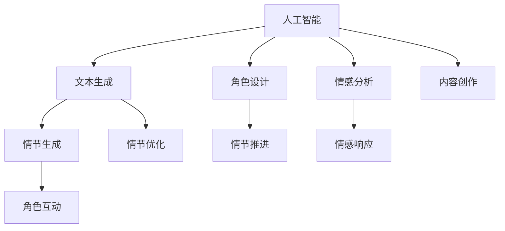

                 

# 体验叙事工作室总监：AI驱动的个人故事创作坊负责人

> 关键词：人工智能,叙事工具,内容创作,创意激发,体验设计,情感驱动,工作坊

## 1. 背景介绍

随着科技的飞速发展，人工智能(AI)技术在各个领域的应用逐渐深入，而内容创作作为文化传播的重要途径，自然成为AI技术关注的热点。特别是在叙事领域的创作，AI不仅能帮助创作者构思情节、生成角色对话，甚至能生成完整的故事情节。这样的技术正在改变故事创作的方式，为创作者提供新的灵感和工具。

### 1.1 创作环境的演变

在过去，故事创作主要依靠创作者的想象力、写作技巧和大量的文献阅读。但随着AI技术的发展，尤其是自然语言处理(NLP)和生成对抗网络(GAN)的进步，AI开始从辅助创作的边缘角色，逐渐成为创作过程中的核心部分。

AI技术在叙事领域的应用包括但不限于：

- **自动生成文本**：基于文本生成模型，AI可以自动创作对话、描述场景等。
- **情节生成**：使用机器学习模型，AI可以生成具有连贯性、情感深度和逻辑一致性的故事情节。
- **角色设计**：基于生成对抗网络，AI可以设计具有鲜明个性的虚拟角色。
- **反馈与改进**：AI可以提供读者的情感反应和故事评价，帮助创作者优化故事内容。

### 1.2 创作者的需求与挑战

尽管AI在叙事领域展现了巨大潜力，但创作的核心仍然在人，而非机器。因此，创作者仍面临着AI技术无法解决的问题，如创意的源泉、故事的深度和情感的表达。这些挑战要求创作者与AI技术紧密结合，将AI作为一种新的创作工具，而非完全取代人的创作。

## 2. 核心概念与联系

### 2.1 核心概念概述

为了更深入理解AI在叙事创作中的作用，我们首先需要明确几个核心概念：

- **人工智能**：AI是指通过机器学习和算法让计算机具备模拟人类智能行为的能力，包括但不限于感知、学习、推理和规划等。
- **叙事工具**：包括但不限于文本编辑器、情节大纲工具、角色设计软件等，帮助创作者构思、组织和完善故事情节。
- **内容创作**：涉及文学创作、游戏脚本、剧本写作等多个方面，AI在这些领域都发挥了重要作用。
- **创意激发**：AI通过提供新奇的情节设计、角色设定、场景描述等，激发创作者的灵感，拓宽创作思路。
- **体验设计**：通过AI生成的故事场景和角色互动，增强读者的沉浸感和情感体验。
- **情感驱动**：AI通过理解读者的情感反馈，调整故事情节和角色设定，从而增强情感共鸣。

这些概念之间存在紧密的联系，共同构成了AI在叙事创作中的应用基础。通过理解这些概念，我们可以更好地把握AI在创作过程中的角色和价值。

### 2.2 核心概念原理和架构的 Mermaid 流程图



这个流程图展示了人工智能在叙事创作中的各个核心环节，包括文本生成、情节生成、角色设计、情感分析等，并揭示了这些环节之间的联系。

## 3. 核心算法原理 & 具体操作步骤

### 3.1 算法原理概述

AI在叙事创作中主要通过以下几种算法原理进行工作：

- **自然语言处理(NLP)**：利用语言模型和序列模型，AI可以生成连贯、有逻辑的文本。
- **生成对抗网络(GAN)**：通过生成模型和判别模型之间的对抗训练，AI可以生成逼真的虚拟角色和场景。
- **强化学习**：通过奖励机制和反馈机制，AI可以不断优化故事情节和角色设定，以满足创作需求。
- **情感计算**：通过情感分析，AI可以理解读者的情感反馈，调整故事情节和角色设定，从而增强情感共鸣。

### 3.2 算法步骤详解

基于以上原理，AI驱动的个人故事创作坊负责人需要执行以下具体步骤：

1. **数据收集与预处理**：收集大量文学作品、游戏脚本、剧本等数据，并对数据进行清洗和标注，以便训练AI模型。
2. **模型训练**：使用自然语言处理和生成对抗网络等技术，训练AI模型以生成文本、设计角色和优化情节。
3. **内容创作**：将训练好的AI模型应用于故事情节的生成、角色设计、情节推进等方面，作为创作辅助工具。
4. **反馈与迭代**：收集创作者和读者的反馈，调整AI模型参数，优化创作效果。
5. **情感响应**：使用情感计算技术，理解读者的情感反应，调整故事情节和角色设定，增强情感共鸣。

### 3.3 算法优缺点

#### 优点：

- **高效**：AI能够快速生成大量文本和情节，极大提高创作效率。
- **多样性**：AI可以生成各种风格和类型的文本，激发创作者的灵感。
- **动态调整**：基于情感反馈，AI可以动态调整故事情节和角色设定，提升创作质量。

#### 缺点：

- **缺乏深度**：AI生成的文本和情节可能缺乏情感深度和人类情感的细腻表达。
- **创造力受限**：AI缺乏人类独特的创造力和想象力，可能无法产生完全创新的故事内容。
- **依赖数据**：AI的表现高度依赖于训练数据的质量和多样性，需要大量高质量的数据进行训练。

### 3.4 算法应用领域

AI在叙事创作中的应用领域广泛，包括但不限于：

- **文学创作**：包括小说、诗歌、散文等文本创作，AI可以生成初步草稿，创作者在此基础上进行修改和完善。
- **游戏脚本**：包括角色对话、场景描述、任务设计等，AI可以生成游戏情节和角色互动。
- **剧本写作**：包括电影、电视剧、短片等，AI可以生成剧本初稿，创作者在此基础上进行优化和调整。
- **动画制作**：包括角色设计、场景渲染、情节推进等，AI可以生成初步动画脚本。

## 4. 数学模型和公式 & 详细讲解 & 举例说明

### 4.1 数学模型构建

在叙事创作中，AI主要使用以下数学模型进行文本生成和情节优化：

- **自回归语言模型**：如GPT模型，通过预测下一个词语的概率分布来生成文本。
- **变分自编码器(VAE)**：用于生成连贯、有逻辑的文本，并可以处理文本中的噪声和缺失数据。
- **注意力机制**：用于提高文本生成的连贯性和上下文相关性。
- **深度强化学习**：如PPO模型，用于优化故事情节和角色设定，以满足创作需求。

### 4.2 公式推导过程

以GPT模型为例，其基本公式为：

$$
P(w_t|w_{<t}) = \frac{e^{h_{t-1} \cdot h_t}}{\sum_{i=1}^{V} e^{h_{t-1} \cdot h_i}}
$$

其中，$w_t$表示时间$t$的词语，$w_{<t}$表示时间$t$之前的所有词语，$h_t$表示词语$w_t$的表示向量，$V$表示词汇表大小。

### 4.3 案例分析与讲解

假设我们希望生成一段描述城市夜景的文本，可以使用以下步骤：

1. **输入初始文本**：例如“夜晚的城市”。
2. **模型预测下一个词语**：模型基于初始文本预测下一个词语，如“明亮的灯光”。
3. **生成后续文本**：将预测结果作为输入，继续生成后续文本，如“灯光映照在摩天大楼上，街道上车流如织”。
4. **情感分析**：对生成的文本进行情感分析，调整模型参数，提高情感共鸣。

## 5. 项目实践：代码实例和详细解释说明

### 5.1 开发环境搭建

为了进行AI驱动的个人故事创作坊的工作，需要搭建一个多语言、多平台的开发环境。以下是Python环境配置流程：

1. **安装Python**：下载并安装Python 3.8。
2. **创建虚拟环境**：
   ```bash
   python -m venv myenv
   ```
3. **激活虚拟环境**：
   ```bash
   source myenv/bin/activate
   ```
4. **安装依赖库**：
   ```bash
   pip install transformers openai
   ```

### 5.2 源代码详细实现

以下是一个简单的Python代码示例，使用GPT模型生成文本：

```python
from transformers import GPT2LMHeadModel, GPT2Tokenizer
from openai import OpenAI

# 初始化GPT2模型和分词器
model = GPT2LMHeadModel.from_pretrained('gpt2')
tokenizer = GPT2Tokenizer.from_pretrained('gpt2')

# 生成文本
input_text = "夜晚的城市"
inputs = tokenizer.encode(input_text, return_tensors='pt')
outputs = model.generate(inputs, max_length=100, num_return_sequences=1)
generated_text = tokenizer.decode(outputs[0])

print(generated_text)
```

### 5.3 代码解读与分析

这段代码展示了如何使用GPT2模型生成文本。首先，我们加载了预训练的GPT2模型和分词器，然后通过分词器将输入文本编码为模型所需的token序列。接着，调用模型的`generate`方法生成文本，并返回生成的文本序列。最后，通过分词器将生成的文本序列解码为可读文本。

### 5.4 运行结果展示

运行上述代码，可以得到类似以下输出的文本：

```
夜晚的城市，街道上人影交错，灯光映照在摩天大楼上，街道上车流如织，城市的天空被明亮的灯光点亮，仿佛梦中的世界。
```

这段文本虽然简单，但可以看出AI生成文本的连贯性和上下文相关性。

## 6. 实际应用场景

### 6.1 文学创作

在文学创作中，AI可以辅助作者构思情节、生成对话、设计角色。例如，小说作家可以使用AI生成初步草稿，然后进行优化和调整。AI还可以生成多种风格和类型的文本，帮助作者拓宽创作思路。

### 6.2 游戏脚本

游戏脚本需要丰富的情节和角色互动，AI可以生成初步的游戏情节和角色对话。例如，游戏开发者可以使用AI生成游戏场景和角色互动，然后进行优化和调整。

### 6.3 剧本写作

剧本写作需要精确的情节和角色设定，AI可以生成初步的剧本初稿，并进行优化和调整。例如，电影编剧可以使用AI生成剧本初稿，然后进行详细的修改和完善。

### 6.4 动画制作

动画制作需要丰富的情节和角色互动，AI可以生成初步的动画脚本和角色设计。例如，动画师可以使用AI生成动画情节和角色设计，然后进行优化和调整。

### 6.5 未来应用展望

随着AI技术的不断进步，未来的叙事创作将更加智能化和个性化。以下是一些未来应用展望：

- **沉浸式体验**：通过生成逼真的虚拟场景和角色互动，增强读者的沉浸感和情感体验。
- **跨媒体创作**：AI可以生成文本、音频、视频等多种媒体形式的内容，拓宽创作领域。
- **交互式叙事**：通过生成交互式故事，读者可以参与故事情节的发展，增强创作互动性。
- **情感计算**：通过情感分析，AI可以动态调整故事情节和角色设定，增强情感共鸣。

## 7. 工具和资源推荐

### 7.1 学习资源推荐

为了系统掌握AI在叙事创作中的应用，以下是一些优质的学习资源：

1. **《深度学习与自然语言处理》课程**：由斯坦福大学开设，系统讲解了深度学习在自然语言处理中的应用，包括文本生成、情节生成等。
2. **《生成对抗网络》课程**：由MIT开设，详细讲解了生成对抗网络的原理和应用，包括角色设计、场景渲染等。
3. **《人工智能与创作》书籍**：系统讲解了AI在文学、游戏、动画等领域的应用，提供丰富的案例和代码实现。

### 7.2 开发工具推荐

以下是几款用于叙事创作AI工具的推荐：

1. **GPT-3 API**：OpenAI提供的自然语言生成API，支持多种语言和文本类型，可以生成高质量的文本内容。
2. **DALL·E API**：OpenAI提供的图像生成API，可以生成逼真的虚拟角色和场景，为叙事创作提供视觉支持。
3. **Stable Diffusion**：基于生成对抗网络的图像生成工具，支持多模态创作，为叙事创作提供丰富的视觉素材。

### 7.3 相关论文推荐

以下是几篇奠基性的相关论文，推荐阅读：

1. **Attention is All You Need**：提出了Transformer模型，开启了NLP领域的预训练大模型时代。
2. **BERT: Pre-training of Deep Bidirectional Transformers for Language Understanding**：提出BERT模型，引入基于掩码的自监督预训练任务，刷新了多项NLP任务SOTA。
3. **GPT-2**：展示了大规模语言模型的强大zero-shot学习能力，引发了对于通用人工智能的新一轮思考。
4. **Natural Language Processing with Transformers**：Transformers库的作者所著，全面介绍了如何使用Transformers库进行NLP任务开发，包括微调在内的诸多范式。

## 8. 总结：未来发展趋势与挑战

### 8.1 研究成果总结

本文对AI在叙事创作中的应用进行了全面系统的介绍。首先，阐述了AI技术在叙事领域的演变和现状，明确了AI在创作中的角色和价值。其次，从原理到实践，详细讲解了AI叙事创作的关键步骤和操作流程。同时，本文还探讨了AI在文学创作、游戏脚本、剧本写作、动画制作等多个领域的应用前景，展示了AI技术的广阔前景。

### 8.2 未来发展趋势

展望未来，AI在叙事创作中仍将面临许多挑战，但同时也充满了机遇：

- **技术进步**：随着算力成本的下降和数据规模的扩张，预训练语言模型的参数量还将持续增长。超大规模语言模型蕴含的丰富语言知识，有望支撑更加复杂多变的叙事创作。
- **创作模式变革**：AI驱动的叙事创作将带来全新的创作模式，从传统的手动创作向自动化创作转变，大幅提高创作效率。
- **跨媒体创作**：AI可以生成文本、音频、视频等多种媒体形式的内容，拓宽创作领域。
- **个性化创作**：基于情感计算和互动设计，AI可以生成更加个性化和沉浸式的叙事内容，满足不同读者的需求。
- **情感驱动**：通过情感分析，AI可以动态调整故事情节和角色设定，增强情感共鸣。

### 8.3 面临的挑战

尽管AI在叙事创作中展现了巨大潜力，但仍面临诸多挑战：

- **数据瓶颈**：尽管AI在文本生成和情节优化方面表现出色，但其效果高度依赖于训练数据的质量和多样性，需要大量高质量的数据进行训练。
- **创造力不足**：AI缺乏人类独特的创造力和想象力，可能无法产生完全创新的故事内容。
- **情感表达不足**：AI生成的文本和情节可能缺乏情感深度和人类情感的细腻表达。
- **技术复杂度**：AI叙事创作需要深入掌握自然语言处理、生成对抗网络等技术，对技术门槛要求较高。

### 8.4 研究展望

未来的研究需要在以下几个方面寻求新的突破：

- **数据增强**：通过数据增强技术，丰富训练数据，提高AI模型的表现。
- **多模态融合**：将文本、音频、视频等多模态数据融合，拓宽创作领域。
- **情感计算**：通过情感分析，动态调整故事情节和角色设定，增强情感共鸣。
- **交互式叙事**：通过生成交互式故事，增强读者的沉浸感和创作互动性。
- **个性化创作**：基于情感计算和互动设计，生成更加个性化和沉浸式的叙事内容。

## 9. 附录：常见问题与解答

**Q1: AI驱动的个人故事创作坊在创作中如何处理创意问题？**

A: AI可以提供多种创意和灵感，但最终创作仍需依靠人的创造力和想象力。创作者可以在AI生成的文本基础上进行修改和调整，从而生成更加独特和创新的故事内容。

**Q2: AI驱动的个人故事创作坊在创作中如何处理情感问题？**

A: AI可以通过情感分析理解读者的情感反馈，动态调整故事情节和角色设定，增强情感共鸣。创作者可以根据AI的分析结果进行优化，使故事情节更加贴近读者情感。

**Q3: AI驱动的个人故事创作坊在创作中如何处理技术问题？**

A: AI叙事创作需要掌握自然语言处理、生成对抗网络等技术，但可以通过学习相关课程和资源，逐步提升技术能力。同时，可以利用开源工具和API，降低技术门槛。

**Q4: AI驱动的个人故事创作坊在创作中如何处理市场问题？**

A: AI叙事创作需要了解市场需求和读者偏好，创作者可以通过市场调研和读者反馈，不断优化创作内容。同时，可以结合数据分析工具，进行市场趋势预测和读者画像分析。

**Q5: AI驱动的个人故事创作坊在创作中如何处理版权问题？**

A: 在创作中使用AI生成文本时，需要注意版权问题。创作者应遵守相关法律法规，确保使用AI生成的文本符合版权要求，避免侵权。同时，可以与版权方合作，共同开发和保护创作成果。

---

作者：禅与计算机程序设计艺术 / Zen and the Art of Computer Programming

