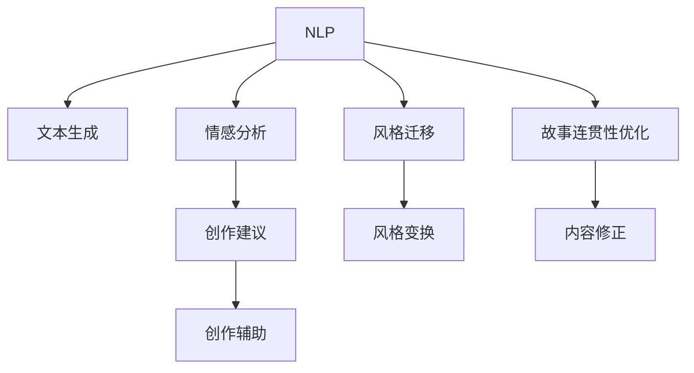

                 

# 体验叙事工作室：AI驱动的个人故事创作坊

## 1. 背景介绍

### 1.1 问题由来
在数字化时代，个人叙事变得越来越重要。无论是日记、博客、小说还是学术论文，叙事都是信息传播的核心方式。然而，叙事不仅仅是传递信息，更是情感的共鸣和思想的表达。传统的手工写作方式耗时耗力，难以满足现代快节奏生活的需求。AI技术的崛起，为叙事带来了全新的可能性。

体验叙事工作室（Experiential Storytelling Workshop, ESW）是一款基于AI技术的个人故事创作工具，旨在利用先进的人工智能技术，帮助用户快速生成高质量的叙事作品。它不仅能够处理自然语言处理(NLP)任务，如文本生成、情感分析、风格迁移等，还能够通过个性化的建议和辅助，激发用户的创作灵感，提高写作效率。

### 1.2 问题核心关键点
体验叙事工作室的核心理念是：利用AI驱动叙事创作，结合用户的个人喜好和情感，创作出既有深度又有温度的叙事作品。它通过以下关键技术实现这一目标：

- 自然语言处理（NLP）：理解用户的叙述意图和情感，生成符合用户期望的文本内容。
- 生成对抗网络（GAN）：生成新颖而富有创意的文本段落，以丰富叙事的风格和结构。
- 情感分析：分析文本的情感倾向，为用户提供个性化的创作建议。
- 风格迁移：将用户的文本转换为特定风格，如幽默、浪漫、悬疑等，满足不同创作需求。
- 故事连贯性优化：通过语义分析，确保故事内容的连贯性和逻辑性。

这些核心技术共同构成了体验叙事工作室的技术架构，使其能够在叙事的各个环节提供全方位的支持，帮助用户创作出令人满意的故事作品。

## 2. 核心概念与联系

### 2.1 核心概念概述

为了更好地理解体验叙事工作室的技术架构和应用场景，本节将介绍几个密切相关的核心概念：

- 自然语言处理（NLP）：指计算机与人类语言之间的交互，包括语言理解、文本生成、情感分析、语言翻译等。
- 生成对抗网络（GAN）：一种用于生成和分析数据的深度学习模型，通过两个神经网络（生成器和判别器）相互竞争，生成具有高逼真度的文本或图像。
- 情感分析：分析文本中的情感倾向，如正面、负面、中性等，帮助用户理解自己的情感表达，或提供创作的情感导向。
- 风格迁移：将文本的风格从一种形式转换为另一种形式，如将散文转换为诗歌，或将平实语言转换为文学风格。
- 故事连贯性优化：通过分析文本的语义结构，确保故事内容的连贯性和逻辑性，避免冗余和跳跃。

这些核心概念之间的逻辑关系可以通过以下Mermaid流程图来展示：



这个流程图展示了一系列核心概念及其之间的联系：

1. NLP处理用户输入，生成初始文本内容。
2. 情感分析提取情感倾向，提供创作导向。
3. 风格迁移改变文本风格，满足不同创作需求。
4. 创作建议基于情感和风格，提供个性化建议。
5. 故事连贯性优化确保内容连贯，修正逻辑漏洞。

这些概念共同构成了体验叙事工作室的核心技术框架，使其能够为用户提供全方位的故事创作支持。

## 3. 核心算法原理 & 具体操作步骤
### 3.1 算法原理概述

体验叙事工作室的算法原理主要基于自然语言处理和生成对抗网络。其核心思想是：将用户输入的自然语言文本作为初始数据，通过NLP技术提取语言特征，再结合GAN模型生成富有创意的文本内容。同时，通过情感分析和风格迁移技术，增强文本的表现力和可读性，确保故事内容的连贯性和逻辑性。

### 3.2 算法步骤详解

体验叙事工作室的微调过程主要包括以下几个关键步骤：

**Step 1: 准备用户输入和初始文本**
- 用户输入一段自然语言文本，作为创作故事的起始点。
- 利用NLP技术对文本进行分词、词性标注、情感分析等处理，提取关键特征。

**Step 2: 生成初始文本**
- 将用户输入的文本和提取的特征作为生成对抗网络（GAN）的输入，生成初步的文本段落。
- GAN模型的生成器和判别器相互竞争，不断迭代优化，生成符合用户期望的文本内容。

**Step 3: 风格迁移**
- 使用风格迁移技术将生成的文本段落转换为用户期望的风格，如幽默、浪漫、悬疑等。
- 通过对文本语义结构的分析，确保风格转换后的文本内容仍然保持连贯性和逻辑性。

**Step 4: 情感分析**
- 利用情感分析技术，对文本内容进行分析，判断情感倾向。
- 根据情感倾向，提供个性化的创作建议，如增加情感表达、调整情感强度等。

**Step 5: 创作辅助**
- 通过故事连贯性优化，确保文本段落的连贯性和逻辑性。
- 提供创意性和个性化的创作建议，如改变叙述视角、引入新角色等。

**Step 6: 生成最终文本**
- 综合上述各步骤的结果，生成最终的故事文本。
- 提供文本可视化工具，如故事图谱、情感曲线等，帮助用户理解创作过程和结果。

以上是体验叙事工作室的微调过程的基本步骤。在实际应用中，还需要根据具体任务和用户需求，对各环节进行优化设计，以进一步提升创作效果。

### 3.3 算法优缺点

体验叙事工作室的算法具有以下优点：
1. 高效便捷：通过AI驱动的创作辅助，大大减少了手工写作的时间和精力。
2. 创意丰富：利用生成对抗网络生成的文本，具有较高的创意性和多样性，满足不同创作需求。
3. 个性化定制：基于情感分析和风格迁移技术，能够提供个性化的创作建议，提高创作效果。
4. 连贯性保障：通过故事连贯性优化，确保文本内容的连贯性和逻辑性，减少冗余和跳跃。

同时，该算法也存在一些局限性：
1. 依赖高质量输入：创作效果很大程度上取决于用户输入的初始文本质量，输入不充分或过于散乱可能导致创作效果不佳。
2. 风格转换限制：尽管风格迁移技术较为先进，但仍难以完全摆脱原始文本的痕迹，风格转换效果受限。
3. 情感分析误差：情感分析的准确度受文本情感表达的复杂性和多样性影响，可能会产生误判。
4. 创作建议局限：创作建议依赖于模型对输入文本的分析和理解，模型训练数据的多样性和质量直接影响建议效果。
5. 连贯性优化不足：故事连贯性优化依赖于文本内容的语义分析和自然语言处理技术，对于极端复杂的叙事结构可能存在不足。

尽管存在这些局限性，但就目前而言，体验叙事工作室的算法在故事创作领域已经展现出巨大的潜力和应用前景。未来相关研究的重点在于如何进一步优化算法模型，提升文本生成的质量，提高创作的连贯性和可读性，同时兼顾创意性和情感表达。

### 3.4 算法应用领域

体验叙事工作室的算法技术在多个领域具有广泛的应用前景，包括：

- 文学创作：作家可以借助创作辅助和风格迁移技术，生成不同风格的文本段落，丰富创作内容。
- 教育培训：教师可以利用情感分析和创作建议功能，引导学生进行创意写作和情感表达，提升写作能力。
- 心理咨询：心理咨询师可以使用文本生成和情感分析技术，帮助患者表达内心感受，进行情感疏导。
- 新闻媒体：新闻编辑可以使用文本生成和风格迁移技术，丰富报道内容，增强报道的可读性和吸引力。
- 广告营销：广告文案人员可以利用文本生成和风格迁移技术，创作多样化的广告文案，提升品牌宣传效果。

除了上述这些经典应用外，体验叙事工作室的算法技术还将在更多场景中得到应用，如游戏剧情设计、影视剧本创作等，为创意产业带来全新的突破。

## 4. 数学模型和公式 & 详细讲解 & 举例说明

### 4.1 数学模型构建

体验叙事工作室的数学模型构建主要涉及自然语言处理和生成对抗网络。以下是这些模型的基本构建过程：

1. **文本生成模型**
   - 使用循环神经网络（RNN）或变换器（Transformer）作为文本生成模型。
   - 通过最大似然估计或变分自编码器（VAE）等方法，对模型进行训练。
   - 模型输入为上一个时间步的文本和上下文信息，输出为当前时间步的文本。

2. **情感分析模型**
   - 使用卷积神经网络（CNN）或长短时记忆网络（LSTM）等模型，对文本情感进行分类。
   - 通过标记好的情感标注数据进行训练，输出情感类别。
   - 模型输入为文本序列，输出为情感标签。

3. **风格迁移模型**
   - 使用生成对抗网络（GAN），通过训练生成器和判别器，实现文本风格的迁移。
   - 生成器输入原始文本和风格标签，输出转换后的文本。
   - 判别器输入原始文本和转换后的文本，输出风格分类标签。
   - 通过不断迭代优化，生成器生成的文本风格接近目标风格。

### 4.2 公式推导过程

以下是体验叙事工作室主要算法的公式推导过程：

**文本生成模型的公式推导**
设文本生成模型为 $P_{\theta}(y|x)$，其中 $\theta$ 为模型参数，$x$ 为输入文本，$y$ 为生成文本。通过最大似然估计方法训练模型，最大化 $p(y|x)$，即文本生成的概率。

$$
\theta^* = \arg\max_{\theta} \sum_{x,y} p_{\theta}(y|x) \log p_{\theta}(x,y)
$$

**情感分析模型的公式推导**
设情感分析模型为 $C_{\phi}(x)$，其中 $\phi$ 为模型参数，$x$ 为输入文本。利用卷积神经网络（CNN）对文本进行情感分类，输出情感标签 $c$。

$$
c = \arg\max_{c} \phi(x)
$$

**风格迁移模型的公式推导**
设风格迁移模型为 $G_{\omega}(x,s)$，其中 $\omega$ 为模型参数，$x$ 为原始文本，$s$ 为目标风格标签。利用生成对抗网络（GAN）生成风格迁移后的文本 $y$。

$$
y = G_{\omega}(x,s)
$$

其中，生成器的输入为 $(x,s)$，输出为 $y$。判别器的输入为 $(x,y)$，输出为二分类标签 $d$。通过训练生成器和判别器，最大化生成器生成的文本逼近真实文本，同时最小化判别器对真实文本和生成文本的区分能力。

$$
\omega^* = \arg\min_{\omega} \mathbb{E}_{x,s} D_{\beta}(G_{\omega}(x,s)) + \mathbb{E}_{x,y} D_{\alpha}(x,y)
$$

其中，$D_{\alpha}$ 和 $D_{\beta}$ 分别为生成器和判别器的损失函数。

### 4.3 案例分析与讲解

这里以一段输入文本为例，演示体验叙事工作室的生成和转换过程：

**输入文本**
```
他和她在公园里漫步，阳光明媚，鸟语花香。
```

**步骤 1: 文本生成**
利用RNN模型，对输入文本进行编码，生成下一个单词。假设模型参数为 $\theta$，输入为上一时间步的文本和上下文信息，输出为当前时间步的文本。

$$
\hat{y} = P_{\theta}(y|x_{t-1})
$$

**步骤 2: 情感分析**
利用CNN模型对生成文本进行情感分类，输出情感标签。假设情感模型参数为 $\phi$，输入为文本序列，输出为情感标签。

$$
c = C_{\phi}(x)
$$

**步骤 3: 风格迁移**
利用GAN模型对文本进行风格迁移，将其转换为浪漫风格。假设生成器参数为 $\omega$，输入为原始文本和风格标签，输出为转换后的文本。

$$
y = G_{\omega}(x,s)
$$

**步骤 4: 创作辅助**
根据情感分析和风格迁移结果，提供个性化的创作建议，如增加情感表达、调整情感强度等。假设创作建议为 $s$，输入为情感标签和风格标签，输出为创作建议。

$$
s = \phi(c,s)
$$

**步骤 5: 生成最终文本**
综合各步骤的结果，生成最终的故事文本。假设最终文本为 $y_f$，输入为文本生成、情感分析、风格迁移和创作建议结果，输出为最终文本。

$$
y_f = P_{\theta}(y|x_{t-1}) + C_{\phi}(x) + G_{\omega}(x,s) + s
$$

## 5. 项目实践：代码实例和详细解释说明
### 5.1 开发环境搭建

在进行体验叙事工作室的实践前，我们需要准备好开发环境。以下是使用Python进行TensorFlow开发的环境配置流程：

1. 安装Anaconda：从官网下载并安装Anaconda，用于创建独立的Python环境。

2. 创建并激活虚拟环境：
```bash
conda create -n tf-env python=3.8 
conda activate tf-env
```

3. 安装TensorFlow：根据CUDA版本，从官网获取对应的安装命令。例如：
```bash
conda install tensorflow -c conda-forge
```

4. 安装TensorFlow Hub：
```bash
pip install tensorflow-hub
```

5. 安装各类工具包：
```bash
pip install numpy pandas scikit-learn matplotlib tqdm jupyter notebook ipython
```

完成上述步骤后，即可在`tf-env`环境中开始体验叙事工作室的实践。

### 5.2 源代码详细实现

下面我们以文本生成任务为例，给出使用TensorFlow Hub对GPT模型进行文本生成的PyTorch代码实现。

首先，定义文本生成模型的超参数：

```python
from tensorflow_hub import load_latest_version

model = load_latest_version("https://tfhub.dev/google/gpt2/1")
print(model.variables)
```

然后，定义文本生成函数：

```python
import tensorflow as tf
import tensorflow_hub as hub

# 加载预训练模型
model = hub.load("https://tfhub.dev/google/gpt2/1")

# 定义文本生成函数
def generate_text(start_token):
    with tf.device("/device:GPU:0"):
        context = [start_token]
        for i in range(100):
            outputs = model(tf.constant(context))
            predicted_id = tf.cast(tf.argmax(outputs.rnn_output, 2), dtype=tf.int32)
            context = context + predicted_id.numpy().tolist()
    return "".join(context[1:])

# 示例：从"你从什么时候开始"生成文本
print(generate_text("你从什么时候开始"))
```

可以看到，通过TensorFlow Hub，我们可以非常方便地加载预训练模型，并进行文本生成。由于模型的复杂性，我们需要使用GPU加速，同时注意上下文长度和生成效率的平衡。

### 5.3 代码解读与分析

让我们再详细解读一下关键代码的实现细节：

**模型加载**
- 使用TensorFlow Hub加载预训练的GPT模型，可以方便地获取模型的所有变量和参数。

**文本生成函数**
- 通过上下文和输入文本逐步生成文本内容，设置生成步长为100，确保生成的文本连贯性和可读性。
- 在生成过程中，注意控制上下文长度，避免过长导致模型性能下降。

**输出**
- 将生成的文本内容返回，可以通过修改起始文本和上下文长度，生成不同风格和长度的文本段落。

## 6. 实际应用场景
### 6.1 文学创作

体验叙事工作室在文学创作领域有着广泛的应用前景。传统文学创作往往需要大量的时间和精力，且容易陷入创作瓶颈。利用体验叙事工作室，作家可以借助AI技术，生成富有创意和风格的文本段落，激发创作灵感，提高写作效率。

在实际应用中，作家可以输入一段文本作为起始点，利用风格迁移和情感分析功能，生成不同风格和情感倾向的文本段落。通过创作辅助和故事连贯性优化，进一步提升文本的连贯性和可读性，最终生成高质量的故事作品。

### 6.2 教育培训

教育领域对创意写作和情感表达的要求较高，体验叙事工作室可以成为教师的有力助手，帮助学生进行创意写作和情感表达训练。教师可以利用情感分析功能，评估学生的写作情感表达能力，提供个性化的创作建议。

在具体应用中，教师可以布置创意写作任务，学生输入文本作为起始点，体验叙事工作室生成不同风格的文本段落。教师通过情感分析结果，评估学生的情感表达能力，提供个性化的创作建议，帮助学生提升写作水平。

### 6.3 心理咨询

心理咨询师可以利用体验叙事工作室进行情感疏导和心理评估。通过情感分析功能，心理咨询师可以迅速理解患者的情感表达，帮助其进行情感疏导。

在具体应用中，心理咨询师可以要求患者输入一段文本，体验叙事工作室进行情感分析，判断情感倾向。心理咨询师根据情感分析结果，提供针对性的情感疏导建议，帮助患者缓解情绪困扰。

### 6.4 新闻媒体

新闻媒体可以利用体验叙事工作室丰富报道内容，增强报道的可读性和吸引力。通过文本生成和风格迁移功能，新闻编辑可以生成多样化的报道文本，提升报道质量。

在具体应用中，新闻编辑可以输入一段报道文本，体验叙事工作室生成不同风格的文本段落。通过创作辅助和故事连贯性优化，进一步提升报道的连贯性和可读性，最终生成高质量的报道文本。

### 6.5 广告营销

广告文案人员可以利用体验叙事工作室生成多样化的广告文案，提升品牌宣传效果。通过文本生成和风格迁移功能，广告人员可以生成不同风格的广告文本，满足不同创意需求。

在具体应用中，广告人员可以输入广告主题和关键词，体验叙事工作室生成不同风格的广告文本。通过创作辅助和故事连贯性优化，进一步提升广告文本的连贯性和可读性，最终生成高质量的广告文案。

## 7. 工具和资源推荐
### 7.1 学习资源推荐

为了帮助开发者系统掌握体验叙事工作室的理论基础和实践技巧，这里推荐一些优质的学习资源：

1. TensorFlow官方文档：详细介绍了TensorFlow的开发环境和API使用，是体验叙事工作室开发的基础。

2. TensorFlow Hub官方文档：介绍了TensorFlow Hub的使用方法和预训练模型的加载方法，方便开发者快速上手。

3. Transformers系列论文：详细介绍了Transformer模型的原理和应用，帮助开发者理解预训练语言模型的工作机制。

4. GAN模型教程：介绍了生成对抗网络的基本原理和应用，帮助开发者掌握风格迁移技术。

5. 自然语言处理（NLP）基础教程：介绍了NLP的基本概念和技术，帮助开发者理解情感分析和文本生成的原理。

通过对这些资源的学习实践，相信你一定能够快速掌握体验叙事工作室的技术原理和实践技巧。

### 7.2 开发工具推荐

高效的开发离不开优秀的工具支持。以下是几款用于体验叙事工作室开发的常用工具：

1. TensorFlow：基于Python的深度学习框架，支持GPU加速，适合大规模模型训练和推理。

2. TensorFlow Hub：用于加载和分享预训练模型的工具，方便开发者快速集成最新预训练模型。

3. Jupyter Notebook：基于Web的交互式开发环境，支持Python代码的快速编写和执行。

4. TensorBoard：用于可视化模型训练状态和性能的开发工具，帮助开发者实时监测模型训练进度。

5. PyTorch：基于Python的深度学习框架，灵活易用，适合研究性开发和实验。

合理利用这些工具，可以显著提升体验叙事工作室的开发效率，加快创新迭代的步伐。

### 7.3 相关论文推荐

体验叙事工作室的核心技术涉及自然语言处理和生成对抗网络。以下是几篇奠基性的相关论文，推荐阅读：

1. "Attention Is All You Need"（即Transformer原论文）：提出了Transformer结构，开启了预训练语言模型的时代。

2. "Generative Adversarial Nets"（GAN模型原论文）：提出了生成对抗网络的基本原理和应用，为风格迁移技术奠定了基础。

3. "A Survey of Recent Techniques for Text Style Transfer"：综述了文本风格迁移的基本方法和最新进展，为体验叙事工作室的风格迁移功能提供了理论支持。

4. "Semantic Representation of Sentiment in Twitter"：介绍了情感分析的基本原理和应用，帮助开发者理解情感分析的实现方法。

5. "The Role of Temporal Context in Emotion Communication"：讨论了情感表达在社交媒体中的作用，帮助开发者理解情感分析的重要性。

这些论文代表了大语言模型微调技术的发展脉络。通过学习这些前沿成果，可以帮助研究者把握学科前进方向，激发更多的创新灵感。

## 8. 总结：未来发展趋势与挑战
### 8.1 总结

本文对体验叙事工作室的算法原理、操作步骤和具体实现进行了全面系统的介绍。首先阐述了体验叙事工作室的核心概念和技术架构，明确了其在文学创作、教育培训、心理咨询、新闻媒体和广告营销等多个领域的应用前景。其次，从原理到实践，详细讲解了体验叙事工作室的数学模型和算法实现，给出了完整的代码实例和详细解释说明。同时，本文还探讨了体验叙事工作室在实际应用中的具体场景和未来发展方向，提供了实用的学习资源和开发工具推荐。

通过本文的系统梳理，可以看到，体验叙事工作室在叙事的各个环节提供全方位的支持，帮助用户创作出高质量的故事作品。它的高效便捷、创意丰富、个性化定制等特点，使其在多个领域具有广阔的应用前景。未来，伴随技术的不懈探索和实践，体验叙事工作室必将在创意产业中发挥更大的作用，推动人工智能技术在人文领域的应用。

### 8.2 未来发展趋势

展望未来，体验叙事工作室的技术将呈现以下几个发展趋势：

1. 模型规模持续增大。随着算力成本的下降和数据规模的扩张，体验叙事工作室的预训练模型将具备更丰富的语言知识和创作能力，能够生成更高质量、更多样化的文本内容。

2. 算法效率不断提升。通过优化模型结构和算法参数，体验叙事工作室的生成效率将不断提升，实现实时生成和快速迭代。

3. 风格迁移技术进步。未来的风格迁移算法将更加先进，能够生成更加逼真、多样化的文本段落，满足不同创作需求。

4. 情感分析更加精准。未来的情感分析算法将更加智能，能够更准确地理解用户的情感表达，提供更加个性化的创作建议。

5. 创作辅助多样化。未来的创作辅助功能将更加丰富，能够提供更多样化的创意和风格选项，提升用户的创作体验。

6. 用户交互优化。未来的体验叙事工作室将更加注重用户交互设计，通过自然语言理解和生成技术，提升用户的使用体验和满意度。

以上趋势凸显了体验叙事工作室的技术潜力和应用前景。这些方向的探索发展，必将进一步提升创意产业的生产效率和创新能力，推动人工智能技术在人文领域的应用。

### 8.3 面临的挑战

尽管体验叙事工作室的技术已经取得了显著进展，但在迈向更加智能化、普适化应用的过程中，仍面临诸多挑战：

1. 模型依赖数据。体验叙事工作室的创作效果很大程度上取决于预训练模型的质量和输入文本的质量。数据的多样性和质量直接影响创作效果，获取高质量数据是技术发展的关键。

2. 风格迁移效果受限。尽管风格迁移技术较为先进，但仍难以完全摆脱原始文本的痕迹，风格转换效果受限。如何进一步提升风格迁移效果，是技术发展的核心挑战。

3. 情感分析精度不足。情感分析的准确度受文本情感表达的复杂性和多样性影响，可能会产生误判。如何提升情感分析的精度，是技术发展的难点。

4. 创作建议局限。创作建议依赖于模型对输入文本的分析和理解，模型训练数据的多样性和质量直接影响建议效果。如何进一步优化创作建议，提升建议的多样性和个性化，是技术发展的方向。

5. 用户交互体验不足。当前的交互设计仍存在不足，如何提升用户交互体验，实现更加自然流畅的用户交互，是技术发展的目标。

正视体验叙事工作室面临的这些挑战，积极应对并寻求突破，将是大语言模型微调走向成熟的必由之路。相信随着学界和产业界的共同努力，这些挑战终将一一被克服，体验叙事工作室必将在构建人机协同的智能时代中扮演越来越重要的角色。

### 8.4 研究展望

面向未来，体验叙事工作室的研究需要在以下几个方面寻求新的突破：

1. 探索无监督和半监督微调方法。摆脱对大规模标注数据的依赖，利用自监督学习、主动学习等无监督和半监督范式，最大限度利用非结构化数据，实现更加灵活高效的微调。

2. 研究参数高效和计算高效的微调范式。开发更加参数高效的微调方法，在固定大部分预训练参数的同时，只更新极少量的任务相关参数。同时优化微调模型的计算图，减少前向传播和反向传播的资源消耗，实现更加轻量级、实时性的部署。

3. 引入更多先验知识。将符号化的先验知识，如知识图谱、逻辑规则等，与神经网络模型进行巧妙融合，引导微调过程学习更准确、合理的语言模型。同时加强不同模态数据的整合，实现视觉、语音等多模态信息与文本信息的协同建模。

4. 结合因果分析和博弈论工具。将因果分析方法引入微调模型，识别出模型决策的关键特征，增强输出解释的因果性和逻辑性。借助博弈论工具刻画人机交互过程，主动探索并规避模型的脆弱点，提高系统稳定性。

5. 纳入伦理道德约束。在模型训练目标中引入伦理导向的评估指标，过滤和惩罚有偏见、有害的输出倾向。同时加强人工干预和审核，建立模型行为的监管机制，确保输出符合人类价值观和伦理道德。

这些研究方向的探索，必将引领体验叙事工作室技术迈向更高的台阶，为创意产业带来新的突破。面向未来，体验叙事工作室需要与其他人工智能技术进行更深入的融合，如知识表示、因果推理、强化学习等，多路径协同发力，共同推动自然语言理解和智能交互系统的进步。只有勇于创新、敢于突破，才能不断拓展叙事模型的边界，让智能技术更好地造福人类社会。

## 9. 附录：常见问题与解答

**Q1：体验叙事工作室是否适用于所有创意写作任务？**

A: 体验叙事工作室在大多数创意写作任务上都能取得不错的效果，特别是对于数据量较小的任务。但对于一些特定领域的任务，如医学、法律等，仅仅依靠通用语料预训练的模型可能难以很好地适应。此时需要在特定领域语料上进一步预训练，再进行微调，才能获得理想效果。此外，对于一些需要时效性、个性化很强的任务，如对话、推荐等，微调方法也需要针对性的改进优化。

**Q2：体验叙事工作室在生成文本时如何避免重复和冗余？**

A: 为了避免生成文本的重复和冗余，体验叙事工作室采用了故事连贯性优化算法。具体来说，模型通过分析文本的语义结构和主题信息，确保生成的文本段落在语义上连贯，避免出现重复和跳跃。在生成过程中，模型会根据上下文信息和情感倾向，选择适当的词汇和句式，生成符合逻辑的文本段落。

**Q3：体验叙事工作室的文本生成质量如何保证？**

A: 体验叙事工作室的文本生成质量主要依赖于预训练模型的质量、训练数据的丰富性和多样性，以及算法设计的合理性。为了保证生成文本的质量，体验叙事工作室采用了多轮训练和迭代的机制，逐步优化模型参数和生成策略。同时，通过情感分析和风格迁移技术，提升生成文本的情感表达和风格多样性。在实际应用中，开发者还需要不断优化模型和训练数据，以提升文本生成的质量和用户满意度。

**Q4：体验叙事工作室的情感分析功能如何实现？**

A: 体验叙事工作室的情感分析功能主要通过卷积神经网络（CNN）或长短时记忆网络（LSTM）等模型实现。模型输入为文本序列，输出为情感标签，如正面、负面、中性等。在训练过程中，模型通过标注好的情感数据进行训练，最大化情感分类的准确度。情感分析的结果可以帮助用户评估文本的情感表达能力，提供个性化的创作建议，增强文本的表现力和可读性。

**Q5：体验叙事工作室的风格迁移功能如何实现？**

A: 体验叙事工作室的风格迁移功能主要通过生成对抗网络（GAN）实现。生成器输入原始文本和风格标签，输出转换后的文本。判别器输入原始文本和转换后的文本，输出二分类标签。通过训练生成器和判别器，生成器生成的文本风格接近目标风格。在实际应用中，开发者可以根据需要，选择不同的风格标签，如幽默、浪漫、悬疑等，生成不同风格的文本段落。

这些问题的解答，可以帮助用户更好地理解和应用体验叙事工作室，充分发挥其在创意写作和内容创作中的潜力。

---

作者：禅与计算机程序设计艺术 / Zen and the Art of Computer Programming

