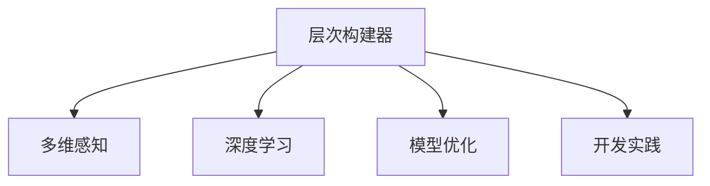

                 

# 体验层次构建器开发者：AI创造的多维感知架构师

> 关键词：层次构建器，多维感知，深度学习，AI架构，开发实践，模型优化，开发工具推荐

## 1. 背景介绍

### 1.1 问题由来

随着人工智能技术的飞速发展，尤其是深度学习和大数据的应用，人们开始探索更高级、更复杂的系统架构。层次构建器（Layer Builder）作为AI创造的多维感知架构师，是这一探索过程中的关键技术之一。它通过将大规模数据转化为高效的结构化模型，助力开发人员构建更精准、更可靠的AI应用。层次构建器不仅在学术界广受关注，也开始被越来越多的企业和开发者应用到实际项目中。

### 1.2 问题核心关键点

层次构建器的主要目标是通过多维感知技术，将原始数据和模型参数转化为高层次的结构化表示。它结合了深度学习和模型优化的方法，致力于提升模型的泛化能力、降低复杂度，并优化模型的推理速度。层次构建器的核心价值在于其能够自动挖掘数据中的关键特征，并通过构建多层次的模型结构，实现更高效的训练和推理。

## 2. 核心概念与联系

### 2.1 核心概念概述

为更好地理解层次构建器的工作原理和应用方法，本节将介绍几个关键概念：

- **层次构建器（Layer Builder）**：一种基于深度学习的架构技术，通过多维感知技术，自动构建出高效的结构化模型。
- **多维感知（Multi-Dimensional Perception）**：一种融合多种数据模态（如文本、图像、音频等）的感知方法，旨在捕捉数据中的高层次语义信息。
- **深度学习（Deep Learning）**：一种通过多层神经网络进行复杂特征提取和模式识别的机器学习方法，是层次构建器实现的基础。
- **模型优化（Model Optimization）**：通过各种技术手段（如剪枝、量化、蒸馏等）提升模型的效率和性能。
- **开发实践（Development Practice）**：涉及模型构建、数据预处理、超参数调优等实际操作环节。

这些核心概念之间的联系可以通过以下Mermaid流程图来展示：



这个流程图展示了几大关键概念之间的联系：

1. 层次构建器通过多维感知技术捕捉数据的高层次语义信息。
2. 层次构建器基于深度学习算法进行模型构建和特征提取。
3. 层次构建器结合模型优化技术提升模型的性能和效率。
4. 层次构建器的开发实践贯穿整个模型构建和优化过程。

## 3. 核心算法原理 & 具体操作步骤
### 3.1 算法原理概述

层次构建器的核心算法原理是通过深度学习网络（如卷积神经网络CNN、递归神经网络RNN等），将原始数据自动转化为多层次的表示形式。其基本步骤如下：

1. **数据预处理**：包括数据清洗、归一化、特征提取等步骤，将原始数据转化为适合深度学习模型处理的形式。
2. **模型训练**：通过深度学习算法（如反向传播）对模型参数进行优化，使得模型能够捕捉数据的高级语义特征。
3. **层次构建**：根据数据的复杂性和任务需求，选择不同的模型层级结构，自动构建出高层次的表示形式。
4. **模型优化**：使用剪枝、量化、蒸馏等技术对构建好的模型进行优化，提升其推理速度和泛化能力。

### 3.2 算法步骤详解

层次构建器的具体步骤可以分为以下几个环节：

**Step 1: 数据预处理**

- **数据清洗**：去除数据中的噪声和异常值，确保数据质量。
- **特征提取**：通过PCA、LDA等技术提取数据的关键特征，减少冗余信息。
- **归一化**：将数据转化为标准范围，确保模型训练的稳定性。

**Step 2: 模型训练**

- **选择合适的深度学习模型**：如CNN、RNN、Transformer等，根据数据类型和任务需求进行选择。
- **设置训练参数**：包括学习率、批量大小、迭代次数等，确保训练过程的效率和效果。
- **反向传播训练**：通过反向传播算法更新模型参数，最小化损失函数。

**Step 3: 层次构建**

- **选择构建策略**：根据任务需求选择不同的构建策略，如自顶向下、自底向上、混合策略等。
- **构建模型层次**：将多维感知技术和深度学习算法相结合，构建出高层次的模型表示。
- **层次间关联**：通过交叉验证等技术确保层次之间的逻辑连贯性。

**Step 4: 模型优化**

- **剪枝**：去除冗余连接和参数，减少计算复杂度。
- **量化**：将浮点数模型转换为定点数模型，提升计算效率。
- **蒸馏**：通过知识蒸馏技术将复杂模型转化为更轻量级的模型，提升推理速度。

**Step 5: 部署与评估**

- **模型部署**：将优化后的模型部署到实际应用环境中。
- **性能评估**：使用测试集对模型进行评估，确保其性能满足实际需求。

以上是层次构建器的基本操作步骤，实际应用中还需要根据具体任务需求进行调整和优化。

### 3.3 算法优缺点

层次构建器具有以下优点：

- **自动构建模型**：通过自动化的层次构建过程，显著降低开发难度和成本。
- **多维感知能力**：融合多种数据模态，捕捉更高级的语义信息。
- **高效优化**：通过剪枝、量化、蒸馏等技术，提升模型的性能和推理速度。

同时，层次构建器也存在以下局限：

- **数据依赖性强**：层次构建的准确性高度依赖于数据质量和特征提取效果。
- **模型复杂度高**：高层次的模型构建过程可能导致模型复杂度增加，影响推理速度。
- **可解释性不足**：复杂的层次构建过程可能导致模型难以解释，增加调试难度。

尽管有这些局限，但层次构建器在数据驱动的AI模型构建中发挥着重要作用，为开发人员提供了一种高效、灵活的模型构建方法。

### 3.4 算法应用领域

层次构建器在多个领域得到了广泛应用，主要包括：

- **自然语言处理（NLP）**：用于构建语言模型、情感分析、文本分类等任务。
- **计算机视觉（CV）**：用于构建图像分类、物体检测、图像分割等任务。
- **语音识别**：用于构建声纹识别、语音情感分析、语音识别等任务。
- **推荐系统**：用于构建用户画像、物品推荐等任务。
- **医疗诊断**：用于构建医疗影像分析、疾病诊断等任务。

除了以上领域，层次构建器还被应用到更多场景中，如金融风险评估、智能客服、智能家居等，助力这些领域的智能化转型。

## 4. 数学模型和公式 & 详细讲解  
### 4.1 数学模型构建

层次构建器的数学模型构建过程，通常包括以下几个关键步骤：

1. **输入数据表示**：将原始数据转化为矩阵形式，便于深度学习模型处理。
2. **神经网络结构**：定义神经网络的层级结构和激活函数，如卷积层、池化层、全连接层等。
3. **损失函数**：定义模型输出的损失函数，如交叉熵损失、均方误差损失等。
4. **优化算法**：选择适合的优化算法，如随机梯度下降（SGD）、Adam等，对模型参数进行优化。

### 4.2 公式推导过程

以图像分类任务为例，层次构建器的公式推导过程如下：

**输入数据表示**：
$$ x = [x_1, x_2, ..., x_n] \in \mathbb{R}^n $$
$$ y = [y_1, y_2, ..., y_n] \in \{0,1\}^n $$

**神经网络结构**：
$$ h_1 = \sigma(W_1 x + b_1) $$
$$ h_2 = \sigma(W_2 h_1 + b_2) $$
$$ \hat{y} = softmax(W_3 h_2 + b_3) $$

其中，$\sigma$为激活函数，$W$为权重矩阵，$b$为偏置向量，$softmax$为归一化函数。

**损失函数**：
$$ L = -\frac{1}{N} \sum_{i=1}^N \sum_{j=1}^N y_j \log \hat{y}_j $$

**优化算法**：
$$ \theta \leftarrow \theta - \eta \nabla_{\theta} L $$
其中 $\eta$ 为学习率，$\nabla_{\theta} L$ 为损失函数对模型参数 $\theta$ 的梯度。

通过上述推导，我们可以看到层次构建器的基本数学模型框架。这一过程通过多层神经网络的学习，将输入数据转化为高层次的表示形式，并最终输出预测结果。

### 4.3 案例分析与讲解

以手写数字识别为例，层次构建器的工作流程如下：

**Step 1: 数据预处理**

- **数据清洗**：去除图像中的噪声，确保数据质量。
- **特征提取**：通过PCA技术提取关键特征，减少冗余信息。
- **归一化**：将数据转化为标准范围，确保模型训练的稳定性。

**Step 2: 模型训练**

- **选择合适的深度学习模型**：选择卷积神经网络（CNN）作为基本模型结构。
- **设置训练参数**：设置学习率为0.01，批量大小为32，迭代次数为1000。
- **反向传播训练**：通过反向传播算法更新模型参数，最小化交叉熵损失函数。

**Step 3: 层次构建**

- **选择构建策略**：采用自顶向下的构建策略，先构建卷积层，再构建全连接层。
- **构建模型层次**：通过卷积层和池化层提取特征，通过全连接层进行分类。
- **层次间关联**：通过交叉验证技术确保卷积层和全连接层之间的逻辑连贯性。

**Step 4: 模型优化**

- **剪枝**：去除卷积层中冗余的连接和参数，减少计算复杂度。
- **量化**：将浮点数模型转换为定点数模型，提升计算效率。
- **蒸馏**：通过知识蒸馏技术将复杂模型转化为更轻量级的模型，提升推理速度。

**Step 5: 部署与评估**

- **模型部署**：将优化后的模型部署到实际应用环境中，用于手写数字识别任务。
- **性能评估**：使用测试集对模型进行评估，确保其性能满足实际需求。

通过上述过程，层次构建器自动完成了手写数字识别任务，展现了其在多维感知和模型优化方面的优势。

## 5. 项目实践：代码实例和详细解释说明
### 5.1 开发环境搭建

在进行层次构建器的实践前，我们需要准备好开发环境。以下是使用Python进行TensorFlow和Keras开发的开发环境配置流程：

1. 安装Anaconda：从官网下载并安装Anaconda，用于创建独立的Python环境。

2. 创建并激活虚拟环境：
```bash
conda create -n tf-env python=3.8 
conda activate tf-env
```

3. 安装TensorFlow和Keras：
```bash
conda install tensorflow
pip install keras
```

4. 安装各类工具包：
```bash
pip install numpy pandas scikit-learn matplotlib tqdm jupyter notebook ipython
```

完成上述步骤后，即可在`tf-env`环境中开始层次构建器的实践。

### 5.2 源代码详细实现

这里我们以图像分类任务为例，给出使用TensorFlow和Keras进行层次构建器的PyTorch代码实现。

```python
from tensorflow.keras import layers, models
from tensorflow.keras.datasets import mnist
from tensorflow.keras.utils import to_categorical

# 加载MNIST数据集
(x_train, y_train), (x_test, y_test) = mnist.load_data()

# 数据预处理
x_train = x_train.reshape(-1, 28*28) / 255.0
x_test = x_test.reshape(-1, 28*28) / 255.0
y_train = to_categorical(y_train, num_classes=10)
y_test = to_categorical(y_test, num_classes=10)

# 构建卷积神经网络
model = models.Sequential()
model.add(layers.Dense(512, activation='relu', input_shape=(28*28,)))
model.add(layers.Dense(10, activation='softmax'))

# 编译模型
model.compile(optimizer='adam', loss='categorical_crossentropy', metrics=['accuracy'])

# 训练模型
model.fit(x_train, y_train, epochs=10, batch_size=32, validation_data=(x_test, y_test))

# 评估模型
model.evaluate(x_test, y_test)
```

### 5.3 代码解读与分析

让我们再详细解读一下关键代码的实现细节：

**数据预处理**：
- 使用`reshape`方法将图像数据展平为一维数组，并进行归一化处理。
- 使用`to_categorical`方法将标签转化为独热编码格式，便于模型训练。

**模型构建**：
- 使用`Sequential`模型构建卷积神经网络。
- 添加全连接层和softmax激活函数，用于分类任务。
- 使用`compile`方法编译模型，定义优化器、损失函数和评估指标。

**模型训练**：
- 使用`fit`方法进行模型训练，指定训练数据、学习率、迭代次数等参数。
- 使用`validation_data`参数指定验证数据，实时评估模型性能。

**模型评估**：
- 使用`evaluate`方法评估模型在测试集上的性能。

通过上述代码，我们可以看到层次构建器的核心实践过程，即数据预处理、模型构建、训练和评估。使用TensorFlow和Keras，开发层次构建器的代码实现变得简单高效。

## 6. 实际应用场景
### 6.1 智能推荐系统

层次构建器在智能推荐系统中的应用主要体现在以下几个方面：

**用户画像构建**：通过多维感知技术，结合用户的历史行为数据、兴趣爱好等，构建出高层次的用户画像。利用层次构建器可以自动捕捉用户的复杂偏好，提高推荐的精准度。

**物品推荐优化**：将用户画像与物品特征进行匹配，构建出多层次的推荐模型。通过层次构建器，可以实现更高效、更灵活的推荐系统构建。

**实时推荐更新**：随着用户行为数据的实时更新，层次构建器可以自动调整模型参数，实现持续推荐。

### 6.2 医疗影像诊断

层次构建器在医疗影像诊断中的应用主要体现在以下几个方面：

**图像特征提取**：通过多维感知技术，将医疗影像数据转化为高层次的特征表示。利用层次构建器可以自动提取影像中的关键信息，提高诊断的准确度。

**疾病诊断分类**：结合医学知识库，构建出多层次的诊断模型。通过层次构建器，可以实现更高效的诊断分类。

**知识图谱构建**：利用层次构建器自动构建医疗知识图谱，帮助医生快速查找相关病例和药物信息。

### 6.3 金融风险评估

层次构建器在金融风险评估中的应用主要体现在以下几个方面：

**市场数据处理**：通过多维感知技术，将多种市场数据（如股票价格、交易量等）转化为高层次的表示形式。利用层次构建器可以自动捕捉市场变化规律，提高风险评估的准确度。

**信用评分模型**：结合信用评分数据，构建出多层次的评分模型。通过层次构建器，可以实现更高效的信用评分。

**实时风险监控**：随着市场数据的实时更新，层次构建器可以自动调整模型参数，实现实时风险监控。

### 6.4 未来应用展望

随着层次构建器技术的发展，其在更多领域的应用前景将被进一步拓展：

- **智能家居**：通过层次构建器自动构建多层次的家庭数据模型，提高智能家居的智能化水平。
- **智能交通**：结合多维感知技术，构建出多层次的交通数据模型，提高交通管理的效率和安全性。
- **智能安防**：通过层次构建器自动构建多层次的安全数据模型，提高安防系统的智能化水平。

未来，层次构建器将与其他AI技术（如自然语言处理、计算机视觉等）进行更深入的融合，共同构建更加智能、高效、可靠的系统。

## 7. 工具和资源推荐
### 7.1 学习资源推荐

为帮助开发者系统掌握层次构建器理论基础和实践技巧，这里推荐一些优质的学习资源：

1. **TensorFlow官方文档**：详细介绍了TensorFlow的使用方法和模型构建技巧。
2. **Keras官方文档**：提供了Keras的完整API文档和示例代码，是层次构建器开发的必备资料。
3. **《深度学习》书籍**：Ian Goodfellow等所著的经典深度学习教材，系统介绍了深度学习的基本原理和应用。
4. **《动手学深度学习》书籍**：李沐等所著的动手实践深度学习的教材，包含大量的实践案例和代码示例。
5. **Coursera课程**：包含斯坦福大学的《深度学习专项课程》、《深度学习基础》等，提供系统性的深度学习学习路径。

通过对这些资源的学习实践，相信你一定能够快速掌握层次构建器的精髓，并用于解决实际的AI问题。

### 7.2 开发工具推荐

高效的开发离不开优秀的工具支持。以下是几款用于层次构建器开发的常用工具：

1. **TensorFlow**：由Google主导开发的深度学习框架，生产部署方便，适合大规模工程应用。
2. **Keras**：基于TensorFlow的高级API，提供了简单易用的接口，适合快速原型开发和模型构建。
3. **Weights & Biases**：模型训练的实验跟踪工具，可以记录和可视化模型训练过程中的各项指标，方便对比和调优。
4. **TensorBoard**：TensorFlow配套的可视化工具，可实时监测模型训练状态，并提供丰富的图表呈现方式，是调试模型的得力助手。
5. **Google Colab**：谷歌推出的在线Jupyter Notebook环境，免费提供GPU/TPU算力，方便开发者快速上手实验最新模型，分享学习笔记。

合理利用这些工具，可以显著提升层次构建器的开发效率，加快创新迭代的步伐。

### 7.3 相关论文推荐

层次构建器技术的发展源于学界的持续研究。以下是几篇奠基性的相关论文，推荐阅读：

1. **《Deep Residual Learning for Image Recognition》**：He等提出的残差网络，通过跨层残差连接解决深度网络训练中的梯度消失问题，是层次构建器的基础。
2. **《Inception-v3, Inception-resnet and the Impact of Resnet Blocks on Inception-v3》**：Szegedy等提出的Inception网络，通过多分支并行结构提取多层次特征，是层次构建器的重要参考。
3. **《TensorFlow: A System for Large-Scale Machine Learning》**：Google提出的TensorFlow框架，提供了灵活的模型构建和优化工具，是层次构建器开发的底层基础。

这些论文代表了大规模层次构建器技术的发展脉络。通过学习这些前沿成果，可以帮助研究者把握学科前进方向，激发更多的创新灵感。

## 8. 总结：未来发展趋势与挑战

### 8.1 总结

本文对层次构建器的工作原理和应用方法进行了全面系统的介绍。首先阐述了层次构建器的研究背景和重要性，明确了其在高层次模型构建中的关键作用。其次，从原理到实践，详细讲解了层次构建器的数学模型和操作步骤，给出了层次构建器任务开发的完整代码实例。同时，本文还广泛探讨了层次构建器在多个领域的应用前景，展示了其在数据驱动的AI模型构建中的巨大潜力。最后，本文精选了层次构建器的学习资源、开发工具和相关论文，力求为读者提供全方位的技术指引。

通过本文的系统梳理，可以看到，层次构建器作为AI创造的多维感知架构师，在数据驱动的AI模型构建中发挥着重要作用。其自动化的层次构建过程，显著降低了模型开发难度和成本，提高了模型的泛化能力和推理速度。未来，层次构建器必将在更广阔的领域得到应用，为人工智能技术的落地实践提供重要支持。

### 8.2 未来发展趋势

展望未来，层次构建器技术将呈现以下几个发展趋势：

1. **模型复杂度降低**：随着计算能力的提升和算法优化，未来层次构建器将能构建出更复杂、更高效的结构化模型。
2. **多模态数据融合**：结合多模态数据（如文本、图像、音频等）进行感知，捕捉更高级的语义信息。
3. **实时处理能力提升**：随着硬件和算法优化，未来层次构建器将能够实现更高效的实时处理。
4. **可解释性和可控性增强**：通过引入因果分析和可解释性技术，提高层次构建器的可解释性和可控性。
5. **跨领域应用拓展**：层次构建器将在更多领域得到应用，如智能医疗、智能交通、智能家居等。

这些趋势凸显了层次构建器技术的广阔前景，为未来AI技术的发展提供了新的方向。

### 8.3 面临的挑战

尽管层次构建器技术已经取得了瞩目成就，但在迈向更加智能化、普适化应用的过程中，它仍面临着诸多挑战：

1. **数据质量问题**：层次构建的准确性高度依赖于数据质量和特征提取效果。如何有效处理数据噪声和异常值，将是一个重要挑战。
2. **模型复杂性**：高层次的模型构建过程可能导致模型复杂度增加，影响推理速度。如何在复杂性和效率之间找到平衡，将是一大难题。
3. **可解释性不足**：复杂的层次构建过程可能导致模型难以解释，增加调试难度。如何提高层次构建器的可解释性，将是亟待攻克的难题。
4. **计算资源需求**：高层次模型的训练和推理需要大量的计算资源，如何优化模型结构和参数，降低资源消耗，将是一个重要研究方向。

尽管有这些挑战，但层次构建器在数据驱动的AI模型构建中发挥着重要作用，为开发人员提供了一种高效、灵活的模型构建方法。

### 8.4 研究展望

面对层次构建器面临的挑战，未来的研究需要在以下几个方面寻求新的突破：

1. **数据增强技术**：引入数据增强技术，提高层次构建的准确性和鲁棒性。
2. **剪枝和量化技术**：通过剪枝和量化技术，优化层次构建器模型的结构复杂度，提升推理速度。
3. **可解释性技术**：引入可解释性技术，提高层次构建器的可解释性和可控性。
4. **多模态数据融合**：结合多模态数据进行感知，捕捉更高级的语义信息，提高模型的泛化能力。
5. **跨领域应用拓展**：将层次构建器应用到更多领域，如智能医疗、智能交通、智能家居等。

这些研究方向将引领层次构建器技术迈向更高的台阶，为构建智能、高效、可解释的AI系统提供重要支持。相信随着学界和产业界的共同努力，层次构建器必将在未来AI技术的发展中发挥重要作用，为构建更加智能、高效的AI应用提供新的可能性。

## 9. 附录：常见问题与解答

**Q1：层次构建器是否适用于所有数据类型？**

A: 层次构建器适用于多种数据类型，包括图像、文本、音频等。但不同类型的输入数据，需要采用不同的特征提取方法和模型结构。例如，图像数据通常使用卷积神经网络进行特征提取，文本数据则使用循环神经网络或Transformer。

**Q2：层次构建器在模型优化过程中需要注意哪些问题？**

A: 层次构建器在模型优化过程中，需要注意以下问题：

1. **剪枝技术**：通过剪枝技术去除冗余连接和参数，减少计算复杂度。
2. **量化技术**：将浮点数模型转换为定点数模型，提升计算效率。
3. **蒸馏技术**：通过知识蒸馏技术将复杂模型转化为更轻量级的模型，提升推理速度。

**Q3：层次构建器在实际部署时需要注意哪些问题？**

A: 层次构建器在实际部署时，需要注意以下问题：

1. **模型裁剪**：去除不必要的层和参数，减小模型尺寸，加快推理速度。
2. **量化加速**：将浮点数模型转为定点模型，压缩存储空间，提高计算效率。
3. **服务化封装**：将模型封装为标准化服务接口，便于集成调用。
4. **弹性伸缩**：根据请求流量动态调整资源配置，平衡服务质量和成本。
5. **监控告警**：实时采集系统指标，设置异常告警阈值，确保服务稳定性。

**Q4：层次构建器在实际应用中如何处理数据噪声和异常值？**

A: 层次构建器在实际应用中，可以通过以下方法处理数据噪声和异常值：

1. **数据清洗**：去除数据中的噪声和异常值，确保数据质量。
2. **特征过滤**：通过PCA、LDA等技术提取关键特征，减少冗余信息。
3. **归一化**：将数据转化为标准范围，确保模型训练的稳定性。
4. **异常检测**：使用异常检测算法（如基于统计的方法、基于聚类的方法等）识别和过滤异常值。

通过这些方法，层次构建器可以有效地处理数据噪声和异常值，提高层次构建的准确性和鲁棒性。

**Q5：层次构建器在多模态数据融合中需要注意哪些问题？**

A: 层次构建器在多模态数据融合中，需要注意以下问题：

1. **数据对齐**：确保不同模态的数据在特征空间中的对齐，避免特征冲突。
2. **特征融合**：通过融合技术（如注意力机制、特征聚合等），将不同模态的特征进行有效融合，提高感知能力。
3. **权重分配**：根据不同模态数据的重要性，合理分配特征权重，避免信息丢失。

通过这些方法，层次构建器可以有效地进行多模态数据融合，捕捉更高级的语义信息，提高模型的泛化能力。

---

作者：禅与计算机程序设计艺术 / Zen and the Art of Computer Programming

