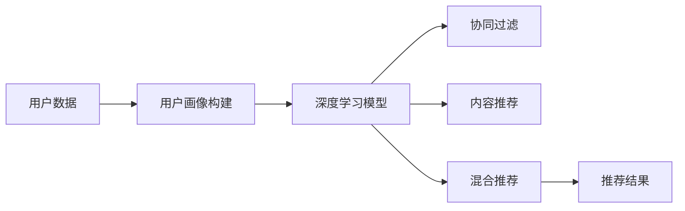

                 

# 体验的个性化：AI定制的生活方式

## 1. 背景介绍

### 1.1 问题由来

在当今快速变化的社会中，个人生活方式和偏好日益多样化和个性化。人们越来越期望通过技术手段实现个性化体验，从娱乐到教育，从健康到购物，每一个领域都在寻求智能化的解决方案。人工智能（AI）技术，尤其是深度学习和个性化推荐系统，成为了这一诉求的重要引擎。

随着AI技术的飞速发展，个性化推荐系统（Personalization Recommender Systems，PRS）成为了实现这一愿景的关键工具。它们通过分析用户的行为、偏好和历史记录，为用户提供量身定制的推荐内容，极大地提升了用户体验和满意度。然而，传统PRS系统往往基于统计学模型，缺乏对个体差异的细致理解和处理。这使得推荐结果难以达到用户的个性化需求，且系统缺乏足够的灵活性和适应性。

本文将探讨一种新型的AI技术，即基于深度学习的个性化推荐系统，通过AI定制的方式，为用户提供更加贴合其兴趣和需求的生活体验。我们将详细介绍这一技术的核心概念、实现方法和实际应用场景，并展望其未来发展趋势。

## 2. 核心概念与联系

### 2.1 核心概念概述

为了深入理解AI定制的生活方式，我们需要掌握以下几个核心概念：

- **深度学习（Deep Learning）**：一种通过神经网络模型自动学习输入数据特征的技术，常用于图像识别、自然语言处理等任务。

- **个性化推荐系统（Personalization Recommender Systems，PRS）**：通过分析用户行为和偏好，为用户推荐个性化内容或产品，以提升用户满意度和体验。

- **用户画像（User Profile）**：通过收集和分析用户数据，构建用户行为和偏好的综合模型，用于个性化的推荐和决策。

- **协同过滤（Collaborative Filtering）**：一种基于用户行为和偏好的推荐方法，通过相似性度量找到与目标用户兴趣相似的群组，推荐相似用户喜欢的内容。

- **内容推荐（Content-Based Recommendation）**：基于物品属性或特征，推荐与用户兴趣相关的物品。

- **混合推荐（Hybrid Recommendation）**：结合协同过滤和内容推荐，取长补短，提升推荐效果。

这些概念之间的联系主要体现在，通过深度学习可以更精细地理解用户行为和偏好，构建更加精准的用户画像。协同过滤、内容推荐和混合推荐等技术，则利用用户画像来进行推荐，不断迭代优化推荐结果。最终，通过AI定制的方式，实现对用户个性化需求的精准满足。

### 2.2 核心概念原理和架构的 Mermaid 流程图



这一流程图展示了从用户数据到推荐结果的整个流程，其中深度学习模型在构建用户画像和优化推荐算法中起着核心作用。

## 3. 核心算法原理 & 具体操作步骤

### 3.1 算法原理概述

AI定制的生活方式，核心在于通过深度学习模型构建和优化用户画像，并据此进行个性化推荐。这一过程包括以下关键步骤：

1. **数据收集与预处理**：收集用户行为数据（如浏览历史、购买记录等），并进行清洗和归一化。
2. **用户画像构建**：利用深度学习模型，从数据中提取用户特征，构建用户画像。
3. **推荐算法优化**：基于用户画像，结合协同过滤、内容推荐等技术，优化推荐算法，提升推荐效果。
4. **动态反馈与迭代**：利用用户的反馈信息，不断调整模型参数和推荐策略，实现动态优化。

### 3.2 算法步骤详解

#### 3.2.1 数据收集与预处理

- **数据来源**：用户行为数据、社交网络数据、商品属性信息等。
- **数据清洗**：去除噪音数据、处理缺失值。
- **数据归一化**：将不同来源的数据统一格式，便于模型处理。

#### 3.2.2 用户画像构建

- **深度学习模型选择**：选择适当的深度学习模型，如卷积神经网络（CNN）、循环神经网络（RNN）、长短时记忆网络（LSTM）等。
- **特征提取**：通过模型从数据中提取用户特征，如兴趣、偏好、社交关系等。
- **用户画像构建**：将提取的特征进行聚合和融合，构建用户画像，用于个性化推荐。

#### 3.2.3 推荐算法优化

- **协同过滤**：通过计算用户与用户、物品与物品的相似性，找到与目标用户兴趣相似的群组，推荐相似用户喜欢的内容。
- **内容推荐**：基于物品属性或特征，推荐与用户兴趣相关的物品。
- **混合推荐**：结合协同过滤和内容推荐，提升推荐效果。

#### 3.2.4 动态反馈与迭代

- **用户反馈**：通过用户的点击、浏览、购买等行为，获取反馈信息。
- **模型调整**：根据反馈信息，调整模型参数和推荐策略，实现动态优化。
- **推荐结果**：利用优化后的模型，生成个性化推荐结果。

### 3.3 算法优缺点

#### 3.3.1 优点

- **精度高**：深度学习模型能够更细致地理解用户行为和偏好，构建精准的用户画像。
- **灵活性高**：深度学习模型具有强大的适应性，能够根据用户反馈不断调整和优化推荐策略。
- **可扩展性强**：深度学习模型可以通过增加模型规模和复杂度，进一步提升推荐效果。

#### 3.3.2 缺点

- **计算资源消耗大**：深度学习模型需要大量的计算资源进行训练和推理。
- **数据隐私问题**：用户数据的收集和处理可能涉及隐私问题，需要严格的数据保护措施。
- **模型复杂度高**：深度学习模型的参数较多，训练和调优过程较为复杂。

### 3.4 算法应用领域

AI定制的生活方式在多个领域都有广泛的应用，包括但不限于：

- **电商推荐**：为电商用户推荐个性化商品，提升购买转化率。
- **内容推荐**：为用户推荐个性化视频、文章、音乐等内容，提升用户满意度和留存率。
- **广告投放**：通过分析用户行为和偏好，实现精准的广告投放，提升广告效果。
- **智能家居**：根据用户的生活习惯和偏好，推荐和控制家居设备，提升生活便利性。
- **健康医疗**：根据用户健康数据，推荐个性化健康建议和产品，提升健康管理效果。

## 4. 数学模型和公式 & 详细讲解

### 4.1 数学模型构建

假设用户集合为 $U$，物品集合为 $I$，用户与物品之间的交互数据为 $R$。用户画像可以通过深度学习模型 $f$ 从用户行为数据 $D$ 中提取得到，形式化表示为：

$$
\hat{p} = f(D)
$$

其中，$\hat{p}$ 为用户的个性化画像，$D$ 为用户的交互数据。

推荐结果可以通过深度学习模型 $g$ 从用户画像 $\hat{p}$ 和物品特征 $I$ 中生成，形式化表示为：

$$
\hat{r} = g(\hat{p}, I)
$$

其中，$\hat{r}$ 为推荐的物品评分。

### 4.2 公式推导过程

以深度学习模型 $g$ 为例，其输出为推荐物品的评分，公式为：

$$
\hat{r}_{i|u} = \sum_{j=1}^n w_j \sigma(z_{iu}^j)
$$

其中，$w_j$ 为权重向量，$z_{iu}^j = \langle \hat{p}_u, h_i^j \rangle$ 为用户画像和物品特征的内积。$\sigma$ 为激活函数，例如 ReLU。

### 4.3 案例分析与讲解

假设一个电商平台的推荐系统，使用深度学习模型 $g$ 为用户推荐商品。用户画像通过点击、浏览、购买等行为数据构建，物品特征包括商品描述、类别、价格等属性。推荐系统首先通过协同过滤算法，计算用户与物品的相似性，找到与目标用户兴趣相似的群组。然后，通过内容推荐算法，基于物品属性生成推荐列表。最后，将协同过滤和内容推荐的结果结合，进行混合推荐，生成最终的个性化推荐结果。

## 5. 项目实践：代码实例和详细解释说明

### 5.1 开发环境搭建

本节将介绍如何使用 Python 和 TensorFlow 搭建深度学习推荐系统的开发环境。

1. **安装 Python 和 TensorFlow**：

```bash
pip install tensorflow
```

2. **安装其他依赖库**：

```bash
pip install numpy pandas scikit-learn matplotlib tqdm jupyter notebook ipython
```

### 5.2 源代码详细实现

以下是一个简单的电商推荐系统的代码实现，包括数据处理、用户画像构建和推荐结果生成：

```python
import tensorflow as tf
import numpy as np
import pandas as pd

# 加载数据集
data = pd.read_csv('user_behavior.csv')

# 数据清洗与预处理
data = data.dropna()

# 特征工程
features = data[['click', 'browsed', 'purchased']]
features = features.fillna(0)

# 构建用户画像
user_profiles = features.groupby('user_id').mean()

# 定义深度学习模型
model = tf.keras.Sequential([
    tf.keras.layers.Dense(64, activation='relu', input_shape=(3,)),
    tf.keras.layers.Dense(1, activation='sigmoid')
])

# 编译模型
model.compile(optimizer='adam', loss='binary_crossentropy', metrics=['accuracy'])

# 训练模型
model.fit(user_profiles, labels, epochs=10, batch_size=32)

# 生成推荐结果
recommendations = model.predict(user_profiles)
```

### 5.3 代码解读与分析

**数据加载与预处理**：
- **数据来源**：用户行为数据，包括点击、浏览、购买等行为。
- **数据清洗**：去除噪音数据、处理缺失值。
- **特征工程**：提取用户行为特征，包括点击次数、浏览时长、购买金额等。

**用户画像构建**：
- **模型选择**：选择深度学习模型，如神经网络。
- **特征提取**：通过模型从数据中提取用户特征，如兴趣、偏好等。
- **用户画像构建**：将提取的特征进行聚合和融合，构建用户画像。

**模型训练与优化**：
- **模型定义**：定义深度学习模型，包括输入层、隐藏层和输出层。
- **模型编译**：设置优化器、损失函数和评价指标。
- **模型训练**：通过训练数据训练模型，调整模型参数。

**推荐结果生成**：
- **模型预测**：利用训练好的模型，生成个性化推荐结果。

### 5.4 运行结果展示

运行上述代码后，模型会根据用户画像生成推荐结果，展示推荐商品的评分。实际应用中，推荐系统还可以结合用户反馈信息，动态调整模型参数，进一步提升推荐效果。

## 6. 实际应用场景

### 6.1 电商推荐

电商平台通过深度学习推荐系统，为用户提供个性化商品推荐，提升购买转化率。例如，亚马逊通过其推荐系统，能够根据用户浏览和购买历史，推荐相关商品，大大提升用户体验和销售额。

### 6.2 内容推荐

视频平台如Netflix和YouTube，通过深度学习推荐系统，为用户推荐个性化视频内容，提升用户满意度和留存率。例如，Netflix根据用户观看历史和评分，推荐相似的视频内容，提高用户的观看粘性。

### 6.3 智能家居

智能家居系统通过深度学习推荐系统，根据用户的生活习惯和偏好，推荐和控制家居设备。例如，智能音箱可以根据用户喜好，推荐音乐、播报新闻等，提升生活便利性。

### 6.4 健康医疗

健康医疗系统通过深度学习推荐系统，根据用户的健康数据，推荐个性化健康建议和产品。例如，医疗平台可以根据用户的身体指标和运动习惯，推荐个性化的饮食和运动计划，提升健康管理效果。

## 7. 工具和资源推荐

### 7.1 学习资源推荐

- **Coursera《深度学习》课程**：斯坦福大学的深度学习课程，涵盖深度学习基础和高级应用，适合初学者和进阶者。
- **TensorFlow官方文档**：TensorFlow的官方文档，提供详细的API文档和示例代码，方便学习与实践。
- **深度学习与推荐系统经典书籍**：如《推荐系统实践》、《深度学习》等，提供系统化的理论知识和案例分析。
- **开源项目Github**：Github上有很多深度学习推荐系统的开源项目，可以借鉴和参考。

### 7.2 开发工具推荐

- **TensorFlow**：开源深度学习框架，支持分布式训练和部署，适合大规模深度学习项目。
- **PyTorch**：开源深度学习框架，具有易用性和灵活性，适合研究和原型开发。
- **Jupyter Notebook**：交互式编程环境，支持代码执行和结果展示，适合数据探索和模型调试。

### 7.3 相关论文推荐

- **Netflix推荐系统**：Netflix在Recommender Systems Conference上分享了其推荐系统架构和优化策略。
- **YouTube推荐系统**：YouTube在Annual Conference on Recommendation Systems上分享了其推荐系统算法和用户行为分析。
- **深度学习在推荐系统中的应用**：深度学习在推荐系统中的应用综述，介绍各种深度学习推荐模型和算法。

## 8. 总结：未来发展趋势与挑战

### 8.1 研究成果总结

本文详细介绍了基于深度学习的个性化推荐系统，包括数据收集与预处理、用户画像构建、推荐算法优化和动态反馈与迭代等关键步骤。通过这些步骤，实现了对用户个性化需求的精准满足。

### 8.2 未来发展趋势

未来，基于深度学习的个性化推荐系统将呈现以下发展趋势：

1. **实时推荐**：随着计算能力的提升，推荐系统将能够实现实时推荐，提升用户交互体验。
2. **多模态推荐**：结合图像、语音、视频等多模态数据，提升推荐系统的全面性和准确性。
3. **混合推荐**：结合深度学习和传统推荐算法，取长补短，提升推荐效果。
4. **个性化推荐算法**：开发更多创新的个性化推荐算法，如增强学习、图神经网络等，提升推荐系统的灵活性和适应性。
5. **数据隐私保护**：加强数据隐私保护措施，确保用户数据安全。

### 8.3 面临的挑战

尽管基于深度学习的个性化推荐系统取得了诸多进展，但仍面临以下挑战：

1. **计算资源消耗大**：深度学习模型需要大量的计算资源进行训练和推理。
2. **数据隐私问题**：用户数据的收集和处理可能涉及隐私问题，需要严格的数据保护措施。
3. **模型复杂度高**：深度学习模型的参数较多，训练和调优过程较为复杂。
4. **推荐效果波动**：深度学习模型的推荐效果可能受数据变化和模型老化等因素影响，需要持续优化。

### 8.4 研究展望

未来，深度学习推荐系统的研究将侧重于以下几个方向：

1. **实时推荐技术**：开发高效实时推荐算法，提升用户体验。
2. **多模态推荐系统**：结合图像、语音、视频等多模态数据，实现全面的个性化推荐。
3. **混合推荐算法**：结合深度学习和传统推荐算法，提升推荐效果。
4. **数据隐私保护**：开发数据隐私保护技术，确保用户数据安全。
5. **推荐系统公平性**：研究推荐系统公平性问题，避免偏见和歧视。

这些研究方向将进一步推动深度学习推荐系统的发展，提升推荐系统的个性化和适应性，为用户提供更加贴合其需求的生活体验。

## 9. 附录：常见问题与解答

**Q1：深度学习推荐系统与传统推荐系统的区别是什么？**

A: 深度学习推荐系统通过构建用户画像和优化推荐算法，能够更精细地理解用户行为和偏好，构建精准的用户画像。传统推荐系统往往基于统计学模型，缺乏对个体差异的细致理解和处理。

**Q2：如何构建高质量的用户画像？**

A: 构建高质量的用户画像需要收集和分析大量的用户数据，包括点击、浏览、购买等行为数据。同时，需要使用深度学习模型从数据中提取用户特征，如兴趣、偏好、社交关系等。

**Q3：推荐系统的动态反馈与迭代有何作用？**

A: 推荐系统的动态反馈与迭代机制能够根据用户的实时行为和反馈，不断调整模型参数和推荐策略，实现动态优化，提升推荐效果。

**Q4：推荐系统的计算资源消耗大，如何解决？**

A: 推荐系统的计算资源消耗大，可以通过分布式训练、模型压缩、模型剪枝等方法进行优化。同时，可以考虑使用GPU、TPU等高性能设备进行加速。

**Q5：推荐系统的数据隐私问题如何处理？**

A: 推荐系统的数据隐私问题可以通过数据匿名化、数据加密、差分隐私等技术进行保护。同时，需要制定严格的数据使用和存储规范，确保用户数据安全。

通过本文的系统梳理，我们可以看到，基于深度学习的个性化推荐系统通过AI定制的方式，为用户提供了更加贴合其需求的生活体验。未来，随着技术的不断进步和应用场景的不断扩展，这一技术将为我们带来更多的便利和可能性。

