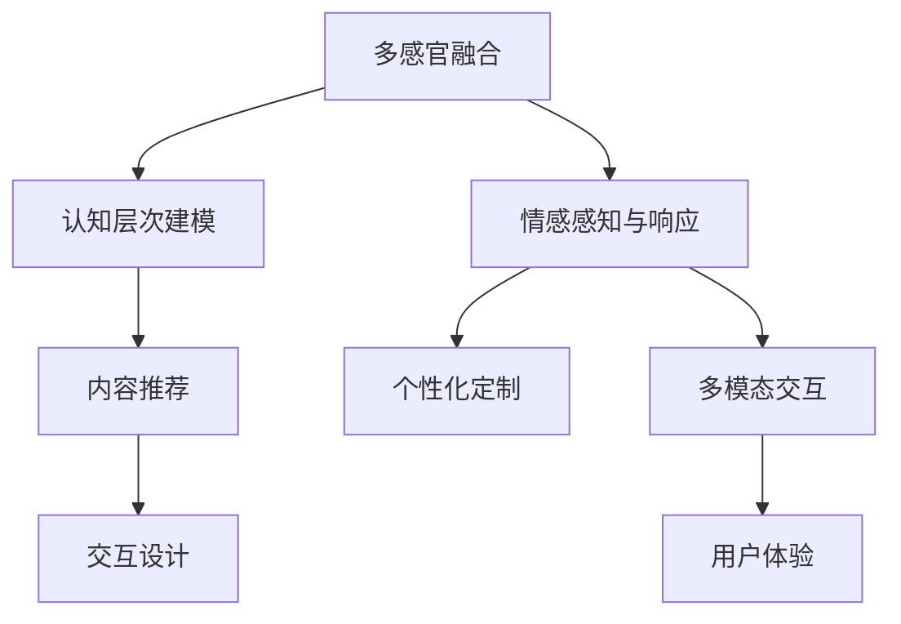

                 

# 体验的层次性：AI创造的多维感知

> 关键词：多维感知, 人工智能, 创造, 体验, 感知层次

## 1. 背景介绍

### 1.1 问题由来
人工智能（AI）正以前所未有的速度渗透到我们的生活中，从语音识别到图像处理，从自动驾驶到智能推荐，AI技术已经展现出强大的能力。然而，除了这些硬性的技术指标外，AI的另一个重要维度是“体验”。体验是由用户与系统交互过程中感受到的情感和心理状态，是多维度感知、认知和情感的综合体现。如何让AI系统更好地理解用户的多维感知，从而提供更加自然、高效、个性化的体验，是当前AI领域的重要课题。

### 1.2 问题核心关键点
AI创造的多维感知体验，涉及多个方面的关键点：

1. **多感官融合**：将视觉、听觉、触觉等多感官信息进行融合，构建更加完整的用户感知。
2. **认知层次建模**：理解用户的感知层次，从直觉感知到概念理解，逐步深入。
3. **情感感知与响应**：识别用户的情感状态，并作出适当的情感响应。
4. **个性化定制**：根据用户的历史行为和偏好，进行个性化的内容推荐和交互设计。
5. **多模态交互**：支持自然语言、图像、视频等多种形式的交互方式，提升用户体验。

本文将从这些关键点出发，探讨如何通过AI技术，构建多维感知的体验，提升用户与系统的互动质量。

## 2. 核心概念与联系

### 2.1 核心概念概述

为更好地理解AI创造的多维感知体验，本节将介绍几个密切相关的核心概念：

- **多感官融合**：将视觉、听觉、触觉等多感官信息进行整合，构建更加完整的用户感知。
- **认知层次建模**：理解用户的感知层次，从直觉感知到概念理解，逐步深入。
- **情感感知与响应**：识别用户的情感状态，并作出适当的情感响应。
- **个性化定制**：根据用户的历史行为和偏好，进行个性化的内容推荐和交互设计。
- **多模态交互**：支持自然语言、图像、视频等多种形式的交互方式，提升用户体验。

这些核心概念之间的逻辑关系可以通过以下Mermaid流程图来展示：



这个流程图展示了大语言模型的核心概念及其之间的关系：

1. 多感官融合和认知层次建模共同构成了用户对系统的基础感知。
2. 情感感知与响应和个性化定制在基础感知的基础上，进一步提升用户体验。
3. 多模态交互则使得用户与系统之间能够更加自然、高效地进行互动。

## 3. 核心算法原理 & 具体操作步骤

### 3.1 算法原理概述

AI创造的多维感知体验，本质上是通过多模态感知技术和认知计算技术实现的。其核心思想是：将用户的多种感知信息进行融合和分析，构建用户的多维感知模型，并通过认知计算技术，理解和响应用户的情感和需求，实现个性化和智能化的体验。

具体而言，多维感知的构建分为以下几个步骤：

1. **多感官信息采集**：通过传感器、摄像头、麦克风等多种设备，获取用户的多感官信息。
2. **信息融合与预处理**：将不同模态的信息进行整合和预处理，消除噪声，提升数据质量。
3. **多维感知建模**：利用深度学习、统计学习等技术，构建多维感知模型，理解用户的感知层次和情感状态。
4. **认知计算与推理**：通过认知计算技术，对用户的多维感知模型进行推理和决策，响应用户的需求和情感。
5. **个性化定制与交互设计**：根据用户的感知模型和认知推理结果，进行个性化内容推荐和交互设计，提升用户体验。

### 3.2 算法步骤详解

基于多维感知的AI体验创造，一般包括以下几个关键步骤：

**Step 1: 多感官信息采集**

1. **视觉信息采集**：通过摄像头获取用户的面部表情、肢体动作等信息。
2. **听觉信息采集**：通过麦克风获取用户的语音语调、音量等信息。
3. **触觉信息采集**：通过触觉传感器获取用户的皮肤温度、压力等信息。
4. **生物信息采集**：通过生物传感器获取用户的心率、血压等生理指标。

**Step 2: 信息融合与预处理**

1. **数据融合算法**：采用卡尔曼滤波、粒子滤波等算法，将不同模态的信息进行融合，消除噪声，提升数据质量。
2. **数据预处理**：对采集到的数据进行归一化、去噪、滤波等预处理，确保数据的一致性和可用性。

**Step 3: 多维感知建模**

1. **深度学习模型**：使用卷积神经网络（CNN）、循环神经网络（RNN）等深度学习模型，构建用户的多维感知模型。
2. **特征提取**：通过特征提取算法，如卷积层、池化层等，将原始数据转换为高维特征表示。
3. **感知层次建模**：利用多层次的感知模型，如注意力机制、卷积注意力等，逐步深入理解用户的感知层次。

**Step 4: 认知计算与推理**

1. **认知推理模型**：通过认知计算技术，如因果推理、知识图谱等，对用户的感知模型进行推理和决策。
2. **情感识别与响应**：利用情感计算技术，如文本情感分析、语音情感识别等，识别用户的情感状态，作出适当的情感响应。

**Step 5: 个性化定制与交互设计**

1. **个性化推荐系统**：根据用户的感知模型和认知推理结果，进行个性化内容推荐，如音乐、视频、文章等。
2. **交互设计**：设计符合用户偏好的交互方式，如自然语言对话、图像识别等，提升用户体验。

### 3.3 算法优缺点

AI创造的多维感知体验，具有以下优点：

1. **提升用户体验**：通过多模态感知和认知计算技术，构建更加全面、准确的用户感知模型，提升用户的体验质量。
2. **增强个性化**：根据用户的历史行为和偏好，进行个性化推荐和交互设计，提升用户的满意度和粘性。
3. **支持多模态交互**：支持自然语言、图像、视频等多种形式的交互方式，提升用户与系统之间的互动效率。

同时，该方法也存在一定的局限性：

1. **设备成本高**：多感官信息采集需要多种传感器和设备，成本较高。
2. **数据隐私问题**：用户的多感官信息涉及隐私问题，需要严格的数据保护措施。
3. **模型复杂度高**：多模态感知和认知计算模型复杂度高，需要大量的计算资源和数据支持。

尽管存在这些局限性，但就目前而言，AI创造的多维感知体验仍是大数据分析和人工智能应用的重要方向。未来相关研究的重点在于如何进一步降低设备成本，提高模型的运行效率，同时兼顾用户的隐私保护，探索更加高效、便捷的交互方式。

### 3.4 算法应用领域

AI创造的多维感知体验，已经在诸多领域得到了广泛应用，例如：

- **智能家居**：通过多感官信息采集和认知计算技术，构建智能家居环境，提升用户的生活质量。
- **健康医疗**：利用生理传感器和认知计算技术，监测用户的健康状态，提供个性化的健康建议。
- **虚拟现实**：通过多感官信息采集和交互设计，构建虚拟现实体验，提升用户的沉浸感和互动体验。
- **教育培训**：利用多模态信息采集和情感计算技术，提供个性化的学习体验，提升教育效果。
- **零售电商**：通过用户的多感官信息采集和个性化推荐，提升电商平台的销售效果和用户体验。

除了上述这些经典应用外，多维感知的AI体验还在更多场景中得到创新应用，如智慧交通、智能驾驶、智能客服等，为各行各业带来了新的创新点。

## 4. 数学模型和公式 & 详细讲解 & 举例说明

### 4.1 数学模型构建

本节将使用数学语言对AI创造的多维感知体验进行更加严格的刻画。

假设用户的多感官信息为 $\{x_i\}_{i=1}^n$，其中 $x_i$ 为第 $i$ 种模态的信息向量，如面部表情、语音语调等。设用户的多维感知模型为 $M(x)=\{y_j\}_{j=1}^m$，其中 $y_j$ 为第 $j$ 个感知层次的特征向量。

模型的训练目标为最小化预测误差，即：

$$
\min_{M} \sum_{i=1}^n \sum_{j=1}^m \|x_i - y_j\|^2
$$

其中 $\|.\|^2$ 为向量范数，表示预测值与真实值之间的距离。

### 4.2 公式推导过程

以下我们以视觉和听觉信息融合为例，推导深度学习模型中的特征提取和融合过程。

设视觉信息为 $x_v$，听觉信息为 $x_a$，则融合后的信息表示为 $x_f$：

$$
x_f = W_{f1} x_v + W_{f2} x_a + b_f
$$

其中 $W_{f1}$、$W_{f2}$ 为融合权重矩阵，$b_f$ 为偏置向量。

对于多层次的感知模型，采用注意力机制进行特征提取，假设第 $k$ 层感知模型的输出为 $y_k$，则下一层感知模型的输入为：

$$
x_{k+1} = y_k \cdot A_k = \text{Softmax}(W_k^T y_k) y_k
$$

其中 $A_k$ 为注意力权重矩阵，$W_k^T$ 为权重矩阵。

通过多层次的感知模型，逐步深入理解用户的感知层次。最后，利用情感计算技术，对用户的感知模型进行推理和决策。

### 4.3 案例分析与讲解

**案例：智能家居环境构建**

智能家居环境中，通过摄像头和麦克风获取用户的视觉和听觉信息，利用深度学习模型构建多维感知模型。采用注意力机制进行特征提取，逐步深入理解用户的感知层次。最后，通过情感计算技术，识别用户的情感状态，作出适当的情感响应。

具体实现步骤如下：

1. **视觉信息采集**：通过摄像头获取用户的面部表情、肢体动作等信息。
2. **听觉信息采集**：通过麦克风获取用户的语音语调、音量等信息。
3. **信息融合与预处理**：采用深度学习模型，将视觉和听觉信息进行融合，消除噪声，提升数据质量。
4. **多维感知建模**：利用注意力机制进行特征提取，逐步深入理解用户的感知层次。
5. **情感感知与响应**：利用文本情感分析、语音情感识别等技术，识别用户的情感状态，作出适当的情感响应。
6. **个性化定制与交互设计**：根据用户的感知模型和情感状态，进行个性化内容推荐和交互设计，提升用户体验。

## 5. 项目实践：代码实例和详细解释说明

### 5.1 开发环境搭建

在进行多维感知体验实践前，我们需要准备好开发环境。以下是使用Python进行TensorFlow开发的环境配置流程：

1. 安装Anaconda：从官网下载并安装Anaconda，用于创建独立的Python环境。

2. 创建并激活虚拟环境：
```bash
conda create -n tf-env python=3.8 
conda activate tf-env
```

3. 安装TensorFlow：根据CUDA版本，从官网获取对应的安装命令。例如：
```bash
pip install tensorflow
```

4. 安装深度学习库：
```bash
pip install keras tensorflow-hub tensorflow-io tensorflow-addons
```

5. 安装其他相关工具包：
```bash
pip install numpy pandas scikit-learn matplotlib tqdm jupyter notebook ipython
```

完成上述步骤后，即可在`tf-env`环境中开始多维感知体验的开发。

### 5.2 源代码详细实现

这里我们以语音情感识别为例，给出使用TensorFlow进行多模态感知体验开发的Python代码实现。

首先，定义语音情感识别任务的数据处理函数：

```python
import tensorflow as tf
from tensorflow.keras.preprocessing import sequence
from tensorflow.keras.layers import Input, LSTM, Dense, Embedding, Masking

def prepare_data(file_path):
    data = []
    with open(file_path, 'r') as f:
        for line in f:
            audio, label = line.split(',')
            audio = tf.io.parse_single_example(audio)
            label = int(label)
            data.append((audio, label))
    return data

# 定义模型
input_shape = (None, 128)
vocab_size = 10000
embedding_dim = 128

model = tf.keras.Sequential([
    Embedding(vocab_size, embedding_dim, input_length=input_shape[0]),
    Masking(mask_value=0.),
    LSTM(64),
    Dense(1, activation='sigmoid')
])

model.compile(optimizer='adam', loss='binary_crossentropy', metrics=['accuracy'])

# 加载数据
train_data = prepare_data('train.txt')
test_data = prepare_data('test.txt')

# 数据预处理
def pad_sequences(data):
    X, y = [], []
    for audio, label in data:
        X.append(audio.numpy())
        y.append(label)
    X = sequence.pad_sequences(X, maxlen=input_shape[0], padding='post')
    y = tf.keras.utils.to_categorical(y)
    return X, y

X_train, y_train = pad_sequences(train_data)
X_test, y_test = pad_sequences(test_data)

# 训练模型
model.fit(X_train, y_train, validation_data=(X_test, y_test), epochs=10, batch_size=32)
```

然后，定义训练和评估函数：

```python
import numpy as np

def evaluate(model, X_test, y_test):
    y_pred = model.predict(X_test)
    y_pred = np.argmax(y_pred, axis=1)
    y_test = np.argmax(y_test, axis=1)
    accuracy = np.mean(y_pred == y_test)
    return accuracy

# 评估模型
accuracy = evaluate(model, X_test, y_test)
print(f'Accuracy: {accuracy:.4f}')
```

最后，启动训练流程并在测试集上评估：

```python
epochs = 10
batch_size = 32

for epoch in range(epochs):
    model.fit(X_train, y_train, validation_data=(X_test, y_test), epochs=1, batch_size=batch_size)
    accuracy = evaluate(model, X_test, y_test)
    print(f'Epoch {epoch+1}, accuracy: {accuracy:.4f}')
    
print('Final accuracy:', evaluate(model, X_test, y_test))
```

以上就是使用TensorFlow对语音情感识别任务进行多模态感知体验开发的完整代码实现。可以看到，TensorFlow提供了强大的深度学习库和工具，可以很方便地进行多模态感知体验的开发。

### 5.3 代码解读与分析

让我们再详细解读一下关键代码的实现细节：

**prepare_data函数**：
- 从文本文件中读取音频和标签数据，进行简单的处理和加载。

**模型定义**：
- 定义了包含嵌入层、LSTM层和全连接层的语音情感识别模型。
- 使用二分类任务，输出 sigmoid 激活函数。
- 通过编译函数，指定优化器、损失函数和评估指标。

**数据预处理**：
- 使用Keras提供的pad_sequences函数，将音频数据填充到固定长度，并转换为模型所需的格式。
- 将标签进行独热编码，使其能够适应多分类任务。

**训练和评估**：
- 通过fit函数，对模型进行训练，并在验证集上评估模型性能。
- 训练过程中，采用验证集数据进行监控，及时调整模型参数。
- 训练结束后，在测试集上评估模型性能，输出最终准确率。

通过这些代码，我们能够直观地看到多维感知体验的开发流程，包括数据处理、模型训练、评估和优化等步骤。

## 6. 实际应用场景

### 6.1 智能家居环境构建

智能家居环境中，通过多感官信息采集和认知计算技术，构建智能家居环境，提升用户的生活质量。

具体应用场景如下：

- **智能灯光控制**：通过摄像头和麦克风获取用户的视觉和听觉信息，构建智能灯光控制系统。系统可以根据用户的情绪状态，自动调整室内灯光的亮度和色温。
- **智能家电管理**：通过传感器获取用户的生物信息（如心率、血压）和行为数据（如移动轨迹），构建智能家电管理系统。系统可以根据用户的生活习惯和健康状态，自动调节家电的开关和使用时间。
- **语音控制与交互**：利用自然语言理解和语音识别技术，构建语音控制的家居环境。用户可以通过语音指令控制家电、调节室内温度、查询天气等信息，提升交互效率。

### 6.2 健康医疗监测

健康医疗监测中，利用生理传感器和认知计算技术，监测用户的健康状态，提供个性化的健康建议。

具体应用场景如下：

- **智能可穿戴设备**：通过生物传感器采集用户的生理数据，如心率、血压、血氧饱和度等。利用深度学习模型，对生理数据进行分析，检测异常情况。
- **健康数据整合与分析**：将用户的生理数据、行为数据和健康数据进行整合，利用认知计算技术，进行健康趋势分析和风险评估。
- **个性化健康建议**：根据用户的健康数据和偏好，提供个性化的健康建议，如饮食、运动、休息等。系统可以通过多模态信息采集和认知计算技术，动态调整建议，提升用户满意度。

### 6.3 虚拟现实体验

虚拟现实体验中，通过多感官信息采集和交互设计，构建虚拟现实环境，提升用户的沉浸感和互动体验。

具体应用场景如下：

- **虚拟现实游戏**：通过摄像头、手柄、VR头盔等多感官设备，获取用户的视觉、听觉、触觉信息。利用深度学习模型，构建虚拟现实游戏场景。系统可以根据用户的行为和情感状态，动态调整游戏内容，提供个性化的游戏体验。
- **虚拟旅游**：通过摄像头和麦克风获取用户的视觉和听觉信息，构建虚拟旅游场景。系统可以根据用户的偏好，推荐不同的旅游景点，并根据用户的情绪状态，调整景点介绍和互动方式。
- **虚拟会议**：利用语音情感识别和自然语言理解技术，构建虚拟会议系统。系统可以根据用户的情绪状态和发言内容，自动调节会议气氛，提供个性化的会议体验。

## 7. 工具和资源推荐

### 7.1 学习资源推荐

为了帮助开发者系统掌握多维感知体验的理论基础和实践技巧，这里推荐一些优质的学习资源：

1. 《深度学习》系列书籍：由Yoshua Bengio、Ian Goodfellow、Aaron Courville等人所著，系统介绍了深度学习的理论基础和实际应用，是学习深度学习的经典教材。
2. CS231n《深度学习计算机视觉》课程：斯坦福大学开设的计算机视觉课程，涵盖了图像分类、目标检测、人脸识别等计算机视觉任务。
3. CS224D《自然语言处理》课程：斯坦福大学开设的NLP课程，介绍了NLP领域的经典算法和前沿技术。
4. TensorFlow官方文档：TensorFlow的官方文档，提供了丰富的教程和样例，是学习TensorFlow的重要资源。
5. Keras官方文档：Keras的官方文档，提供了简单易用的API，适合快速上手深度学习模型开发。

通过学习这些资源，相信你一定能够快速掌握多维感知体验的精髓，并用于解决实际的AI应用问题。

### 7.2 开发工具推荐

高效的开发离不开优秀的工具支持。以下是几款用于多维感知体验开发的常用工具：

1. TensorFlow：由Google主导开发的开源深度学习框架，生产部署方便，适合大规模工程应用。提供了丰富的深度学习模型和工具，支持多模态数据处理。
2. PyTorch：基于Python的开源深度学习框架，灵活动态的计算图，适合快速迭代研究。提供了丰富的深度学习模型和工具，支持多模态数据处理。
3. Keras：基于TensorFlow和Theano的高层次API，提供了简单易用的深度学习模型开发接口，适合快速原型开发和研究。
4. Weights & Biases：模型训练的实验跟踪工具，可以记录和可视化模型训练过程中的各项指标，方便对比和调优。与主流深度学习框架无缝集成。
5. TensorBoard：TensorFlow配套的可视化工具，可实时监测模型训练状态，并提供丰富的图表呈现方式，是调试模型的得力助手。

合理利用这些工具，可以显著提升多维感知体验的开发效率，加快创新迭代的步伐。

### 7.3 相关论文推荐

多维感知体验的研究源于学界的持续研究。以下是几篇奠基性的相关论文，推荐阅读：

1. "Multimodal Speech Emotion Recognition with Convolutional Recurrent Neural Networks"：提出使用卷积循环神经网络进行语音情感识别，利用多感官信息提高模型性能。
2. "Cascaded Attention Networks for Multi-sensor Fusion and Robot Object Localization"：提出使用级联注意力网络进行多传感器数据融合，构建机器人的多模态感知模型。
3. "Human-AI Collaborative Augmented Reality"：提出使用多模态交互设计，提升增强现实系统的用户沉浸感和交互效率。
4. "A Deep Learning Framework for Personalized Recommendations"：提出使用深度学习进行个性化推荐，利用多模态信息提高推荐效果。
5. "Emotion Recognition from Multimodal Information"：提出使用多模态信息进行情感识别，利用深度学习模型捕捉情感特征。

这些论文代表了大数据智能感知的研究进展，对多维感知体验的实践提供了重要的理论支持和算法指导。

## 8. 总结：未来发展趋势与挑战

### 8.1 总结

本文对AI创造的多维感知体验进行了全面系统的介绍。首先阐述了多维感知体验的研究背景和意义，明确了多维感知体验在提升用户体验、支持多模态交互等方面的独特价值。其次，从原理到实践，详细讲解了多维感知体验的数学模型和关键步骤，给出了多模态感知体验开发的完整代码实例。同时，本文还广泛探讨了多维感知体验在智能家居、健康医疗、虚拟现实等众多领域的应用前景，展示了多维感知体验的广阔前景。最后，本文精选了多维感知体验的相关学习资源、开发工具和学术论文，力求为读者提供全方位的技术指引。

通过本文的系统梳理，可以看到，AI创造的多维感知体验是当前人工智能技术的重要研究方向，通过多模态感知和认知计算技术，构建更加全面、准确的用户感知模型，提升用户的体验质量。未来，伴随深度学习、认知计算、多模态信息处理等技术的进一步发展，多维感知体验必将在更广泛的领域得到应用，为人类认知智能的进化带来深远影响。

### 8.2 未来发展趋势

展望未来，多维感知体验技术将呈现以下几个发展趋势：

1. **多感官融合技术进一步发展**：随着传感器技术的进步，多感官信息采集的精度和多样性将不断提升，构建更加全面的用户感知模型。
2. **认知计算技术更加深入**：利用认知计算技术，理解用户的认知层次和情感状态，提升系统的决策能力和用户体验。
3. **个性化定制与交互设计更加精准**：根据用户的历史行为和偏好，进行个性化推荐和交互设计，提升用户体验的个性化和适配性。
4. **多模态交互更加自然**：支持自然语言、图像、视频等多种形式的交互方式，提升用户与系统之间的互动效率。
5. **边缘计算和云计算结合**：将多维感知体验的处理和推理任务分布在边缘设备和云中心，提升系统的实时性和可用性。

这些趋势凸显了多维感知体验技术的广阔前景，未来研究需要在多个方面进行突破，才能实现更加高效、便捷的多维感知体验。

### 8.3 面临的挑战

尽管多维感知体验技术已经取得了显著进展，但在迈向更加智能化、普适化应用的过程中，仍面临诸多挑战：

1. **数据隐私问题**：多感官信息采集涉及用户的隐私问题，需要严格的数据保护措施。如何在保证隐私的前提下，利用多模态数据进行感知建模，是一个重要难题。
2. **模型复杂度高**：多模态感知和认知计算模型复杂度高，需要大量的计算资源和数据支持。如何在资源有限的情况下，构建高效的模型，是一个重要的研究方向。
3. **模型鲁棒性不足**：多维感知体验系统在面对域外数据时，泛化性能往往大打折扣。如何提高模型的鲁棒性，避免灾难性遗忘，还需要更多理论和实践的积累。
4. **交互界面设计**：多模态交互界面的设计需要考虑用户的使用习惯和心理感受，如何设计出自然、易用的交互界面，是实现良好用户体验的关键。
5. **算法透明性和可解释性**：多维感知体验系统的决策过程往往缺乏可解释性，难以对其推理逻辑进行分析和调试。如何提高算法的透明性和可解释性，是实现可靠、可控的智能系统的关键。

这些挑战需要研究者在数据隐私、模型设计、算法透明性等方面进行深入探索，才能构建更加高效、可靠、可解释的多维感知体验系统。

### 8.4 研究展望

未来研究需要在以下几个方面进行突破：

1. **引入更多先验知识**：将符号化的先验知识，如知识图谱、逻辑规则等，与神经网络模型进行巧妙融合，引导感知建模过程学习更准确、合理的感知层次。
2. **多模态信息协同处理**：将视觉、听觉、触觉等不同模态的信息进行协同处理，提升感知模型的综合性能。
3. **多模态数据融合算法**：开发更加高效的多模态数据融合算法，提升多感官信息采集和处理的精度和效率。
4. **动态感知模型**：构建动态感知模型，能够根据环境变化和用户行为动态调整感知层次和认知推理模型，提升系统的适应性和灵活性。
5. **个性化推荐与交互设计**：结合多模态感知和认知计算技术，进行个性化推荐和交互设计，提升用户体验。
6. **模型压缩与优化**：开发高效的模型压缩和优化算法，在保证性能的同时，减小模型大小和计算资源消耗。

这些研究方向的探索，必将引领多维感知体验技术迈向更高的台阶，为构建安全、可靠、可解释、可控的智能系统铺平道路。面向未来，多维感知体验技术还需要与其他人工智能技术进行更深入的融合，如知识表示、因果推理、强化学习等，多路径协同发力，共同推动人工智能技术的发展。只有勇于创新、敢于突破，才能不断拓展语言模型的边界，让智能技术更好地造福人类社会。

## 9. 附录：常见问题与解答

**Q1：多维感知体验是否适用于所有应用场景？**

A: 多维感知体验适用于大多数需要多感官信息输入和处理的应用场景，如智能家居、健康医疗、虚拟现实等。但对于一些特定领域的任务，如医学、法律等，仅仅依靠多模态感知技术可能难以很好地适应。此时需要在特定领域语料上进一步预训练，再进行多维感知建模，才能获得理想效果。

**Q2：多维感知体验是否需要高成本的设备？**

A: 多维感知体验需要多感官信息采集设备，如摄像头、麦克风、传感器等，成本较高。但随着传感器技术的进步和价格下降，设备成本将逐步降低。同时，可以采用低成本设备进行替代，如手机、平板等，降低设备成本。

**Q3：多维感知体验是否容易受到环境噪声影响？**

A: 多模态信息采集设备容易受到环境噪声的影响，导致采集到的数据质量下降。为解决这一问题，可以采用降噪算法、多模态数据融合技术等，提升数据质量和系统的鲁棒性。

**Q4：多维感知体验是否容易受到用户隐私侵犯？**

A: 多维感知体验涉及用户的隐私问题，需要严格的数据保护措施。可以通过数据匿名化、隐私保护算法等手段，确保用户隐私不被侵犯。同时，需要制定相关法律法规，规范数据采集和使用的行为。

**Q5：多维感知体验是否容易受到模型过拟合的影响？**

A: 多维感知体验中的深度学习模型容易受到过拟合的影响，导致模型泛化能力下降。可以采用数据增强、正则化技术、对抗训练等方法，防止模型过拟合，提高模型的泛化能力。

通过本文的系统梳理，可以看到，AI创造的多维感知体验是当前人工智能技术的重要研究方向，通过多模态感知和认知计算技术，构建更加全面、准确的用户感知模型，提升用户的体验质量。未来，伴随深度学习、认知计算、多模态信息处理等技术的进一步发展，多维感知体验必将在更广泛的领域得到应用，为人类认知智能的进化带来深远影响。

---

作者：禅与计算机程序设计艺术 / Zen and the Art of Computer Programming

